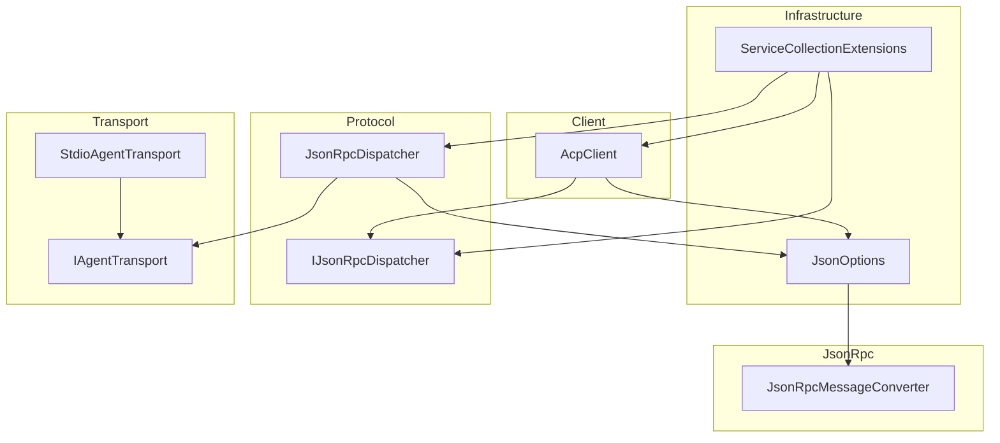
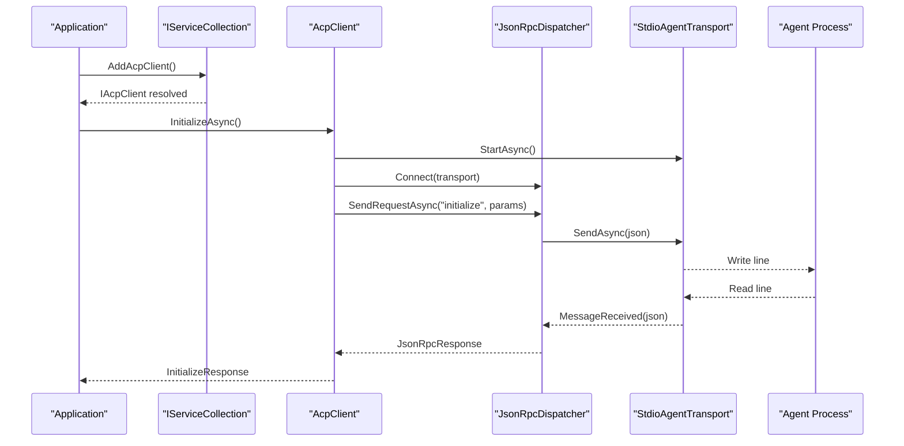
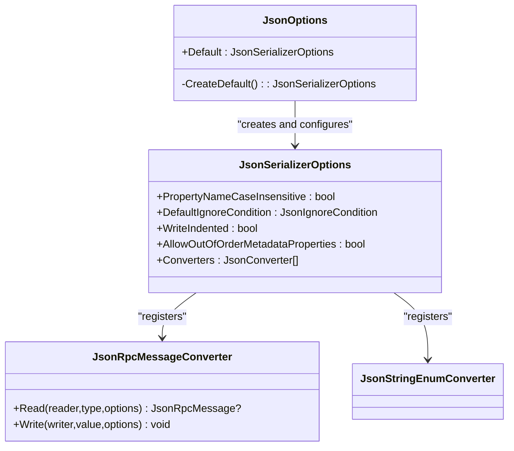
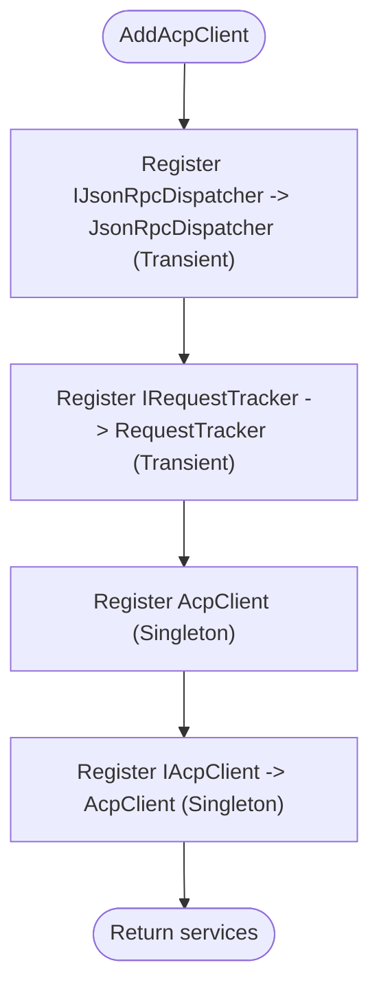
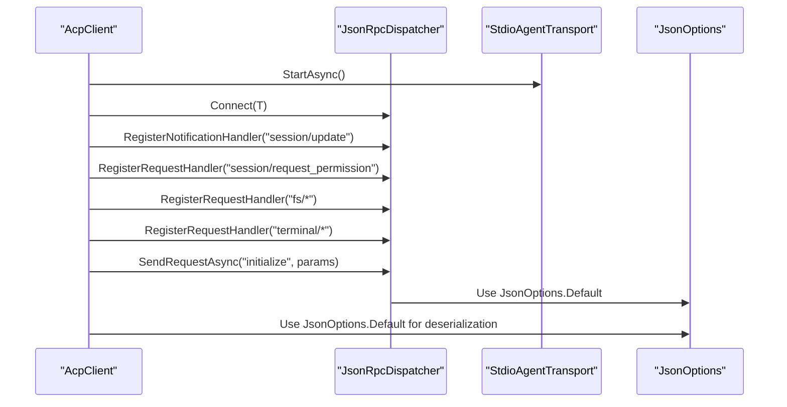
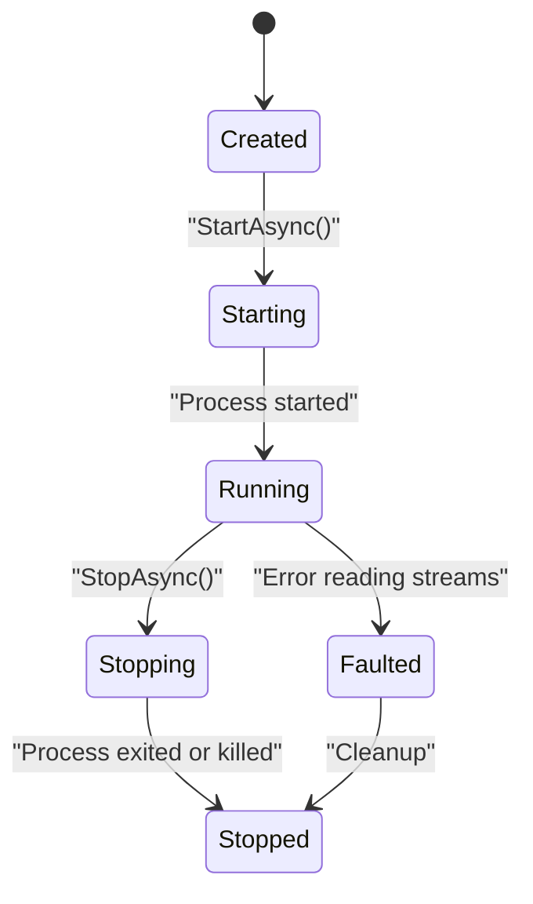
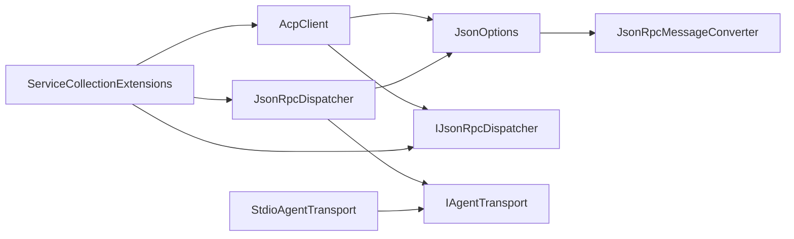

# Configuration and Setup

<cite>
**Referenced Files in This Document**
- [JsonOptions.cs](file://Infrastructure/JsonOptions.cs)
- [ServiceCollectionExtensions.cs](file://Infrastructure/ServiceCollectionExtensions.cs)
- [AcpClient.cs](file://Client/AcpClient.cs)
- [IJsonRpcDispatcher.cs](file://Protocol/IJsonRpcDispatcher.cs)
- [JsonRpcDispatcher.cs](file://Protocol/JsonRpcDispatcher.cs)
- [IAgentTransport.cs](file://Transport/IAgentTransport.cs)
- [StdioAgentTransport.cs](file://Transport/StdioAgentTransport.cs)
- [JsonRpcMessageConverter.cs](file://JsonRpc/JsonRpcMessageConverter.cs)
- [README.md](file://README.md)
- [Agentic.ACPLibrary.csproj](file://Agentic.ACPLibrary.csproj)
</cite>

## Table of Contents
1. [Introduction](#introduction)
2. [Project Structure](#project-structure)
3. [Core Components](#core-components)
4. [Architecture Overview](#architecture-overview)
5. [Detailed Component Analysis](#detailed-component-analysis)
6. [Dependency Analysis](#dependency-analysis)
7. [Performance Considerations](#performance-considerations)
8. [Troubleshooting Guide](#troubleshooting-guide)
9. [Conclusion](#conclusion)
10. [Appendices](#appendices)

## Introduction
This document explains how to configure System.Text.Json serialization and integrate the library with Microsoft.Extensions.DependencyInjection (DI). It focuses on:
- JsonOptions for global JSON settings used across the library
- ServiceCollectionExtensions for registering core services into the DI container
- Practical examples for logging integration, custom JSON serializers, and service registration patterns
- Production best practices, performance tuning, environment-specific configuration, and secure secret management

The library targets .NET 10 and uses System.Text.Json and Microsoft.Extensions.DependencyInjection.Abstractions as primary dependencies.

**Section sources**
- [Agentic.ACPLibrary.csproj:1-34](file://Agentic.ACPLibrary.csproj#L1-L34)
- [README.md:1-99](file://README.md#L1-L99)

## Project Structure
At a high level, configuration and setup are centered around two infrastructure components:
- JsonOptions: centralizes System.Text.Json options used throughout the library
- ServiceCollectionExtensions: registers ACP client services into the DI container



**Diagram sources**
- [JsonOptions.cs:1-28](file://Infrastructure/JsonOptions.cs#L1-L28)
- [ServiceCollectionExtensions.cs:1-23](file://Infrastructure/ServiceCollectionExtensions.cs#L1-L23)
- [AcpClient.cs:1-361](file://Client/AcpClient.cs#L1-L361)
- [IJsonRpcDispatcher.cs:1-14](file://Protocol/IJsonRpcDispatcher.cs#L1-L14)
- [JsonRpcDispatcher.cs:1-124](file://Protocol/JsonRpcDispatcher.cs#L1-L124)
- [IAgentTransport.cs:1-39](file://Transport/IAgentTransport.cs#L1-L39)
- [StdioAgentTransport.cs:1-147](file://Transport/StdioAgentTransport.cs#L1-L147)
- [JsonRpcMessageConverter.cs:1-73](file://JsonRpc/JsonRpcMessageConverter.cs#L1-L73)

**Section sources**
- [JsonOptions.cs:1-28](file://Infrastructure/JsonOptions.cs#L1-L28)
- [ServiceCollectionExtensions.cs:1-23](file://Infrastructure/ServiceCollectionExtensions.cs#L1-L23)

## Core Components
- JsonOptions: Provides a shared JsonSerializerOptions instance configured for case-insensitive property names, null handling, compact output, and out-of-order metadata properties. It also registers a custom converter for polymorphic JSON-RPC messages and an enum string converter.
- ServiceCollectionExtensions.AddAcpClient: Registers the dispatcher, request tracker, and ACP client into the DI container with appropriate lifetimes.

Key behaviors:
- Global JSON options are reused via a static Default property to avoid repeated allocations.
- The ACP client uses these options consistently when serializing/deserializing protocol messages.
- The DI extension wires up core types so applications can resolve IAcpClient from the container.

**Section sources**
- [JsonOptions.cs:1-28](file://Infrastructure/JsonOptions.cs#L1-L28)
- [ServiceCollectionExtensions.cs:1-23](file://Infrastructure/ServiceCollectionExtensions.cs#L1-L23)
- [AcpClient.cs:1-361](file://Client/AcpClient.cs#L1-L361)

## Architecture Overview
The library composes three layers:
- Transport layer: StdioAgentTransport manages a child process and stdio streams.
- Protocol layer: JsonRpcDispatcher handles JSON-RPC message routing, request tracking, and handler dispatch.
- Client layer: AcpClient orchestrates initialization, session lifecycle, and eventing, using the transport and dispatcher.

Serialization is centralized through JsonOptions, which includes a custom converter for polymorphic JSON-RPC messages.



**Diagram sources**
- [ServiceCollectionExtensions.cs:1-23](file://Infrastructure/ServiceCollectionExtensions.cs#L1-L23)
- [AcpClient.cs:48-182](file://Client/AcpClient.cs#L48-L182)
- [JsonRpcDispatcher.cs:27-47](file://Protocol/JsonRpcDispatcher.cs#L27-L47)
- [StdioAgentTransport.cs:30-59](file://Transport/StdioAgentTransport.cs#L30-L59)

## Detailed Component Analysis

### JsonOptions: System.Text.Json Configuration
Responsibilities:
- Provide a single, reusable JsonSerializerOptions instance
- Configure property name matching and null handling
- Optimize output size and allow out-of-order metadata properties
- Register converters for polymorphic JSON-RPC messages and enums

Configuration highlights:
- PropertyNameCaseInsensitive: true
- DefaultIgnoreCondition: WhenWritingNull
- WriteIndented: false
- AllowOutOfOrderMetadataProperties: true
- Converters: JsonRpcMessageConverter, JsonStringEnumConverter

Usage pattern:
- All serialization/deserialization in the library passes JsonOptions.Default to ensure consistent behavior.



**Diagram sources**
- [JsonOptions.cs:1-28](file://Infrastructure/JsonOptions.cs#L1-L28)
- [JsonRpcMessageConverter.cs:1-73](file://JsonRpc/JsonRpcMessageConverter.cs#L1-L73)

**Section sources**
- [JsonOptions.cs:1-28](file://Infrastructure/JsonOptions.cs#L1-L28)
- [JsonRpcMessageConverter.cs:1-73](file://JsonRpc/JsonRpcMessageConverter.cs#L1-L73)

### ServiceCollectionExtensions: DI Integration
Responsibilities:
- Register IJsonRpcDispatcher and RequestTracker as transient
- Register AcpClient and IAcpClient as singletons
- Return IServiceCollection for chaining

Lifetime strategy:
- Transient dispatcher and tracker per operation
- Singleton client to share state across calls within the application lifetime



**Diagram sources**
- [ServiceCollectionExtensions.cs:1-23](file://Infrastructure/ServiceCollectionExtensions.cs#L1-L23)

**Section sources**
- [ServiceCollectionExtensions.cs:1-23](file://Infrastructure/ServiceCollectionExtensions.cs#L1-L23)

### AcpClient: Serialization Usage and Events
Responsibilities:
- Manage transport lifecycle and initialize handshake
- Subscribe to session/update notifications and agent process exit events
- Serialize/deserialize all protocol messages using JsonOptions.Default
- Expose extensibility points for custom handlers

Key interactions:
- Uses JsonOptions.Default for every SerializeToElement and Deserialize call
- Wires up built-in handlers for permission, file system, and terminal methods
- Emits SessionUpdated and AgentProcessExited events



**Diagram sources**
- [AcpClient.cs:48-182](file://Client/AcpClient.cs#L48-L182)
- [JsonOptions.cs:1-28](file://Infrastructure/JsonOptions.cs#L1-L28)

**Section sources**
- [AcpClient.cs:1-361](file://Client/AcpClient.cs#L1-L361)

### JsonRpcDispatcher: Request Tracking and Routing
Responsibilities:
- Track pending requests and match responses by id
- Serialize requests and notifications using JsonOptions.Default
- Route incoming messages to registered handlers
- Disconnect cleanly and cancel pending requests


**Diagram sources**
- [JsonRpcDispatcher.cs:27-47](file://Protocol/JsonRpcDispatcher.cs#L27-L47)

**Section sources**
- [JsonRpcDispatcher.cs:1-124](file://Protocol/JsonRpcDispatcher.cs#L1-L124)

### StdioAgentTransport: Process Lifecycle and Streams
Responsibilities:
- Start a child process with stdio redirection
- Read stdout lines and raise MessageReceived
- Handle stderr for diagnostics
- Gracefully stop and kill the process if needed



**Diagram sources**
- [StdioAgentTransport.cs:30-93](file://Transport/StdioAgentTransport.cs#L30-L93)

**Section sources**
- [StdioAgentTransport.cs:1-147](file://Transport/StdioAgentTransport.cs#L1-L147)

### JsonRpcMessageConverter: Polymorphic Message Handling
Responsibilities:
- Inspect JSON fields to determine whether a message is a request, notification, or response
- Deserialize into the correct concrete type using inner options that exclude this converter to prevent recursion

```mermaid
flowchart TD
Start(["Read(ref reader,type,options)"]) --> Parse["ParseValue to JsonDocument"]
Parse --> Inspect{"Inspect fields:<br/>method,id,result,error"}
Inspect --> |hasMethod && hasId| ToRequest["Deserialize as JsonRpcRequest"]
Inspect --> |hasMethod && !hasId| ToNotify["Deserialize as JsonRpcNotification"]
Inspect --> |hasResult || hasError| ToResponse["Deserialize as JsonRpcResponse"]
Inspect --> |else| ToBase["Deserialize as JsonRpcMessage"]
ToRequest --> InnerOpts["Use inner options without this converter"]
ToNotify --> InnerOpts
ToResponse --> InnerOpts
ToBase --> InnerOpts
InnerOpts --> End(["Return typed message"])
```

**Diagram sources**
- [JsonRpcMessageConverter.cs:11-32](file://JsonRpc/JsonRpcMessageConverter.cs#L11-L32)
- [JsonRpcMessageConverter.cs:55-71](file://JsonRpc/JsonRpcMessageConverter.cs#L55-L71)

**Section sources**
- [JsonRpcMessageConverter.cs:1-73](file://JsonRpc/JsonRpcMessageConverter.cs#L1-L73)

## Dependency Analysis
The library’s dependency graph shows clear separation between transport, protocol, and client layers, with configuration centralized in JsonOptions and DI wiring in ServiceCollectionExtensions.



**Diagram sources**
- [JsonOptions.cs:1-28](file://Infrastructure/JsonOptions.cs#L1-L28)
- [AcpClient.cs:1-361](file://Client/AcpClient.cs#L1-L361)
- [JsonRpcDispatcher.cs:1-124](file://Protocol/JsonRpcDispatcher.cs#L1-L124)
- [IAgentTransport.cs:1-39](file://Transport/IAgentTransport.cs#L1-L39)
- [StdioAgentTransport.cs:1-147](file://Transport/StdioAgentTransport.cs#L1-L147)
- [ServiceCollectionExtensions.cs:1-23](file://Infrastructure/ServiceCollectionExtensions.cs#L1-L23)

**Section sources**
- [Agentic.ACPLibrary.csproj:22-26](file://Agentic.ACPLibrary.csproj#L22-L26)

## Performance Considerations
- Reuse JsonSerializerOptions: JsonOptions.Default provides a single, cached instance to minimize allocations.
- Compact output: WriteIndented is disabled to reduce payload size over stdio.
- Null handling: DefaultIgnoreCondition.WhenWritingNull reduces unnecessary fields.
- Case-insensitive properties: Improves resilience against minor schema differences at the cost of slight parsing overhead.
- Custom converter optimization: JsonRpcMessageConverter caches inner options to avoid recreating options and prevents recursive conversion.

Recommendations:
- Keep JsonOptions.Default unchanged unless you have specific needs; any changes should be validated under load.
- Avoid creating new JsonSerializerOptions per call; reuse the default where possible.
- Monitor memory usage when processing large payloads; consider streaming approaches if needed.

[No sources needed since this section provides general guidance]

## Troubleshooting Guide
Common issues and resolutions:
- Dispatcher not connected: Ensure Connect(transport) is called before sending requests. The dispatcher throws when not connected.
- Transport not running: Verify StartAsync completed successfully and State is Running before sending messages.
- Protocol version mismatch: The client logs warnings if the agent reports a different protocol version.
- Missing handlers: If PermissionHandler, FileSystemHandler, or TerminalHandler are not set, the client returns errors indicating unavailability.
- JSON deserialization failures: Confirm JsonOptions.Default converters are present and that payloads match expected schemas.

Debugging tips:
- Enable logging via ILogger<AcpClient> to trace initialization, session creation, and errors.
- Observe TransportFaulted and AgentProcessExited events to detect runtime issues.
- Validate JSON payloads manually when diagnosing serialization problems.

**Section sources**
- [JsonRpcDispatcher.cs:27-31](file://Protocol/JsonRpcDispatcher.cs#L27-L31)
- [StdioAgentTransport.cs:61-68](file://Transport/StdioAgentTransport.cs#L61-L68)
- [AcpClient.cs:176-179](file://Client/AcpClient.cs#L176-L179)
- [AcpClient.cs:74-99](file://Client/AcpClient.cs#L74-L99)

## Conclusion
This library centralizes JSON configuration through JsonOptions and simplifies DI integration via ServiceCollectionExtensions. By following the recommended patterns—reusing JsonOptions.Default, wiring services with appropriate lifetimes, and leveraging logging—you can build robust ACP clients. For production, focus on performance tuning, environment-specific configuration, and secure secret management as outlined below.

[No sources needed since this section summarizes without analyzing specific files]

## Appendices

### Examples: Configuring Logging Integration
- Resolve ILogger<AcpClient> from your DI container and pass it to AcpClient constructor.
- Configure logging providers (Console, Debug, etc.) in your application startup.

Example steps:
- In Program.cs or Startup, add logging configuration.
- Resolve IAcpClient from DI; AcpClient will use the provided logger.

**Section sources**
- [AcpClient.cs:40-45](file://Client/AcpClient.cs#L40-L45)
- [README.md:15-25](file://README.md#L15-L25)

### Examples: Setting Up Custom JSON Serializers
- Extend JsonOptions.Default by adding additional converters if needed.
- Ensure converters do not conflict with existing ones (e.g., avoid duplicate enum converters).
- Validate that custom converters work with polymorphic JSON-RPC messages.

Best practice:
- Centralize all customizations in a single place to maintain consistency across the application.

**Section sources**
- [JsonOptions.cs:15-26](file://Infrastructure/JsonOptions.cs#L15-L26)
- [JsonRpcMessageConverter.cs:55-71](file://JsonRpc/JsonRpcMessageConverter.cs#L55-L71)

### Examples: Registering Services in Different Application Contexts
- Console apps: Call AddAcpClient during program initialization.
- Web apps: Register services in ConfigureServices and resolve IAcpClient from scoped or singleton scopes depending on usage.
- Worker services: Register once at startup and manage client lifecycle explicitly.

Lifetime guidance:
- AcpClient is registered as a singleton; ensure thread-safety if sharing across threads.
- Dispatcher and tracker are transient; they are created per operation.

**Section sources**
- [ServiceCollectionExtensions.cs:14-21](file://Infrastructure/ServiceCollectionExtensions.cs#L14-L21)

### Production Best Practices
- Use JsonOptions.Default globally; avoid per-call allocations.
- Enable structured logging and correlate requests with IDs.
- Monitor process health via TransportState and AgentProcessExited events.
- Set timeouts for operations and handle cancellation tokens appropriately.

[No sources needed since this section provides general guidance]

### Environment-Specific Configurations
- Store command paths and arguments for StdioAgentTransport in environment variables.
- Use configuration providers (appsettings.json, environment variables, Azure Key Vault) to load settings at startup.
- Switch transports based on environment (e.g., mock transport for tests).

[No sources needed since this section provides general guidance]

### Secure Secret Management Patterns
- Do not hardcode secrets in code or configs.
- Use secure storage (OS keychain, managed identity, secret managers) to retrieve sensitive values.
- Pass secrets only to necessary components and avoid logging them.

[No sources needed since this section provides general guidance]