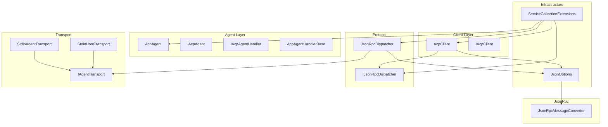
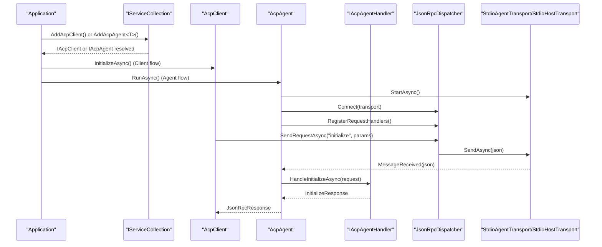
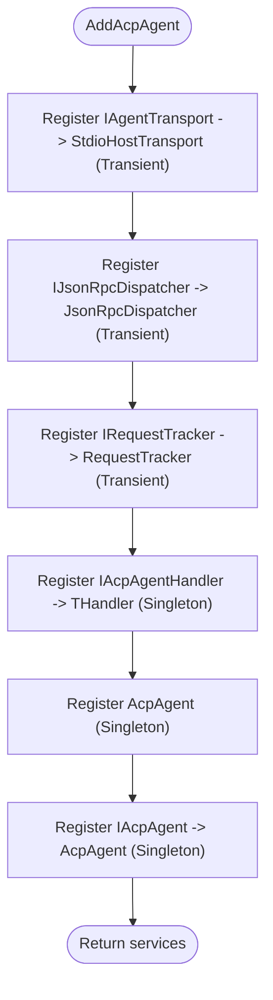
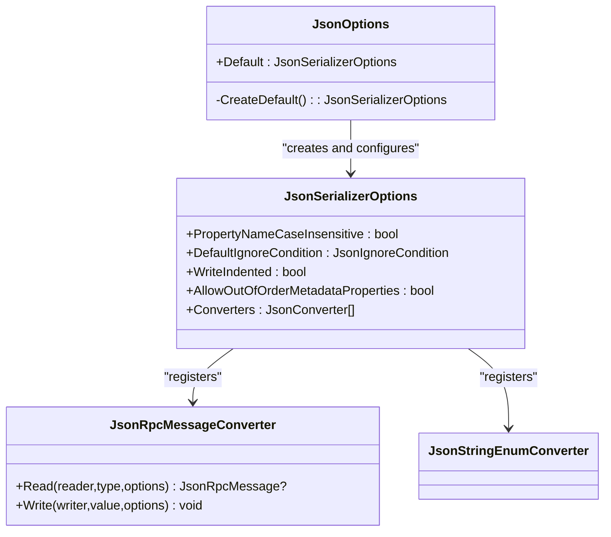
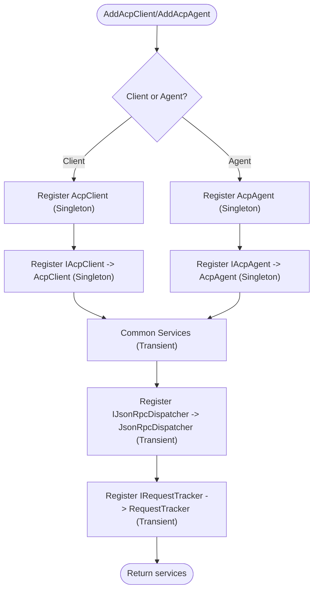
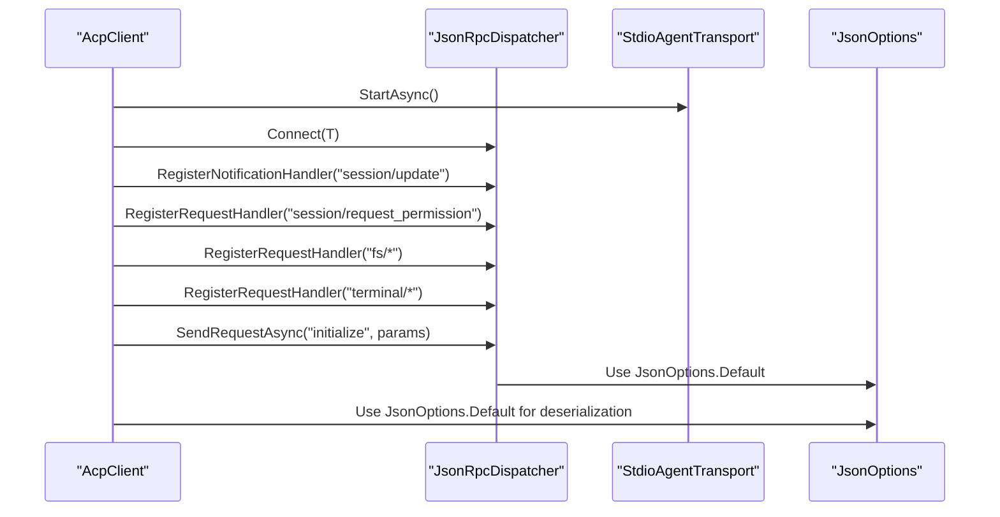
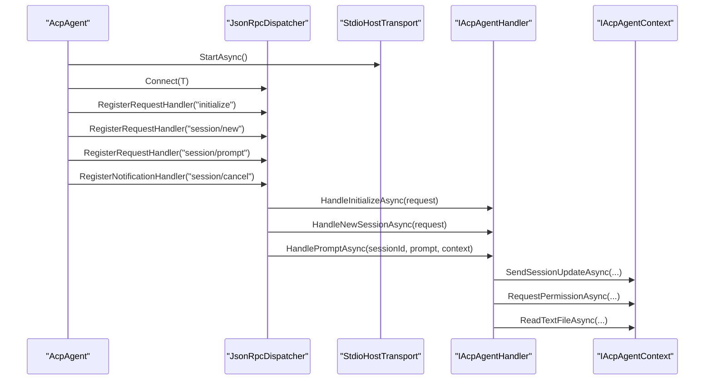
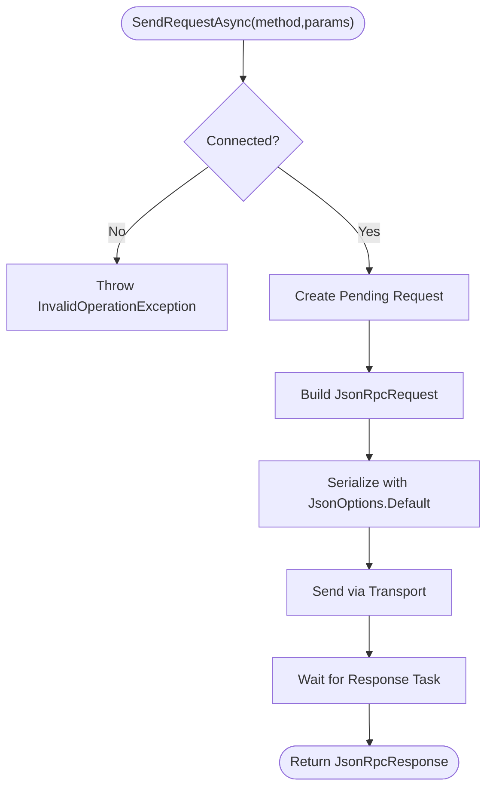
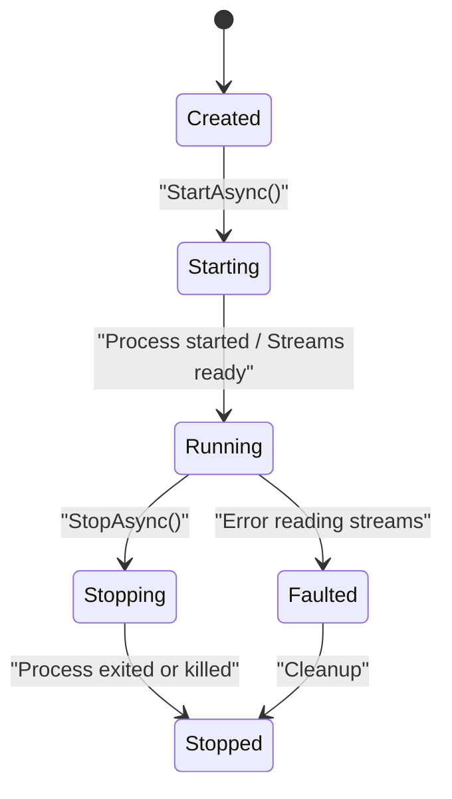
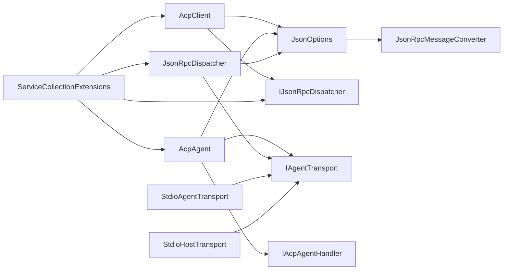

# Configuration and Setup

<cite>
**Referenced Files in This Document**
- [JsonOptions.cs](file://Infrastructure/JsonOptions.cs)
- [ServiceCollectionExtensions.cs](file://Infrastructure/ServiceCollectionExtensions.cs)
- [AcpClient.cs](file://Client/AcpClient.cs)
- [AcpAgent.cs](file://Agent/AcpAgent.cs)
- [IAcpAgent.cs](file://Agent/IAcpAgent.cs)
- [IAcpAgentHandler.cs](file://Agent/IAcpAgentHandler.cs)
- [AcpAgentHandlerBase.cs](file://Agent/AcpAgentHandlerBase.cs)
- [StdioHostTransport.cs](file://Transport/StdioHostTransport.cs)
- [IJsonRpcDispatcher.cs](file://Protocol/IJsonRpcDispatcher.cs)
- [JsonRpcDispatcher.cs](file://Protocol/JsonRpcDispatcher.cs)
- [IAgentTransport.cs](file://Transport/IAgentTransport.cs)
- [StdioAgentTransport.cs](file://Transport/StdioAgentTransport.cs)
- [JsonRpcMessageConverter.cs](file://JsonRpc/JsonRpcMessageConverter.cs)
- [README.md](file://README.md)
- [Agentic.ACPLibrary.csproj](file://Agentic.ACPLibrary.csproj)
</cite>

## Update Summary
**Changes Made**
- Added comprehensive documentation for the new `AddAcpAgent<THandler>` extension method
- Updated ServiceCollectionExtensions section to cover both client and agent registration
- Added new Agent Architecture Overview section
- Enhanced examples to include agent setup patterns
- Updated dependency analysis to include agent components
- Added agent-specific troubleshooting and best practices

## Table of Contents
1. [Introduction](#introduction)
2. [Project Structure](#project-structure)
3. [Core Components](#core-components)
4. [Architecture Overview](#architecture-overview)
5. [Agent Architecture](#agent-architecture)
6. [Detailed Component Analysis](#detailed-component-analysis)
7. [Dependency Analysis](#dependency-analysis)
8. [Performance Considerations](#performance-considerations)
9. [Troubleshooting Guide](#troubleshooting-guide)
10. [Conclusion](#conclusion)
11. [Appendices](#appendices)

## Introduction
This document explains how to configure System.Text.Json serialization and integrate the library with Microsoft.Extensions.DependencyInjection (DI). It focuses on:
- JsonOptions for global JSON settings used across the library
- ServiceCollectionExtensions for registering both ACP clients and agents into the DI container
- Practical examples for logging integration, custom JSON serializers, and service registration patterns
- Production best practices, performance tuning, environment-specific configuration, and secure secret management

The library targets .NET 10 and uses System.Text.Json and Microsoft.Extensions.DependencyInjection.Abstractions as primary dependencies.

**Section sources**
- [Agentic.ACPLibrary.csproj:1-34](file://Agentic.ACPLibrary.csproj#L1-L34)
- [README.md:1-99](file://README.md#L1-L99)

## Project Structure
At a high level, configuration and setup are centered around two infrastructure components:
- JsonOptions: centralizes System.Text.Json options used throughout the library
- ServiceCollectionExtensions: registers both ACP client and agent services into the DI container



**Diagram sources**
- [JsonOptions.cs:1-28](file://Infrastructure/JsonOptions.cs#L1-L28)
- [ServiceCollectionExtensions.cs:1-40](file://Infrastructure/ServiceCollectionExtensions.cs#L1-L40)
- [AcpClient.cs:1-361](file://Client/AcpClient.cs#L1-L361)
- [AcpAgent.cs:1-309](file://Agent/AcpAgent.cs#L1-L309)
- [IAcpAgent.cs:1-17](file://Agent/IAcpAgent.cs#L1-L17)
- [IAcpAgentHandler.cs:1-26](file://Agent/IAcpAgentHandler.cs#L1-L26)
- [AcpAgentHandlerBase.cs:1-30](file://Agent/AcpAgentHandlerBase.cs#L1-L30)
- [StdioHostTransport.cs:1-91](file://Transport/StdioHostTransport.cs#L1-L91)
- [IJsonRpcDispatcher.cs:1-14](file://Protocol/IJsonRpcDispatcher.cs#L1-L14)
- [JsonRpcDispatcher.cs:1-124](file://Protocol/JsonRpcDispatcher.cs#L1-L124)
- [IAgentTransport.cs:1-39](file://Transport/IAgentTransport.cs#L1-L39)
- [StdioAgentTransport.cs:1-147](file://Transport/StdioAgentTransport.cs#L1-L147)
- [JsonRpcMessageConverter.cs:1-73](file://JsonRpc/JsonRpcMessageConverter.cs#L1-L73)

**Section sources**
- [JsonOptions.cs:1-28](file://Infrastructure/JsonOptions.cs#L1-L28)
- [ServiceCollectionExtensions.cs:1-40](file://Infrastructure/ServiceCollectionExtensions.cs#L1-L40)

## Core Components
- JsonOptions: Provides a shared JsonSerializerOptions instance configured for case-insensitive property names, null handling, compact output, and out-of-order metadata properties. It also registers a custom converter for polymorphic JSON-RPC messages and an enum string converter.
- ServiceCollectionExtensions.AddAcpClient: Registers the dispatcher, request tracker, and ACP client into the DI container with appropriate lifetimes.
- **New**: ServiceCollectionExtensions.AddAcpAgent<THandler>: Registers transport, dispatcher, request tracker, agent handler, and ACP agent into the DI container with appropriate lifetimes.

Key behaviors:
- Global JSON options are reused via a static Default property to avoid repeated allocations.
- The ACP client and agent use these options consistently when serializing/deserializing protocol messages.
- The DI extensions wire up core types so applications can resolve IAcpClient or IAcpAgent from the container.
- Agents require a concrete implementation of IAcpAgentHandler to handle incoming requests.

**Section sources**
- [JsonOptions.cs:1-28](file://Infrastructure/JsonOptions.cs#L1-L28)
- [ServiceCollectionExtensions.cs:1-40](file://Infrastructure/ServiceCollectionExtensions.cs#L1-L40)
- [AcpClient.cs:1-361](file://Client/AcpClient.cs#L1-L361)
- [AcpAgent.cs:1-309](file://Agent/AcpAgent.cs#L1-L309)

## Architecture Overview
The library composes three layers for both clients and agents:
- Transport layer: StdioAgentTransport manages a child process and stdio streams (client-side), while StdioHostTransport handles stdin/stdout communication (agent-side).
- Protocol layer: JsonRpcDispatcher handles JSON-RPC message routing, request tracking, and handler dispatch.
- Client layer: AcpClient orchestrates initialization, session lifecycle, and eventing, using the transport and dispatcher.
- **New**: Agent layer: AcpAgent mirrors the client functionality but accepts connections and dispatches requests to user-provided handlers.

Serialization is centralized through JsonOptions, which includes a custom converter for polymorphic JSON-RPC messages.



**Diagram sources**
- [ServiceCollectionExtensions.cs:15-38](file://Infrastructure/ServiceCollectionExtensions.cs#L15-L38)
- [AcpClient.cs:48-182](file://Client/AcpClient.cs#L48-L182)
- [AcpAgent.cs:44-179](file://Agent/AcpAgent.cs#L44-L179)
- [JsonRpcDispatcher.cs:27-47](file://Protocol/JsonRpcDispatcher.cs#L27-L47)
- [StdioAgentTransport.cs:30-59](file://Transport/StdioAgentTransport.cs#L30-L59)
- [StdioHostTransport.cs:23-37](file://Transport/StdioHostTransport.cs#L23-L37)

## Agent Architecture
The agent architecture mirrors the client architecture but operates in reverse - it accepts connections from clients and processes their requests through user-defined handlers.

### Agent Registration Pattern
The `AddAcpAgent<THandler>` extension method provides a fluent API for setting up agents:



**Diagram sources**
- [ServiceCollectionExtensions.cs:28-38](file://Infrastructure/ServiceCollectionExtensions.cs#L28-L38)

### Agent Lifecycle Management
Agents follow a similar lifecycle pattern to clients but with reversed communication direction:

1. **Initialization**: Agent starts transport and connects dispatcher
2. **Handler Registration**: Built-in handlers register request/response handlers for protocol methods
3. **Request Processing**: Incoming requests are dispatched to user-implemented handlers
4. **Session Management**: Active sessions are tracked and managed for cancellation support
5. **Graceful Shutdown**: All active sessions are cancelled and resources are cleaned up

**Section sources**
- [AcpAgent.cs:44-201](file://Agent/AcpAgent.cs#L44-L201)
- [IAcpAgent.cs:6-16](file://Agent/IAcpAgent.cs#L6-L16)
- [IAcpAgentHandler.cs:8-25](file://Agent/IAcpAgentHandler.cs#L8-L25)

## Detailed Component Analysis

### JsonOptions: System.Text.Json Configuration
Responsibilities:
- Provide a single, reusable JsonSerializerOptions instance
- Configure property name matching and null handling
- Optimize output size and allow out-of-order metadata properties
- Register converters for polymorphic JSON-RPC messages and enums

Configuration highlights:
- PropertyNameCaseInsensitive: true
- DefaultIgnoreCondition: WhenWritingNull
- WriteIndented: false
- AllowOutOfOrderMetadataProperties: true
- Converters: JsonRpcMessageConverter, JsonStringEnumConverter

Usage pattern:
- All serialization/deserialization in the library passes JsonOptions.Default to ensure consistent behavior.



**Diagram sources**
- [JsonOptions.cs:1-28](file://Infrastructure/JsonOptions.cs#L1-L28)
- [JsonRpcMessageConverter.cs:1-73](file://JsonRpc/JsonRpcMessageConverter.cs#L1-L73)

**Section sources**
- [JsonOptions.cs:1-28](file://Infrastructure/JsonOptions.cs#L1-L28)
- [JsonRpcMessageConverter.cs:1-73](file://JsonRpc/JsonRpcMessageConverter.cs#L1-L73)

### ServiceCollectionExtensions: DI Integration
Responsibilities:
- Register IJsonRpcDispatcher and RequestTracker as transient
- Register AcpClient and IAcpClient as singletons
- **New**: Register IAgentTransport, IAcpAgentHandler, AcpAgent, and IAcpAgent for agents
- Return IServiceCollection for chaining

Lifetime strategy:
- Transient dispatcher and tracker per operation
- Singleton client and agent to share state across calls within the application lifetime
- Singleton agent handler to maintain state across multiple requests



**Diagram sources**
- [ServiceCollectionExtensions.cs:15-38](file://Infrastructure/ServiceCollectionExtensions.cs#L15-L38)

**Section sources**
- [ServiceCollectionExtensions.cs:1-40](file://Infrastructure/ServiceCollectionExtensions.cs#L1-L40)

### AcpClient: Serialization Usage and Events
Responsibilities:
- Manage transport lifecycle and initialize handshake
- Subscribe to session/update notifications and agent process exit events
- Serialize/deserialize all protocol messages using JsonOptions.Default
- Expose extensibility points for custom handlers

Key interactions:
- Uses JsonOptions.Default for every SerializeToElement and Deserialize call
- Wires up built-in handlers for permission, file system, and terminal methods
- Emits SessionUpdated and AgentProcessExited events



**Diagram sources**
- [AcpClient.cs:48-182](file://Client/AcpClient.cs#L48-L182)
- [JsonOptions.cs:1-28](file://Infrastructure/JsonOptions.cs#L1-L28)

**Section sources**
- [AcpClient.cs:1-361](file://Client/AcpClient.cs#L1-L361)

### AcpAgent: Request Handling and Session Management
**New**: Responsibilities:
- Accept client connections and manage agent lifecycle
- Register built-in request handlers for protocol methods
- Dispatch incoming requests to user-implemented handlers
- Manage active sessions and cancellation tokens
- Provide context for agents to communicate back to clients

Key interactions:
- Uses JsonOptions.Default for all serialization/deserialization operations
- Implements comprehensive error handling with proper JSON-RPC error responses
- Manages concurrent session lifecycle with automatic cleanup
- Provides rich context for agents to access client capabilities



**Diagram sources**
- [AcpAgent.cs:44-179](file://Agent/AcpAgent.cs#L44-L179)
- [IAcpAgentContext.cs:8-40](file://Agent/IAcpAgentContext.cs#L8-L40)

**Section sources**
- [AcpAgent.cs:1-309](file://Agent/AcpAgent.cs#L1-L309)
- [IAcpAgentHandler.cs:1-26](file://Agent/IAcpAgentHandler.cs#L1-L26)
- [IAcpAgentContext.cs:1-41](file://Agent/IAcpAgentContext.cs#L1-L41)

### JsonRpcDispatcher: Request Tracking and Routing
Responsibilities:
- Track pending requests and match responses by id
- Serialize requests and notifications using JsonOptions.Default
- Route incoming messages to registered handlers
- Disconnect cleanly and cancel pending requests



**Diagram sources**
- [JsonRpcDispatcher.cs:27-47](file://Protocol/JsonRpcDispatcher.cs#L27-L47)

**Section sources**
- [JsonRpcDispatcher.cs:1-124](file://Protocol/JsonRpcDispatcher.cs#L1-L124)

### Transport Layer: Client vs Agent Communication
**Updated**: The transport layer now supports both client and agent scenarios:

- **StdioAgentTransport**: Used by clients to spawn and communicate with agent subprocesses
- **StdioHostTransport**: Used by agents to communicate directly via stdin/stdout



**Diagram sources**
- [StdioAgentTransport.cs:30-93](file://Transport/StdioAgentTransport.cs#L30-L93)
- [StdioHostTransport.cs:23-58](file://Transport/StdioHostTransport.cs#L23-L58)

**Section sources**
- [StdioAgentTransport.cs:1-147](file://Transport/StdioAgentTransport.cs#L1-L147)
- [StdioHostTransport.cs:1-91](file://Transport/StdioHostTransport.cs#L1-L91)

### JsonRpcMessageConverter: Polymorphic Message Handling
Responsibilities:
- Inspect JSON fields to determine whether a message is a request, notification, or response
- Deserialize into the correct concrete type using inner options that exclude this converter to prevent recursion

```mermaid
flowchart TD
Start(["Read(ref reader,type,options)"]) --> Parse["ParseValue to JsonDocument"]
Parse --> Inspect{"Inspect fields:<br/>method,id,result,error"}
Inspect --> |hasMethod && hasId| ToRequest["Deserialize as JsonRpcRequest"]
Inspect --> |hasMethod && !hasId| ToNotify["Deserialize as JsonRpcNotification"]
Inspect --> |hasResult || hasError| ToResponse["Deserialize as JsonRpcResponse"]
Inspect --> |else| ToBase["Deserialize as JsonRpcMessage"]
ToRequest --> InnerOpts["Use inner options without this converter"]
ToNotify --> InnerOpts
ToResponse --> InnerOpts
ToBase --> InnerOpts
InnerOpts --> End(["Return typed message"])
```

**Diagram sources**
- [JsonRpcMessageConverter.cs:11-32](file://JsonRpc/JsonRpcMessageConverter.cs#L11-L32)
- [JsonRpcMessageConverter.cs:55-71](file://JsonRpc/JsonRpcMessageConverter.cs#L55-L71)

**Section sources**
- [JsonRpcMessageConverter.cs:1-73](file://JsonRpc/JsonRpcMessageConverter.cs#L1-L73)

## Dependency Analysis
The library's dependency graph shows clear separation between transport, protocol, and client/agent layers, with configuration centralized in JsonOptions and DI wiring in ServiceCollectionExtensions.



**Diagram sources**
- [JsonOptions.cs:1-28](file://Infrastructure/JsonOptions.cs#L1-L28)
- [AcpClient.cs:1-361](file://Client/AcpClient.cs#L1-L361)
- [AcpAgent.cs:1-309](file://Agent/AcpAgent.cs#L1-L309)
- [JsonRpcDispatcher.cs:1-124](file://Protocol/JsonRpcDispatcher.cs#L1-L124)
- [IAgentTransport.cs:1-39](file://Transport/IAgentTransport.cs#L1-L39)
- [StdioAgentTransport.cs:1-147](file://Transport/StdioAgentTransport.cs#L1-L147)
- [StdioHostTransport.cs:1-91](file://Transport/StdioHostTransport.cs#L1-L91)
- [ServiceCollectionExtensions.cs:1-40](file://Infrastructure/ServiceCollectionExtensions.cs#L1-L40)

**Section sources**
- [Agentic.ACPLibrary.csproj:22-26](file://Agentic.ACPLibrary.csproj#L22-L26)

## Performance Considerations
- Reuse JsonSerializerOptions: JsonOptions.Default provides a single, cached instance to minimize allocations.
- Compact output: WriteIndented is disabled to reduce payload size over stdio.
- Null handling: DefaultIgnoreCondition.WhenWritingNull reduces unnecessary fields.
- Case-insensitive properties: Improves resilience against minor schema differences at the cost of slight parsing overhead.
- Custom converter optimization: JsonRpcMessageConverter caches inner options to avoid recreating options and prevents recursive conversion.
- **New**: Agent handler singleton pattern: Handlers are registered as singletons to maintain state across requests while minimizing object creation overhead.

Recommendations:
- Keep JsonOptions.Default unchanged unless you have specific needs; any changes should be validated under load.
- Avoid creating new JsonSerializerOptions per call; reuse the default where possible.
- Monitor memory usage when processing large payloads; consider streaming approaches if needed.
- For agents, implement efficient handlers that don't hold excessive state between requests.

[No sources needed since this section provides general guidance]

## Troubleshooting Guide
Common issues and resolutions:
- Dispatcher not connected: Ensure Connect(transport) is called before sending requests. The dispatcher throws when not connected.
- Transport not running: Verify StartAsync completed successfully and State is Running before sending messages.
- Protocol version mismatch: The client logs warnings if the agent reports a different protocol version.
- Missing handlers: If PermissionHandler, FileSystemHandler, or TerminalHandler are not set, the client returns errors indicating unavailability.
- JSON deserialization failures: Confirm JsonOptions.Default converters are present and that payloads match expected schemas.
- **New**: Agent handler not found: Ensure your IAcpAgentHandler implementation is properly registered with AddAcpAgent<T>().
- **New**: Agent process exits immediately: Check that the agent's RunAsync method is called and that the process stays alive.

Debugging tips:
- Enable logging via ILogger<AcpClient> or ILogger<AcpAgent> to trace initialization, session creation, and errors.
- Observe TransportFaulted and AgentProcessExited events to detect runtime issues.
- Validate JSON payloads manually when diagnosing serialization problems.
- For agents, monitor stderr output for diagnostic information while keeping stdout clean for JSON-RPC communication.

**Section sources**
- [JsonRpcDispatcher.cs:27-31](file://Protocol/JsonRpcDispatcher.cs#L27-L31)
- [StdioAgentTransport.cs:61-68](file://Transport/StdioAgentTransport.cs#L61-L68)
- [StdioHostTransport.cs:76-79](file://Transport/StdioHostTransport.cs#L76-L79)
- [AcpClient.cs:176-179](file://Client/AcpClient.cs#L176-L179)
- [AcpClient.cs:74-99](file://Client/AcpClient.cs#L74-L99)
- [AcpAgent.cs:176-179](file://Agent/AcpAgent.cs#L176-179)

## Conclusion
This library centralizes JSON configuration through JsonOptions and simplifies DI integration via ServiceCollectionExtensions. By following the recommended patterns—reusing JsonOptions.Default, wiring services with appropriate lifetimes, and leveraging logging—you can build robust ACP clients and agents. The enhanced dependency injection support makes it easier to set up both clients and agents using standard .NET patterns. For production, focus on performance tuning, environment-specific configuration, and secure secret management as outlined below.

[No sources needed since this section summarizes without analyzing specific files]

## Appendices

### Examples: Configuring Logging Integration
- Resolve ILogger<AcpClient> or ILogger<AcpAgent> from your DI container and pass it to the respective constructor.
- Configure logging providers (Console, Debug, etc.) in your application startup.

Example steps:
- In Program.cs or Startup, add logging configuration.
- Resolve IAcpClient or IAcpAgent from DI; both will use the provided logger.

**Section sources**
- [AcpClient.cs:40-45](file://Client/AcpClient.cs#L40-L45)
- [AcpAgent.cs:32-42](file://Agent/AcpAgent.cs#L32-L42)
- [README.md:15-25](file://README.md#L15-L25)

### Examples: Setting Up Custom JSON Serializers
- Extend JsonOptions.Default by adding additional converters if needed.
- Ensure converters do not conflict with existing ones (e.g., avoid duplicate enum converters).
- Validate that custom converters work with polymorphic JSON-RPC messages.

Best practice:
- Centralize all customizations in a single place to maintain consistency across the application.

**Section sources**
- [JsonOptions.cs:15-26](file://Infrastructure/JsonOptions.cs#L15-L26)
- [JsonRpcMessageConverter.cs:55-71](file://JsonRpc/JsonRpcMessageConverter.cs#L55-L71)

### Examples: Registering Services in Different Application Contexts
- Console apps: Call AddAcpClient during program initialization for clients, or AddAcpAgent<T>() for agents.
- Web apps: Register services in ConfigureServices and resolve IAcpClient from scoped or singleton scopes depending on usage.
- Worker services: Register once at startup and manage client/agent lifecycle explicitly.
- **New**: Agent applications: Use AddAcpAgent<T>() in the agent process and implement IAcpAgentHandler.

Lifetime guidance:
- AcpClient and AcpAgent are registered as singletons; ensure thread-safety if sharing across threads.
- Dispatcher and tracker are transient; they are created per operation.
- Agent handlers are singletons; design them to be stateless or carefully manage shared state.

**Section sources**
- [ServiceCollectionExtensions.cs:15-38](file://Infrastructure/ServiceCollectionExtensions.cs#L15-L38)
- [samples/MockAgent/Program.cs:10-16](file://samples/MockAgent/Program.cs#L10-L16)

### Examples: Setting Up ACP Agents with Dependency Injection
**New**: Complete example of agent setup using the new AddAcpAgent<T> extension:

```csharp
// In your agent application
var services = new ServiceCollection()
    .AddAcpAgent<MyCustomAgentHandler>()
    .BuildServiceProvider();

await using var agent = services.GetRequiredService<IAcpAgent>();
await agent.RunAsync();
```

Key benefits:
- Standard .NET DI patterns for agent setup
- Automatic dependency resolution for transports, dispatchers, and handlers
- Consistent lifecycle management across client and agent applications
- Easy testing with mock implementations

**Section sources**
- [ServiceCollectionExtensions.cs:28-38](file://Infrastructure/ServiceCollectionExtensions.cs#L28-L38)
- [samples/MockAgent/Program.cs:10-16](file://samples/MockAgent/Program.cs#L10-L16)

### Production Best Practices
- Use JsonOptions.Default globally; avoid per-call allocations.
- Enable structured logging and correlate requests with IDs.
- Monitor process health via TransportState and AgentProcessExited events.
- Set timeouts for operations and handle cancellation tokens appropriately.
- **New**: For agents, implement proper graceful shutdown to handle client disconnections.
- **New**: Design agent handlers to be thread-safe and handle concurrent requests efficiently.

[No sources needed since this section provides general guidance]

### Environment-Specific Configurations
- Store command paths and arguments for StdioAgentTransport in environment variables.
- Use configuration providers (appsettings.json, environment variables, Azure Key Vault) to load settings at startup.
- Switch transports based on environment (e.g., mock transport for tests).
- **New**: Configure agent handlers differently for development vs production environments.

[No sources needed since this section provides general guidance]

### Secure Secret Management Patterns
- Do not hardcode secrets in code or configs.
- Use secure storage (OS keychain, managed identity, secret managers) to retrieve sensitive values.
- Pass secrets only to necessary components and avoid logging them.
- **New**: For agents, ensure sensitive data passed to handlers is properly secured and logged safely.

[No sources needed since this section provides general guidance]

### Agent Handler Implementation Patterns
**New**: Best practices for implementing IAcpAgentHandler:

1. **Stateless Design**: Prefer stateless handlers that don't rely on shared mutable state
2. **Thread Safety**: Ensure handlers are thread-safe for concurrent request processing
3. **Resource Management**: Properly dispose of resources like database connections and file handles
4. **Error Handling**: Implement comprehensive error handling with meaningful error messages
5. **Cancellation Support**: Respect cancellation tokens for long-running operations
6. **Logging**: Log important operations and errors for debugging and monitoring

Example patterns:
- Use dependency injection to inject services into handlers
- Implement proper async/await patterns for I/O operations
- Handle edge cases like network failures and resource exhaustion
- Provide meaningful status updates through session updates

**Section sources**
- [IAcpAgentHandler.cs:8-25](file://Agent/IAcpAgentHandler.cs#L8-L25)
- [AcpAgentHandlerBase.cs:9-29](file://Agent/AcpAgentHandlerBase.cs#L9-L29)
- [MockAgentHandler.cs:16-107](file://samples/MockAgent/MockAgentHandler.cs#L16-L107)