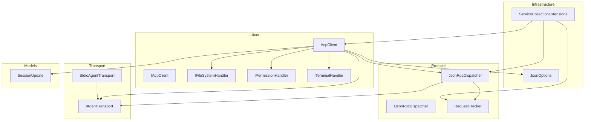
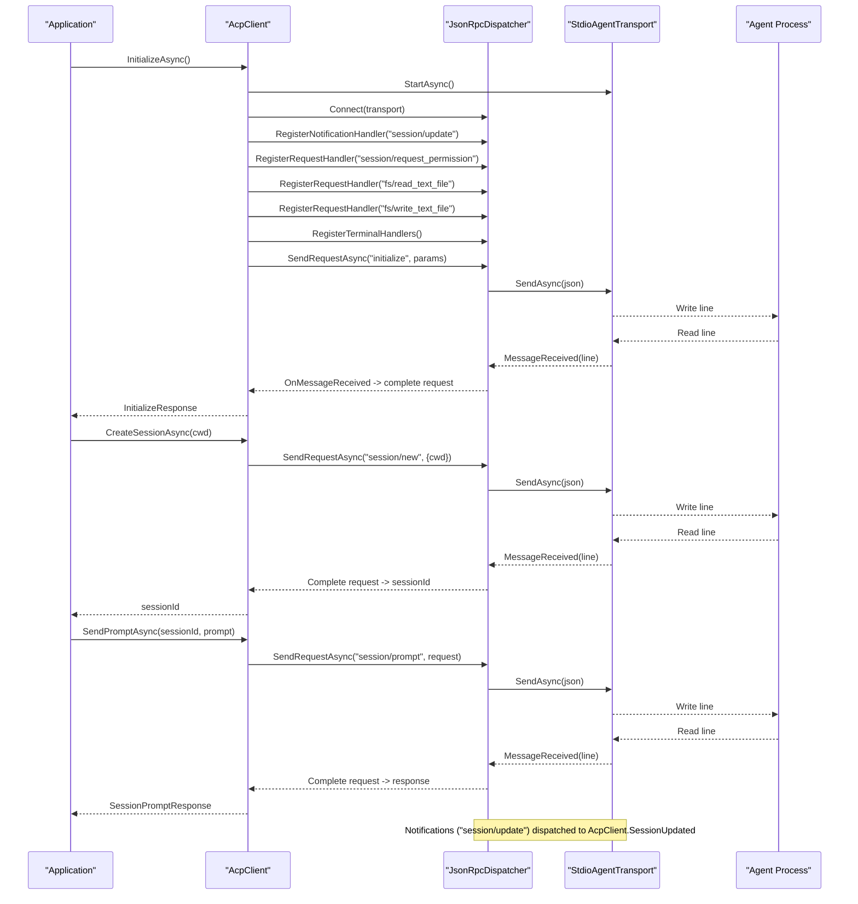
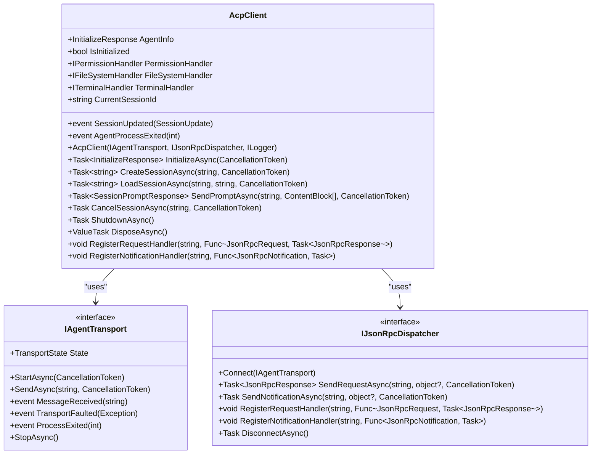
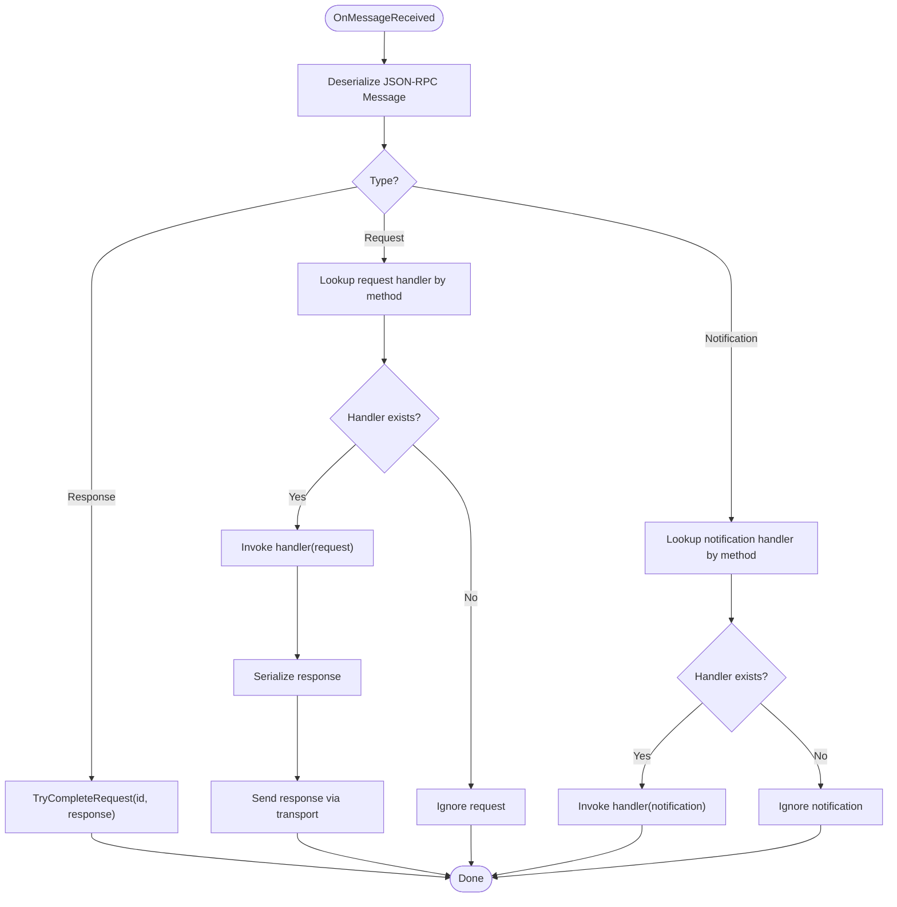
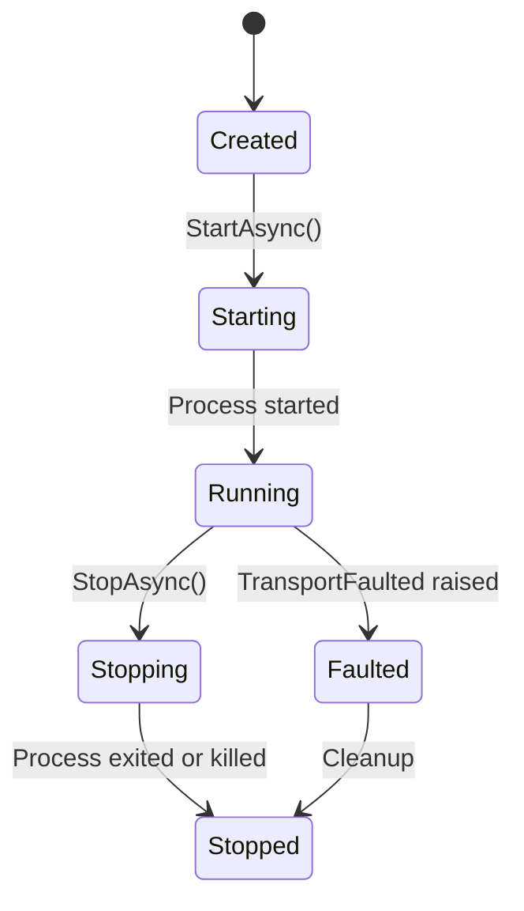
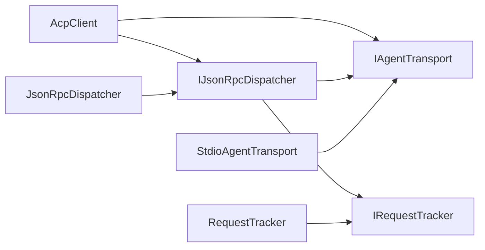

# AcpClient Implementation

<cite>
**Referenced Files in This Document**
- [AcpClient.cs](file://Client/AcpClient.cs)
- [IAcpClient.cs](file://Client/IAcpClient.cs)
- [IFileSystemHandler.cs](file://Client/IFileSystemHandler.cs)
- [IPermissionHandler.cs](file://Client/IPermissionHandler.cs)
- [ITerminalHandler.cs](file://Client/ITerminalHandler.cs)
- [JsonRpcDispatcher.cs](file://Protocol/JsonRpcDispatcher.cs)
- [IJsonRpcDispatcher.cs](file://Protocol/IJsonRpcDispatcher.cs)
- [RequestTracker.cs](file://Protocol/RequestTracker.cs)
- [IAgentTransport.cs](file://Transport/IAgentTransport.cs)
- [StdioAgentTransport.cs](file://Transport/StdioAgentTransport.cs)
- [JsonOptions.cs](file://Infrastructure/JsonOptions.cs)
- [ServiceCollectionExtensions.cs](file://Infrastructure/ServiceCollectionExtensions.cs)
- [SessionUpdate.cs](file://Models/SessionUpdate.cs)
- [README.md](file://README.md)
</cite>

## Table of Contents
1. [Introduction](#introduction)
2. [Project Structure](#project-structure)
3. [Core Components](#core-components)
4. [Architecture Overview](#architecture-overview)
5. [Detailed Component Analysis](#detailed-component-analysis)
6. [Dependency Analysis](#dependency-analysis)
7. [Performance Considerations](#performance-considerations)
8. [Troubleshooting Guide](#troubleshooting-guide)
9. [Conclusion](#conclusion)
10. [Appendices](#appendices)

## Introduction
This document provides a comprehensive guide to the AcpClient class implementation within the Agentic.ACPLibrary. It explains constructor parameters, dependency injection requirements, and initialization flow. It also details internal architecture including transport integration, JSON-RPC dispatcher coordination, and handler orchestration. Lifecycle management from initialization through shutdown is covered, along with resource disposal patterns. Event handling for SessionUpdated and AgentProcessExited is documented. Error handling strategies, timeout management, and retry logic are analyzed. Performance considerations, thread safety aspects, and memory management patterns are included, alongside practical usage examples and best practices.

## Project Structure
The library is organized by feature areas:
- Client: Public API surface and handlers (AcpClient, IAcpClient, IFileSystemHandler, IPermissionHandler, ITerminalHandler)
- Protocol: JSON-RPC dispatching and request tracking (JsonRpcDispatcher, IJsonRpcDispatcher, RequestTracker)
- Transport: Communication abstraction and stdio implementation (IAgentTransport, StdioAgentTransport)
- Infrastructure: Shared configuration and DI extensions (JsonOptions, ServiceCollectionExtensions)
- Models: Domain models and polymorphic session updates (SessionUpdate and related types)

**Diagram sources**
- [AcpClient.cs:12-45](file://Client/AcpClient.cs#L12-L45)
- [JsonRpcDispatcher.cs:9-25](file://Protocol/JsonRpcDispatcher.cs#L9-L25)
- [RequestTracker.cs:6-17](file://Protocol/RequestTracker.cs#L6-L17)
- [IAgentTransport.cs:6-28](file://Transport/IAgentTransport.cs#L6-L28)
- [StdioAgentTransport.cs:8-28](file://Transport/StdioAgentTransport.cs#L8-L28)
- [JsonOptions.cs:7-26](file://Infrastructure/JsonOptions.cs#L7-L26)
- [ServiceCollectionExtensions.cs:14-21](file://Infrastructure/ServiceCollectionExtensions.cs#L14-L21)
- [SessionUpdate.cs:18-22](file://Models/SessionUpdate.cs#L18-L22)

**Section sources**
- [README.md:1-33](file://README.md#L1-L33)
- [ServiceCollectionExtensions.cs:14-21](file://Infrastructure/ServiceCollectionExtensions.cs#L14-L21)

## Core Components
- AcpClient: Implements IAcpClient, orchestrates transport start, JSON-RPC dispatcher connection, handler registration, initialize handshake, session lifecycle, prompt sending, cancellation, and shutdown. Exposes events for session updates and agent process exit.
- JsonRpcDispatcher: Manages message routing between transport and application-level handlers, tracks pending requests, and serializes/deserializes JSON-RPC messages using shared JsonOptions.
- RequestTracker: Tracks in-flight requests via TaskCompletionSource keyed by id, supports completion and cancellation.
- IAgentTransport and StdioAgentTransport: Abstract transport interface and stdio-based implementation that manages a child process, reads lines, and raises events on message receipt and process exit.
- Handlers: IPermissionHandler, IFileSystemHandler, ITerminalHandler define callbacks for agent-initiated requests.
- JsonOptions: Centralized System.Text.Json configuration used across serialization.

Key responsibilities:
- AcpClient coordinates initialization, session operations, and event wiring.
- JsonRpcDispatcher handles request/response correlation and notification dispatch.
- StdioAgentTransport encapsulates process lifecycle and IO.

**Section sources**
- [AcpClient.cs:12-45](file://Client/AcpClient.cs#L12-L45)
- [JsonRpcDispatcher.cs:9-25](file://Protocol/JsonRpcDispatcher.cs#L9-L25)
- [RequestTracker.cs:6-17](file://Protocol/RequestTracker.cs#L6-L17)
- [IAgentTransport.cs:6-28](file://Transport/IAgentTransport.cs#L6-L28)
- [StdioAgentTransport.cs:8-28](file://Transport/StdioAgentTransport.cs#L8-L28)
- [JsonOptions.cs:7-26](file://Infrastructure/JsonOptions.cs#L7-L26)

## Architecture Overview
The AcpClient composes a transport and a JSON-RPC dispatcher to communicate with an external agent process over stdio. During initialization, it starts the transport, connects the dispatcher, registers built-in handlers for permissions, file system, and terminal operations, subscribes to process exit and session update notifications, and performs the initialize handshake. Subsequent operations create or load sessions and send prompts; streaming updates arrive via events. Shutdown disconnects the dispatcher and stops the transport.

**Diagram sources**
- [AcpClient.cs:48-182](file://Client/AcpClient.cs#L48-L182)
- [JsonRpcDispatcher.cs:27-47](file://Protocol/JsonRpcDispatcher.cs#L27-L47)
- [StdioAgentTransport.cs:30-59](file://Transport/StdioAgentTransport.cs#L30-L59)

## Detailed Component Analysis

### AcpClient Class
- Constructor parameters:
  - IAgentTransport: Required; underlying communication channel (e.g., StdioAgentTransport).
  - IJsonRpcDispatcher: Required; JSON-RPC message routing and request tracking.
  - ILogger<AcpClient>: Optional; defaults to NullLogger if not provided.
- Dependency injection:
  - The client can be registered as a singleton via ServiceCollectionExtensions.AddAcpClient, which also registers the dispatcher and request tracker as transient services.
- Initialization process:
  - Starts transport, connects dispatcher, subscribes to process exit, registers notification and request handlers for session updates, permission requests, file system read/write, and terminal operations.
  - Sends initialize request with protocol version, client capabilities, and implementation info. Stores AgentInfo and validates protocol version.
- Session lifecycle:
  - CreateSessionAsync sends session/new and stores CurrentSessionId.
  - LoadSessionAsync loads an existing session and sets CurrentSessionId.
  - SendPromptAsync sends session/prompt and returns the final response; streaming updates are delivered via SessionUpdated.
  - CancelSessionAsync sends session/cancel notification.
- Events:
  - SessionUpdated: Raised when session/update notifications are received; deserialized into SessionUpdateParams.Update.
  - AgentProcessExited: Raised when the underlying process exits; logs exit code and forwards to subscribers.
- Shutdown and disposal:
  - ShutdownAsync disconnects the dispatcher and stops the transport.
  - DisposeAsync calls ShutdownAsync and suppresses finalization.

**Diagram sources**
- [AcpClient.cs:12-45](file://Client/AcpClient.cs#L12-L45)
- [IAgentTransport.cs:6-28](file://Transport/IAgentTransport.cs#L6-L28)
- [IJsonRpcDispatcher.cs:5-13](file://Protocol/IJsonRpcDispatcher.cs#L5-L13)

**Section sources**
- [AcpClient.cs:40-45](file://Client/AcpClient.cs#L40-L45)
- [AcpClient.cs:48-182](file://Client/AcpClient.cs#L48-L182)
- [AcpClient.cs:185-224](file://Client/AcpClient.cs#L185-L224)
- [AcpClient.cs:226-240](file://Client/AcpClient.cs#L226-L240)
- [ServiceCollectionExtensions.cs:14-21](file://Infrastructure/ServiceCollectionExtensions.cs#L14-L21)

### JsonRpcDispatcher and RequestTracker
- JsonRpcDispatcher:
  - Connect binds to transport.MessageReceived.
  - SendRequestAsync creates a pending request via RequestTracker, serializes and sends the request, then awaits completion.
  - SendNotificationAsync serializes and sends notifications without waiting for responses.
  - Registers request and notification handlers in concurrent dictionaries.
  - OnMessageReceivedAsync deserializes incoming messages and routes them appropriately; errors during deserialization or handler execution are caught and ignored.
- RequestTracker:
  - Maintains a ConcurrentDictionary mapping request ids to TaskCompletionSource instances.
  - TryCompleteRequest resolves or throws based on response.Error.
  - CancelAll cancels all pending tasks on disconnect.

**Diagram sources**
- [JsonRpcDispatcher.cs:86-122](file://Protocol/JsonRpcDispatcher.cs#L86-L122)
- [RequestTracker.cs:11-30](file://Protocol/RequestTracker.cs#L11-L30)

**Section sources**
- [JsonRpcDispatcher.cs:21-47](file://Protocol/JsonRpcDispatcher.cs#L21-L47)
- [JsonRpcDispatcher.cs:66-84](file://Protocol/JsonRpcDispatcher.cs#L66-L84)
- [JsonRpcDispatcher.cs:86-122](file://Protocol/JsonRpcDispatcher.cs#L86-L122)
- [RequestTracker.cs:6-30](file://Protocol/RequestTracker.cs#L6-L30)

### Transport Layer (StdioAgentTransport)
- StartAsync launches a child process with redirected stdin/stdout/stderr, sets up read loops, and transitions state to Running.
- SendAsync writes JSON lines to StandardInput and flushes.
- StopAsync cancels read loops, attempts graceful exit with timeout, and falls back to killing the process tree.
- ReadLoopAsync reads lines and raises MessageReceived; exceptions raise TransportFaulted.
- OnProcessExited raises ProcessExited with exit code.

**Diagram sources**
- [StdioAgentTransport.cs:30-59](file://Transport/StdioAgentTransport.cs#L30-L59)
- [StdioAgentTransport.cs:70-93](file://Transport/StdioAgentTransport.cs#L70-L93)
- [StdioAgentTransport.cs:95-118](file://Transport/StdioAgentTransport.cs#L95-L118)
- [StdioAgentTransport.cs:137-145](file://Transport/StdioAgentTransport.cs#L137-L145)

**Section sources**
- [StdioAgentTransport.cs:30-59](file://Transport/StdioAgentTransport.cs#L30-L59)
- [StdioAgentTransport.cs:61-68](file://Transport/StdioAgentTransport.cs#L61-L68)
- [StdioAgentTransport.cs:70-93](file://Transport/StdioAgentTransport.cs#L70-L93)
- [StdioAgentTransport.cs:95-118](file://Transport/StdioAgentTransport.cs#L95-L118)
- [StdioAgentTransport.cs:137-145](file://Transport/StdioAgentTransport.cs#L137-L145)

### Handler System Orchestration
- PermissionHandler: Handles session/request_permission; if not set, returns a cancelled outcome.
- FileSystemHandler: Handles fs/read_text_file and fs/write_text_file; returns error if not set.
- TerminalHandler: Handles terminal/create, terminal/output, terminal/wait_for_exit, terminal/kill, terminal/release; returns error if not set.

These handlers are registered during initialization and invoked by the dispatcher upon receiving corresponding methods.

**Section sources**
- [AcpClient.cs:74-147](file://Client/AcpClient.cs#L74-L147)
- [AcpClient.cs:250-359](file://Client/AcpClient.cs#L250-L359)
- [IPermissionHandler.cs:9-16](file://Client/IPermissionHandler.cs#L9-L16)
- [IFileSystemHandler.cs:6-13](file://Client/IFileSystemHandler.cs#L6-L13)
- [ITerminalHandler.cs:6-22](file://Client/ITerminalHandler.cs#L6-L22)

### Event Handling Mechanisms
- SessionUpdated:
  - Registered as a notification handler for "session/update".
  - Deserializes notification.Params into SessionUpdateParams and invokes the event with Update.
- AgentProcessExited:
  - Subscribed to transport.ProcessExited during initialization.
  - Logs the exit code and raises the event for subscribers.

**Section sources**
- [AcpClient.cs:56-72](file://Client/AcpClient.cs#L56-L72)
- [AcpClient.cs:31-35](file://Client/AcpClient.cs#L31-L35)

### Lifecycle Management and Resource Disposal
- InitializeAsync:
  - Starts transport, connects dispatcher, registers handlers, performs initialize handshake, and stores AgentInfo.
- ShutdownAsync:
  - Disconnects dispatcher (cancels pending requests), stops transport.
- DisposeAsync:
  - Calls ShutdownAsync and suppresses finalization.

**Section sources**
- [AcpClient.cs:48-182](file://Client/AcpClient.cs#L48-L182)
- [AcpClient.cs:226-240](file://Client/AcpClient.cs#L226-L240)

## Dependency Analysis
AcpClient depends on:
- IAgentTransport: For process IO and lifecycle.
- IJsonRpcDispatcher: For JSON-RPC messaging and handler routing.
- ILogger<AcpClient>: Optional logging.

JsonRpcDispatcher depends on:
- IRequestTracker: For correlating requests and responses.
- IAgentTransport: For sending messages and receiving notifications.

StdioAgentTransport implements IAgentTransport and manages a child process.

DI registration:
- AddAcpClient registers JsonRpcDispatcher and RequestTracker as transient, and AcpClient as singleton.

**Diagram sources**
- [AcpClient.cs:12-45](file://Client/AcpClient.cs#L12-L45)
- [JsonRpcDispatcher.cs:9-25](file://Protocol/JsonRpcDispatcher.cs#L9-L25)
- [RequestTracker.cs:6-17](file://Protocol/RequestTracker.cs#L6-L17)
- [IAgentTransport.cs:6-28](file://Transport/IAgentTransport.cs#L6-L28)
- [StdioAgentTransport.cs:8-28](file://Transport/StdioAgentTransport.cs#L8-L28)
- [ServiceCollectionExtensions.cs:14-21](file://Infrastructure/ServiceCollectionExtensions.cs#L14-L21)

**Section sources**
- [ServiceCollectionExtensions.cs:14-21](file://Infrastructure/ServiceCollectionExtensions.cs#L14-L21)

## Performance Considerations
- Serialization:
  - JsonOptions centralizes options like case-insensitive property names, ignoring nulls, and out-of-order metadata properties; this reduces overhead and improves compatibility.
- Concurrency:
  - JsonRpcDispatcher uses ConcurrentDictionary for handler registries and RequestTracker for pending requests, ensuring thread-safe access.
  - RequestTracker creates TaskCompletionSource with RunContinuationsAsynchronously to avoid synchronous continuations on hot paths.
- I/O:
  - StdioAgentTransport reads stdout and stderr asynchronously; ensure handlers are efficient to prevent backpressure.
- Memory:
  - Avoid retaining large payloads in handlers; dispose resources promptly.
  - Use CancellationToken to cancel long-running operations and prevent leaks.
- Throughput:
  - Batch UI updates for SessionUpdated events to reduce churn.
  - Reuse JsonSerializerOptions where possible (already centralized via JsonOptions.Default).

[No sources needed since this section provides general guidance]

## Troubleshooting Guide
Common issues and resolutions:
- Dispatcher not connected:
  - Ensure InitializeAsync has been called before sending requests; otherwise, InvalidOperationException is thrown.
- Missing handlers:
  - If PermissionHandler, FileSystemHandler, or TerminalHandler are not set, requests return errors or default outcomes. Assign appropriate implementations before InitializeAsync.
- Protocol version mismatch:
  - A warning is logged if the agent’s protocol version differs from the client’s expected version.
- Process exit:
  - Subscribe to AgentProcessExited to detect unexpected termination; handle cleanup accordingly.
- Timeouts and cancellations:
  - Pass CancellationToken to async methods to support cancellation; ensure handlers respect cancellation tokens.
- Error propagation:
  - JsonRpcException is thrown when server responses contain errors; catch and inspect Code and Message.

**Section sources**
- [JsonRpcDispatcher.cs:27-31](file://Protocol/JsonRpcDispatcher.cs#L27-L31)
- [AcpClient.cs:74-99](file://Client/AcpClient.cs#L74-L99)
- [AcpClient.cs:102-147](file://Client/AcpClient.cs#L102-L147)
- [AcpClient.cs:176-179](file://Client/AcpClient.cs#L176-L179)
- [RequestTracker.cs:19-30](file://Protocol/RequestTracker.cs#L19-L30)

## Conclusion
AcpClient provides a robust, extensible client for the Agent Client Protocol over stdio with clear separation of concerns: transport, dispatching, and handlers. Its initialization sequence establishes communication, registers handlers, and performs the handshake. Lifecycle management ensures proper resource disposal. Event-driven updates enable responsive UIs. By following best practices—assigning handlers early, respecting cancellation, and handling errors—you can build reliable integrations with ACP-compliant agents.

[No sources needed since this section summarizes without analyzing specific files]

## Appendices

### Practical Usage Examples and Best Practices
- Basic setup:
  - Create StdioAgentTransport with command and arguments.
  - Instantiate JsonRpcDispatcher and AcpClient with optional logger.
  - Assign PermissionHandler, FileSystemHandler, and TerminalHandler before InitializeAsync.
  - Call InitializeAsync, then CreateSessionAsync and SendPromptAsync.
- Streaming updates:
  - Subscribe to SessionUpdated to render incremental content, tool call notifications, and usage updates.
- Cancellation:
  - Propagate CancellationToken through async calls to allow timely cancellation.
- Error handling:
  - Catch JsonRpcException and log codes/messages; implement fallback behavior.
- DI registration:
  - Use ServiceCollectionExtensions.AddAcpClient to register services; prefer singletons for clients when appropriate.

**Section sources**
- [README.md:8-33](file://README.md#L8-L33)
- [ServiceCollectionExtensions.cs:14-21](file://Infrastructure/ServiceCollectionExtensions.cs#L14-L21)