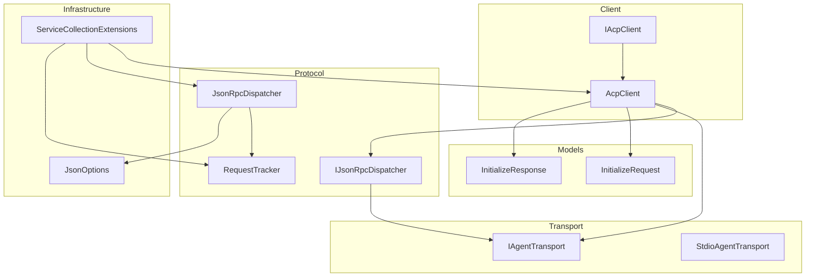
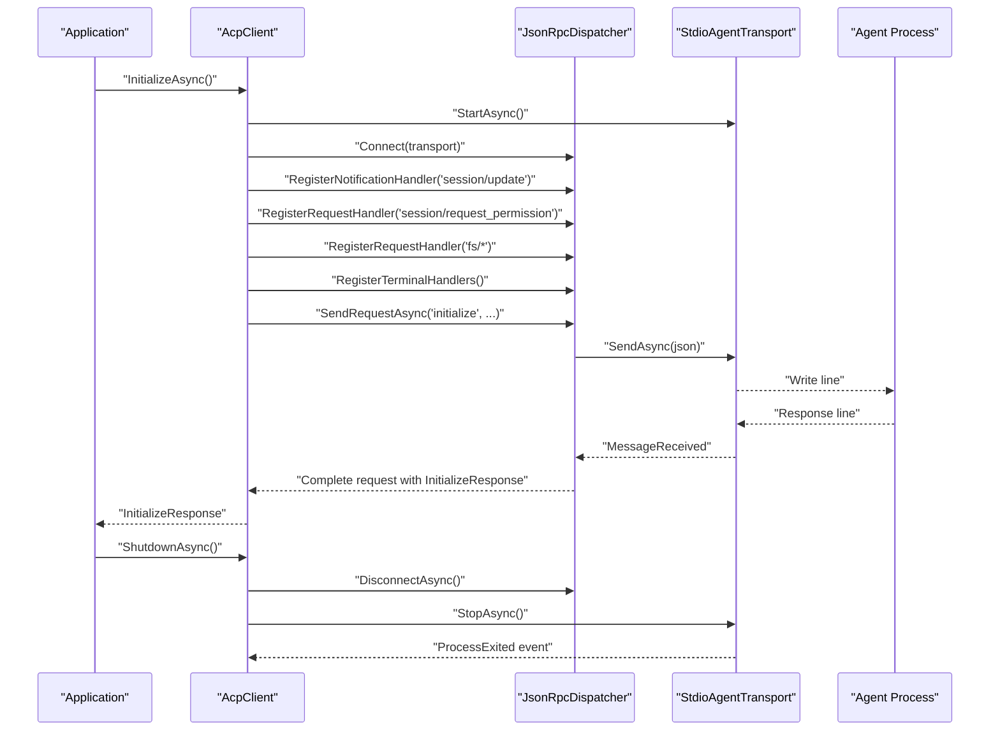
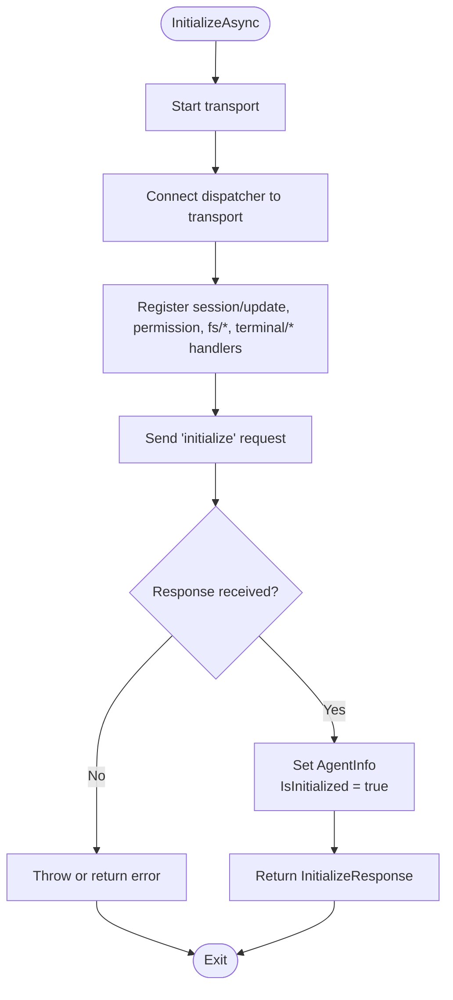
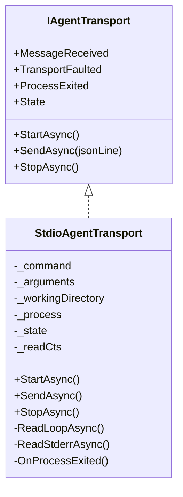
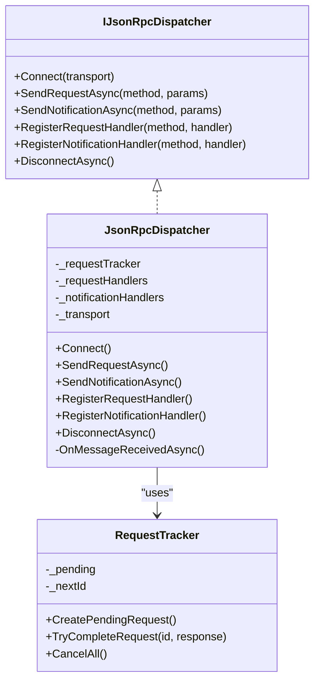
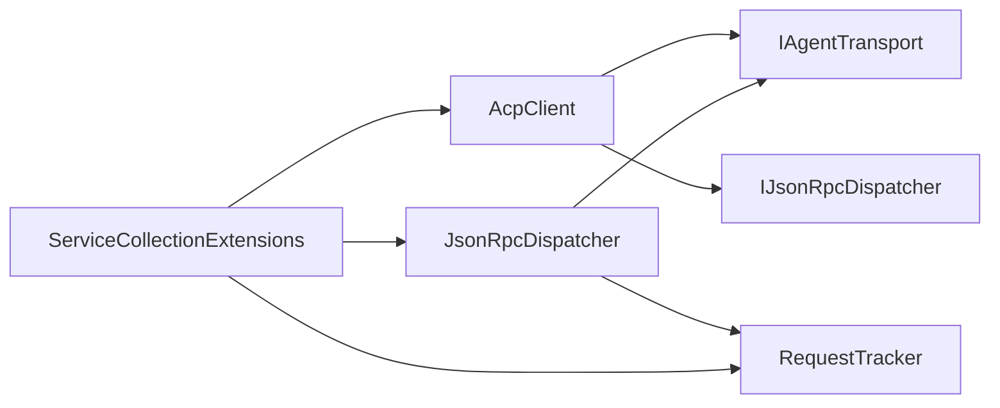

# Client Lifecycle and Resource Management

<cite>
**Referenced Files in This Document**
- [AcpClient.cs](file://Client/AcpClient.cs)
- [IAcpClient.cs](file://Client/IAcpClient.cs)
- [IAgentTransport.cs](file://Transport/IAgentTransport.cs)
- [StdioAgentTransport.cs](file://Transport/StdioAgentTransport.cs)
- [IJsonRpcDispatcher.cs](file://Protocol/IJsonRpcDispatcher.cs)
- [JsonRpcDispatcher.cs](file://Protocol/JsonRpcDispatcher.cs)
- [RequestTracker.cs](file://Protocol/RequestTracker.cs)
- [InitializeRequest.cs](file://Models/InitializeRequest.cs)
- [InitializeResponse.cs](file://Models/InitializeResponse.cs)
- [JsonOptions.cs](file://Infrastructure/JsonOptions.cs)
- [ServiceCollectionExtensions.cs](file://Infrastructure/ServiceCollectionExtensions.cs)
- [README.md](file://README.md)
</cite>

## Table of Contents
1. Introduction
2. Project Structure
3. Core Components
4. Architecture Overview
5. Detailed Component Analysis
6. Dependency Analysis
7. Performance Considerations
8. Troubleshooting Guide
9. Conclusion
10. Appendices

## Introduction
This document explains the client lifecycle management and resource handling for the ACP client library. It focuses on:
- The IAsyncDisposable pattern implementation and proper disposal sequences
- Initialization through InitializeAsync, including handshake completion verification via IsInitialized
- Shutdown through ShutdownAsync and cleanup procedures
- Resource management patterns for transport connections, JSON-RPC channels, and handler registrations
- Proper disposal order, resource leak prevention, and graceful shutdown scenarios
- Practical usage patterns with using statements, try-finally blocks, and async disposal
- Common lifecycle issues, debugging techniques, and best practices for production deployments

## Project Structure
The library is organized into clear layers:
- Client: high-level client API and handlers
- Transport: stdio-based process communication
- Protocol: JSON-RPC dispatching and request tracking
- Models: protocol data contracts
- Infrastructure: shared configuration and DI registration

**Diagram sources**
- [IAcpClient.cs:1-59](file://Client/IAcpClient.cs#L1-L59)
- [AcpClient.cs:1-361](file://Client/AcpClient.cs#L1-L361)
- [IJsonRpcDispatcher.cs:1-14](file://Protocol/IJsonRpcDispatcher.cs#L1-L14)
- [JsonRpcDispatcher.cs:1-124](file://Protocol/JsonRpcDispatcher.cs#L1-L124)
- [RequestTracker.cs:1-52](file://Protocol/RequestTracker.cs#L1-L52)
- [IAgentTransport.cs:1-39](file://Transport/IAgentTransport.cs#L1-L39)
- [StdioAgentTransport.cs:1-147](file://Transport/StdioAgentTransport.cs#L1-L147)
- [InitializeRequest.cs:1-16](file://Models/InitializeRequest.cs#L1-L16)
- [InitializeResponse.cs:1-28](file://Models/InitializeResponse.cs#L1-L28)
- [JsonOptions.cs:1-28](file://Infrastructure/JsonOptions.cs#L1-L28)
- [ServiceCollectionExtensions.cs:1-23](file://Infrastructure/ServiceCollectionExtensions.cs#L1-L23)

**Section sources**
- [README.md:1-99](file://README.md#L1-L99)

## Core Components
- AcpClient implements IAcpClient and IAsyncDisposable to manage lifecycle and resources
- StdioAgentTransport manages a child process and stdio streams
- JsonRpcDispatcher wires transport messages to request/response/notification handlers
- RequestTracker coordinates pending requests and cancellation on disconnect
- Handlers (permission, file system, terminal) are pluggable and registered during initialization

Key responsibilities:
- Start transport and register handlers
- Perform initialize handshake and expose IsInitialized
- Manage sessions and prompts
- Graceful shutdown and async disposal

**Section sources**
- [IAcpClient.cs:1-59](file://Client/IAcpClient.cs#L1-L59)
- [AcpClient.cs:1-361](file://Client/AcpClient.cs#L1-L361)
- [IAgentTransport.cs:1-39](file://Transport/IAgentTransport.cs#L1-L39)
- [StdioAgentTransport.cs:1-147](file://Transport/StdioAgentTransport.cs#L1-L147)
- [IJsonRpcDispatcher.cs:1-14](file://Protocol/IJsonRpcDispatcher.cs#L1-L14)
- [JsonRpcDispatcher.cs:1-124](file://Protocol/JsonRpcDispatcher.cs#L1-L124)
- [RequestTracker.cs:1-52](file://Protocol/RequestTracker.cs#L1-L52)

## Architecture Overview
The client orchestrates transport startup, JSON-RPC channel setup, and protocol handshake. On shutdown, it disconnects the dispatcher and stops the transport.

**Diagram sources**
- [AcpClient.cs:48-182](file://Client/AcpClient.cs#L48-L182)
- [AcpClient.cs:226-233](file://Client/AcpClient.cs#L226-L233)
- [JsonRpcDispatcher.cs:21-84](file://Protocol/JsonRpcDispatcher.cs#L21-L84)
- [StdioAgentTransport.cs:30-93](file://Transport/StdioAgentTransport.cs#L30-L93)

## Detailed Component Analysis

### AcpClient Lifecycle and Disposal
- Implements IAsyncDisposable; DisposeAsync calls ShutdownAsync and suppresses finalization
- InitializeAsync:
  - Starts transport
  - Connects dispatcher to transport
  - Subscribes to process exit events
  - Registers built-in notification and request handlers (session/update, permission, fs/*, terminal/*)
  - Sends initialize request and stores response
  - Exposes IsInitialized based on presence of AgentInfo
- ShutdownAsync:
  - Disconnects dispatcher (unsubscribes from transport events and cancels pending requests)
  - Stops transport (closes stdin, waits or kills process)
- Proper disposal order:
  - Always call ShutdownAsync before releasing references
  - Use using or try-finally to ensure deterministic cleanup

**Diagram sources**
- [AcpClient.cs:48-182](file://Client/AcpClient.cs#L48-L182)

**Section sources**
- [IAcpClient.cs:1-59](file://Client/IAcpClient.cs#L1-L59)
- [AcpClient.cs:48-182](file://Client/AcpClient.cs#L48-L182)
- [AcpClient.cs:226-240](file://Client/AcpClient.cs#L226-L240)

### Transport Layer (StdioAgentTransport)
- Manages a child process with redirected stdio
- StartAsync launches process and starts background read loops for stdout/stderr
- SendAsync writes JSON lines to stdin
- StopAsync:
  - Cancels read loops
  - Closes stdin and waits up to a timeout
  - Kills process tree if not exited gracefully
- Events:
  - MessageReceived: raw JSON lines from stdout
  - TransportFaulted: errors from read loops
  - ProcessExited: agent process termination

**Diagram sources**
- [IAgentTransport.cs:1-39](file://Transport/IAgentTransport.cs#L1-L39)
- [StdioAgentTransport.cs:1-147](file://Transport/StdioAgentTransport.cs#L1-L147)

**Section sources**
- [IAgentTransport.cs:1-39](file://Transport/IAgentTransport.cs#L1-L39)
- [StdioAgentTransport.cs:30-93](file://Transport/StdioAgentTransport.cs#L30-L93)

### JSON-RPC Dispatcher and Request Tracking
- Connect binds to transport.MessageReceived
- SendRequestAsync serializes request, sends via transport, and awaits TaskCompletionSource from RequestTracker
- SendNotificationAsync serializes and sends without awaiting response
- RegisterRequestHandler/RegisterNotificationHandler store delegates in concurrent dictionaries
- DisconnectAsync unsubscribes from transport and cancels all pending requests
- OnMessageReceivedAsync deserializes messages and routes to appropriate handlers

**Diagram sources**
- [IJsonRpcDispatcher.cs:1-14](file://Protocol/IJsonRpcDispatcher.cs#L1-L14)
- [JsonRpcDispatcher.cs:1-124](file://Protocol/JsonRpcDispatcher.cs#L1-L124)
- [RequestTracker.cs:1-52](file://Protocol/RequestTracker.cs#L1-L52)

**Section sources**
- [JsonRpcDispatcher.cs:21-84](file://Protocol/JsonRpcDispatcher.cs#L21-L84)
- [RequestTracker.cs:11-39](file://Protocol/RequestTracker.cs#L11-L39)

### Handler Registration and Extensibility
- Built-in handlers:
  - session/update notification forwarded to SessionUpdated event
  - session/request_permission delegated to PermissionHandler
  - fs/read_text_file and fs/write_text_file delegated to FileSystemHandler
  - terminal/* methods delegated to TerminalHandler
- Custom handlers can be registered via RegisterRequestHandler and RegisterNotificationHandler

Best practices:
- Assign handlers before calling InitializeAsync
- Ensure handlers are thread-safe and handle cancellation appropriately
- Avoid long-running blocking operations inside handlers; offload work to background tasks when needed

**Section sources**
- [AcpClient.cs:64-147](file://Client/AcpClient.cs#L64-L147)
- [AcpClient.cs:250-358](file://Client/AcpClient.cs#L250-L358)
- [IPermissionHandler.cs:1-17](file://Client/IPermissionHandler.cs#L1-L17)
- [IFileSystemHandler.cs:1-14](file://Client/IFileSystemHandler.cs#L1-L14)
- [ITerminalHandler.cs:1-23](file://Client/ITerminalHandler.cs#L1-L23)

### Initialization Sequence and Handshake Verification
- InitializeAsync performs:
  - Transport start
  - Dispatcher connect
  - Handler registration
  - Send initialize request
  - Deserialize InitializeResponse and store in AgentInfo
- IsInitialized returns true when AgentInfo is non-null

Verification:
- Check IsInitialized after InitializeAsync completes
- Validate protocol version compatibility if needed

**Section sources**
- [AcpClient.cs:48-182](file://Client/AcpClient.cs#L48-L182)
- [InitializeRequest.cs:1-16](file://Models/InitializeRequest.cs#L1-L16)
- [InitializeResponse.cs:1-28](file://Models/InitializeResponse.cs#L1-L28)

### Shutdown and Async Disposal
- ShutdownAsync:
  - Calls DisconnectAsync on dispatcher (unsubscribes and cancels pending requests)
  - Calls StopAsync on transport (graceful stop with fallback kill)
- DisposeAsync:
  - Invokes ShutdownAsync
  - Suppresses finalization to avoid unnecessary GC overhead

Proper disposal order:
- Always shut down dispatcher first to cancel pending requests
- Then stop transport to release process and streams

**Section sources**
- [AcpClient.cs:226-240](file://Client/AcpClient.cs#L226-L240)
- [JsonRpcDispatcher.cs:76-84](file://Protocol/JsonRpcDispatcher.cs#L76-L84)
- [StdioAgentTransport.cs:70-93](file://Transport/StdioAgentTransport.cs#L70-L93)

## Dependency Analysis
The client depends on transport and dispatcher abstractions, which decouple lifecycle management from concrete implementations.

**Diagram sources**
- [AcpClient.cs:1-361](file://Client/AcpClient.cs#L1-L361)
- [IJsonRpcDispatcher.cs:1-14](file://Protocol/IJsonRpcDispatcher.cs#L1-L14)
- [JsonRpcDispatcher.cs:1-124](file://Protocol/JsonRpcDispatcher.cs#L1-L124)
- [RequestTracker.cs:1-52](file://Protocol/RequestTracker.cs#L1-L52)
- [ServiceCollectionExtensions.cs:1-23](file://Infrastructure/ServiceCollectionExtensions.cs#L1-L23)

**Section sources**
- [ServiceCollectionExtensions.cs:14-21](file://Infrastructure/ServiceCollectionExtensions.cs#L14-L21)

## Performance Considerations
- Use shared JsonSerializerOptions for consistent and efficient serialization
- Avoid heavy work in synchronous parts of handlers; prefer async and cancellation tokens
- Keep handler registrations minimal and specific to reduce routing overhead
- Monitor process lifetime and handle unexpected exits promptly to free resources
- Prefer using statements or try-finally to ensure deterministic disposal

[No sources needed since this section provides general guidance]

## Troubleshooting Guide
Common lifecycle issues and remedies:
- IsInitialized remains false:
  - Verify InitializeAsync completed successfully and no exceptions occurred
  - Ensure transport started and dispatcher connected
  - Check that initialize request succeeded and response was deserialized
- Transport not stopping:
  - Confirm StopAsync is called and stdin is closed
  - If process does not exit within timeout, it will be killed; verify agent behavior
- Pending requests hanging:
  - Ensure DisconnectAsync is called on shutdown to cancel pending requests
  - Inspect RequestTracker.CancelAll behavior
- Missing handlers:
  - Assign PermissionHandler, FileSystemHandler, TerminalHandler before InitializeAsync
  - Verify method names match expected handlers
- Debugging tips:
  - Enable logging in AcpClient and observe initialization and shutdown logs
  - Subscribe to AgentProcessExited to detect unexpected termination
  - Inspect TransportFaulted for stream read errors

**Section sources**
- [AcpClient.cs:48-182](file://Client/AcpClient.cs#L48-L182)
- [AcpClient.cs:226-240](file://Client/AcpClient.cs#L226-L240)
- [StdioAgentTransport.cs:95-118](file://Transport/StdioAgentTransport.cs#L95-L118)
- [JsonRpcDispatcher.cs:76-84](file://Protocol/JsonRpcDispatcher.cs#L76-L84)

## Conclusion
The ACP client follows a clear lifecycle:
- InitializeAsync sets up transport, dispatcher, and handlers, then performs the handshake
- IsInitialized indicates successful initialization
- ShutdownAsync ensures orderly cleanup by disconnecting the dispatcher and stopping the transport
- Implement IAsyncDisposable and use using or try-finally to prevent resource leaks
- Register handlers before initialization and handle edge cases like process exits and transport faults

Adhering to these patterns ensures robust, maintainable, and production-ready client code.

[No sources needed since this section summarizes without analyzing specific files]

## Appendices

### Usage Patterns for Safe Disposal
- Using statement:
  - Create client, initialize, perform operations, and dispose automatically at scope end
- Try-finally:
  - Explicitly call ShutdownAsync in finally block to guarantee cleanup even on exceptions
- Async disposal:
  - Await DisposeAsync to ensure asynchronous cleanup completes

[No sources needed since this section provides general guidance]

### Best Practices for Production Deployments
- Centralize client creation and disposal in application lifecycle managers
- Configure logging levels appropriately for diagnostics
- Handle AgentProcessExited to trigger reconnection or graceful degradation
- Validate protocol versions and capabilities returned by the agent
- Avoid holding long-lived references to handlers that may capture large objects

[No sources needed since this section provides general guidance]