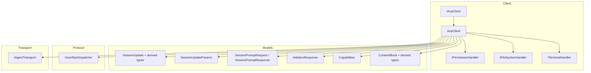
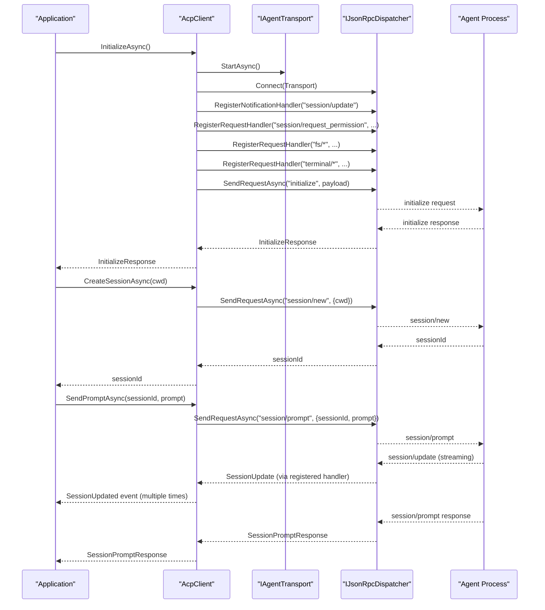
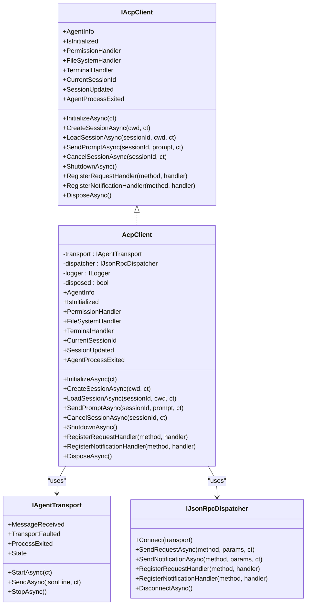

# Core Client API

<cite>
**Referenced Files in This Document**
- [IAcpClient.cs](file://Client/IAcpClient.cs)
- [AcpClient.cs](file://Client/AcpClient.cs)
- [IPermissionHandler.cs](file://Client/IPermissionHandler.cs)
- [IFileSystemHandler.cs](file://Client/IFileSystemHandler.cs)
- [ITerminalHandler.cs](file://Client/ITerminalHandler.cs)
- [SessionUpdate.cs](file://Models/SessionUpdate.cs)
- [SessionUpdateWrapper.cs](file://Models/SessionUpdateWrapper.cs)
- [SessionPromptRequest.cs](file://Models/SessionPromptRequest.cs)
- [InitializeResponse.cs](file://Models/InitializeResponse.cs)
- [Capabilities.cs](file://Models/Capabilities.cs)
- [ContentBlock.cs](file://Models/ContentBlock.cs)
- [IAgentTransport.cs](file://Transport/IAgentTransport.cs)
- [IJsonRpcDispatcher.cs](file://Protocol/IJsonRpcDispatcher.cs)
- [README.md](file://README.md)
</cite>

## Table of Contents
1. Introduction
2. Project Structure
3. Core Components
4. Architecture Overview
5. Detailed Component Analysis
6. Dependency Analysis
7. Performance Considerations
8. Troubleshooting Guide
9. Conclusion

## Introduction
This document provides comprehensive API documentation for the core client interfaces and implementation used to communicate with ACP-compliant agents over stdio using JSON-RPC. It focuses on the IAcpClient interface, the AcpClient implementation, event system, async patterns, cancellation token support, and thread safety considerations. It also includes usage examples, error handling guidance, and resource disposal best practices.

## Project Structure
The client library is organized into clear layers:
- Client: Public contracts (IAcpClient) and default implementation (AcpClient), plus handler interfaces for permissions, file system, and terminal operations.
- Models: Data contracts for requests, responses, streaming updates, capabilities, and content blocks.
- Protocol: JSON-RPC dispatch abstraction and request tracking.
- Transport: Abstraction and stdio-based transport for process communication.
- Infrastructure: JSON serialization options and service collection extensions.

**Diagram sources**
- [IAcpClient.cs](file://Client/IAcpClient.cs)
- [AcpClient.cs](file://Client/AcpClient.cs)
- [IPermissionHandler.cs](file://Client/IPermissionHandler.cs)
- [IFileSystemHandler.cs](file://Client/IFileSystemHandler.cs)
- [ITerminalHandler.cs](file://Client/ITerminalHandler.cs)
- [SessionUpdate.cs](file://Models/SessionUpdate.cs)
- [SessionUpdateWrapper.cs](file://Models/SessionUpdateWrapper.cs)
- [SessionPromptRequest.cs](file://Models/SessionPromptRequest.cs)
- [InitializeResponse.cs](file://Models/InitializeResponse.cs)
- [Capabilities.cs](file://Models/Capabilities.cs)
- [ContentBlock.cs](file://Models/ContentBlock.cs)
- [IAgentTransport.cs](file://Transport/IAgentTransport.cs)
- [IJsonRpcDispatcher.cs](file://Protocol/IJsonRpcDispatcher.cs)

**Section sources**
- [README.md](file://README.md)

## Core Components
- IAcpClient: Defines the public contract for initializing, session management, prompting, cancellation, shutdown, and extensibility via custom handlers.
- AcpClient: Default implementation that wires transport, dispatcher, and handlers; manages lifecycle and events.
- Handler interfaces: IPermissionHandler, IFileSystemHandler, ITerminalHandler allow UI or application-specific implementations to respond to agent requests.

Key responsibilities:
- InitializeAsync: Start transport, connect dispatcher, register built-in handlers, perform handshake, and return agent info.
- CreateSessionAsync/LoadSessionAsync: Manage sessions and update CurrentSessionId.
- SendPromptAsync: Send a prompt and receive a response; streaming updates are delivered via SessionUpdated.
- CancelSessionAsync: Send a cancel notification for an ongoing session operation.
- ShutdownAsync/DisposeAsync: Gracefully disconnect and stop transport.
- RegisterRequestHandler/RegisterNotificationHandler: Extend protocol behavior.

**Section sources**
- [IAcpClient.cs](file://Client/IAcpClient.cs)
- [AcpClient.cs](file://Client/AcpClient.cs)
- [IPermissionHandler.cs](file://Client/IPermissionHandler.cs)
- [IFileSystemHandler.cs](file://Client/IFileSystemHandler.cs)
- [ITerminalHandler.cs](file://Client/ITerminalHandler.cs)

## Architecture Overview
The client follows a layered architecture:
- Transport layer abstracts process communication (e.g., stdio).
- Dispatcher handles JSON-RPC message routing, request/response correlation, and notifications.
- Client orchestrates initialization, session lifecycle, prompts, and eventing.
- Handlers implement domain-specific behaviors (permissions, file system, terminal).

**Diagram sources**
- [AcpClient.cs](file://Client/AcpClient.cs)
- [IAgentTransport.cs](file://Transport/IAgentTransport.cs)
- [IJsonRpcDispatcher.cs](file://Protocol/IJsonRpcDispatcher.cs)
- [SessionUpdate.cs](file://Models/SessionUpdate.cs)
- [SessionUpdateWrapper.cs](file://Models/SessionUpdateWrapper.cs)
- [SessionPromptRequest.cs](file://Models/SessionPromptRequest.cs)

## Detailed Component Analysis

### IAcpClient Interface
- Properties:
  - AgentInfo: InitializeResponse returned after successful initialization.
  - IsInitialized: Indicates whether the initialize handshake completed.
  - PermissionHandler, FileSystemHandler, TerminalHandler: Optional handlers for agent-initiated requests.
  - CurrentSessionId: The active session identifier.
- Events:
  - SessionUpdated: Raised when a session/update notification arrives; payload is SessionUpdate.
  - AgentProcessExited: Raised when the underlying agent process exits; payload is exit code (int).
- Methods:
  - InitializeAsync(CancellationToken): Starts transport, connects dispatcher, registers handlers, performs handshake, returns InitializeResponse.
  - CreateSessionAsync(string cwd, CancellationToken): Creates a new session and sets CurrentSessionId.
  - LoadSessionAsync(string sessionId, string cwd, CancellationToken): Loads an existing session and sets CurrentSessionId.
  - SendPromptAsync(string sessionId, List<ContentBlock> prompt, CancellationToken): Sends a prompt and returns SessionPromptResponse; streaming updates arrive via SessionUpdated.
  - CancelSessionAsync(string sessionId, CancellationToken): Cancels an in-progress prompt by sending a session/cancel notification.
  - ShutdownAsync(): Disconnects dispatcher and stops transport.
  - RegisterRequestHandler(string method, Func<JsonRpcRequest, Task<JsonRpcResponse>>): Registers custom request handlers.
  - RegisterNotificationHandler(string method, Func<JsonRpcNotification, Task>): Registers custom notification handlers.
  - DisposeAsync(): Implements IAsyncDisposable; calls ShutdownAsync and suppresses finalization.

Parameter types and return values:
- InitializeAsync: Returns InitializeResponse; supports cancellation.
- CreateSessionAsync: Returns string (sessionId); supports cancellation.
- LoadSessionAsync: Returns string (sessionId); supports cancellation.
- SendPromptAsync: Returns SessionPromptResponse; supports cancellation; streaming updates via SessionUpdated.
- CancelSessionAsync: Returns Task; supports cancellation.
- ShutdownAsync: Returns Task.
- Register* methods: No return value.
- DisposeAsync: Returns ValueTask.

Exception handling patterns:
- Transport faults are surfaced through IAgentTransport.TransportFaulted; applications should handle these to recover or log errors.
- Request failures from the agent surface via JsonRpcError in responses handled by the dispatcher; callers should check response.Error where applicable.
- If PermissionHandler is not set, permission requests return a cancelled outcome; if FileSystemHandler/TerminalHandler are not set, corresponding methods return appropriate errors indicating unavailability.

Thread safety considerations:
- Event handlers (SessionUpdated, AgentProcessExited) may be invoked concurrently; ensure handlers are thread-safe or synchronize access to shared state.
- Avoid long-running blocking work inside event handlers; offload to background tasks if necessary.

**Section sources**
- [IAcpClient.cs](file://Client/IAcpClient.cs)
- [AcpClient.cs](file://Client/AcpClient.cs)
- [IAgentTransport.cs](file://Transport/IAgentTransport.cs)

### AcpClient Implementation
Constructor parameters:
- IAgentTransport transport: Underlying transport for process communication.
- IJsonRpcDispatcher dispatcher: JSON-RPC message routing and correlation.
- ILogger<AcpClient>? logger: Optional logging; defaults to NullLogger.

Lifecycle management:
- InitializeAsync:
  - Starts transport and connects dispatcher.
  - Subscribes to ProcessExited and raises AgentProcessExited.
  - Registers built-in handlers for session/update, session/request_permission, fs/read_text_file, fs/write_text_file, and terminal/* methods.
  - Sends initialize request and stores InitializeResponse in AgentInfo; sets IsInitialized accordingly.
  - Logs protocol version mismatch if present.
- CreateSessionAsync:
  - Sends session/new with cwd; parses response and sets CurrentSessionId.
- LoadSessionAsync:
  - Sends session/load with sessionId and cwd; sets CurrentSessionId.
- SendPromptAsync:
  - Sends session/prompt with sessionId and prompt; returns SessionPromptResponse. Streaming updates are delivered via SessionUpdated.
- CancelSessionAsync:
  - Sends session/cancel notification for the given sessionId.
- ShutdownAsync:
  - Disconnects dispatcher and stops transport; idempotent via _disposed flag.
- DisposeAsync:
  - Calls ShutdownAsync and suppresses finalization.

Extensibility:
- RegisterRequestHandler and RegisterNotificationHandler delegate to the dispatcher for custom methods.

Event system specifics:
- SessionUpdated:
  - Triggered by session/update notifications.
  - Payload type is SessionUpdate, which is polymorphic and includes derived types such as AgentMessageChunk, AgentThoughtChunk, UserMessageChunk, ToolCallNotification, ToolCallUpdateNotification, PlanUpdate, UsageUpdate.
- AgentProcessExited:
  - Triggered when the underlying agent process exits; payload is the exit code (int).

Cancellation token support:
- All asynchronous methods accept CancellationToken to propagate cancellation to transport and dispatcher operations.

Error handling specifics:
- Permission requests without a PermissionHandler return a cancelled outcome.
- File system and terminal requests without respective handlers return errors indicating unavailability.
- Logging is used throughout for diagnostics; configure ILogger to capture detailed traces.

**Section sources**
- [AcpClient.cs](file://Client/AcpClient.cs)
- [SessionUpdate.cs](file://Models/SessionUpdate.cs)
- [SessionUpdateWrapper.cs](file://Models/SessionUpdateWrapper.cs)
- [IAgentTransport.cs](file://Transport/IAgentTransport.cs)
- [IJsonRpcDispatcher.cs](file://Protocol/IJsonRpcDispatcher.cs)

### Handler Interfaces
- IPermissionHandler:
  - HandlePermissionRequestAsync(RequestPermissionRequest, CancellationToken): Block until user decision; return RequestPermissionResponse.
- IFileSystemHandler:
  - ReadTextFileAsync(path, CancellationToken): Return text content.
  - WriteTextFileAsync(path, content, CancellationToken): Write text content.
- ITerminalHandler:
  - CreateTerminalAsync(command, workingDirectory, CancellationToken): Return terminalId.
  - GetOutputAsync(terminalId, CancellationToken): Return terminal output.
  - WaitForExitAsync(terminalId, CancellationToken): Return exit code.
  - KillTerminalAsync(terminalId, CancellationToken): Terminate terminal process.
  - ReleaseTerminalAsync(terminalId, CancellationToken): Release terminal resources.

These handlers are assigned to AcpClient before InitializeAsync to enable agent-initiated operations.

**Section sources**
- [IPermissionHandler.cs](file://Client/IPermissionHandler.cs)
- [IFileSystemHandler.cs](file://Client/IFileSystemHandler.cs)
- [ITerminalHandler.cs](file://Client/ITerminalHandler.cs)
- [AcpClient.cs](file://Client/AcpClient.cs)

### Data Models and Events
- SessionUpdate:
  - Base class for streaming updates with polymorphic derived types.
  - Derived types include AgentMessageChunk, AgentThoughtChunk, UserMessageChunk, ToolCallNotification, ToolCallUpdateNotification, PlanUpdate, UsageUpdate.
- SessionUpdateParams:
  - Wrapper for session/update notification params containing sessionId and update.
- SessionPromptRequest and SessionPromptResponse:
  - Request contains sessionId and prompt (List<ContentBlock>).
  - Response contains StopReason.
- InitializeResponse:
  - Contains protocolVersion, agentCapabilities, agentInfo, authMethods.
- Capabilities:
  - ClientCapabilities (fs, terminal), AgentCapabilities (loadSession, promptCapabilities), PromptCapabilities (image, audio, embeddedContext), ImplementationInfo (name, title, version).
- ContentBlock:
  - Polymorphic base for TextContent, ImageContent, AudioContent, ResourceContent, ResourceLinkContent.

Usage scenarios:
- Subscribe to SessionUpdated to render streaming text, tool call progress, plan updates, and usage metrics.
- Use InitializeResponse.AgentInfo to display agent identity and capabilities.
- Build prompts using ContentBlock-derived types to send text, images, audio, or resource references.

**Section sources**
- [SessionUpdate.cs](file://Models/SessionUpdate.cs)
- [SessionUpdateWrapper.cs](file://Models/SessionUpdateWrapper.cs)
- [SessionPromptRequest.cs](file://Models/SessionPromptRequest.cs)
- [InitializeResponse.cs](file://Models/InitializeResponse.cs)
- [Capabilities.cs](file://Models/Capabilities.cs)
- [ContentBlock.cs](file://Models/ContentBlock.cs)

### Async/Await Patterns and Cancellation
- All public methods are async and accept CancellationToken to support cooperative cancellation.
- Use await consistently to avoid deadlocks and ensure proper exception propagation.
- For long-running operations (e.g., waiting for terminal exit), pass the same cancellation token to allow timely termination.

**Section sources**
- [IAcpClient.cs](file://Client/IAcpClient.cs)
- [AcpClient.cs](file://Client/AcpClient.cs)
- [IAgentTransport.cs](file://Transport/IAgentTransport.cs)
- [IJsonRpcDispatcher.cs](file://Protocol/IJsonRpcDispatcher.cs)

### Thread Safety Considerations
- Event handlers can be invoked concurrently; ensure they are thread-safe or use synchronization primitives.
- Avoid synchronous blocking within event handlers; prefer asynchronous processing.
- Shared mutable state accessed from multiple handlers should be protected (e.g., using locks or concurrent collections).

[No sources needed since this section provides general guidance]

## Dependency Analysis
The client depends on transport and protocol abstractions, and models define data contracts. Handlers are optional but recommended for full functionality.

**Diagram sources**
- [IAcpClient.cs](file://Client/IAcpClient.cs)
- [AcpClient.cs](file://Client/AcpClient.cs)
- [IAgentTransport.cs](file://Transport/IAgentTransport.cs)
- [IJsonRpcDispatcher.cs](file://Protocol/IJsonRpcDispatcher.cs)

**Section sources**
- [IAcpClient.cs](file://Client/IAcpClient.cs)
- [AcpClient.cs](file://Client/AcpClient.cs)
- [IAgentTransport.cs](file://Transport/IAgentTransport.cs)
- [IJsonRpcDispatcher.cs](file://Protocol/IJsonRpcDispatcher.cs)

## Performance Considerations
- Prefer streaming updates via SessionUpdated instead of polling for status.
- Minimize allocations in event handlers; reuse buffers where possible.
- Configure ILogger appropriately to avoid excessive logging overhead in production.
- Ensure handlers perform non-blocking work; offload heavy tasks to background threads or async pipelines.

[No sources needed since this section provides general guidance]

## Troubleshooting Guide
Common issues and resolutions:
- Missing handlers:
  - If PermissionHandler is not set, permission requests will be cancelled automatically.
  - If FileSystemHandler or TerminalHandler are not set, corresponding methods return errors indicating unavailability.
- Transport faults:
  - Monitor TransportFaulted to detect connection issues; implement retry or reconnection logic as needed.
- Protocol version mismatch:
  - InitializeAsync logs a warning if the agent’s protocol version differs from the client’s expected version; verify compatibility.
- Long-running operations:
  - Use CancellationToken to cancel operations promptly; ensure handlers respect cancellation tokens.
- Event handler concurrency:
  - Make SessionUpdated and AgentProcessExited handlers thread-safe; avoid synchronous blocking.

**Section sources**
- [AcpClient.cs](file://Client/AcpClient.cs)
- [IAgentTransport.cs](file://Transport/IAgentTransport.cs)

## Conclusion
The IAcpClient interface and AcpClient implementation provide a robust, extensible foundation for interacting with ACP-compliant agents. By leveraging async/await, cancellation tokens, and the event-driven model, applications can build responsive and resilient integrations. Proper configuration of handlers, careful error handling, and attention to thread safety ensure reliable operation across diverse environments.

[No sources needed since this section summarizes without analyzing specific files]