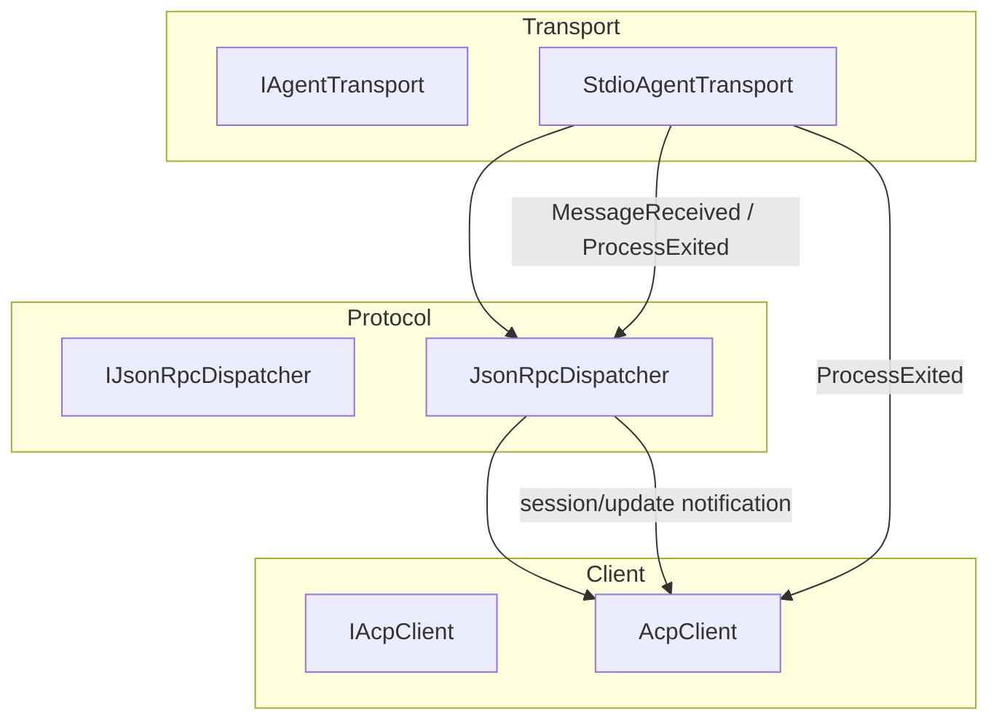
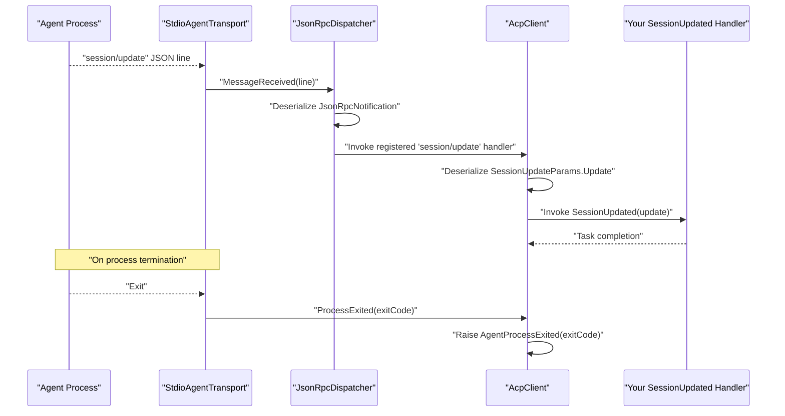
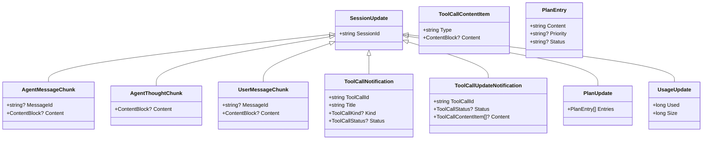
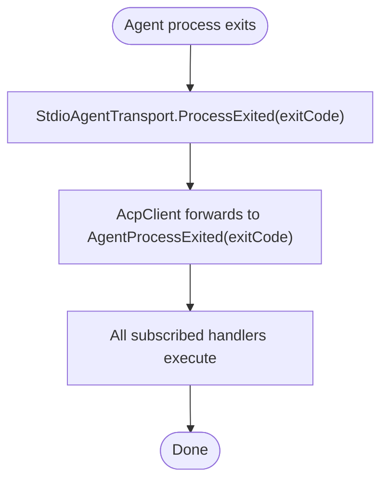
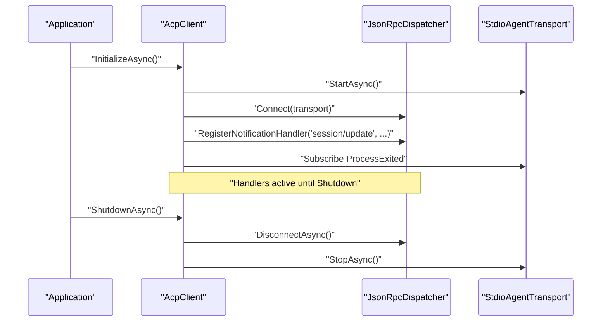
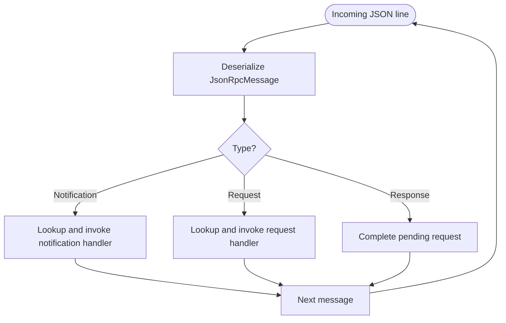
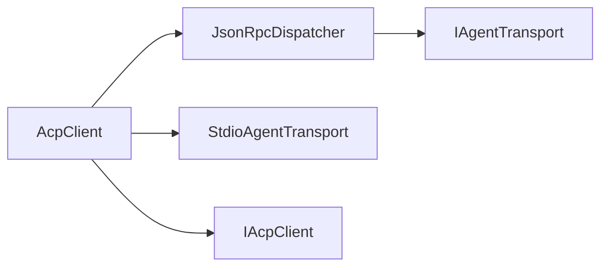

# Event System and Notifications

<cite>
**Referenced Files in This Document**
- [AcpClient.cs](file://Client/AcpClient.cs)
- [IAcpClient.cs](file://Client/IAcpClient.cs)
- [JsonRpcDispatcher.cs](file://Protocol/JsonRpcDispatcher.cs)
- [IAgentTransport.cs](file://Transport/IAgentTransport.cs)
- [StdioAgentTransport.cs](file://Transport/StdioAgentTransport.cs)
- [SessionUpdate.cs](file://Models/SessionUpdate.cs)
- [SessionUpdateWrapper.cs](file://Models/SessionUpdateWrapper.cs)
- [JsonRpcNotification.cs](file://JsonRpc/JsonRpcNotification.cs)
- [README.md](file://README.md)
</cite>

## Table of Contents
1. [Introduction](#introduction)
2. [Project Structure](#project-structure)
3. [Core Components](#core-components)
4. [Architecture Overview](#architecture-overview)
5. [Detailed Component Analysis](#detailed-component-analysis)
6. [Dependency Analysis](#dependency-analysis)
7. [Performance Considerations](#performance-considerations)
8. [Troubleshooting Guide](#troubleshooting-guide)
9. [Conclusion](#conclusion)

## Introduction
This document explains the event-driven architecture for receiving streaming updates from ACP agents and handling agent termination. It focuses on:
- The SessionUpdated event for streaming session updates, including the SessionUpdate payload structure and processing patterns.
- The AgentProcessExited event for agent process termination with exit code information.
- Event registration and unregistration, thread safety considerations, ordering guarantees, concurrent processing, and error handling within handlers.
- Practical examples for subscribing to events, implementing event-driven workflows, and asynchronous processing.
- Best practices to prevent memory leaks through proper subscription management and robust handler implementation.

## Project Structure
The event system spans three layers:
- Transport layer: manages the underlying I/O and raises low-level events (e.g., process exit).
- Protocol layer: deserializes JSON-RPC messages and dispatches notifications to registered handlers.
- Client layer: exposes high-level .NET events (SessionUpdated, AgentProcessExited) and wires transport/dispatcher into a cohesive client API.

**Diagram sources**
- [IAgentTransport.cs:1-39](file://Transport/IAgentTransport.cs#L1-L39)
- [StdioAgentTransport.cs:1-147](file://Transport/StdioAgentTransport.cs#L1-L147)
- [JsonRpcDispatcher.cs:1-124](file://Protocol/JsonRpcDispatcher.cs#L1-L124)
- [IAcpClient.cs:1-59](file://Client/IAcpClient.cs#L1-L59)
- [AcpClient.cs:1-361](file://Client/AcpClient.cs#L1-L361)

**Section sources**
- [README.md:1-99](file://README.md#L1-L99)

## Core Components
- AcpClient exposes two primary events:
  - SessionUpdated: invoked for each session/update notification carrying polymorphic SessionUpdate payloads.
  - AgentProcessExited: invoked when the underlying agent process exits, passing the exit code.
- JsonRpcDispatcher routes incoming JSON-RPC notifications to registered handlers and completes pending requests.
- StdioAgentTransport reads/writes lines over stdio, raising MessageReceived, TransportFaulted, and ProcessExited.

Key responsibilities:
- AcpClient wires transport and dispatcher during initialization and translates protocol-level notifications into .NET events.
- JsonRpcDispatcher maintains handler registries and executes them upon message arrival.
- StdioAgentTransport encapsulates process lifecycle and stream reading.

**Section sources**
- [AcpClient.cs:31-72](file://Client/AcpClient.cs#L31-L72)
- [IAcpClient.cs:29-33](file://Client/IAcpClient.cs#L29-L33)
- [JsonRpcDispatcher.cs:66-74](file://Protocol/JsonRpcDispatcher.cs#L66-L74)
- [IAgentTransport.cs:14-24](file://Transport/IAgentTransport.cs#L14-L24)
- [StdioAgentTransport.cs:19-28](file://Transport/StdioAgentTransport.cs#L19-L28)

## Architecture Overview
The runtime flow for streaming updates and process exit is as follows:

**Diagram sources**
- [StdioAgentTransport.cs:95-118](file://Transport/StdioAgentTransport.cs#L95-L118)
- [JsonRpcDispatcher.cs:86-122](file://Protocol/JsonRpcDispatcher.cs#L86-L122)
- [AcpClient.cs:55-72](file://Client/AcpClient.cs#L55-L72)

## Detailed Component Analysis

### SessionUpdated Event and Payload
- Notification source: JSON-RPC method "session/update".
- Payload wrapper: SessionUpdateParams contains sessionId and an update field of type SessionUpdate.
- Polymorphic types under SessionUpdate include:
  - AgentMessageChunk: messageId (optional), content (ContentBlock).
  - AgentThoughtChunk: content (ContentBlock).
  - UserMessageChunk: messageId (optional), content (ContentBlock).
  - ToolCallNotification: toolCallId, title, kind (optional), status (optional).
  - ToolCallUpdateNotification: toolCallId, status (optional), content (list of ToolCallContentItem).
  - PlanUpdate: entries (list of PlanEntry).
  - UsageUpdate: used (long), size (long).

Processing pattern:
- AcpClient registers a notification handler for "session/update".
- On receipt, it deserializes the Params into SessionUpdateParams using shared JSON options.
- If Update is present and SessionUpdated has subscribers, it invokes the event with the typed SessionUpdate instance.

**Diagram sources**
- [SessionUpdate.cs:1-119](file://Models/SessionUpdate.cs#L1-L119)

**Section sources**
- [SessionUpdate.cs:1-119](file://Models/SessionUpdate.cs#L1-L119)
- [SessionUpdateWrapper.cs:1-17](file://Models/SessionUpdateWrapper.cs#L1-L17)
- [AcpClient.cs:64-72](file://Client/AcpClient.cs#L64-L72)

### AgentProcessExited Event
- Source: StdioAgentTransport raises ProcessExited when the child process terminates.
- AcpClient subscribes to this event during InitializeAsync and re-raises it as its own AgentProcessExited event, forwarding the exit code.

**Diagram sources**
- [StdioAgentTransport.cs:137-145](file://Transport/StdioAgentTransport.cs#L137-L145)
- [AcpClient.cs:55-61](file://Client/AcpClient.cs#L55-L61)

**Section sources**
- [IAgentTransport.cs:20-21](file://Transport/IAgentTransport.cs#L20-L21)
- [StdioAgentTransport.cs:137-145](file://Transport/StdioAgentTransport.cs#L137-L145)
- [AcpClient.cs:55-61](file://Client/AcpClient.cs#L55-L61)

### Event Registration, Unregistration, and Lifecycle
- Registration:
  - AcpClient registers the "session/update" notification handler and transports the ProcessExited event during InitializeAsync.
  - Custom request/notification handlers can be registered via AcpClient.RegisterRequestHandler/RegisterNotificationHandler, which forward to JsonRpcDispatcher.
- Unregistration:
  - JsonRpcDispatcher disconnects by removing the transport.MessageReceived subscription and cancels pending requests.
  - AcpClient.ShutdownAsync calls DisconnectAsync and stops the transport.
- Thread safety:
  - JsonRpcDispatcher uses ConcurrentDictionary for handler maps.
  - Events are invoked synchronously from the dispatcher’s message loop; ensure handlers are thread-safe if they mutate shared state.

**Diagram sources**
- [AcpClient.cs:47-72](file://Client/AcpClient.cs#L47-L72)
- [JsonRpcDispatcher.cs:21-25](file://Protocol/JsonRpcDispatcher.cs#L21-L25)
- [JsonRpcDispatcher.cs:76-84](file://Protocol/JsonRpcDispatcher.cs#L76-L84)
- [StdioAgentTransport.cs:70-93](file://Transport/StdioAgentTransport.cs#L70-L93)

**Section sources**
- [AcpClient.cs:47-72](file://Client/AcpClient.cs#L47-L72)
- [AcpClient.cs:243-248](file://Client/AcpClient.cs#L243-L248)
- [JsonRpcDispatcher.cs:66-74](file://Protocol/JsonRpcDispatcher.cs#L66-L74)
- [JsonRpcDispatcher.cs:76-84](file://Protocol/JsonRpcDispatcher.cs#L76-L84)

### Ordering Guarantees and Concurrent Processing
- Ordering:
  - Messages are processed in the order received by the transport read loop.
  - Each notification is handled synchronously by the dispatcher before the next message is processed, preserving per-stream ordering.
- Concurrency:
  - The dispatcher invokes handlers sequentially on the same call stack.
  - Handlers should not block indefinitely; use async operations and avoid long-running synchronous work.
- Error isolation:
  - Exceptions in deserialization or handler execution are caught and ignored at the dispatcher level to keep the pipeline alive.

**Diagram sources**
- [JsonRpcDispatcher.cs:86-122](file://Protocol/JsonRpcDispatcher.cs#L86-L122)

**Section sources**
- [JsonRpcDispatcher.cs:86-122](file://Protocol/JsonRpcDispatcher.cs#L86-L122)
- [StdioAgentTransport.cs:95-118](file://Transport/StdioAgentTransport.cs#L95-L118)

### Error Handling Within Event Handlers
- Deserialization errors and handler exceptions are swallowed by the dispatcher to maintain resilience.
- Recommendations:
  - Wrap handler logic in try/catch and log errors.
  - Use cancellation tokens where applicable to allow graceful shutdown.
  - Avoid throwing unhandled exceptions that could disrupt the message loop.

**Section sources**
- [JsonRpcDispatcher.cs:117-122](file://Protocol/JsonRpcDispatcher.cs#L117-L122)

### Examples and Patterns

#### Subscribing to SessionUpdated
- Subscribe before calling InitializeAsync to ensure no early updates are missed.
- Example pattern:
  - Create transport and dispatcher.
  - Instantiate AcpClient and assign SessionUpdated handler.
  - Call InitializeAsync.
  - Create or load a session and send prompts; updates will arrive via SessionUpdated.

[No code snippets provided; see references below]

**Section sources**
- [AcpClient.cs:64-72](file://Client/AcpClient.cs#L64-L72)
- [README.md:8-33](file://README.md#L8-L33)

#### Implementing Event-Driven Workflows
- Accumulate chunks for a given message ID to reconstruct full text.
- Track tool call lifecycle across ToolCallNotification and ToolCallUpdateNotification.
- Update UI incrementally as usage and plan updates arrive.

**Section sources**
- [SessionUpdate.cs:24-118](file://Models/SessionUpdate.cs#L24-L118)

#### Asynchronous Event Processing
- Offload heavy work to background tasks while keeping the event handler responsive.
- Use Task.Run or queue-based processors to avoid blocking the dispatcher.

[No code snippets provided; see references below]

**Section sources**
- [JsonRpcDispatcher.cs:110-115](file://Protocol/JsonRpcDispatcher.cs#L110-L115)

### Memory Leaks Prevention and Subscription Management
- Always unsubscribe from events when done:
  - Remove SessionUpdated and AgentProcessExited subscriptions when disposing the client or ending a session scope.
- Ensure AcpClient.DisposeAsync is called to trigger ShutdownAsync and clean up dispatcher and transport subscriptions.
- Avoid capturing large objects in closures attached to events.

**Section sources**
- [AcpClient.cs:226-240](file://Client/AcpClient.cs#L226-L240)
- [JsonRpcDispatcher.cs:76-84](file://Protocol/JsonRpcDispatcher.cs#L76-L84)
- [StdioAgentTransport.cs:70-93](file://Transport/StdioAgentTransport.cs#L70-L93)

## Dependency Analysis
High-level dependencies between components:

**Diagram sources**
- [AcpClient.cs:12-45](file://Client/AcpClient.cs#L12-L45)
- [JsonRpcDispatcher.cs:9-25](file://Protocol/JsonRpcDispatcher.cs#L9-L25)
- [StdioAgentTransport.cs:8-28](file://Transport/StdioAgentTransport.cs#L8-L28)
- [IAcpClient.cs:9-28](file://Client/IAcpClient.cs#L9-L28)

**Section sources**
- [AcpClient.cs:12-45](file://Client/AcpClient.cs#L12-L45)
- [JsonRpcDispatcher.cs:9-25](file://Protocol/JsonRpcDispatcher.cs#L9-L25)
- [StdioAgentTransport.cs:8-28](file://Transport/StdioAgentTransport.cs#L8-L28)
- [IAcpClient.cs:9-28](file://Client/IAcpClient.cs#L9-L28)

## Performance Considerations
- Keep event handlers lightweight; perform CPU-intensive work asynchronously.
- Avoid synchronous blocking in handlers to prevent backpressure on the transport read loop.
- Reuse serialization options via shared configuration to reduce allocations.
- Batch UI updates if rendering many small chunks to minimize layout churn.

[No sources needed since this section provides general guidance]

## Troubleshooting Guide
Common issues and remedies:
- No SessionUpdated events:
  - Verify the "session/update" handler is registered before InitializeAsync.
  - Confirm the transport is started and connected to the dispatcher.
- AgentProcessExited fires unexpectedly:
  - Check the exit code and logs; ensure the agent process is healthy.
- Deadlocks or slow UI:
  - Move heavy work out of event handlers; use queues or background tasks.
- Memory growth:
  - Ensure all event subscriptions are removed on disposal.
  - Avoid retaining large payloads in closures.

**Section sources**
- [AcpClient.cs:47-72](file://Client/AcpClient.cs#L47-L72)
- [JsonRpcDispatcher.cs:76-84](file://Protocol/JsonRpcDispatcher.cs#L76-L84)
- [StdioAgentTransport.cs:70-93](file://Transport/StdioAgentTransport.cs#L70-L93)

## Conclusion
The library provides a clear, layered event-driven model:
- Transport surfaces low-level lifecycle and I/O events.
- Dispatcher translates JSON-RPC notifications into application handlers.
- Client exposes high-level .NET events for streaming updates and process termination.
By following the recommended patterns—subscribing early, processing asynchronously, isolating errors, and managing subscriptions—you can build robust, responsive applications that consume agent streams effectively.