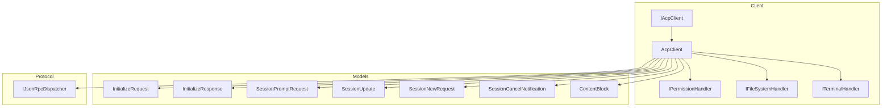
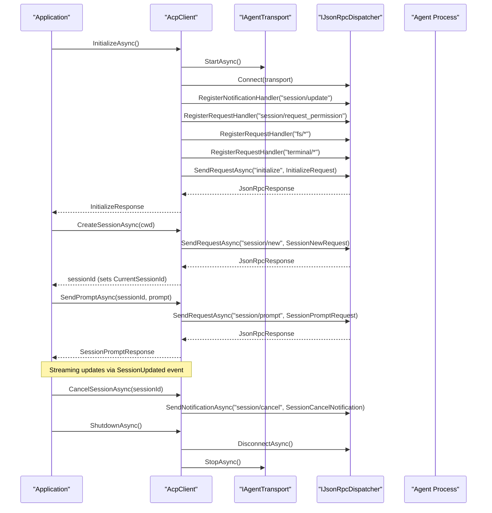
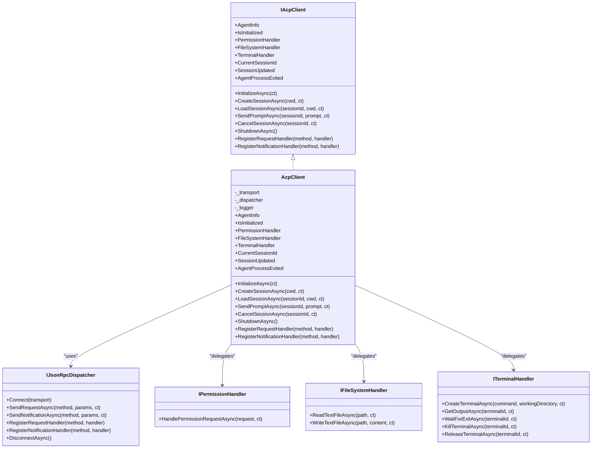

# IAcpClient Interface

<cite>
**Referenced Files in This Document**
- [IAcpClient.cs](file://Client/IAcpClient.cs)
- [AcpClient.cs](file://Client/AcpClient.cs)
- [IPermissionHandler.cs](file://Client/IPermissionHandler.cs)
- [IFileSystemHandler.cs](file://Client/IFileSystemHandler.cs)
- [ITerminalHandler.cs](file://Client/ITerminalHandler.cs)
- [InitializeRequest.cs](file://Models/InitializeRequest.cs)
- [InitializeResponse.cs](file://Models/InitializeResponse.cs)
- [SessionPromptRequest.cs](file://Models/SessionPromptRequest.cs)
- [SessionUpdate.cs](file://Models/SessionUpdate.cs)
- [SessionNewRequest.cs](file://Models/SessionNewRequest.cs)
- [SessionCancelNotification.cs](file://Models/SessionCancelNotification.cs)
- [ContentBlock.cs](file://Models/ContentBlock.cs)
- [JsonRpcRequest.cs](file://JsonRpc/JsonRpcRequest.cs)
- [JsonRpcResponse.cs](file://JsonRpc/JsonRpcResponse.cs)
- [JsonRpcNotification.cs](file://JsonRpc/JsonRpcNotification.cs)
- [IJsonRpcDispatcher.cs](file://Protocol/IJsonRpcDispatcher.cs)
</cite>

## Table of Contents
1. [Introduction](#introduction)
2. [Project Structure](#project-structure)
3. [Core Components](#core-components)
4. [Architecture Overview](#architecture-overview)
5. [Detailed Component Analysis](#detailed-component-analysis)
6. [Dependency Analysis](#dependency-analysis)
7. [Performance Considerations](#performance-considerations)
8. [Troubleshooting Guide](#troubleshooting-guide)
9. [Conclusion](#conclusion)

## Introduction
This document provides comprehensive API documentation for the IAcpClient interface, which defines the contract for an ACP protocol client. It covers all properties and methods, parameter specifications, return types, async/await patterns, exception scenarios, and extensibility points via handlers and custom JSON-RPC registrations. The goal is to enable both new and experienced users to implement and use the interface correctly and efficiently.

## Project Structure
The IAcpClient interface lives under the Client namespace and is implemented by AcpClient. Handlers for permissions, file system, and terminal operations are defined as separate interfaces. Models define request/response structures used across the protocol. The underlying transport and JSON-RPC dispatching are abstracted through IAgentTransport and IJsonRpcDispatcher.

**Diagram sources**
- [IAcpClient.cs:1-59](file://Client/IAcpClient.cs#L1-L59)
- [AcpClient.cs:12-45](file://Client/AcpClient.cs#L12-L45)
- [IPermissionHandler.cs:1-17](file://Client/IPermissionHandler.cs#L1-L17)
- [IFileSystemHandler.cs:1-14](file://Client/IFileSystemHandler.cs#L1-L14)
- [ITerminalHandler.cs:1-23](file://Client/ITerminalHandler.cs#L1-L23)
- [InitializeRequest.cs:1-16](file://Models/InitializeRequest.cs#L1-L16)
- [InitializeResponse.cs:1-28](file://Models/InitializeResponse.cs#L1-L28)
- [SessionPromptRequest.cs:1-20](file://Models/SessionPromptRequest.cs#L1-L20)
- [SessionUpdate.cs:1-119](file://Models/SessionUpdate.cs#L1-L119)
- [SessionNewRequest.cs:1-45](file://Models/SessionNewRequest.cs#L1-L45)
- [SessionCancelNotification.cs:1-10](file://Models/SessionCancelNotification.cs#L1-L10)
- [ContentBlock.cs:1-79](file://Models/ContentBlock.cs#L1-L79)
- [IJsonRpcDispatcher.cs:1-14](file://Protocol/IJsonRpcDispatcher.cs#L1-L14)

**Section sources**
- [IAcpClient.cs:1-59](file://Client/IAcpClient.cs#L1-L59)
- [AcpClient.cs:12-45](file://Client/AcpClient.cs#L12-L45)

## Core Components
- IAcpClient: Defines the client contract including state, events, lifecycle, session management, prompt handling, cancellation, shutdown, and extensibility hooks.
- AcpClient: Concrete implementation that wires transport, dispatcher, and handlers; performs initialization handshake; manages sessions; streams updates via events; and exposes registration APIs for custom JSON-RPC methods.
- Handler interfaces:
  - IPermissionHandler: Handles permission requests from the agent.
  - IFileSystemHandler: Handles file read/write requests from the agent.
  - ITerminalHandler: Handles terminal lifecycle and output requests from the agent.

Key usage patterns:
- InitializeAsync must be called before any session or prompt operations.
- CreateSessionAsync or LoadSessionAsync sets CurrentSessionId and prepares the context for SendPromptAsync.
- SessionUpdated event receives streaming updates during prompt processing.
- RegisterRequestHandler/RegisterNotificationHandler allow extending behavior for custom JSON-RPC methods.

**Section sources**
- [IAcpClient.cs:9-58](file://Client/IAcpClient.cs#L9-L58)
- [AcpClient.cs:47-182](file://Client/AcpClient.cs#L47-L182)
- [IPermissionHandler.cs:9-16](file://Client/IPermissionHandler.cs#L9-L16)
- [IFileSystemHandler.cs:6-13](file://Client/IFileSystemHandler.cs#L6-L13)
- [ITerminalHandler.cs:6-22](file://Client/ITerminalHandler.cs#L6-L22)

## Architecture Overview
The client uses a transport-agnostic approach with a JSON-RPC dispatcher. Initialization establishes transport, subscribes to process exit and session/update notifications, registers built-in handlers (permission, fs, terminal), and sends the initialize request. Session operations send JSON-RPC requests and update CurrentSessionId. Prompt sending returns a response while streaming updates arrive asynchronously via SessionUpdated. Cancellation sends a notification. Shutdown disconnects and stops the transport.

**Diagram sources**
- [AcpClient.cs:47-182](file://Client/AcpClient.cs#L47-L182)
- [AcpClient.cs:184-224](file://Client/AcpClient.cs#L184-L224)
- [AcpClient.cs:226-233](file://Client/AcpClient.cs#L226-L233)
- [IJsonRpcDispatcher.cs:1-14](file://Protocol/IJsonRpcDispatcher.cs#L1-L14)

## Detailed Component Analysis

### Properties
- AgentInfo: Returns the InitializeResponse after successful initialization. Read-only.
- IsInitialized: True when AgentInfo is not null, indicating the initialize handshake completed.
- PermissionHandler: Optional handler for agent permission requests. Set before initialization to handle incoming requests.
- FileSystemHandler: Optional handler for agent file system requests. Set before initialization.
- TerminalHandler: Optional handler for agent terminal requests. Set before initialization.
- CurrentSessionId: The active session ID set by CreateSessionAsync or LoadSessionAsync.
- SessionUpdated: Event raised for each streaming update received from the agent.
- AgentProcessExited: Event raised when the agent process exits, providing the exit code.

Usage notes:
- Handlers should be assigned prior to InitializeAsync so incoming requests can be handled immediately.
- CurrentSessionId is updated automatically by session creation/loading methods.
- Subscribe to SessionUpdated to consume streaming content and tool call updates.

**Section sources**
- [IAcpClient.cs:11-34](file://Client/IAcpClient.cs#L11-L34)
- [AcpClient.cs:19-38](file://Client/AcpClient.cs#L19-L38)

### Methods

#### InitializeAsync(CancellationToken ct = default)
Purpose:
- Starts the transport, connects the dispatcher, subscribes to process exit and session/update notifications, registers built-in handlers, and performs the initialize handshake.

Parameters:
- ct: CancellationToken to cancel initialization.

Returns:
- InitializeResponse containing agent capabilities and info.

Exceptions:
- Throws on transport start failure, network errors, or invalid responses.
- Protocol version mismatch is logged but does not throw; clients may choose to handle it.

Async pattern:
- Use await InitializeAsync(ct) and check IsInitialized afterward.

**Section sources**
- [IAcpClient.cs:36](file://Client/IAcpClient.cs#L36)
- [AcpClient.cs:47-182](file://Client/AcpClient.cs#L47-L182)

#### CreateSessionAsync(string cwd, CancellationToken ct = default)
Purpose:
- Creates a new session with the specified working directory and sets CurrentSessionId.

Parameters:
- cwd: Working directory for the session.
- ct: CancellationToken.

Returns:
- SessionId string.

Exceptions:
- Throws on request failures or invalid parameters.

Async pattern:
- await CreateSessionAsync(cwd, ct); then use returned sessionId or CurrentSessionId.

**Section sources**
- [IAcpClient.cs:39](file://Client/IAcpClient.cs#L39)
- [AcpClient.cs:184-195](file://Client/AcpClient.cs#L184-L195)
- [SessionNewRequest.cs:1-45](file://Models/SessionNewRequest.cs#L1-L45)

#### LoadSessionAsync(string sessionId, string cwd, CancellationToken ct = default)
Purpose:
- Loads an existing session into the current context and sets CurrentSessionId.

Parameters:
- sessionId: Existing session identifier.
- cwd: Working directory for the session.
- ct: CancellationToken.

Returns:
- SessionId string (same as input).

Exceptions:
- Throws on request failures or invalid parameters.

Async pattern:
- await LoadSessionAsync(sessionId, cwd, ct); then proceed with prompts.

**Section sources**
- [IAcpClient.cs:42](file://Client/IAcpClient.cs#L42)
- [AcpClient.cs:197-205](file://Client/AcpClient.cs#L197-L205)

#### SendPromptAsync(string sessionId, List<ContentBlock> prompt, CancellationToken ct = default)
Purpose:
- Sends a prompt to the specified session and waits for the final response. Streaming updates are delivered asynchronously via SessionUpdated.

Parameters:
- sessionId: Target session identifier.
- prompt: List of ContentBlock items describing the prompt content.
- ct: CancellationToken.

Returns:
- SessionPromptResponse containing stop reason.

Exceptions:
- Throws on request failures, invalid parameters, or cancellation.

Async pattern:
- await SendPromptAsync(sessionId, prompt, ct); subscribe to SessionUpdated to process streaming updates concurrently.

**Section sources**
- [IAcpClient.cs:45](file://Client/IAcpClient.cs#L45)
- [AcpClient.cs:207-216](file://Client/AcpClient.cs#L207-L216)
- [SessionPromptRequest.cs:1-20](file://Models/SessionPromptRequest.cs#L1-L20)
- [ContentBlock.cs:1-79](file://Models/ContentBlock.cs#L1-L79)

#### CancelSessionAsync(string sessionId, CancellationToken ct = default)
Purpose:
- Cancels an in-progress prompt by sending a session/cancel notification.

Parameters:
- sessionId: Target session identifier.
- ct: CancellationToken.

Returns:
- Task completing when notification is sent.

Exceptions:
- Throws on transport/dispatcher errors or cancellation.

Async pattern:
- await CancelSessionAsync(sessionId, ct); typically invoked when user cancels or timeout occurs.

**Section sources**
- [IAcpClient.cs:48](file://Client/IAcpClient.cs#L48)
- [AcpClient.cs:218-224](file://Client/AcpClient.cs#L218-L224)
- [SessionCancelNotification.cs:1-10](file://Models/SessionCancelNotification.cs#L1-L10)

#### ShutdownAsync()
Purpose:
- Shuts down the client by disconnecting the dispatcher and stopping the transport.

Returns:
- Task completing when shutdown finishes.

Exceptions:
- May throw on transport/dispatcher errors.

Async pattern:
- await ShutdownAsync(); ensure disposal if using IAsyncDisposable.

**Section sources**
- [IAcpClient.cs:51](file://Client/IAcpClient.cs#L51)
- [AcpClient.cs:226-233](file://Client/AcpClient.cs#L226-L233)

#### RegisterRequestHandler(string method, Func<JsonRpcRequest, Task<JsonRpcResponse>> handler)
Purpose:
- Registers a custom JSON-RPC request handler for extensibility.

Parameters:
- method: Method name to handle.
- handler: Async function receiving a JsonRpcRequest and returning a JsonRpcResponse.

Returns:
- void

Exceptions:
- None expected; invalid method names will simply not match incoming requests.

Async pattern:
- Call before InitializeAsync to ensure handlers are available early.

**Section sources**
- [IAcpClient.cs:54](file://Client/IAcpClient.cs#L54)
- [AcpClient.cs:243-244](file://Client/AcpClient.cs#L243-L244)
- [JsonRpcRequest.cs:1-19](file://JsonRpc/JsonRpcRequest.cs#L1-L19)
- [JsonRpcResponse.cs:1-20](file://JsonRpc/JsonRpcResponse.cs#L1-L20)

#### RegisterNotificationHandler(string method, Func<JsonRpcNotification, Task> handler)
Purpose:
- Registers a custom JSON-RPC notification handler for extensibility.

Parameters:
- method: Notification method name to handle.
- handler: Async function receiving a JsonRpcNotification.

Returns:
- void

Exceptions:
- None expected; invalid method names will simply not match incoming notifications.

Async pattern:
- Call before InitializeAsync to ensure handlers are available early.

**Section sources**
- [IAcpClient.cs:57](file://Client/IAcpClient.cs#L57)
- [AcpClient.cs:247-248](file://Client/AcpClient.cs#L247-L248)
- [JsonRpcNotification.cs:1-16](file://JsonRpc/JsonRpcNotification.cs#L1-L16)

### Events
- SessionUpdated(Func<SessionUpdate, Task>): Raised for each streaming update from the agent. Implementers should handle various SessionUpdate derived types (e.g., message chunks, tool calls, plan updates, usage updates).
- AgentProcessExited(Func<int, Task>): Raised when the agent process exits, providing the exit code.

Usage notes:
- Subscribe to these events after InitializeAsync to avoid missing early updates.
- Handle exceptions within event handlers to prevent unobserved task exceptions.

**Section sources**
- [IAcpClient.cs:29-33](file://Client/IAcpClient.cs#L29-L33)
- [AcpClient.cs:31-35](file://Client/AcpClient.cs#L31-L35)
- [SessionUpdate.cs:1-119](file://Models/SessionUpdate.cs#L1-L119)

### Handler Interfaces

#### IPermissionHandler
Responsibilities:
- Handle permission requests from the agent by presenting options to the user and returning a decision.

Key method:
- HandlePermissionRequestAsync(RequestPermissionRequest, CancellationToken): Blocks until a decision is made and returns RequestPermissionResponse.

Implementation tips:
- Present UI prompts or policy decisions.
- Return PermissionOutcome.Cancelled() or PermissionOutcome.Selected(optionId) based on user choice.

**Section sources**
- [IPermissionHandler.cs:9-16](file://Client/IPermissionHandler.cs#L9-L16)
- [RequestPermissionRequest.cs:1-47](file://Models/RequestPermissionRequest.cs#L1-L47)

#### IFileSystemHandler
Responsibilities:
- Provide text file read and write capabilities to the agent.

Key methods:
- ReadTextFileAsync(path, CancellationToken): Returns file content.
- WriteTextFileAsync(path, content, CancellationToken): Writes content to file.

Implementation tips:
- Validate paths and enforce security policies.
- Handle concurrency and locking as needed.

**Section sources**
- [IFileSystemHandler.cs:6-13](file://Client/IFileSystemHandler.cs#L6-L13)

#### ITerminalHandler
Responsibilities:
- Manage terminal processes requested by the agent.

Key methods:
- CreateTerminalAsync(command, workingDirectory, CancellationToken): Returns terminalId.
- GetOutputAsync(terminalId, CancellationToken): Retrieves terminal output.
- WaitForExitAsync(terminalId, CancellationToken): Waits for process exit and returns exit code.
- KillTerminalAsync(terminalId, CancellationToken): Terminates the terminal process.
- ReleaseTerminalAsync(terminalId, CancellationToken): Releases resources.

Implementation tips:
- Ensure proper resource cleanup and error propagation.
- Support concurrent terminals safely.

**Section sources**
- [ITerminalHandler.cs:6-22](file://Client/ITerminalHandler.cs#L6-L22)

### Data Models Overview
- InitializeRequest/InitializeResponse: Define client capabilities and agent info exchanged during initialization.
- SessionPromptRequest/SessionPromptResponse: Define prompt payloads and final response metadata.
- SessionUpdate hierarchy: Polymorphic types for streaming updates including messages, thoughts, tool calls, plans, and usage.
- ContentBlock hierarchy: Polymorphic types for text, images, audio, embedded resources, and resource links.
- SessionNewRequest/SessionNewResponse: Define session creation parameters and results.
- SessionCancelNotification: Defines cancellation payload.

**Section sources**
- [InitializeRequest.cs:1-16](file://Models/InitializeRequest.cs#L1-L16)
- [InitializeResponse.cs:1-28](file://Models/InitializeResponse.cs#L1-L28)
- [SessionPromptRequest.cs:1-20](file://Models/SessionPromptRequest.cs#L1-L20)
- [SessionUpdate.cs:1-119](file://Models/SessionUpdate.cs#L1-L119)
- [ContentBlock.cs:1-79](file://Models/ContentBlock.cs#L1-L79)
- [SessionNewRequest.cs:1-45](file://Models/SessionNewRequest.cs#L1-L45)
- [SessionCancelNotification.cs:1-10](file://Models/SessionCancelNotification.cs#L1-L10)

## Dependency Analysis
IAcpClient depends on:
- IAgentTransport for communication lifecycle.
- IJsonRpcDispatcher for JSON-RPC messaging and handler registration.
- Handler interfaces for extensibility.
- Model classes for serialization/deserialization.

**Diagram sources**
- [IAcpClient.cs:1-59](file://Client/IAcpClient.cs#L1-L59)
- [AcpClient.cs:12-45](file://Client/AcpClient.cs#L12-L45)
- [IPermissionHandler.cs:1-17](file://Client/IPermissionHandler.cs#L1-L17)
- [IFileSystemHandler.cs:1-14](file://Client/IFileSystemHandler.cs#L1-L14)
- [ITerminalHandler.cs:1-23](file://Client/ITerminalHandler.cs#L1-L23)
- [IJsonRpcDispatcher.cs:1-14](file://Protocol/IJsonRpcDispatcher.cs#L1-L14)

**Section sources**
- [IAcpClient.cs:1-59](file://Client/IAcpClient.cs#L1-L59)
- [AcpClient.cs:12-45](file://Client/AcpClient.cs#L12-L45)
- [IJsonRpcDispatcher.cs:1-14](file://Protocol/IJsonRpcDispatcher.cs#L1-L14)

## Performance Considerations
- Prefer asynchronous patterns throughout; avoid blocking calls in handlers.
- Stream updates via SessionUpdated to reduce latency and memory pressure.
- Reuse handlers and avoid heavy allocations per request.
- Use CancellationToken consistently to support responsive cancellation.
- Log important lifecycle events without excessive verbosity in production.

[No sources needed since this section provides general guidance]

## Troubleshooting Guide
Common issues and resolutions:
- Not initialized: Ensure InitializeAsync completes successfully and IsInitialized is true before calling session methods.
- Missing handlers: Assign PermissionHandler, FileSystemHandler, and TerminalHandler before InitializeAsync to avoid “not available” errors.
- Protocol version mismatch: Logged during initialization; verify agent compatibility.
- Streaming updates not received: Confirm SessionUpdated subscription occurs after InitializeAsync and that no exceptions occur in event handlers.
- Process exit: Handle AgentProcessExited to detect unexpected termination and reinitialize as needed.

**Section sources**
- [AcpClient.cs:56-72](file://Client/AcpClient.cs#L56-L72)
- [AcpClient.cs:176-179](file://Client/AcpClient.cs#L176-L179)

## Conclusion
The IAcpClient interface provides a robust, extensible foundation for interacting with an ACP agent. By following the documented patterns—initializing properly, managing sessions, handling streaming updates, and implementing required handlers—developers can build reliable and responsive integrations. Extensibility via custom JSON-RPC handlers enables rich functionality tailored to specific application needs.

[No sources needed since this section summarizes without analyzing specific files]