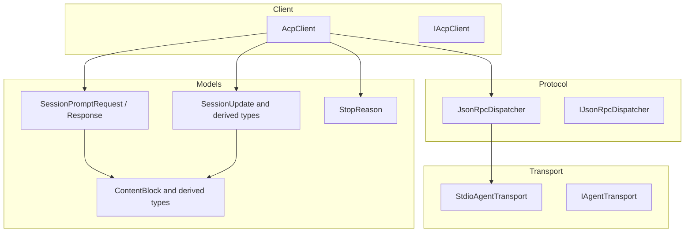
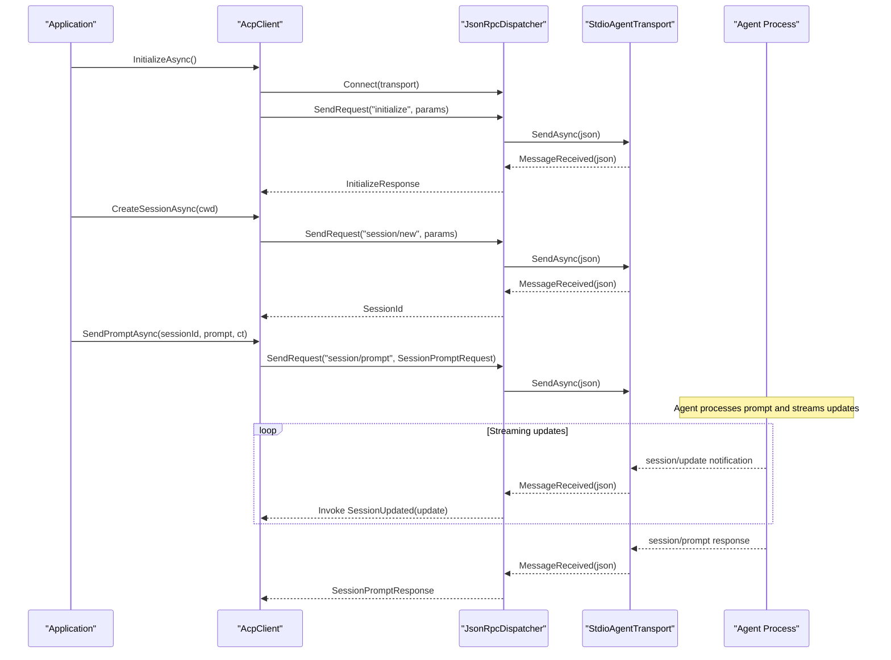
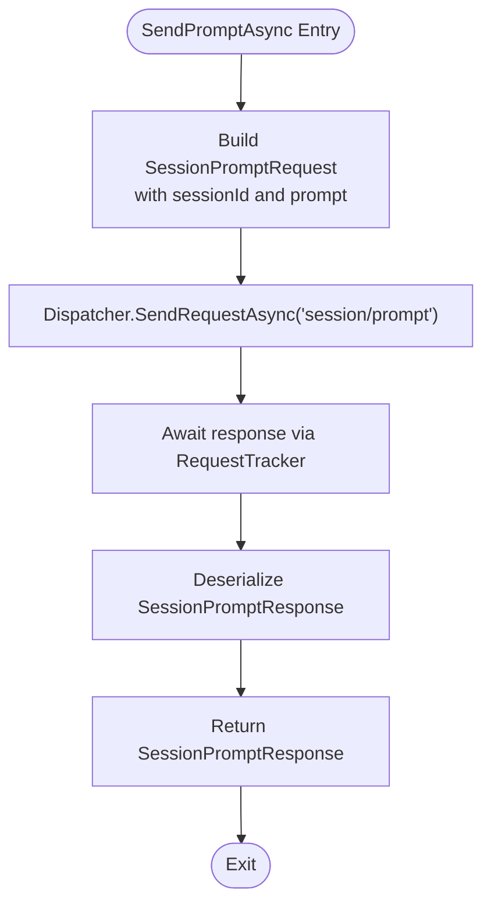
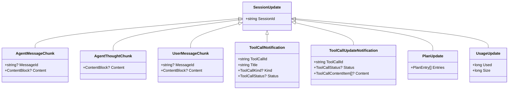
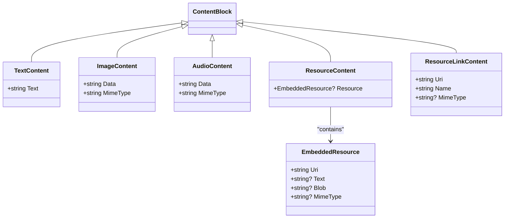
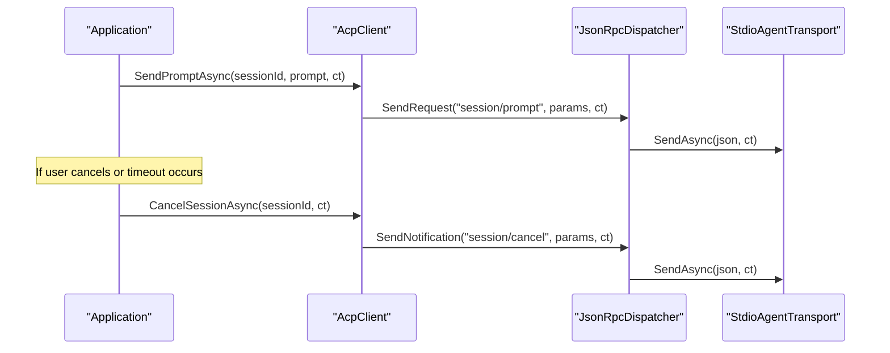
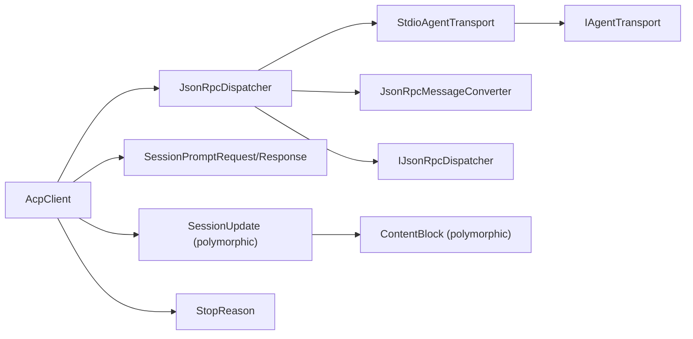

# Prompt Handling and Streaming

<cite>
**Referenced Files in This Document**
- [AcpClient.cs](file://Client/AcpClient.cs)
- [IAcpClient.cs](file://Client/IAcpClient.cs)
- [SessionPromptRequest.cs](file://Models/SessionPromptRequest.cs)
- [ContentBlock.cs](file://Models/ContentBlock.cs)
- [SessionUpdate.cs](file://Models/SessionUpdate.cs)
- [SessionUpdateWrapper.cs](file://Models/SessionUpdateWrapper.cs)
- [StopReason.cs](file://Models/Enums/StopReason.cs)
- [ToolCallKind.cs](file://Models/Enums/ToolCallKind.cs)
- [ToolCallStatus.cs](file://Models/Enums/ToolCallStatus.cs)
- [JsonRpcDispatcher.cs](file://Protocol/JsonRpcDispatcher.cs)
- [IJsonRpcDispatcher.cs](file://Protocol/IJsonRpcDispatcher.cs)
- [StdioAgentTransport.cs](file://Transport/StdioAgentTransport.cs)
- [IAgentTransport.cs](file://Transport/IAgentTransport.cs)
- [JsonRpcMessageConverter.cs](file://JsonRpc/JsonRpcMessageConverter.cs)
- [JsonRpcMessage.cs](file://JsonRpc/JsonRpcMessage.cs)
- [Capabilities.cs](file://Models/Capabilities.cs)
- [README.md](file://README.md)
</cite>

## Table of Contents
1. [Introduction](#introduction)
2. [Project Structure](#project-structure)
3. [Core Components](#core-components)
4. [Architecture Overview](#architecture-overview)
5. [Detailed Component Analysis](#detailed-component-analysis)
6. [Dependency Analysis](#dependency-analysis)
7. [Performance Considerations](#performance-considerations)
8. [Troubleshooting Guide](#troubleshooting-guide)
9. [Conclusion](#conclusion)
10. [Appendices](#appendices)

## Introduction
This document explains how prompts are sent, processed, and streamed back to the client using the ACP library. It focuses on:
- The SendPromptAsync method and how it handles ContentBlock arrays for prompt construction.
- The streaming architecture where SessionUpdated events deliver real-time updates during prompt processing.
- Different ContentBlock types (text, image, audio, resources) and their usage patterns.
- SessionUpdate base class and its derived types for various update scenarios.
- Cancellation patterns using CancellationToken for long-running prompts.
- Examples of handling streaming responses, implementing progress indicators, and managing large prompts.
- Error scenarios, timeout handling, and best practices for prompt construction and processing.

## Project Structure
The library is organized into layers:
- Client layer: high-level API for interacting with agents (session lifecycle, prompts, handlers).
- Protocol layer: JSON-RPC dispatching and request tracking.
- Transport layer: stdio-based transport for process communication.
- Models: data contracts for requests, responses, content blocks, and streaming updates.
- JsonRpc utilities: message conversion and polymorphic deserialization.

**Diagram sources**
- [AcpClient.cs:12-45](file://Client/AcpClient.cs#L12-L45)
- [IAcpClient.cs:9-58](file://Client/IAcpClient.cs#L9-L58)
- [JsonRpcDispatcher.cs:9-26](file://Protocol/JsonRpcDispatcher.cs#L9-L26)
- [IJsonRpcDispatcher.cs:5-13](file://Protocol/IJsonRpcDispatcher.cs#L5-L13)
- [StdioAgentTransport.cs:8-28](file://Transport/StdioAgentTransport.cs#L8-L28)
- [IAgentTransport.cs:6-28](file://Transport/IAgentTransport.cs#L6-L28)
- [SessionPromptRequest.cs:6-19](file://Models/SessionPromptRequest.cs#L6-L19)
- [ContentBlock.cs:15-79](file://Models/ContentBlock.cs#L15-L79)
- [SessionUpdate.cs:18-119](file://Models/SessionUpdate.cs#L18-L119)
- [StopReason.cs:6-19](file://Models/Enums/StopReason.cs#L6-L19)

**Section sources**
- [README.md:1-99](file://README.md#L1-L99)

## Core Components
- AcpClient implements IAcpClient and orchestrates initialization, session management, sending prompts, and subscribing to streaming updates via SessionUpdated.
- JsonRpcDispatcher manages JSON-RPC requests, notifications, and response correlation.
- StdioAgentTransport provides a stdio-based transport over a child process.
- Models define the shape of prompts (ContentBlock), updates (SessionUpdate), and responses (SessionPromptResponse).

Key responsibilities:
- AcpClient.SendPromptAsync constructs a SessionPromptRequest and sends it via the dispatcher; streaming updates arrive through SessionUpdated.
- Dispatcher routes incoming messages to appropriate handlers and completes pending requests.
- Transport reads/writes JSON lines and raises events for incoming messages and process lifecycle.

**Section sources**
- [AcpClient.cs:207-216](file://Client/AcpClient.cs#L207-L216)
- [JsonRpcDispatcher.cs:27-47](file://Protocol/JsonRpcDispatcher.cs#L27-L47)
- [StdioAgentTransport.cs:30-59](file://Transport/StdioAgentTransport.cs#L30-L59)

## Architecture Overview
The prompt flow combines synchronous request/response for the final result and asynchronous streaming updates via notifications.

**Diagram sources**
- [AcpClient.cs:47-182](file://Client/AcpClient.cs#L47-L182)
- [AcpClient.cs:207-216](file://Client/AcpClient.cs#L207-L216)
- [JsonRpcDispatcher.cs:27-47](file://Protocol/JsonRpcDispatcher.cs#L27-L47)
- [JsonRpcDispatcher.cs:86-122](file://Protocol/JsonRpcDispatcher.cs#L86-L122)
- [StdioAgentTransport.cs:95-118](file://Transport/StdioAgentTransport.cs#L95-L118)

## Detailed Component Analysis

### SendPromptAsync: Prompt Construction and Response Handling
- Accepts a sessionId and a List<ContentBlock> representing the prompt payload.
- Serializes the request using SessionPromptRequest and sends it via the dispatcher.
- Returns a SessionPromptResponse containing StopReason indicating why the turn ended.
- Streaming updates are delivered asynchronously through the SessionUpdated event.

**Diagram sources**
- [AcpClient.cs:207-216](file://Client/AcpClient.cs#L207-L216)
- [SessionPromptRequest.cs:6-19](file://Models/SessionPromptRequest.cs#L6-L19)
- [JsonRpcDispatcher.cs:27-47](file://Protocol/JsonRpcDispatcher.cs#L27-L47)

**Section sources**
- [AcpClient.cs:207-216](file://Client/AcpClient.cs#L207-L216)
- [SessionPromptRequest.cs:6-19](file://Models/SessionPromptRequest.cs#L6-L19)
- [StopReason.cs:6-19](file://Models/Enums/StopReason.cs#L6-L19)

### Streaming Updates: SessionUpdated Event
- During prompt processing, the agent emits session/update notifications.
- The dispatcher deserializes each notification and invokes the registered handler.
- AcpClient registers a handler that deserializes the wrapper and raises SessionUpdated with the concrete SessionUpdate instance.

**Diagram sources**
- [SessionUpdate.cs:18-119](file://Models/SessionUpdate.cs#L18-L119)
- [ToolCallKind.cs:6-27](file://Models/Enums/ToolCallKind.cs#L6-L27)
- [ToolCallStatus.cs:6-17](file://Models/Enums/ToolCallStatus.cs#L6-L17)

**Section sources**
- [AcpClient.cs:63-72](file://Client/AcpClient.cs#L63-L72)
- [SessionUpdateWrapper.cs:9-16](file://Models/SessionUpdateWrapper.cs#L9-L16)
- [SessionUpdate.cs:18-119](file://Models/SessionUpdate.cs#L18-L119)

### ContentBlock Types and Usage Patterns
- ContentBlock is a polymorphic type discriminated by the "type" field.
- Supported derived types:
  - TextContent: contains text.
  - ImageContent: contains base64-like data and MIME type.
  - AudioContent: contains base64-like data and MIME type.
  - ResourceContent: embeds an EmbeddedResource with URI, optional text/blob/mime.
  - ResourceLinkContent: references a resource by URI, name, and optional MIME type.
- Use these types to construct rich prompts including multimodal inputs.

**Diagram sources**
- [ContentBlock.cs:15-79](file://Models/ContentBlock.cs#L15-L79)

**Section sources**
- [ContentBlock.cs:15-79](file://Models/ContentBlock.cs#L15-L79)
- [Capabilities.cs:38-51](file://Models/Capabilities.cs#L38-L51)

### Cancellation Patterns with CancellationToken
- SendPromptAsync accepts a CancellationToken to propagate cancellation to the underlying request pipeline.
- CancelSessionAsync sends a session/cancel notification to request termination of ongoing work.
- The transport supports cancellation in read loops and stop operations.

**Diagram sources**
- [AcpClient.cs:207-216](file://Client/AcpClient.cs#L207-L216)
- [AcpClient.cs:218-224](file://Client/AcpClient.cs#L218-L224)
- [JsonRpcDispatcher.cs:49-64](file://Protocol/JsonRpcDispatcher.cs#L49-L64)
- [StdioAgentTransport.cs:61-68](file://Transport/StdioAgentTransport.cs#L61-L68)

**Section sources**
- [AcpClient.cs:207-224](file://Client/AcpClient.cs#L207-L224)
- [StdioAgentTransport.cs:95-118](file://Transport/StdioAgentTransport.cs#L95-L118)

### Handling Streaming Responses and Implementing Progress Indicators
- Subscribe to SessionUpdated to receive incremental updates.
- For UI progress, aggregate chunks from AgentMessageChunk and UserMessageChunk to render live text.
- Track tool calls using ToolCallNotification and ToolCallUpdateNotification to show status transitions.
- Use UsageUpdate to reflect token usage or size metrics if needed.

Best practices:
- Update UI on the main thread when marshaling events.
- Debounce frequent updates to avoid UI thrashing.
- Maintain a running buffer per messageId for coherent rendering.

[No sources needed since this section provides general guidance]

### Managing Large Prompts
- Prefer ResourceLinkContent for large files to avoid embedding massive payloads.
- Use ResourceContent only when necessary and ensure MIME types are correct.
- Split prompts into multiple messages if the agent has limits.
- Monitor StopReason to handle cases like MaxTokens gracefully.

**Section sources**
- [ContentBlock.cs:43-79](file://Models/ContentBlock.cs#L43-L79)
- [StopReason.cs:6-19](file://Models/Enums/StopReason.cs#L6-L19)

### Error Scenarios and Timeout Handling
- Transport faults raise TransportFaulted; handle to log and recover.
- Dispatcher ignores deserialization/handler exceptions internally; ensure robust handlers.
- Use CancellationToken to enforce timeouts on SendPromptAsync and CancelSessionAsync.
- Check StopReason for reasons such as Refusal or Cancelled to inform users.

**Section sources**
- [StdioAgentTransport.cs:113-117](file://Transport/StdioAgentTransport.cs#L113-L117)
- [JsonRpcDispatcher.cs:118-122](file://Protocol/JsonRpcDispatcher.cs#L118-L122)
- [StopReason.cs:6-19](file://Models/Enums/StopReason.cs#L6-L19)

## Dependency Analysis
The following diagram shows key dependencies between components involved in prompt handling and streaming.

**Diagram sources**
- [AcpClient.cs:12-45](file://Client/AcpClient.cs#L12-L45)
- [JsonRpcDispatcher.cs:9-26](file://Protocol/JsonRpcDispatcher.cs#L9-L26)
- [StdioAgentTransport.cs:8-28](file://Transport/StdioAgentTransport.cs#L8-L28)
- [SessionPromptRequest.cs:6-19](file://Models/SessionPromptRequest.cs#L6-L19)
- [SessionUpdate.cs:18-119](file://Models/SessionUpdate.cs#L18-L119)
- [ContentBlock.cs:15-79](file://Models/ContentBlock.cs#L15-L79)
- [StopReason.cs:6-19](file://Models/Enums/StopReason.cs#L6-L19)
- [JsonRpcMessageConverter.cs:9-32](file://JsonRpc/JsonRpcMessageConverter.cs#L9-L32)
- [IAgentTransport.cs:6-28](file://Transport/IAgentTransport.cs#L6-L28)
- [IJsonRpcDispatcher.cs:5-13](file://Protocol/IJsonRpcDispatcher.cs#L5-L13)

**Section sources**
- [JsonRpcMessageConverter.cs:9-32](file://JsonRpc/JsonRpcMessageConverter.cs#L9-L32)
- [JsonRpcMessage.cs:9-13](file://JsonRpc/JsonRpcMessage.cs#L9-L13)

## Performance Considerations
- Avoid embedding large binary data directly; prefer resource links to reduce payload size.
- Batch UI updates when handling frequent streaming chunks to minimize re-renders.
- Use CancellationToken to prevent unnecessary work and free resources promptly.
- Ensure handlers for permission, file system, and terminal requests are efficient and non-blocking.

[No sources needed since this section provides general guidance]

## Troubleshooting Guide
Common issues and resolutions:
- No SessionUpdated events: verify that SessionUpdated is subscribed before InitializeAsync and that the dispatcher is connected.
- Deserialization errors: check that polymorphic discriminators match expected values ("type" for ContentBlock, "sessionUpdate" for SessionUpdate).
- Timeouts: wrap SendPromptAsync with a CancellationTokenSource and call CancelSessionAsync on timeout.
- Transport failures: listen to TransportFaulted and implement retry or graceful degradation.
- Unexpected StopReason: inspect StopReason to determine whether the agent refused, was cancelled, or hit token limits.

**Section sources**
- [AcpClient.cs:63-72](file://Client/AcpClient.cs#L63-L72)
- [JsonRpcDispatcher.cs:118-122](file://Protocol/JsonRpcDispatcher.cs#L118-L122)
- [StdioAgentTransport.cs:113-117](file://Transport/StdioAgentTransport.cs#L113-L117)
- [StopReason.cs:6-19](file://Models/Enums/StopReason.cs#L6-L19)

## Conclusion
The ACP library provides a robust mechanism for sending prompts and receiving real-time streaming updates. By leveraging ContentBlock polymorphism, SessionUpdate-derived types, and cancellation tokens, applications can build responsive, resilient experiences. Follow the best practices outlined here to manage large prompts, implement progress indicators, and handle errors effectively.

[No sources needed since this section summarizes without analyzing specific files]

## Appendices

### Best Practices for Prompt Construction and Processing
- Compose prompts using mixed ContentBlock types to support multimodal inputs.
- Validate MIME types and URIs for resource-based content.
- Keep prompts concise and structured; split complex requests across multiple turns if needed.
- Always honor cancellation signals to maintain responsiveness.

[No sources needed since this section provides general guidance]