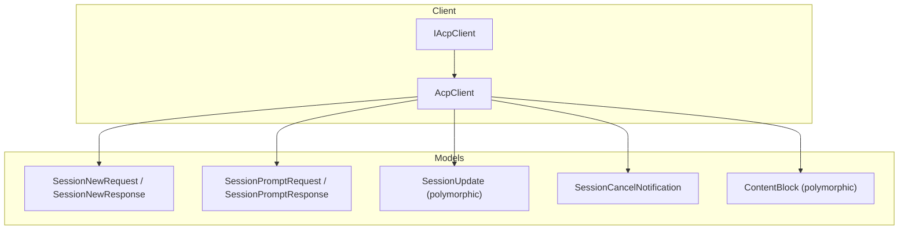
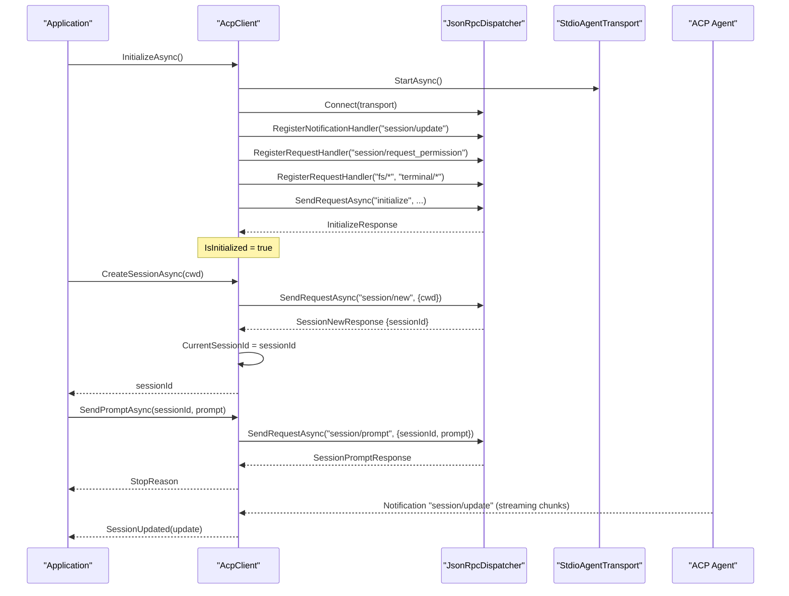
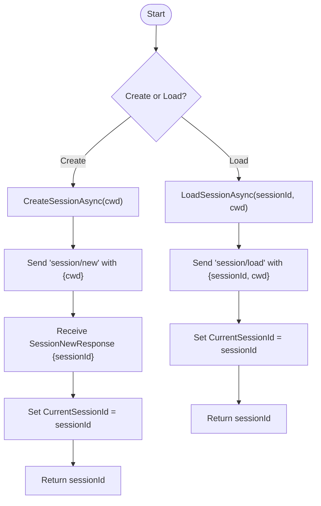
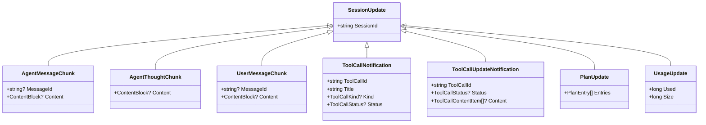
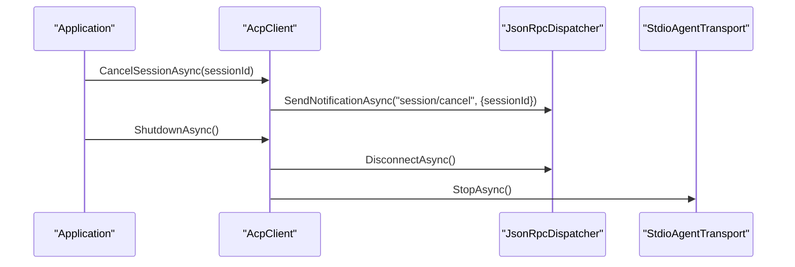
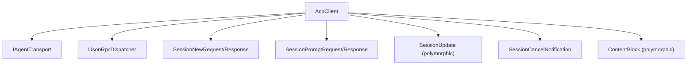

# Session Management

<cite>
**Referenced Files in This Document**
- [AcpClient.cs](file://Client/AcpClient.cs)
- [IAcpClient.cs](file://Client/IAcpClient.cs)
- [SessionNewRequest.cs](file://Models/SessionNewRequest.cs)
- [SessionPromptRequest.cs](file://Models/SessionPromptRequest.cs)
- [SessionUpdate.cs](file://Models/SessionUpdate.cs)
- [SessionCancelNotification.cs](file://Models/SessionCancelNotification.cs)
- [ContentBlock.cs](file://Models/ContentBlock.cs)
- [README.md](file://README.md)
</cite>

## Table of Contents
1. [Introduction](#introduction)
2. [Project Structure](#project-structure)
3. [Core Components](#core-components)
4. [Architecture Overview](#architecture-overview)
5. [Detailed Component Analysis](#detailed-component-analysis)
6. [Dependency Analysis](#dependency-analysis)
7. [Performance Considerations](#performance-considerations)
8. [Troubleshooting Guide](#troubleshooting-guide)
9. [Conclusion](#conclusion)
10. [Appendices](#appendices)

## Introduction
This document explains the session management functionality provided by the ACP client library. It covers the complete lifecycle of sessions from creation to destruction, including how to create and load sessions, track the current session, send prompts, handle streaming updates, cancel operations, and shut down resources. It also documents session state management, validation patterns, persistence concepts, ID generation, recovery scenarios, and best practices for concurrent operations and cleanup.

## Project Structure
The session management features are implemented primarily in the Client and Models layers:
- Client layer exposes the public API for session operations and tracks the current session.
- Models define request/response payloads and streaming update types used by sessions.

**Diagram sources**
- [IAcpClient.cs:1-59](file://Client/IAcpClient.cs#L1-L59)
- [AcpClient.cs:1-361](file://Client/AcpClient.cs#L1-L361)
- [SessionNewRequest.cs:1-45](file://Models/SessionNewRequest.cs#L1-L45)
- [SessionPromptRequest.cs:1-20](file://Models/SessionPromptRequest.cs#L1-L20)
- [SessionUpdate.cs:1-119](file://Models/SessionUpdate.cs#L1-L119)
- [SessionCancelNotification.cs:1-10](file://Models/SessionCancelNotification.cs#L1-L10)
- [ContentBlock.cs:1-79](file://Models/ContentBlock.cs#L1-L79)

**Section sources**
- [README.md:1-99](file://README.md#L1-L99)

## Core Components
- AcpClient implements IAcpClient and provides methods to initialize the transport, create and load sessions, send prompts, cancel operations, and manage events.
- CurrentSessionId is a property that tracks the active session within the client instance.
- Session models encapsulate protocol messages for creating sessions, sending prompts, receiving updates, and canceling operations.

Key responsibilities:
- CreateSessionAsync: creates a new session with a working directory and sets CurrentSessionId.
- LoadSessionAsync: loads an existing session by sessionId and cwd, then sets CurrentSessionId.
- SendPromptAsync: sends a prompt to a specified session and returns a response; streaming updates arrive via SessionUpdated event.
- CancelSessionAsync: cancels an ongoing operation on a session.
- ShutdownAsync: disconnects transport and stops the agent process.

**Section sources**
- [AcpClient.cs:184-205](file://Client/AcpClient.cs#L184-L205)
- [AcpClient.cs:207-224](file://Client/AcpClient.cs#L207-L224)
- [AcpClient.cs:226-233](file://Client/AcpClient.cs#L226-L233)
- [IAcpClient.cs:26-48](file://Client/IAcpClient.cs#L26-L48)

## Architecture Overview
The session lifecycle flows through JSON-RPC requests and notifications over a stdio transport. The client initializes the transport, registers handlers for notifications and requests, and exposes session methods that map to specific protocol endpoints.

**Diagram sources**
- [AcpClient.cs:47-182](file://Client/AcpClient.cs#L47-L182)
- [AcpClient.cs:184-205](file://Client/AcpClient.cs#L184-L205)
- [AcpClient.cs:207-224](file://Client/AcpClient.cs#L207-L224)
- [SessionNewRequest.cs:1-45](file://Models/SessionNewRequest.cs#L1-L45)
- [SessionPromptRequest.cs:1-20](file://Models/SessionPromptRequest.cs#L1-L20)
- [SessionUpdate.cs:1-119](file://Models/SessionUpdate.cs#L1-L119)

## Detailed Component Analysis

### Session Lifecycle: Creation and Loading
- CreateSessionAsync(cwd):
  - Parameters: cwd (working directory), optional CancellationToken.
  - Behavior: Sends a "session/new" request with cwd; receives SessionNewResponse containing sessionId; sets CurrentSessionId; returns sessionId.
  - Return value: sessionId string.
  - Error handling: Exceptions may be thrown by underlying transport or dispatcher if initialization fails or the agent rejects the request.

- LoadSessionAsync(sessionId, cwd):
  - Parameters: sessionId (existing session identifier), cwd (working directory), optional CancellationToken.
  - Behavior: Sends a "session/load" request with sessionId and cwd; sets CurrentSessionId to the provided sessionId; returns sessionId.
  - Return value: sessionId string.
  - Error handling: Exceptions may be thrown if the session does not exist or the agent rejects the load request.

- CurrentSessionId:
  - Property updated after successful CreateSessionAsync or LoadSessionAsync.
  - Used to identify the active session for subsequent operations when convenient, though SendPromptAsync requires explicit sessionId.

**Diagram sources**
- [AcpClient.cs:184-205](file://Client/AcpClient.cs#L184-L205)
- [SessionNewRequest.cs:1-45](file://Models/SessionNewRequest.cs#L1-L45)

**Section sources**
- [AcpClient.cs:184-205](file://Client/AcpClient.cs#L184-L205)
- [IAcpClient.cs:38-42](file://Client/IAcpClient.cs#L38-L42)

### Prompting and Streaming Updates
- SendPromptAsync(sessionId, prompt):
  - Parameters: sessionId (target session), prompt (list of ContentBlock items), optional CancellationToken.
  - Behavior: Sends a "session/prompt" request with sessionId and prompt; returns SessionPromptResponse containing stop reason.
  - Streaming: While waiting for the response, the agent may emit "session/update" notifications carrying various chunk types (agent message, thought, tool call, usage, etc.). These are delivered via the SessionUpdated event.

- SessionUpdate polymorphism:
  - Base type SessionUpdate includes sessionId.
  - Derived types include AgentMessageChunk, AgentThoughtChunk, UserMessageChunk, ToolCallNotification, ToolCallUpdateNotification, PlanUpdate, UsageUpdate.
  - Polymorphic deserialization uses a discriminator field and falls back to base type for unknown variants.

**Diagram sources**
- [SessionUpdate.cs:1-119](file://Models/SessionUpdate.cs#L1-L119)

**Section sources**
- [AcpClient.cs:207-216](file://Client/AcpClient.cs#L207-L216)
- [SessionPromptRequest.cs:1-20](file://Models/SessionPromptRequest.cs#L1-L20)
- [ContentBlock.cs:1-79](file://Models/ContentBlock.cs#L1-L79)
- [SessionUpdate.cs:1-119](file://Models/SessionUpdate.cs#L1-L119)

### Cancellation and Shutdown
- CancelSessionAsync(sessionId):
  - Parameters: sessionId (target session), optional CancellationToken.
  - Behavior: Sends a "session/cancel" notification with sessionId to cancel an in-progress prompt.

- ShutdownAsync():
  - Behavior: Disconnects the dispatcher and stops the transport; marks the client as disposed to prevent further operations.

- DisposeAsync():
  - Delegates to ShutdownAsync and suppresses finalization.

**Diagram sources**
- [AcpClient.cs:218-233](file://Client/AcpClient.cs#L218-L233)
- [SessionCancelNotification.cs:1-10](file://Models/SessionCancelNotification.cs#L1-L10)

**Section sources**
- [AcpClient.cs:218-233](file://Client/AcpClient.cs#L218-L233)

### Relationship Between Sessions and Prompts
- Each prompt is explicitly associated with a sessionId in the request payload.
- Streaming updates carry sessionId to indicate which session produced the update.
- CurrentSessionId is a convenience tracker for the most recently created or loaded session but does not replace explicit sessionId usage in SendPromptAsync.

**Section sources**
- [SessionPromptRequest.cs:1-20](file://Models/SessionPromptRequest.cs#L1-L20)
- [SessionUpdate.cs:1-119](file://Models/SessionUpdate.cs#L1-L119)
- [AcpClient.cs:184-205](file://Client/AcpClient.cs#L184-L205)

### Session State Management and Validation Patterns
- State tracking:
  - CurrentSessionId reflects the last successfully created or loaded session.
  - Ensure CurrentSessionId is non-null before relying on it for UI or logging; always pass sessionId explicitly to SendPromptAsync.

- Validation patterns:
  - Validate cwd is a valid path string before calling CreateSessionAsync or LoadSessionAsync.
  - Validate sessionId is non-empty and matches expected format before LoadSessionAsync or SendPromptAsync.
  - Check IsInitialized before any session operations to ensure transport and handshake completed.

- Concurrency considerations:
  - Avoid concurrent calls to CreateSessionAsync or LoadSessionAsync on the same client instance unless you intend to switch sessions rapidly; each call updates CurrentSessionId.
  - Use separate client instances for parallel independent sessions if needed.
  - Handle cancellation tokens to abort long-running operations gracefully.

**Section sources**
- [AcpClient.cs:184-205](file://Client/AcpClient.cs#L184-L205)
- [AcpClient.cs:207-216](file://Client/AcpClient.cs#L207-L216)
- [IAcpClient.cs:14-15](file://Client/IAcpClient.cs#L14-L15)

### Persistence Concepts, ID Generation, and Recovery
- Persistence:
  - The client does not implement persistent storage of sessions; sessions are managed by the agent process.
  - To persist across application restarts, store sessionId returned by CreateSessionAsync or LoadSessionAsync externally.

- ID generation:
  - sessionId is generated by the agent and returned in SessionNewResponse; clients should treat it as opaque.

- Recovery scenarios:
  - On app restart, attempt to LoadSessionAsync with a previously stored sessionId and cwd.
  - If LoadSessionAsync fails (e.g., session no longer exists), fall back to CreateSessionAsync and update stored sessionId.
  - Re-subscribe to SessionUpdated event to resume streaming updates.

**Section sources**
- [SessionNewRequest.cs:1-45](file://Models/SessionNewRequest.cs#L1-L45)
- [AcpClient.cs:184-205](file://Client/AcpClient.cs#L184-L205)

### Examples: Creating Multiple Sessions, Switching, and Cleanup
- Creating multiple sessions:
  - Call CreateSessionAsync multiple times with different cwd values; keep track of returned sessionId values.
  - Use SendPromptAsync with the appropriate sessionId per session.

- Switching between sessions:
  - After creating or loading a session, CurrentSessionId is updated; use this for convenience but still pass sessionId explicitly to SendPromptAsync.

- Proper cleanup:
  - Call CancelSessionAsync to cancel ongoing prompts.
  - Call ShutdownAsync to disconnect and stop the transport.
  - Implement IDisposable pattern using DisposeAsync to ensure resources are released.

[No sources needed since this section provides general guidance]

## Dependency Analysis
The session management depends on the following components:
- AcpClient depends on IAgentTransport and IJsonRpcDispatcher for communication.
- Models define the structure of requests, responses, and streaming updates.
- Events provide asynchronous callbacks for updates and process exit.

**Diagram sources**
- [AcpClient.cs:1-45](file://Client/AcpClient.cs#L1-L45)
- [SessionNewRequest.cs:1-45](file://Models/SessionNewRequest.cs#L1-L45)
- [SessionPromptRequest.cs:1-20](file://Models/SessionPromptRequest.cs#L1-L20)
- [SessionUpdate.cs:1-119](file://Models/SessionUpdate.cs#L1-L119)
- [SessionCancelNotification.cs:1-10](file://Models/SessionCancelNotification.cs#L1-L10)
- [ContentBlock.cs:1-79](file://Models/ContentBlock.cs#L1-L79)

**Section sources**
- [AcpClient.cs:1-45](file://Client/AcpClient.cs#L1-L45)

## Performance Considerations
- Streaming updates:
  - Session updates are delivered asynchronously via events; avoid blocking the event handler to maintain responsiveness.
  - Buffer or throttle updates if necessary for UI rendering.

- Cancellation:
  - Propagate CancellationToken to all async operations to allow timely cancellation.

- Resource management:
  - Ensure ShutdownAsync is called to release transport and dispatcher resources.
  - Avoid holding onto large ContentBlock payloads unnecessarily.

[No sources needed since this section provides general guidance]

## Troubleshooting Guide
Common issues and resolutions:
- Invalid session errors:
  - Ensure sessionId is non-empty and corresponds to an existing session before calling SendPromptAsync or CancelSessionAsync.
  - Validate cwd is correct and accessible.

- Concurrent operations:
  - Do not call CreateSessionAsync or LoadSessionAsync concurrently on the same client instance without coordinating state changes.
  - Use separate client instances for parallel workflows.

- Missing handlers:
  - If permission, file system, or terminal handlers are not set, related requests will return error responses indicating unavailability.

- Process exit:
  - Subscribe to AgentProcessExited to detect unexpected termination and recover or reinitialize.

**Section sources**
- [AcpClient.cs:74-147](file://Client/AcpClient.cs#L74-L147)
- [AcpClient.cs:250-358](file://Client/AcpClient.cs#L250-L358)
- [AcpClient.cs:56-61](file://Client/AcpClient.cs#L56-L61)

## Conclusion
The session management API provides a clear and robust mechanism for creating, loading, and interacting with sessions over the ACP protocol. By understanding the lifecycle, state tracking, streaming updates, and proper resource management, developers can build reliable applications that handle multiple sessions, switch contexts safely, and recover from failures gracefully.

[No sources needed since this section summarizes without analyzing specific files]

## Appendices

### API Reference Summary
- CreateSessionAsync(cwd): Creates a new session and sets CurrentSessionId; returns sessionId.
- LoadSessionAsync(sessionId, cwd): Loads an existing session and sets CurrentSessionId; returns sessionId.
- SendPromptAsync(sessionId, prompt): Sends a prompt to a session; returns stop reason; streaming updates via SessionUpdated.
- CancelSessionAsync(sessionId): Cancels an in-progress prompt.
- ShutdownAsync(): Disconnects and stops the transport.

**Section sources**
- [IAcpClient.cs:38-51](file://Client/IAcpClient.cs#L38-L51)
- [AcpClient.cs:184-233](file://Client/AcpClient.cs#L184-L233)