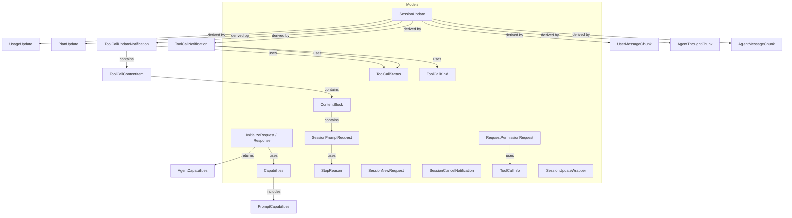
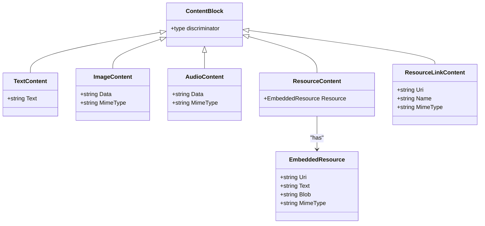
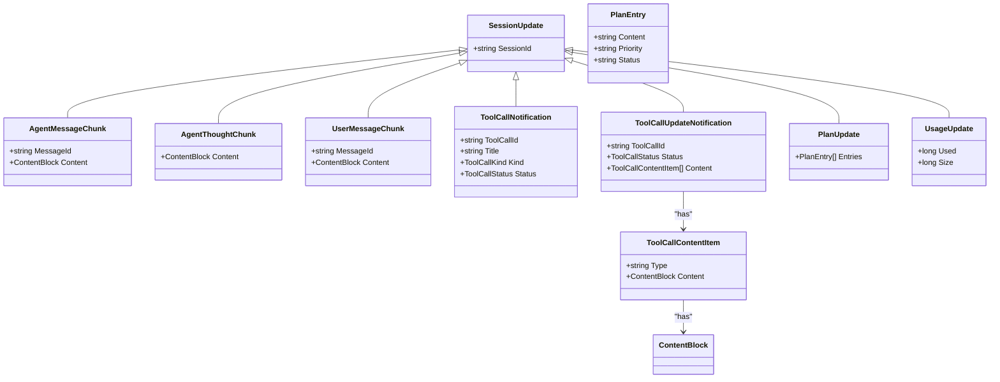
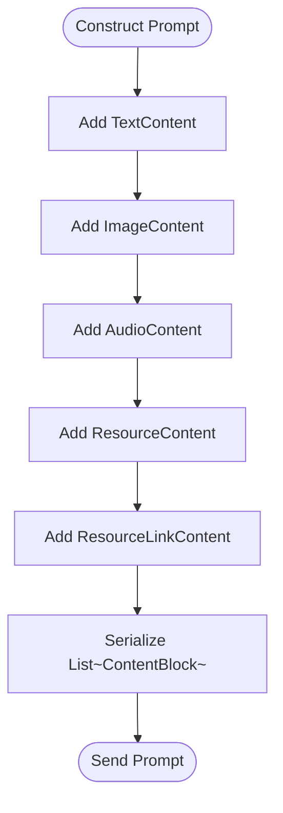
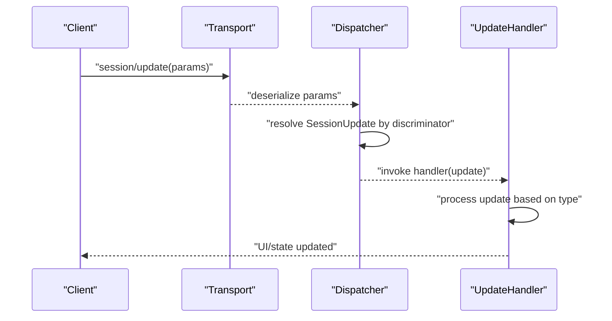
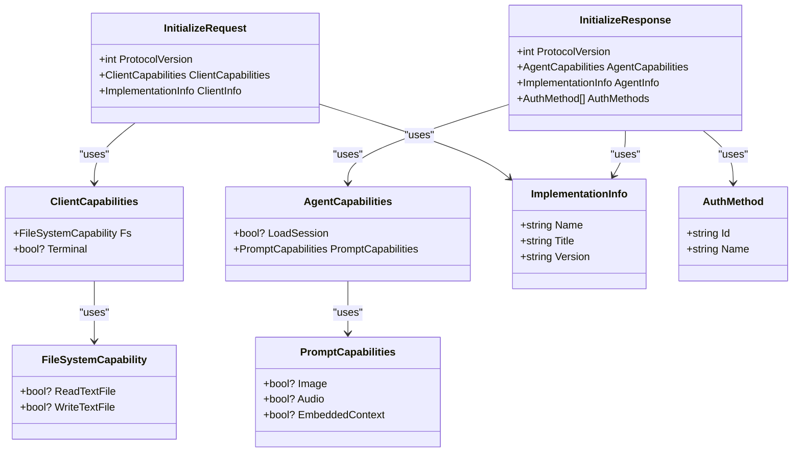
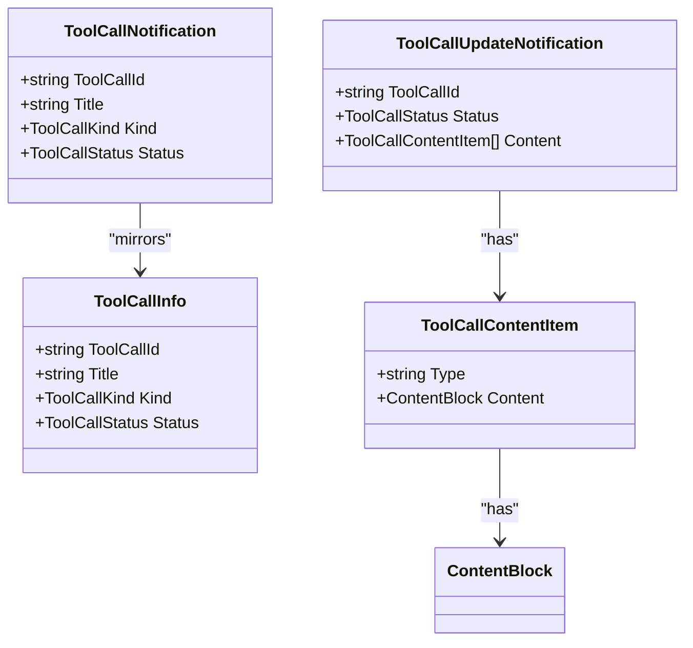
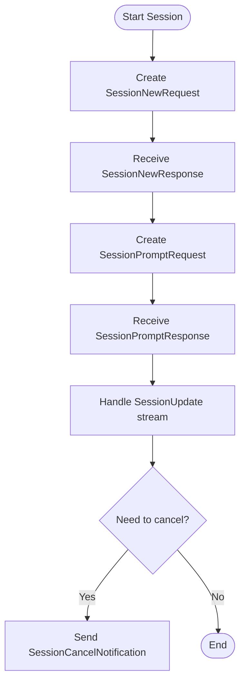
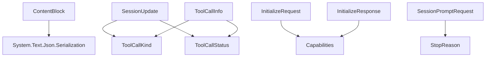

# Data Models

<cite>
**Referenced Files in This Document**
- [ContentBlock.cs](file://Models/ContentBlock.cs)
- [SessionUpdate.cs](file://Models/SessionUpdate.cs)
- [Capabilities.cs](file://Models/Capabilities.cs)
- [InitializeRequest.cs](file://Models/InitializeRequest.cs)
- [InitializeResponse.cs](file://Models/InitializeResponse.cs)
- [ToolCall.cs](file://Models/ToolCall.cs)
- [SessionPromptRequest.cs](file://Models/SessionPromptRequest.cs)
- [SessionNewRequest.cs](file://Models/SessionNewRequest.cs)
- [SessionCancelNotification.cs](file://Models/SessionCancelNotification.cs)
- [RequestPermissionRequest.cs](file://Models/RequestPermissionRequest.cs)
- [StopReason.cs](file://Models/Enums/StopReason.cs)
- [ToolCallKind.cs](file://Models/Enums/ToolCallKind.cs)
- [ToolCallStatus.cs](file://Models/Enums/ToolCallStatus.cs)
- [SessionUpdateWrapper.cs](file://Models/SessionUpdateWrapper.cs)
</cite>

## Table of Contents
1. [Introduction](#introduction)
2. [Project Structure](#project-structure)
3. [Core Components](#core-components)
4. [Architecture Overview](#architecture-overview)
5. [Detailed Component Analysis](#detailed-component-analysis)
6. [Dependency Analysis](#dependency-analysis)
7. [Performance Considerations](#performance-considerations)
8. [Troubleshooting Guide](#troubleshooting-guide)
9. [Conclusion](#conclusion)
10. [Appendices](#appendices)

## Introduction
This document provides comprehensive data model documentation for the ACP protocol types implemented in the library. It focuses on:
- The ContentBlock hierarchy and its derived content types
- SessionUpdate base class and streaming notification variants
- Capability negotiation structures used during initialization
- Tool invocation details via ToolCallInfo
- Serialization attributes, validation rules, and conversion patterns
- Practical examples for constructing prompts and handling update streams
- Version compatibility and migration considerations

## Project Structure
The data models are organized under the Models namespace with clear separation between core entities, enums, and request/response wrappers. Key areas include:
- ContentBlock hierarchy for mixed media prompts
- SessionUpdate hierarchy for streaming notifications
- Capabilities and Initialize messages for capability negotiation
- ToolCallInfo and related permission/request models
- Enums for standardized string-based values

**Diagram sources**
- [ContentBlock.cs:1-79](file://Models/ContentBlock.cs#L1-L79)
- [SessionUpdate.cs:1-119](file://Models/SessionUpdate.cs#L1-L119)
- [Capabilities.cs:1-65](file://Models/Capabilities.cs#L1-L65)
- [InitializeRequest.cs:1-16](file://Models/InitializeRequest.cs#L1-L16)
- [InitializeResponse.cs:1-28](file://Models/InitializeResponse.cs#L1-L28)
- [ToolCall.cs:1-22](file://Models/ToolCall.cs#L1-L22)
- [SessionPromptRequest.cs:1-20](file://Models/SessionPromptRequest.cs#L1-L20)
- [SessionNewRequest.cs:1-45](file://Models/SessionNewRequest.cs#L1-L45)
- [SessionCancelNotification.cs:1-10](file://Models/SessionCancelNotification.cs#L1-L10)
- [RequestPermissionRequest.cs:1-47](file://Models/RequestPermissionRequest.cs#L1-L47)
- [StopReason.cs:1-19](file://Models/Enums/StopReason.cs#L1-L19)
- [ToolCallKind.cs:1-27](file://Models/Enums/ToolCallKind.cs#L1-L27)
- [ToolCallStatus.cs:1-17](file://Models/Enums/ToolCallStatus.cs#L1-L17)
- [SessionUpdateWrapper.cs:1-17](file://Models/SessionUpdateWrapper.cs#L1-L17)

**Section sources**
- [ContentBlock.cs:1-79](file://Models/ContentBlock.cs#L1-L79)
- [SessionUpdate.cs:1-119](file://Models/SessionUpdate.cs#L1-L119)
- [Capabilities.cs:1-65](file://Models/Capabilities.cs#L1-L65)
- [InitializeRequest.cs:1-16](file://Models/InitializeRequest.cs#L1-L16)
- [InitializeResponse.cs:1-28](file://Models/InitializeResponse.cs#L1-L28)
- [ToolCall.cs:1-22](file://Models/ToolCall.cs#L1-L22)
- [SessionPromptRequest.cs:1-20](file://Models/SessionPromptRequest.cs#L1-L20)
- [SessionNewRequest.cs:1-45](file://Models/SessionNewRequest.cs#L1-L45)
- [SessionCancelNotification.cs:1-10](file://Models/SessionCancelNotification.cs#L1-L10)
- [RequestPermissionRequest.cs:1-47](file://Models/RequestPermissionRequest.cs#L1-L47)
- [StopReason.cs:1-19](file://Models/Enums/StopReason.cs#L1-L19)
- [ToolCallKind.cs:1-27](file://Models/Enums/ToolCallKind.cs#L1-L27)
- [ToolCallStatus.cs:1-17](file://Models/Enums/ToolCallStatus.cs#L1-L17)
- [SessionUpdateWrapper.cs:1-17](file://Models/SessionUpdateWrapper.cs#L1-L17)

## Core Components
- ContentBlock hierarchy: polymorphic JSON serialization using a type discriminator field to support text, image, audio, embedded resource, and resource link content blocks. Unknown types fall back to the base type to ensure forward compatibility.
- SessionUpdate hierarchy: polymorphic updates streamed over sessions, including message chunks, thought chunks, tool call notifications and updates, plan updates, and usage updates.
- Capability negotiation: ClientCapabilities, AgentCapabilities, PromptCapabilities, and ImplementationInfo define supported features and implementation metadata during initialization.
- ToolCallInfo: describes tool invocation details including id, title, kind, and status.
- Request/response wrappers: session lifecycle and prompt requests, permission requests, and stop reasons.

**Section sources**
- [ContentBlock.cs:1-79](file://Models/ContentBlock.cs#L1-L79)
- [SessionUpdate.cs:1-119](file://Models/SessionUpdate.cs#L1-L119)
- [Capabilities.cs:1-65](file://Models/Capabilities.cs#L1-L65)
- [InitializeRequest.cs:1-16](file://Models/InitializeRequest.cs#L1-L16)
- [InitializeResponse.cs:1-28](file://Models/InitializeResponse.cs#L1-L28)
- [ToolCall.cs:1-22](file://Models/ToolCall.cs#L1-L22)
- [SessionPromptRequest.cs:1-20](file://Models/SessionPromptRequest.cs#L1-L20)
- [SessionNewRequest.cs:1-45](file://Models/SessionNewRequest.cs#L1-L45)
- [RequestPermissionRequest.cs:1-47](file://Models/RequestPermissionRequest.cs#L1-L47)
- [StopReason.cs:1-19](file://Models/Enums/Enums/StopReason.cs#L1-L19)

## Architecture Overview
The ACP data models follow a layered approach:
- Base polymorphic types (ContentBlock, SessionUpdate) enable extensibility and safe deserialization when encountering unknown types.
- Enumerations use string-based JSON serialization for stable wire formats.
- Initialization messages negotiate capabilities and versioning to ensure compatibility across clients and agents.
- Streaming updates encapsulate rich, typed payloads while maintaining a consistent envelope.

**Diagram sources**
- [ContentBlock.cs:1-79](file://Models/ContentBlock.cs#L1-L79)

**Diagram sources**
- [SessionUpdate.cs:1-119](file://Models/SessionUpdate.cs#L1-L119)
- [ContentBlock.cs:1-79](file://Models/ContentBlock.cs#L1-L79)

**Section sources**
- [SessionUpdate.cs:1-119](file://Models/SessionUpdate.cs#L1-L119)
- [ContentBlock.cs:1-79](file://Models/ContentBlock.cs#L1-L79)

## Detailed Component Analysis

### ContentBlock Hierarchy
- Purpose: Represents heterogeneous content within prompts and updates. Supports text, images, audio, embedded resources, and resource links.
- Polymorphism: Uses a type discriminator field for JSON deserialization; unknown types fall back to the base type to avoid errors from newer agent implementations.
- Properties:
  - TextContent: contains textual content.
  - ImageContent: contains binary data and MIME type.
  - AudioContent: contains binary data and MIME type.
  - ResourceContent: references an embedded resource with URI, optional text/blob/mime.
  - ResourceLinkContent: references an external resource with URI, name, and optional MIME type.
- Serialization attributes:
  - JsonPolymorphic with type discriminator and fallback behavior.
  - JsonDerivedType mappings for each concrete type.
  - JsonPropertyName for explicit JSON keys.
  - JsonIgnoreCondition.WhenWritingNull for optional fields.
- Validation rules:
  - Ensure required fields like URI or data presence per content type.
  - Validate MIME types where applicable.
- Conversion patterns:
  - Use string-based binary encoding for data fields as defined by the model.
  - Map enum values to string members for stable serialization.

**Diagram sources**
- [ContentBlock.cs:1-79](file://Models/ContentBlock.cs#L1-L79)
- [SessionPromptRequest.cs:1-20](file://Models/SessionPromptRequest.cs#L1-L20)

**Section sources**
- [ContentBlock.cs:1-79](file://Models/ContentBlock.cs#L1-L79)
- [SessionPromptRequest.cs:1-20](file://Models/SessionPromptRequest.cs#L1-L20)

### SessionUpdate Base Class and Derived Types
- Purpose: Encapsulates streaming notifications during a session, enabling incremental updates to UI or state.
- Base properties:
  - SessionId identifies the session context.
- Derived types:
  - AgentMessageChunk: partial message content with optional messageId.
  - AgentThoughtChunk: internal reasoning content.
  - UserMessageChunk: echoes user input chunks with optional messageId.
  - ToolCallNotification: announces a new tool call with id, title, kind, and status.
  - ToolCallUpdateNotification: updates existing tool call status and content items.
  - PlanUpdate: list of plan entries with content, priority, and status.
  - UsageUpdate: counters for used tokens and size.
- Serialization attributes:
  - JsonPolymorphic with sessionUpdate discriminator and fallback behavior.
  - JsonDerivedType mappings for each update variant.
  - Optional fields marked with JsonIgnoreCondition.WhenWritingNull.
- Validation rules:
  - Ensure sessionId is present in all updates.
  - Validate tool call ids and statuses for consistency.
  - Ensure content blocks are valid when present.

**Diagram sources**
- [SessionUpdate.cs:1-119](file://Models/SessionUpdate.cs#L1-L119)
- [SessionUpdateWrapper.cs:1-17](file://Models/SessionUpdateWrapper.cs#L1-L17)

**Section sources**
- [SessionUpdate.cs:1-119](file://Models/SessionUpdate.cs#L1-L119)
- [SessionUpdateWrapper.cs:1-17](file://Models/SessionUpdateWrapper.cs#L1-L17)

### Capability Negotiation Structures
- ClientCapabilities:
  - fs: file system capabilities including read/write text file flags.
  - terminal: boolean indicating terminal support.
- AgentCapabilities:
  - loadSession: indicates ability to resume sessions.
  - promptCapabilities: supports image, audio, and embedded context.
- ImplementationInfo:
  - name, title, version for identifying client or agent implementations.
- InitializeRequest:
  - protocolVersion: negotiated protocol version.
  - clientCapabilities: client feature set.
  - clientInfo: client identification metadata.
- InitializeResponse:
  - protocolVersion: accepted protocol version.
  - agentCapabilities: agent feature set.
  - agentInfo: agent identification metadata.
  - authMethods: available authentication methods.

**Diagram sources**
- [Capabilities.cs:1-65](file://Models/Capabilities.cs#L1-L65)
- [InitializeRequest.cs:1-16](file://Models/InitializeRequest.cs#L1-L16)
- [InitializeResponse.cs:1-28](file://Models/InitializeResponse.cs#L1-L28)

**Section sources**
- [Capabilities.cs:1-65](file://Models/Capabilities.cs#L1-L65)
- [InitializeRequest.cs:1-16](file://Models/InitializeRequest.cs#L1-L16)
- [InitializeResponse.cs:1-28](file://Models/InitializeResponse.cs#L1-L28)

### ToolCall Model
- ToolCallInfo:
  - toolCallId: unique identifier for the tool invocation.
  - title: human-readable description.
  - kind: categorized operation type (read, edit, delete, move, search, execute, think, fetch, other).
  - status: lifecycle state (pending, in_progress, completed, failed).
- Usage in updates:
  - ToolCallNotification announces a new tool call.
  - ToolCallUpdateNotification updates status and includes content items describing changes.
- Enums:
  - ToolCallKind and ToolCallStatus serialized as strings with explicit member names for stability.

**Diagram sources**
- [ToolCall.cs:1-22](file://Models/ToolCall.cs#L1-L22)
- [SessionUpdate.cs:1-119](file://Models/SessionUpdate.cs#L1-L119)
- [ContentBlock.cs:1-79](file://Models/ContentBlock.cs#L1-L79)

**Section sources**
- [ToolCall.cs:1-22](file://Models/ToolCall.cs#L1-L22)
- [SessionUpdate.cs:1-119](file://Models/SessionUpdate.cs#L1-L119)
- [ToolCallKind.cs:1-27](file://Models/Enums/ToolCallKind.cs#L1-L27)
- [ToolCallStatus.cs:1-17](file://Models/Enums/ToolCallStatus.cs#L1-L17)

### Session Lifecycle and Permission Models
- SessionNewRequest:
  - cwd: current working directory.
  - mcpServers: required array of server configurations (empty if none).
- SessionNewResponse:
  - sessionId: returned session identifier.
- SessionPromptRequest:
  - sessionId: target session.
  - prompt: list of content blocks.
- SessionPromptResponse:
  - stopReason: reason for stopping the turn.
- SessionCancelNotification:
  - sessionId: session to cancel.
- RequestPermissionRequest:
  - sessionId: target session.
  - toolCall: optional tool call context.
  - options: list of permission options.
- RequestPermissionResponse:
  - outcome: result of permission decision.

**Diagram sources**
- [SessionNewRequest.cs:1-45](file://Models/SessionNewRequest.cs#L1-L45)
- [SessionPromptRequest.cs:1-20](file://Models/SessionPromptRequest.cs#L1-L20)
- [SessionCancelNotification.cs:1-10](file://Models/SessionCancelNotification.cs#L1-L10)
- [RequestPermissionRequest.cs:1-47](file://Models/RequestPermissionRequest.cs#L1-L47)

**Section sources**
- [SessionNewRequest.cs:1-45](file://Models/SessionNewRequest.cs#L1-L45)
- [SessionPromptRequest.cs:1-20](file://Models/SessionPromptRequest.cs#L1-L20)
- [SessionCancelNotification.cs:1-10](file://Models/SessionCancelNotification.cs#L1-L10)
- [RequestPermissionRequest.cs:1-47](file://Models/RequestPermissionRequest.cs#L1-L47)
- [StopReason.cs:1-19](file://Models/Enums/StopReason.cs#L1-L19)

## Dependency Analysis
- ContentBlock depends on System.Text.Json.Serialization for polymorphic serialization and attribute-based mapping.
- SessionUpdate depends on enums for ToolCallKind and ToolCallStatus.
- InitializeRequest and InitializeResponse depend on Capabilities and ImplementationInfo.
- ToolCallInfo integrates with enums for kind and status.
- SessionPromptRequest uses StopReason for response termination semantics.

**Diagram sources**
- [ContentBlock.cs:1-79](file://Models/ContentBlock.cs#L1-L79)
- [SessionUpdate.cs:1-119](file://Models/SessionUpdate.cs#L1-L119)
- [Capabilities.cs:1-65](file://Models/Capabilities.cs#L1-L65)
- [InitializeRequest.cs:1-16](file://Models/InitializeRequest.cs#L1-L16)
- [InitializeResponse.cs:1-28](file://Models/InitializeResponse.cs#L1-L28)
- [ToolCall.cs:1-22](file://Models/ToolCall.cs#L1-L22)
- [SessionPromptRequest.cs:1-20](file://Models/SessionPromptRequest.cs#L1-L20)
- [StopReason.cs:1-19](file://Models/Enums/StopReason.cs#L1-L19)
- [ToolCallKind.cs:1-27](file://Models/Enums/ToolCallKind.cs#L1-L27)
- [ToolCallStatus.cs:1-17](file://Models/Enums/ToolCallStatus.cs#L1-L17)

**Section sources**
- [ContentBlock.cs:1-79](file://Models/ContentBlock.cs#L1-L79)
- [SessionUpdate.cs:1-119](file://Models/SessionUpdate.cs#L1-L119)
- [Capabilities.cs:1-65](file://Models/Capabilities.cs#L1-L65)
- [InitializeRequest.cs:1-16](file://Models/InitializeRequest.cs#L1-L16)
- [InitializeResponse.cs:1-28](file://Models/InitializeResponse.cs#L1-L28)
- [ToolCall.cs:1-22](file://Models/ToolCall.cs#L1-L22)
- [SessionPromptRequest.cs:1-20](file://Models/SessionPromptRequest.cs#L1-L20)
- [StopReason.cs:1-19](file://Models/Enums/StopReason.cs#L1-L19)
- [ToolCallKind.cs:1-27](file://Models/Enums/ToolCallKind.cs#L1-L27)
- [ToolCallStatus.cs:1-17](file://Models/Enums/ToolCallStatus.cs#L1-L17)

## Performance Considerations
- Polymorphic deserialization overhead: Using JsonPolymorphic introduces runtime type resolution; minimize payload size by sending only necessary fields.
- Large binary data: For ImageContent and AudioContent, consider chunked transfer strategies at the transport layer to avoid memory pressure.
- Optional fields: JsonIgnoreCondition.WhenWritingNull reduces payload size by omitting nulls.
- Enum serialization: String-based enums are stable but larger than numeric; ensure consumers parse them efficiently.
- Stream processing: Handle SessionUpdate increments incrementally to avoid buffering large lists.

[No sources needed since this section provides general guidance]

## Troubleshooting Guide
- Unknown type discriminators:
  - ContentBlock and SessionUpdate are configured to fall back to base types when encountering unrecognized discriminators; verify that consumers handle base cases gracefully.
- Missing required fields:
  - Ensure sessionId is present in all SessionUpdate-derived messages.
  - Validate toolCallId and status transitions for ToolCallNotification and ToolCallUpdateNotification.
- Capability mismatches:
  - Check ClientCapabilities and AgentCapabilities during Initialize to confirm supported features before sending unsupported content types.
- Permission handling:
  - RequestPermissionRequest must include valid options; ensure Outcome reflects correct selection or cancellation.

**Section sources**
- [ContentBlock.cs:1-79](file://Models/ContentBlock.cs#L1-L79)
- [SessionUpdate.cs:1-119](file://Models/SessionUpdate.cs#L1-L119)
- [Capabilities.cs:1-65](file://Models/Capabilities.cs#L1-L65)
- [RequestPermissionRequest.cs:1-47](file://Models/RequestPermissionRequest.cs#L1-L47)

## Conclusion
The ACP data models provide a robust, extensible foundation for multimodal prompts, streaming updates, capability negotiation, and tool invocations. By leveraging polymorphic JSON serialization and stable string-based enums, the models ensure forward compatibility and predictable behavior across evolving agent implementations. Proper validation and careful handling of optional fields will enhance reliability and performance.

[No sources needed since this section summarizes without analyzing specific files]

## Appendices

### Examples: Constructing Complex Prompts
- Build a prompt containing mixed content:
  - Add TextContent for instructions.
  - Add ImageContent for visual context.
  - Add AudioContent for voice snippets.
  - Add ResourceContent for embedded documents.
  - Add ResourceLinkContent for external references.
- Serialize the list and send via SessionPromptRequest.

**Section sources**
- [ContentBlock.cs:1-79](file://Models/ContentBlock.cs#L1-L79)
- [SessionPromptRequest.cs:1-20](file://Models/SessionPromptRequest.cs#L1-L20)

### Handling Various Update Streams
- Subscribe to session/update notifications.
- Deserialize SessionUpdateParams and resolve the actual update type.
- Process AgentMessageChunk and UserMessageChunk to render incremental text.
- Track ToolCallNotification and ToolCallUpdateNotification to reflect tool execution progress.
- Aggregate PlanUpdate entries for planning visibility.
- Monitor UsageUpdate counters for resource consumption.

**Section sources**
- [SessionUpdate.cs:1-119](file://Models/SessionUpdate.cs#L1-L119)
- [SessionUpdateWrapper.cs:1-17](file://Models/SessionUpdateWrapper.cs#L1-L17)

### Version Compatibility and Migration
- ProtocolVersion negotiation ensures both sides agree on supported features.
- Capability flags allow graceful degradation when certain features are unavailable.
- Fallback to base types for unknown discriminators prevents breaking changes.
- When adding new content types or update variants, maintain backward compatibility by keeping base handling intact.

**Section sources**
- [InitializeRequest.cs:1-16](file://Models/InitializeRequest.cs#L1-L16)
- [InitializeResponse.cs:1-28](file://Models/InitializeResponse.cs#L1-L28)
- [Capabilities.cs:1-65](file://Models/Capabilities.cs#L1-L65)
- [ContentBlock.cs:1-79](file://Models/ContentBlock.cs#L1-L79)
- [SessionUpdate.cs:1-119](file://Models/SessionUpdate.cs#L1-L119)