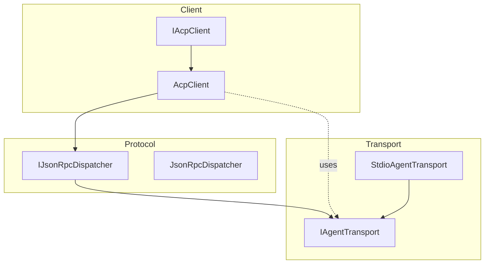
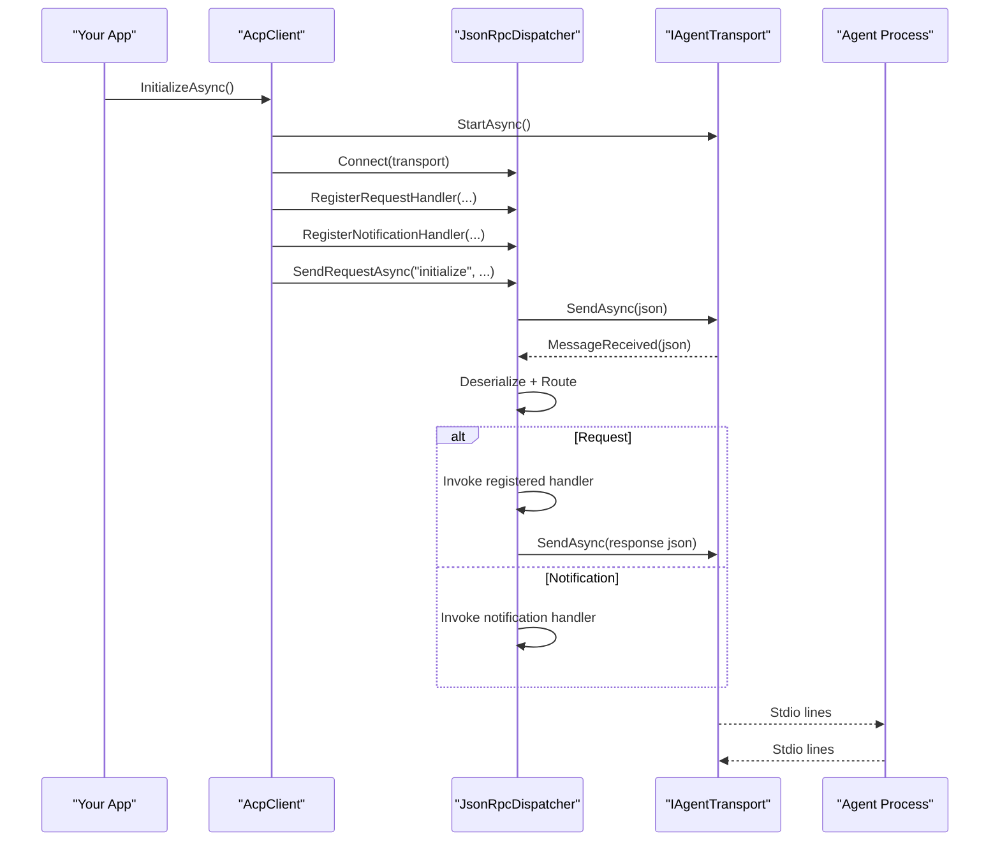
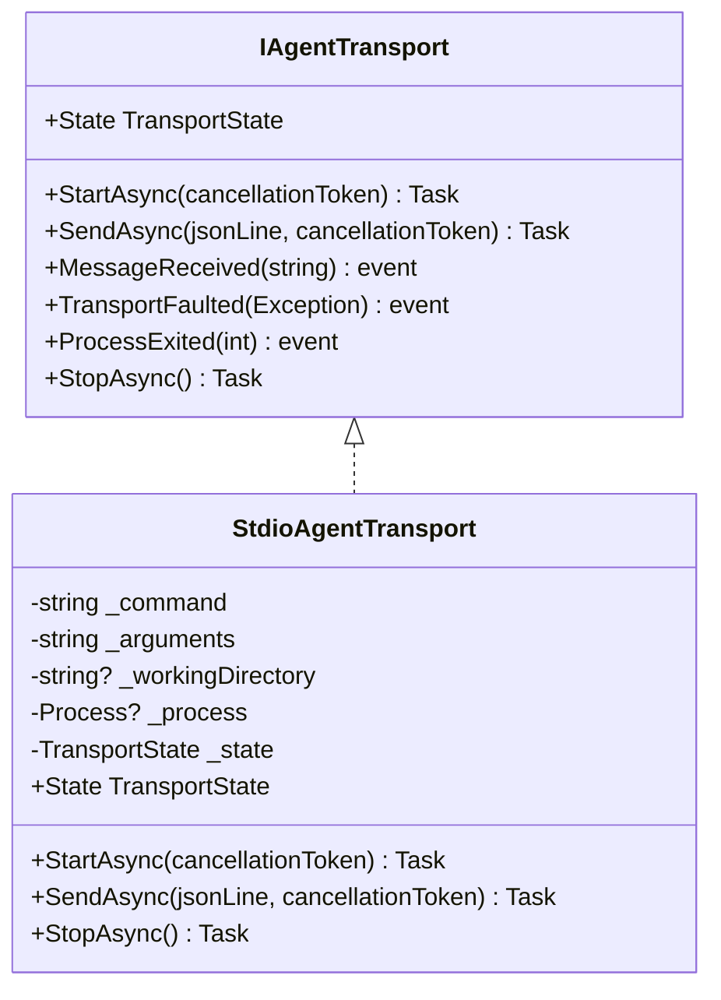
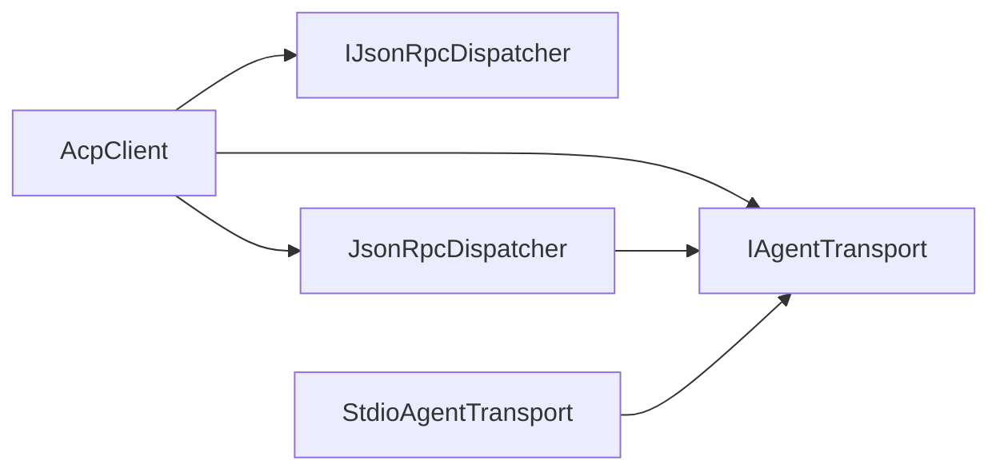

# Extensibility Patterns

<cite>
**Referenced Files in This Document**
- [AcpClient.cs](file://Client/AcpClient.cs)
- [IAcpClient.cs](file://Client/IAcpClient.cs)
- [IJsonRpcDispatcher.cs](file://Protocol/IJsonRpcDispatcher.cs)
- [JsonRpcDispatcher.cs](file://Protocol/JsonRpcDispatcher.cs)
- [IAgentTransport.cs](file://Transport/IAgentTransport.cs)
- [StdioAgentTransport.cs](file://Transport/StdioAgentTransport.cs)
- [IPermissionHandler.cs](file://Client/IPermissionHandler.cs)
- [IFileSystemHandler.cs](file://Client/IFileSystemHandler.cs)
- [ITerminalHandler.cs](file://Client/ITerminalHandler.cs)
- [SessionUpdate.cs](file://Models/SessionUpdate.cs)
- [JsonRpcRequest.cs](file://JsonRpc/JsonRpcRequest.cs)
- [JsonRpcNotification.cs](file://JsonRpc/JsonRpcNotification.cs)
- [README.md](file://README.md)
</cite>

## Table of Contents
1. [Introduction](#introduction)
2. [Project Structure](#project-structure)
3. [Core Components](#core-components)
4. [Architecture Overview](#architecture-overview)
5. [Detailed Component Analysis](#detailed-component-analysis)
6. [Dependency Analysis](#dependency-analysis)
7. [Performance Considerations](#performance-considerations)
8. [Troubleshooting Guide](#troubleshooting-guide)
9. [Conclusion](#conclusion)
10. [Appendices](#appendices)

## Introduction
This document explains how to extend the library beyond built-in functionality. It focuses on:
- Registering custom request handlers for non-standard ACP methods using RegisterRequestHandler
- Handling agent-to-client notifications with RegisterNotificationHandler
- Implementing custom transports by implementing IAgentTransport
- Designing protocol extensions, middleware patterns, and interceptors
- Best practices for backward compatibility, versioning, testing, performance, and security

The guidance is grounded in the actual codebase and shows where to plug in your logic without modifying core components.

## Project Structure
The extensibility surface centers around three layers:
- Transport layer (IAgentTransport and StdioAgentTransport)
- Protocol dispatcher (IJsonRpcDispatcher and JsonRpcDispatcher)
- Client orchestration (IAcpClient and AcpClient)

**Diagram sources**
- [IAcpClient.cs:1-59](file://Client/IAcpClient.cs#L1-L59)
- [AcpClient.cs:1-361](file://Client/AcpClient.cs#L1-L361)
- [IJsonRpcDispatcher.cs:1-14](file://Protocol/IJsonRpcDispatcher.cs#L1-L14)
- [JsonRpcDispatcher.cs:1-124](file://Protocol/JsonRpcDispatcher.cs#L1-L124)
- [IAgentTransport.cs:1-39](file://Transport/IAgentTransport.cs#L1-L39)
- [StdioAgentTransport.cs:1-147](file://Transport/StdioAgentTransport.cs#L1-L147)

**Section sources**
- [README.md:1-99](file://README.md#L1-L99)

## Core Components
Key extensibility points:
- Custom request handlers via RegisterRequestHandler
- Custom notification handlers via RegisterNotificationHandler
- Custom transport via IAgentTransport
- Handler interfaces for built-in features (permission, file system, terminal)

These are exposed through IAcpClient and implemented by AcpClient, which delegates to JsonRpcDispatcher and a concrete IAgentTransport.

**Section sources**
- [IAcpClient.cs:1-59](file://Client/IAcpClient.cs#L1-L59)
- [AcpClient.cs:243-248](file://Client/AcpClient.cs#L243-L248)
- [IJsonRpcDispatcher.cs:1-14](file://Protocol/IJsonRpcDispatcher.cs#L1-L14)
- [JsonRpcDispatcher.cs:66-74](file://Protocol/JsonRpcDispatcher.cs#L66-L74)
- [IAgentTransport.cs:1-39](file://Transport/IAgentTransport.cs#L1-L39)

## Architecture Overview
The runtime flow for extending behavior:
- AcpClient wires built-in handlers during InitializeAsync and exposes RegisterRequestHandler/RegisterNotificationHandler to add custom ones
- JsonRpcDispatcher maintains handler maps and routes incoming JSON-RPC messages to the appropriate handler
- IAgentTransport abstracts message delivery; default implementation uses stdio with a child process

**Diagram sources**
- [AcpClient.cs:47-182](file://Client/AcpClient.cs#L47-L182)
- [JsonRpcDispatcher.cs:21-84](file://Protocol/JsonRpcDispatcher.cs#L21-L84)
- [JsonRpcDispatcher.cs:86-122](file://Protocol/JsonRpcDispatcher.cs#L86-L122)
- [IAgentTransport.cs:1-39](file://Transport/IAgentTransport.cs#L1-L39)

## Detailed Component Analysis

### Custom Request Handlers (RegisterRequestHandler)
Use RegisterRequestHandler to handle non-standard ACP methods or any custom method the agent sends. The pattern is:
- Provide a unique method name
- Accept a JsonRpcRequest
- Return a JsonRpcResponse with Id and Result (or Error)

Where it’s wired:
- AcpClient exposes RegisterRequestHandler that forwards to JsonRpcDispatcher.RegisterRequestHandler
- Built-in handlers are registered during InitializeAsync (e.g., session/request_permission, fs/*, terminal/*)

Implementation notes:
- Always validate Params before deserializing
- Return consistent error responses when handlers are unavailable
- Keep handlers fast and avoid blocking the dispatch loop

Example usage pattern:
- Register a custom method like "custom/method"
- Read parameters from request.Params
- Build and return a JsonRpcResponse

**Section sources**
- [IAcpClient.cs:53-54](file://Client/IAcpClient.cs#L53-L54)
- [AcpClient.cs:243-244](file://Client/AcpClient.cs#L243-L244)
- [JsonRpcDispatcher.cs:66-69](file://Protocol/JsonRpcDispatcher.cs#L66-L69)
- [AcpClient.cs:75-99](file://Client/AcpClient.cs#L75-L99)
- [AcpClient.cs:102-144](file://Client/AcpClient.cs#L102-L144)
- [AcpClient.cs:250-359](file://Client/AcpClient.cs#L250-L359)

### Custom Notification Handlers (RegisterNotificationHandler)
Use RegisterNotificationHandler to listen for agent-to-client notifications that do not expect a response. Typical use cases include:
- Custom telemetry events
- Background status updates
- Out-of-band signals

Where it’s wired:
- AcpClient exposes RegisterNotificationHandler forwarding to JsonRpcDispatcher
- Built-in session/update is registered during InitializeAsync and raises SessionUpdated event

Implementation notes:
- Notifications have no id; do not attempt to respond
- Handle exceptions inside handlers to avoid breaking the dispatch loop
- Use async operations carefully; ensure they complete even if the client shuts down

Example usage pattern:
- Register a handler for "custom/notify"
- Parse notification.Params as needed
- React asynchronously (e.g., log, update UI, trigger side effects)

**Section sources**
- [IAcpClient.cs:56-57](file://Client/IAcpClient.cs#L56-L57)
- [AcpClient.cs:247-248](file://Client/AcpClient.cs#L247-L248)
- [JsonRpcDispatcher.cs:71-74](file://Protocol/JsonRpcDispatcher.cs#L71-L74)
- [AcpClient.cs:64-72](file://Client/AcpClient.cs#L64-L72)

### Custom Transport Implementation (IAgentTransport)
To support alternative communication channels (e.g., TCP, WebSocket, named pipes), implement IAgentTransport:
- StartAsync: initialize underlying channel and start reading
- SendAsync: write a single JSON line
- StopAsync: gracefully close resources
- Events:
  - MessageReceived: emit raw JSON lines received
  - TransportFaulted: report transport-level errors
  - ProcessExited: signal when an underlying process terminates (if applicable)

Default implementation:
- StdioAgentTransport manages a child process, reads stdout/stderr, and emits MessageReceived for each line

Best practices:
- Ensure thread-safety for concurrent SendAsync calls
- Properly propagate cancellation tokens
- Emit TransportFaulted on unrecoverable errors
- Avoid blocking in MessageReceived callbacks

**Diagram sources**
- [IAgentTransport.cs:1-39](file://Transport/IAgentTransport.cs#L1-L39)
- [StdioAgentTransport.cs:1-147](file://Transport/StdioAgentTransport.cs#L1-L147)

**Section sources**
- [IAgentTransport.cs:1-39](file://Transport/IAgentTransport.cs#L1-L39)
- [StdioAgentTransport.cs:1-147](file://Transport/StdioAgentTransport.cs#L1-L147)

### Protocol Extensions and Interceptors
While the library does not expose a formal interceptor pipeline, you can implement interception-like behavior at two levels:

- At the transport level: wrap IAgentTransport to log, transform, or rate-limit messages
- At the dispatcher level: register global handlers that act as interceptors for specific methods

Patterns:
- Logging wrapper around IAgentTransport:
  - Log outgoing SendAsync calls
  - Log incoming MessageReceived lines
  - Wrap TransportFaulted to centralize diagnostics
- Method-level interceptors:
  - Register a handler for a method that performs pre/post processing
  - Delegate to another handler or perform side effects

Caveats:
- Avoid long-running work in interceptors; offload to background tasks
- Be careful with serialization costs; cache options where possible

**Section sources**
- [JsonRpcDispatcher.cs:86-122](file://Protocol/JsonRpcDispatcher.cs#L86-L122)
- [IAgentTransport.cs:1-39](file://Transport/IAgentTransport.cs#L1-L39)

### Middleware Patterns
You can compose middleware around IAgentTransport and AcpClient:

- Transport middleware:
  - Validate or sanitize JSON lines
  - Add headers/metadata by wrapping payloads
  - Implement retry/backoff for transient failures
- Client-side middleware:
  - Register request handlers that enforce policies (e.g., allowlist of methods)
  - Enforce timeouts per method by wrapping SendRequestAsync in your own facade

Recommended structure:
- Create a small facade over AcpClient that adds cross-cutting concerns
- Keep core AcpClient unchanged to preserve compatibility

**Section sources**
- [AcpClient.cs:243-248](file://Client/AcpClient.cs#L243-L248)
- [JsonRpcDispatcher.cs:27-47](file://Protocol/JsonRpcDispatcher.cs#L27-L47)

### Backward Compatibility and Versioning Strategies
Guidelines:
- Prefer additive changes to method names and payload schemas
- Use optional fields and ignore unknown properties
- For streaming updates, rely on polymorphic types that fall back to base when encountering unknown discriminators
- Check protocol versions during handshake and degrade gracefully

In this library:
- SessionUpdate supports unknown derived types by falling back to the base type
- AcpClient logs protocol version mismatches but continues operation

**Section sources**
- [SessionUpdate.cs:1-18](file://Models/SessionUpdate.cs#L1-L18)
- [AcpClient.cs:175-179](file://Client/AcpClient.cs#L175-L179)

### Testing Custom Extensions
Recommendations:
- Mock IAgentTransport to simulate messages and verify routing
- Use JsonRpcDispatcher directly to test handler registration and invocation
- Write unit tests for:
  - Custom request handlers (valid inputs, invalid inputs, missing params)
  - Custom notification handlers (parsing, error handling)
  - Transport wrappers (logging, retries, faults)
- Integration tests:
  - Spin up a minimal agent that responds to your custom methods
  - Verify end-to-end flows including initialization and session lifecycle

Test patterns:
- Inject a mock transport into AcpClient or JsonRpcDispatcher
- Assert that handlers are invoked with expected parameters
- Verify responses match expected schema

**Section sources**
- [JsonRpcDispatcher.cs:1-124](file://Protocol/JsonRpcDispatcher.cs#L1-L124)
- [IAgentTransport.cs:1-39](file://Transport/IAgentTransport.cs#L1-L39)

### Performance Implications
- Serialization overhead:
  - Reuse JsonSerializerOptions where possible (library uses shared options)
  - Avoid heavy object graphs in frequent messages
- Async I/O:
  - Ensure handlers are non-blocking; offload CPU-bound work
  - Use CancellationToken to respect shutdown and timeouts
- Transport throughput:
  - Batch writes only if the transport supports it; otherwise keep line-based semantics
- Memory:
  - Avoid retaining large payloads in handlers; stream when possible

[No sources needed since this section provides general guidance]

### Security Considerations
- Input validation:
  - Always validate and sanitize Params before deserialization
  - Reject unexpected or dangerous fields
- Authorization:
  - Enforce allowlists of methods and permissions in custom handlers
- Resource limits:
  - Limit payload sizes and processing time
- Transport security:
  - For non-stdio transports, use secure channels (TLS, authenticated pipes)
- Error handling:
  - Do not leak internal details in error messages
  - Centralize logging and redaction

[No sources needed since this section provides general guidance]

## Dependency Analysis
High-level dependencies between extensibility components:

**Diagram sources**
- [AcpClient.cs:1-361](file://Client/AcpClient.cs#L1-L361)
- [JsonRpcDispatcher.cs:1-124](file://Protocol/JsonRpcDispatcher.cs#L1-L124)
- [IAgentTransport.cs:1-39](file://Transport/IAgentTransport.cs#L1-L39)
- [StdioAgentTransport.cs:1-147](file://Transport/StdioAgentTransport.cs#L1-L147)

**Section sources**
- [AcpClient.cs:1-361](file://Client/AcpClient.cs#L1-L361)
- [JsonRpcDispatcher.cs:1-124](file://Protocol/JsonRpcDispatcher.cs#L1-L124)

## Performance Considerations
- Minimize allocations in hot paths (handlers, serializers)
- Avoid synchronous blocking in async handlers
- Prefer streaming for large payloads
- Use efficient logging (conditional, sampled)
- Monitor transport latency and adjust timeouts accordingly

[No sources needed since this section provides general guidance]

## Troubleshooting Guide
Common issues and remedies:
- No handler found for method:
  - Ensure RegisterRequestHandler is called before sending requests
  - Verify method name matches exactly
- Unexpected null Params:
  - Guard against null Params and provide defaults
- Transport faults:
  - Subscribe to TransportFaulted to capture and log errors
- Process exits unexpectedly:
  - Subscribe to ProcessExited and restart/reconnect as needed
- Protocol version mismatch:
  - Log and decide whether to continue or abort based on policy

Relevant wiring:
- Built-in handlers are registered during InitializeAsync
- Dispatcher routes messages and invokes handlers
- Transport events bubble up to client

**Section sources**
- [AcpClient.cs:64-72](file://Client/AcpClient.cs#L64-L72)
- [AcpClient.cs:75-99](file://Client/AcpClient.cs#L75-L99)
- [JsonRpcDispatcher.cs:86-122](file://Protocol/JsonRpcDispatcher.cs#L86-L122)
- [StdioAgentTransport.cs:113-117](file://Transport/StdioAgentTransport.cs#L113-L117)
- [StdioAgentTransport.cs:137-145](file://Transport/StdioAgentTransport.cs#L137-L145)

## Conclusion
Extending the library is straightforward:
- Use RegisterRequestHandler and RegisterNotificationHandler to add custom behaviors
- Implement IAgentTransport for alternate transports
- Apply middleware and interceptor patterns at transport and handler boundaries
- Follow best practices for compatibility, versioning, testing, performance, and security

[No sources needed since this section summarizes without analyzing specific files]

## Appendices

### Quick Reference: Extensibility Entry Points
- Register custom request handlers:
  - [IAcpClient.cs:53-54](file://Client/IAcpClient.cs#L53-L54)
  - [AcpClient.cs:243-244](file://Client/AcpClient.cs#L243-L244)
- Register custom notification handlers:
  - [IAcpClient.cs:56-57](file://Client/IAcpClient.cs#L56-L57)
  - [AcpClient.cs:247-248](file://Client/AcpClient.cs#L247-L248)
- Implement custom transport:
  - [IAgentTransport.cs:1-39](file://Transport/IAgentTransport.cs#L1-L39)
- Built-in handler examples:
  - Permission handler: [AcpClient.cs:75-99](file://Client/AcpClient.cs#L75-L99)
  - File system handlers: [AcpClient.cs:102-144](file://Client/AcpClient.cs#L102-L144)
  - Terminal handlers: [AcpClient.cs:250-359](file://Client/AcpClient.cs#L250-L359)

**Section sources**
- [IAcpClient.cs:1-59](file://Client/IAcpClient.cs#L1-L59)
- [AcpClient.cs:1-361](file://Client/AcpClient.cs#L1-L361)
- [IAgentTransport.cs:1-39](file://Transport/IAgentTransport.cs#L1-L39)