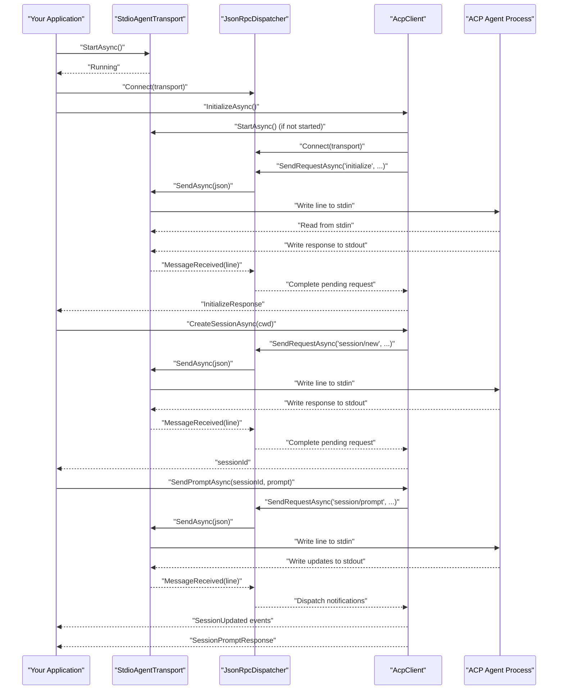

# Getting Started

<cite>
**Referenced Files in This Document**
- [README.md](file://README.md)
- [Agentic.ACPLibrary.csproj](file://Agentic.ACPLibrary.csproj)
- [Client\AcpClient.cs](file://Client/AcpClient.cs)
- [Client\IAcpClient.cs](file://Client/IAcpClient.cs)
- [Transport\StdioAgentTransport.cs](file://Transport/StdioAgentTransport.cs)
- [Transport\IAgentTransport.cs](file://Transport/IAgentTransport.cs)
- [Protocol\JsonRpcDispatcher.cs](file://Protocol/JsonRpcDispatcher.cs)
- [Protocol\IJsonRpcDispatcher.cs](file://Protocol/IJsonRpcDispatcher.cs)
- [Models\SessionNewRequest.cs](file://Models/SessionNewRequest.cs)
- [Models\SessionPromptRequest.cs](file://Models/SessionPromptRequest.cs)
- [Models\InitializeRequest.cs](file://Models/InitializeRequest.cs)
- [Models\InitializeResponse.cs](file://Models/InitializeResponse.cs)
- [Models\Capabilities.cs](file://Models/Capabilities.cs)
- [Models\ContentBlock.cs](file://Models/ContentBlock.cs)
</cite>

## Table of Contents
1. Introduction
2. Prerequisites
3. Installation
4. Quick Start
5. Core Workflow Explained
6. Configuration Options
7. Error Handling and Diagnostics
8. Troubleshooting Guide
9. Conclusion

## Introduction
Agentic.ACPLibrary is a .NET client library for the Agent Client Protocol (ACP). It enables you to communicate with ACP-compliant agents over standard input/output using JSON-RPC 2.0. The library provides transport, dispatching, session management, and extensible handlers for permissions, file system, and terminal operations.

## Prerequisites
- .NET 10.0 runtime or SDK
- An ACP-compliant agent executable available on your machine
- Basic familiarity with C# and async programming

The project targets .NET 10.0 and uses modern language features such as implicit usings and nullable reference types.

**Section sources**
- [Agentic.ACPLibrary.csproj:1-34](file://Agentic.ACPLibrary.csproj#L1-L34)

## Installation
Install the NuGet package into your .NET 10.0 project using one of the following methods:

- Package Manager Console
  - Install-Package ShihaoShen.Agentic.ACPLibrary

- .NET CLI
  - dotnet add package ShihaoShen.Agentic.ACPLibrary

- Visual Studio
  - Open Manage NuGet Packages for your project and search for ShihaoShen.Agentic.ACPLibrary

Ensure your project targets net10.0.

**Section sources**
- [Agentic.ACPLibrary.csproj:1-34](file://Agentic.ACPLibrary.csproj#L1-L34)

## Quick Start
Follow these steps to establish communication with an ACP-compliant agent:

1. Create a transport instance that launches the agent process via stdio.
2. Create a dispatcher and the ACP client.
3. Initialize the client to perform the handshake with the agent.
4. Create a session with a working directory.
5. Send a prompt and handle streaming updates.

Below is a complete example workflow based on the README. Replace path/to/agent with the actual path to your ACP agent executable.

```csharp
using Agentic.ACPLibrary.Client;
using Agentic.ACPLibrary.Protocol;
using Agentic.ACPLibrary.Transport;
using Agentic.ACPLibrary.Models;
using Microsoft.Extensions.Logging;

// 1. Create transport
var transport = new StdioAgentTransport("path/to/agent", "--acp", workingDirectory: ".");

// 2. Create dispatcher and client
var dispatcher = new JsonRpcDispatcher();
var logger = loggerFactory.CreateLogger<AcpClient>();
IAcpClient client = new AcpClient(transport, dispatcher, logger);

// 3. Initialize (starts transport + handshake)
var info = await client.InitializeAsync();
Console.WriteLine($"Connected to: {info.AgentInfo?.Name}");

// 4. Create a session
var sessionId = await client.CreateSessionAsync(cwd: ".");

// 5. Send a prompt
var prompt = new List<ContentBlock> { new TextContent { Text = "Hello!" } };
var response = await client.SendPromptAsync(sessionId, prompt);
```

Notes:
- You can subscribe to SessionUpdated to receive streaming updates from the agent.
- Assign PermissionHandler, FileSystemHandler, and TerminalHandler before calling InitializeAsync if your agent requests permissions, file access, or terminal operations.

**Section sources**
- [README.md:6-33](file://README.md#L6-L33)
- [Client/AcpClient.cs:48-182](file://Client/AcpClient.cs#L48-L182)
- [Transport/StdioAgentTransport.cs:23-59](file://Transport/StdioAgentTransport.cs#L23-L59)
- [Models/ContentBlock.cs:15-23](file://Models/ContentBlock.cs#L15-L23)

## Core Workflow Explained
This section explains how the initialization and request flow works under the hood.



Key points:
- The transport starts the agent process and streams JSON lines over stdio.
- The dispatcher serializes requests and routes incoming messages to appropriate handlers.
- The client orchestrates the initialize handshake, session lifecycle, and prompt sending.

**Diagram sources**
- [Client/AcpClient.cs:48-224](file://Client/AcpClient.cs#L48-L224)
- [Protocol/JsonRpcDispatcher.cs:27-64](file://Protocol/JsonRpcDispatcher.cs#L27-L64)
- [Transport/StdioAgentTransport.cs:30-68](file://Transport/StdioAgentTransport.cs#L30-L68)

**Section sources**
- [Client/AcpClient.cs:48-224](file://Client/AcpClient.cs#L48-L224)
- [Protocol/JsonRpcDispatcher.cs:27-64](file://Protocol/JsonRpcDispatcher.cs#L27-L64)
- [Transport/StdioAgentTransport.cs:30-68](file://Transport/StdioAgentTransport.cs#L30-L68)

## Configuration Options
Common configuration options when creating the transport:

- Command and arguments
  - command: Path to the ACP agent executable.
  - arguments: Command-line arguments passed to the agent (for example, flags required by your agent).

- Working directory
  - workingDirectory: Sets the initial working directory for the agent process. If omitted, the current directory is used.

Example usage pattern:
- Create transport with command, arguments, and optional workingDirectory.
- Pass the transport to the client along with a dispatcher and logger.

These options are defined in the transport constructor and used when starting the underlying process.

**Section sources**
- [Transport/StdioAgentTransport.cs:23-46](file://Transport/StdioAgentTransport.cs#L23-L46)

## Error Handling and Diagnostics
- Transport state and lifecycle
  - The transport exposes a State property and emits events for message reception, faults, and process exit.
  - On shutdown, it attempts graceful termination and falls back to killing the process if necessary.

- Dispatcher behavior
  - The dispatcher tracks pending requests and completes them upon receiving responses.
  - It registers built-in handlers for permission, file system, and terminal requests. If handlers are not provided, default error responses are returned.

- Client events
  - SessionUpdated fires for each streaming update from the agent.
  - AgentProcessExited notifies when the agent process terminates.

Best practices:
- Always assign handlers before InitializeAsync if your agent requires permissions, file I/O, or terminal capabilities.
- Subscribe to AgentProcessExited to detect unexpected agent exits and implement recovery logic.
- Use logging to diagnose connection issues and protocol mismatches.

**Section sources**
- [Transport/IAgentTransport.cs:1-39](file://Transport/IAgentTransport.cs#L1-L39)
- [Transport/StdioAgentTransport.cs:70-93](file://Transport/StdioAgentTransport.cs#L70-L93)
- [Protocol/JsonRpcDispatcher.cs:86-122](file://Protocol/JsonRpcDispatcher.cs#L86-L122)
- [Client/AcpClient.cs:56-72](file://Client/AcpClient.cs#L56-L72)
- [Client/IAcpClient.cs:29-33](file://Client/IAcpClient.cs#L29-L33)

## Troubleshooting Guide
Common issues and resolutions:

- Agent process fails to start
  - Verify the agent executable path and arguments.
  - Ensure the working directory exists and is accessible.
  - Check that the agent supports the expected protocol version.

- No responses received
  - Confirm the transport is running and the dispatcher is connected.
  - Validate that the agent writes valid JSON-RPC lines to stdout.
  - Inspect stderr output for diagnostic information.

- Permission or file system errors
  - Implement IPermissionHandler and IFileSystemHandler before InitializeAsync.
  - Ensure handlers return appropriate responses or throw meaningful exceptions.

- Terminal operations failing
  - Implement ITerminalHandler and ensure commands and working directories are valid.
  - Handle terminal lifecycle events (create, output, wait_for_exit, kill, release).

- Protocol version mismatch
  - The client logs a warning if the agent reports a different protocol version.
  - Update either the client or agent to align on the supported protocol version.

**Section sources**
- [Transport/StdioAgentTransport.cs:30-59](file://Transport/StdioAgentTransport.cs#L30-L59)
- [Protocol/JsonRpcDispatcher.cs:86-122](file://Protocol/JsonRpcDispatcher.cs#L86-L122)
- [Client/AcpClient.cs:176-179](file://Client/AcpClient.cs#L176-L179)

## Conclusion
You now have everything needed to get started with Agentic.ACPLibrary: install the package, set up a transport and dispatcher, initialize the client, create sessions, and send prompts. Use the handler interfaces to integrate permissions, file system, and terminal capabilities. For advanced scenarios, register custom request and notification handlers to extend the protocol.