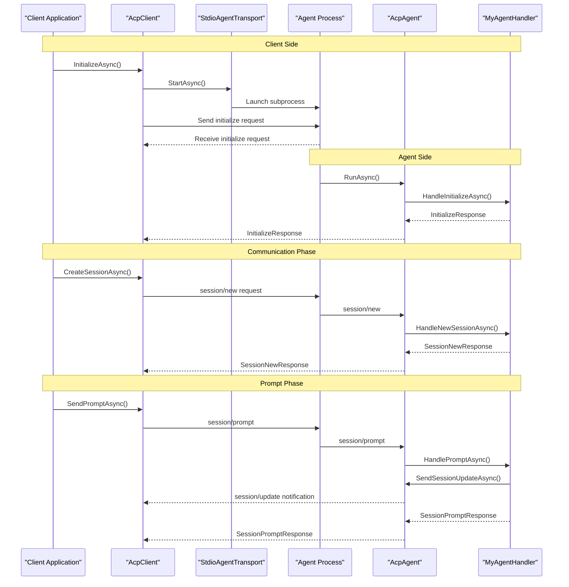
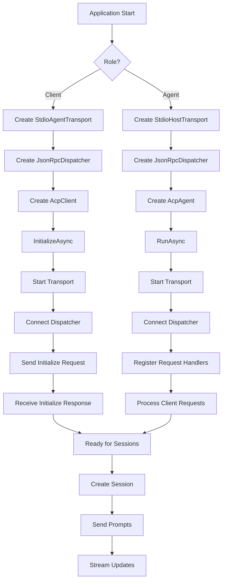

# Getting Started

<cite>
**Referenced Files in This Document**
- [README.md](file://README.md)
- [Agentic.ACPLibrary.csproj](file://Agentic.ACPLibrary.csproj)
- [Client/AcpClient.cs](file://Client/AcpClient.cs)
- [Client/IAcpClient.cs](file://Client/IAcpClient.cs)
- [Agent/AcpAgent.cs](file://Agent/AcpAgent.cs)
- [Agent/AcpAgentHandlerBase.cs](file://Agent/AcpAgentHandlerBase.cs)
- [Transport/StdioAgentTransport.cs](file://Transport/StdioAgentTransport.cs)
- [Transport/StdioHostTransport.cs](file://Transport/StdioHostTransport.cs)
- [Transport/IAgentTransport.cs](file://Transport/IAgentTransport.cs)
- [Protocol\JsonRpcDispatcher.cs](file://Protocol/JsonRpcDispatcher.cs)
- [Protocol/IJsonRpcDispatcher.cs](file://Protocol/IJsonRpcDispatcher.cs)
- [Infrastructure/ServiceCollectionExtensions.cs](file://Infrastructure/ServiceCollectionExtensions.cs)
- [Models\SessionNewRequest.cs](file://Models/SessionNewRequest.cs)
- [Models\SessionPromptRequest.cs](file://Models/SessionPromptRequest.cs)
- [Models/InitializeRequest.cs](file://Models/InitializeRequest.cs)
- [Models/InitializeResponse.cs](file://Models/InitializeResponse.cs)
- [Models/Capabilities.cs](file://Models/Capabilities.cs)
- [Models/ContentBlock.cs](file://Models/ContentBlock.cs)
- [samples/TestClient/Program.cs](file://samples/TestClient/Program.cs)
- [samples/MockAgent/Program.cs](file://samples/MockAgent/Program.cs)
- [samples/MockAgent/MockAgentHandler.cs](file://samples/MockAgent/MockAgentHandler.cs)
</cite>

## Update Summary
**Changes Made**
- Added comprehensive Agent setup instructions with complete code examples
- Expanded Quick Start section to include both Client and Agent workflows
- Updated Core Workflow section to show bidirectional communication between Client and Agent
- Added new sections for Agent implementation patterns and handler interfaces
- Enhanced troubleshooting guide with agent-specific issues
- Updated configuration options to cover both client and agent scenarios

## Table of Contents
1. Introduction
2. Prerequisites
3. Installation
4. Quick Start - Client Setup
5. Quick Start - Agent Setup
6. Understanding Client-Agent Relationship
7. Core Workflow Explained
8. Configuration Options
9. Handler Interfaces
10. Error Handling and Diagnostics
11. Troubleshooting Guide
12. Conclusion

## Introduction
Agentic.ACPLibrary is a .NET library for the [Agent Client Protocol (ACP)](https://agentclientprotocol.com/). It provides complete support for both sides of the protocol over standard input/output using JSON-RPC 2.0:

- **Client** — Launch and drive an ACP-compliant agent (e.g., an IDE or desktop host)
- **Agent** — Build your own ACP-compliant agent that clients can connect to

A single process should act as either a Client or an Agent, not both. The library enables seamless communication between client applications and AI agents through a standardized protocol.

## Prerequisites
- .NET 10.0 runtime or SDK
- Basic familiarity with C# and async programming
- For Client development: An ACP-compliant agent executable available on your machine
- For Agent development: Understanding of how to implement the ACP agent interface

The project targets .NET 10.0 and uses modern language features such as implicit usings and nullable reference types.

**Section sources**
- [Agentic.ACPLibrary.csproj:1-36](file://Agentic.ACPLibrary.csproj#L1-L36)

## Installation
Install the NuGet package into your .NET 10.0 project using one of the following methods:

- Package Manager Console
  ```powershell
  Install-Package ShihaoShen.Agentic.ACPLibrary
  ```

- .NET CLI
  ```bash
  dotnet add package ShihaoShen.Agentic.ACPLibrary
  ```

- Visual Studio
  - Open Manage NuGet Packages for your project and search for ShihaoShen.Agentic.ACPLibrary

Ensure your project targets net10.0.

**Section sources**
- [Agentic.ACPLibrary.csproj:1-36](file://Agentic.ACPLibrary.csproj#L1-L36)

## Quick Start - Client Setup
Follow these steps to create a client that communicates with an ACP-compliant agent:

1. Create a transport instance that launches the agent process via stdio
2. Create a dispatcher and the ACP client
3. Initialize the client to perform the handshake with the agent
4. Create a session with a working directory
5. Send prompts and handle streaming updates

```csharp
using Agentic.ACPLibrary.Client;
using Agentic.ACPLibrary.Protocol;
using Agentic.ACPLibrary.Transport;
using Agentic.ACPLibrary.Models;
using Microsoft.Extensions.Logging;

// 1. Create transport
var transport = new StdioAgentTransport("path/to/agent", "--acp", workingDirectory: ".");

// 2. Create dispatcher and client
var dispatcher = new JsonRpcDispatcher();
var logger = loggerFactory.CreateLogger<AcpClient>();
IAcpClient client = new AcpClient(transport, dispatcher, logger);

// 3. Initialize (starts transport + handshake)
var info = await client.InitializeAsync();
Console.WriteLine($"Connected to: {info.AgentInfo?.Name}");

// 4. Create a session
var sessionId = await client.CreateSessionAsync(cwd: ".");

// 5. Send a prompt
var prompt = new List<ContentBlock> { new TextContent { Text = "Hello!" } };
var response = await client.SendPromptAsync(sessionId, prompt);
```

Notes:
- Subscribe to `SessionUpdated` event to receive streaming updates from the agent
- Assign `PermissionHandler`, `FileSystemHandler`, and `TerminalHandler` before calling `InitializeAsync` if your agent requests permissions, file access, or terminal operations
- Use `AgentProcessExited` event to detect when the agent process terminates

**Section sources**
- [README.md:15-42](file://README.md#L15-L42)
- [Client/AcpClient.cs:48-182](file://Client/AcpClient.cs#L48-L182)
- [Transport/StdioAgentTransport.cs:23-59](file://Transport/StdioAgentTransport.cs#L23-L59)
- [Models/ContentBlock.cs:15-23](file://Models/ContentBlock.cs#L15-L23)

## Quick Start - Agent Setup
Implement an ACP agent by creating a handler class and running it over its own stdin/stdout:

```csharp
using Agentic.ACPLibrary.Agent;
using Agentic.ACPLibrary.Infrastructure;
using Agentic.ACPLibrary.Models;
using Agentic.ACPLibrary.Models.Enums;
using Microsoft.Extensions.DependencyInjection;

public class MyAgentHandler : AcpAgentHandlerBase
{
    public override async Task<SessionPromptResponse> HandlePromptAsync(
        string sessionId, List<ContentBlock> prompt,
        IAcpAgentContext context, CancellationToken ct = default)
    {
        // Stream updates back to the Client
        await context.SendSessionUpdateAsync(sessionId, new AgentMessageChunk
        {
            SessionId = sessionId,
            Content = new TextContent { Text = "Hello from my agent!" }
        }, ct);

        return new SessionPromptResponse { StopReason = StopReason.EndTurn };
    }
}

// Program.cs
var services = new ServiceCollection()
    .AddAcpAgent<MyAgentHandler>()   // registers StdioHostTransport + dispatcher + agent
    .BuildServiceProvider();

await using var agent = services.GetRequiredService<IAcpAgent>();
await agent.RunAsync();

while (agent.IsRunning)
    await Task.Delay(100);           // exits when the Client disconnects (stdin EOF)
```

**Important:** An agent's stdout is reserved for the JSON-RPC channel. Write all logs and diagnostics to stderr (`Console.Error`) — any stray `Console.WriteLine` corrupts the protocol.

During `HandlePromptAsync`, use `IAcpAgentContext` to communicate back to the Client:

| Method | Purpose |
|---|---|
| `SendSessionUpdateAsync` | Send streaming updates to the Client |
| `RequestPermissionAsync` | Request user permission for actions |
| `ReadTextFileAsync` / `WriteTextFileAsync` | File system operations |
| `CreateTerminalAsync` / `GetTerminalOutputAsync` / `WaitForTerminalExitAsync` / `KillTerminalAsync` / `ReleaseTerminalAsync` | Terminal operations |

**Section sources**
- [README.md:44-83](file://README.md#L44-L83)
- [Agent/AcpAgentHandlerBase.cs:1-30](file://Agent/AcpAgentHandlerBase.cs#L1-L30)
- [Infrastructure/ServiceCollectionExtensions.cs:28-38](file://Infrastructure/ServiceCollectionExtensions.cs#L28-L38)

## Understanding Client-Agent Relationship
The ACP library establishes a clear separation between client and agent roles:



Key points:
- **Client Role**: Launches and manages the agent process lifecycle
- **Agent Role**: Processes requests and streams responses back to the client
- **Communication**: Uses JSON-RPC 2.0 over standard input/output
- **Handshake**: Establishes protocol version and capabilities during initialization

**Diagram sources**
- [Client/AcpClient.cs:48-182](file://Client/AcpClient.cs#L48-L182)
- [Agent/AcpAgent.cs:44-179](file://Agent/AcpAgent.cs#L44-L179)
- [Transport/StdioAgentTransport.cs:23-59](file://Transport/StdioAgentTransport.cs#L23-L59)
- [Transport/StdioHostTransport.cs:23-37](file://Transport/StdioHostTransport.cs#L23-L37)

## Core Workflow Explained
This section explains how the initialization and request flow works under the hood for both client and agent components.

### Client Initialization Flow
1. **Transport Setup**: Creates a subprocess to run the agent
2. **Connection Establishment**: Connects the JSON-RPC dispatcher to the transport
3. **Protocol Handshake**: Sends initialize request and receives agent capabilities
4. **Event Registration**: Sets up handlers for notifications and requests

### Agent Initialization Flow
1. **Transport Setup**: Uses the process's own stdin/stdout for communication
2. **Request Registration**: Registers handlers for client requests (initialize, session/new, session/prompt)
3. **Background Processing**: Starts reading messages from stdin asynchronously
4. **Lifecycle Management**: Handles process exit events and cleanup



**Diagram sources**
- [Client/AcpClient.cs:48-182](file://Client/AcpClient.cs#L48-L182)
- [Agent/AcpAgent.cs:44-179](file://Agent/AcpAgent.cs#L44-L179)
- [Protocol/JsonRpcDispatcher.cs:27-64](file://Protocol/JsonRpcDispatcher.cs#L27-L64)

**Section sources**
- [Client/AcpClient.cs:48-224](file://Client/AcpClient.cs#L48-L224)
- [Agent/AcpAgent.cs:44-201](file://Agent/AcpAgent.cs#L44-L201)
- [Protocol/JsonRpcDispatcher.cs:27-64](file://Protocol/JsonRpcDispatcher.cs#L27-L64)
- [Transport/StdioAgentTransport.cs:30-68](file://Transport/StdioAgentTransport.cs#L30-L68)
- [Transport/StdioHostTransport.cs:23-37](file://Transport/StdioHostTransport.cs#L23-L37)

## Configuration Options
Common configuration options when setting up both client and agent components:

### Client Configuration
- **Command and arguments**
  - `command`: Path to the ACP agent executable
  - `arguments`: Command-line arguments passed to the agent (for example, flags required by your agent)
- **Working directory**
  - `workingDirectory`: Sets the initial working directory for the agent process. If omitted, the current directory is used

### Agent Configuration
- **Service Registration**: Use `AddAcpAgent<THandler>()` to register the agent with dependency injection
- **Transport Selection**: Agents automatically use `StdioHostTransport` which reads from the process's own stdin/stdout
- **Handler Implementation**: Implement required methods in your agent handler class

Example usage pattern:
- Create transport with command, arguments, and optional workingDirectory for clients
- Register agent services using dependency injection for agents
- Pass the transport to the client along with a dispatcher and logger

These options are defined in the transport constructors and used when starting the underlying processes.

**Section sources**
- [Transport/StdioAgentTransport.cs:23-46](file://Transport/StdioAgentTransport.cs#L23-L46)
- [Transport/StdioHostTransport.cs:23-37](file://Transport/StdioHostTransport.cs#L23-L37)
- [Infrastructure/ServiceCollectionExtensions.cs:28-38](file://Infrastructure/ServiceCollectionExtensions.cs#L28-L38)

## Handler Interfaces
The library provides comprehensive handler interfaces for extending functionality:

### Client-Side Handlers
Implement these interfaces to handle requests from the Agent:

| Interface | Purpose |
|---|---|
| `IPermissionHandler` | Handle `session/request_permission` — prompt the user to approve/deny actions |
| `IFileSystemHandler` | Handle `fs/read_text_file` and `fs/write_text_file` |
| `ITerminalHandler` | Handle `terminal/create`, `terminal/output`, `terminal/wait_for_exit`, `terminal/kill`, `terminal/release` |

Assign them before calling `InitializeAsync`:
```csharp
client.PermissionHandler = myPermissionHandler;
client.FileSystemHandler = myFsHandler;
client.TerminalHandler = myTerminalHandler;
```

### Agent-Side Context
Agents use `IAcpAgentContext` during prompt handling to communicate back to the Client:

| Method | Client-side counterpart |
|---|---|
| `SendSessionUpdateAsync` | `session/update` notification |
| `RequestPermissionAsync` | `IPermissionHandler` |
| `ReadTextFileAsync` / `WriteTextFileAsync` | `IFileSystemHandler` |
| `CreateTerminalAsync` / `GetTerminalOutputAsync` / `WaitForTerminalExitAsync` / `KillTerminalAsync` / `ReleaseTerminalAsync` | `ITerminalHandler` |

### Extensibility
Register custom handlers for methods not covered by the built-in protocol:

```csharp
// Handle a custom request method
client.RegisterRequestHandler("custom/method", async request =>
{
    // process request.Params ...
    return new JsonRpcResponse { Id = request.Id, Result = resultElement };
});

// Listen for a custom notification
client.RegisterNotificationHandler("custom/notify", async notification =>
{
    // handle notification
});
```

**Section sources**
- [README.md:123-158](file://README.md#L123-L158)
- [Client/AcpClient.cs:74-147](file://Client/AcpClient.cs#L74-L147)
- [Agent/AcpAgent.cs:214-307](file://Agent/AcpAgent.cs#L214-L307)

## Error Handling and Diagnostics
Both client and agent components provide comprehensive error handling and diagnostic capabilities:

### Transport State and Lifecycle
- The transport exposes a `State` property and emits events for message reception, faults, and process exit
- On shutdown, it attempts graceful termination and falls back to killing the process if necessary

### Dispatcher Behavior
- The dispatcher tracks pending requests and completes them upon receiving responses
- It registers built-in handlers for permission, file system, and terminal requests
- If handlers are not provided, default error responses are returned

### Client Events
- `SessionUpdated` fires for each streaming update from the agent
- `AgentProcessExited` notifies when the agent process terminates

### Agent Lifecycle
- `IsRunning` property indicates whether the agent is currently processing requests
- `StopAsync()` method gracefully shuts down the agent and cancels active sessions
- Background read loop handles stdin EOF detection for client disconnection

Best practices:
- Always assign handlers before `InitializeAsync` if your agent requires permissions, file I/O, or terminal capabilities
- Subscribe to `AgentProcessExited` to detect unexpected agent exits and implement recovery logic
- Use logging to diagnose connection issues and protocol mismatches
- For agents, write all diagnostics to stderr to avoid corrupting the JSON-RPC channel

**Section sources**
- [Transport/IAgentTransport.cs:1-39](file://Transport/IAgentTransport.cs#L1-L39)
- [Transport/StdioAgentTransport.cs:70-93](file://Transport/StdioAgentTransport.cs#L70-L93)
- [Transport/StdioHostTransport.cs:60-89](file://Transport/StdioHostTransport.cs#L60-L89)
- [Protocol/JsonRpcDispatcher.cs:86-122](file://Protocol/JsonRpcDispatcher.cs#L86-L122)
- [Client/AcpClient.cs:56-72](file://Client/AcpClient.cs#L56-L72)
- [Client/IAcpClient.cs:29-33](file://Client/IAcpClient.cs#L29-L33)
- [Agent/AcpAgent.cs:182-201](file://Agent/AcpAgent.cs#L182-L201)

## Troubleshooting Guide
Common issues and resolutions for both client and agent development:

### Agent Process Issues (Client Development)
- **Agent process fails to start**
  - Verify the agent executable path and arguments
  - Ensure the working directory exists and is accessible
  - Check that the agent supports the expected protocol version
- **No responses received**
  - Confirm the transport is running and the dispatcher is connected
  - Validate that the agent writes valid JSON-RPC lines to stdout
  - Inspect stderr output for diagnostic information

### Agent Implementation Issues (Agent Development)
- **Protocol corruption**
  - Ensure all output goes to stderr, not stdout
  - Verify proper JSON-RPC message formatting
  - Check that handlers don't throw unhandled exceptions
- **Session management problems**
  - Implement proper session lifecycle in `HandleNewSessionAsync`
  - Handle cancellation tokens correctly in long-running operations
  - Clean up resources in `HandleCancelAsync`

### Permission and File System Errors
- Implement `IPermissionHandler` and `IFileSystemHandler` before `InitializeAsync`
- Ensure handlers return appropriate responses or throw meaningful exceptions
- Test file path permissions and accessibility

### Terminal Operations Failing
- Implement `ITerminalHandler` and ensure commands and working directories are valid
- Handle terminal lifecycle events (create, output, wait_for_exit, kill, release)
- Consider terminal encoding and character set issues

### Protocol Version Mismatch
- The client logs a warning if the agent reports a different protocol version
- Update either the client or agent to align on the supported protocol version
- Check that both components use compatible versions of the library

### Debugging Tips
- Enable detailed logging in both client and agent applications
- Use the mock agent sample for testing client implementations
- Monitor process creation and termination events
- Validate JSON-RPC message format and content

**Section sources**
- [Transport/StdioAgentTransport.cs:30-59](file://Transport/StdioAgentTransport.cs#L30-L59)
- [Transport/StdioHostTransport.cs:60-89](file://Transport/StdioHostTransport.cs#L60-L89)
- [Protocol/JsonRpcDispatcher.cs:86-122](file://Protocol/JsonRpcDispatcher.cs#L86-L122)
- [Client/AcpClient.cs:176-179](file://Client/AcpClient.cs#L176-L179)
- [README.md:85-86](file://README.md#L85-L86)

## Conclusion
You now have everything needed to get started with Agentic.ACPLibrary for both client and agent development:

### For Client Development:
- Install the package and set up a transport and dispatcher
- Initialize the client and establish communication with an agent
- Create sessions and send prompts with streaming update support
- Implement handlers for permissions, file system, and terminal operations

### For Agent Development:
- Implement the `AcpAgentHandlerBase` class with your business logic
- Set up dependency injection and run the agent over stdin/stdout
- Handle prompts and stream updates back to clients
- Support file system, terminal, and permission operations through the agent context

The library provides a robust foundation for building ACP-compliant applications with comprehensive error handling, extensibility points, and clear separation between client and agent responsibilities. Use the included mock agent sample for testing and refer to the handler interfaces for advanced customization scenarios.