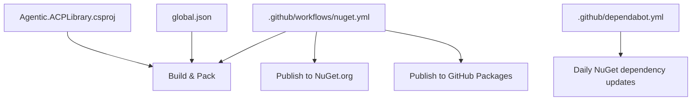
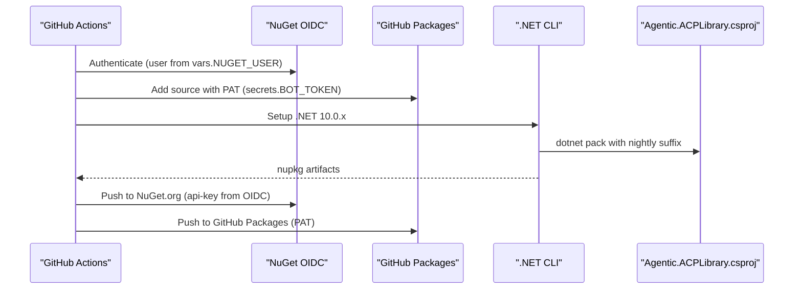
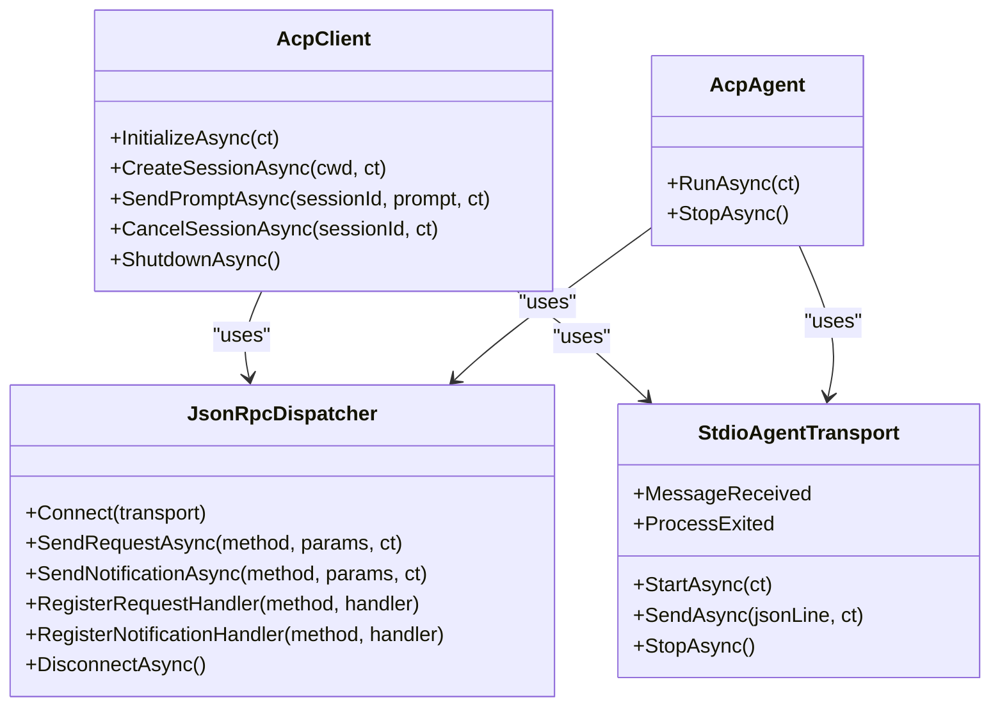
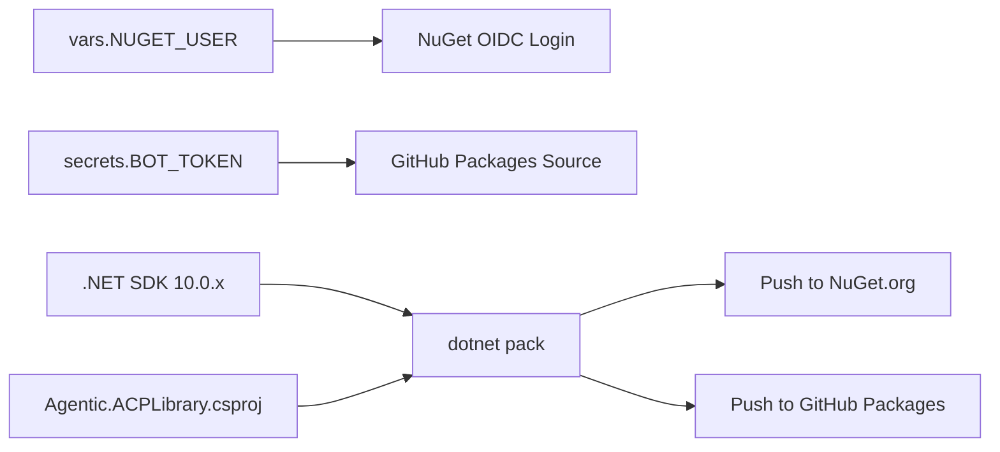

# CI/CD Pipeline

<cite>
**Referenced Files in This Document**
- [nuget.yml](file://.github/workflows/nuget.yml)
- [dependabot.yml](file://.github/dependabot.yml)
- [AGENTS.md](file://AGENTS.md)
- [Agentic.ACPLibrary.csproj](file://Agentic.ACPLibrary.csproj)
- [global.json](file://global.json)
- [AcpClient.cs](file://Client/AcpClient.cs)
- [AcpAgent.cs](file://Agent/AcpAgent.cs)
- [JsonRpcDispatcher.cs](file://Protocol/JsonRpcDispatcher.cs)
- [StdioAgentTransport.cs](file://Transport/StdioAgentTransport.cs)
</cite>

## Table of Contents
1. [Introduction](#introduction)
2. [Project Structure](#project-structure)
3. [Core Components](#core-components)
4. [Architecture Overview](#architecture-overview)
5. [Detailed Component Analysis](#detailed-component-analysis)
6. [Dependency Analysis](#dependency-analysis)
7. [Performance Considerations](#performance-considerations)
8. [Troubleshooting Guide](#troubleshooting-guide)
9. [Conclusion](#conclusion)
10. [Appendices](#appendices)

## Introduction
This document describes the CI/CD pipeline for the Agentic.ACPLibrary, a .NET library implementing the Agent Client Protocol (ACP) over JSON-RPC via stdio. The pipeline builds and publishes NuGet packages to both NuGet.org and GitHub Packages on every push to main. It uses OIDC authentication for NuGet.org and a PAT-based secret for GitHub Packages. The repository also includes Dependabot configuration to automate dependency updates.

## Project Structure
The CI/CD-related configuration is primarily located under .github:
- Workflows define the build and publish steps.
- Dependabot automates dependency updates.

**Diagram sources**
- [nuget.yml:1-33](file://.github/workflows/nuget.yml#L1-L33)
- [dependabot.yml:1-12](file://.github/dependabot.yml#L1-L12)
- [Agentic.ACPLibrary.csproj:1-36](file://Agentic.ACPLibrary.csproj#L1-L36)
- [global.json:1-7](file://global.json#L1-L7)

**Section sources**
- [nuget.yml:1-33](file://.github/workflows/nuget.yml#L1-L33)
- [dependabot.yml:1-12](file://.github/dependabot.yml#L1-L12)
- [AGENTS.md:22-77](file://AGENTS.md#L22-L77)
- [Agentic.ACPLibrary.csproj:1-36](file://Agentic.ACPLibrary.csproj#L1-L36)
- [global.json:1-7](file://global.json#L1-L7)

## Core Components
- Workflow trigger: Runs on pushes to main.
- Environment: Windows runner with id-token write permission for OIDC login.
- Authentication:
  - NuGet.org via OIDC using a configured user variable.
  - GitHub Packages via a PAT stored in secrets.
- Build step: Packs the project with a nightly version suffix derived from the commit SHA.
- Publish step: Pushes the generated packages to both registries.

Key behaviors:
- Versioning: Nightly pre-release suffix appended during CI packaging.
- No build/test in CI: Validation is expected to pass locally before pushing to main.

**Section sources**
- [nuget.yml:1-33](file://.github/workflows/nuget.yml#L1-L33)
- [AGENTS.md:22-77](file://AGENTS.md#L22-L77)

## Architecture Overview
The CI/CD pipeline orchestrates authentication, packaging, and publishing across two registries. The workflow relies on environment variables and secrets to authenticate, then uses the .NET SDK to pack and push packages.

**Diagram sources**
- [nuget.yml:1-33](file://.github/workflows/nuget.yml#L1-L33)
- [Agentic.ACPLibrary.csproj:1-36](file://Agentic.ACPLibrary.csproj#L1-L36)

## Detailed Component Analysis

### Workflow: Build and Publish
- Trigger: push to main branch.
- Runner: windows-latest with id-token write.
- Steps:
  - NuGet login via OIDC.
  - GitHub Packages source registration using a PAT secret.
  - Checkout code.
  - Setup .NET SDK 10.0.x.
  - Package with nightly version suffix based on github.sha.
  - Publish to both registries.

Notes:
- The workflow does not run build or test commands; validation is expected locally.
- The nightly suffix ensures unique package versions per commit.

**Section sources**
- [nuget.yml:1-33](file://.github/workflows/nuget.yml#L1-L33)
- [AGENTS.md:22-77](file://AGENTS.md#L22-L77)

### Dependency Updates: Dependabot
- Monitors NuGet dependencies daily.
- Targets the root directory where manifests reside.

**Section sources**
- [dependabot.yml:1-12](file://.github/dependabot.yml#L1-L12)

### Packaging Configuration
- Target framework: net10.0.
- Package metadata: ID, version prefix, authors, description, tags, license, readme inclusion.
- Excludes samples and tests from default item globs to keep the package lean.
- Documentation file generation enabled.

**Section sources**
- [Agentic.ACPLibrary.csproj:1-36](file://Agentic.ACPLibrary.csproj#L1-L36)

### SDK Pinning
- global.json pins the .NET SDK version and roll-forward policy to ensure consistent builds.

**Section sources**
- [global.json:1-7](file://global.json#L1-L7)

### Runtime Behavior Context (for pipeline understanding)
While not part of the CI/CD itself, understanding the runtime helps contextualize what gets packaged and how it behaves when consumed:
- Client and Agent communicate over stdio using JSON-RPC.
- Dispatcher routes requests and notifications, tracks pending requests, and handles errors.
- Transport manages process lifecycle and message I/O.

**Diagram sources**
- [JsonRpcDispatcher.cs:1-159](file://Protocol/JsonRpcDispatcher.cs#L1-L159)
- [StdioAgentTransport.cs:1-150](file://Transport/StdioAgentTransport.cs#L1-L150)
- [AcpClient.cs:1-375](file://Client/AcpClient.cs#L1-L375)
- [AcpAgent.cs:1-309](file://Agent/AcpAgent.cs#L1-L309)

## Dependency Analysis
The CI/CD pipeline depends on:
- GitHub Actions environment and permissions (id-token write).
- Repository variables and secrets:
  - vars.NUGET_USER for OIDC login.
  - secrets.BOT_TOKEN for GitHub Packages authentication.
- .NET SDK 10.0.x (pinned via setup-dotnet and global.json).
- Project manifest (csproj) for package metadata and content.

**Diagram sources**
- [nuget.yml:1-33](file://.github/workflows/nuget.yml#L1-L33)
- [Agentic.ACPLibrary.csproj:1-36](file://Agentic.ACPLibrary.csproj#L1-L36)
- [global.json:1-7](file://global.json#L1-L7)

**Section sources**
- [nuget.yml:1-33](file://.github/workflows/nuget.yml#L1-L33)
- [Agentic.ACPLibrary.csproj:1-36](file://Agentic.ACPLibrary.csproj#L1-L36)
- [global.json:1-7](file://global.json#L1-L7)

## Performance Considerations
- Use of a pinned SDK ensures deterministic builds and avoids variability due to SDK upgrades.
- Packaging only the library (excluding samples/tests by default) reduces artifact size and improves distribution speed.
- Nightly version suffix prevents conflicts and enables traceability back to commits.

[No sources needed since this section provides general guidance]

## Troubleshooting Guide
Common issues and resolutions:
- OIDC login failures:
  - Ensure vars.NUGET_USER is correctly set and the workflow has id-token: write permission.
  - Verify that the OIDC token can be used to log in to NuGet.org.
- GitHub Packages authentication failures:
  - Confirm secrets.BOT_TOKEN exists and has sufficient permissions for the target organization.
  - Validate the source URL matches the organization’s package endpoint.
- Build/pack failures:
  - Check that the local environment uses .NET SDK 10.0.x as specified in global.json.
  - Ensure the csproj properties are correct and no unexpected items are included in the package.
- Unexpected package contents:
  - Review DefaultItemExclusions to confirm samples and tests are excluded.
  - Verify README and LICENSE are included as intended.

Operational notes:
- CI does not run dotnet build or dotnet test; ensure these pass locally before pushing to main.
- The nightly suffix is applied only in CI; local packs do not include it.

**Section sources**
- [nuget.yml:1-33](file://.github/workflows/nuget.yml#L1-L33)
- [AGENTS.md:22-77](file://AGENTS.md#L22-L77)
- [Agentic.ACPLibrary.csproj:1-36](file://Agentic.ACPLibrary.csproj#L1-L36)

## Conclusion
The CI/CD pipeline automates nightly packaging and publishing of the Agentic.ACPLibrary to NuGet.org and GitHub Packages. It leverages OIDC and PAT-based authentication, enforces a pinned .NET SDK, and stamps each package with a unique nightly version tied to the commit SHA. Dependabot complements the pipeline by keeping dependencies up to date. Adhering to local validation practices ensures quality before changes reach main.

[No sources needed since this section summarizes without analyzing specific files]

## Appendices

### Local vs CI Commands
- Local: dotnet pack Agentic.ACPLibrary.csproj -c Release -o ./nupkg
- CI: dotnet pack Agentic.ACPLibrary.csproj -c Release -o ./nupkg -p:VersionSuffix=nightly.${{ github.sha }}

**Section sources**
- [AGENTS.md:50-59](file://AGENTS.md#L50-L59)
- [nuget.yml:26-28](file://.github/workflows/nuget.yml#L26-L28)