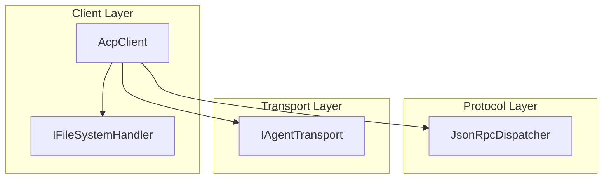
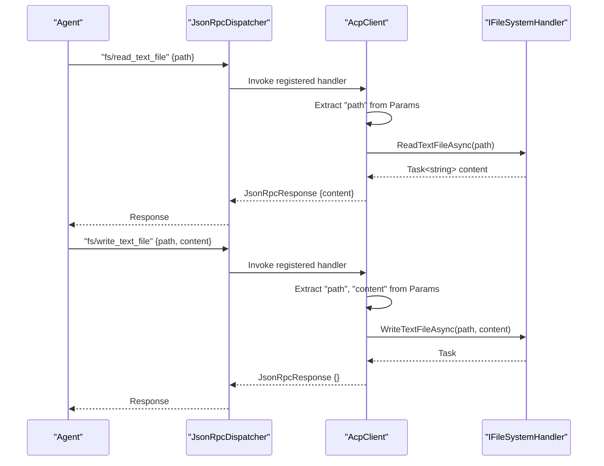
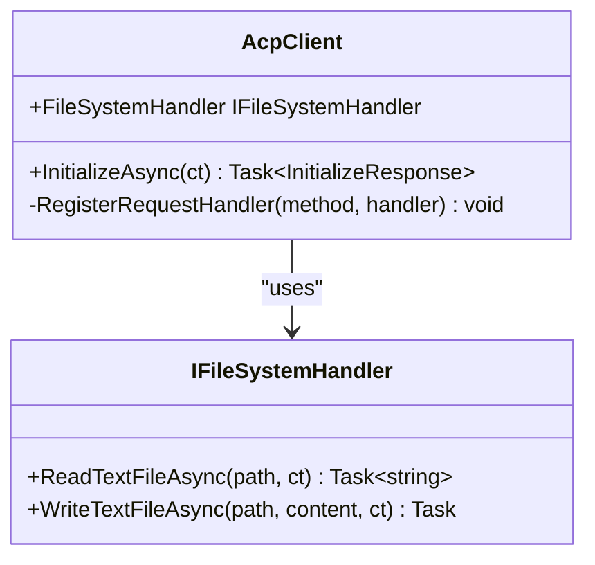
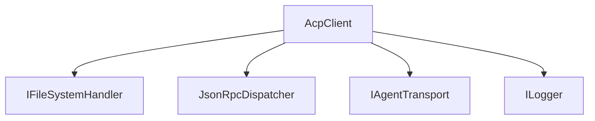

# File System Handler

<cite>
**Referenced Files in This Document**
- [IFileSystemHandler.cs](file://Client/IFileSystemHandler.cs)
- [AcpClient.cs](file://Client/AcpClient.cs)
- [README.md](file://README.md)
</cite>

## Table of Contents
1. [Introduction](#introduction)
2. [Project Structure](#project-structure)
3. [Core Components](#core-components)
4. [Architecture Overview](#architecture-overview)
5. [Detailed Component Analysis](#detailed-component-analysis)
6. [Dependency Analysis](#dependency-analysis)
7. [Performance Considerations](#performance-considerations)
8. [Troubleshooting Guide](#troubleshooting-guide)
9. [Conclusion](#conclusion)
10. [Appendices](#appendices)

## Introduction
This document provides comprehensive documentation for the IFileSystemHandler interface, which enables secure and controlled file read/write operations in response to Agent requests over the Agent Client Protocol (ACP). It covers supported operations, method signatures, parameter validation, return types, security considerations, implementation guidance, error handling patterns, resource management, performance optimization, and testing strategies.

## Project Structure
The IFileSystemHandler is defined as a client-side handler interface that the application implements to handle fs/* requests from the Agent. The AcpClient wires up JSON-RPC handlers for fs/read_text_file and fs/write_text_file and delegates execution to the implemented IFileSystemHandler.

**Diagram sources**
- [AcpClient.cs:102-144](file://Client/AcpClient.cs#L102-L144)
- [IFileSystemHandler.cs:1-14](file://Client/IFileSystemHandler.cs#L1-L14)

**Section sources**
- [README.md:35-51](file://README.md#L35-L51)
- [AcpClient.cs:102-144](file://Client/AcpClient.cs#L102-L144)
- [IFileSystemHandler.cs:1-14](file://Client/IFileSystemHandler.cs#L1-L14)

## Core Components
- IFileSystemHandler: Defines two asynchronous methods for reading and writing text files. Implementations must validate inputs, enforce security policies, manage resources, and handle errors appropriately.
- AcpClient: Registers JSON-RPC request handlers for fs/read_text_file and fs/write_text_file, extracts parameters, and invokes the corresponding IFileSystemHandler methods.

Key responsibilities:
- Input validation: Ensure path and content are valid and safe.
- Security: Prevent path traversal, enforce access permissions, sanitize inputs.
- Resource management: Properly open/close streams, respect cancellation tokens.
- Error handling: Return meaningful exceptions or structured errors when operations fail.

**Section sources**
- [IFileSystemHandler.cs:1-14](file://Client/IFileSystemHandler.cs#L1-L14)
- [AcpClient.cs:102-144](file://Client/AcpClient.cs#L102-L144)

## Architecture Overview
The file system operation flow involves the Agent sending a JSON-RPC request, the AcpClient routing it to the appropriate handler, and the IFileSystemHandler performing the actual file operation.

**Diagram sources**
- [AcpClient.cs:102-144](file://Client/AcpClient.cs#L102-L144)
- [IFileSystemHandler.cs:1-14](file://Client/IFileSystemHandler.cs#L1-L14)

## Detailed Component Analysis

### IFileSystemHandler Interface
- Methods:
  - ReadTextFileAsync(string path, CancellationToken ct = default): Reads a text file and returns its content asynchronously.
  - WriteTextFileAsync(string path, string content, CancellationToken ct = default): Writes provided content to a text file asynchronously.

Parameter validation and behavior expectations:
- path: Must be validated to prevent directory traversal and unauthorized access.
- content: For write operations, should be sanitized and validated for size limits if applicable.
- ct: Cancellation token should be respected to allow graceful cancellation.

Return types:
- ReadTextFileAsync returns a Task<string> with the file content.
- WriteTextFileAsync returns a Task indicating completion.

Error handling:
- Throw appropriate exceptions for invalid paths, permission denied, IO errors, or cancellation.
- Avoid leaking sensitive information in error messages.

Security considerations:
- Enforce strict path validation to prevent traversal attacks.
- Validate and sanitize input content to avoid injection or abuse.
- Apply least-privilege file access permissions.

Resource management:
- Use proper stream disposal and ensure resources are released even on exceptions.
- Respect cancellation tokens to avoid hanging operations.

Implementation example guidance:
- Validate path against an allowed base directory.
- Normalize paths and reject attempts to escape the base directory.
- Check file existence and permissions before read/write.
- Use buffered I/O for large files and stream processing where possible.

**Section sources**
- [IFileSystemHandler.cs:1-14](file://Client/IFileSystemHandler.cs#L1-L14)

### AcpClient Integration
- Registers handlers for fs/read_text_file and fs/write_text_file.
- Extracts parameters from JSON-RPC request Params.
- Invokes IFileSystemHandler methods and serializes results back to JSON-RPC responses.
- Returns structured errors when FileSystemHandler is not available.

Operational details:
- If FileSystemHandler is null, respond with a specific error code indicating unavailability.
- Deserialize path and content from Params safely, providing defaults when missing.
- Serialize results using configured JSON options.

**Section sources**
- [AcpClient.cs:102-144](file://Client/AcpClient.cs#L102-L144)

### Class Diagram

**Diagram sources**
- [IFileSystemHandler.cs:1-14](file://Client/IFileSystemHandler.cs#L1-L14)
- [AcpClient.cs:25-26](file://Client/AcpClient.cs#L25-L26)
- [AcpClient.cs:102-144](file://Client/AcpClient.cs#L102-L144)

## Dependency Analysis
The IFileSystemHandler depends on no external libraries within this repository; however, implementations typically rely on .NET I/O APIs. AcpClient depends on JsonRpcDispatcher and IAgentTransport for communication, and uses Microsoft.Extensions.Logging for diagnostics.

**Diagram sources**
- [AcpClient.cs:1-10](file://Client/AcpClient.cs#L1-L10)
- [AcpClient.cs:102-144](file://Client/AcpClient.cs#L102-L144)

**Section sources**
- [AcpClient.cs:1-10](file://Client/AcpClient.cs#L1-L10)
- [AcpClient.cs:102-144](file://Client/AcpClient.cs#L102-L144)

## Performance Considerations
- Use streaming I/O for large files to minimize memory usage.
- Buffer reads/writes appropriately based on expected file sizes.
- Avoid synchronous I/O calls; always use async methods.
- Respect cancellation tokens to prevent long-running operations from blocking.
- Cache metadata (e.g., file existence checks) judiciously to reduce overhead.
- Consider concurrency controls to limit simultaneous file operations if needed.

[No sources needed since this section provides general guidance]

## Troubleshooting Guide
Common issues and resolutions:
- Path traversal attempts: Ensure strict validation against an allowed base directory and normalize paths.
- Permission denied errors: Verify process permissions and file ACLs.
- Invalid JSON parameters: Handle missing or malformed Params gracefully and provide clear error responses.
- Cancellation not respected: Ensure all I/O operations observe the provided CancellationToken.
- Resource leaks: Use try/finally or using statements to guarantee disposal of streams and handles.

Error handling patterns:
- Validate inputs early and throw ArgumentException or similar for invalid data.
- Catch and wrap IO exceptions with context-specific messages.
- Log errors at appropriate levels without exposing sensitive details.

**Section sources**
- [AcpClient.cs:102-144](file://Client/AcpClient.cs#L102-L144)

## Conclusion
The IFileSystemHandler interface provides a clean abstraction for secure file read/write operations in response to Agent requests. Implementations must prioritize security, input validation, resource management, and robust error handling. By following the guidance in this document, developers can build reliable and performant file system handlers that integrate seamlessly with the AcpClient and the broader ACP ecosystem.

[No sources needed since this section summarizes without analyzing specific files]

## Appendices

### Implementation Checklist
- Validate and sanitize all inputs (path, content).
- Enforce base directory restrictions and prevent path traversal.
- Check file permissions and existence before operations.
- Use async I/O with proper buffering and streaming for large files.
- Respect cancellation tokens throughout operations.
- Handle and log errors without leaking sensitive information.
- Dispose all resources properly, even on exceptions.

### Testing Strategies
- Unit tests for input validation and security checks.
- Integration tests with mock file systems to verify read/write behavior.
- Stress tests for large files and concurrent operations.
- Cancellation tests to ensure timely aborts.
- Error scenario tests for permission denied, invalid paths, and IO failures.

[No sources needed since this section provides general guidance]