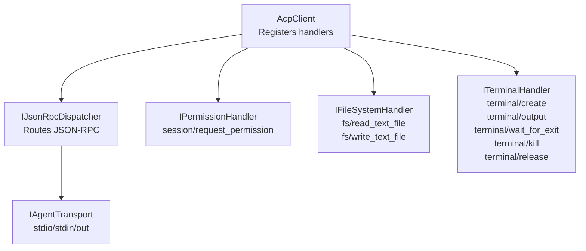
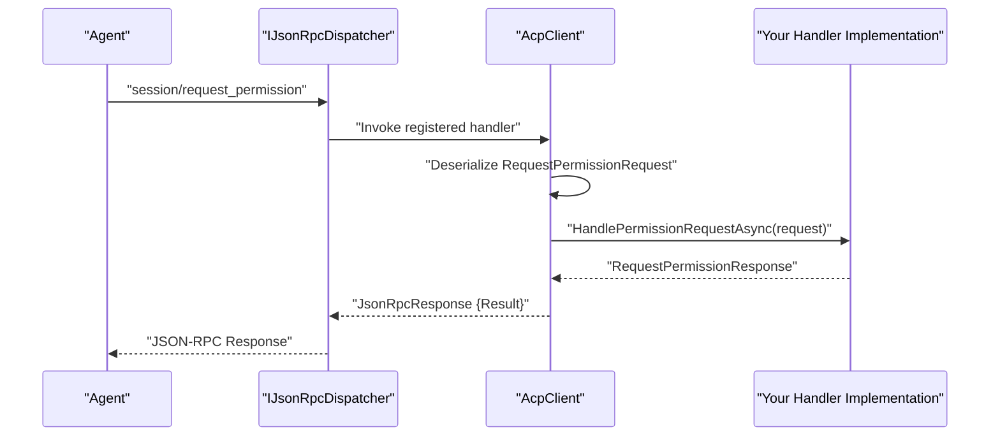
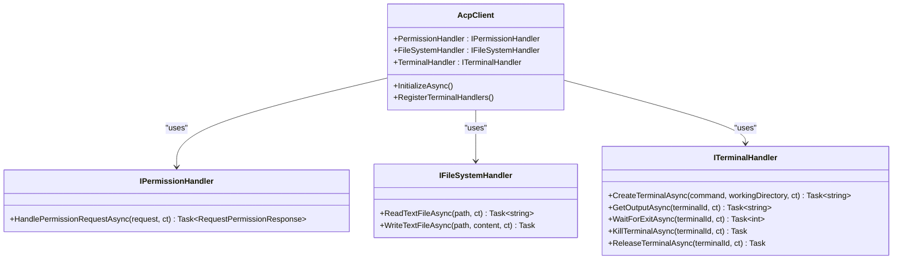

# Handler System

<cite>
**Referenced Files in This Document**
- [AcpClient.cs](file://Client/AcpClient.cs)
- [IAcpClient.cs](file://Client/IAcpClient.cs)
- [IPermissionHandler.cs](file://Client/IPermissionHandler.cs)
- [IFileSystemHandler.cs](file://Client/IFileSystemHandler.cs)
- [ITerminalHandler.cs](file://Client/ITerminalHandler.cs)
- [RequestPermissionRequest.cs](file://Models/RequestPermissionRequest.cs)
- [ToolCall.cs](file://Models/ToolCall.cs)
- [Capabilities.cs](file://Models/Capabilities.cs)
- [JsonRpcError.cs](file://JsonRpc/JsonRpcError.cs)
- [JsonRpcResponse.cs](file://JsonRpc/JsonRpcResponse.cs)
- [ServiceCollectionExtensions.cs](file://Infrastructure/ServiceCollectionExtensions.cs)
- [README.md](file://README.md)
</cite>

## Table of Contents
1. [Introduction](#introduction)
2. [Project Structure](#project-structure)
3. [Core Components](#core-components)
4. [Architecture Overview](#architecture-overview)
5. [Detailed Component Analysis](#detailed-component-analysis)
6. [Dependency Analysis](#dependency-analysis)
7. [Performance Considerations](#performance-considerations)
8. [Troubleshooting Guide](#troubleshooting-guide)
9. [Conclusion](#conclusion)
10. [Appendices](#appendices)

## Introduction
This document explains the extensible handler system used by the ACP client to process requests from an agent. It focuses on three built-in handler interfaces:
- IPermissionHandler for security-sensitive permission prompts
- IFileSystemHandler for file read/write operations
- ITerminalHandler for terminal/process lifecycle management

It details method signatures, parameters, return values, error handling patterns, threading considerations, and best practices for secure implementations. It also provides guidance on testing custom handlers and integrating them with the AcpClient.

## Project Structure
The handler system is centered around the AcpClient, which wires JSON-RPC methods to handler interfaces. Handlers are assigned as properties on the client before initialization. The client registers request handlers for session/request_permission, fs/*, and terminal/* methods and delegates to the corresponding handler implementations.

**Diagram sources**
- [AcpClient.cs:74-147](file://Client/AcpClient.cs#L74-L147)
- [AcpClient.cs:250-359](file://Client/AcpClient.cs#L250-L359)

**Section sources**
- [AcpClient.cs:1-361](file://Client/AcpClient.cs#L1-L361)
- [IAcpClient.cs:1-59](file://Client/IAcpClient.cs#L1-L59)
- [README.md:35-51](file://README.md#L35-L51)

## Core Components
- IPermissionHandler: Handles permission prompts from the agent. Must block until a decision is made and return a response containing an outcome.
- IFileSystemHandler: Provides asynchronous text file read and write operations.
- ITerminalHandler: Manages terminal processes including creation, output retrieval, waiting for exit, killing, and releasing resources.

These interfaces are consumed by AcpClient during initialization when it registers JSON-RPC handlers that delegate to your implementations.

**Section sources**
- [IPermissionHandler.cs:1-17](file://Client/IPermissionHandler.cs#L1-L17)
- [IFileSystemHandler.cs:1-14](file://Client/IFileSystemHandler.cs#L1-L14)
- [ITerminalHandler.cs:1-23](file://Client/ITerminalHandler.cs#L1-L23)
- [AcpClient.cs:22-29](file://Client/AcpClient.cs#L22-L29)

## Architecture Overview
The AcpClient wires JSON-RPC methods to handler implementations. When the agent sends a request, the dispatcher routes it to the appropriate handler method. Responses are serialized back to JSON-RPC responses. Errors are returned via JsonRpcError when handlers are unavailable or when explicit errors occur.

**Diagram sources**
- [AcpClient.cs:74-99](file://Client/AcpClient.cs#L74-L99)
- [RequestPermissionRequest.cs:1-47](file://Models/RequestPermissionRequest.cs#L1-L47)

**Section sources**
- [AcpClient.cs:74-99](file://Client/AcpClient.cs#L74-L99)
- [JsonRpcResponse.cs:1-20](file://JsonRpc/JsonRpcResponse.cs#L1-L20)
- [JsonRpcError.cs:1-19](file://JsonRpc/JsonRpcError.cs#L1-L19)

## Detailed Component Analysis

### IPermissionHandler
Purpose: Handle permission prompts from the agent. Implementations should be UI-driven and block until a user decision is made.

Required method:
- HandlePermissionRequestAsync(RequestPermissionRequest request, CancellationToken ct = default): Task<RequestPermissionResponse>

Parameters:
- request.sessionId: string — Identifier of the current session
- request.toolCall: ToolCallInfo? — Optional tool call context
- request.options: List<PermissionOption> — Available options for the user to choose from

Return value:
- RequestPermissionResponse.Outcome: PermissionOutcome — Contains outcome type and optional selected optionId

Exception handling pattern:
- If no PermissionHandler is set, AcpClient returns a cancelled outcome automatically
- Throw exceptions only for unexpected errors; otherwise, return a valid response

Best practices:
- Always respect cancellation tokens
- Validate input parameters (non-null sessionId, non-empty options if required)
- Ensure thread-safety if multiple concurrent permission prompts can occur
- Log decisions for auditability without exposing sensitive data

Implementation example outline:
- Show a modal dialog with available options
- Await user selection or cancellation
- Return PermissionOutcome.Selected(optionId) or PermissionOutcome.Cancelled()

**Section sources**
- [IPermissionHandler.cs:1-17](file://Client/IPermissionHandler.cs#L1-L17)
- [RequestPermissionRequest.cs:1-47](file://Models/RequestPermissionRequest.cs#L1-L47)
- [AcpClient.cs:74-99](file://Client/AcpClient.cs#L74-L99)

### IFileSystemHandler
Purpose: Provide secure file read/write operations for text files.

Required methods:
- ReadTextFileAsync(string path, CancellationToken ct = default): Task<string>
- WriteTextFileAsync(string path, string content, CancellationToken ct = default): Task

Parameters:
- path: string — File path to read or write
- content: string — Content to write (for write operation)

Return values:
- ReadTextFileAsync returns the file content as a string
- WriteTextFileAsync returns void

Exception handling pattern:
- If FileSystemHandler is not set, AcpClient returns a JSON-RPC error indicating file system not available
- Throw meaningful exceptions for IO errors (e.g., unauthorized access, invalid paths)

Best practices:
- Validate and sanitize file paths to prevent directory traversal attacks
- Use secure defaults (e.g., restrict to allowed directories)
- Respect cancellation tokens
- Avoid blocking calls; use async IO where possible
- Handle encoding explicitly if needed

Implementation example outline:
- Validate path against allowlist or sandbox
- Perform async read/write using safe APIs
- Wrap IO exceptions with domain-specific errors

**Section sources**
- [IFileSystemHandler.cs:1-14](file://Client/IFileSystemHandler.cs#L1-L14)
- [AcpClient.cs:101-144](file://Client/AcpClient.cs#L101-L144)

### ITerminalHandler
Purpose: Manage terminal processes created by the agent.

Required methods:
- CreateTerminalAsync(string command, string? workingDirectory, CancellationToken ct = default): Task<string>
- GetOutputAsync(string terminalId, CancellationToken ct = default): Task<string>
- WaitForExitAsync(string terminalId, CancellationToken ct = default): Task<int>
- KillTerminalAsync(string terminalId, CancellationToken ct = default): Task
- ReleaseTerminalAsync(string terminalId, CancellationToken ct = default): Task

Parameters:
- command: string — Command to execute
- workingDirectory: string? — Optional working directory
- terminalId: string — Unique identifier for the terminal instance

Return values:
- CreateTerminalAsync returns terminalId
- GetOutputAsync returns terminal output as string
- WaitForExitAsync returns exit code
- KillTerminalAsync and ReleaseTerminalAsync return void

Exception handling pattern:
- If TerminalHandler is not set, AcpClient returns a JSON-RPC error indicating terminal handler not available
- Throw exceptions for process failures or resource cleanup issues

Best practices:
- Generate unique terminalIds (e.g., GUIDs)
- Track process state internally
- Ensure proper resource cleanup on release or exception
- Respect cancellation tokens
- Limit resource usage (timeouts, max output size)

Implementation example outline:
- Start a new process with specified command and working directory
- Capture stdout/stderr asynchronously
- Expose methods to poll output, wait for exit, kill, and release resources

**Section sources**
- [ITerminalHandler.cs:1-23](file://Client/ITerminalHandler.cs#L1-L23)
- [AcpClient.cs:250-359](file://Client/AcpClient.cs#L250-L359)

### AcpClient Integration
The AcpClient wires JSON-RPC methods to handler implementations during initialization. It also declares capability flags for file system support.

Key behaviors:
- Registers session/request_permission handler
- Registers fs/read_text_file and fs/write_text_file handlers
- Registers terminal/* handlers
- Declares FileSystemCapability.ReadTextFile and FileSystemCapability.WriteTextFile as true

Error handling:
- Returns JsonRpcError with specific codes when handlers are missing
- Uses JsonRpcResponse for successful operations

**Section sources**
- [AcpClient.cs:149-182](file://Client/AcpClient.cs#L149-L182)
- [Capabilities.cs:1-65](file://Models/Capabilities.cs#L1-L65)
- [JsonRpcError.cs:1-19](file://JsonRpc/JsonRpcError.cs#L1-L19)
- [JsonRpcResponse.cs:1-20](file://JsonRpc/JsonRpcResponse.cs#L1-L20)

## Dependency Analysis
The handler system has clear separation of concerns:
- AcpClient depends on IJsonRpcDispatcher for routing
- Handlers are injected via properties and must be implemented by the application
- Models define request/response structures
- JSON-RPC types standardize error and response formats

**Diagram sources**
- [AcpClient.cs:1-361](file://Client/AcpClient.cs#L1-L361)
- [IPermissionHandler.cs:1-17](file://Client/IPermissionHandler.cs#L1-L17)
- [IFileSystemHandler.cs:1-14](file://Client/IFileSystemHandler.cs#L1-L14)
- [ITerminalHandler.cs:1-23](file://Client/ITerminalHandler.cs#L1-L23)

**Section sources**
- [AcpClient.cs:1-361](file://Client/AcpClient.cs#L1-L361)
- [IAcpClient.cs:1-59](file://Client/IAcpClient.cs#L1-L59)

## Performance Considerations
- Use async IO for file operations to avoid blocking threads
- Implement efficient terminal output buffering to minimize memory usage
- Respect cancellation tokens to support responsive UI and graceful shutdown
- Avoid heavy computations in permission handlers; offload to background tasks if needed
- Reuse terminal instances where possible to reduce process overhead

[No sources needed since this section provides general guidance]

## Troubleshooting Guide
Common issues and resolutions:
- Missing handler: AcpClient returns JSON-RPC errors (-32601) when handlers are not set. Ensure all required handlers are assigned before InitializeAsync.
- Permission prompt timeout: Implement proper cancellation handling in IPermissionHandler to avoid hanging requests.
- File access errors: Validate paths and permissions in IFileSystemHandler implementations.
- Terminal process leaks: Ensure ReleaseTerminalAsync is called to clean up resources.

Error propagation:
- Use JsonRpcError for transport-level errors
- Throw exceptions for handler-specific errors
- Log detailed error messages for debugging

**Section sources**
- [AcpClient.cs:101-144](file://Client/AcpClient.cs#L101-L144)
- [AcpClient.cs:250-359](file://Client/AcpClient.cs#L250-L359)
- [JsonRpcError.cs:1-19](file://JsonRpc/JsonRpcError.cs#L1-L19)

## Conclusion
The extensible handler system provides a clean separation between core ACP protocol logic and application-specific functionality. By implementing IPermissionHandler, IFileSystemHandler, and ITerminalHandler, you can securely handle user permissions, manage file operations, and control terminal processes. Follow the best practices outlined for security, performance, and reliability to build robust integrations.

[No sources needed since this section summarizes without analyzing specific files]

## Appendices

### Setup and Registration
Handlers are assigned as properties on AcpClient before initialization. Dependency injection can be used to register the client and handlers.

Example registration flow:
- Create transport and dispatcher
- Instantiate AcpClient
- Assign PermissionHandler, FileSystemHandler, TerminalHandler
- Call InitializeAsync

**Section sources**
- [README.md:35-51](file://README.md#L35-L51)
- [ServiceCollectionExtensions.cs:1-23](file://Infrastructure/ServiceCollectionExtensions.cs#L1-L23)

### Data Models Reference
Key models used in the handler system:
- RequestPermissionRequest: Contains session context and permission options
- PermissionOutcome: Represents user decision (cancelled or selected)
- ToolCallInfo: Optional tool call metadata
- Capabilities: Declares supported features

**Section sources**
- [RequestPermissionRequest.cs:1-47](file://Models/RequestPermissionRequest.cs#L1-L47)
- [ToolCall.cs:1-22](file://Models/ToolCall.cs#L1-L22)
- [Capabilities.cs:1-65](file://Models/Capabilities.cs#L1-L65)