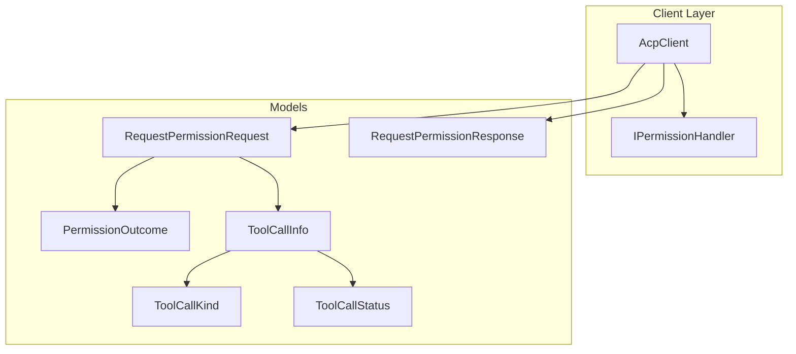
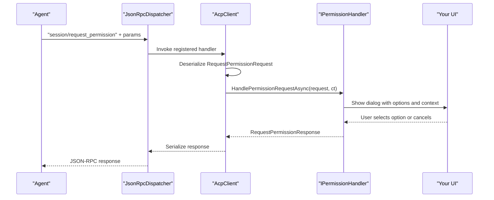
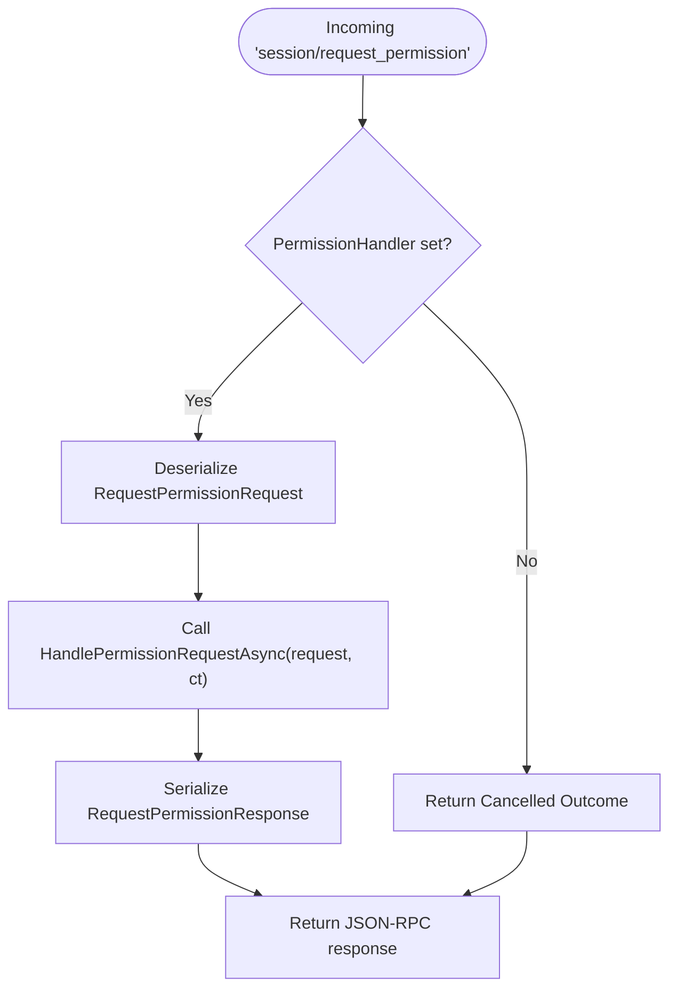
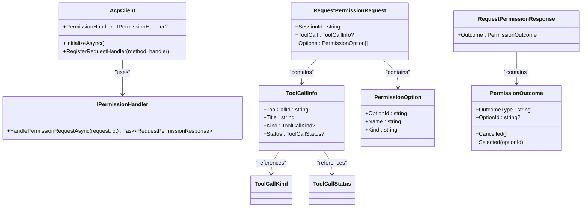

# Permission Handler

<cite>
**Referenced Files in This Document**
- [IPermissionHandler.cs](file://Client/IPermissionHandler.cs)
- [RequestPermissionRequest.cs](file://Models/RequestPermissionRequest.cs)
- [ToolCall.cs](file://Models/ToolCall.cs)
- [AcpClient.cs](file://Client/AcpClient.cs)
- [ToolCallKind.cs](file://Models/Enums/ToolCallKind.cs)
- [ToolCallStatus.cs](file://Models/Enums/ToolCallStatus.cs)
- [README.md](file://README.md)
</cite>

## Table of Contents
1. [Introduction](#introduction)
2. [Project Structure](#project-structure)
3. [Core Components](#core-components)
4. [Architecture Overview](#architecture-overview)
5. [Detailed Component Analysis](#detailed-component-analysis)
6. [Dependency Analysis](#dependency-analysis)
7. [Performance Considerations](#performance-considerations)
8. [Troubleshooting Guide](#troubleshooting-guide)
9. [Conclusion](#conclusion)

## Introduction
This document provides comprehensive documentation for the IPermissionHandler interface and its role in handling security-sensitive permission requests from agents. It explains how the client dispatches session/request_permission requests to your implementation, the data structures involved (RequestPermissionRequest and RequestPermissionResponse), and best practices for building secure, user-friendly permission dialogs.

## Project Structure
The permission flow is implemented across a small set of focused files:
- Client layer defines the handler contract and wires it into the JSON-RPC pipeline.
- Models define the request/response schema and related enums.
- The client registers a handler for "session/request_permission" and invokes your implementation.

**Diagram sources**
- [AcpClient.cs](file://Client/AcpClient.cs)
- [IPermissionHandler.cs](file://Client/IPermissionHandler.cs)
- [RequestPermissionRequest.cs](file://Models/RequestPermissionRequest.cs)
- [ToolCall.cs](file://Models/ToolCall.cs)
- [ToolCallKind.cs](file://Models/Enums/ToolCallKind.cs)
- [ToolCallStatus.cs](file://Models/Enums/ToolCallStatus.cs)

**Section sources**
- [README.md](file://README.md)
- [AcpClient.cs](file://Client/AcpClient.cs)
- [IPermissionHandler.cs](file://Client/IPermissionHandler.cs)

## Core Components
- IPermissionHandler: Defines the single method HandlePermissionRequestAsync that UI implementations must provide to present permission choices to users and return their decision.
- RequestPermissionRequest: Carries the context of the permission request, including session identifier, optional tool call details, and available options.
- RequestPermissionResponse and PermissionOutcome: Describe the result of the user’s decision (e.g., selected option or cancellation).
- ToolCallInfo and related enums: Provide additional context about the operation being requested (kind and status).

Key responsibilities:
- Present clear, actionable information to the user.
- Validate inputs defensively.
- Return a response that accurately reflects the user’s choice.
- Respect cancellation semantics where applicable.

**Section sources**
- [IPermissionHandler.cs](file://Client/IPermissionHandler.cs)
- [RequestPermissionRequest.cs](file://Models/RequestPermissionRequest.cs)
- [ToolCall.cs](file://Models/ToolCall.cs)
- [ToolCallKind.cs](file://Models/Enums/ToolCallKind.cs)
- [ToolCallStatus.cs](file://Models/Enums/ToolCallStatus.cs)

## Architecture Overview
When an agent needs user approval, it sends a JSON-RPC request to the client with method "session/request_permission". The client deserializes the payload and calls your IPermissionHandler implementation. Your implementation should block until the user makes a decision, then return a Response containing the outcome.

**Diagram sources**
- [AcpClient.cs](file://Client/AcpClient.cs)
- [IPermissionHandler.cs](file://Client/IPermissionHandler.cs)
- [RequestPermissionRequest.cs](file://Models/RequestPermissionRequest.cs)

## Detailed Component Analysis

### IPermissionHandler Interface
- Purpose: Allow the UI layer to implement permission prompts for agent-initiated actions.
- Method: HandlePermissionRequestAsync(RequestPermissionRequest, CancellationToken) returns Task<RequestPermissionResponse>.
- Cancellation token: Provided by the caller; implementations should honor it to abort long-running UI operations when appropriate.

Implementation guidance:
- Block until the user responds.
- Use the provided cancellation token to support timely cancellation.
- Always return a valid RequestPermissionResponse with a PermissionOutcome.

**Section sources**
- [IPermissionHandler.cs](file://Client/IPermissionHandler.cs)

### RequestPermissionRequest Model
Fields:
- SessionId: Identifies the current session context.
- ToolCall: Optional metadata about the tool invocation triggering the permission request.
- Options: List of PermissionOption entries representing possible user choices.

PermissionOption fields:
- OptionId: Unique identifier for the option.
- Name: Human-readable label.
- Kind: Category or type hint for the option.

Usage:
- Display each option clearly to the user.
- Map the chosen OptionId back into the response.

**Section sources**
- [RequestPermissionRequest.cs](file://Models/RequestPermissionRequest.cs)

### RequestPermissionResponse and PermissionOutcome
- OutcomeType: Indicates the decision ("selected", "cancelled", etc.).
- OptionId: When OutcomeType is "selected", include the chosen OptionId.

Factory helpers:
- PermissionOutcome.Cancelled(): For cancellations or denials.
- PermissionOutcome.Selected(optionId): For approvals with a specific option.

Best practice:
- Always set OutcomeType explicitly.
- Include OptionId only when selecting an option.

**Section sources**
- [RequestPermissionRequest.cs](file://Models/RequestPermissionRequest.cs)

### ToolCallInfo and Enums
ToolCallInfo:
- ToolCallId: Identifier for the tool call.
- Title: Human-readable title for the action.
- Kind: Enum indicating operation type (read, edit, delete, move, search, execute, think, fetch, other).
- Status: Current status (pending, in_progress, completed, failed).

Enums:
- ToolCallKind: Describes the kind of operation.
- ToolCallStatus: Describes the lifecycle state of the tool call.

Use these fields to enrich the permission prompt with meaningful context.

**Section sources**
- [ToolCall.cs](file://Models/ToolCall.cs)
- [ToolCallKind.cs](file://Models/Enums/ToolCallKind.cs)
- [ToolCallStatus.cs](file://Models/Enums/ToolCallStatus.cs)

### Integration with AcpClient
The client registers a handler for "session/request_permission":
- If no PermissionHandler is set, it returns a default cancelled outcome.
- Otherwise, it deserializes the request and invokes HandlePermissionRequestAsync.
- The returned response is serialized and sent back to the agent.

**Diagram sources**
- [AcpClient.cs](file://Client/AcpClient.cs)

**Section sources**
- [AcpClient.cs](file://Client/AcpClient.cs)

## Dependency Analysis
- AcpClient depends on IPermissionHandler to handle permission requests.
- RequestPermissionRequest composes ToolCallInfo and PermissionOption.
- ToolCallInfo references ToolCallKind and ToolCallStatus enums.
- The client orchestrates serialization/deserialization and delegates decision-making to your handler.

**Diagram sources**
- [AcpClient.cs](file://Client/AcpClient.cs)
- [IPermissionHandler.cs](file://Client/IPermissionHandler.cs)
- [RequestPermissionRequest.cs](file://Models/RequestPermissionRequest.cs)
- [ToolCall.cs](file://Models/ToolCall.cs)
- [ToolCallKind.cs](file://Models/Enums/ToolCallKind.cs)
- [ToolCallStatus.cs](file://Models/Enums/ToolCallStatus.cs)

**Section sources**
- [AcpClient.cs](file://Client/AcpClient.cs)
- [IPermissionHandler.cs](file://Client/IPermissionHandler.cs)
- [RequestPermissionRequest.cs](file://Models/RequestPermissionRequest.cs)
- [ToolCall.cs](file://Models/ToolCall.cs)

## Performance Considerations
- Keep UI interactions responsive: avoid blocking the main thread if you are not already on a UI thread.
- Honor cancellation tokens to prevent unnecessary work when the caller aborts.
- Minimize allocations in hot paths; reuse objects where safe.
- Avoid heavy I/O during permission prompts; precompute display text when possible.

[No sources needed since this section provides general guidance]

## Troubleshooting Guide
Common issues and resolutions:
- No PermissionHandler configured: The client will automatically return a cancelled outcome. Ensure you assign a handler before initialization.
- Invalid OptionId selection: Validate that the selected OptionId exists in the provided Options list.
- Missing or empty fields: Validate SessionId and required fields; log warnings for unexpected payloads.
- Cancellation not respected: Ensure your UI respects the cancellation token and exits promptly.
- Serialization errors: Confirm that your response matches the expected schema (OutcomeType and optional OptionId).

**Section sources**
- [AcpClient.cs](file://Client/AcpClient.cs)
- [RequestPermissionRequest.cs](file://Models/RequestPermissionRequest.cs)

## Conclusion
IPermissionHandler is the bridge between agent-initiated permission requests and your application’s user interface. By implementing HandlePermissionRequestAsync thoughtfully—presenting clear options, validating inputs, honoring cancellation, and returning accurate outcomes—you enable secure, user-driven control over sensitive operations. Follow the patterns and best practices outlined here to build robust permission flows that integrate seamlessly with the ACP client.

[No sources needed since this section summarizes without analyzing specific files]