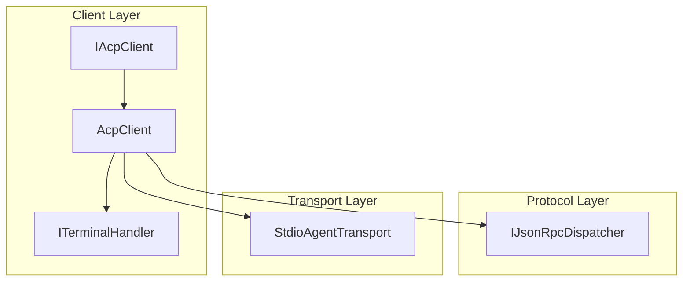
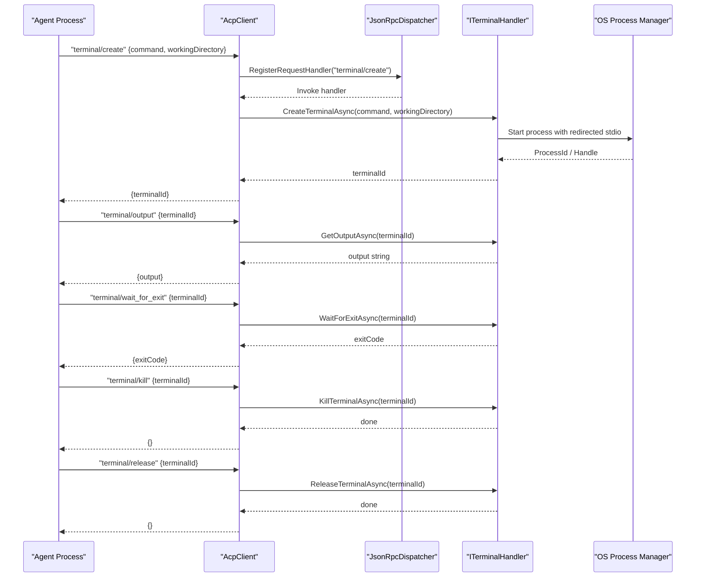
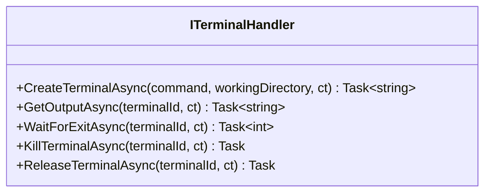
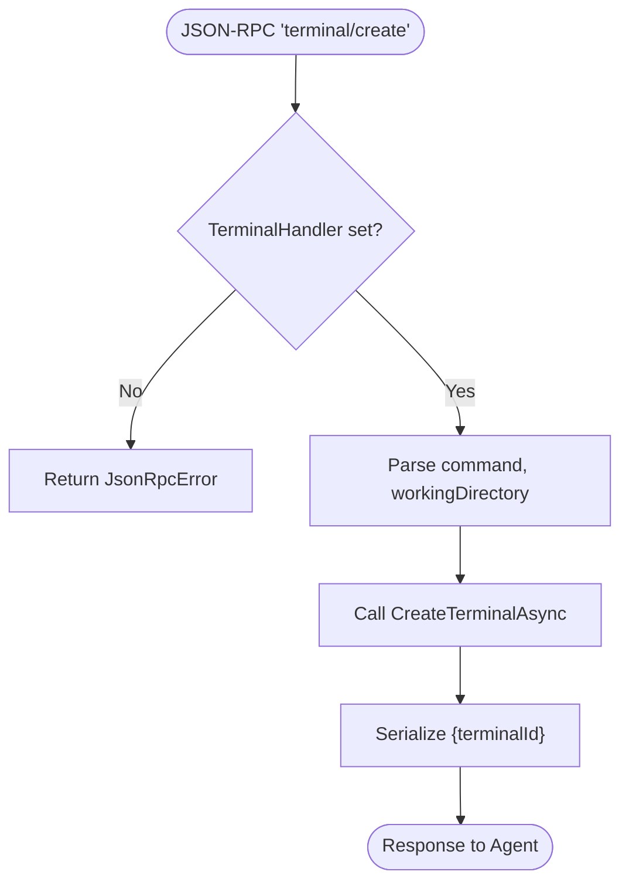
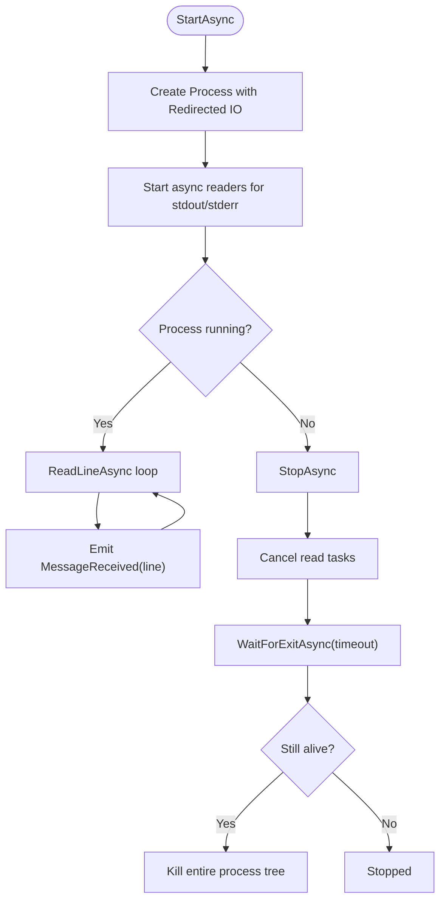
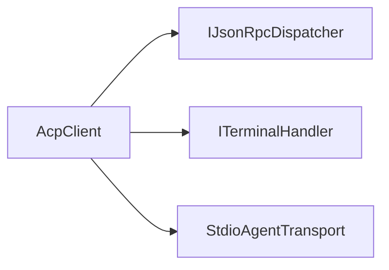

# Terminal Handler

<cite>
**Referenced Files in This Document**
- [ITerminalHandler.cs](file://Client/ITerminalHandler.cs)
- [AcpClient.cs](file://Client/AcpClient.cs)
- [IAcpClient.cs](file://Client/IAcpClient.cs)
- [StdioAgentTransport.cs](file://Transport/StdioAgentTransport.cs)
- [README.md](file://README.md)
</cite>

## Table of Contents
1. [Introduction](#introduction)
2. [Project Structure](#project-structure)
3. [Core Components](#core-components)
4. [Architecture Overview](#architecture-overview)
5. [Detailed Component Analysis](#detailed-component-analysis)
6. [Dependency Analysis](#dependency-analysis)
7. [Performance Considerations](#performance-considerations)
8. [Troubleshooting Guide](#troubleshooting-guide)
9. [Conclusion](#conclusion)

## Introduction
This document provides comprehensive documentation for the ITerminalHandler interface and its role in managing terminal/command execution within the ACP client architecture. It explains how terminal processes are created, monitored, streamed, terminated, and released, with guidance on secure implementation, input validation, error handling, threading, timeouts, and debugging techniques.

## Project Structure
The terminal handler is part of the Client layer and integrates with the JSON-RPC dispatcher to handle terminal-related requests from the agent. The transport layer demonstrates process lifecycle management patterns that can be applied when implementing terminal handlers.

**Diagram sources**
- [AcpClient.cs:250-359](file://Client/AcpClient.cs#L250-L359)
- [IAcpClient.cs:23-24](file://Client/IAcpClient.cs#L23-L24)
- [StdioAgentTransport.cs:30-59](file://Transport/StdioAgentTransport.cs#L30-L59)

**Section sources**
- [README.md:35-51](file://README.md#L35-L51)
- [IAcpClient.cs:23-24](file://Client/IAcpClient.cs#L23-L24)

## Core Components
- ITerminalHandler defines the contract for terminal operations:
  - CreateTerminalAsync: Start a new terminal process and return an identifier.
  - GetOutputAsync: Read available output for a given terminal.
  - WaitForExitAsync: Wait until the terminal process exits and return the exit code.
  - KillTerminalAsync: Terminate the terminal process.
  - ReleaseTerminalAsync: Clean up resources associated with the terminal.

- AcpClient wires JSON-RPC methods to ITerminalHandler:
  - terminal/create → CreateTerminalAsync
  - terminal/output → GetOutputAsync
  - terminal/wait_for_exit → WaitForExitAsync
  - terminal/kill → KillTerminalAsync
  - terminal/release → ReleaseTerminalAsync

- IAcpClient exposes the TerminalHandler property for dependency injection or assignment by the host application.

**Section sources**
- [ITerminalHandler.cs:6-22](file://Client/ITerminalHandler.cs#L6-L22)
- [AcpClient.cs:250-359](file://Client/AcpClient.cs#L250-L359)
- [IAcpClient.cs:23-24](file://Client/IAcpClient.cs#L23-L24)

## Architecture Overview
The ACP client receives JSON-RPC requests from the agent and dispatches them to registered handlers. For terminal operations, AcpClient delegates to the provided ITerminalHandler implementation. The transport layer shows how child processes are started, their stdio streams read asynchronously, and lifecycle events (exit) are propagated.

**Diagram sources**
- [AcpClient.cs:250-359](file://Client/AcpClient.cs#L250-L359)
- [ITerminalHandler.cs:6-22](file://Client/ITerminalHandler.cs#L6-L22)

## Detailed Component Analysis

### ITerminalHandler Interface
- Purpose: Abstracts terminal process lifecycle and I/O streaming for terminal commands invoked by the agent.
- Methods:
  - CreateTerminalAsync(command, workingDirectory, ct): Starts a new process; returns a stable terminalId used by subsequent calls.
  - GetOutputAsync(terminalId, ct): Returns buffered or newly available output since last read.
  - WaitForExitAsync(terminalId, ct): Blocks until the process terminates; returns exit code.
  - KillTerminalAsync(terminalId, ct): Sends termination signal or kills the process tree safely.
  - ReleaseTerminalAsync(terminalId, ct): Releases handles, cancels readers, and frees memory.

Implementation considerations:
- Maintain a registry mapping terminalId to process state (handle, readers, buffers).
- Ensure thread safety for concurrent reads/writes and lifecycle transitions.
- Support cancellation via CancellationToken to avoid hanging operations.
- Validate inputs (command, workingDirectory) before spawning processes.

**Diagram sources**
- [ITerminalHandler.cs:6-22](file://Client/ITerminalHandler.cs#L6-L22)

**Section sources**
- [ITerminalHandler.cs:6-22](file://Client/ITerminalHandler.cs#L6-L22)

### AcpClient Integration
- AcpClient registers request handlers for terminal/* methods during initialization.
- Each handler extracts parameters from the JSON-RPC request and invokes the corresponding ITerminalHandler method.
- Errors are returned as JsonRpcError when the handler is not set.

Key behaviors:
- If TerminalHandler is null, responses include an error indicating unavailability.
- Parameters are parsed from JSON properties (e.g., command, workingDirectory, terminalId).
- Responses serialize results back to JSON elements.

**Diagram sources**
- [AcpClient.cs:250-274](file://Client/AcpClient.cs#L250-L274)

**Section sources**
- [AcpClient.cs:250-359](file://Client/AcpClient.cs#L250-L359)

### Transport Patterns for Process Lifecycle
StdioAgentTransport demonstrates robust process management:
- Starts a child process with redirected stdio.
- Reads stdout and stderr asynchronously using tasks and cancellation tokens.
- Handles graceful shutdown with timeout and forced kill if necessary.
- Emits ProcessExited event with exit code.

These patterns inform how a terminal handler should manage spawned processes:
- Use ProcessStartInfo with redirection and no shell execution.
- Run background readers for stdout/stderr.
- Implement safe termination with timeouts and escalation to force kill.
- Propagate exit codes and errors appropriately.

**Diagram sources**
- [StdioAgentTransport.cs:30-93](file://Transport/StdioAgentTransport.cs#L30-L93)
- [StdioAgentTransport.cs:95-135](file://Transport/StdioAgentTransport.cs#L95-L135)

**Section sources**
- [StdioAgentTransport.cs:30-93](file://Transport/StdioAgentTransport.cs#L30-L93)
- [StdioAgentTransport.cs:95-135](file://Transport/StdioAgentTransport.cs#L95-L135)

## Dependency Analysis
- AcpClient depends on IJsonRpcDispatcher to route JSON-RPC messages to handlers.
- AcpClient holds a reference to ITerminalHandler for terminal operations.
- StdioAgentTransport illustrates how to interact with OS processes and stream I/O.

**Diagram sources**
- [AcpClient.cs:250-359](file://Client/AcpClient.cs#L250-L359)
- [StdioAgentTransport.cs:30-59](file://Transport/StdioAgentTransport.cs#L30-L59)

**Section sources**
- [AcpClient.cs:250-359](file://Client/AcpClient.cs#L250-L359)
- [StdioAgentTransport.cs:30-59](file://Transport/StdioAgentTransport.cs#L30-L59)

## Performance Considerations
- Streaming I/O: Use asynchronous readers and avoid blocking threads. Buffer output incrementally to prevent large allocations.
- Cancellation: Honor CancellationToken in all long-running operations to support responsive UI and timely cleanup.
- Resource Management: Ensure ReleaseTerminalAsync closes handles, cancels tasks, and clears caches to prevent leaks.
- Concurrency: Protect shared state (process map, buffers) with appropriate synchronization primitives.
- Backpressure: Limit buffer sizes and implement flow control to avoid memory growth under high output volume.

[No sources needed since this section provides general guidance]

## Troubleshooting Guide
Common issues and remedies:
- Terminal handler not available: Ensure TerminalHandler is assigned before InitializeAsync.
- Command injection risks: Validate and sanitize command strings; prefer allowlists and parameterization.
- Hanging waits: Implement timeouts in WaitForExitAsync and KillTerminalAsync; escalate to force kill if needed.
- Output not received: Verify stdout redirection and reader loops; check encoding settings.
- Process isolation: Use non-elevated contexts where possible; restrict working directory and environment variables.
- Debugging: Log start/stop events, exit codes, and exceptions; capture stderr for diagnostics.

**Section sources**
- [AcpClient.cs:250-359](file://Client/AcpClient.cs#L250-L359)
- [StdioAgentTransport.cs:95-135](file://Transport/StdioAgentTransport.cs#L95-L135)

## Conclusion
ITerminalHandler provides a clean abstraction for executing and managing terminal processes in response to agent requests. By following the patterns shown in StdioAgentTransport—secure process creation, asynchronous I/O streaming, robust lifecycle management, and clear error propagation—you can build a reliable and secure terminal handler. Always validate inputs, enforce timeouts, isolate processes, and release resources promptly to ensure stability and security.

[No sources needed since this section summarizes without analyzing specific files]