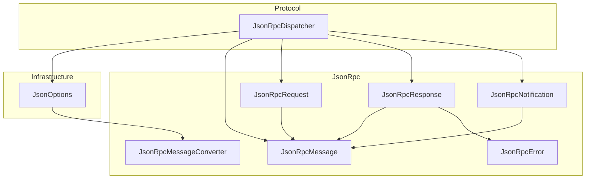
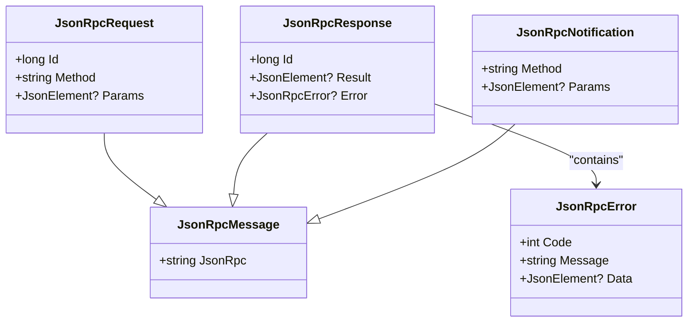
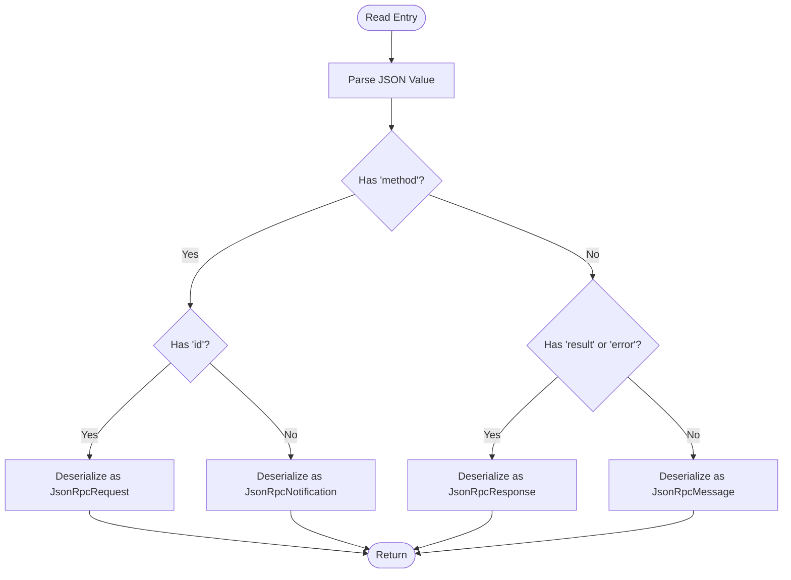
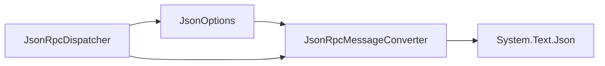

# JSON-RPC Types

<cite>
**Referenced Files in This Document**
- [JsonRpcMessage.cs](file://JsonRpc/JsonRpcMessage.cs)
- [JsonRpcRequest.cs](file://JsonRpc\JsonRpcRequest.cs)
- [JsonRpcResponse.cs](file://JsonRpc\JsonRpcResponse.cs)
- [JsonRpcNotification.cs](file://JsonRpc\JsonRpcNotification.cs)
- [JsonRpcError.cs](file://JsonRpc\JsonRpcError.cs)
- [JsonRpcMessageConverter.cs](file://JsonRpc\JsonRpcMessageConverter.cs)
- [JsonOptions.cs](file://Infrastructure\JsonOptions.cs)
- [JsonRpcDispatcher.cs](file://Protocol\JsonRpcDispatcher.cs)
- [README.md](file://README.md)
</cite>

## Table of Contents
1. [Introduction](#introduction)
2. [Project Structure](#project-structure)
3. [Core Components](#core-components)
4. [Architecture Overview](#architecture-overview)
5. [Detailed Component Analysis](#detailed-component-analysis)
6. [Dependency Analysis](#dependency-analysis)
7. [Performance Considerations](#performance-considerations)
8. [Troubleshooting Guide](#troubleshooting-guide)
9. [Conclusion](#conclusion)

## Introduction
This document explains the JSON-RPC 2.0 message types and serialization used by the library. It covers the base JsonRpcMessage class and its derived types (JsonRpcRequest, JsonRpcResponse, JsonRpcNotification), the error model (JsonRpcError), and the polymorphic deserialization mechanism implemented by JsonRpcMessageConverter. It also details property mappings, validation rules, extensibility patterns for custom message types, error handling conventions, and performance considerations for large payloads.

## Project Structure
The JSON-RPC implementation is organized into focused components:
- Message models under JsonRpc define the core JSON-RPC structures.
- A converter implements polymorphic deserialization based on field presence.
- Infrastructure provides shared JsonSerializerOptions that register the converter and other global settings.
- Protocol contains the dispatcher that uses these options to serialize/deserialize messages over a transport.



**Diagram sources**
- [JsonRpcMessage.cs](file://JsonRpc/JsonRpcMessage.cs)
- [JsonRpcRequest.cs](file://JsonRpc\JsonRpcRequest.cs)
- [JsonRpcResponse.cs](file://JsonRpc\JsonRpcResponse.cs)
- [JsonRpcNotification.cs](file://JsonRpc\JsonRpcNotification.cs)
- [JsonRpcError.cs](file://JsonRpc\JsonRpcError.cs)
- [JsonRpcMessageConverter.cs](file://JsonRpc\JsonRpcMessageConverter.cs)
- [JsonOptions.cs](file://Infrastructure\JsonOptions.cs)
- [JsonRpcDispatcher.cs](file://Protocol\JsonRpcDispatcher.cs)

**Section sources**
- [JsonRpcMessage.cs](file://JsonRpc/JsonRpcMessage.cs)
- [JsonRpcRequest.cs](file://JsonRpc\JsonRpcRequest.cs)
- [JsonRpcResponse.cs](file://JsonRpc\JsonRpcResponse.cs)
- [JsonRpcNotification.cs](file://JsonRpc\JsonRpcNotification.cs)
- [JsonRpcError.cs](file://JsonRpc\JsonRpcError.cs)
- [JsonRpcMessageConverter.cs](file://JsonRpc\JsonRpcMessageConverter.cs)
- [JsonOptions.cs](file://Infrastructure\JsonOptions.cs)
- [JsonRpcDispatcher.cs](file://Protocol\JsonRpcDispatcher.cs)

## Core Components
- JsonRpcMessage: Base type with the jsonrpc version field set to "2.0".
- JsonRpcRequest: Contains id, method, and optional params serialized as JsonElement.
- JsonRpcResponse: Contains id, and either result or error; both are optional and omitted when null.
- JsonRpcNotification: Contains method and optional params; no id.
- JsonRpcError: Contains code, message, and optional data.

Property mapping and behavior:
- All properties use System.Text.Json attributes for property names and null-skip serialization.
- Params, Result, Error, and Data are nullable and skipped when null during write.
- The base jsonrpc field defaults to "2.0".

Validation rules:
- Requests must have id and method.
- Notifications must have method and no id.
- Responses must have id and exactly one of result or error.

Serialization strategy:
- Uses System.Text.Json with a custom converter to determine the concrete type at runtime based on field presence.

**Section sources**
- [JsonRpcMessage.cs](file://JsonRpc/JsonRpcMessage.cs)
- [JsonRpcRequest.cs](file://JsonRpc\JsonRpcRequest.cs)
- [JsonRpcResponse.cs](file://JsonRpc\JsonRpcResponse.cs)
- [JsonRpcNotification.cs](file://JsonRpc\JsonRpcNotification.cs)
- [JsonRpcError.cs](file://JsonRpc\JsonRpcError.cs)

## Architecture Overview
The system leverages a single JsonRpcMessageConverter to deserialize any incoming JSON-RPC payload into the correct strongly-typed message. The dispatcher wires this converter via shared JsonSerializerOptions and orchestrates request/response flows over a transport.

```mermaid
sequenceDiagram
participant App as "Application"
participant Disp as "JsonRpcDispatcher"
participant Opt as "JsonOptions"
participant Conv as "JsonRpcMessageConverter"
participant Trans as "Transport"
App->>Disp : SendRequestAsync(method, params)
Disp->>Opt : Get Default Options
Opt-->>Disp : Options with Converter
Disp->>Disp : Build JsonRpcRequest
Disp->>Trans : Serialize(request) + Send
Trans-->>Disp : OnMessageReceived(jsonLine)
Disp->>Conv : Deserialize<JsonRpcMessage>(jsonLine)
Conv-->>Disp : Concrete message (Request/Response/Notification/Base)
alt Response
Disp->>Disp : Complete pending request with Id
else Request
Disp->>Disp : Invoke registered handler
Disp->>Trans : Serialize(JsonRpcResponse) + Send
else Notification
Disp->>Disp : Invoke notification handler
end
```

**Diagram sources**
- [JsonRpcDispatcher.cs](file://Protocol\JsonRpcDispatcher.cs)
- [JsonOptions.cs](file://Infrastructure\JsonOptions.cs)
- [JsonRpcMessageConverter.cs](file://JsonRpc\JsonRpcMessageConverter.cs)

## Detailed Component Analysis

### JsonRpcMessage and Derived Types
- JsonRpcMessage defines the common jsonrpc field.
- JsonRpcRequest adds id, method, and optional params.
- JsonRpcResponse adds id and mutually exclusive result/error fields.
- JsonRpcNotification adds method and optional params without id.
- JsonRpcError defines code, message, and optional data.



**Diagram sources**
- [JsonRpcMessage.cs](file://JsonRpc/JsonRpcMessage.cs)
- [JsonRpcRequest.cs](file://JsonRpc\JsonRpcRequest.cs)
- [JsonRpcResponse.cs](file://JsonRpc\JsonRpcResponse.cs)
- [JsonRpcNotification.cs](file://JsonRpc\JsonRpcNotification.cs)
- [JsonRpcError.cs](file://JsonRpc\JsonRpcError.cs)

**Section sources**
- [JsonRpcMessage.cs](file://JsonRpc/JsonRpcMessage.cs)
- [JsonRpcRequest.cs](file://JsonRpc\JsonRpcRequest.cs)
- [JsonRpcResponse.cs](file://JsonRpc\JsonRpcResponse.cs)
- [JsonRpcNotification.cs](file://JsonRpc\JsonRpcNotification.cs)
- [JsonRpcError.cs](file://JsonRpc\JsonRpcError.cs)

### Polymorphic Deserialization with JsonRpcMessageConverter
The converter inspects the raw JSON object to decide the target type:
- If both method and id exist → JsonRpcRequest
- If method exists but not id → JsonRpcNotification
- If result or error exists → JsonRpcResponse
- Otherwise → base JsonRpcMessage

It avoids recursion by stripping itself from inner options before deserializing nested content.



**Diagram sources**
- [JsonRpcMessageConverter.cs](file://JsonRpc\JsonRpcMessageConverter.cs)

**Section sources**
- [JsonRpcMessageConverter.cs](file://JsonRpc\JsonRpcMessageConverter.cs)

### Dispatcher Integration and Usage Patterns
The dispatcher:
- Registers handlers for requests and notifications by method name.
- Serializes outgoing messages using shared options that include the converter.
- Deserializes incoming messages to the appropriate type and routes them.

```mermaid
sequenceDiagram
participant Client as "Client Code"
participant Disp as "JsonRpcDispatcher"
participant Opt as "JsonOptions"
participant Conv as "JsonRpcMessageConverter"
participant Transport as "IAgentTransport"
Client->>Disp : RegisterRequestHandler("method", handler)
Client->>Disp : RegisterNotificationHandler("notify", handler)
Client->>Disp : Connect(transport)
Client->>Disp : SendRequestAsync("method", params)
Disp->>Opt : Use Default Options
Disp->>Transport : Send(serialized request)
Transport-->>Disp : OnMessageReceived(jsonLine)
Disp->>Conv : Deserialize(jsonLine)
Conv-->>Disp : JsonRpcResponse
Disp-->>Client : Complete pending request with response
```

**Diagram sources**
- [JsonRpcDispatcher.cs](file://Protocol\JsonRpcDispatcher.cs)
- [JsonOptions.cs](file://Infrastructure\JsonOptions.cs)
- [JsonRpcMessageConverter.cs](file://JsonRpc\JsonRpcMessageConverter.cs)

**Section sources**
- [JsonRpcDispatcher.cs](file://Protocol\JsonRpcDispatcher.cs)
- [JsonOptions.cs](file://Infrastructure\JsonOptions.cs)

### Extending the Converter and Custom Message Types
To support specialized scenarios:
- Create new message types inheriting from JsonRpcMessage or implementing your own contract.
- Extend JsonRpcMessageConverter.Read to recognize additional field combinations or discriminators.
- Update Write to handle new types explicitly if needed.
- Ensure JsonSerializerOptions includes your updated converter.

Example extension pattern:
- Add detection logic for a new discriminator field in Read.
- Return the appropriate derived type instance.
- Wire the updated converter into JsonOptions.Default or pass custom options to serializers.

[No sources needed since this section describes general extension patterns]

### Error Handling Patterns and Status Codes
- Errors are represented by JsonRpcError with code, message, and optional data.
- Responses carry either a successful result or an error object.
- The dispatcher currently ignores exceptions during deserialization or handler execution; consider surfacing diagnostics in production systems.

Recommended practices:
- Populate JsonRpcError.Code with standard JSON-RPC error codes where applicable.
- Include diagnostic information in JsonRpcError.Data for rich context.
- Log errors centrally in the dispatcher or transport layer for observability.

**Section sources**
- [JsonRpcError.cs](file://JsonRpc\JsonRpcError.cs)
- [JsonRpcResponse.cs](file://JsonRpc\JsonRpcResponse.cs)
- [JsonRpcDispatcher.cs](file://Protocol\JsonRpcDispatcher.cs)

## Dependency Analysis
Key dependencies:
- JsonRpcMessageConverter depends on System.Text.Json APIs and inspects raw JSON structure.
- JsonOptions registers the converter globally and configures case-insensitivity and null-skip behavior.
- JsonRpcDispatcher depends on JsonOptions for consistent serialization/deserialization across the protocol layer.



**Diagram sources**
- [JsonRpcMessageConverter.cs](file://JsonRpc\JsonRpcMessageConverter.cs)
- [JsonOptions.cs](file://Infrastructure\JsonOptions.cs)
- [JsonRpcDispatcher.cs](file://Protocol\JsonRpcDispatcher.cs)

**Section sources**
- [JsonRpcMessageConverter.cs](file://JsonRpc\JsonRpcMessageConverter.cs)
- [JsonOptions.cs](file://Infrastructure\JsonOptions.cs)
- [JsonRpcDispatcher.cs](file://Protocol\JsonRpcDispatcher.cs)

## Performance Considerations
- Use JsonElement for params/result/data to avoid unnecessary object allocations and parsing overhead for complex payloads.
- Prefer streaming where possible; however, the current converter parses the entire JSON value into a JsonDocument for inspection. For very large messages, consider optimizing the converter to stream-parse only necessary fields.
- Reuse JsonSerializerOptions instances (as done via JsonOptions.Default) to avoid repeated converter registration and configuration costs.
- Avoid writing indented JSON; ensure WriteIndented is false for network payloads.
- Minimize allocations by reusing buffers and avoiding intermediate string conversions when serializing large payloads.

[No sources needed since this section provides general guidance]

## Troubleshooting Guide
Common issues and resolutions:
- Unexpected message type: Verify field presence (method/id/result/error) matches expected patterns.
- Null fields omitted: Confirm that WhenWritingNull is configured and that you expect nulls to be absent.
- Handler not invoked: Ensure the method name matches exactly and handlers are registered before receiving messages.
- Exceptions swallowed: Review dispatcher’s exception handling; add logging or propagate errors for better diagnostics.

Operational tips:
- Inspect raw JSON lines received by the transport to validate wire format.
- Validate server-side responses include either result or error, not both.
- Use structured logging around deserialization and handler invocation to capture failures.

**Section sources**
- [JsonRpcDispatcher.cs](file://Protocol\JsonRpcDispatcher.cs)
- [JsonOptions.cs](file://Infrastructure\JsonOptions.cs)

## Conclusion
The JSON-RPC implementation provides a clean, extensible foundation for building ACP-compliant clients and servers. The base message types and converter enable robust polymorphic deserialization based on field presence, while shared options ensure consistent serialization behavior. For advanced scenarios, extend the converter and leverage JsonElement to handle complex payloads efficiently. Adopt strong error modeling and observability practices to maintain reliability and performance at scale.