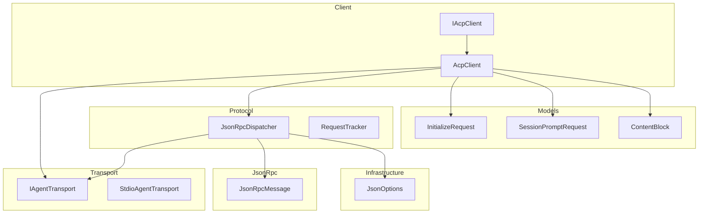
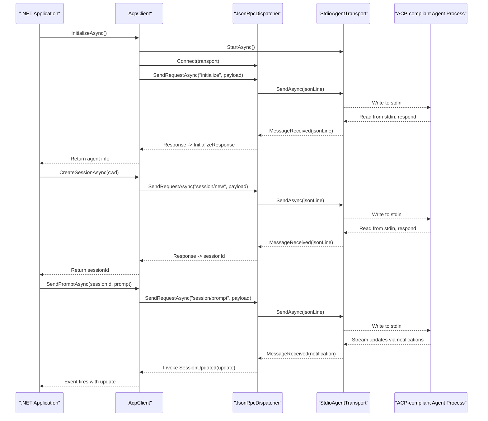
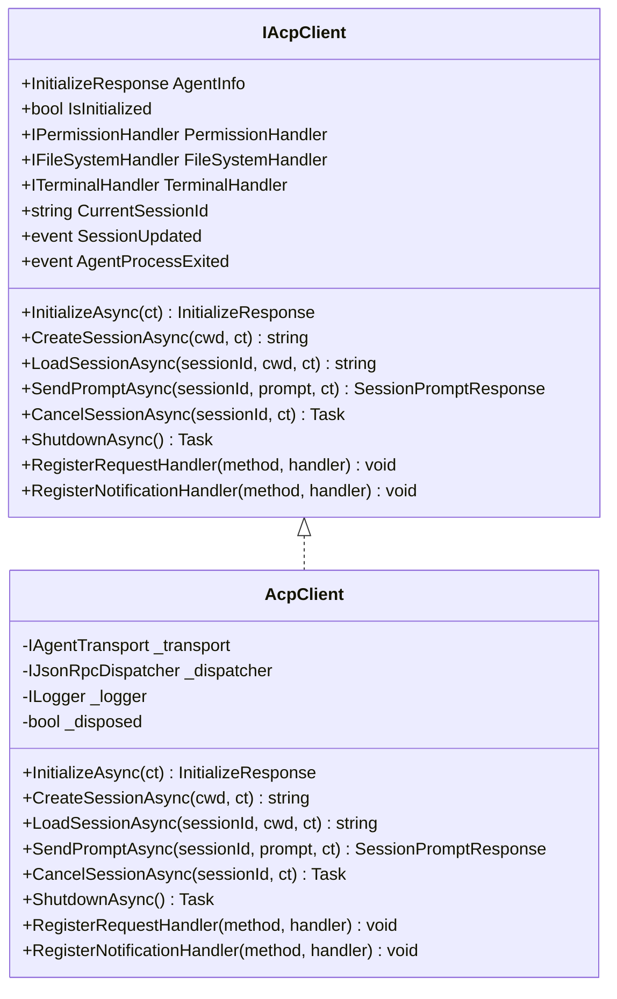
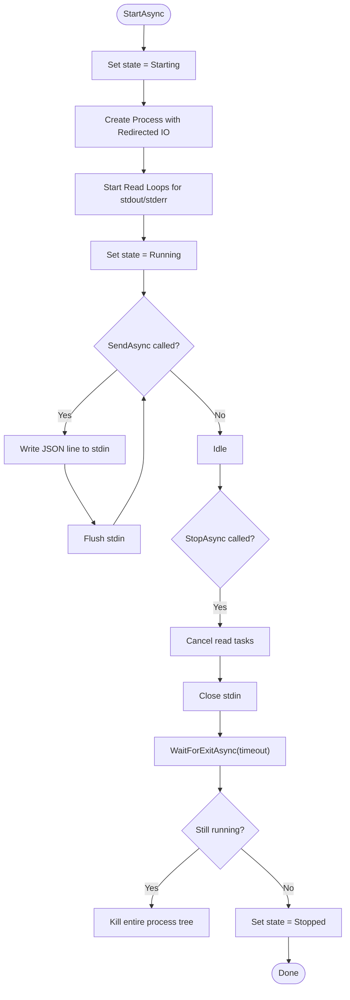
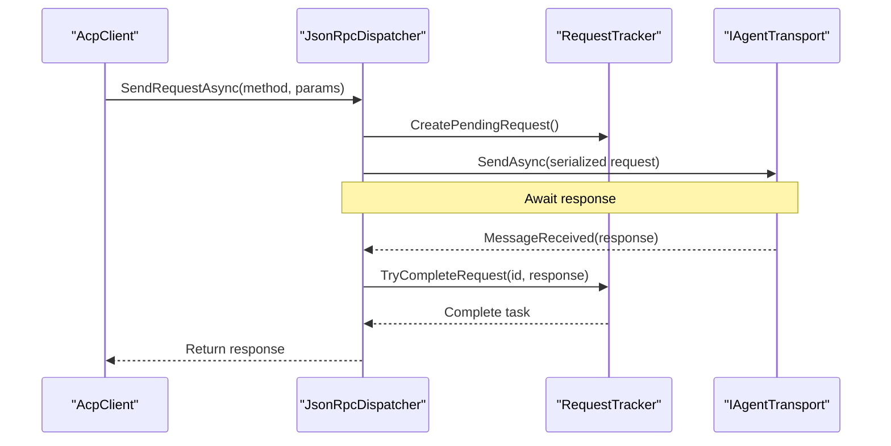
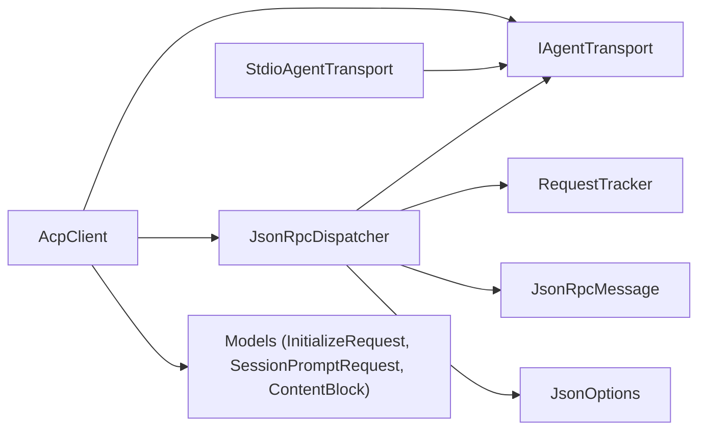

# Project Overview

<cite>
**Referenced Files in This Document**
- [README.md](file://README.md)
- [Agentic.ACPLibrary.csproj](file://Agentic.ACPLibrary.csproj)
- [Client/AcpClient.cs](file://Client/AcpClient.cs)
- [Client/IAcpClient.cs](file://Client/IAcpClient.cs)
- [Transport/StdioAgentTransport.cs](file://Transport/StdioAgentTransport.cs)
- [Transport/IAgentTransport.cs](file://Transport/IAgentTransport.cs)
- [Protocol/JsonRpcDispatcher.cs](file://Protocol/JsonRpcDispatcher.cs)
- [JsonRpc/JsonRpcMessage.cs](file://JsonRpc/JsonRpcMessage.cs)
- [Infrastructure/JsonOptions.cs](file://Infrastructure/JsonOptions.cs)
- [Models/InitializeRequest.cs](file://Models/InitializeRequest.cs)
- [Models/SessionPromptRequest.cs](file://Models/SessionPromptRequest.cs)
- [Models/ContentBlock.cs](file://Models/ContentBlock.cs)
</cite>

## Table of Contents
1. [Introduction](#introduction)
2. [Project Structure](#project-structure)
3. [Core Components](#core-components)
4. [Architecture Overview](#architecture-overview)
5. [Detailed Component Analysis](#detailed-component-analysis)
6. [Dependency Analysis](#dependency-analysis)
7. [Performance Considerations](#performance-considerations)
8. [Troubleshooting Guide](#troubleshooting-guide)
9. [Conclusion](#conclusion)

## Introduction
Agentic.ACPLibrary is a .NET client library for the Agent Client Protocol (ACP). It enables .NET applications to communicate with ACP-compliant agents using JSON-RPC messaging over stdio transport. The library abstracts process lifecycle, message serialization, request/response tracking, and event-driven streaming updates so developers can focus on building agent-integrated features rather than low-level protocol details.

Key value propositions:
- Standardized communication with ACP-compliant agents via JSON-RPC 2.0
- Simple stdio-based transport that launches and manages an external agent process
- Extensible handler interfaces for permissions, file system access, and terminal operations
- Streaming session updates through events for real-time interaction

Conceptual overview for beginners:
- An ACP-compliant agent is any process that speaks the Agent Client Protocol. Your .NET app uses this library to start the agent, perform a handshake, create sessions, send prompts, and receive streaming updates.
- JSON-RPC messaging is a lightweight remote procedure call format over text lines. Each line is a JSON object representing a request, response, or notification.
- Stdio transport means the library communicates with the agent by writing to its standard input and reading from its standard output.

Technical overview for experienced .NET developers:
- The library implements a layered architecture: Transport (stdio), Protocol (JSON-RPC dispatcher), Client (session and prompt orchestration), and Models (protocol data contracts).
- It leverages System.Text.Json with custom converters and polymorphic serialization for content blocks and JSON-RPC messages.
- Dependency injection-friendly abstractions allow swapping transports and dispatchers for testing or alternative implementations.

[No sources needed since this section provides general guidance]

## Project Structure
The project follows a clear separation of concerns:
- Client: High-level API for initializing, session management, prompting, and extensibility hooks
- Transport: Abstraction and stdio implementation for process-based communication
- Protocol: JSON-RPC 2.0 dispatcher and request tracking
- JsonRpc: Core message types and converters
- Models: ACP protocol models including initialize, session, content blocks, and tool calls
- Infrastructure: Shared configuration such as JsonSerializerOptions

**Diagram sources**
- [Client/IAcpClient.cs:1-59](file://Client/IAcpClient.cs#L1-L59)
- [Client/AcpClient.cs:1-361](file://Client/AcpClient.cs#L1-L361)
- [Transport/IAgentTransport.cs:1-39](file://Transport/IAgentTransport.cs#L1-L39)
- [Transport/StdioAgentTransport.cs:1-147](file://Transport/StdioAgentTransport.cs#L1-L147)
- [Protocol/JsonRpcDispatcher.cs:1-124](file://Protocol/JsonRpcDispatcher.cs#L1-L124)
- [JsonRpc/JsonRpcMessage.cs:1-14](file://JsonRpc/JsonRpcMessage.cs#L1-L14)
- [Models/InitializeRequest.cs:1-16](file://Models/InitializeRequest.cs#L1-L16)
- [Models/SessionPromptRequest.cs:1-20](file://Models/SessionPromptRequest.cs#L1-L20)
- [Models/ContentBlock.cs:1-79](file://Models/ContentBlock.cs#L1-L79)
- [Infrastructure/JsonOptions.cs:1-28](file://Infrastructure/JsonOptions.cs#L1-L28)

**Section sources**
- [README.md:1-99](file://README.md#L1-L99)
- [Agentic.ACPLibrary.csproj:1-34](file://Agentic.ACPLibrary.csproj#L1-L34)

## Core Components
- IAcpClient and AcpClient: Define and implement the high-level client contract for initialization, session creation/loading, sending prompts, cancellation, shutdown, and extensibility via custom handlers.
- IAgentTransport and StdioAgentTransport: Abstract transport mechanics; StdioAgentTransport launches a child process, reads stdout/stderr, writes JSON lines to stdin, and exposes events for messages and process exit.
- JsonRpcDispatcher: Implements JSON-RPC 2.0 request/response/notification routing, tracks pending requests, and deserializes incoming messages to invoke registered handlers.
- JsonRpcMessage and related types: Base message type and specialized request/response/notification structures used across the protocol layer.
- Models: Strongly-typed ACP payloads like InitializeRequest, SessionPromptRequest, ContentBlock hierarchy, and enums for tool calls and stop reasons.
- Infrastructure: Centralized JsonSerializerOptions with case-insensitive property names, null-ignore behavior, and custom converters for JSON-RPC messages and enums.

Practical examples demonstrating core value:
- InitializeAsync starts the transport, performs the initialize handshake, and returns agent info.
- CreateSessionAsync creates a new session in a working directory.
- SendPromptAsync sends a prompt and streams updates via SessionUpdated events.
- RegisterRequestHandler/RegisterNotificationHandler enable extending the protocol with custom methods.

**Section sources**
- [Client/IAcpClient.cs:1-59](file://Client/IAcpClient.cs#L1-L59)
- [Client/AcpClient.cs:1-361](file://Client/AcpClient.cs#L1-L361)
- [Transport/IAgentTransport.cs:1-39](file://Transport/IAgentTransport.cs#L1-L39)
- [Transport/StdioAgentTransport.cs:1-147](file://Transport/StdioAgentTransport.cs#L1-L147)
- [Protocol/JsonRpcDispatcher.cs:1-124](file://Protocol/JsonRpcDispatcher.cs#L1-L124)
- [JsonRpc/JsonRpcMessage.cs:1-14](file://JsonRpc/JsonRpcMessage.cs#L1-L14)
- [Models/InitializeRequest.cs:1-16](file://Models/InitializeRequest.cs#L1-L16)
- [Models/SessionPromptRequest.cs:1-20](file://Models/SessionPromptRequest.cs#L1-L20)
- [Models/ContentBlock.cs:1-79](file://Models/ContentBlock.cs#L1-L79)
- [Infrastructure/JsonOptions.cs:1-28](file://Infrastructure/JsonOptions.cs#L1-L28)

## Architecture Overview
The library implements a clean separation between transport, protocol, and client layers. The stdio transport manages a child process and IO streams. The JSON-RPC dispatcher serializes and routes messages, tracks requests, and invokes handlers. The client orchestrates ACP workflows like initialization, session management, and prompting while exposing events for streaming updates.

**Diagram sources**
- [Client/AcpClient.cs:47-182](file://Client/AcpClient.cs#L47-L182)
- [Protocol/JsonRpcDispatcher.cs:27-64](file://Protocol/JsonRpcDispatcher.cs#L27-L64)
- [Transport/StdioAgentTransport.cs:30-68](file://Transport/StdioAgentTransport.cs#L30-L68)
- [Models/InitializeRequest.cs:1-16](file://Models/InitializeRequest.cs#L1-L16)
- [Models/SessionPromptRequest.cs:1-20](file://Models/SessionPromptRequest.cs#L1-L20)

## Detailed Component Analysis

### AcpClient and IAcpClient
Responsibilities:
- Lifecycle: InitializeAsync starts transport, connects dispatcher, registers built-in handlers, performs handshake, and stores agent info.
- Sessions: CreateSessionAsync and LoadSessionAsync manage current session context.
- Prompts: SendPromptAsync sends prompts and relies on SessionUpdated events for streaming updates.
- Cancellation: CancelSessionAsync sends a session/cancel notification.
- Shutdown: ShutdownAsync disconnects and stops transport.
- Extensibility: RegisterRequestHandler and RegisterNotificationHandler allow custom method handling.

Key behaviors:
- Built-in handlers for session/request_permission, fs/read_text_file, fs/write_text_file, and terminal/* are wired during initialization.
- Events: SessionUpdated fires for each session/update notification; AgentProcessExited fires when the underlying process terminates.

**Diagram sources**
- [Client/IAcpClient.cs:1-59](file://Client/IAcpClient.cs#L1-L59)
- [Client/AcpClient.cs:1-361](file://Client/AcpClient.cs#L1-L361)

**Section sources**
- [Client/IAcpClient.cs:1-59](file://Client/IAcpClient.cs#L1-L59)
- [Client/AcpClient.cs:1-361](file://Client/AcpClient.cs#L1-L361)

### Transport Layer: IAgentTransport and StdioAgentTransport
Responsibilities:
- StartAsync launches a child process with redirected stdin/stdout/stderr and begins async read loops.
- SendAsync writes JSON lines to the process’s standard input.
- StopAsync gracefully shuts down by canceling read tasks, closing stdin, waiting for exit, and killing if necessary.
- Events: MessageReceived emits raw JSON lines; TransportFaulted reports errors; ProcessExited reports termination codes.

Implementation highlights:
- UTF-8 encoding for standard streams ensures consistent JSON parsing.
- State machine transitions: Created → Starting → Running → Stopping → Stopped.
- Robust error handling: OperationCanceledException treated as normal shutdown; other exceptions forwarded via TransportFaulted.

**Diagram sources**
- [Transport/StdioAgentTransport.cs:30-93](file://Transport/StdioAgentTransport.cs#L30-L93)
- [Transport/IAgentTransport.cs:1-39](file://Transport/IAgentTransport.cs#L1-L39)

**Section sources**
- [Transport/IAgentTransport.cs:1-39](file://Transport/IAgentTransport.cs#L1-L39)
- [Transport/StdioAgentTransport.cs:1-147](file://Transport/StdioAgentTransport.cs#L1-L147)

### Protocol Layer: JsonRpcDispatcher and Request Tracking
Responsibilities:
- Serialize outgoing requests/notifications and send them via transport.
- Deserialize incoming messages and route to appropriate handlers.
- Track pending requests and complete them when responses arrive.
- Provide extension points for custom request/notification handlers.

Key behaviors:
- Uses IRequestTracker to correlate requests with responses via unique IDs.
- Supports both request-response and fire-and-forget notifications.
- Gracefully ignores malformed messages or handler exceptions without crashing.

**Diagram sources**
- [Protocol/JsonRpcDispatcher.cs:27-64](file://Protocol/JsonRpcDispatcher.cs#L27-L64)
- [Protocol/JsonRpcDispatcher.cs:86-122](file://Protocol/JsonRpcDispatcher.cs#L86-L122)

**Section sources**
- [Protocol/JsonRpcDispatcher.cs:1-124](file://Protocol/JsonRpcDispatcher.cs#L1-L124)

### JSON-RPC Messaging and Serialization
Responsibilities:
- Define base JsonRpcMessage with jsonrpc version field.
- Use System.Text.Json with shared JsonOptions for consistent serialization settings.
- Support polymorphic content blocks via type discriminators.

Key behaviors:
- Case-insensitive property names and null-ignore conditions reduce payload size and improve compatibility.
- Custom converter for JSON-RPC messages ensures correct deserialization of request/response/notification variants.
- Enums serialized as strings for readability and interoperability.

**Section sources**
- [JsonRpc/JsonRpcMessage.cs:1-14](file://JsonRpc/JsonRpcMessage.cs#L1-L14)
- [Infrastructure/JsonOptions.cs:1-28](file://Infrastructure/JsonOptions.cs#L1-L28)
- [Models/ContentBlock.cs:1-79](file://Models/ContentBlock.cs#L1-L79)

### Models: Initialize and Session Payloads
Responsibilities:
- InitializeRequest carries protocol version, client capabilities, and client info.
- SessionPromptRequest contains session ID and prompt content blocks.
- ContentBlock hierarchy supports text, image, audio, resource, and resource link types with polymorphic serialization.

Key behaviors:
- Polymorphic serialization allows unknown derived types to fall back to base type, ensuring forward compatibility with evolving agent implementations.
- Strongly-typed enums for stop reasons and tool call metadata.

**Section sources**
- [Models/InitializeRequest.cs:1-16](file://Models/InitializeRequest.cs#L1-L16)
- [Models/SessionPromptRequest.cs:1-20](file://Models/SessionPromptRequest.cs#L1-L20)
- [Models/ContentBlock.cs:1-79](file://Models/ContentBlock.cs#L1-L79)

## Dependency Analysis
High-level dependencies:
- AcpClient depends on IAgentTransport and IJsonRpcDispatcher for communication and protocol handling.
- JsonRpcDispatcher depends on IAgentTransport for IO and IRequestTracker for correlation.
- StdioAgentTransport depends on System.Diagnostics.Process for process management.
- Models depend on System.Text.Json attributes for serialization.
- Infrastructure centralizes JsonSerializerOptions used across layers.

**Diagram sources**
- [Client/AcpClient.cs:1-361](file://Client/AcpClient.cs#L1-L361)
- [Protocol/JsonRpcDispatcher.cs:1-124](file://Protocol/JsonRpcDispatcher.cs#L1-L124)
- [Transport/StdioAgentTransport.cs:1-147](file://Transport/StdioAgentTransport.cs#L1-L147)
- [JsonRpc/JsonRpcMessage.cs:1-14](file://JsonRpc/JsonRpcMessage.cs#L1-L14)
- [Infrastructure/JsonOptions.cs:1-28](file://Infrastructure/JsonOptions.cs#L1-L28)

**Section sources**
- [Agentic.ACPLibrary.csproj:1-34](file://Agentic.ACPLibrary.csproj#L1-L34)

## Performance Considerations
- Asynchronous IO: All transport operations use async streams to avoid blocking threads.
- Minimal allocations: JSON serialization uses pooled options and avoids indented formatting.
- Event-driven updates: Session updates are streamed via events, reducing latency compared to polling.
- Process lifecycle: Efficient startup and graceful shutdown minimize overhead and resource leaks.
- Error resilience: Exceptions in handlers do not crash the dispatcher; they are logged and ignored to maintain stability.

[No sources needed since this section provides general guidance]

## Troubleshooting Guide
Common issues and resolutions:
- Transport not running: Ensure StartAsync has been called before sending messages; check TransportState.
- Protocol version mismatch: InitializeAsync logs warnings if agent protocol version differs from client expectations.
- Missing handlers: If PermissionHandler, FileSystemHandler, or TerminalHandler are not set, built-in handlers return specific errors indicating unavailability.
- Process exits unexpectedly: Subscribe to AgentProcessExited to handle termination and restart logic.
- JSON parsing failures: Malformed messages are ignored; verify agent output format and ensure UTF-8 encoding.

Operational tips:
- Use ILogger to capture initialization, session creation, and prompt flows.
- Implement robust IPermissionHandler to avoid default cancellation behavior.
- Validate working directory paths for session creation and terminal operations.

**Section sources**
- [Client/AcpClient.cs:74-147](file://Client/AcpClient.cs#L74-L147)
- [Transport/StdioAgentTransport.cs:120-145](file://Transport/StdioAgentTransport.cs#L120-L145)

## Conclusion
Agentic.ACPLibrary provides a robust, extensible foundation for integrating .NET applications with ACP-compliant agents. By abstracting stdio transport, JSON-RPC messaging, and session management, it enables developers to build reliable, real-time agent interactions with minimal boilerplate. The modular design supports customization through handler interfaces and custom JSON-RPC methods, making it suitable for diverse scenarios ranging from simple prompts to complex tool orchestration.

[No sources needed since this section summarizes without analyzing specific files]