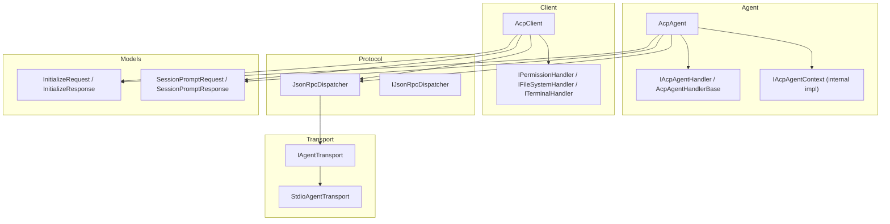
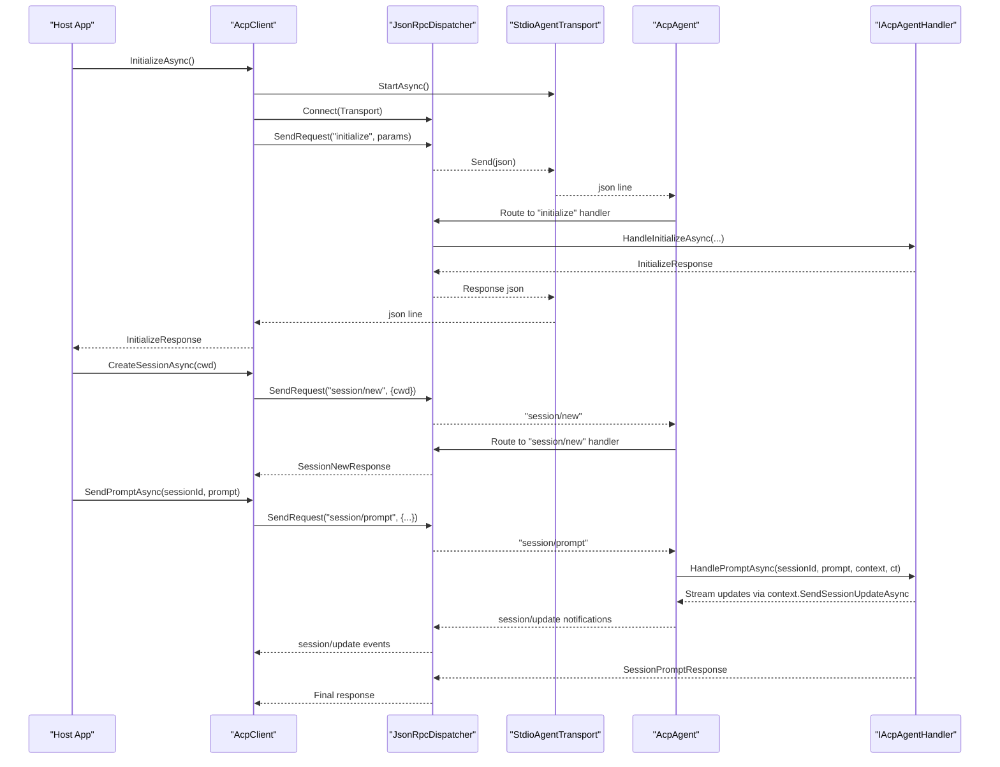
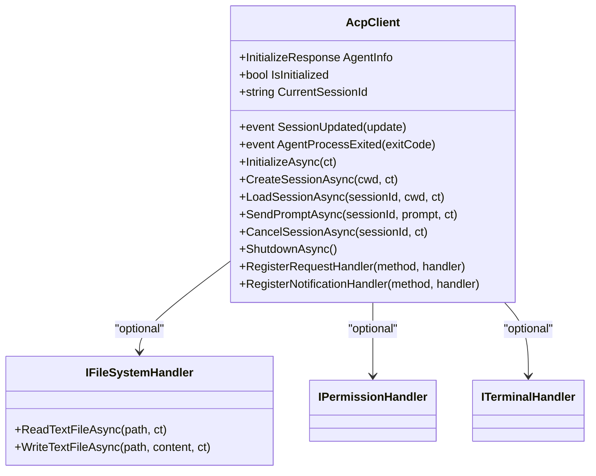
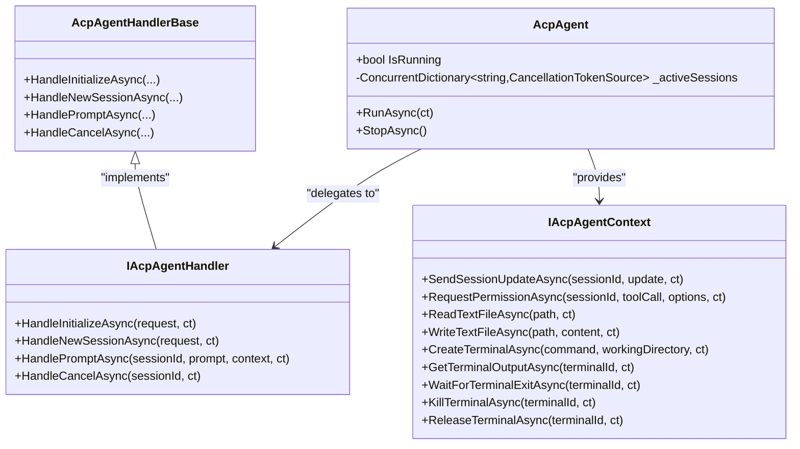
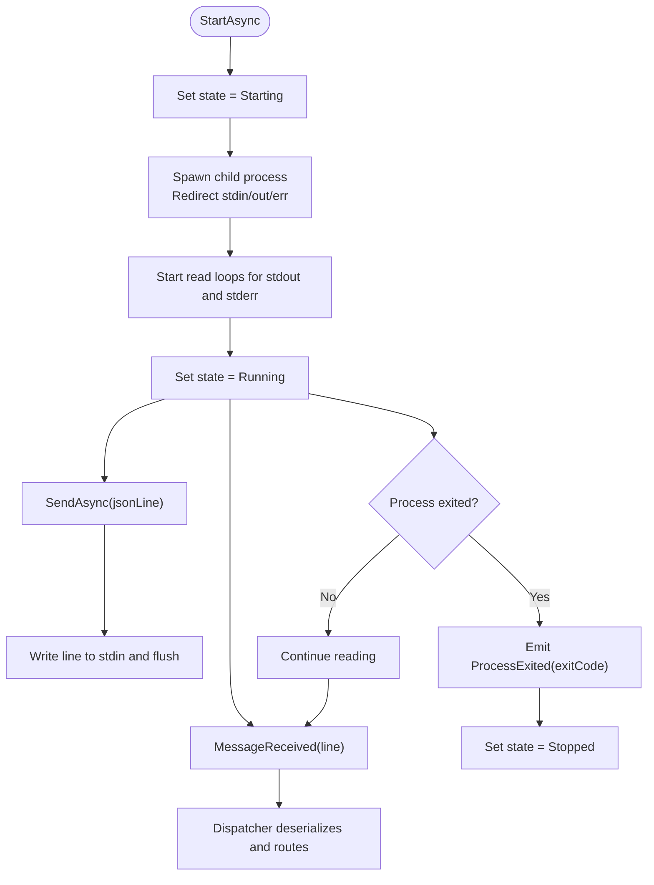
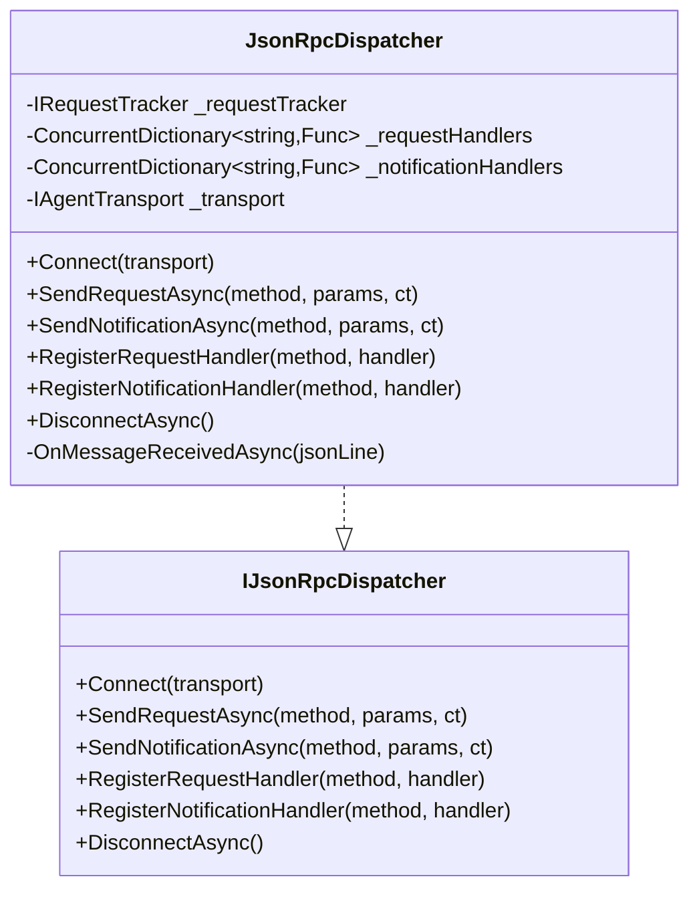
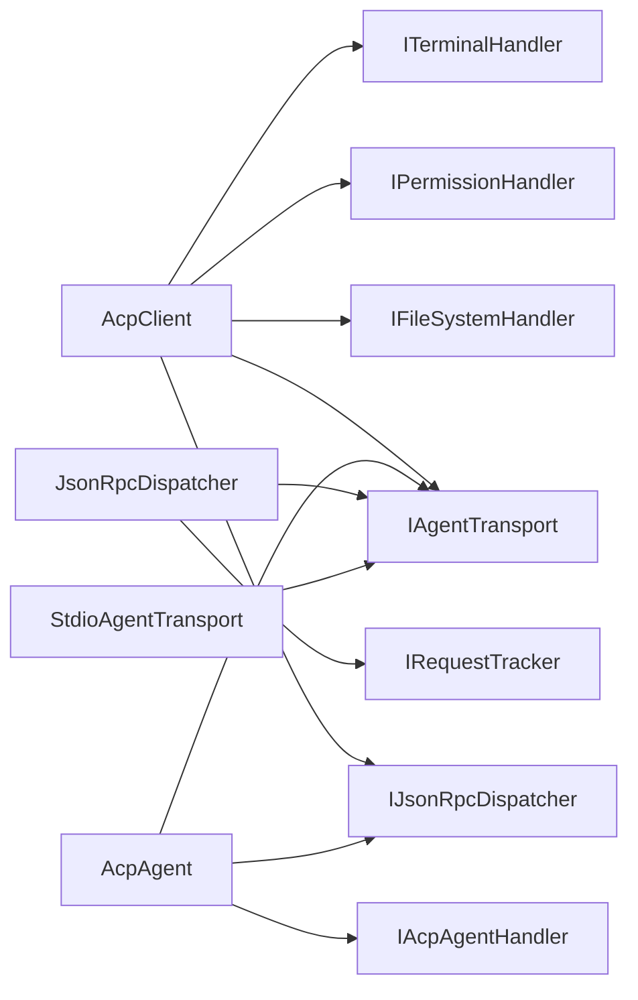

# Agent Framework

<cite>
**Referenced Files in This Document**
- [README.md](file://README.md)
- [IAcpAgent.cs](file://Agent/IAcpAgent.cs)
- [AcpAgent.cs](file://Agent/AcpAgent.cs)
- [IAcpAgentHandler.cs](file://Agent/IAcpAgentHandler.cs)
- [AcpAgentHandlerBase.cs](file://Agent/AcpAgentHandlerBase.cs)
- [IAcpClient.cs](file://Client/IAcpClient.cs)
- [AcpClient.cs](file://Client/AcpClient.cs)
- [IFileSystemHandler.cs](file://Client/IFileSystemHandler.cs)
- [IAgentTransport.cs](file://Transport/IAgentTransport.cs)
- [StdioAgentTransport.cs](file://Transport/StdioAgentTransport.cs)
- [IJsonRpcDispatcher.cs](file://Protocol/IJsonRpcDispatcher.cs)
- [JsonRpcDispatcher.cs](file://Protocol/JsonRpcDispatcher.cs)
- [SessionPromptRequest.cs](file://Models/SessionPromptRequest.cs)
- [InitializeRequest.cs](file://Models/InitializeRequest.cs)
- [ServiceCollectionExtensions.cs](file://Infrastructure/ServiceCollectionExtensions.cs)
</cite>

## Table of Contents
1. [Introduction](#introduction)
2. [Project Structure](#project-structure)
3. [Core Components](#core-components)
4. [Architecture Overview](#architecture-overview)
5. [Detailed Component Analysis](#detailed-component-analysis)
6. [Dependency Analysis](#dependency-analysis)
7. [Performance Considerations](#performance-considerations)
8. [Troubleshooting Guide](#troubleshooting-guide)
9. [Conclusion](#conclusion)

## Introduction
This document describes the Agent Framework, a .NET library implementing the Agent Client Protocol (ACP). It supports both sides of the protocol over stdio using JSON-RPC:
- Client: launch and drive an ACP-compliant agent process
- Agent: build your own ACP-compliant agent that clients can connect to

The framework is organized into clear layers: Transport (stdio), Protocol (JSON-RPC dispatching), Models (protocol messages), and two runtime roles (Client and Agent). The library provides DI extensions for quick setup and exposes extensibility points for custom handlers and methods.

## Project Structure
At a high level, the repository is organized by role and layer:
- Agent: agent-side runtime and handler interfaces
- Client: client-side runtime and host-side capability handlers
- Transport: stdio transport abstraction and implementation
- Protocol: JSON-RPC dispatcher and request tracking
- Models: ACP message types and enums
- Infrastructure: DI registration helpers
- Samples: mock agent and test client

**Diagram sources**
- [AcpAgent.cs:1-309](file://Agent/AcpAgent.cs#L1-L309)
- [AcpClient.cs:1-361](file://Client/AcpClient.cs#L1-L361)
- [JsonRpcDispatcher.cs:1-124](file://Protocol/JsonRpcDispatcher.cs#L1-L124)
- [IAgentTransport.cs:1-39](file://Transport/IAgentTransport.cs#L1-L39)
- [StdioAgentTransport.cs:1-150](file://Transport/StdioAgentTransport.cs#L1-L150)
- [IAcpAgentHandler.cs:1-26](file://Agent/IAcpAgentHandler.cs#L1-L26)
- [AcpAgentHandlerBase.cs:1-30](file://Agent/AcpAgentHandlerBase.cs#L1-L30)
- [InitializeRequest.cs:1-16](file://Models/InitializeRequest.cs#L1-L16)
- [SessionPromptRequest.cs:1-20](file://Models/SessionPromptRequest.cs#L1-L20)

**Section sources**
- [README.md:1-193](file://README.md#L1-L193)

## Core Components
- AcpClient: orchestrates initialization, session lifecycle, prompt sending, cancellation, and event-driven streaming updates; wires built-in handlers for permission, file system, and terminal operations.
- AcpAgent: runs the server side, registers JSON-RPC handlers for initialize, session/new, session/prompt, and session/cancel; manages active sessions and cancellation tokens.
- JsonRpcDispatcher: serializes/deserializes JSON-RPC messages, routes requests/notifications to handlers, and tracks pending requests with responses.
- IAgentTransport and StdioAgentTransport: abstracts stdio communication; the client transport launches a child process, while the agent transport uses the current process’s stdin/stdout.
- IAcpAgentHandler and AcpAgentHandlerBase: define the contract for agent business logic; base class provides defaults so only HandlePromptAsync is required.
- Client capability handlers: IPermissionHandler, IFileSystemHandler, ITerminalHandler allow the host application to implement requested capabilities.

**Section sources**
- [IAcpClient.cs:1-59](file://Client/IAcpClient.cs#L1-L59)
- [AcpClient.cs:1-361](file://Client/AcpClient.cs#L1-L361)
- [IAcpAgent.cs:1-17](file://Agent/IAcpAgent.cs#L1-L17)
- [AcpAgent.cs:1-309](file://Agent/AcpAgent.cs#L1-L309)
- [IJsonRpcDispatcher.cs:1-14](file://Protocol/IJsonRpcDispatcher.cs#L1-L14)
- [JsonRpcDispatcher.cs:1-124](file://Protocol/JsonRpcDispatcher.cs#L1-L124)
- [IAgentTransport.cs:1-39](file://Transport/IAgentTransport.cs#L1-L39)
- [StdioAgentTransport.cs:1-150](file://Transport/StdioAgentTransport.cs#L1-L150)
- [IAcpAgentHandler.cs:1-26](file://Agent/IAcpAgentHandler.cs#L1-L26)
- [AcpAgentHandlerBase.cs:1-30](file://Agent/AcpAgentHandlerBase.cs#L1-L30)
- [IFileSystemHandler.cs:1-14](file://Client/IFileSystemHandler.cs#L1-L14)

## Architecture Overview
The system follows a layered architecture with clear separation of concerns:
- Transport layer handles raw line-based JSON-RPC over stdio
- Protocol layer marshals JSON-RPC requests/notifications/responses and routes them
- Application layer implements client or agent behavior and business logic
- Models represent protocol payloads

**Diagram sources**
- [AcpClient.cs:48-182](file://Client/AcpClient.cs#L48-L182)
- [JsonRpcDispatcher.cs:27-64](file://Protocol/JsonRpcDispatcher.cs#L27-L64)
- [StdioAgentTransport.cs:30-71](file://Transport/StdioAgentTransport.cs#L30-L71)
- [AcpAgent.cs:45-179](file://Agent/AcpAgent.cs#L45-L179)
- [IAcpAgentHandler.cs:10-25](file://Agent/IAcpAgentHandler.cs#L10-L25)

## Detailed Component Analysis

### Client Runtime (AcpClient)
Responsibilities:
- Start transport, connect dispatcher, subscribe to session/update notifications
- Register built-in handlers for permission, file system, and terminal requests
- Perform initialize handshake and store agent info
- Manage session lifecycle (create/load), send prompts, cancel sessions
- Expose events for streaming updates and process exit

Key behaviors:
- Initialize sets up all handlers and sends the initialize request
- Terminal handlers are registered in a dedicated method
- Streaming updates are forwarded via the SessionUpdated event
- Process exit is surfaced through AgentProcessExited

**Diagram sources**
- [AcpClient.cs:12-248](file://Client/AcpClient.cs#L12-L248)
- [IFileSystemHandler.cs:1-14](file://Client/IFileSystemHandler.cs#L1-L14)

**Section sources**
- [AcpClient.cs:48-182](file://Client/AcpClient.cs#L48-L182)
- [AcpClient.cs:250-359](file://Client/AcpClient.cs#L250-L359)
- [IAcpClient.cs:1-59](file://Client/IAcpClient.cs#L1-L59)

### Agent Runtime (AcpAgent)
Responsibilities:
- Start transport, connect dispatcher, register core JSON-RPC handlers
- Track active sessions and propagate cancellation
- Provide IAcpAgentContext to call back to the client during prompt handling

Key behaviors:
- Handlers for initialize, session/new, session/prompt, and session/cancel
- Active sessions tracked with CancellationTokenSource linked to the request token
- Context methods map to client-side requests (permission, fs, terminal)

**Diagram sources**
- [AcpAgent.cs:17-208](file://Agent/AcpAgent.cs#L17-L208)
- [IAcpAgentHandler.cs:1-26](file://Agent/IAcpAgentHandler.cs#L1-L26)
- [AcpAgentHandlerBase.cs:1-30](file://Agent/AcpAgentHandlerBase.cs#L1-L30)

**Section sources**
- [AcpAgent.cs:45-179](file://Agent/AcpAgent.cs#L45-L179)
- [AcpAgent.cs:214-307](file://Agent/AcpAgent.cs#L214-L307)
- [IAcpAgent.cs:1-17](file://Agent/IAcpAgent.cs#L1-L17)

### Transport Layer (IAgentTransport and StdioAgentTransport)
Responsibilities:
- Abstract stdio communication with start/stop, send, and events
- StdioAgentTransport launches a child process, reads stdout lines, and forwards to dispatcher
- Handles encoding carefully to avoid BOM issues on stdin

Key behaviors:
- State machine transitions: Created → Starting → Running → Stopping → Stopped/Faulted
- Read loop emits MessageReceived for each line
- ProcessExited notifies when the child process terminates

**Diagram sources**
- [IAgentTransport.cs:1-39](file://Transport/IAgentTransport.cs#L1-L39)
- [StdioAgentTransport.cs:30-96](file://Transport/StdioAgentTransport.cs#L30-L96)
- [StdioAgentTransport.cs:98-148](file://Transport/StdioAgentTransport.cs#L98-L148)

**Section sources**
- [IAgentTransport.cs:1-39](file://Transport/IAgentTransport.cs#L1-L39)
- [StdioAgentTransport.cs:1-150](file://Transport/StdioAgentTransport.cs#L1-L150)

### Protocol Layer (JsonRpcDispatcher)
Responsibilities:
- Serialize/deserialize JSON-RPC messages
- Maintain pending requests and match responses
- Route incoming requests/notifications to registered handlers

Key behaviors:
- Connect binds transport.MessageReceived to internal routing
- SendRequest creates a pending request and awaits response
- OnMessageReceived branches based on message type (response/request/notification)

**Diagram sources**
- [JsonRpcDispatcher.cs:9-124](file://Protocol/JsonRpcDispatcher.cs#L9-L124)
- [IJsonRpcDispatcher.cs:1-14](file://Protocol/IJsonRpcDispatcher.cs#L1-L14)

**Section sources**
- [JsonRpcDispatcher.cs:27-64](file://Protocol/JsonRpcDispatcher.cs#L27-L64)
- [JsonRpcDispatcher.cs:86-122](file://Protocol/JsonRpcDispatcher.cs#L86-L122)

### Models and Messages
Representations include:
- InitializeRequest and related capability/info structures
- SessionPromptRequest and SessionPromptResponse
- Enums for stop reasons and tool call metadata

These records are serialized/deserialized using shared JSON options.

**Section sources**
- [InitializeRequest.cs:1-16](file://Models/InitializeRequest.cs#L1-L16)
- [SessionPromptRequest.cs:1-20](file://Models/SessionPromptRequest.cs#L1-L20)

### Dependency Injection Extensions
Provides convenient registration for both client and agent scenarios:
- AddAcpClient: registers dispatcher, tracker, and AcpClient
- AddAcpAgent<THandler>: registers stdio host transport, dispatcher, tracker, handler, and AcpAgent

**Section sources**
- [ServiceCollectionExtensions.cs:10-38](file://Infrastructure/ServiceCollectionExtensions.cs#L10-L38)

## Dependency Analysis
High-level dependencies:
- AcpClient depends on IAgentTransport, IJsonRpcDispatcher, and optional capability handlers
- AcpAgent depends on IAgentTransport, IJsonRpcDispatcher, and IAcpAgentHandler
- JsonRpcDispatcher depends on IAgentTransport and IRequestTracker
- StdioAgentTransport depends on System.Diagnostics.Process and IO streams

**Diagram sources**
- [AcpClient.cs:12-45](file://Client/AcpClient.cs#L12-L45)
- [AcpAgent.cs:17-42](file://Agent/AcpAgent.cs#L17-L42)
- [JsonRpcDispatcher.cs:9-25](file://Protocol/JsonRpcDispatcher.cs#L9-L25)
- [StdioAgentTransport.cs:8-28](file://Transport/StdioAgentTransport.cs#L8-L28)

**Section sources**
- [AcpClient.cs:12-45](file://Client/AcpClient.cs#L12-L45)
- [AcpAgent.cs:17-42](file://Agent/AcpAgent.cs#L17-L42)
- [JsonRpcDispatcher.cs:9-25](file://Protocol/JsonRpcDispatcher.cs#L9-L25)
- [StdioAgentTransport.cs:8-28](file://Transport/StdioAgentTransport.cs#L8-L28)

## Performance Considerations
- Use async throughout to avoid blocking threads; transports and dispatcher already use asynchronous I/O
- Prefer streaming updates via session/update notifications instead of large single responses
- Minimize allocations by reusing objects where possible and avoiding unnecessary string conversions
- Ensure handlers are efficient and short-lived; long-running work should be offloaded to background tasks
- Avoid writing to stdout from agents; use stderr for diagnostics to prevent protocol corruption

[No sources needed since this section provides general guidance]

## Troubleshooting Guide
Common issues and resolutions:
- Protocol version mismatch: client and agent report different protocol versions; ensure compatibility
- Missing handlers: if PermissionHandler, FileSystemHandler, or TerminalHandler are not set, requests return specific errors
- Agent stdout corruption: any stray Console.WriteLine on stdout corrupts JSON-RPC; write logs to stderr
- Process exits unexpectedly: listen to AgentProcessExited and handle cleanup
- Cancellation not propagated: ensure CancellationToken is passed through and used in long-running operations

Operational tips:
- Validate transport state before sending messages
- Use RegisterRequestHandler/RegisterNotificationHandler for debugging custom methods
- Log at appropriate levels to diagnose handshake and session lifecycle issues

**Section sources**
- [AcpClient.cs:175-182](file://Client/AcpClient.cs#L175-L182)
- [AcpClient.cs:102-144](file://Client/AcpClient.cs#L102-L144)
- [AcpClient.cs:250-359](file://Client/AcpClient.cs#L250-L359)
- [AcpAgent.cs:52-57](file://Agent/AcpAgent.cs#L52-L57)
- [README.md:85-87](file://README.md#L85-L87)

## Conclusion
The Agent Framework provides a clean, extensible implementation of the Agent Client Protocol over stdio with JSON-RPC. Its layered design separates transport, protocol, and application concerns, enabling straightforward development of both clients and agents. With DI support, robust error handling, and rich extensibility points, it is well-suited for building interactive AI agents integrated into desktop applications.

[No sources needed since this section summarizes without analyzing specific files]