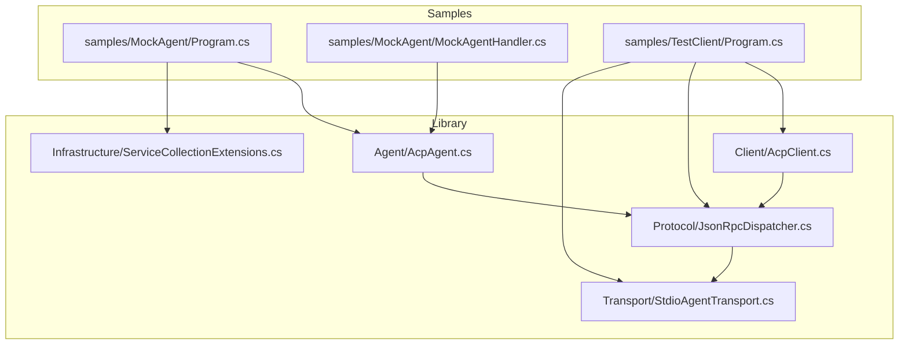
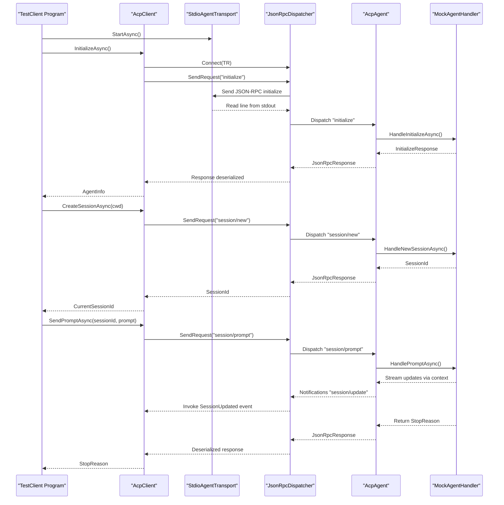
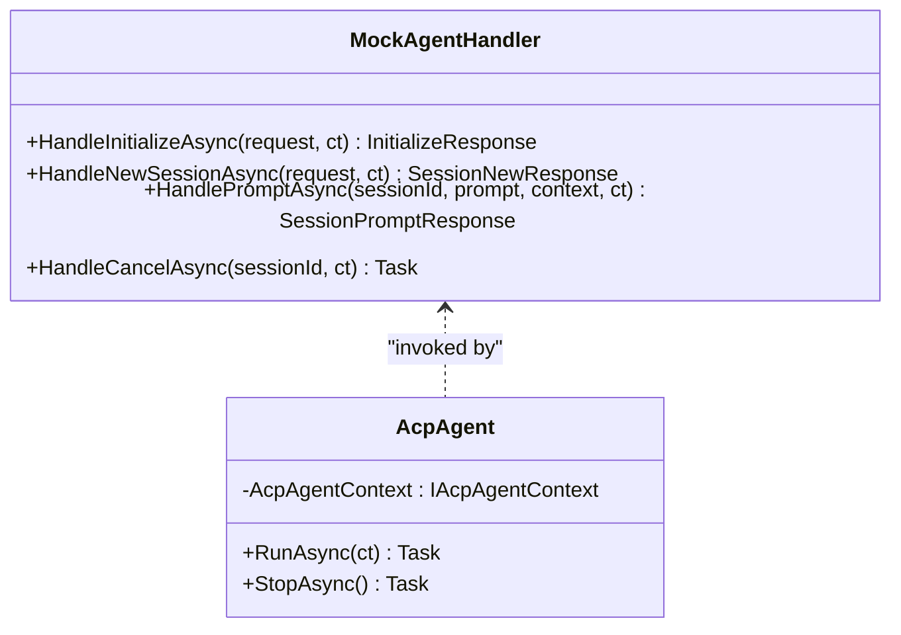
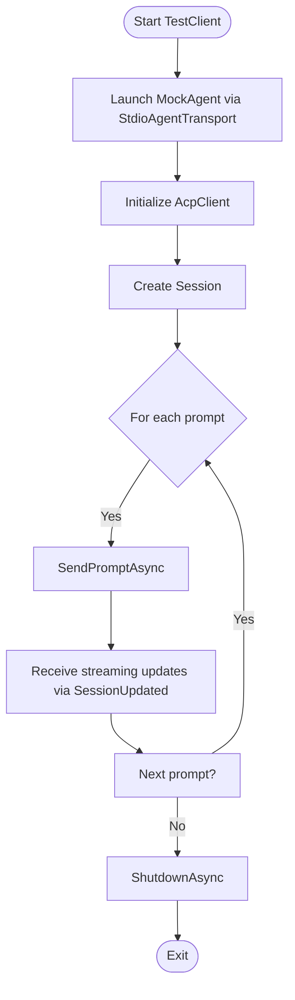
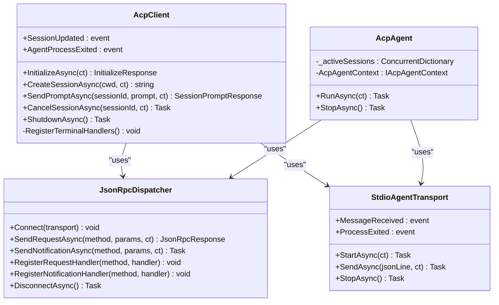
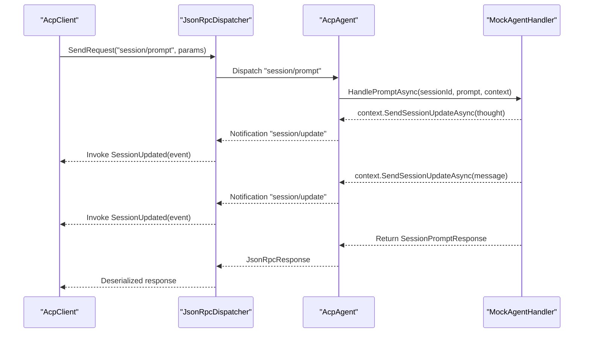
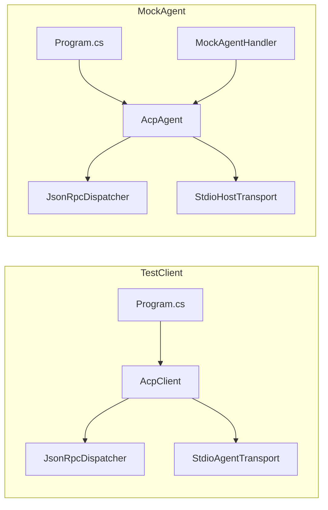

# Sample Applications

<cite>
**Referenced Files in This Document**
- [README.md](file://README.md)
- [Agentic.ACPLibrary.csproj](file://Agentic.ACPLibrary.csproj)
- [samples/MockAgent/Program.cs](file://samples/MockAgent/Program.cs)
- [samples/TestClient/Program.cs](file://samples/TestClient/Program.cs)
- [samples/MockAgent/MockAgentHandler.cs](file://samples/MockAgent/MockAgentHandler.cs)
- [Agent/AcpAgent.cs](file://Agent/AcpAgent.cs)
- [Client/AcpClient.cs](file://Client/AcpClient.cs)
- [Infrastructure/ServiceCollectionExtensions.cs](file://Infrastructure/ServiceCollectionExtensions.cs)
- [Transport/StdioAgentTransport.cs](file://Transport/StdioAgentTransport.cs)
- [Protocol/JsonRpcDispatcher.cs](file://Protocol/JsonRpcDispatcher.cs)
</cite>

## Table of Contents
1. [Introduction](#introduction)
2. [Project Structure](#project-structure)
3. [Core Components](#core-components)
4. [Architecture Overview](#architecture-overview)
5. [Detailed Component Analysis](#detailed-component-analysis)
6. [Dependency Analysis](#dependency-analysis)
7. [Performance Considerations](#performance-considerations)
8. [Troubleshooting Guide](#troubleshooting-guide)
9. [Conclusion](#conclusion)

## Introduction
This document explains the sample applications included with the library and how they demonstrate both sides of the Agent Client Protocol (ACP): a client that drives an agent, and a mock agent that responds to prompts over stdio using JSON-RPC. It also maps these samples to the core library components so you can understand how to build your own agents or clients.

The samples are:
- MockAgent: A minimal ACP agent that streams responses and supports test directives for cancellation and refusal scenarios.
- TestClient: A simple console client that launches MockAgent via stdio, initializes the protocol, creates a session, sends prompts, and prints streaming updates.

These samples illustrate the end-to-end flow: transport setup, JSON-RPC dispatching, session lifecycle, prompt handling, and streaming updates.

**Section sources**
- [README.md:1-10](file://README.md#L1-L10)

## Project Structure
At a high level, the repository contains:
- Core library code under Agent/, Client/, Infrastructure/, JsonRpc/, Models/, Protocol/, Transport/.
- Two sample projects under samples/:
  - MockAgent: implements IAcpAgentHandler and runs as a standalone process communicating over stdio.
  - TestClient: uses AcpClient to connect to MockAgent via StdioAgentTransport.

**Diagram sources**
- [Agent/AcpAgent.cs:1-309](file://Agent/AcpAgent.cs#L1-L309)
- [Client/AcpClient.cs:1-361](file://Client/AcpClient.cs#L1-L361)
- [Protocol/JsonRpcDispatcher.cs:1-124](file://Protocol/JsonRpcDispatcher.cs#L1-L124)
- [Transport/StdioAgentTransport.cs:1-150](file://Transport/StdioAgentTransport.cs#L1-L150)
- [Infrastructure/ServiceCollectionExtensions.cs:1-40](file://Infrastructure/ServiceCollectionExtensions.cs#L1-L40)
- [samples/MockAgent/Program.cs:1-39](file://samples/MockAgent/Program.cs#L1-L39)
- [samples/TestClient/Program.cs:1-54](file://samples/TestClient/Program.cs#L1-L54)
- [samples/MockAgent/MockAgentHandler.cs:1-108](file://samples/MockAgent/MockAgentHandler.cs#L1-L108)

**Section sources**
- [Agentic.ACPLibrary.csproj:1-36](file://Agentic.ACPLibrary.csproj#L1-L36)

## Core Components
The samples rely on these key components:
- AcpClient: The client-side orchestrator that manages transport, JSON-RPC dispatching, session lifecycle, and event-driven streaming updates.
- AcpAgent: The agent-side orchestrator that listens for requests, routes them to the handler, and exposes context methods to call back into the client.
- JsonRpcDispatcher: Manages request/response correlation and notification routing between transport and handlers.
- StdioAgentTransport: Launches and communicates with a child process over stdin/stdout, handling encoding and lifecycle events.
- ServiceCollectionExtensions: Registers DI services for both client and agent modes.

How the samples use them:
- TestClient constructs StdioAgentTransport pointing at MockAgent, wires up JsonRpcDispatcher, creates AcpClient, initializes, creates a session, and sends prompts.
- MockAgent registers its handler via DI, starts AcpAgent over StdioHostTransport, and loops until the client disconnects.

**Section sources**
- [Client/AcpClient.cs:1-361](file://Client/AcpClient.cs#L1-L361)
- [Agent/AcpAgent.cs:1-309](file://Agent/AcpAgent.cs#L1-L309)
- [Protocol/JsonRpcDispatcher.cs:1-124](file://Protocol/JsonRpcDispatcher.cs#L1-L124)
- [Transport/StdioAgentTransport.cs:1-150](file://Transport/StdioAgentTransport.cs#L1-L150)
- [Infrastructure/ServiceCollectionExtensions.cs:1-40](file://Infrastructure/ServiceCollectionExtensions.cs#L1-L40)

## Architecture Overview
The following diagram shows the runtime interaction between TestClient and MockAgent through the library’s transport and dispatcher layers.

**Diagram sources**
- [samples/TestClient/Program.cs:1-54](file://samples/TestClient/Program.cs#L1-L54)
- [Client/AcpClient.cs:1-361](file://Client/AcpClient.cs#L1-L361)
- [Protocol/JsonRpcDispatcher.cs:1-124](file://Protocol/JsonRpcDispatcher.cs#L1-L124)
- [Transport/StdioAgentTransport.cs:1-150](file://Transport/StdioAgentTransport.cs#L1-L150)
- [Agent/AcpAgent.cs:1-309](file://Agent/AcpAgent.cs#L1-L309)
- [samples/MockAgent/MockAgentHandler.cs:1-108](file://samples/MockAgent/MockAgentHandler.cs#L1-L108)

## Detailed Component Analysis

### MockAgent Sample
Purpose:
- Demonstrates a minimal ACP agent implementation using the library’s agent stack.
- Streams thought and message chunks back to the client.
- Supports test directives for refusal and cancellation scenarios.

Key behaviors:
- Initializes with version negotiation and capability advertisement.
- Creates sessions with deterministic IDs.
- Handles prompts by parsing the first text block for directives:
  - "mock:refuse" returns refusal without streaming.
  - "mock:sleep=<ms>" delays before responding to exercise cancellation paths.
  - Otherwise, streams a thought chunk followed by a greeting message and ends with EndTurn.
- Exposes cancel handling and logs diagnostics to stderr.

DI and lifecycle:
- Uses AddAcpAgent<T>() to register StdioHostTransport, dispatcher, and the custom handler.
- Runs the agent and keeps the process alive until the client disconnects or Ctrl+C is pressed.

**Diagram sources**
- [samples/MockAgent/MockAgentHandler.cs:1-108](file://samples/MockAgent/MockAgentHandler.cs#L1-L108)
- [Agent/AcpAgent.cs:1-309](file://Agent/AcpAgent.cs#L1-L309)

**Section sources**
- [samples/MockAgent/Program.cs:1-39](file://samples/MockAgent/Program.cs#L1-L39)
- [samples/MockAgent/MockAgentHandler.cs:1-108](file://samples/MockAgent/MockAgentHandler.cs#L1-L108)
- [Infrastructure/ServiceCollectionExtensions.cs:28-38](file://Infrastructure/ServiceCollectionExtensions.cs#L28-L38)

### TestClient Sample
Purpose:
- End-to-end smoke test that launches MockAgent as a subprocess and exercises the full ACP workflow.
- Subscribes to streaming updates and prints messages and thoughts.
- Sends multiple prompts and shuts down cleanly.

Workflow highlights:
- Constructs StdioAgentTransport with the path to MockAgent executable.
- Initializes the client, creates a session, and iterates over prompts.
- Prints update types and content received via SessionUpdated.
- Shuts down after completing prompts.

**Diagram sources**
- [samples/TestClient/Program.cs:1-54](file://samples/TestClient/Program.cs#L1-L54)
- [Client/AcpClient.cs:1-361](file://Client/AcpClient.cs#L1-L361)
- [Transport/StdioAgentTransport.cs:1-150](file://Transport/StdioAgentTransport.cs#L1-L150)

**Section sources**
- [samples/TestClient/Program.cs:1-54](file://samples/TestClient/Program.cs#L1-L54)

### Library Orchestration: AcpClient and AcpAgent
AcpClient responsibilities:
- Starts transport, connects dispatcher, subscribes to session/update notifications.
- Registers built-in handlers for permission, file system, and terminal operations.
- Performs initialize handshake and maintains current session ID.
- Provides events for streaming updates and process exit.

AcpAgent responsibilities:
- Starts transport, connects dispatcher, and registers handlers for initialize, session/new, session/prompt, and session/cancel.
- Tracks active sessions and cancels them on stop.
- Implements IAcpAgentContext to send updates and make requests back to the client.

**Diagram sources**
- [Client/AcpClient.cs:1-361](file://Client/AcpClient.cs#L1-L361)
- [Agent/AcpAgent.cs:1-309](file://Agent/AcpAgent.cs#L1-L309)
- [Protocol/JsonRpcDispatcher.cs:1-124](file://Protocol/JsonRpcDispatcher.cs#L1-L124)
- [Transport/StdioAgentTransport.cs:1-150](file://Transport/StdioAgentTransport.cs#L1-L150)

**Section sources**
- [Client/AcpClient.cs:1-361](file://Client/AcpClient.cs#L1-L361)
- [Agent/AcpAgent.cs:1-309](file://Agent/AcpAgent.cs#L1-L309)

### Request Flow: session/prompt with Streaming Updates
This sequence shows how a prompt triggers streaming updates and a final response.

**Diagram sources**
- [Client/AcpClient.cs:207-216](file://Client/AcpClient.cs#L207-L216)
- [Protocol/JsonRpcDispatcher.cs:27-47](file://Protocol/JsonRpcDispatcher.cs#L27-L47)
- [Agent/AcpAgent.cs:114-152](file://Agent/AcpAgent.cs#L114-L152)
- [samples/MockAgent/MockAgentHandler.cs:56-100](file://samples/MockAgent/MockAgentHandler.cs#L56-L100)

## Dependency Analysis
The samples depend on the library’s DI registration and transport/dispatcher abstractions.

**Diagram sources**
- [samples/TestClient/Program.cs:1-54](file://samples/TestClient/Program.cs#L1-L54)
- [Client/AcpClient.cs:1-361](file://Client/AcpClient.cs#L1-L361)
- [Protocol/JsonRpcDispatcher.cs:1-124](file://Protocol/JsonRpcDispatcher.cs#L1-L124)
- [Transport/StdioAgentTransport.cs:1-150](file://Transport/StdioAgentTransport.cs#L1-L150)
- [samples/MockAgent/Program.cs:1-39](file://samples/MockAgent/Program.cs#L1-L39)
- [Agent/AcpAgent.cs:1-309](file://Agent/AcpAgent.cs#L1-L309)
- [Infrastructure/ServiceCollectionExtensions.cs:15-38](file://Infrastructure/ServiceCollectionExtensions.cs#L15-L38)

**Section sources**
- [Infrastructure/ServiceCollectionExtensions.cs:15-38](file://Infrastructure/ServiceCollectionExtensions.cs#L15-L38)

## Performance Considerations
- Use async I/O throughout: both samples avoid blocking calls and leverage async streams for reading/writing.
- Minimize allocations in hot paths: the dispatcher serializes/deserializes only when necessary; keep payloads small.
- Avoid writing to stdout in agents: any stray Console.WriteLine corrupts the JSON-RPC channel. Use stderr for diagnostics.
- Prefer streaming updates for long-running prompts to keep UI responsive and enable cancellation.
- Reuse transports and dispatchers per process lifetime to reduce overhead.

[No sources needed since this section provides general guidance]

## Troubleshooting Guide
Common issues and remedies:
- No output or garbled characters: Ensure UTF-8 without BOM is used for stdin and stdout. The transport sets appropriate encodings; do not override with BOM-emitting encoders.
- Agent exits unexpectedly: Check stderr logs in the agent process. The transport emits ProcessExited events; handle them to diagnose failures.
- Permission/file/terminal errors: If handlers are not assigned on the client side, requests return specific error codes indicating missing capabilities. Assign IPermissionHandler, IFileSystemHandler, and ITerminalHandler before initialization.
- Cancellation not working: Ensure CancellationToken is propagated through long-running operations in HandlePromptAsync and that session/cancel notifications are sent from the client.

**Section sources**
- [Transport/StdioAgentTransport.cs:30-62](file://Transport/StdioAgentTransport.cs#L30-L62)
- [Client/AcpClient.cs:74-99](file://Client/AcpClient.cs#L74-L99)
- [Client/AcpClient.cs:102-144](file://Client/AcpClient.cs#L102-L144)
- [Client/AcpClient.cs:250-359](file://Client/AcpClient.cs#L250-L359)
- [Agent/AcpAgent.cs:154-175](file://Agent/AcpAgent.cs#L154-L175)

## Conclusion
The sample applications provide a clear, runnable demonstration of the ACP client and agent roles:
- TestClient showcases how to launch an agent, perform the handshake, manage sessions, send prompts, and consume streaming updates.
- MockAgent demonstrates how to implement a handler, stream updates, and respond to cancellation/refusal scenarios.

By studying these samples alongside the core components, you can confidently extend or adapt the patterns to build robust ACP-compatible applications.

[No sources needed since this section summarizes without analyzing specific files]