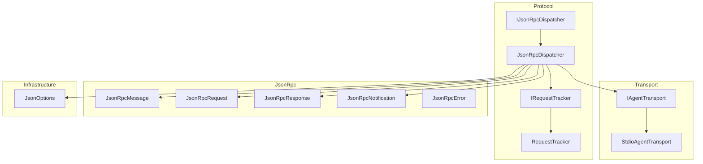
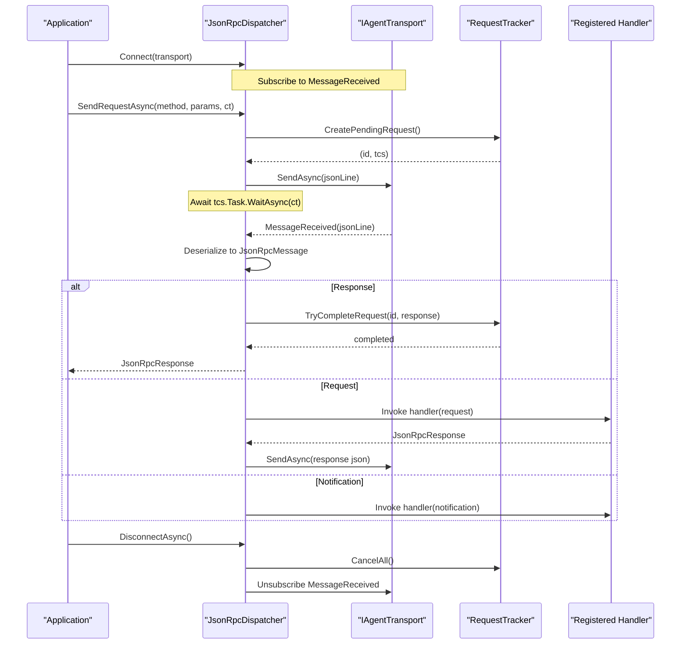
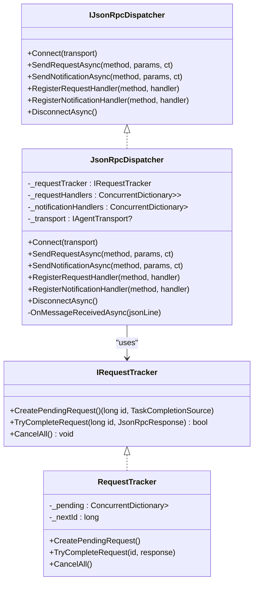
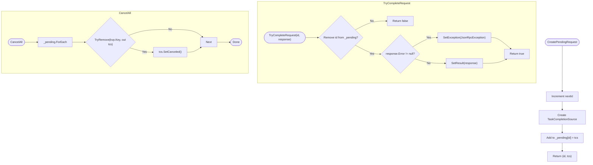
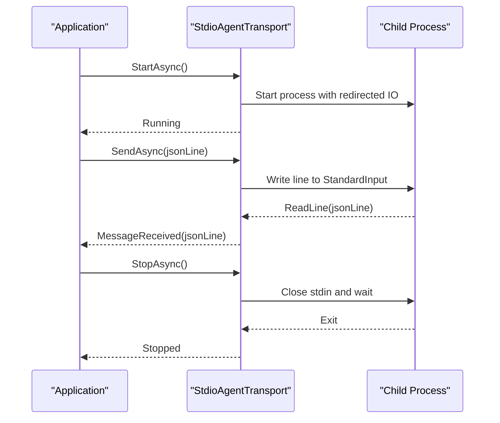
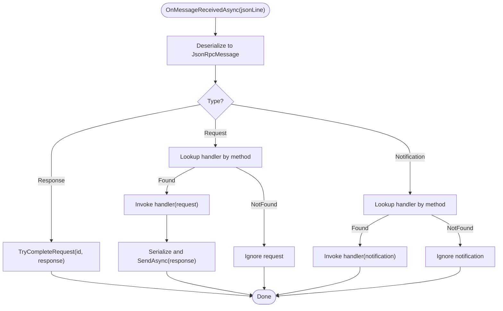
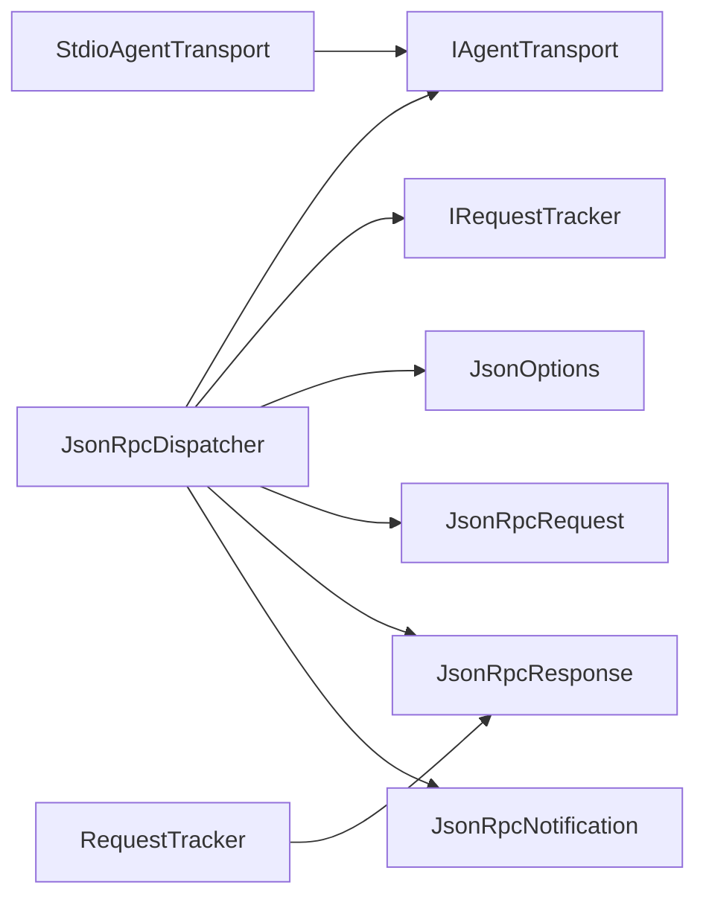

# Protocol Handling

<cite>
**Referenced Files in This Document**
- [IJsonRpcDispatcher.cs](file://Protocol/IJsonRpcDispatcher.cs)
- [JsonRpcDispatcher.cs](file://Protocol/JsonRpcDispatcher.cs)
- [IRequestTracker.cs](file://Protocol/IRequestTracker.cs)
- [RequestTracker.cs](file://Protocol/RequestTracker.cs)
- [JsonRpcMessage.cs](file://JsonRpc/JsonRpcMessage.cs)
- [JsonRpcRequest.cs](file://JsonRpc/JsonRpcRequest.cs)
- [JsonRpcResponse.cs](file://JsonRpc/JsonRpcResponse.cs)
- [JsonRpcNotification.cs](file://JsonRpc/JsonRpcNotification.cs)
- [JsonRpcError.cs](file://JsonRpc/JsonRpcError.cs)
- [IAgentTransport.cs](file://Transport/IAgentTransport.cs)
- [StdioAgentTransport.cs](file://Transport/StdioAgentTransport.cs)
- [JsonOptions.cs](file://Infrastructure/JsonOptions.cs)
- [README.md](file://README.md)
</cite>

## Table of Contents
1. [Introduction](#introduction)
2. [Project Structure](#project-structure)
3. [Core Components](#core-components)
4. [Architecture Overview](#architecture-overview)
5. [Detailed Component Analysis](#detailed-component-analysis)
6. [Dependency Analysis](#dependency-analysis)
7. [Performance Considerations](#performance-considerations)
8. [Troubleshooting Guide](#troubleshooting-guide)
9. [Conclusion](#conclusion)

## Introduction
This document explains the JSON-RPC protocol handling system used to communicate with ACP-compliant agents over stdio. It focuses on the IJsonRpcDispatcher interface and JsonRpcDispatcher implementation for message routing, request/response correlation, and handler dispatching. It also covers the RequestTracker component for managing pending requests and cancellation, the transport abstraction, error handling strategies, concurrent processing characteristics, performance considerations, and debugging techniques.

## Project Structure
The protocol layer is organized into:
- Transport: IAgentTransport and StdioAgentTransport provide a line-based JSON-RPC channel over a child process’s standard streams.
- Protocol: IJsonRpcDispatcher and JsonRpcDispatcher implement request/response correlation, method-based dispatch, and notification handling. IRequestTracker and RequestTracker manage pending requests and lifecycle.
- JsonRpc: Message types (request, response, notification, error) and shared options for serialization.
- Infrastructure: Shared JSON serialization options and converters.

**Diagram sources**
- [IAgentTransport.cs:1-39](file://Transport/IAgentTransport.cs#L1-L39)
- [StdioAgentTransport.cs:1-147](file://Transport/StdioAgentTransport.cs#L1-L147)
- [IJsonRpcDispatcher.cs:1-14](file://Protocol/IJsonRpcDispatcher.cs#L1-L14)
- [JsonRpcDispatcher.cs:1-124](file://Protocol/JsonRpcDispatcher.cs#L1-L124)
- [IRequestTracker.cs:1-11](file://Protocol/IRequestTracker.cs#L1-L11)
- [RequestTracker.cs:1-52](file://Protocol/RequestTracker.cs#L1-L52)
- [JsonRpcMessage.cs:1-14](file://JsonRpc/JsonRpcMessage.cs#L1-L14)
- [JsonRpcRequest.cs:1-19](file://JsonRpc/JsonRpcRequest.cs#L1-L19)
- [JsonRpcResponse.cs:1-20](file://JsonRpc/JsonRpcResponse.cs#L1-L20)
- [JsonRpcNotification.cs:1-16](file://JsonRpc/JsonRpcNotification.cs#L1-L16)
- [JsonRpcError.cs:1-19](file://JsonRpc/JsonRpcError.cs#L1-L19)
- [JsonOptions.cs:1-28](file://Infrastructure/JsonOptions.cs#L1-L28)

**Section sources**
- [README.md:1-99](file://README.md#L1-L99)

## Core Components
- IJsonRpcDispatcher: Defines connection management, sending requests and notifications, registering handlers, and disconnecting.
- JsonRpcDispatcher: Implements the dispatcher, wires up transport events, serializes messages, correlates responses via RequestTracker, and routes incoming messages to registered handlers.
- IRequestTracker and RequestTracker: Provide thread-safe tracking of pending requests using TaskCompletionSource, assign monotonically increasing IDs, complete or cancel requests, and throw typed exceptions for errors.
- Transport Abstraction: IAgentTransport exposes StartAsync, SendAsync, MessageReceived event, and lifecycle events; StdioAgentTransport implements it over a child process.

Key responsibilities:
- Serialization/deserialization uses shared JsonOptions with case-insensitive property names and null-omission.
- Method-based routing uses ConcurrentDictionary for low contention registration and lookup.
- Correlation uses unique long IDs and per-request TaskCompletionSource.

**Section sources**
- [IJsonRpcDispatcher.cs:1-14](file://Protocol/IJsonRpcDispatcher.cs#L1-L14)
- [JsonRpcDispatcher.cs:1-124](file://Protocol/JsonRpcDispatcher.cs#L1-L124)
- [IRequestTracker.cs:1-11](file://Protocol/IRequestTracker.cs#L1-L11)
- [RequestTracker.cs:1-52](file://Protocol/RequestTracker.cs#L1-L52)
- [IAgentTransport.cs:1-39](file://Transport/IAgentTransport.cs#L1-L39)
- [StdioAgentTransport.cs:1-147](file://Transport/StdioAgentTransport.cs#L1-L147)
- [JsonOptions.cs:1-28](file://Infrastructure/JsonOptions.cs#L1-L28)

## Architecture Overview
The dispatcher connects to a transport, subscribes to incoming messages, and routes them based on type and method name. Outgoing requests are correlated by ID and awaited until a response arrives or cancellation occurs.

**Diagram sources**
- [JsonRpcDispatcher.cs:21-84](file://Protocol/JsonRpcDispatcher.cs#L21-L84)
- [RequestTracker.cs:11-39](file://Protocol/RequestTracker.cs#L11-L39)
- [IAgentTransport.cs:1-39](file://Transport/IAgentTransport.cs#L1-L39)

## Detailed Component Analysis

### IJsonRpcDispatcher and JsonRpcDispatcher
Responsibilities:
- Connect to a transport and subscribe to incoming messages.
- Serialize and send requests and notifications.
- Register request and notification handlers keyed by method name.
- Correlate responses to requests using RequestTracker.
- Clean up subscriptions and pending requests on disconnect.

Concurrency model:
- Handlers are invoked asynchronously. The dispatcher does not serialize handler execution; concurrency depends on how many inbound messages arrive concurrently.
- Registration and lookup use ConcurrentDictionary for safe concurrent access.

Error handling:
- If transport is not connected, operations throw InvalidOperationException.
- Incoming message deserialization or handler exceptions are caught and ignored at the dispatcher level to avoid crashing the pipeline. Errors from responses are surfaced to callers via JsonRpcException when correlating responses.

Timeouts and cancellation:
- Requests accept a CancellationToken that propagates to both transport.SendAsync and WaitAsync on the TaskCompletionSource.
- On DisconnectAsync, all pending requests are cancelled via RequestTracker.CancelAll.

**Diagram sources**
- [IJsonRpcDispatcher.cs:1-14](file://Protocol/IJsonRpcDispatcher.cs#L1-L14)
- [JsonRpcDispatcher.cs:1-124](file://Protocol/JsonRpcDispatcher.cs#L1-L124)
- [IRequestTracker.cs:1-11](file://Protocol/IRequestTracker.cs#L1-L11)
- [RequestTracker.cs:1-52](file://Protocol/RequestTracker.cs#L1-L52)

**Section sources**
- [JsonRpcDispatcher.cs:21-84](file://Protocol/JsonRpcDispatcher.cs#L21-L84)
- [JsonRpcDispatcher.cs:86-123](file://Protocol/JsonRpcDispatcher.cs#L86-L123)

### RequestTracker
Responsibilities:
- Assign monotonically increasing request IDs.
- Store per-request TaskCompletionSource instances in a thread-safe dictionary.
- Complete requests with result or exception based on response content.
- Cancel all pending requests during shutdown.

Complexity:
- CreatePendingRequest: O(1).
- TryCompleteRequest: O(1) average due to dictionary removal.
- CancelAll: O(n) where n is number of pending requests.

Memory management:
- Pending entries are removed upon completion or cancellation, preventing leaks if responses arrive.
- Ensure DisconnectAsync is called to cancel any lingering requests.

**Diagram sources**
- [RequestTracker.cs:11-39](file://Protocol/RequestTracker.cs#L11-L39)

**Section sources**
- [RequestTracker.cs:1-52](file://Protocol/RequestTracker.cs#L1-L52)

### Transport Layer
IAgentTransport abstracts a bidirectional line-based channel. StdioAgentTransport implements it by launching a child process and reading/writing lines to its standard streams.

Key behaviors:
- StartAsync initializes process and background readers.
- SendAsync writes a JSON line to stdin.
- MessageReceived fires for each received line.
- TransportFaulted and ProcessExited expose lifecycle and error signals.
- StopAsync gracefully shuts down and kills the process if needed.

**Diagram sources**
- [IAgentTransport.cs:1-39](file://Transport/IAgentTransport.cs#L1-L39)
- [StdioAgentTransport.cs:30-93](file://Transport/StdioAgentTransport.cs#L30-L93)

**Section sources**
- [IAgentTransport.cs:1-39](file://Transport/IAgentTransport.cs#L1-L39)
- [StdioAgentTransport.cs:1-147](file://Transport/StdioAgentTransport.cs#L1-L147)

### Message Types and Serialization
Message types follow JSON-RPC 2.0 conventions:
- JsonRpcMessage: Base with version field.
- JsonRpcRequest: Includes id, method, optional params.
- JsonRpcResponse: Includes id, either result or error.
- JsonRpcNotification: Includes method, optional params, no id.
- JsonRpcError: Includes code, message, optional data.

Serialization uses JsonOptions.Default which:
- Ignores null properties on write.
- Uses case-insensitive property names.
- Adds a custom converter for polymorphic message types.
- Enables out-of-order metadata properties.

**Section sources**
- [JsonRpcMessage.cs:1-14](file://JsonRpc/JsonRpcMessage.cs#L1-L14)
- [JsonRpcRequest.cs:1-19](file://JsonRpc/JsonRpcRequest.cs#L1-L19)
- [JsonRpcResponse.cs:1-20](file://JsonRpc/JsonRpcResponse.cs#L1-L20)
- [JsonRpcNotification.cs:1-16](file://JsonRpc/JsonRpcNotification.cs#L1-L16)
- [JsonRpcError.cs:1-19](file://JsonRpc/JsonRpcError.cs#L1-L19)
- [JsonOptions.cs:1-28](file://Infrastructure/JsonOptions.cs#L1-L28)

### Message Flow from Transport to Application Handlers
Incoming messages flow through the dispatcher’s OnMessageReceivedAsync:
- Deserialize to JsonRpcMessage.
- Branch by concrete type:
  - Response: correlate by id and complete the corresponding TaskCompletionSource.
  - Request: look up handler by method and invoke; serialize response and send back.
  - Notification: look up handler by method and invoke.

Outgoing requests:
- Create pending request with unique id and TaskCompletionSource.
- Serialize and send via transport.
- Await correlation result or cancellation.

**Diagram sources**
- [JsonRpcDispatcher.cs:86-123](file://Protocol/JsonRpcDispatcher.cs#L86-L123)

**Section sources**
- [JsonRpcDispatcher.cs:86-123](file://Protocol/JsonRpcDispatcher.cs#L86-L123)

### Examples of Registering Custom Handlers
- Register a custom request handler for a specific method name.
- Register a custom notification handler for a specific method name.

These registrations are typically performed before starting the client or dispatcher usage. See the README example for guidance on where and how to register handlers.

**Section sources**
- [README.md:55-70](file://README.md#L55-L70)
- [JsonRpcDispatcher.cs:66-74](file://Protocol/JsonRpcDispatcher.cs#L66-L74)

## Dependency Analysis
High-level dependencies:
- JsonRpcDispatcher depends on IAgentTransport for IO, IRequestTracker for correlation, and JsonOptions for serialization.
- RequestTracker depends only on core .NET collections and JsonRpc types.
- StdioAgentTransport depends on OS process APIs and System.IO.

Coupling and cohesion:
- Dispatcher has clear separation between IO (transport), correlation (tracker), and routing (handlers).
- Handlers are decoupled via method-name keys.

Potential issues:
- No built-in timeout for awaiting responses beyond CancellationToken propagation; callers must supply appropriate timeouts.
- Exceptions inside handlers are swallowed at the dispatcher level; ensure handlers surface meaningful diagnostics.

**Diagram sources**
- [JsonRpcDispatcher.cs:1-124](file://Protocol/JsonRpcDispatcher.cs#L1-L124)
- [RequestTracker.cs:1-52](file://Protocol/RequestTracker.cs#L1-L52)
- [IAgentTransport.cs:1-39](file://Transport/IAgentTransport.cs#L1-L39)
- [StdioAgentTransport.cs:1-147](file://Transport/StdioAgentTransport.cs#L1-L147)
- [JsonOptions.cs:1-28](file://Infrastructure/JsonOptions.cs#L1-L28)

**Section sources**
- [JsonRpcDispatcher.cs:1-124](file://Protocol/JsonRpcDispatcher.cs#L1-L124)
- [RequestTracker.cs:1-52](file://Protocol/RequestTracker.cs#L1-L52)
- [IAgentTransport.cs:1-39](file://Transport/IAgentTransport.cs#L1-L39)
- [StdioAgentTransport.cs:1-147](file://Transport/StdioAgentTransport.cs#L1-L147)
- [JsonOptions.cs:1-28](file://Infrastructure/JsonOptions.cs#L1-L28)

## Performance Considerations
- Serialization overhead: JsonOptions.Default avoids unnecessary allocations by ignoring nulls and reusing a static JsonSerializerOptions instance.
- Concurrency: ConcurrentDictionary provides lock-free reads and efficient updates for handler registries.
- Async I/O: Transport reads lines asynchronously; avoid blocking in handlers to prevent backpressure.
- Memory: Pending requests are removed after completion/cancellation; ensure proper cleanup on disconnect to avoid memory leaks.
- Throughput: Keep handler logic lightweight; offload heavy work to background tasks and return promptly.

[No sources needed since this section provides general guidance]

## Troubleshooting Guide
Common issues and remedies:
- Not connected: Sending requests or notifications without connecting throws an exception. Ensure Connect is called before use.
- Missing handler: If no handler is registered for a method, incoming requests/notifications are silently ignored. Verify registrations.
- Deserialization failures: Invalid JSON or mismatched fields cause exceptions that are caught and ignored. Validate payloads and check logs.
- Long-running requests: Without timeouts, requests may hang indefinitely. Use CancellationToken with appropriate timeouts.
- Process exit: Monitor ProcessExited and TransportFaulted events to detect transport failures.

Debugging techniques:
- Log raw JSON lines around transport boundaries to inspect payload shapes.
- Wrap handler invocations with try/catch and log method names and parameters.
- Use structured logging to correlate requests by id.
- Inspect TransportState to confirm lifecycle transitions.

**Section sources**
- [JsonRpcDispatcher.cs:27-31](file://Protocol/JsonRpcDispatcher.cs#L27-L31)
- [JsonRpcDispatcher.cs:86-123](file://Protocol/JsonRpcDispatcher.cs#L86-L123)
- [StdioAgentTransport.cs:95-118](file://Transport/StdioAgentTransport.cs#L95-L118)
- [StdioAgentTransport.cs:137-145](file://Transport/StdioAgentTransport.cs#L137-L145)

## Conclusion
The JSON-RPC protocol handling system provides a robust, asynchronous, and extensible foundation for communicating with ACP agents over stdio. The dispatcher cleanly separates transport, correlation, and routing concerns, while RequestTracker ensures reliable request/response correlation and lifecycle management. By following best practices for handler design, cancellation, and diagnostics, you can build high-performance and resilient agent integrations.