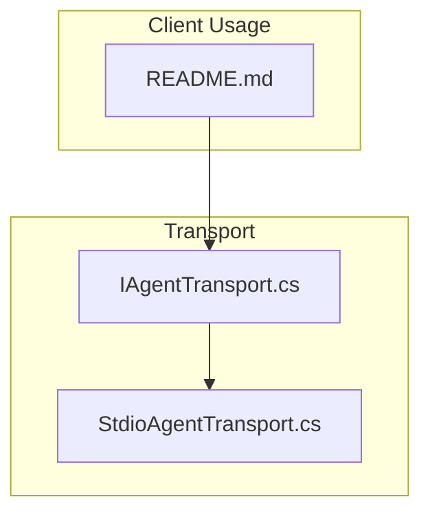
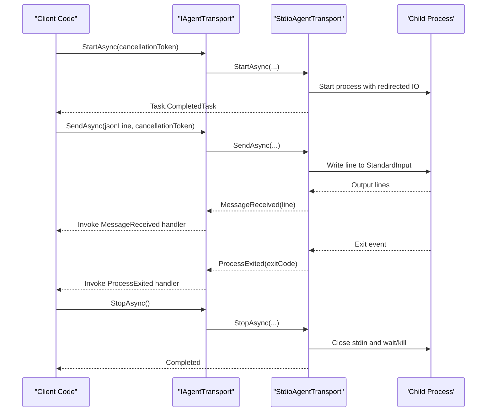
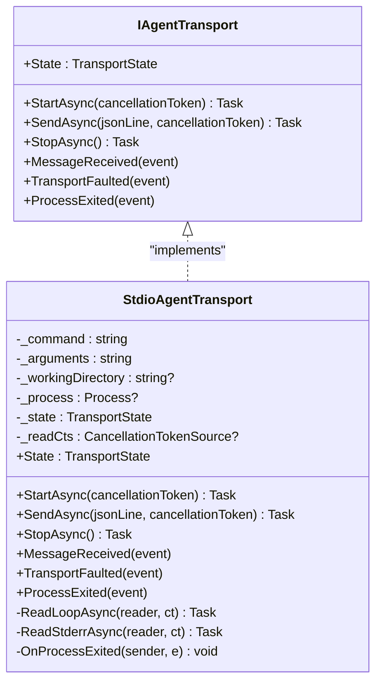
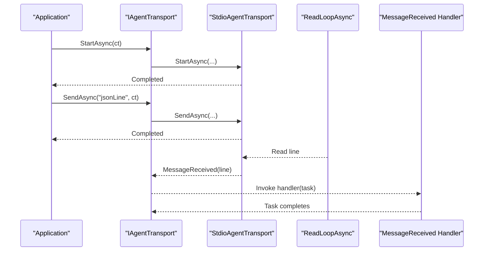
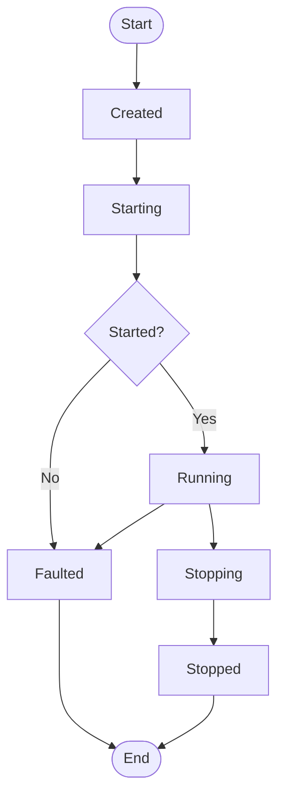
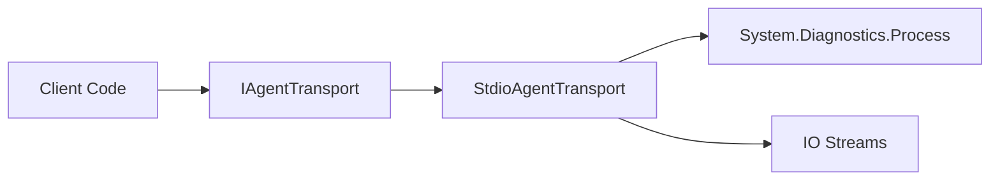

# IAgentTransport Interface

<cite>
**Referenced Files in This Document**
- [IAgentTransport.cs](file://Transport/IAgentTransport.cs)
- [StdioAgentTransport.cs](file://Transport/StdioAgentTransport.cs)
- [README.md](file://README.md)
</cite>

## Table of Contents
1. [Introduction](#introduction)
2. [Project Structure](#project-structure)
3. [Core Components](#core-components)
4. [Architecture Overview](#architecture-overview)
5. [Detailed Component Analysis](#detailed-component-analysis)
6. [Dependency Analysis](#dependency-analysis)
7. [Performance Considerations](#performance-considerations)
8. [Troubleshooting Guide](#troubleshooting-guide)
9. [Conclusion](#conclusion)
10. [Appendices](#appendices)

## Introduction
This document provides comprehensive documentation for the IAgentTransport interface, which defines the transport abstraction layer used to communicate with ACP-compliant agents over stdio using JSON-RPC. It covers all methods (StartAsync, SendAsync, StopAsync), event system (MessageReceived, TransportFaulted, ProcessExited), and the TransportState lifecycle enum. It also includes guidance on implementing custom transports, best practices for asynchronous operations, resource cleanup, and thread safety.

## Project Structure
The transport abstraction resides under the Transport namespace and is implemented by a concrete stdio-based transport. The client library uses this abstraction to start, send messages to, and stop agent processes.

**Diagram sources**
- [IAgentTransport.cs:1-39](file://Transport/IAgentTransport.cs#L1-L39)
- [StdioAgentTransport.cs:1-147](file://Transport/StdioAgentTransport.cs#L1-L147)
- [README.md:1-99](file://README.md#L1-L99)

**Section sources**
- [IAgentTransport.cs:1-39](file://Transport/IAgentTransport.cs#L1-L39)
- [StdioAgentTransport.cs:1-147](file://Transport/StdioAgentTransport.cs#L1-L147)
- [README.md:1-99](file://README.md#L1-L99)

## Core Components
- IAgentTransport: Defines the transport contract for starting, sending, stopping, and observing transport state and events.
- StdioAgentTransport: Concrete implementation that manages a child process via standard input/output/error streams.
- TransportState: Enumerates lifecycle states from creation through running to stopped or faulted.

Key responsibilities:
- StartAsync: Initialize and start the underlying transport (e.g., spawn a process).
- SendAsync: Send a single JSON-RPC message line to the transport.
- StopAsync: Gracefully shut down the transport and release resources.
- Events: MessageReceived, TransportFaulted, ProcessExited.
- State: Expose current lifecycle state.

**Section sources**
- [IAgentTransport.cs:6-28](file://Transport/IAgentTransport.cs#L6-L28)
- [StdioAgentTransport.cs:8-28](file://Transport/StdioAgentTransport.cs#L8-L28)

## Architecture Overview
The transport abstraction decouples the client from the underlying communication mechanism. The client calls StartAsync to initialize, then sends messages via SendAsync. Incoming messages are delivered through the MessageReceived event. Errors propagate via TransportFaulted, and process termination is signaled via ProcessExited. The State property reflects the current lifecycle.

**Diagram sources**
- [StdioAgentTransport.cs:30-59](file://Transport/StdioAgentTransport.cs#L30-L59)
- [StdioAgentTransport.cs:61-68](file://Transport/StdioAgentTransport.cs#L61-L68)
- [StdioAgentTransport.cs:95-118](file://Transport/StdioAgentTransport.cs#L95-L118)
- [StdioAgentTransport.cs:137-145](file://Transport/StdioAgentTransport.cs#L137-L145)
- [StdioAgentTransport.cs:70-93](file://Transport/StdioAgentTransport.cs#L70-L93)

## Detailed Component Analysis

### IAgentTransport Interface
- StartAsync(CancellationToken): Starts the transport. Supports cancellation during initialization. Returns a Task representing the operation.
- SendAsync(string jsonLine, CancellationToken): Sends a single JSON-RPC message line. Supports cancellation for async IO. Throws if the transport is not running.
- StopAsync(): Stops the transport and releases resources. No parameters; returns a Task.
- Events:
  - MessageReceived(Func<string, Task>): Invoked when a new message line arrives. The delegate receives the raw JSON line and should return a completed Task.
  - TransportFaulted(Func<Exception, Task>): Invoked when a transport-level error occurs. The delegate receives the exception and should return a completed Task.
  - ProcessExited(Func<int, Task>): Invoked when the underlying process exits. The delegate receives the exit code and should return a completed Task.
- State: TransportState property indicating current lifecycle state.

Lifecycle states (TransportState):
- Created: Initial state after construction.
- Starting: Initialization in progress.
- Running: Ready to send/receive messages.
- Stopping: Shutdown in progress.
- Stopped: Cleanly terminated.
- Faulted: An unrecoverable error occurred.

Best practices for implementers:
- Ensure idempotent StartAsync and StopAsync behavior.
- Propagate exceptions via TransportFaulted rather than throwing from background tasks.
- Update State transitions consistently and atomically where possible.
- Honor cancellation tokens in long-running operations.
- Avoid blocking calls in event handlers; offload work to background tasks if needed.

**Section sources**
- [IAgentTransport.cs:6-28](file://Transport/IAgentTransport.cs#L6-L28)
- [IAgentTransport.cs:30-38](file://Transport/IAgentTransport.cs#L30-L38)

### StdioAgentTransport Implementation
Responsibilities:
- Spawns a child process with redirected standard input/output/error streams.
- Reads output lines asynchronously and raises MessageReceived for each valid line.
- Handles errors by raising TransportFaulted.
- Subscribes to process exit events and raises ProcessExited with the exit code.
- Manages lifecycle state transitions and supports graceful shutdown.

Key behaviors:
- StartAsync sets state to Starting, starts the process, launches read loops for stdout/stderr, and transitions to Running.
- SendAsync validates the process is running and writes the JSON line to StandardInput with flush.
- StopAsync cancels read loops, closes stdin, waits for exit with timeout, and kills the process tree if necessary; finally sets state to Stopped.
- ReadLoopAsync reads lines until EOF or cancellation, invoking MessageReceived for non-empty lines. Exceptions are routed to TransportFaulted.
- OnProcessExited updates state to Stopped and invokes ProcessExited with the exit code.

Thread safety considerations:
- Event invocations occur from background tasks; ensure handlers are thread-safe.
- State changes occur across multiple threads; use appropriate synchronization if extending beyond the provided implementation.

Resource cleanup:
- Cancellation token source is used to stop read loops.
- Process handles are released via WaitForExitAsync and Kill when necessary.

**Section sources**
- [StdioAgentTransport.cs:8-28](file://Transport/StdioAgentTransport.cs#L8-L28)
- [StdioAgentTransport.cs:30-59](file://Transport/StdioAgentTransport.cs#L30-L59)
- [StdioAgentTransport.cs:61-68](file://Transport/StdioAgentTransport.cs#L61-L68)
- [StdioAgentTransport.cs:70-93](file://Transport/StdioAgentTransport.cs#L70-L93)
- [StdioAgentTransport.cs:95-118](file://Transport/StdioAgentTransport.cs#L95-L118)
- [StdioAgentTransport.cs:137-145](file://Transport/StdioAgentTransport.cs#L137-L145)

### Class Diagram

**Diagram sources**
- [IAgentTransport.cs:6-28](file://Transport/IAgentTransport.cs#L6-L28)
- [StdioAgentTransport.cs:8-28](file://Transport/StdioAgentTransport.cs#L8-L28)
- [StdioAgentTransport.cs:30-93](file://Transport/StdioAgentTransport.cs#L30-L93)
- [StdioAgentTransport.cs:95-145](file://Transport/StdioAgentTransport.cs#L95-L145)

### Sequence Diagram: Message Flow

**Diagram sources**
- [StdioAgentTransport.cs:30-59](file://Transport/StdioAgentTransport.cs#L30-L59)
- [StdioAgentTransport.cs:61-68](file://Transport/StdioAgentTransport.cs#L61-L68)
- [StdioAgentTransport.cs:95-118](file://Transport/StdioAgentTransport.cs#L95-L118)

### Flowchart: Lifecycle Transitions

**Diagram sources**
- [StdioAgentTransport.cs:30-59](file://Transport/StdioAgentTransport.cs#L30-L59)
- [StdioAgentTransport.cs:70-93](file://Transport/StdioAgentTransport.cs#L70-L93)
- [StdioAgentTransport.cs:137-145](file://Transport/StdioAgentTransport.cs#L137-L145)

## Dependency Analysis
- IAgentTransport depends only on System.Threading.Tasks and cancellation token primitives.
- StdioAgentTransport depends on System.Diagnostics.Process and stream readers/writers for IO.
- The client consumes IAgentTransport without knowing implementation details, enabling pluggable transports.

**Diagram sources**
- [StdioAgentTransport.cs:1-10](file://Transport/StdioAgentTransport.cs#L1-L10)
- [StdioAgentTransport.cs:34-51](file://Transport/StdioAgentTransport.cs#L34-L51)

**Section sources**
- [StdioAgentTransport.cs:1-10](file://Transport/StdioAgentTransport.cs#L1-L10)
- [StdioAgentTransport.cs:34-51](file://Transport/StdioAgentTransport.cs#L34-L51)

## Performance Considerations
- Use async IO exclusively; avoid blocking calls in event handlers.
- Buffering: Prefer line-oriented streaming to minimize memory usage.
- Cancellation: Always honor cancellation tokens to prevent hanging tasks.
- Error propagation: Raise TransportFaulted promptly to avoid silent failures.
- Resource management: Ensure proper disposal of streams and process handles.
- Concurrency: Keep event handlers lightweight; offload heavy processing to background tasks.

[No sources needed since this section provides general guidance]

## Troubleshooting Guide
Common issues and resolutions:
- Transport not running: SendAsync throws an InvalidOperationException if the transport is not in Running state. Ensure StartAsync has completed successfully before sending messages.
- Missing messages: Verify that MessageReceived is subscribed before StartAsync is called. Check that the underlying process outputs non-empty lines.
- Deadlocks: Avoid synchronous blocking in event handlers. Return quickly and perform work asynchronously.
- Process hangs on StopAsync: If the process does not exit within the timeout, it will be killed. Investigate whether the process is waiting for input or stuck.
- Faulted state: Inspect TransportFaulted exceptions to diagnose IO errors or invalid configurations.

**Section sources**
- [StdioAgentTransport.cs:61-68](file://Transport/StdioAgentTransport.cs#L61-L68)
- [StdioAgentTransport.cs:95-118](file://Transport/StdioAgentTransport.cs#L95-L118)
- [StdioAgentTransport.cs:70-93](file://Transport/StdioAgentTransport.cs#L70-L93)

## Conclusion
IAgentTransport provides a clean, extensible abstraction for transporting JSON-RPC messages to ACP agents. Its well-defined lifecycle, robust event system, and cancellation support enable reliable, high-performance implementations. StdioAgentTransport demonstrates best practices for process management, streaming IO, and error handling. Implementers can build custom transports while adhering to these patterns to maintain consistency and reliability.

[No sources needed since this section summarizes without analyzing specific files]

## Appendices

### API Reference Summary
- Methods:
  - StartAsync(CancellationToken): Initializes and starts the transport.
  - SendAsync(string, CancellationToken): Sends a JSON-RPC message line.
  - StopAsync(): Stops the transport and releases resources.
- Events:
  - MessageReceived(Func<string, Task>): Delivers incoming message lines.
  - TransportFaulted(Func<Exception, Task>): Reports transport-level errors.
  - ProcessExited(Func<int, Task>): Reports process termination with exit code.
- State:
  - TransportState: Created, Starting, Running, Stopping, Stopped, Faulted.

**Section sources**
- [IAgentTransport.cs:6-28](file://Transport/IAgentTransport.cs#L6-L28)
- [IAgentTransport.cs:30-38](file://Transport/IAgentTransport.cs#L30-L38)

### Example Usage Pattern
- Create a transport instance.
- Subscribe to MessageReceived, TransportFaulted, and ProcessExited.
- Call StartAsync with a cancellation token.
- Send messages via SendAsync.
- Handle events for incoming data, errors, and process exit.
- Call StopAsync to cleanly shut down.

**Section sources**
- [README.md:15-33](file://README.md#L15-L33)