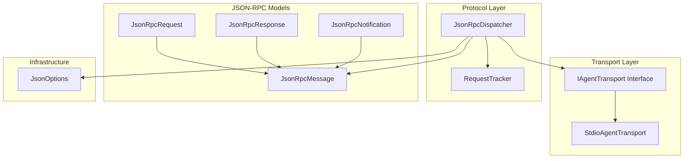
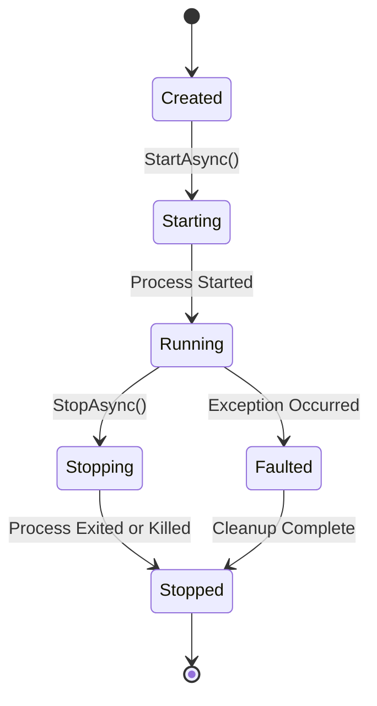
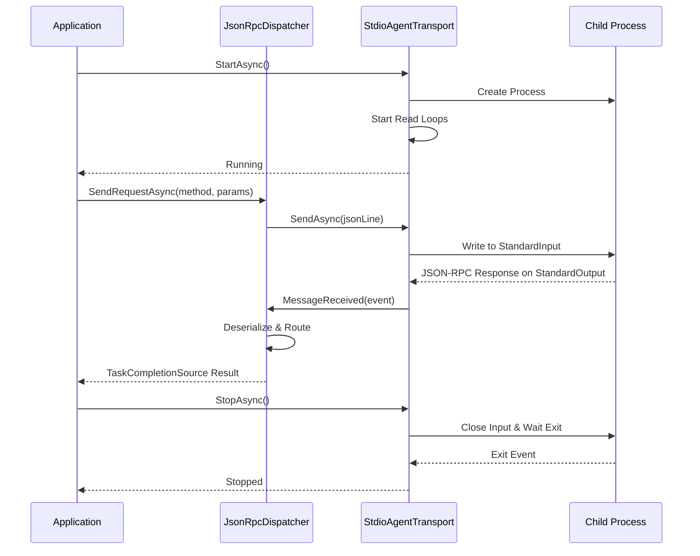
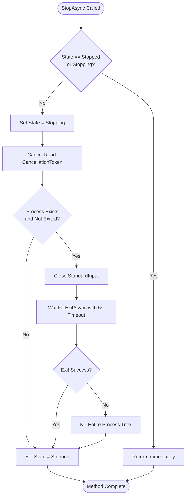
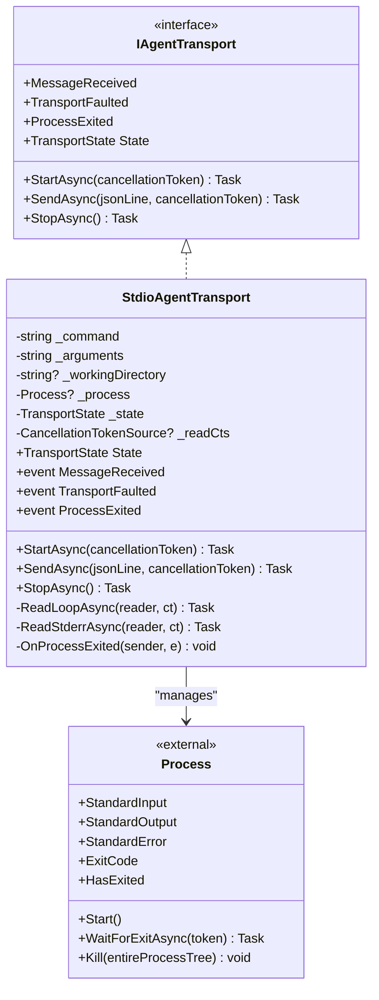
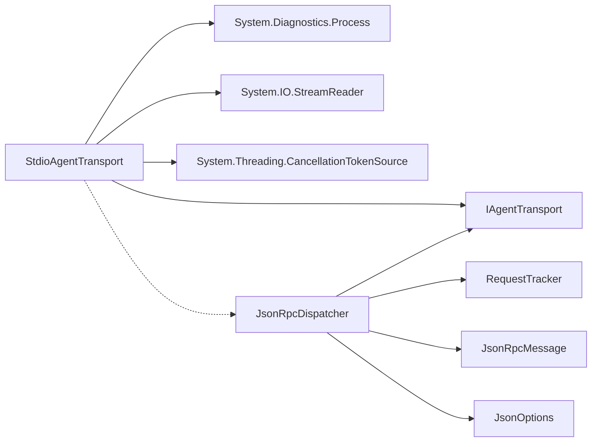

# StdioAgentTransport Implementation

<cite>
**Referenced Files in This Document**
- [StdioAgentTransport.cs](file://Transport/StdioAgentTransport.cs)
- [IAgentTransport.cs](file://Transport/IAgentTransport.cs)
- [JsonRpcDispatcher.cs](file://Protocol/JsonRpcDispatcher.cs)
- [JsonRpcMessage.cs](file://JsonRpc/JsonRpcMessage.cs)
- [JsonRpcRequest.cs](file://JsonRpc/JsonRpcRequest.cs)
- [JsonRpcResponse.cs](file://JsonRpc/JsonRpcResponse.cs)
- [JsonRpcNotification.cs](file://JsonRpc/JsonRpcNotification.cs)
- [JsonOptions.cs](file://Infrastructure/JsonOptions.cs)
- [RequestTracker.cs](file://Protocol/RequestTracker.cs)
- [README.md](file://README.md)
</cite>

## Table of Contents
1. [Introduction](#introduction)
2. [Project Structure](#project-structure)
3. [Core Components](#core-components)
4. [Architecture Overview](#architecture-overview)
5. [Detailed Component Analysis](#detailed-component-analysis)
6. [Dependency Analysis](#dependency-analysis)
7. [Performance Considerations](#performance-considerations)
8. [Troubleshooting Guide](#troubleshooting-guide)
9. [Conclusion](#conclusion)

## Introduction

The StdioAgentTransport is a .NET implementation that enables communication with external agent processes through standard input/output streams using JSON-RPC protocol. This transport layer provides process lifecycle management, stream handling, and error management for seamless integration between the host application and child processes.

The implementation follows a clean architecture pattern where the transport layer abstracts the underlying process communication mechanism, allowing for different transport implementations (stdio, mock, etc.) while maintaining a consistent interface for higher-level components.

## Project Structure

The StdioAgentTransport implementation is part of a larger ACP (Agent Client Protocol) library that provides a complete solution for agent communication. The key components are organized as follows:

**Diagram sources**
- [IAgentTransport.cs:6-28](file://Transport/IAgentTransport.cs#L6-L28)
- [StdioAgentTransport.cs:8-28](file://Transport/StdioAgentTransport.cs#L8-L28)
- [JsonRpcDispatcher.cs:9-25](file://Protocol/JsonRpcDispatcher.cs#L9-L25)

**Section sources**
- [StdioAgentTransport.cs:1-147](file://Transport/StdioAgentTransport.cs#L1-L147)
- [IAgentTransport.cs:1-39](file://Transport/IAgentTransport.cs#L1-L39)

## Core Components

### StdioAgentTransport Class

The `StdioAgentTransport` class implements the `IAgentTransport` interface and serves as the primary component for managing child process communication via standard I/O streams.

#### Key Responsibilities:
- **Process Lifecycle Management**: Spawning, monitoring, and terminating child processes
- **Stream Handling**: Managing stdin/stdout/stderr streams for JSON-RPC message transmission
- **State Management**: Tracking transport state transitions (Created → Starting → Running → Stopping → Stopped)
- **Event Publishing**: Raising events for message reception, transport faults, and process exit

#### Process Configuration:
- **Command Execution**: Configurable executable path and command-line arguments
- **Working Directory**: Optional working directory specification for child process context
- **Encoding**: UTF-8 encoding for all I/O operations to ensure proper character handling
- **Security**: Shell execution disabled for security; direct process creation

**Section sources**
- [StdioAgentTransport.cs:23-28](file://Transport/StdioAgentTransport.cs#L23-L28)
- [StdioAgentTransport.cs:34-46](file://Transport/StdioAgentTransport.cs#L34-L46)

### Transport State Management

The transport implements a robust state machine to manage the lifecycle of the transport instance and underlying process:

**Diagram sources**
- [IAgentTransport.cs:30-38](file://Transport/IAgentTransport.cs#L30-L38)
- [StdioAgentTransport.cs:14](file://Transport/StdioAgentTransport.cs#L14)

**Section sources**
- [IAgentTransport.cs:30-38](file://Transport/IAgentTransport.cs#L30-L38)

## Architecture Overview

The StdioAgentTransport operates within a layered architecture that separates concerns between transport, protocol, and business logic:

**Diagram sources**
- [StdioAgentTransport.cs:30-58](file://Transport/StdioAgentTransport.cs#L30-L58)
- [JsonRpcDispatcher.cs:27-47](file://Protocol/JsonRpcDispatcher.cs#L27-L47)

**Section sources**
- [JsonRpcDispatcher.cs:21-25](file://Protocol/JsonRpcDispatcher.cs#L21-L25)
- [StdioAgentTransport.cs:95-118](file://Transport/StdioAgentTransport.cs#L95-L118)

## Detailed Component Analysis

### Process Lifecycle Management

The StdioAgentTransport manages the complete lifecycle of child processes through several key methods:

#### Process Spawning (`StartAsync`)
- Creates a new `ProcessStartInfo` with configured command, arguments, and working directory
- Configures stream redirection for stdin, stdout, and stderr
- Sets UTF-8 encoding for proper character handling
- Subscribes to process exit events
- Starts background read loops for output streams
- Updates transport state to Running

#### Process Termination (`StopAsync`)
- Implements graceful shutdown with timeout handling
- Closes standard input to signal EOF to child process
- Waits for process exit with 5-second timeout
- Falls back to forceful termination if graceful shutdown fails
- Updates transport state to Stopped

**Diagram sources**
- [StdioAgentTransport.cs:70-93](file://Transport/StdioAgentTransport.cs#L70-L93)

**Section sources**
- [StdioAgentTransport.cs:30-58](file://Transport/StdioAgentTransport.cs#L30-L58)
- [StdioAgentTransport.cs:70-93](file://Transport/StdioAgentTransport.cs#L70-L93)

### Stream Processing and JSON-RPC Communication

The transport handles bidirectional JSON-RPC communication through asynchronous stream processing:

#### Output Stream Reading (`ReadLoopAsync`)
- Continuously reads lines from standard output
- Filters out empty or whitespace-only lines
- Invokes `MessageReceived` event for valid JSON-RPC messages
- Handles cancellation and exceptions gracefully
- Terminates on EOF (null line)

#### Error Stream Monitoring (`ReadStderrAsync`)
- Monitors standard error stream for diagnostic information
- Currently ignores stderr content but maintains monitoring capability
- Provides foundation for future error logging and diagnostics

#### Message Transmission (`SendAsync`)
- Validates transport state before sending
- Writes JSON-RPC messages to standard input
- Ensures proper flushing to guarantee delivery
- Supports cancellation tokens for responsive operations

**Diagram sources**
- [StdioAgentTransport.cs:8-28](file://Transport/StdioAgentTransport.cs#L8-L28)
- [IAgentTransport.cs:6-28](file://Transport/IAgentTransport.cs#L6-L28)

**Section sources**
- [StdioAgentTransport.cs:95-118](file://Transport/StdioAgentTransport.cs#L95-L118)
- [StdioAgentTransport.cs:120-135](file://Transport/StdioAgentTransport.cs#L120-L135)
- [StdioAgentTransport.cs:61-68](file://Transport/StdioAgentTransport.cs#L61-L68)

### Event System and Error Handling

The transport implements a comprehensive event-driven architecture for handling various scenarios:

#### Event Types:
- **MessageReceived**: Fired when JSON-RPC messages are received from the child process
- **TransportFaulted**: Fired when transport-level errors occur (stream exceptions, etc.)
- **ProcessExited**: Fired when the child process terminates, providing exit code

#### Error Handling Strategies:
- **OperationCanceledException**: Handled gracefully during normal shutdown
- **General Exceptions**: Captured and forwarded via TransportFaulted event
- **Process Exit Codes**: Propagated through ProcessExited event for application handling

**Section sources**
- [StdioAgentTransport.cs:19-21](file://Transport/StdioAgentTransport.cs#L19-L21)
- [StdioAgentTransport.cs:137-145](file://Transport/StdioAgentTransport.cs#L137-L145)

## Dependency Analysis

The StdioAgentTransport has minimal dependencies, promoting loose coupling and testability:

**Diagram sources**
- [StdioAgentTransport.cs:1-2](file://Transport/StdioAgentTransport.cs#L1-L2)
- [JsonRpcDispatcher.cs:1-5](file://Protocol/JsonRpcDispatcher.cs#L1-L5)

### External Dependencies:
- **System.Diagnostics**: For process management
- **System.IO**: For stream operations
- **System.Threading**: For async operations and cancellation

### Internal Dependencies:
- **IAgentTransport**: Interface contract for transport abstraction
- **JsonRpcModels**: JSON-RPC message types for serialization/deserialization
- **JsonOptions**: Shared JSON serialization configuration

**Section sources**
- [StdioAgentTransport.cs:1-2](file://Transport/StdioAgentTransport.cs#L1-L2)
- [JsonRpcDispatcher.cs:1-5](file://Protocol/JsonRpcDispatcher.cs#L1-L5)

## Performance Considerations

### Buffer Management
- **Stream-based Processing**: Uses streaming I/O to minimize memory footprint
- **Line-by-line Processing**: Processes messages one line at a time to avoid large buffer allocations
- **UTF-8 Encoding**: Efficient encoding for international character support

### Concurrent Stream Processing
- **Asynchronous Operations**: All I/O operations use async patterns to prevent blocking
- **Background Tasks**: Separate tasks for reading stdout and stderr streams
- **Cancellation Support**: Proper cancellation token propagation for responsive shutdown

### Memory Optimization
- **Minimal Object Allocation**: Reuses existing objects where possible
- **Efficient String Handling**: Uses string interpolation and avoids unnecessary conversions
- **Proper Resource Disposal**: Implements cleanup patterns for process resources

### Threading Model
- **Single-threaded Event Handlers**: Events are invoked synchronously from reader threads
- **Task-based Concurrency**: Uses Task.Run for background operations
- **Thread-safe State Management**: Uses appropriate synchronization for shared state

## Troubleshooting Guide

### Common Issues and Solutions

#### Process Crashes
**Symptoms**: Unexpected process termination, missing responses
**Diagnosis**: 
- Monitor `ProcessExited` event for exit codes
- Check stderr stream for error messages
- Verify process permissions and working directory

**Solutions**:
- Implement proper error handling in child processes
- Use structured logging in both host and child processes
- Add health check mechanisms

#### Stream Deadlocks
**Symptoms**: Application hangs, no messages received
**Causes**:
- Insufficient buffer sizes
- Improper stream closing order
- Blocking operations in message handlers

**Solutions**:
- Ensure non-blocking message processing
- Implement proper stream disposal
- Use timeouts for long-running operations

#### Memory Leaks
**Symptoms**: Increasing memory usage over time
**Causes**:
- Unclosed streams or processes
- Event handler subscriptions not cleaned up
- Large message buffers

**Solutions**:
- Implement proper resource disposal patterns
- Use using statements for temporary resources
- Monitor memory usage with profiling tools

### Debugging Techniques

#### Logging Strategy
- Enable verbose logging for transport operations
- Log JSON-RPC messages for protocol debugging
- Track process lifecycle events

#### Diagnostic Tools
- Use process monitors to observe child process behavior
- Implement health check endpoints
- Add performance counters for metrics collection

#### Testing Approaches
- Mock transport implementations for unit testing
- Integration tests with real processes
- Load testing for performance validation

**Section sources**
- [StdioAgentTransport.cs:137-145](file://Transport/StdioAgentTransport.cs#L137-L145)
- [StdioAgentTransport.cs:113-117](file://Transport/StdioAgentTransport.cs#L113-L117)

## Conclusion

The StdioAgentTransport provides a robust, efficient, and maintainable implementation for process-based communication using standard I/O streams. Its design emphasizes separation of concerns, proper resource management, and comprehensive error handling.

Key strengths include:
- Clean abstraction over process management
- Asynchronous stream processing for optimal performance
- Comprehensive event system for extensibility
- Robust error handling and recovery mechanisms

The implementation serves as a solid foundation for building reliable agent communication systems while maintaining flexibility for different transport implementations and use cases.

Future enhancements could include:
- Connection pooling for multiple process instances
- Advanced retry and circuit breaker patterns
- Enhanced diagnostic capabilities
- Support for additional transport protocols