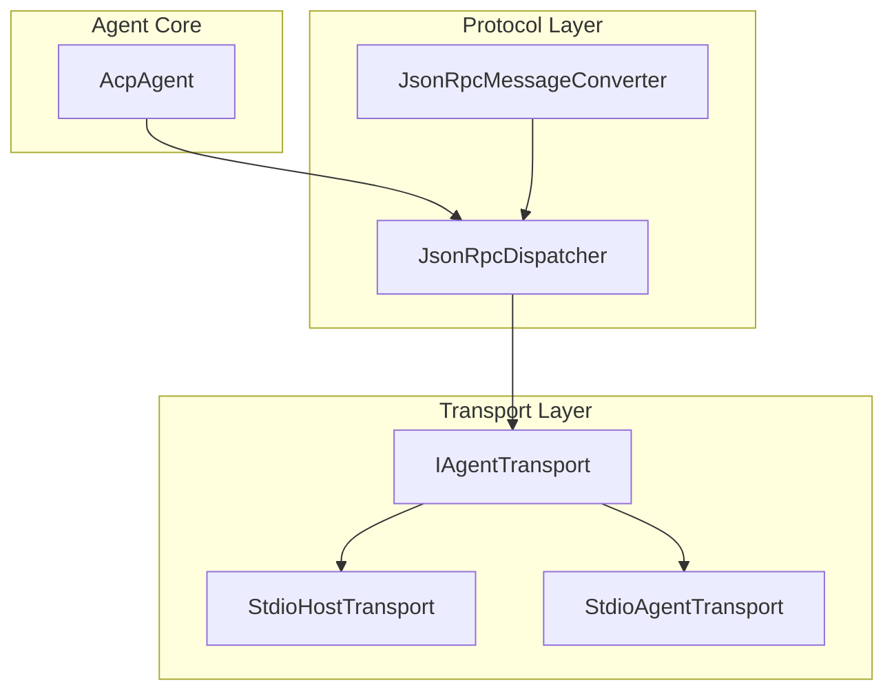
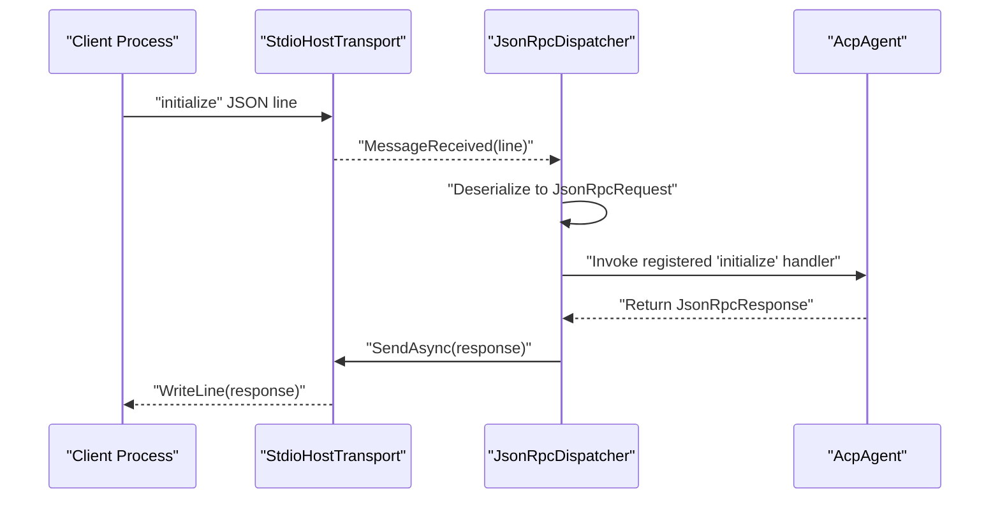
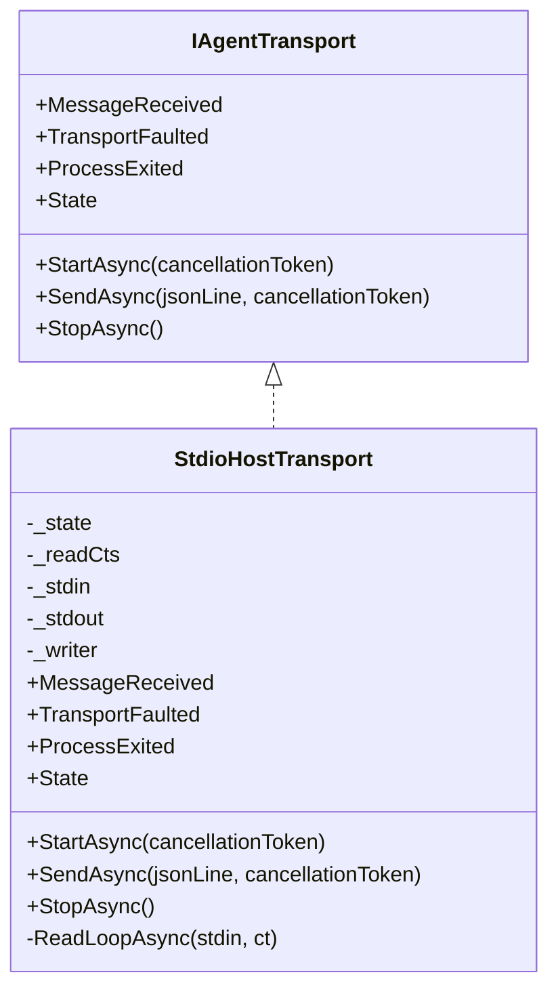
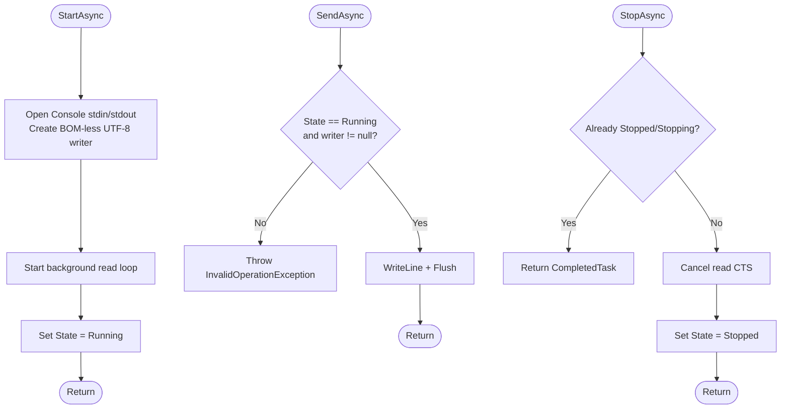
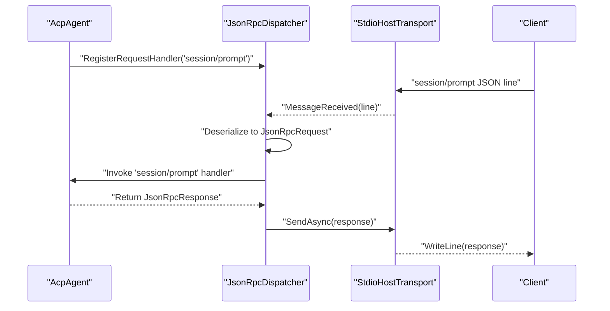
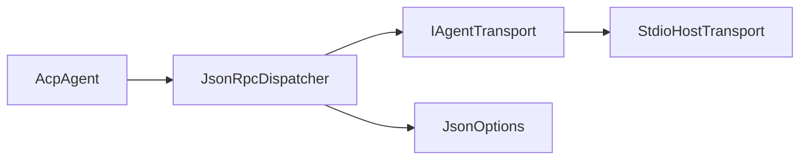

# StdioHostTransport Implementation

<cite>
**Referenced Files in This Document**
- [StdioHostTransport.cs](file://Transport/StdioHostTransport.cs)
- [IAgentTransport.cs](file://Transport/IAgentTransport.cs)
- [StdioAgentTransport.cs](file://Transport/StdioAgentTransport.cs)
- [AcpAgent.cs](file://Agent/AcpAgent.cs)
- [ServiceCollectionExtensions.cs](file://Infrastructure/ServiceCollectionExtensions.cs)
- [JsonRpcDispatcher.cs](file://Protocol/JsonRpcDispatcher.cs)
- [JsonRpcMessageConverter.cs](file://JsonRpc/JsonRpcMessageConverter.cs)
- [README.md](file://README.md)
- [Program.cs](file://samples/MockAgent/Program.cs)
</cite>

## Table of Contents
1. [Introduction](#introduction)
2. [Project Structure](#project-structure)
3. [Core Components](#core-components)
4. [Architecture Overview](#architecture-overview)
5. [Detailed Component Analysis](#detailed-component-analysis)
6. [Dependency Analysis](#dependency-analysis)
7. [Performance Considerations](#performance-considerations)
8. [Troubleshooting Guide](#troubleshooting-guide)
9. [Conclusion](#conclusion)

## Introduction
This document explains the StdioHostTransport implementation used by the ACP Agent side to communicate over the process’s own standard input and output streams. It covers how the transport integrates with the JSON-RPC dispatcher, lifecycle management, eventing, and error handling. It also contrasts it with the client-side StdioAgentTransport that launches a child process.

## Project Structure
The transport layer is defined under the Transport namespace and provides two implementations:
- StdioHostTransport: for the agent process itself (uses Console stdin/stdout).
- StdioAgentTransport: for the client process (launches and communicates with an agent subprocess).

**Diagram sources**
- [IAgentTransport.cs:1-39](file://Transport/IAgentTransport.cs#L1-L39)
- [StdioHostTransport.cs:1-91](file://Transport/StdioHostTransport.cs#L1-L91)
- [StdioAgentTransport.cs:1-150](file://Transport/StdioAgentTransport.cs#L1-L150)
- [JsonRpcDispatcher.cs:1-124](file://Protocol/JsonRpcDispatcher.cs#L1-L124)
- [JsonRpcMessageConverter.cs:1-73](file://JsonRpc/JsonRpcMessageConverter.cs#L1-L73)
- [AcpAgent.cs:1-309](file://Agent/AcpAgent.cs#L1-L309)

**Section sources**
- [README.md:1-193](file://README.md#L1-L193)

## Core Components
- IAgentTransport defines the transport contract: StartAsync, SendAsync, StopAsync, events (MessageReceived, TransportFaulted, ProcessExited), and State.
- StdioHostTransport implements IAgentTransport for the agent process using Console streams.
- JsonRpcDispatcher wires MessageReceived to deserialize messages and route them to registered handlers.
- AcpAgent registers protocol methods and uses the transport via the dispatcher.

Key responsibilities:
- StdioHostTransport: manage stream lifetimes, read loop, cancellation, and state transitions.
- JsonRpcDispatcher: serialize/deserialize JSON-RPC messages and coordinate request/response tracking.
- AcpAgent: orchestrate transport start, handler registration, session lifecycle, and graceful shutdown.

**Section sources**
- [IAgentTransport.cs:1-39](file://Transport/IAgentTransport.cs#L1-L39)
- [StdioHostTransport.cs:1-91](file://Transport/StdioHostTransport.cs#L1-L91)
- [JsonRpcDispatcher.cs:1-124](file://Protocol/JsonRpcDispatcher.cs#L1-L124)
- [AcpAgent.cs:1-309](file://Agent/AcpAgent.cs#L1-L309)

## Architecture Overview
At runtime, the agent process runs AcpAgent, which:
- Starts StdioHostTransport.
- Connects JsonRpcDispatcher to the transport.
- Registers method handlers for initialize, session/new, session/prompt, and session/cancel.
- Uses the transport to send responses and notifications.

**Diagram sources**
- [StdioHostTransport.cs:23-46](file://Transport/StdioHostTransport.cs#L23-L46)
- [JsonRpcDispatcher.cs:21-47](file://Protocol/JsonRpcDispatcher.cs#L21-L47)
- [AcpAgent.cs:44-84](file://Agent/AcpAgent.cs#L44-L84)

## Detailed Component Analysis

### StdioHostTransport
StdioHostTransport is a sealed class implementing IAgentTransport. It reads lines from Console.StandardInput and writes lines to Console.StandardOutput. It exposes events for incoming messages, transport faults, and process exit detection.

Key behaviors:
- StartAsync opens Console streams, creates a BOM-less UTF-8 StreamWriter, starts a background read loop, and sets state to Running.
- SendAsync validates running state and writes a single JSON line with AutoFlush enabled.
- StopAsync cancels the read loop and sets state to Stopped.
- ReadLoopAsync continuously reads lines, skips empty lines, raises MessageReceived, and on EOF raises ProcessExited(0). Exceptions are raised via TransportFaulted.

State machine:
- Created → Starting → Running → Stopping → Stopped
- Faulted state exists in enum but is not set by this implementation; errors are surfaced through TransportFaulted.

**Diagram sources**
- [IAgentTransport.cs:1-39](file://Transport/IAgentTransport.cs#L1-L39)
- [StdioHostTransport.cs:1-91](file://Transport/StdioHostTransport.cs#L1-L91)

**Diagram sources**
- [StdioHostTransport.cs:23-58](file://Transport/StdioHostTransport.cs#L23-L58)

Integration points:
- AcpAgent subscribes to ProcessExited to detect client disconnect and triggers StopAsync.
- JsonRpcDispatcher subscribes to MessageReceived to deserialize and dispatch messages.

**Section sources**
- [StdioHostTransport.cs:1-91](file://Transport/StdioHostTransport.cs#L1-L91)
- [AcpAgent.cs:44-57](file://Agent/AcpAgent.cs#L44-L57)
- [JsonRpcDispatcher.cs:21-25](file://Protocol/JsonRpcDispatcher.cs#L21-L25)

### Contrast with StdioAgentTransport
StdioAgentTransport is used by clients to launch and communicate with an agent subprocess. Differences include:
- Launches a new process with redirected stdio and explicit encodings.
- Reads both stdout and stderr concurrently.
- Handles process exit events and supports graceful stop with timeout and forced kill.

This contrast clarifies when to use each transport:
- Use StdioHostTransport inside the agent process.
- Use StdioAgentTransport inside the client process.

**Section sources**
- [StdioAgentTransport.cs:1-150](file://Transport/StdioAgentTransport.cs#L1-L150)

### Dispatcher and Message Flow
JsonRpcDispatcher connects to a transport, serializes requests/notifications, and deserializes incoming messages. It tracks pending requests and completes them upon receiving matching responses.

**Diagram sources**
- [JsonRpcDispatcher.cs:86-122](file://Protocol/JsonRpcDispatcher.cs#L86-L122)
- [AcpAgent.cs:113-152](file://Agent/AcpAgent.cs#L113-L152)
- [StdioHostTransport.cs:39-46](file://Transport/StdioHostTransport.cs#L39-L46)

### DI Registration
ServiceCollectionExtensions registers StdioHostTransport as IAgentTransport for agents, along with JsonRpcDispatcher and RequestTracker.

**Section sources**
- [ServiceCollectionExtensions.cs:28-38](file://Infrastructure/ServiceCollectionExtensions.cs#L28-L38)

## Dependency Analysis
- StdioHostTransport depends only on System.IO and System.Text for stream operations.
- JsonRpcDispatcher depends on IAgentTransport and JsonOptions for serialization.
- AcpAgent depends on IAgentTransport indirectly via JsonRpcDispatcher and directly for lifecycle events.
- ServiceCollectionExtensions binds interfaces to concrete implementations.

**Diagram sources**
- [AcpAgent.cs:1-43](file://Agent/AcpAgent.cs#L1-L43)
- [JsonRpcDispatcher.cs:1-19](file://Protocol/JsonRpcDispatcher.cs#L1-L19)
- [ServiceCollectionExtensions.cs:28-38](file://Infrastructure/ServiceCollectionExtensions.cs#L28-L38)

**Section sources**
- [AcpAgent.cs:1-43](file://Agent/AcpAgent.cs#L1-L43)
- [JsonRpcDispatcher.cs:1-19](file://Protocol/JsonRpcDispatcher.cs#L1-L19)
- [ServiceCollectionExtensions.cs:28-38](file://Infrastructure/ServiceCollectionExtensions.cs#L28-L38)

## Performance Considerations
- Single-line framing: Messages are one JSON per line, minimizing buffering overhead and simplifying parsing.
- BOM-less UTF-8: Avoids BOM corruption on first message and ensures compatibility with strict clients.
- AutoFlush on writer: Ensures low latency at the cost of increased I/O calls; acceptable for interactive protocols.
- Background read loop: Non-blocking reads keep the main thread responsive; cancellation token enables clean shutdown.
- Concurrent stderr reading (in StdioAgentTransport): Prevents backpressure issues; StdioHostTransport does not need this since it uses the host’s own streams.

[No sources needed since this section provides general guidance]

## Troubleshooting Guide
Common issues and resolutions:
- “Transport is not running.” during SendAsync: Ensure StartAsync has been called and State is Running before sending messages.
- No messages received: Verify that the client is writing valid JSON-RPC lines to stdin and that the agent is subscribed to MessageReceived via the dispatcher.
- Unexpected termination: On EOF from stdin, ProcessExited is raised; handle this to gracefully stop the agent.
- Encoding problems: Confirm that writers/readers use BOM-less UTF-8 where required; avoid Console.WriteLine in the agent’s stdout.

Operational tips:
- Log diagnostics to stderr only; stdout must remain pure JSON-RPC.
- Use CancellationToken propagation to cancel long-running operations during shutdown.
- Inspect TransportFaulted events for underlying IO exceptions.

**Section sources**
- [StdioHostTransport.cs:39-46](file://Transport/StdioHostTransport.cs#L39-L46)
- [StdioHostTransport.cs:60-89](file://Transport/StdioHostTransport.cs#L60-L89)
- [README.md:85-86](file://README.md#L85-L86)

## Conclusion
StdioHostTransport provides a minimal, robust transport for the ACP agent process, leveraging the host’s stdin/stdout with clear lifecycle management and event-driven messaging. It integrates seamlessly with JsonRpcDispatcher and AcpAgent to implement the full ACP protocol over stdio. For client scenarios, StdioAgentTransport offers complementary functionality for launching and communicating with agent processes.