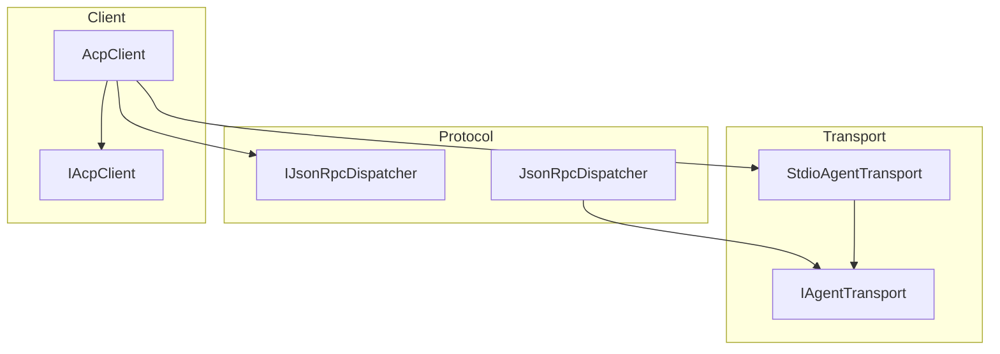
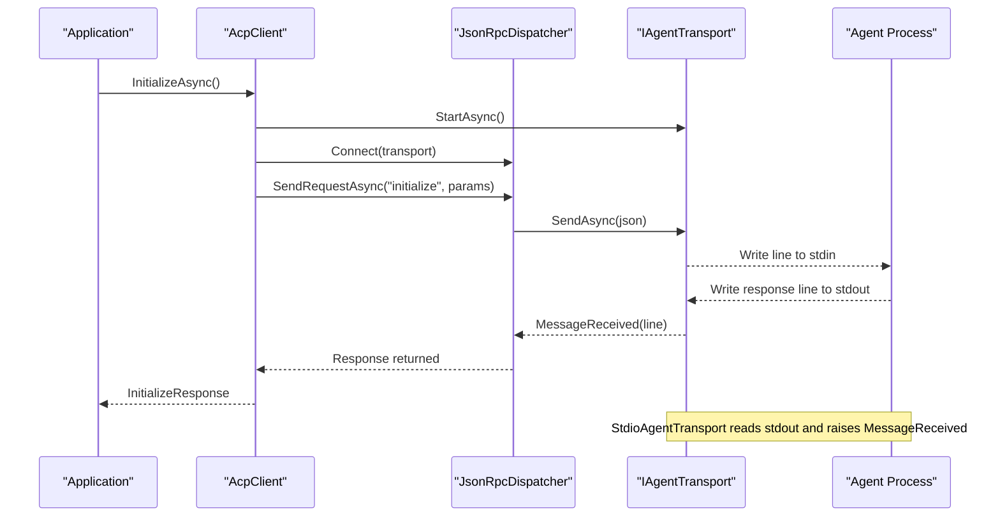
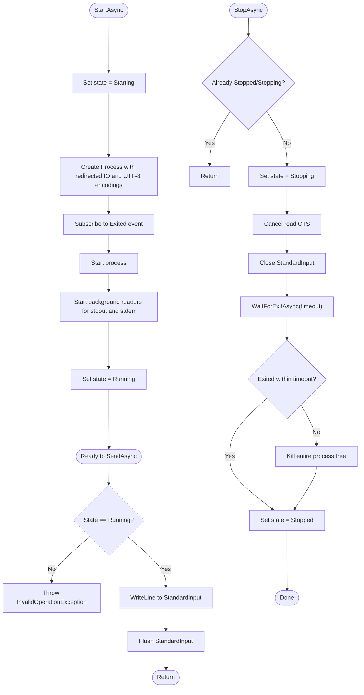
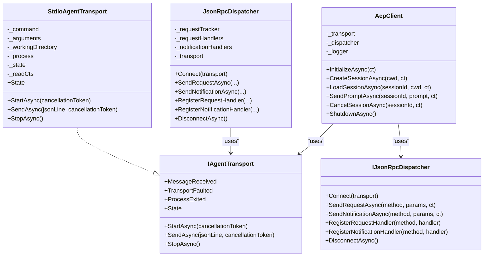

# Transport Layer

<cite>
**Referenced Files in This Document**
- [IAgentTransport.cs](file://Transport/IAgentTransport.cs)
- [StdioAgentTransport.cs](file://Transport/StdioAgentTransport.cs)
- [JsonRpcDispatcher.cs](file://Protocol/JsonRpcDispatcher.cs)
- [IJsonRpcDispatcher.cs](file://Protocol/IJsonRpcDispatcher.cs)
- [AcpClient.cs](file://Client/AcpClient.cs)
- [IAcpClient.cs](file://Client/IAcpClient.cs)
- [README.md](file://README.md)
</cite>

## Table of Contents
1. [Introduction](#introduction)
2. [Project Structure](#project-structure)
3. [Core Components](#core-components)
4. [Architecture Overview](#architecture-overview)
5. [Detailed Component Analysis](#detailed-component-analysis)
6. [Dependency Analysis](#dependency-analysis)
7. [Performance Considerations](#performance-considerations)
8. [Troubleshooting Guide](#troubleshooting-guide)
9. [Conclusion](#conclusion)

## Introduction
This document explains the transport layer abstraction and its implementation used to communicate with ACP-compliant agents over a child process’s standard input/output streams using JSON-RPC. It focuses on:
- The IAgentTransport interface design and responsibilities
- The StdioAgentTransport implementation for process lifecycle, stream handling, and error propagation
- How to create custom transports by implementing IAgentTransport
- Connection establishment, message streaming, graceful shutdown, performance considerations, resource cleanup, and debugging techniques

## Project Structure
The transport layer is defined under the Transport namespace and integrated with the protocol and client layers:
- Transport: IAgentTransport (interface), StdioAgentTransport (implementation)
- Protocol: JsonRpcDispatcher (connects to transport, routes messages)
- Client: AcpClient (orchestrates initialization, sessions, and lifecycle)

**Diagram sources**
- [IAgentTransport.cs](file://Transport/IAgentTransport.cs)
- [StdioAgentTransport.cs](file://Transport/StdioAgentTransport.cs)
- [IJsonRpcDispatcher.cs](file://Protocol/IJsonRpcDispatcher.cs)
- [JsonRpcDispatcher.cs](file://Protocol/JsonRpcDispatcher.cs)
- [IAcpClient.cs](file://Client/IAcpClient.cs)
- [AcpClient.cs](file://Client/AcpClient.cs)

**Section sources**
- [README.md](file://README.md)

## Core Components
- IAgentTransport: Defines the contract for starting/stopping a transport, sending messages, and exposing events for incoming messages, transport faults, and process exit.
- StdioAgentTransport: Implements IAgentTransport by spawning a child process, wiring stdin/stdout/stderr, and managing lifecycle states.
- JsonRpcDispatcher: Connects to an IAgentTransport, serializes/deserializes JSON-RPC messages, and dispatches requests/notifications to handlers.
- AcpClient: Orchestrates transport start, dispatcher connection, handler registration, and lifecycle methods like InitializeAsync and ShutdownAsync.

Key responsibilities:
- Abstraction of communication mechanisms via IAgentTransport
- Process lifecycle management and stream handling in StdioAgentTransport
- Message routing and request/response tracking in JsonRpcDispatcher
- High-level client operations and event exposure in AcpClient

**Section sources**
- [IAgentTransport.cs](file://Transport/IAgentTransport.cs)
- [StdioAgentTransport.cs](file://Transport/StdioAgentTransport.cs)
- [JsonRpcDispatcher.cs](file://Protocol/JsonRpcDispatcher.cs)
- [AcpClient.cs](file://Client/AcpClient.cs)

## Architecture Overview
The transport layer sits between the client and the agent process. The client uses a dispatcher that connects to a transport. The transport abstracts how messages are sent and received. In the stdio implementation, a child process is spawned and lines are read/written over standard streams.

**Diagram sources**
- [AcpClient.cs](file://Client/AcpClient.cs)
- [JsonRpcDispatcher.cs](file://Protocol/JsonRpcDispatcher.cs)
- [IAgentTransport.cs](file://Transport/IAgentTransport.cs)
- [StdioAgentTransport.cs](file://Transport/StdioAgentTransport.cs)

## Detailed Component Analysis

### IAgentTransport Interface Design
Purpose:
- Abstracts any transport mechanism (stdio, mock, or future implementations) behind a consistent API.
- Provides lifecycle control (StartAsync, StopAsync).
- Exposes asynchronous message sending (SendAsync).
- Emits events for incoming messages, transport faults, and process exit.

Key members:
- StartAsync: Starts the underlying transport (e.g., spawn a process).
- SendAsync: Sends a single JSON-RPC line.
- MessageReceived: Event raised when a raw JSON line arrives from the peer.
- TransportFaulted: Event raised when the transport encounters an error.
- ProcessExited: Event raised when the underlying process exits, providing the exit code.
- StopAsync: Stops the transport gracefully.
- State: Current state of the transport (Created, Starting, Running, Stopping, Stopped, Faulted).

Design notes:
- Events use async delegates to allow non-blocking handling.
- State enum enables callers to guard operations based on lifecycle.
- CancellationToken support allows cancellation of long-running operations.

**Section sources**
- [IAgentTransport.cs](file://Transport/IAgentTransport.cs)

### StdioAgentTransport Implementation
Responsibilities:
- Spawns a child process with configurable command, arguments, and working directory.
- Redirects stdin, stdout, stderr; sets UTF-8 encoding.
- Reads stdout asynchronously and raises MessageReceived for each line.
- Subscribes to process exit to raise ProcessExited with the exit code.
- Handles errors during reading by raising TransportFaulted.
- Manages lifecycle states and ensures safe shutdown.

Process lifecycle:
- StartAsync:
  - Sets state to Starting.
  - Configures ProcessStartInfo with FileName, Arguments, WorkingDirectory, redirections, and encodings.
  - Creates Process, subscribes to Exited, starts it.
  - Starts background tasks to read stdout and stderr.
  - Sets state to Running.
- SendAsync:
  - Validates running state and writes a line to StandardInput, then flushes.
- StopAsync:
  - Cancels read loops.
  - Closes StandardInput and waits for exit with a timeout; kills if necessary.
  - Sets state to Stopped.

Stream handling:
- ReadLoopAsync:
  - Continuously reads lines from StandardOutput.
  - Skips empty lines.
  - Raises MessageReceived for each valid line.
  - Catches OperationCanceledException for normal shutdown.
  - Catches other exceptions and raises TransportFaulted.
- ReadStderrAsync:
  - Reads StandardError lines for diagnostics; currently ignored.

Error propagation:
- On read errors, TransportFaulted is invoked.
- On process exit, ProcessExited is invoked with the exit code.
- If StopAsync times out waiting for exit, the process tree is killed.

Resource cleanup:
- CancellationTokenSource is created for read loops and canceled during StopAsync.
- Process resources are released via WaitForExitAsync and Kill when needed.

Configuration examples:
- Command and arguments are passed through constructor parameters.
- Working directory can be provided; defaults to current directory if not set.
- Environment variables are not explicitly exposed in the constructor; they can be configured via ProcessStartInfo.Environment in a custom implementation or by modifying this implementation.

Connection establishment:
- After StartAsync, the transport is Running and ready to send/receive messages.
- The dispatcher connects to the transport and begins routing messages.

Graceful shutdown:
- StopAsync cancels readers, closes stdin, waits for exit, and falls back to kill if necessary.
- AcpClient.ShutdownAsync calls dispatcher.DisconnectAsync and transport.StopAsync.

**Diagram sources**
- [StdioAgentTransport.cs](file://Transport/StdioAgentTransport.cs)

**Section sources**
- [StdioAgentTransport.cs](file://Transport/StdioAgentTransport.cs)

### JsonRpcDispatcher Integration
Role:
- Connects to an IAgentTransport and subscribes to MessageReceived.
- Serializes outgoing requests/notifications and sends them via transport.SendAsync.
- Deserializes incoming messages and routes to appropriate handlers.
- Tracks pending requests and completes them upon receiving responses.

Key behaviors:
- Connect: Stores transport reference and subscribes to MessageReceived.
- SendRequestAsync: Creates a pending request, serializes, sends, and awaits completion.
- SendNotificationAsync: Serializes and sends notifications without awaiting responses.
- RegisterRequestHandler/RegisterNotificationHandler: Registers method handlers.
- DisconnectAsync: Unsubscribes from transport events and cancels pending requests.

Message flow:
- Incoming JSON lines are deserialized into JsonRpcMessage variants.
- Responses complete pending requests.
- Requests invoke registered handlers and send responses back via transport.
- Notifications invoke registered notification handlers.

**Section sources**
- [JsonRpcDispatcher.cs](file://Protocol/JsonRpcDispatcher.cs)
- [IJsonRpcDispatcher.cs](file://Protocol/IJsonRpcDispatcher.cs)

### AcpClient Orchestration
Responsibilities:
- Initializes transport and dispatcher.
- Subscribes to transport.ProcessExited and exposes AgentProcessExited.
- Registers built-in handlers for session/update, permission requests, file system, and terminal operations.
- Performs initialize handshake and stores AgentInfo.
- Provides session creation/loading, prompt sending, cancellation, and shutdown.

Lifecycle:
- InitializeAsync: Starts transport, connects dispatcher, registers handlers, sends initialize request, and validates protocol version.
- ShutdownAsync: Disconnects dispatcher and stops transport.

Events:
- SessionUpdated: Raised for session/update notifications.
- AgentProcessExited: Raised when the agent process exits.

**Section sources**
- [AcpClient.cs](file://Client/AcpClient.cs)
- [IAcpClient.cs](file://Client/IAcpClient.cs)

## Dependency Analysis
High-level dependencies:
- AcpClient depends on IAgentTransport and IJsonRpcDispatcher.
- JsonRpcDispatcher depends on IAgentTransport for sending/receiving messages.
- StdioAgentTransport implements IAgentTransport and manages a child process.

**Diagram sources**
- [IAgentTransport.cs](file://Transport/IAgentTransport.cs)
- [StdioAgentTransport.cs](file://Transport/StdioAgentTransport.cs)
- [IJsonRpcDispatcher.cs](file://Protocol/IJsonRpcDispatcher.cs)
- [JsonRpcDispatcher.cs](file://Protocol/JsonRpcDispatcher.cs)
- [AcpClient.cs](file://Client/AcpClient.cs)

**Section sources**
- [JsonRpcDispatcher.cs](file://Protocol/JsonRpcDispatcher.cs)
- [AcpClient.cs](file://Client/AcpClient.cs)

## Performance Considerations
- Asynchronous I/O: StdioAgentTransport uses async readers for stdout/stderr to avoid blocking threads.
- Minimal allocations: Messages are serialized once per send; consider reusing buffers in high-throughput scenarios.
- Backpressure: Ensure downstream handlers for MessageReceived do not block; otherwise, reader loops may stall.
- Encoding: UTF-8 is enforced for standard streams to avoid character conversion overhead.
- Resource limits: Avoid excessive logging or heavy processing in event handlers to prevent latency spikes.
- Concurrency: Each read loop runs on separate tasks; ensure handlers are thread-safe.

[No sources needed since this section provides general guidance]

## Troubleshooting Guide
Common issues and remedies:
- Transport not running:
  - Symptom: InvalidOperationException when calling SendAsync.
  - Cause: Transport state is not Running.
  - Fix: Ensure StartAsync has completed successfully before sending messages.
- No incoming messages:
  - Symptom: MessageReceived never fires.
  - Cause: Agent process not writing to stdout or incorrect encoding.
  - Fix: Verify agent outputs UTF-8 lines; check stderr for diagnostic output.
- Unexpected process termination:
  - Symptom: ProcessExited fires with non-zero exit code.
  - Cause: Agent crash or external termination.
  - Fix: Inspect logs; implement retry logic at higher layers if appropriate.
- Slow shutdown:
  - Symptom: StopAsync takes long or hangs.
  - Cause: Agent does not close stdin promptly.
  - Fix: Ensure agent handles EOF; fallback kill occurs after timeout.
- Memory leaks:
  - Symptom: Growing memory usage.
  - Cause: Handlers retaining references or not disposing resources.
  - Fix: Dispose handlers and avoid capturing large objects in closures.

Debugging techniques:
- Enable logging in AcpClient to observe initialization and lifecycle events.
- Capture stderr lines from StdioAgentTransport for diagnostics.
- Validate JSON-RPC payloads using a network/process inspector tool.
- Use cancellation tokens to abort long-running operations during tests.

**Section sources**
- [StdioAgentTransport.cs](file://Transport/StdioAgentTransport.cs)
- [AcpClient.cs](file://Client/AcpClient.cs)

## Conclusion
The transport layer provides a clean abstraction over communication mechanisms, enabling flexible implementations while maintaining consistent behavior across different transports. StdioAgentTransport offers a robust stdio-based implementation with clear lifecycle management, stream handling, and error propagation. By implementing IAgentTransport, developers can introduce alternative transports (e.g., mock, TCP, named pipes) while preserving the same client and protocol semantics. Proper attention to performance, resource cleanup, and debugging ensures reliable operation in production environments.

[No sources needed since this section summarizes without analyzing specific files]