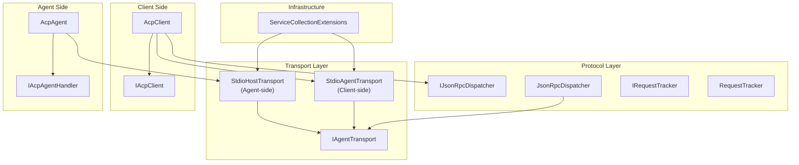
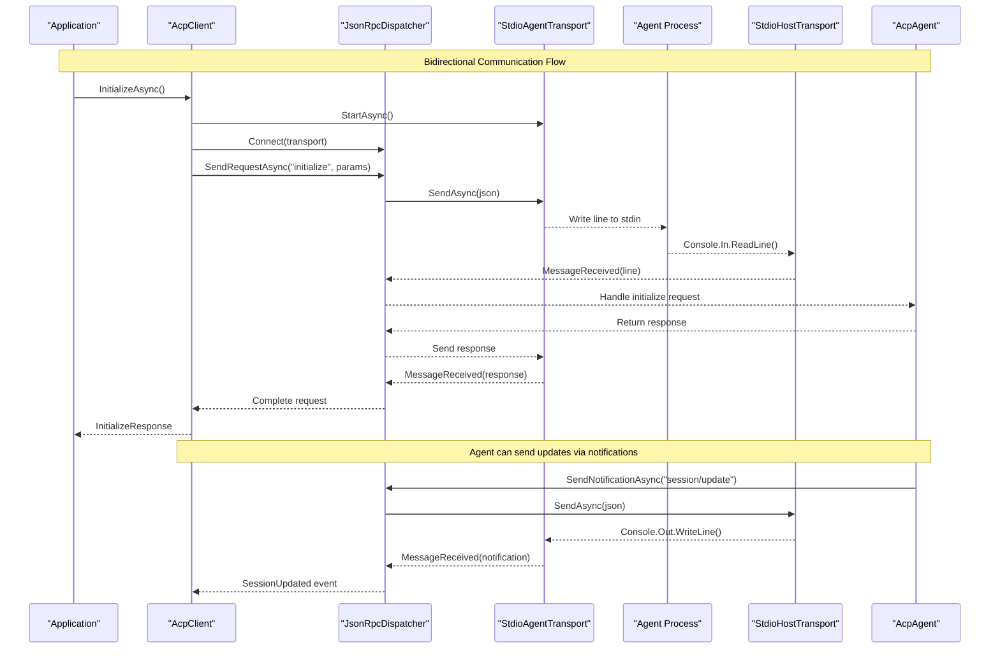
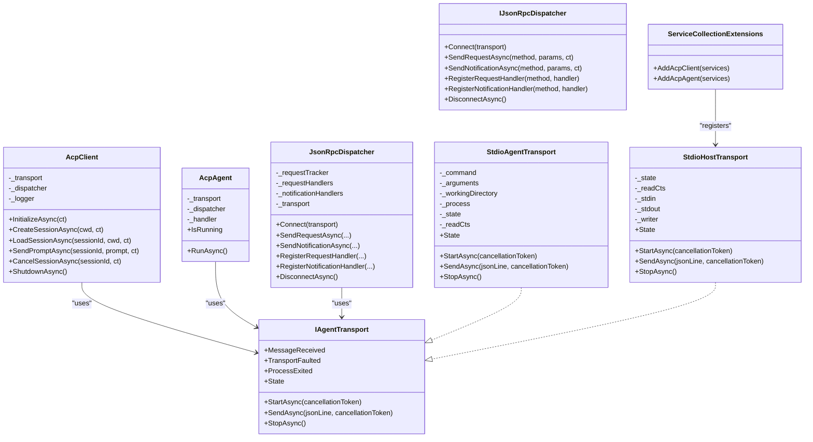

# Transport Layer

<cite>
**Referenced Files in This Document**
- [IAgentTransport.cs](file://Transport/IAgentTransport.cs)
- [StdioAgentTransport.cs](file://Transport/StdioAgentTransport.cs)
- [StdioHostTransport.cs](file://Transport/StdioHostTransport.cs)
- [JsonRpcDispatcher.cs](file://Protocol/JsonRpcDispatcher.cs)
- [IJsonRpcDispatcher.cs](file://Protocol/IJsonRpcDispatcher.cs)
- [AcpClient.cs](file://Client/AcpClient.cs)
- [IAcpClient.cs](file://Client/IAcpClient.cs)
- [ServiceCollectionExtensions.cs](file://Infrastructure/ServiceCollectionExtensions.cs)
- [README.md](file://README.md)
</cite>

## Update Summary
**Changes Made**
- Added comprehensive documentation for the new StdioHostTransport implementation
- Updated architecture diagrams to show bidirectional communication support
- Enhanced section on transport selection and usage patterns
- Added agent-side communication examples and configuration
- Updated troubleshooting guide to cover both client and agent scenarios

## Table of Contents
1. [Introduction](#introduction)
2. [Project Structure](#project-structure)
3. [Core Components](#core-components)
4. [Architecture Overview](#architecture-overview)
5. [Detailed Component Analysis](#detailed-component-analysis)
6. [Transport Selection Guide](#transport-selection-guide)
7. [Dependency Analysis](#dependency-analysis)
8. [Performance Considerations](#performance-considerations)
9. [Troubleshooting Guide](#troubleshooting-guide)
10. [Conclusion](#conclusion)

## Introduction
This document explains the transport layer abstraction and its dual implementations used to communicate with ACP-compliant agents over standard input/output streams using JSON-RPC. The transport layer now supports **bidirectional communication**, enabling both client-side and agent-side implementations:

- **Client-side transport**: `StdioAgentTransport` - spawns and manages child processes
- **Agent-side transport**: `StdioHostTransport` - runs within the agent process itself
- **Unified interface**: `IAgentTransport` - consistent API for both sides

The library enables full ACP protocol implementation where a single process acts as either a Client or an Agent, not both.

## Project Structure
The transport layer is defined under the Transport namespace and integrated with the protocol and client/agent layers:



**Diagram sources**
- [IAgentTransport.cs](file://Transport/IAgentTransport.cs)
- [StdioAgentTransport.cs](file://Transport/StdioAgentTransport.cs)
- [StdioHostTransport.cs](file://Transport/StdioHostTransport.cs)
- [IJsonRpcDispatcher.cs](file://Protocol/IJsonRpcDispatcher.cs)
- [JsonRpcDispatcher.cs](file://Protocol/JsonRpcDispatcher.cs)
- [IAcpClient.cs](file://Client/IAcpClient.cs)
- [AcpClient.cs](file://Client/AcpClient.cs)
- [ServiceCollectionExtensions.cs](file://Infrastructure/ServiceCollectionExtensions.cs)

**Section sources**
- [README.md](file://README.md)

## Core Components
The transport layer provides a unified abstraction over different communication mechanisms:

### IAgentTransport Interface
Defines the contract for all transport implementations:
- **Lifecycle management**: `StartAsync`, `StopAsync`
- **Message sending**: `SendAsync` for JSON-RPC lines
- **Event-driven messaging**: `MessageReceived`, `TransportFaulted`, `ProcessExited`
- **State tracking**: `State` property with enum values

### StdioAgentTransport (Client-side)
Implements IAgentTransport for spawning and managing child processes:
- Process lifecycle management with configurable command, arguments, and working directory
- Standard stream redirection (stdin/stdout/stderr) with UTF-8 encoding
- Asynchronous message reading and event propagation
- Graceful shutdown with timeout and process tree termination

### StdioHostTransport (Agent-side)
Implements IAgentTransport for running within the agent process:
- Direct console stream access (Console.In/Out)
- BOM-less UTF-8 encoding for JSON-RPC compatibility
- Simple lifecycle management without process spawning
- EOF detection for client disconnection handling

### JsonRpcDispatcher
Connects to any IAgentTransport implementation:
- Message serialization/deserialization
- Request/response tracking and correlation
- Handler registration for requests and notifications
- Event subscription to transport messages

**Section sources**
- [IAgentTransport.cs](file://Transport/IAgentTransport.cs)
- [StdioAgentTransport.cs](file://Transport/StdioAgentTransport.cs)
- [StdioHostTransport.cs](file://Transport/StdioHostTransport.cs)
- [JsonRpcDispatcher.cs](file://Protocol/JsonRpcDispatcher.cs)

## Architecture Overview
The transport layer enables bidirectional ACP protocol communication through a unified interface. Both client and agent sides use the same dispatcher and message format, differing only in how they handle I/O.



**Diagram sources**
- [AcpClient.cs](file://Client/AcpClient.cs)
- [JsonRpcDispatcher.cs](file://Protocol/JsonRpcDispatcher.cs)
- [IAgentTransport.cs](file://Transport/IAgentTransport.cs)
- [StdioAgentTransport.cs](file://Transport/StdioAgentTransport.cs)
- [StdioHostTransport.cs](file://Transport/StdioHostTransport.cs)

## Detailed Component Analysis

### IAgentTransport Interface Design
The interface provides a consistent abstraction over different transport mechanisms:

**Key Members:**
- `StartAsync(CancellationToken)`: Starts the underlying transport mechanism
- `SendAsync(string, CancellationToken)`: Sends a single JSON-RPC line
- `MessageReceived`: Event raised when raw JSON lines arrive from peer
- `TransportFaulted`: Event raised when transport encounters errors
- `ProcessExited`: Event raised when underlying process exits (client-side only)
- `StopAsync()`: Graceful shutdown of the transport
- `State`: Current transport state enumeration

**Design Principles:**
- Event-driven architecture for asynchronous message handling
- Consistent lifecycle across all transport implementations
- Cancellation token support for cooperative cancellation
- State machine pattern for lifecycle management

**Section sources**
- [IAgentTransport.cs](file://Transport/IAgentTransport.cs)

### StdioAgentTransport Implementation (Client-side)
Manages child process lifecycle and stdio communication:

**Process Lifecycle Management:**
- `StartAsync`: Configures ProcessStartInfo with command, arguments, working directory
- Redirects stdin/stdout/stderr with UTF-8 encoding (BOM-less for stdin)
- Subscribes to process exit events and starts background readers
- Manages CancellationTokenSource for graceful shutdown

**Stream Handling:**
- `ReadLoopAsync`: Continuously reads stdout lines asynchronously
- `ReadStderrAsync`: Captures stderr for diagnostics (currently ignored)
- Skips empty lines and raises MessageReceived for valid JSON-RPC lines
- Handles OperationCanceledException for normal shutdown

**Error Propagation:**
- TransportFaulted events for read errors
- ProcessExited events with exit codes
- InvalidOperationException for invalid state transitions

**Resource Cleanup:**
- CancellationTokenSource cancellation during StopAsync
- StandardInput.Close() for graceful shutdown
- Process.Kill(entireProcessTree: true) as fallback after timeout

**Section sources**
- [StdioAgentTransport.cs](file://Transport/StdioAgentTransport.cs)

### StdioHostTransport Implementation (Agent-side)
Provides stdio communication within the agent process:

**Stream Access:**
- Uses `Console.OpenStandardInput()` and `Console.OpenStandardOutput()` directly
- Creates StreamWriter with BOM-less UTF-8 encoding for JSON-RPC compatibility
- AutoFlush enabled for immediate message delivery

**Lifecycle Management:**
- `StartAsync`: Opens console streams and starts background reader
- `SendAsync`: Writes JSON-RPC lines to stdout with proper encoding
- `StopAsync`: Cancels read operations and sets stopped state

**Connection Handling:**
- EOF detection triggers ProcessExited event with code 0
- Clean shutdown when client disconnects
- Exception handling for transport faults

**Section sources**
- [StdioHostTransport.cs](file://Transport/StdioHostTransport.cs)

### JsonRpcDispatcher Integration
Handles message routing and request/response correlation:

**Message Processing:**
- Subscribes to transport.MessageReceived events
- Deserializes JSON-RPC messages into appropriate types
- Routes requests to registered handlers
- Completes pending requests with responses

**Request Tracking:**
- Maintains ConcurrentDictionary of pending requests
- Correlates responses with original requests by ID
- Supports cancellation of pending requests

**Handler Registration:**
- RegisterRequestHandler for method-specific request handling
- RegisterNotificationHandler for notification processing
- Thread-safe handler storage and invocation

**Section sources**
- [JsonRpcDispatcher.cs](file://Protocol/JsonRpcDispatcher.cs)

### AcpClient Orchestration (Client-side)
Manages the complete client lifecycle:

**Initialization:**
- Starts transport and connects dispatcher
- Subscribes to process exit events
- Registers built-in handlers for sessions, permissions, file system, and terminal operations
- Performs initialize handshake with agent

**Session Management:**
- CreateSessionAsync and LoadSessionAsync for session lifecycle
- SendPromptAsync for prompt processing with streaming updates
- CancelSessionAsync for request cancellation

**Event Exposure:**
- SessionUpdated event for agent-initiated updates
- AgentProcessExited event for process termination

**Section sources**
- [AcpClient.cs](file://Client/AcpClient.cs)

## Transport Selection Guide
Choose the appropriate transport based on your application role:

### When to Use StdioAgentTransport (Client-side)
- You're building a client application that launches agent processes
- You need to manage child process lifecycle
- You want to configure working directories, environment variables, and process arguments
- You need to monitor agent process health and handle crashes

**Usage Example:**
```csharp
var transport = new StdioAgentTransport(
    "dotnet", 
    "run --project MyAgent", 
    workingDirectory: "."
);
```

### When to Use StdioHostTransport (Agent-side)
- You're building an agent that runs as a standalone process
- You want direct console stream access without process spawning overhead
- You need simple lifecycle management focused on I/O operations
- You're implementing the agent side of the ACP protocol

**Usage Example:**
```csharp
// In agent process
var services = new ServiceCollection()
    .AddAcpAgent<MyAgentHandler>() // Automatically registers StdioHostTransport
    .BuildServiceProvider();

await using var agent = services.GetRequiredService<IAcpAgent>();
await agent.RunAsync();
```

### Custom Transport Implementation
Implement IAgentTransport for custom communication mechanisms:

**Requirements:**
- Implement StartAsync to initialize the transport
- Implement SendAsync to send JSON-RPC lines
- Raise MessageReceived events for incoming messages
- Handle TransportFaulted for error conditions
- Manage lifecycle states appropriately

**Common Use Cases:**
- Mock transports for testing
- Network-based transports (TCP, HTTP)
- Named pipes or shared memory
- Custom logging and monitoring

**Section sources**
- [ServiceCollectionExtensions.cs](file://Infrastructure/ServiceCollectionExtensions.cs)
- [README.md](file://README.md)

## Dependency Analysis
The transport layer maintains clean separation between concerns:



**Diagram sources**
- [IAgentTransport.cs](file://Transport/IAgentTransport.cs)
- [StdioAgentTransport.cs](file://Transport/StdioAgentTransport.cs)
- [StdioHostTransport.cs](file://Transport/StdioHostTransport.cs)
- [IJsonRpcDispatcher.cs](file://Protocol/IJsonRpcDispatcher.cs)
- [JsonRpcDispatcher.cs](file://Protocol/JsonRpcDispatcher.cs)
- [AcpClient.cs](file://Client/AcpClient.cs)
- [ServiceCollectionExtensions.cs](file://Infrastructure/ServiceCollectionExtensions.cs)

**Section sources**
- [JsonRpcDispatcher.cs](file://Protocol/JsonRpcDispatcher.cs)
- [AcpClient.cs](file://Client/AcpClient.cs)
- [ServiceCollectionExtensions.cs](file://Infrastructure/ServiceCollectionExtensions.cs)

## Performance Considerations
Both transport implementations are optimized for high-throughput JSON-RPC communication:

### Common Optimizations
- **Asynchronous I/O**: Both transports use async/await patterns to avoid blocking threads
- **Minimal allocations**: Messages are serialized once per send operation
- **Efficient string handling**: Uses Memory<T> APIs for zero-copy operations where possible
- **UTF-8 encoding**: BOM-less UTF-8 eliminates character conversion overhead

### StdioAgentTransport Specific
- **Background readers**: Separate tasks for stdout and stderr prevent blocking
- **Buffer management**: StreamReader handles buffering efficiently
- **Process management**: Single Process instance with event-driven lifecycle

### StdioHostTransport Specific
- **Direct stream access**: No process spawning overhead
- **StreamWriter optimization**: AutoFlush enabled for immediate delivery
- **Memory efficiency**: Minimal object creation in hot paths

### Best Practices
- **Avoid blocking handlers**: Ensure MessageReceived handlers don't block
- **Use cancellation tokens**: Support cooperative cancellation for graceful shutdown
- **Monitor resource usage**: Watch for memory leaks in long-running applications
- **Handle backpressure**: Ensure downstream consumers keep up with message rates

## Troubleshooting Guide
Common issues and solutions for both client and agent scenarios:

### Client-side Issues (StdioAgentTransport)
**Transport not running:**
- Symptom: InvalidOperationException when calling SendAsync
- Cause: Transport state is not Running
- Fix: Ensure StartAsync completed successfully before sending messages

**No incoming messages:**
- Symptom: MessageReceived never fires
- Cause: Agent process not writing to stdout or incorrect encoding
- Fix: Verify agent outputs UTF-8 lines; check stderr for diagnostic output

**Unexpected process termination:**
- Symptom: ProcessExited fires with non-zero exit code
- Cause: Agent crash or external termination
- Fix: Inspect logs; implement retry logic at higher layers

**Slow shutdown:**
- Symptom: StopAsync takes long or hangs
- Cause: Agent does not close stdin promptly
- Fix: Ensure agent handles EOF; fallback kill occurs after timeout

### Agent-side Issues (StdioHostTransport)
**No messages received:**
- Symptom: MessageReceived never fires
- Cause: Client not sending data or wrong encoding
- Fix: Verify client sends UTF-8 JSON-RPC lines without BOM

**Premature termination:**
- Symptom: ProcessExited fires immediately
- Cause: Client disconnected or stdin closed
- Fix: Check client connection status; handle reconnection if needed

**Encoding issues:**
- Symptom: Garbled characters in messages
- Cause: Encoding mismatch between client and agent
- Fix: Ensure both sides use BOM-less UTF-8 encoding

### General Debugging Techniques
- **Enable logging**: Use ILogger in AcpClient to observe initialization and lifecycle events
- **Capture stderr**: Monitor stderr lines from StdioAgentTransport for diagnostics
- **Validate payloads**: Use network/process inspector tools to validate JSON-RPC messages
- **Test with mock**: Use the provided MockAgent for testing client implementations
- **Cancellation tokens**: Use cancellation tokens to abort long-running operations during tests

**Section sources**
- [StdioAgentTransport.cs](file://Transport/StdioAgentTransport.cs)
- [StdioHostTransport.cs](file://Transport/StdioHostTransport.cs)
- [AcpClient.cs](file://Client/AcpClient.cs)

## Conclusion
The transport layer provides a robust abstraction over communication mechanisms, enabling flexible implementations while maintaining consistent behavior across different transports. With the addition of StdioHostTransport, the library now supports full bidirectional ACP protocol implementation:

- **StdioAgentTransport** offers a comprehensive client-side implementation with process lifecycle management, stream handling, and error propagation
- **StdioHostTransport** provides a lightweight agent-side implementation with direct console stream access
- **IAgentTransport** ensures consistency across all transport implementations
- **JsonRpcDispatcher** handles message routing and request/response correlation

By implementing IAgentTransport, developers can introduce alternative transports (e.g., mock, TCP, named pipes) while preserving the same client and protocol semantics. The unified interface enables seamless switching between different communication mechanisms without affecting higher-level components.

Proper attention to performance, resource cleanup, and debugging ensures reliable operation in production environments. The bidirectional design enables sophisticated agent-client interactions while maintaining clear separation of concerns and testability.