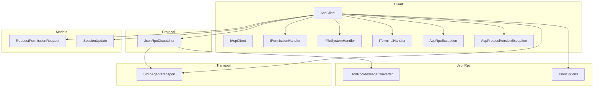
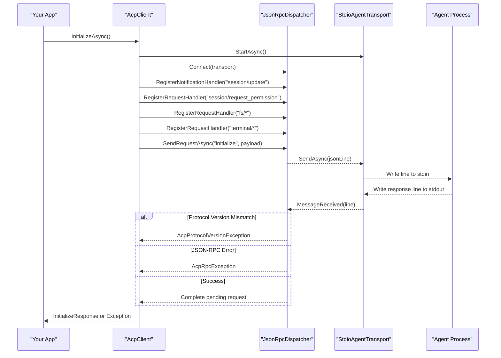
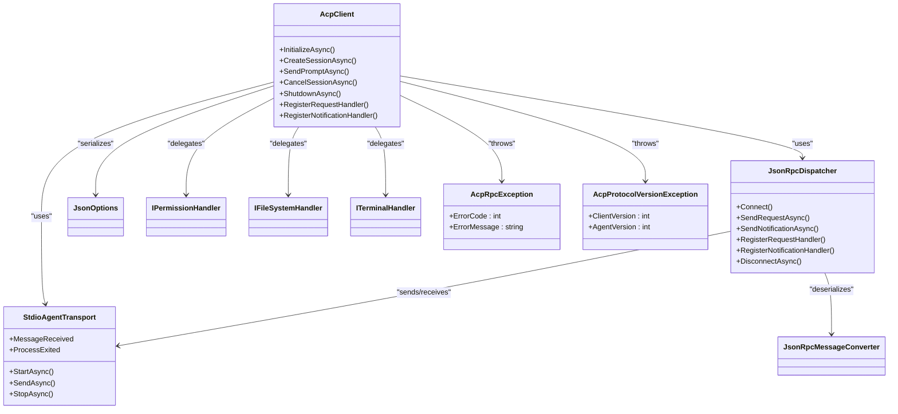
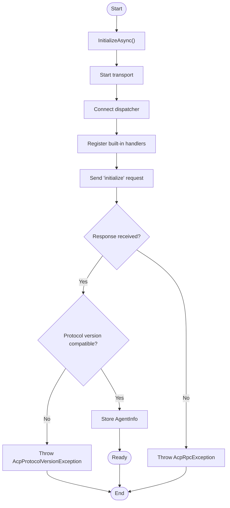

# Troubleshooting Guide

<cite>
**Referenced Files in This Document**
- [README.md](file://README.md)
- [Agentic.ACPLibrary.csproj](file://Agentic.ACPLibrary.csproj)
- [AcpClient.cs](file://Client/AcpClient.cs)
- [IAcpClient.cs](file://Client/IAcpClient.cs)
- [IPermissionHandler.cs](file://Client/IPermissionHandler.cs)
- [IFileSystemHandler.cs](file://Client/IFileSystemHandler.cs)
- [ITerminalHandler.cs](file://Client/ITerminalHandler.cs)
- [StdioAgentTransport.cs](file://Transport/StdioAgentTransport.cs)
- [JsonRpcDispatcher.cs](file://Protocol/JsonRpcDispatcher.cs)
- [JsonRpcMessageConverter.cs](file://JsonRpc/JsonRpcMessageConverter.cs)
- [JsonOptions.cs](file://Infrastructure/JsonOptions.cs)
- [RequestPermissionRequest.cs](file://Models/RequestPermissionRequest.cs)
- [SessionUpdate.cs](file://Models/SessionUpdate.cs)
- [AcpRpcException.cs](file://Client/AcpRpcException.cs)
- [AcpProtocolVersionException.cs](file://Client/AcpProtocolVersionException.cs)
- [AcpClientErrorHandlingTests.cs](file://tests/Agentic.ACPLibrary.Tests/AcpClientErrorHandlingTests.cs)
</cite>

## Update Summary
**Changes Made**
- Added comprehensive documentation for new exception types: AcpRpcException and AcpProtocolVersionException
- Updated common error messages section with specific guidance for RPC errors and protocol version mismatches
- Enhanced debugging strategies for exception handling and error diagnosis
- Added new troubleshooting scenarios for protocol compatibility issues

## Table of Contents
1. [Introduction](#introduction)
2. [Project Structure](#project-structure)
3. [Core Components](#core-components)
4. [Architecture Overview](#architecture-overview)
5. [Detailed Component Analysis](#detailed-component-analysis)
6. [Dependency Analysis](#dependency-analysis)
7. [Performance Considerations](#performance-considerations)
8. [Troubleshooting Guide](#troubleshooting-guide)
9. [Conclusion](#conclusion)
10. [Appendices](#appendices)

## Introduction
This guide provides systematic troubleshooting for the ACP client library, focusing on agent connection problems, transport layer issues, JSON-RPC message parsing errors, permission handler failures, file system access problems, terminal execution issues, performance bottlenecks, memory leaks, resource exhaustion, logging strategies, diagnostic tools, profiling techniques, common error messages and resolutions, platform-specific issues, environment configuration problems, and compatibility across .NET runtime versions. **Updated** to include comprehensive coverage of the new exception types for enhanced error handling and debugging capabilities.

## Project Structure
The library is organized into clear layers:
- Client: high-level API and handler interfaces
- Transport: stdio-based process communication
- Protocol: JSON-RPC dispatching and request tracking
- JsonRpc: message types and converters
- Models: protocol models and enums
- Infrastructure: shared JSON serialization options

**Diagram sources**
- [AcpClient.cs](file://Client/AcpClient.cs)
- [IAcpClient.cs](file://Client/IAcpClient.cs)
- [IPermissionHandler.cs](file://Client/IPermissionHandler.cs)
- [IFileSystemHandler.cs](file://Client/IFileSystemHandler.cs)
- [ITerminalHandler.cs](file://Client/ITerminalHandler.cs)
- [StdioAgentTransport.cs](file://Transport/StdioAgentTransport.cs)
- [JsonRpcDispatcher.cs](file://Protocol/JsonRpcDispatcher.cs)
- [JsonRpcMessageConverter.cs](file://JsonRpc/JsonRpcMessageConverter.cs)
- [JsonOptions.cs](file://Infrastructure/JsonOptions.cs)
- [RequestPermissionRequest.cs](file://Models/RequestPermissionRequest.cs)
- [SessionUpdate.cs](file://Models/SessionUpdate.cs)
- [AcpRpcException.cs](file://Client/AcpRpcException.cs)
- [AcpProtocolVersionException.cs](file://Client/AcpProtocolVersionException.cs)

**Section sources**
- [README.md](file://README.md)
- [Agentic.ACPLibrary.csproj](file://Agentic.ACPLibrary.csproj)

## Core Components
- AcpClient: orchestrates initialization, session lifecycle, prompt sending, and eventing; wires built-in handlers for permissions, file system, and terminal operations.
- StdioAgentTransport: manages a child process with stdio pipes, reads lines from stdout/stderr, and exposes events for messages and process exit.
- JsonRpcDispatcher: serializes requests/notifications, tracks pending requests, deserializes incoming messages, and routes to registered handlers.
- JsonRpcMessageConverter: discriminates between request/notification/response based on JSON fields and avoids recursion by stripping itself from inner options.
- JsonOptions: centralizes System.Text.Json settings (case-insensitive properties, ignore nulls, out-of-order metadata, converters).
- Handler interfaces: define contracts for permission, file system, and terminal operations invoked by the agent.
- **New Exception Types**: AcpRpcException for JSON-RPC error responses and AcpProtocolVersionException for protocol version incompatibilities.

Key responsibilities and failure points are mapped throughout this guide.

**Section sources**
- [AcpClient.cs](file://Client/AcpClient.cs)
- [StdioAgentTransport.cs](file://Transport/StdioAgentTransport.cs)
- [JsonRpcDispatcher.cs](file://Protocol/JsonRpcDispatcher.cs)
- [JsonRpcMessageConverter.cs](file://JsonRpc/JsonRpcMessageConverter.cs)
- [JsonOptions.cs](file://Infrastructure/JsonOptions.cs)
- [IPermissionHandler.cs](file://Client/IPermissionHandler.cs)
- [IFileSystemHandler.cs](file://Client/IFileSystemHandler.cs)
- [ITerminalHandler.cs](file://Client/ITerminalHandler.cs)
- [AcpRpcException.cs](file://Client/AcpRpcException.cs)
- [AcpProtocolVersionException.cs](file://Client/AcpProtocolVersionException.cs)

## Architecture Overview
The runtime flow connects the client to an external agent via a child process over stdio. The dispatcher handles JSON-RPC routing, while handlers implement domain-specific behaviors.

**Diagram sources**
- [AcpClient.cs](file://Client/AcpClient.cs)
- [JsonRpcDispatcher.cs](file://Protocol/JsonRpcDispatcher.cs)
- [StdioAgentTransport.cs](file://Transport/StdioAgentTransport.cs)
- [AcpRpcException.cs](file://Client/AcpRpcException.cs)
- [AcpProtocolVersionException.cs](file://Client/AcpProtocolVersionException.cs)

## Detailed Component Analysis

### AcpClient
Responsibilities:
- Starts transport, connects dispatcher, subscribes to process exit and session updates.
- Registers built-in handlers for permissions, file system, and terminal methods.
- Performs initialize handshake and stores agent info.
- Manages sessions and prompts.
- **Enhanced Error Handling**: Throws specific exceptions for RPC errors and protocol version mismatches.

Common issues:
- Missing handlers cause default responses or errors.
- Session ID not set if CreateSessionAsync fails.
- Event subscriptions must be attached before InitializeAsync.
- **New**: Protocol version mismatches throw AcpProtocolVersionException during initialization.

Diagnostics:
- Inspect IsInitialized and AgentInfo after InitializeAsync.
- Subscribe to AgentProcessExited to detect unexpected termination.
- Use ILogger to trace initialization steps.
- **Updated**: Catch and log AcpRpcException and AcpProtocolVersionException with detailed error information.

**Section sources**
- [AcpClient.cs](file://Client/AcpClient.cs)
- [IAcpClient.cs](file://Client/IAcpClient.cs)
- [AcpRpcException.cs](file://Client/AcpRpcException.cs)
- [AcpProtocolVersionException.cs](file://Client/AcpProtocolVersionException.cs)

### StdioAgentTransport
Responsibilities:
- Spawns a child process with redirected stdio.
- Reads lines from stdout and stderr asynchronously.
- Exposes MessageReceived and ProcessExited events.
- Graceful shutdown with timeout and forced kill fallback.

Common issues:
- Invalid command path or arguments prevent process start.
- Working directory misconfiguration leads to permission or path errors.
- Encoding mismatches can corrupt messages.
- EOF or read exceptions terminate the loop silently unless handled.

Diagnostics:
- Check State transitions (Created → Starting → Running → Stopped).
- Monitor stderr output for agent-side logs.
- Ensure CancellationToken propagation during StopAsync.

**Section sources**
- [StdioAgentTransport.cs](file://Transport/StdioAgentTransport.cs)

### JsonRpcDispatcher
Responsibilities:
- Tracks pending requests and completes them upon response arrival.
- Serializes outgoing requests/notifications and deserializes incoming messages.
- Routes requests and notifications to registered handlers.

Common issues:
- Sending without Connect throws invalid operation.
- Deserialization failures swallow exceptions and drop messages.
- Handler registration order matters; ensure required handlers are present.

Diagnostics:
- Verify transport is connected before sending.
- Add logging around OnMessageReceived to capture raw JSON lines.
- Validate that all expected handlers are registered.

**Section sources**
- [JsonRpcDispatcher.cs](file://Protocol/JsonRpcDispatcher.cs)

### JsonRpcMessageConverter
Responsibilities:
- Discriminates message type by presence of method/id/result/error fields.
- Avoids recursive conversion by removing itself from inner options.

Common issues:
- Malformed JSON results in fallback or ignored messages.
- Custom converters must not re-introduce recursion.

Diagnostics:
- Inspect raw JSON lines before conversion.
- Confirm converter is registered in JsonOptions.Default.

**Section sources**
- [JsonRpcMessageConverter.cs](file://JsonRpc/JsonRpcMessageConverter.cs)

### JsonOptions
Responsibilities:
- Centralizes JsonSerializerOptions (case-insensitive property names, ignore nulls, allow out-of-order metadata, add converters).

Common issues:
- Missing converters lead to unrecognized types.
- Case sensitivity differences break field mapping.

Diagnostics:
- Ensure JsonOptions.Default is used consistently across serialization.

**Section sources**
- [JsonOptions.cs](file://Infrastructure/JsonOptions.cs)

### Handler Interfaces
- IPermissionHandler: respond to permission requests with outcomes.
- IFileSystemHandler: read/write text files.
- ITerminalHandler: create, query, wait, kill, release terminals.

Common issues:
- Null handlers return default error responses.
- Long-running handlers may block dispatching.

Diagnostics:
- Implement robust cancellation support.
- Log entry/exit of handler methods.

**Section sources**
- [IPermissionHandler.cs](file://Client/IPermissionHandler.cs)
- [IFileSystemHandler.cs](file://Client/IFileSystemHandler.cs)
- [ITerminalHandler.cs](file://Client/ITerminalHandler.cs)

### New Exception Types

#### AcpRpcException
Purpose: Thrown when the Agent returns a JSON-RPC error response, carrying the protocol error code and message.

Usage Scenarios:
- InitializeAsync receives an error response from the agent
- CreateSessionAsync encounters a JSON-RPC error
- LoadSessionAsync fails with an error response
- SendPromptAsync receives an error from the agent

Properties:
- ErrorCode: The JSON-RPC error code returned by the agent
- ErrorMessage: The descriptive error message from the agent

Resolution Steps:
- Check the ErrorCode against standard JSON-RPC error codes
- Log the ErrorMessage for debugging purposes
- Implement retry logic for transient errors
- Handle specific error codes appropriately

#### AcpProtocolVersionException
Purpose: Thrown when the Agent's protocol version is incompatible with the client.

Usage Scenarios:
- InitializeAsync detects protocol version mismatch during handshake
- Client supports version 1 but agent requires a different version

Properties:
- ClientVersion: Protocol version supported by the client
- AgentVersion: Protocol version reported by the agent

Resolution Steps:
- Upgrade the client to match the agent's required version
- Use a compatible agent version that matches the client
- Log version information for compatibility matrix maintenance

**Section sources**
- [AcpRpcException.cs](file://Client/AcpRpcException.cs)
- [AcpProtocolVersionException.cs](file://Client/AcpProtocolVersionException.cs)
- [AcpClient.cs](file://Client/AcpClient.cs)

## Dependency Analysis
High-level dependencies and coupling:
- AcpClient depends on Transport, Dispatcher, and Handlers.
- Dispatcher depends on Transport and RequestTracker.
- JsonOptions centralizes serialization behavior used by both Dispatcher and AcpClient.
- Models are consumed by AcpClient and handlers.
- **New**: Exception types are thrown by AcpClient for error scenarios.

**Diagram sources**
- [AcpClient.cs](file://Client/AcpClient.cs)
- [StdioAgentTransport.cs](file://Transport/StdioAgentTransport.cs)
- [JsonRpcDispatcher.cs](file://Protocol/JsonRpcDispatcher.cs)
- [JsonRpcMessageConverter.cs](file://JsonRpc/JsonRpcMessageConverter.cs)
- [JsonOptions.cs](file://Infrastructure/JsonOptions.cs)
- [IPermissionHandler.cs](file://Client/IPermissionHandler.cs)
- [IFileSystemHandler.cs](file://Client/IFileSystemHandler.cs)
- [ITerminalHandler.cs](file://Client/ITerminalHandler.cs)
- [AcpRpcException.cs](file://Client/AcpRpcException.cs)
- [AcpProtocolVersionException.cs](file://Client/AcpProtocolVersionException.cs)

**Section sources**
- [AcpClient.cs](file://Client/AcpClient.cs)
- [JsonRpcDispatcher.cs](file://Protocol/JsonRpcDispatcher.cs)
- [StdioAgentTransport.cs](file://Transport/StdioAgentTransport.cs)

## Performance Considerations
- Serialization overhead: System.Text.Json is efficient; avoid repeated option creation by using JsonOptions.Default.
- Async I/O: Ensure handlers do not perform blocking I/O; use async APIs and cancellation tokens.
- Stream throughput: Large outputs from terminals or file reads should be chunked and backpressure-aware.
- Memory usage: Reuse buffers where possible; avoid unnecessary string allocations in hot paths.
- Concurrency: Dispatcher processes messages sequentially per line; long-running handlers can delay processing—consider offloading work.
- **Updated**: Exception handling overhead is minimal; prefer specific exceptions over generic ones for better debugging.

## Troubleshooting Guide

### Agent Connection Problems
Symptoms:
- InitializeAsync hangs or returns early.
- No session created; CurrentSessionId remains null.
- AgentProcessExited fires immediately.
- **New**: AcpProtocolVersionException thrown during initialization.

Root causes:
- Incorrect agent executable path or arguments.
- Wrong working directory causing permission or path errors.
- Transport not started or already stopped.
- Protocol version mismatch between client and agent.

Resolution steps:
- Validate command and arguments; test running the agent manually.
- Set explicit workingDirectory when constructing StdioAgentTransport.
- Ensure InitializeAsync is called once and only after transport is ready.
- **Updated**: Handle AcpProtocolVersionException by upgrading client or agent to compatible versions.
- Inspect AgentInfo.ProtocolVersion and log warnings accordingly.

Diagnostics:
- Log transport state transitions and process exit codes.
- Capture stderr lines from the agent process.
- Temporarily disable handlers to isolate handshake issues.
- **Updated**: Catch and log AcpProtocolVersionException with version details.

**Section sources**
- [AcpClient.cs](file://Client/AcpClient.cs)
- [StdioAgentTransport.cs](file://Transport/StdioAgentTransport.cs)
- [AcpProtocolVersionException.cs](file://Client/AcpProtocolVersionException.cs)

### Transport Layer Issues
Symptoms:
- Messages not delivered; no MessageReceived events.
- Exceptions during SendAsync or ReadLoopAsync.
- Process does not terminate on ShutdownAsync.

Root causes:
- Sending while transport is not Running.
- EOF reached unexpectedly; reader loop exits.
- StandardInput/StandardOutput encoding mismatches.
- Timeout waiting for process exit leading to forced kill.

Resolution steps:
- Check Transport.State before sending.
- Ensure CancellationToken is propagated to StopAsync.
- Confirm UTF-8 encoding is configured for stdio streams.
- Investigate stderr for agent-side errors.

Diagnostics:
- Wrap SendAsync calls with try/catch and log exceptions.
- Add counters for lines received/sent.
- Use OS tools to verify process existence and pipe status.

**Section sources**
- [StdioAgentTransport.cs](file://Transport/StdioAgentTransport.cs)

### JSON-RPC Message Parsing Errors
Symptoms:
- Requests or notifications ignored.
- Responses never complete pending requests.
- Unknown session update types fall back to base.
- **New**: AcpRpcException thrown with specific error codes.

Root causes:
- Malformed JSON lines.
- Missing required fields (method, id, result, error).
- Custom converters not registered.
- Case-sensitive property name mismatches.
- Agent returning JSON-RPC error responses.

Resolution steps:
- Log raw JSON lines before deserialization.
- Ensure JsonOptions.Default includes JsonRpcMessageConverter and enum converter.
- Enable case-insensitive property names.
- Handle unknown derived types gracefully (fallback to base).
- **Updated**: Catch AcpRpcException and examine ErrorCode and ErrorMessage for debugging.

Diagnostics:
- Add a global message logger in OnMessageReceived to capture payloads.
- Validate JSON schema locally against known message shapes.
- **Updated**: Log AcpRpcException details including error codes and messages.

**Section sources**
- [JsonRpcDispatcher.cs](file://Protocol/JsonRpcDispatcher.cs)
- [JsonRpcMessageConverter.cs](file://JsonRpc/JsonRpcMessageConverter.cs)
- [JsonOptions.cs](file://Infrastructure/JsonOptions.cs)
- [SessionUpdate.cs](file://Models/SessionUpdate.cs)
- [AcpRpcException.cs](file://Client/AcpRpcException.cs)

### Permission Handler Failures
Symptoms:
- Default cancelled outcome returned.
- UI never prompted; agent stalls.

Root causes:
- PermissionHandler not assigned.
- Handler throws or blocks indefinitely.
- Incorrect request model mapping.

Resolution steps:
- Assign PermissionHandler before InitializeAsync.
- Implement non-blocking UI interactions with cancellation support.
- Validate RequestPermissionRequest fields and respond promptly.

Diagnostics:
- Log handler entry/exit and decision time.
- Return explicit outcomes (cancelled or selected) with correct optionId.

**Section sources**
- [AcpClient.cs](file://Client/AcpClient.cs)
- [IPermissionHandler.cs](file://Client/IPermissionHandler.cs)
- [RequestPermissionRequest.cs](file://Models/RequestPermissionRequest.cs)

### File System Access Problems
Symptoms:
- fs/read_text_file or fs/write_text_file fail with "File system not available".
- UnauthorizedAccessException or FileNotFoundException.

Root causes:
- FileSystemHandler not assigned.
- Insufficient permissions or invalid paths.
- Content encoding issues.

Resolution steps:
- Assign IFileSystemHandler before InitializeAsync.
- Validate paths and check permissions prior to I/O.
- Use consistent encodings and handle large content efficiently.

Diagnostics:
- Log requested paths and outcomes.
- Wrap file operations in try/catch and return meaningful errors.

**Section sources**
- [AcpClient.cs](file://Client/AcpClient.cs)
- [IFileSystemHandler.cs](file://Client/IFileSystemHandler.cs)

### Terminal Execution Issues
Symptoms:
- terminal/create returns "Terminal handler not available".
- Output empty or commands not executing.
- WaitForExit never completes.

Root causes:
- ITerminalHandler not assigned.
- Command not found or working directory incorrect.
- Terminal process not managed properly.

Resolution steps:
- Assign ITerminalHandler before InitializeAsync.
- Validate command availability and workingDirectory.
- Implement proper process lifecycle management.

Diagnostics:
- Log terminalId, command, workingDirectory, and exit codes.
- Provide GetOutputAsync streaming to inspect partial output.

**Section sources**
- [AcpClient.cs](file://Client/AcpClient.cs)
- [ITerminalHandler.cs](file://Client/ITerminalHandler.cs)

### Performance Bottlenecks
Indicators:
- High CPU during serialization/deserialization.
- Slow handler execution delaying other messages.
- Memory growth over time.

Approach:
- Profile serialization hotspots; reuse JsonOptions.Default.
- Offload heavy work in handlers to background tasks.
- Measure latency of SendRequestAsync and handler invocations.

Tools:
- .NET Profiler, dotnet-trace, dotnet-counters.
- Application Insights or OpenTelemetry for distributed tracing.

[No sources needed since this section provides general guidance]

### Memory Leaks and Resource Exhaustion
Indicators:
- Unbounded growth in memory or handles.
- Pending requests never completing.
- Streams or processes not closed.

Approach:
- Ensure DisposeAsync/ShutdownAsync called on client.
- Cancel pending requests on disconnect.
- Close streams and kill processes on failure paths.

Diagnostics:
- Track open resources and dispose patterns.
- Use GC diagnostics and handle leak analysis.

**Section sources**
- [AcpClient.cs](file://Client/AcpClient.cs)
- [JsonRpcDispatcher.cs](file://Protocol/JsonRpcDispatcher.cs)
- [StdioAgentTransport.cs](file://Transport/StdioAgentTransport.cs)

### Logging Strategies
Recommendations:
- Use ILogger<AcpClient> for structured logs at key lifecycle points.
- Log raw JSON lines in a separate channel for debugging.
- Include correlation IDs for requests and sessions.
- **Updated**: Log exception details including AcpRpcException and AcpProtocolVersionException with full context.

Implementation tips:
- Wrap critical sections with try/catch and log exceptions.
- Avoid excessive logging in hot loops; sample or throttle.
- **Updated**: Include error codes and messages from AcpRpcException in logs.
- **Updated**: Log protocol version information when AcpProtocolVersionException occurs.

**Section sources**
- [AcpClient.cs](file://Client/AcpClient.cs)
- [AcpRpcException.cs](file://Client/AcpRpcException.cs)
- [AcpProtocolVersionException.cs](file://Client/AcpProtocolVersionException.cs)

### Diagnostic Tools
- Process inspection: task manager, procmon, strace/ltrace equivalents.
- Network-like analysis: capture stdio lines to files for replay.
- .NET tools: dotnet-trace, dotnet-dump, dotnet-gcdump.
- **Updated**: Exception analysis tools for examining AcpRpcException and AcpProtocolVersionException details.

[No sources needed since this section provides general guidance]

### Profiling Techniques
- CPU profiling: identify slow methods and hot paths.
- Memory profiling: detect allocations and leaks.
- I/O profiling: measure file and process I/O latency.
- **Updated**: Exception frequency analysis to identify problematic operations.

[No sources needed since this section provides general guidance]

### Common Error Messages, Causes, and Resolutions
- "Transport is not running."
  - Cause: SendAsync called before StartAsync or after StopAsync.
  - Resolution: Ensure transport state is Running; call StartAsync first.
- "Dispatcher is not connected to a transport."
  - Cause: SendRequestAsync/SendNotificationAsync without Connect.
  - Resolution: Call Connect before sending; verify initialization order.
- "File system not available" / "Terminal handler not available"
  - Cause: Handlers not assigned.
  - Resolution: Assign IFileSystemHandler/ITerminalHandler before InitializeAsync.
- Protocol version mismatch warning
  - Cause: Agent reports different protocol version than client.
  - Resolution: Update client or agent to align versions; log and proceed cautiously.
- Unknown session update type
  - Cause: New update kind not recognized.
  - Resolution: Library falls back to base type; update models to include new types.
- **New**: AcpRpcException with JSON-RPC error codes
  - Cause: Agent returns JSON-RPC error response with specific error code and message.
  - Resolution: Check ErrorCode against standard JSON-RPC codes (-32600 for invalid request, -32601 for method not found, -32603 for internal error); log ErrorMessage for debugging; implement appropriate error handling logic.
- **New**: AcpProtocolVersionException with version mismatch
  - Cause: Client supports one protocol version but agent requires a different version.
  - Resolution: Upgrade client to match agent's required version or use compatible agent version; log ClientVersion and AgentVersion for compatibility tracking.

**Section sources**
- [StdioAgentTransport.cs](file://Transport/StdioAgentTransport.cs)
- [JsonRpcDispatcher.cs](file://Protocol/JsonRpcDispatcher.cs)
- [AcpClient.cs](file://Client/AcpClient.cs)
- [SessionUpdate.cs](file://Models/SessionUpdate.cs)
- [AcpRpcException.cs](file://Client/AcpRpcException.cs)
- [AcpProtocolVersionException.cs](file://Client/AcpProtocolVersionException.cs)

### Platform-Specific Issues
- Windows vs Unix path separators and quoting in command arguments.
- ShellExecute vs direct process invocation differences.
- Encoding defaults on different platforms; enforce UTF-8 explicitly.

Resolutions:
- Normalize paths and escape arguments appropriately.
- Test on target platforms; validate workingDirectory permissions.

[No sources needed since this section provides general guidance]

### Environment Configuration Problems
- Missing PATH entries for agent executable.
- Incorrect workingDirectory causing relative path failures.
- Environment variables not inherited by child process.

Resolutions:
- Provide absolute paths for agent executable.
- Set explicit workingDirectory in StdioAgentTransport.
- Pass necessary environment variables to the child process.

**Section sources**
- [StdioAgentTransport.cs](file://Transport/StdioAgentTransport.cs)

### Compatibility Across .NET Runtime Versions
- Target framework is net10.0; ensure runtime matches.
- System.Text.Json behavior may vary slightly across versions; rely on documented options.
- Microsoft.Extensions.Logging.Abstractions compatibility verified in project references.

Resolutions:
- Align runtime version with project target.
- Pin dependency versions to avoid breaking changes.

**Section sources**
- [Agentic.ACPLibrary.csproj](file://Agentic.ACPLibrary.csproj)

### Exception Handling Best Practices
**New Section**: Comprehensive guidance for handling the new exception types.

AcpRpcException Handling:
- Always catch AcpRpcException when calling AcpClient methods
- Extract ErrorCode for programmatic error handling
- Log ErrorMessage for debugging and user feedback
- Implement retry logic for transient errors (e.g., network timeouts)
- Map specific error codes to user-friendly messages

AcpProtocolVersionException Handling:
- Catch during InitializeAsync to detect compatibility issues early
- Compare ClientVersion and AgentVersion for compatibility matrix
- Provide clear upgrade instructions to users
- Log version information for automated compatibility checking
- Consider graceful degradation for minor version differences

Testing Strategies:
- Use mock transports and dispatchers to simulate error scenarios
- Verify exception types and properties are correctly set
- Test error recovery and retry logic
- Validate logging output contains sufficient debugging information

**Section sources**
- [AcpClientErrorHandlingTests.cs](file://tests/Agentic.ACPLibrary.Tests/AcpClientErrorHandlingTests.cs)
- [AcpRpcException.cs](file://Client/AcpRpcException.cs)
- [AcpProtocolVersionException.cs](file://Client/AcpProtocolVersionException.cs)

## Conclusion
Effective troubleshooting hinges on understanding the layered architecture: client orchestration, transport lifecycle, JSON-RPC dispatching, and handler implementations. **Updated** to include comprehensive exception handling with AcpRpcException and AcpProtocolVersionException for enhanced debugging capabilities. By instrumenting logs, validating configurations, following the diagnostic steps outlined above, and properly handling the new exception types, most connection, parsing, handler, performance, and compatibility issues can be resolved quickly. For persistent problems, leverage .NET profiling tools and capture raw JSON traces to pinpoint root causes.

## Appendices

### Quick Reference: Initialization Flow

**Diagram sources**
- [AcpClient.cs](file://Client/AcpClient.cs)
- [JsonRpcDispatcher.cs](file://Protocol/JsonRpcDispatcher.cs)
- [StdioAgentTransport.cs](file://Transport/StdioAgentTransport.cs)
- [AcpRpcException.cs](file://Client/AcpRpcException.cs)
- [AcpProtocolVersionException.cs](file://Client/AcpProtocolVersionException.cs)

### Exception Type Reference
**New Section**: Quick reference for the new exception types.

AcpRpcException Properties:
- ErrorCode: int - JSON-RPC error code (e.g., -32600, -32601, -32603)
- ErrorMessage: string - Descriptive error message from the agent

AcpProtocolVersionException Properties:
- ClientVersion: int - Protocol version supported by the client
- AgentVersion: int - Protocol version required by the agent

Common JSON-RPC Error Codes:
- -32600: Invalid Request
- -32601: Method not found
- -32602: Invalid params
- -32603: Internal error
- -32000 to -32099: Server error range

**Section sources**
- [AcpRpcException.cs](file://Client/AcpRpcException.cs)
- [AcpProtocolVersionException.cs](file://Client/AcpProtocolVersionException.cs)