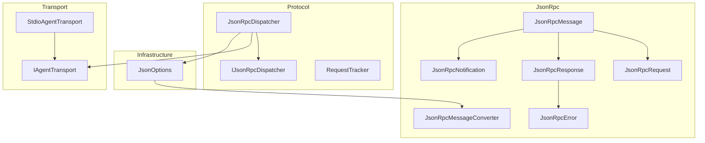
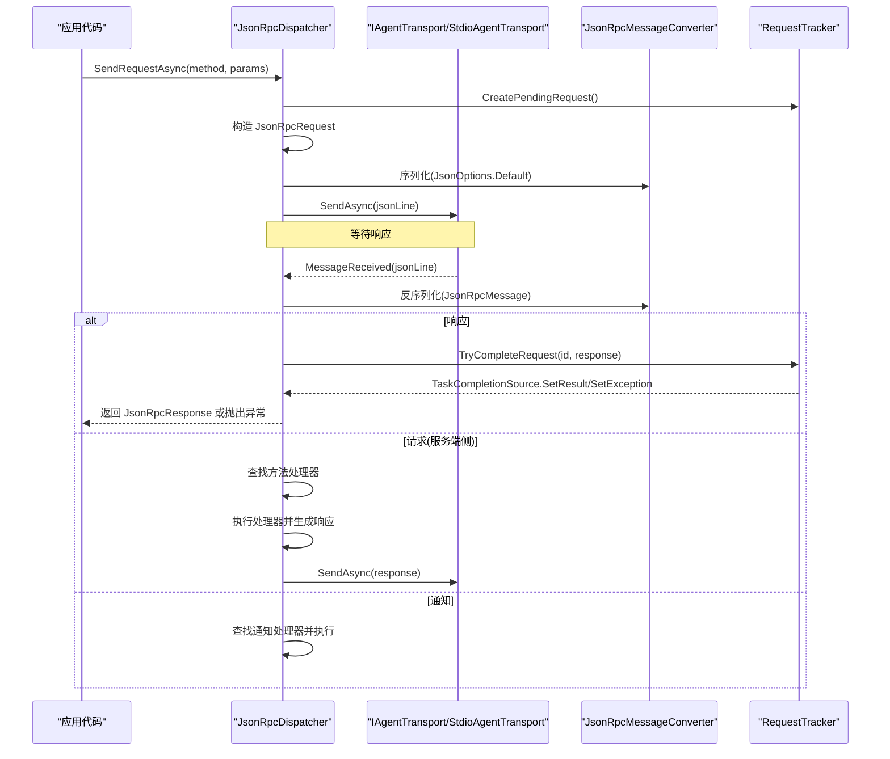
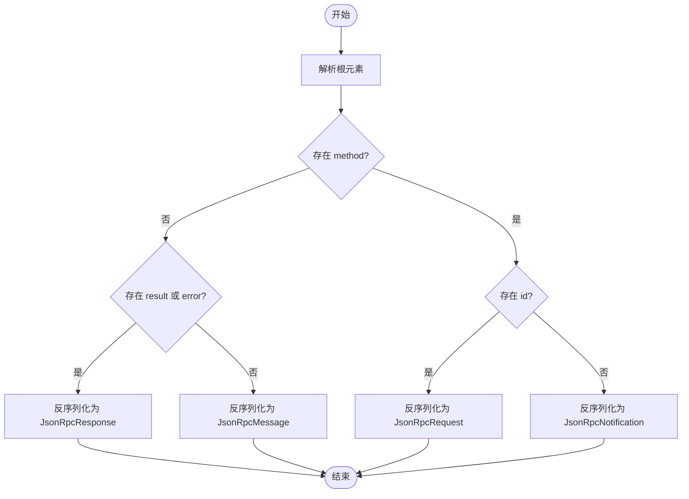
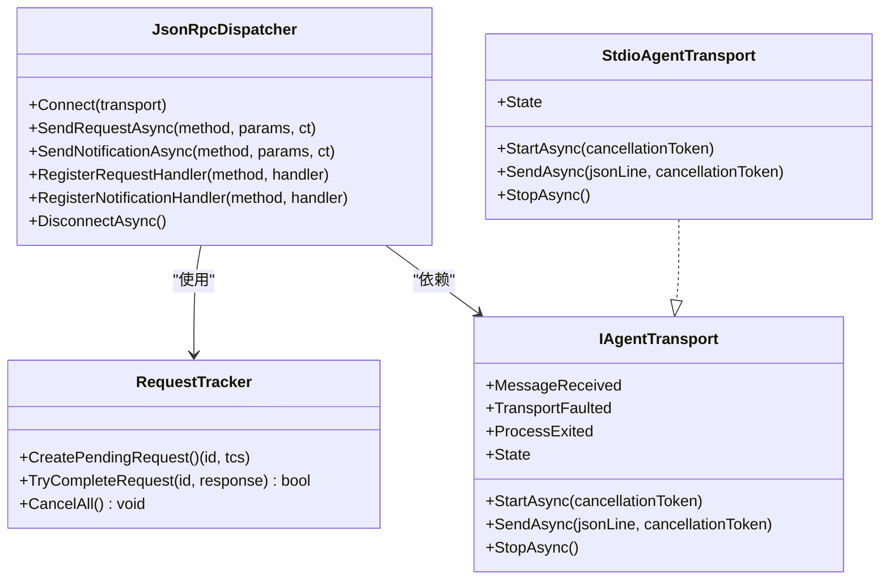
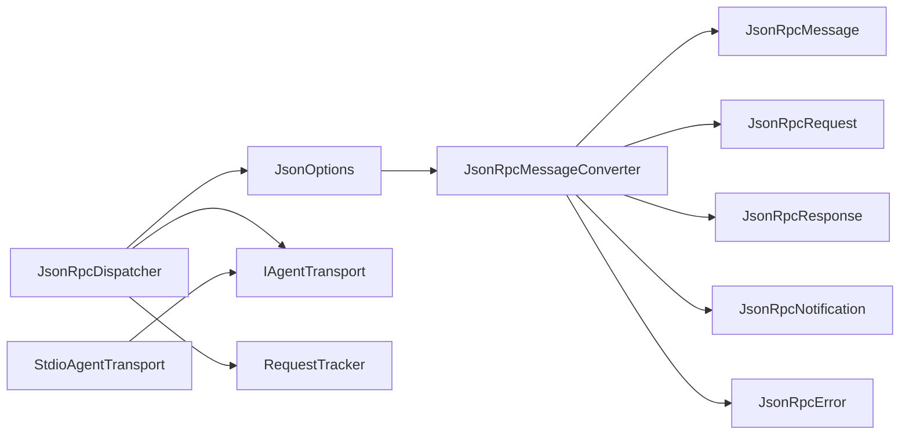
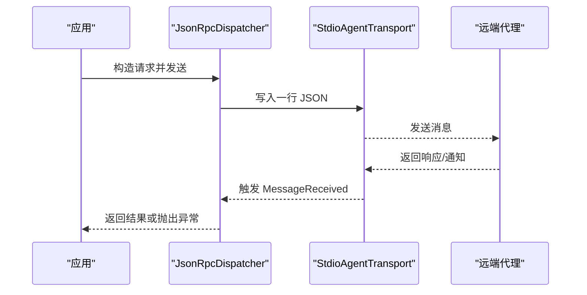

# JSON-RPC消息

<cite>
**本文引用的文件**   
- [JsonRpcMessage.cs](file://JsonRpc/JsonRpcMessage.cs)
- [JsonRpcRequest.cs](file://JsonRpc/JsonRpcRequest.cs)
- [JsonRpcResponse.cs](file://JsonRpc/JsonRpcResponse.cs)
- [JsonRpcNotification.cs](file://JsonRpc/JsonRpcNotification.cs)
- [JsonRpcError.cs](file://JsonRpc/JsonRpcError.cs)
- [JsonRpcMessageConverter.cs](file://JsonRpc/JsonRpcMessageConverter.cs)
- [JsonOptions.cs](file://Infrastructure/JsonOptions.cs)
- [IJsonRpcDispatcher.cs](file://Protocol/IJsonRpcDispatcher.cs)
- [JsonRpcDispatcher.cs](file://Protocol/JsonRpcDispatcher.cs)
- [IAgentTransport.cs](file://Transport/IAgentTransport.cs)
- [StdioAgentTransport.cs](file://Transport/StdioAgentTransport.cs)
- [README.md](file://README.md)
</cite>

## 目录
1. [简介](#简介)
2. [项目结构](#项目结构)
3. [核心组件](#核心组件)
4. [架构总览](#架构总览)
5. [详细组件分析](#详细组件分析)
6. [依赖关系分析](#依赖关系分析)
7. [性能考量](#性能考量)
8. [故障排查指南](#故障排查指南)
9. [结论](#结论)
10. [附录：示例与最佳实践](#附录示例与最佳实践)

## 简介
本文件系统性阐述该库对 JSON-RPC 2.0 协议的实现，覆盖消息模型、序列化/反序列化机制、分发与传输集成、字段校验与错误处理，以及版本兼容性与扩展性设计。读者将了解如何构造、解析和转换各类 JSON-RPC 消息，并掌握在 ACP（Agent Client Protocol）场景下的使用方式。

## 项目结构
JSON-RPC 相关代码主要分布在以下模块：
- JsonRpc：协议消息类型与自定义转换器
- Infrastructure：全局 JSON 序列化选项配置
- Protocol：消息分发器与请求跟踪
- Transport：基于标准输入输出的传输实现

图表来源
- [JsonRpcMessage.cs:1-14](file://JsonRpc/JsonRpcMessage.cs#L1-L14)
- [JsonRpcRequest.cs:1-19](file://JsonRpc/JsonRpcRequest.cs#L1-L19)
- [JsonRpcResponse.cs:1-20](file://JsonRpc/JsonRpcResponse.cs#L1-L20)
- [JsonRpcNotification.cs:1-16](file://JsonRpc/JsonRpcNotification.cs#L1-L16)
- [JsonRpcError.cs:1-19](file://JsonRpc/JsonRpcError.cs#L1-L19)
- [JsonRpcMessageConverter.cs:1-73](file://JsonRpc/JsonRpcMessageConverter.cs#L1-L73)
- [JsonOptions.cs:1-28](file://Infrastructure/JsonOptions.cs#L1-L28)
- [IJsonRpcDispatcher.cs:1-14](file://Protocol/IJsonRpcDispatcher.cs#L1-L14)
- [JsonRpcDispatcher.cs:1-124](file://Protocol/JsonRpcDispatcher.cs#L1-L124)
- [IAgentTransport.cs:1-39](file://Transport/IAgentTransport.cs#L1-L39)
- [StdioAgentTransport.cs:1-147](file://Transport/StdioAgentTransport.cs#L1-L147)

章节来源
- [README.md:1-99](file://README.md#L1-L99)

## 核心组件
- JsonRpcMessage：JSON-RPC 2.0 基类，固定 jsonrpc 字段为 "2.0"，用于区分消息类型的基础标记。
- JsonRpcRequest：请求消息，包含 id、method、可选 params。
- JsonRpcResponse：响应消息，包含 id，且 result 与 error 二选一。
- JsonRpcNotification：通知消息，包含 method 与可选 params，无 id。
- JsonRpcError：错误对象，包含 code、message、可选 data。
- JsonRpcMessageConverter：根据字段存在性自动识别消息类型并进行序列化和反序列化。
- JsonOptions：全局 JsonSerializerOptions，注册上述转换器与枚举字符串化策略。
- JsonRpcDispatcher：负责发送请求/通知、接收消息、路由到处理器、关联请求与响应。
- IAgentTransport / StdioAgentTransport：抽象与 stdio 实现，提供行式 JSON 消息的收发。

章节来源
- [JsonRpcMessage.cs:1-14](file://JsonRpc/JsonRpcMessage.cs#L1-L14)
- [JsonRpcRequest.cs:1-19](file://JsonRpc/JsonRpcRequest.cs#L1-L19)
- [JsonRpcResponse.cs:1-20](file://JsonRpc/JsonRpcResponse.cs#L1-L20)
- [JsonRpcNotification.cs:1-16](file://JsonRpc/JsonRpcNotification.cs#L1-L16)
- [JsonRpcError.cs:1-19](file://JsonRpc/JsonRpcError.cs#L1-L19)
- [JsonRpcMessageConverter.cs:1-73](file://JsonRpc/JsonRpcMessageConverter.cs#L1-L73)
- [JsonOptions.cs:1-28](file://Infrastructure/JsonOptions.cs#L1-L28)
- [JsonRpcDispatcher.cs:1-124](file://Protocol/JsonRpcDispatcher.cs#L1-L124)
- [IAgentTransport.cs:1-39](file://Transport/IAgentTransport.cs#L1-L39)
- [StdioAgentTransport.cs:1-147](file://Transport/StdioAgentTransport.cs#L1-L147)

## 架构总览
下图展示了从应用层调用到传输层的完整调用链，包括请求发送、响应回传、通知处理与错误传播。

图表来源
- [JsonRpcDispatcher.cs:27-64](file://Protocol/JsonRpcDispatcher.cs#L27-L64)
- [JsonRpcDispatcher.cs:86-122](file://Protocol/JsonRpcDispatcher.cs#L86-L122)
- [JsonRpcMessageConverter.cs:11-32](file://JsonRpc/JsonRpcMessageConverter.cs#L11-L32)
- [JsonOptions.cs:13-26](file://Infrastructure/JsonOptions.cs#L13-L26)
- [StdioAgentTransport.cs:61-68](file://Transport/StdioAgentTransport.cs#L61-L68)
- [RequestTracker.cs:11-30](file://Protocol/RequestTracker.cs#L11-L30)

## 详细组件分析

### 消息模型与字段规范
- JsonRpcMessage
  - 属性：jsonrpc（固定为 "2.0"）
  - 用途：作为所有 JSON-RPC 2.0 消息的基类，确保版本一致性
- JsonRpcRequest
  - 属性：id（long）、method（string）、params（可选，JsonElement?）
  - 用途：发起一次带标识的请求，服务端需以相同 id 返回结果或错误
- JsonRpcResponse
  - 属性：id（long）、result（可选，JsonElement?）、error（可选，JsonRpcError?）
  - 用途：对应请求的结果；result 与 error 互斥
- JsonRpcNotification
  - 属性：method（string）、params（可选，JsonElement?）
  - 用途：单向通知，无需响应，不包含 id
- JsonRpcError
  - 属性：code（int）、message（string）、data（可选，JsonElement?）
  - 用途：标准化错误信息，便于上层统一处理

字段验证与约束
- jsonrpc 始终为 "2.0"
- 请求必须包含 id 与 method；响应必须包含 id；通知仅包含 method
- result 与 error 互斥；当存在 error 时不应包含 result
- params、result、error、data 等可选字段在写入时为 null 时将被忽略（WhenWritingNull）

章节来源
- [JsonRpcMessage.cs:1-14](file://JsonRpc/JsonRpcMessage.cs#L1-L14)
- [JsonRpcRequest.cs:1-19](file://JsonRpc/JsonRpcRequest.cs#L1-L19)
- [JsonRpcResponse.cs:1-20](file://JsonRpc/JsonRpcResponse.cs#L1-L20)
- [JsonRpcNotification.cs:1-16](file://JsonRpc/JsonRpcNotification.cs#L1-L16)
- [JsonRpcError.cs:1-19](file://JsonRpc/JsonRpcError.cs#L1-L19)

### 序列化与反序列化：JsonRpcMessageConverter
- 反序列化策略
  - 读取根节点后检查 method、id、result、error 的存在性
  - 若同时存在 method 与 id：解析为 JsonRpcRequest
  - 若存在 method 但不含 id：解析为 JsonRpcNotification
  - 若存在 result 或 error：解析为 JsonRpcResponse
  - 否则回退为基类 JsonRpcMessage
- 序列化策略
  - 根据具体派生类型选择对应的序列化路径，避免额外开销
- 递归防护
  - 内部创建新的 JsonSerializerOptions，移除自身以避免无限递归
- 兼容性
  - 通过 AllowOutOfOrderMetadataProperties 支持元数据属性顺序无关
  - 使用 WhenWritingNull 忽略空字段，提升兼容性

图表来源
- [JsonRpcMessageConverter.cs:11-32](file://JsonRpc/JsonRpcMessageConverter.cs#L11-L32)
- [JsonRpcMessageConverter.cs:34-53](file://JsonRpc/JsonRpcMessageConverter.cs#L34-L53)
- [JsonRpcMessageConverter.cs:55-71](file://JsonRpc/JsonRpcMessageConverter.cs#L55-L71)

章节来源
- [JsonRpcMessageConverter.cs:1-73](file://JsonRpc/JsonRpcMessageConverter.cs#L1-L73)
- [JsonOptions.cs:13-26](file://Infrastructure/JsonOptions.cs#L13-L26)

### 分发器与请求跟踪
- JsonRpcDispatcher
  - Connect：绑定传输层，订阅消息事件
  - SendRequestAsync：生成唯一 id，构造请求，序列化并通过传输发送，等待响应
  - SendNotificationAsync：构造通知并发送，不等待响应
  - RegisterRequestHandler/RegisterNotificationHandler：注册方法处理器
  - OnMessageReceivedAsync：反序列化消息并按类型路由处理
- RequestTracker
  - CreatePendingRequest：分配自增 id 并记录 TaskCompletionSource
  - TryCompleteRequest：根据响应完成或设置异常（当 error 存在时）
  - CancelAll：取消所有挂起请求

图表来源
- [JsonRpcDispatcher.cs:9-124](file://Protocol/JsonRpcDispatcher.cs#L9-L124)
- [RequestTracker.cs:6-40](file://Protocol/RequestTracker.cs#L6-L40)
- [IAgentTransport.cs:6-28](file://Transport/IAgentTransport.cs#L6-L28)
- [StdioAgentTransport.cs:8-28](file://Transport/StdioAgentTransport.cs#L8-L28)

章节来源
- [JsonRpcDispatcher.cs:1-124](file://Protocol/JsonRpcDispatcher.cs#L1-L124)
- [RequestTracker.cs:1-52](file://Protocol/RequestTracker.cs#L1-L52)
- [IAgentTransport.cs:1-39](file://Transport/IAgentTransport.cs#L1-L39)
- [StdioAgentTransport.cs:1-147](file://Transport/StdioAgentTransport.cs#L1-L147)

### 传输层：基于 stdio 的行式 JSON 消息
- StdioAgentTransport
  - 启动子进程，重定向标准输入/输出/错误
  - 异步读取标准输出，逐行触发 MessageReceived
  - SendAsync 将单行 JSON 写入标准输入并刷新
  - StopAsync 优雅关闭，必要时强制终止进程树
- 错误与状态
  - 通过 TransportFaulted 上报底层异常
  - ProcessExited 上报退出码
  - State 枚举反映生命周期状态

章节来源
- [StdioAgentTransport.cs:30-93](file://Transport/StdioAgentTransport.cs#L30-L93)
- [StdioAgentTransport.cs:95-145](file://Transport/StdioAgentTransport.cs#L95-L145)
- [IAgentTransport.cs:1-39](file://Transport/IAgentTransport.cs#L1-L39)

## 依赖关系分析
- JsonRpcMessageConverter 依赖 System.Text.Json 与 JsonRpc 消息类型
- JsonOptions 全局注册转换器与枚举字符串化策略
- JsonRpcDispatcher 依赖 IAgentTransport 与 RequestTracker
- StdioAgentTransport 实现 IAgentTransport，提供进程级通信

图表来源
- [JsonOptions.cs:13-26](file://Infrastructure/JsonOptions.cs#L13-L26)
- [JsonRpcMessageConverter.cs:1-73](file://JsonRpc/JsonRpcMessageConverter.cs#L1-L73)
- [JsonRpcDispatcher.cs:1-124](file://Protocol/JsonRpcDispatcher.cs#L1-L124)
- [IAgentTransport.cs:1-39](file://Transport/IAgentTransport.cs#L1-L39)
- [StdioAgentTransport.cs:1-147](file://Transport/StdioAgentTransport.cs#L1-L147)

章节来源
- [JsonOptions.cs:1-28](file://Infrastructure/JsonOptions.cs#L1-L28)
- [JsonRpcMessageConverter.cs:1-73](file://JsonRpc/JsonRpcMessageConverter.cs#L1-L73)
- [JsonRpcDispatcher.cs:1-124](file://Protocol/JsonRpcDispatcher.cs#L1-L124)
- [IAgentTransport.cs:1-39](file://Transport/IAgentTransport.cs#L1-L39)
- [StdioAgentTransport.cs:1-147](file://Transport/StdioAgentTransport.cs#L1-L147)

## 性能考量
- 使用 JsonElement? 承载可选参数与结果，避免不必要的对象分配
- 默认忽略 null 字段，减少 JSON 体积
- 转换器内部复用 JsonSerializerOptions，避免重复构建
- 使用并发字典与原子递增 id，保证高并发下请求跟踪的性能
- 传输层按行读取与写入，降低内存占用与延迟

[本节为通用指导，不直接分析具体文件]

## 故障排查指南
- 反序列化失败
  - 检查 JSON 是否符合 JSON-RPC 2.0 字段约定（如缺少 jsonrpc、id 或 method）
  - 确认 JsonOptions 已注册 JsonRpcMessageConverter
- 请求未收到响应
  - 检查 RequestTracker 是否成功创建并保存 pending 请求
  - 确认传输层正常发送与接收，MessageReceived 事件被触发
- 错误处理
  - 当响应包含 error 时，RequestTracker 会抛出 JsonRpcException，捕获并检查 Code 与 Message
  - 传输层异常通过 TransportFaulted 上报，进程退出通过 ProcessExited 上报

章节来源
- [JsonRpcDispatcher.cs:86-122](file://Protocol/JsonRpcDispatcher.cs#L86-L122)
- [RequestTracker.cs:19-30](file://Protocol/RequestTracker.cs#L19-L30)
- [StdioAgentTransport.cs:95-145](file://Transport/StdioAgentTransport.cs#L95-L145)

## 结论
该库对 JSON-RPC 2.0 的实现清晰、可扩展且注重性能。通过统一的基类与派生类型、智能的转换器与全局序列化选项、健壮的分发与请求跟踪机制，以及与 stdio 传输的解耦设计，能够稳定支撑 ACP 场景下的双向通信与通知流。建议在扩展新方法与通知时遵循现有模式，保持字段命名与可选性一致，以确保兼容性。

[本节为总结，不直接分析具体文件]

## 附录：示例与最佳实践

### 消息构造与发送
- 构造请求
  - 使用 JsonRpcRequest 设置 Id、Method、Params（可为 null）
  - 通过 JsonRpcDispatcher.SendRequestAsync 发送并等待响应
- 构造通知
  - 使用 JsonRpcNotification 设置 Method、Params（可为 null）
  - 通过 JsonRpcDispatcher.SendNotificationAsync 发送，无需等待响应

章节来源
- [JsonRpcDispatcher.cs:27-64](file://Protocol/JsonRpcDispatcher.cs#L27-L64)

### 消息解析与转换
- 反序列化
  - 使用 JsonSerializer.Deserialize<JsonRpcMessage>(jsonLine, JsonOptions.Default)
  - 转换器根据字段存在性自动识别类型
- 序列化
  - 使用 JsonSerializer.Serialize(message, JsonOptions.Default)
  - 转换器根据具体类型选择最优路径

章节来源
- [JsonRpcMessageConverter.cs:11-32](file://JsonRpc/JsonRpcMessageConverter.cs#L11-L32)
- [JsonOptions.cs:13-26](file://Infrastructure/JsonOptions.cs#L13-L26)

### 协议版本兼容性与扩展性
- 版本兼容
  - jsonrpc 固定为 "2.0"，确保协议一致性
  - 允许元数据属性顺序无关，增强兼容性
- 扩展性
  - 通过 RegisterRequestHandler/RegisterNotificationHandler 注册自定义方法
  - 使用 JsonElement? 承载任意 JSON 内容，便于未来字段演进

章节来源
- [JsonRpcMessage.cs:1-14](file://JsonRpc/JsonRpcMessage.cs#L1-L14)
- [JsonOptions.cs:13-26](file://Infrastructure/JsonOptions.cs#L13-L26)
- [JsonRpcDispatcher.cs:66-74](file://Protocol/JsonRpcDispatcher.cs#L66-L74)

### 端到端流程示例（概念性）

[此图为概念性流程图，不映射具体源码文件]