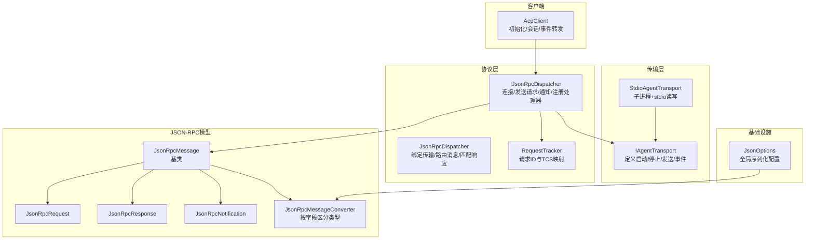
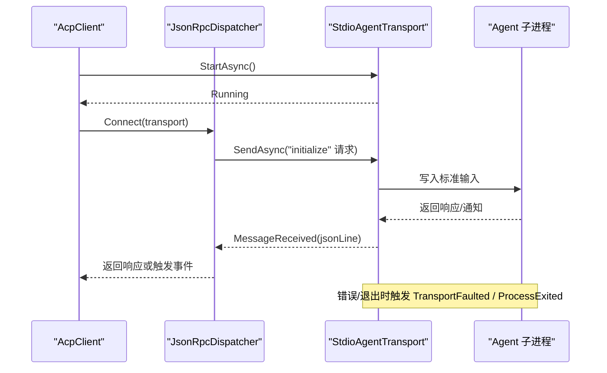
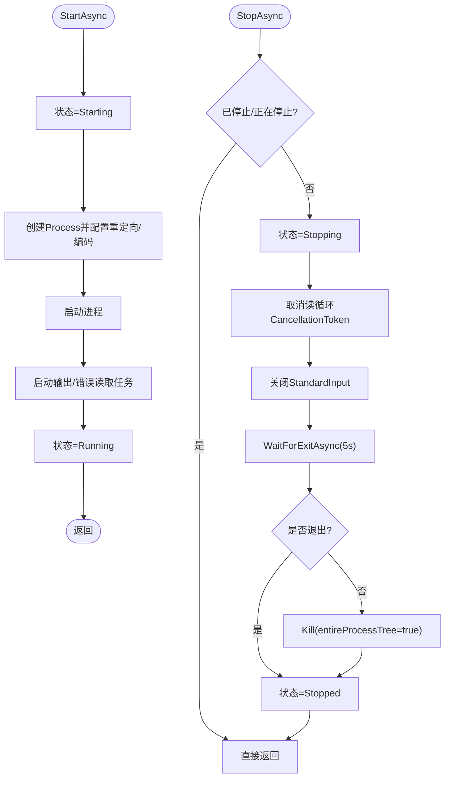
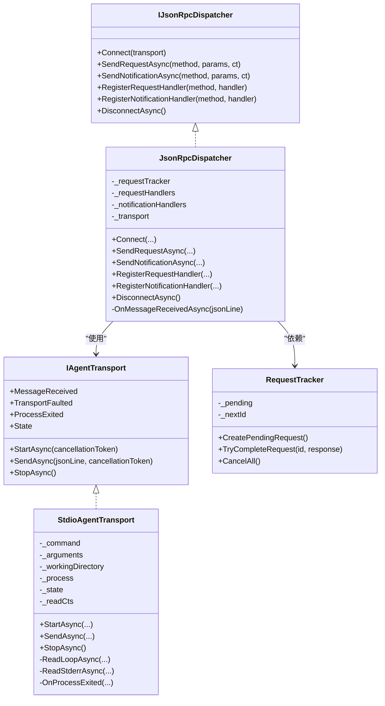
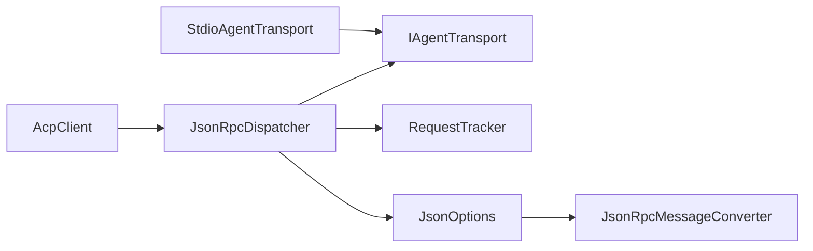

# 传输层

<cite>
**本文引用的文件**   
- [IAgentTransport.cs](file://Transport/IAgentTransport.cs)
- [StdioAgentTransport.cs](file://Transport/StdioAgentTransport.cs)
- [JsonRpcMessage.cs](file://JsonRpc/JsonRpcMessage.cs)
- [JsonRpcMessageConverter.cs](file://JsonRpc/JsonRpcMessageConverter.cs)
- [JsonRpcRequest.cs](file://JsonRpc/JsonRpcRequest.cs)
- [JsonRpcResponse.cs](file://JsonRpc/JsonRpcResponse.cs)
- [JsonRpcNotification.cs](file://JsonRpc/JsonRpcNotification.cs)
- [IJsonRpcDispatcher.cs](file://Protocol/IJsonRpcDispatcher.cs)
- [JsonRpcDispatcher.cs](file://Protocol/JsonRpcDispatcher.cs)
- [RequestTracker.cs](file://Protocol/RequestTracker.cs)
- [JsonOptions.cs](file://Infrastructure/JsonOptions.cs)
- [AcpClient.cs](file://Client/AcpClient.cs)
- [README.md](file://README.md)
</cite>

## 目录
1. [简介](#简介)
2. [项目结构](#项目结构)
3. [核心组件](#核心组件)
4. [架构总览](#架构总览)
5. [详细组件分析](#详细组件分析)
6. [依赖关系分析](#依赖关系分析)
7. [性能考量](#性能考量)
8. [故障排查指南](#故障排查指南)
9. [结论](#结论)
10. [附录：自定义传输实现指南与示例](#附录自定义传输实现指南与示例)

## 简介
本章节聚焦于传输层的设计与实现，解释 IAgentTransport 抽象的意图、职责边界以及在整体 ACP 客户端架构中的作用。同时深入剖析 StdioAgentTransport 的实现细节，包括进程生命周期管理、标准输入/输出通信、消息序列化/反序列化集成、错误恢复机制与超时处理。最后提供自定义传输实现的指导、最佳实践、常见问题以及安全与性能优化建议，并给出完整的代码级参考路径以便快速上手。

## 项目结构
传输层位于 Transport 命名空间下，包含接口与基于 stdio 的默认实现；协议层负责 JSON-RPC 分发与请求跟踪；基础设施提供统一的 JSON 序列化选项；客户端将传输层与分发器组合起来完成握手与业务调用。

图表来源
- [IAgentTransport.cs:1-39](file://Transport/IAgentTransport.cs#L1-L39)
- [StdioAgentTransport.cs:1-147](file://Transport/StdioAgentTransport.cs#L1-L147)
- [IJsonRpcDispatcher.cs:1-14](file://Protocol/IJsonRpcDispatcher.cs#L1-L14)
- [JsonRpcDispatcher.cs:1-124](file://Protocol/JsonRpcDispatcher.cs#L1-L124)
- [RequestTracker.cs:1-52](file://Protocol/RequestTracker.cs#L1-L52)
- [JsonRpcMessage.cs:1-14](file://JsonRpc/JsonRpcMessage.cs#L1-L14)
- [JsonRpcMessageConverter.cs:1-73](file://JsonRpc/JsonRpcMessageConverter.cs#L1-L73)
- [JsonRpcRequest.cs:1-19](file://JsonRpc/JsonRpcRequest.cs#L1-L19)
- [JsonRpcResponse.cs:1-20](file://JsonRpc/JsonRpcResponse.cs#L1-L20)
- [JsonRpcNotification.cs:1-16](file://JsonRpc/JsonRpcNotification.cs#L1-L16)
- [JsonOptions.cs:1-28](file://Infrastructure/JsonOptions.cs#L1-L28)
- [AcpClient.cs:1-200](file://Client/AcpClient.cs#L1-L200)

章节来源
- [README.md:1-99](file://README.md#L1-L99)

## 核心组件
- IAgentTransport：定义传输层的统一契约，包括启动、发送单行 JSON-RPC 消息、接收消息事件、异常事件、进程退出事件、停止以及状态枚举。该接口屏蔽底层通信细节（如 stdio、管道、WebSocket），使上层协议层无需关心具体实现。
- StdioAgentTransport：基于子进程的 stdio 实现，封装进程创建、标准输入/输出/错误流读取、优雅关闭与强制终止、状态机推进、事件上报等。
- JsonRpcDispatcher：将 IAgentTransport 的消息流解析为 JSON-RPC 请求/响应/通知，并通过 RequestTracker 关联请求 ID 与等待结果的任务源。
- JsonOptions：集中配置 System.Text.Json 的行为，注册 JsonRpcMessageConverter 以支持多态消息类型识别。

章节来源
- [IAgentTransport.cs:1-39](file://Transport/IAgentTransport.cs#L1-L39)
- [StdioAgentTransport.cs:1-147](file://Transport/StdioAgentTransport.cs#L1-L147)
- [JsonRpcDispatcher.cs:1-124](file://Protocol/JsonRpcDispatcher.cs#L1-L124)
- [JsonOptions.cs:1-28](file://Infrastructure/JsonOptions.cs#L1-L28)

## 架构总览
传输层处于“协议层”和“外部进程”之间，向上暴露稳定的异步 API，向下管理进程与 IO。JsonRpcDispatcher 订阅传输层的 MessageReceived 事件，进行反序列化和路由；StdioAgentTransport 通过子进程的标准输入输出逐行传递 JSON 文本，并在进程退出时触发 ProcessExited 事件。

图表来源
- [AcpClient.cs:1-200](file://Client/AcpClient.cs#L1-L200)
- [JsonRpcDispatcher.cs:1-124](file://Protocol/JsonRpcDispatcher.cs#L1-L124)
- [StdioAgentTransport.cs:1-147](file://Transport/StdioAgentTransport.cs#L1-L147)

## 详细组件分析

### IAgentTransport 接口设计
- 设计理念：将“启动/停止”、“单向发送”、“事件驱动接收”、“异常与进程退出回调”、“状态查询”解耦为清晰的方法与事件，便于替换不同传输介质（stdio、管道、网络）。
- 抽象层次：仅关注“行式 JSON 文本”的收发，不关心编码、分帧、重连等细节由具体实现决定。
- 状态机：Created → Starting → Running → Stopping → Stopped/Faulted，确保生命周期可控且可观测。

章节来源
- [IAgentTransport.cs:1-39](file://Transport/IAgentTransport.cs#L1-L39)

### StdioAgentTransport 实现要点
- 进程管理
  - 使用 ProcessStartInfo 配置命令、参数、工作目录、重定向标准输入/输出/错误、UTF-8 编码、无窗口模式。
  - 启动后分别异步读取 StandardOutput 与 StandardError，避免阻塞。
- 标准输入/输出通信
  - SendAsync 向 StandardInput 写入一行 JSON 并 Flush，保证对端能逐行接收。
  - ReadLoopAsync 循环读取 StandardOutput，遇到空行跳过，EOF 退出循环，非空行通过 MessageReceived 事件上报。
- 消息序列化/反序列化
  - 传输层只负责“行式 JSON 文本”，具体的 JSON-RPC 类型识别由 JsonRpcMessageConverter 在协议层完成。
- 进程生命周期与事件
  - StartAsync 设置状态为 Starting，启动完成后置为 Running。
  - StopAsync 先取消读循环，尝试正常关闭输入流并等待退出；若超时则 Kill 整个进程树，最终状态置为 Stopped。
  - OnProcessExited 捕获退出码并触发 ProcessExited 事件。
- 错误恢复与超时
  - 读循环捕获 OperationCanceledException 视为正常关闭；其他异常通过 TransportFaulted 上报。
  - 停止流程内置 5 秒超时，失败则强杀进程，防止僵尸进程。

图表来源
- [StdioAgentTransport.cs:30-93](file://Transport/StdioAgentTransport.cs#L30-L93)

章节来源
- [StdioAgentTransport.cs:1-147](file://Transport/StdioAgentTransport.cs#L1-L147)

### 协议层与传输层的协作
- JsonRpcDispatcher.Connect 将自身与 IAgentTransport 绑定，订阅 MessageReceived。
- SendRequestAsync 生成带唯一 Id 的请求，序列化后通过 transport.SendAsync 发送，并等待对应 TCS 完成。
- OnMessageReceivedAsync 根据字段 presence 区分请求/响应/通知，响应通过 RequestTracker.TryCompleteRequest 唤醒等待方；请求与通知分别路由到注册的处理器。
- RequestTracker 维护并发字典，保证请求与响应的正确匹配，并提供取消全部挂起请求的能力。

图表来源
- [IAgentTransport.cs:1-39](file://Transport/IAgentTransport.cs#L1-L39)
- [StdioAgentTransport.cs:1-147](file://Transport/StdioAgentTransport.cs#L1-L147)
- [IJsonRpcDispatcher.cs:1-14](file://Protocol/IJsonRpcDispatcher.cs#L1-L14)
- [JsonRpcDispatcher.cs:1-124](file://Protocol/JsonRpcDispatcher.cs#L1-L124)
- [RequestTracker.cs:1-52](file://Protocol/RequestTracker.cs#L1-L52)

章节来源
- [JsonRpcDispatcher.cs:1-124](file://Protocol/JsonRpcDispatcher.cs#L1-L124)
- [RequestTracker.cs:1-52](file://Protocol/RequestTracker.cs#L1-L52)

### JSON-RPC 消息与序列化
- JsonRpcMessageConverter 依据是否存在 method/id/result/error 字段，将原始 JSON 反序列化为 Request/Notification/Response 或基类，避免手动判断。
- JsonOptions 全局启用大小写不敏感、忽略 null 属性、紧凑输出、允许元数据属性乱序，并注册上述转换器与字符串枚举转换器。
- 传输层仅负责行式 JSON 文本，序列化细节完全委托给协议层与基础设施。

章节来源
- [JsonRpcMessageConverter.cs:1-73](file://JsonRpc/JsonRpcMessageConverter.cs#L1-L73)
- [JsonOptions.cs:1-28](file://Infrastructure/JsonOptions.cs#L1-L28)
- [JsonRpcMessage.cs:1-14](file://JsonRpc/JsonRpcMessage.cs#L1-L14)
- [JsonRpcRequest.cs:1-19](file://JsonRpc/JsonRpcRequest.cs#L1-L19)
- [JsonRpcResponse.cs:1-20](file://JsonRpc/JsonRpcResponse.cs#L1-L20)
- [JsonRpcNotification.cs:1-16](file://JsonRpc/JsonRpcNotification.cs#L1-L16)

## 依赖关系分析
- 耦合度
  - StdioAgentTransport 仅依赖 .NET 进程与 IO API，不感知 JSON-RPC 语义，低耦合高内聚。
  - JsonRpcDispatcher 依赖 IAgentTransport 与 RequestTracker，屏蔽了传输细节与请求匹配逻辑。
- 外部依赖
  - System.Diagnostics.Process、System.IO.StreamReader、System.Text.Json。
- 潜在循环依赖
  - 传输层与协议层通过接口解耦，不存在循环引用。
- 集成点
  - AcpClient 组合传输与分发器，完成握手与会话管理，并将传输层事件上抛。

图表来源
- [AcpClient.cs:1-200](file://Client/AcpClient.cs#L1-L200)
- [JsonRpcDispatcher.cs:1-124](file://Protocol/JsonRpcDispatcher.cs#L1-L124)
- [StdioAgentTransport.cs:1-147](file://Transport/StdioAgentTransport.cs#L1-L147)
- [JsonOptions.cs:1-28](file://Infrastructure/JsonOptions.cs#L1-L28)
- [JsonRpcMessageConverter.cs:1-73](file://JsonRpc/JsonRpcMessageConverter.cs#L1-L73)

章节来源
- [AcpClient.cs:1-200](file://Client/AcpClient.cs#L1-L200)

## 性能考量
- 零拷贝与缓冲
  - 使用 StreamReader.ReadLineAsync 逐行读取，避免一次性加载大消息；如需更高吞吐，可在自定义传输中引入更高效的缓冲策略。
- 并发与线程
  - 输出与错误读取各自独立 Task，避免互相阻塞；Write 操作应保证顺序性（当前实现按行写入并 Flush，满足 JSON-RPC 行协议）。
- 序列化开销
  - JsonOptions 禁用缩进、忽略 null，减少体积；Converter 缓存内部选项，避免重复构建。
- 资源释放
  - StopAsync 强制超时后 Kill 进程树，避免僵尸进程占用系统资源。
- 背压与限流
  - 当前实现未实现背压控制；在高负载场景下，建议在自定义传输中加入队列与限速，防止上游过快导致内存增长。

[本节为通用性能建议，不直接分析具体文件]

## 故障排查指南
- 常见症状
  - 无法启动子进程：检查命令路径、参数与工作目录是否正确。
  - 收不到消息：确认 StandardOutput 是否为 UTF-8 编码，是否被其他日志输出污染。
  - 进程异常退出：监听 ProcessExited 事件获取退出码；查看 StandardError 内容定位问题。
  - 发送失败：确保 State 为 Running，否则抛出无效操作异常。
- 调试技巧
  - 在 MessageReceived 处记录原始 JSON 行，验证协议一致性。
  - 临时将 StandardError 重定向到控制台或文件，观察子进程诊断信息。
  - 使用 TransportFaulted 事件捕获 IO 异常，必要时增加重试或降级策略。
- 恢复策略
  - 收到 TransportFaulted 后可尝试重建传输实例并重连（需在应用层实现）。
  - 对于长时间无响应的请求，结合 CancellationToken 与 RequestTracker.CancelAll 清理挂起任务。

章节来源
- [StdioAgentTransport.cs:95-145](file://Transport/StdioAgentTransport.cs#L95-L145)
- [JsonRpcDispatcher.cs:86-122](file://Protocol/JsonRpcDispatcher.cs#L86-L122)
- [RequestTracker.cs:32-40](file://Protocol/RequestTracker.cs#L32-L40)

## 结论
传输层通过 IAgentTransport 抽象出跨介质的通信能力，StdioAgentTransport 提供了开箱即用的进程间通信实现，配合 JsonRpcDispatcher 与 RequestTracker 实现了健壮的 JSON-RPC 交互。其清晰的职责划分、完善的生命周期管理与事件机制，使得扩展新的传输方式变得简单可靠。在生产环境中，建议结合日志、监控与超时/重试策略，进一步提升稳定性与可观测性。

[本节为总结性内容，不直接分析具体文件]

## 附录：自定义传输实现指南与示例

### 接口要求
- 必须实现 IAgentTransport 的所有成员：
  - StartAsync：启动传输（例如建立网络连接、打开管道）。
  - SendAsync：发送单行 JSON 文本。
  - MessageReceived：当收到一条完整消息时触发。
  - TransportFaulted：发生不可恢复错误时触发。
  - ProcessExited：底层进程/连接退出时触发（如适用）。
  - StopAsync：优雅关闭并释放资源。
  - State：反映当前状态，遵循 Created/Starting/Running/Stopping/Stopped/Faulted 状态机。

章节来源
- [IAgentTransport.cs:1-39](file://Transport/IAgentTransport.cs#L1-L39)

### 最佳实践
- 可靠性
  - 在 StartAsync 中完成必要的握手与校验，失败时保持状态为 Created 或 Faulted。
  - 在 SendAsync 前校验 State 为 Running，避免非法状态下的发送。
  - 对 IO 异常进行捕获并通过 TransportFaulted 上报，不要吞掉异常。
- 并发与线程安全
  - 事件触发需考虑并发调用者，必要时加锁或使用线程安全的队列。
  - 读取循环应支持取消令牌，StopAsync 中及时取消以避免悬挂任务。
- 资源管理
  - 确保 StopAsync 能释放所有句柄、套接字、缓冲区等。
  - 对进程型传输，优先优雅关闭，再考虑强制终止。
- 序列化与编码
  - 明确字符集（推荐 UTF-8），避免混用编码导致乱码。
  - 保证消息按行分隔，避免粘包/拆包问题。

### 常见问题
- 忘记触发事件：务必在收到消息、异常、进程退出时触发对应事件。
- 状态不一致：状态变更应与实际生命周期一致，避免中间态泄露。
- 编码不一致：两端编码不一致会导致解析失败，统一为 UTF-8。
- 未处理 EOF：读取循环应在 EOF 时退出并触发相应事件。

### 安全考虑
- 白名单与权限
  - 限制可执行的命令与工作目录，防止任意命令执行。
  - 对传入参数进行校验与过滤，避免注入攻击。
- 最小权限原则
  - 子进程以最小权限运行，隔离文件系统与网络访问。
- 输入校验
  - 对收到的 JSON 进行长度与结构校验，拒绝畸形消息。

### 性能优化
- 批量与缓冲
  - 在高吞吐场景，可引入环形缓冲与批处理发送，但需保证行协议不变。
- 异步化
  - 所有 IO 操作使用异步 API，避免阻塞线程池。
- 序列化优化
  - 复用 JsonSerializerOptions，避免频繁创建对象。

### 完整示例：实现自定义传输（步骤与参考路径）
以下为实现一个基于内存管道的自定义传输的步骤与关键位置参考（不展示代码内容，仅提供路径指引）：

- 步骤一：定义传输类并实现 IAgentTransport
  - 参考接口定义位置：[IAgentTransport.cs:1-39](file://Transport/IAgentTransport.cs#L1-L39)
- 步骤二：实现 StartAsync
  - 初始化内部管道/队列，启动读取循环，更新状态为 Starting/Running
  - 参考状态与事件模式：[StdioAgentTransport.cs:30-58](file://Transport/StdioAgentTransport.cs#L30-L58)
- 步骤三：实现 SendAsync
  - 校验状态，写入一行 JSON，刷新缓冲
  - 参考发送模式：[StdioAgentTransport.cs:61-68](file://Transport/StdioAgentTransport.cs#L61-L68)
- 步骤四：实现读取循环与事件触发
  - 从管道读取行，过滤空行，触发 MessageReceived
  - 参考读取循环：[StdioAgentTransport.cs:95-118](file://Transport/StdioAgentTransport.cs#L95-L118)
- 步骤五：实现 StopAsync
  - 取消读取循环，关闭资源，更新状态为 Stopped
  - 参考停止流程：[StdioAgentTransport.cs:70-93](file://Transport/StdioAgentTransport.cs#L70-L93)
- 步骤六：处理异常与进程退出
  - 捕获 IO 异常触发 TransportFaulted；在底层退出时触发 ProcessExited
  - 参考异常与退出处理：[StdioAgentTransport.cs:120-145](file://Transport/StdioAgentTransport.cs#L120-L145)
- 步骤七：与协议层集成
  - 使用 JsonRpcDispatcher.Connect 绑定传输，注册处理器，发起请求
  - 参考集成方式：[JsonRpcDispatcher.cs:21-47](file://Protocol/JsonRpcDispatcher.cs#L21-L47)

章节来源
- [IAgentTransport.cs:1-39](file://Transport/IAgentTransport.cs#L1-L39)
- [StdioAgentTransport.cs:1-147](file://Transport/StdioAgentTransport.cs#L1-L147)
- [JsonRpcDispatcher.cs:1-124](file://Protocol/JsonRpcDispatcher.cs#L1-L124)