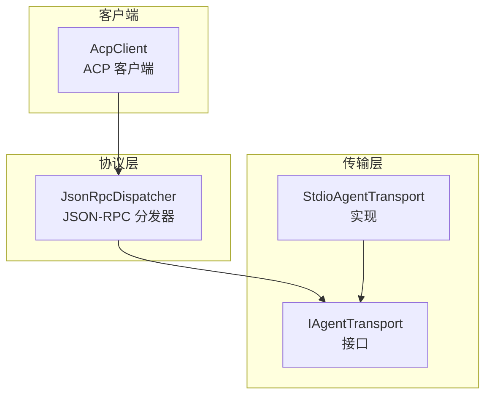
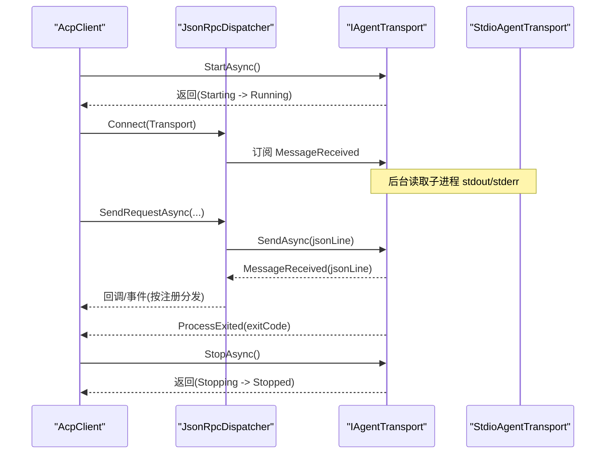
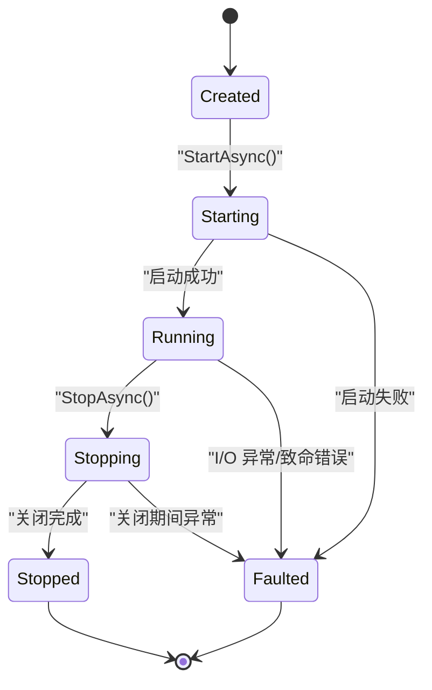
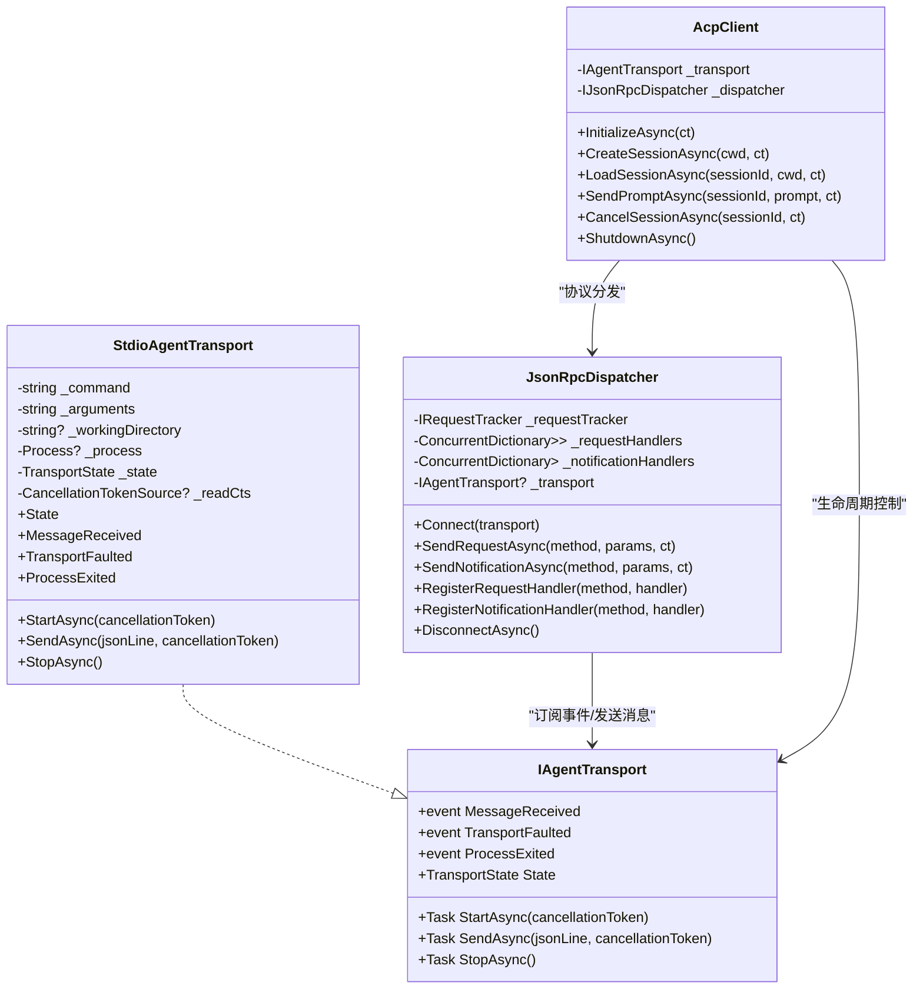
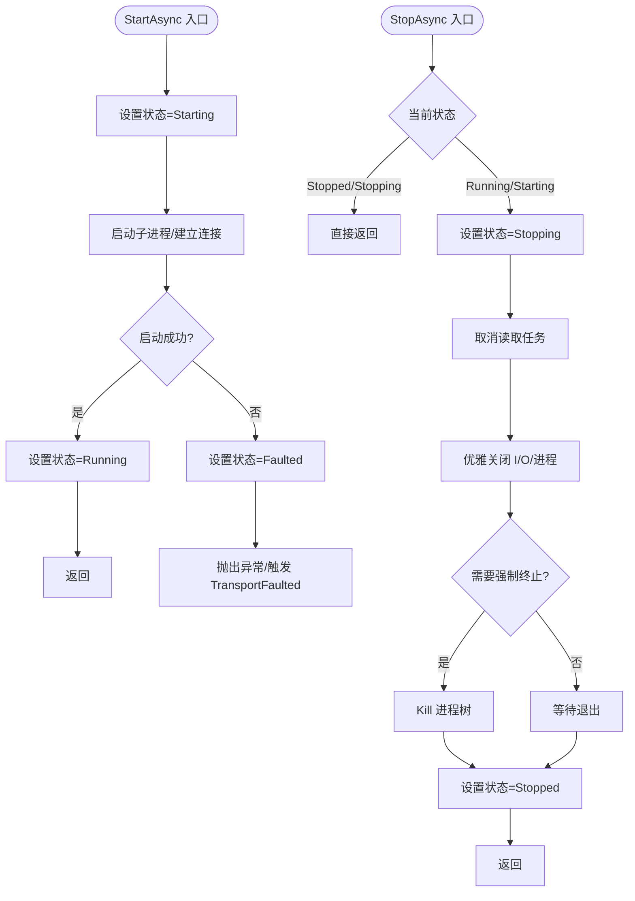

# 传输层接口规范

<cite>
**本文引用的文件**   
- [IAgentTransport.cs](file://Transport\IAgentTransport.cs)
- [StdioAgentTransport.cs](file://Transport\StdioAgentTransport.cs)
- [JsonRpcDispatcher.cs](file://Protocol\JsonRpcDispatcher.cs)
- [AcpClient.cs](file://Client\AcpClient.cs)
</cite>

## 目录
1. [简介](#简介)
2. [项目结构](#项目结构)
3. [核心组件](#核心组件)
4. [架构总览](#架构总览)
5. [详细组件分析](#详细组件分析)
6. [依赖关系分析](#依赖关系分析)
7. [性能与线程安全](#性能与线程安全)
8. [故障排查指南](#故障排查指南)
9. [结论](#结论)
10. [附录：实现最佳实践与示例](#附录实现最佳实践与示例)

## 简介
本规范围绕 IAgentTransport 传输层抽象接口，系统阐述其设计理念、职责边界、生命周期方法、事件机制与状态机。该接口用于屏蔽底层通信细节（如子进程标准输入输出、网络等），为上层协议分发器与客户端提供统一的“启动/发送/停止”能力与消息通道。通过事件驱动的消息接收与错误处理，传输层将异步 I/O 与进程生命周期管理解耦，便于扩展多种实现（如 stdio、mock、TCP/HTTP 等）。

## 项目结构
传输层位于 Transport 命名空间下，包含接口定义与一个基于子进程 stdio 的默认实现；协议层 JsonRpcDispatcher 订阅传输层的消息事件进行解析与路由；客户端 AcpClient 负责编排初始化、会话管理与资源释放。

图表来源
- [IAgentTransport.cs:1-39](file://Transport\IAgentTransport.cs#L1-L39)
- [StdioAgentTransport.cs:1-147](file://Transport\StdioAgentTransport.cs#L1-L147)
- [JsonRpcDispatcher.cs:1-124](file://Protocol\JsonRpcDispatcher.cs#L1-L124)
- [AcpClient.cs:1-361](file://Client\AcpClient.cs#L1-L361)

章节来源
- [IAgentTransport.cs:1-39](file://Transport\IAgentTransport.cs#L1-L39)
- [StdioAgentTransport.cs:1-147](file://Transport\StdioAgentTransport.cs#L1-L147)
- [JsonRpcDispatcher.cs:1-124](file://Protocol\JsonRpcDispatcher.cs#L1-L124)
- [AcpClient.cs:1-361](file://Client\AcpClient.cs#L1-L361)

## 核心组件
- IAgentTransport：传输层抽象接口，定义生命周期方法与事件。
- StdioAgentTransport：基于子进程的标准输入/输出实现，演示了典型的状态转换、异常处理与事件触发。
- JsonRpcDispatcher：订阅 MessageReceived，完成 JSON-RPC 请求/响应/通知的分发。
- AcpClient：编排传输层与分发器，封装业务初始化与会话流程。

章节来源
- [IAgentTransport.cs:1-39](file://Transport\IAgentTransport.cs#L1-L39)
- [StdioAgentTransport.cs:1-147](file://Transport\StdioAgentTransport.cs#L1-L147)
- [JsonRpcDispatcher.cs:1-124](file://Protocol\JsonRpcDispatcher.cs#L1-L124)
- [AcpClient.cs:1-361](file://Client\AcpClient.cs#L1-L361)

## 架构总览
传输层作为“黑盒管道”，向上暴露统一 API，向下隐藏具体 I/O 细节。JsonRpcDispatcher 通过订阅 MessageReceived 事件消费消息；AcpClient 在初始化阶段连接分发器并订阅 ProcessExited 事件以感知进程退出。

图表来源
- [AcpClient.cs:47-182](file://Client\AcpClient.cs#L47-L182)
- [JsonRpcDispatcher.cs:21-47](file://Protocol\JsonRpcDispatcher.cs#L21-L47)
- [StdioAgentTransport.cs:30-93](file://Transport\StdioAgentTransport.cs#L30-L93)

## 详细组件分析

### IAgentTransport 接口设计
- 职责边界
  - 生命周期：StartAsync、StopAsync
  - 数据面：SendAsync 发送单行 JSON 文本
  - 事件面：MessageReceived、TransportFaulted、ProcessExited
  - 状态面：State 属性暴露当前状态
- 设计要点
  - 所有异步操作均支持 CancellationToken（除 StopAsync）
  - 事件采用 Func<T, Task> 委托，允许异步处理且避免阻塞读取循环
  - State 仅读，由实现方维护，保证调用方可观测传输状态

章节来源
- [IAgentTransport.cs:1-39](file://Transport\IAgentTransport.cs#L1-L39)

### 生命周期方法
- StartAsync(CancellationToken)
  - 作用：启动传输（例如启动子进程、建立网络连接）
  - 行为约定：进入 Starting 状态，完成后进入 Running；失败应抛出异常或触发 TransportFaulted
- SendAsync(string jsonLine, CancellationToken)
  - 作用：发送一行 JSON 文本到对端
  - 行为约定：仅在 Running 状态下可用；非运行态应抛出异常
- StopAsync()
  - 作用：优雅关闭传输（关闭 I/O、终止子进程）
  - 行为约定：幂等；从 Stopping 过渡到 Stopped；可带超时后强制终止

章节来源
- [IAgentTransport.cs:8-28](file://Transport\IAgentTransport.cs#L8-L28)
- [StdioAgentTransport.cs:30-93](file://Transport\StdioAgentTransport.cs#L30-L93)

### 事件机制
- MessageReceived(string)
  - 触发时机：传输层成功读取到一条完整消息（如一行 JSON）
  - 使用方式：订阅后异步解析并路由（如 JsonRpcDispatcher）
- TransportFaulted(Exception)
  - 触发时机：底层 I/O 或运行时出现异常（如读取失败、编码错误）
  - 使用方式：记录日志、清理资源、决定重试或降级
- ProcessExited(int)
  - 触发时机：底层进程退出（如子进程结束）
  - 使用方式：通知上层进行清理、告警或重启策略

章节来源
- [IAgentTransport.cs:14-21](file://Transport\IAgentTransport.cs#L14-L21)
- [StdioAgentTransport.cs:95-145](file://Transport\StdioAgentTransport.cs#L95-L145)
- [JsonRpcDispatcher.cs:21-25](file://Protocol\JsonRpcDispatcher.cs#L21-L25)
- [AcpClient.cs:55-61](file://Client\AcpClient.cs#L55-L61)

### 状态机：TransportState
- 状态枚举
  - Created：初始创建，未启动
  - Starting：正在启动
  - Running：已就绪，可收发
  - Stopping：正在停止
  - Stopped：已停止
  - Faulted：发生不可恢复错误
- 转换规则（推荐）
  - Created → Starting → Running
  - Running → Stopping → Stopped
  - 任意状态 → Faulted（发生严重错误时）
  - 注意：Stopped 与 Faulted 为终态，不应再回到 Running

图表来源
- [IAgentTransport.cs:30-38](file://Transport\IAgentTransport.cs#L30-L38)
- [StdioAgentTransport.cs:14-93](file://Transport\StdioAgentTransport.cs#L14-L93)

章节来源
- [IAgentTransport.cs:30-38](file://Transport\IAgentTransport.cs#L30-L38)
- [StdioAgentTransport.cs:14-93](file://Transport\StdioAgentTransport.cs#L14-L93)

### 实现参考：StdioAgentTransport
- 关键点
  - 使用 Process 启动子进程，重定向 stdin/stdout/stderr
  - 后台任务持续读取 stdout 并通过 MessageReceived 上报
  - stderr 读取用于诊断，不对外暴露
  - StopAsync 先取消读取任务，再优雅关闭输入流并等待退出，必要时强制 Kill
  - OnProcessExited 更新状态并触发 ProcessExited
- 注意事项
  - 发送前校验 State == Running，否则抛异常
  - 读取循环捕获 OperationCanceledException 视为正常关闭
  - 其他异常通过 TransportFaulted 上报

章节来源
- [StdioAgentTransport.cs:1-147](file://Transport\StdioAgentTransport.cs#L1-L147)

### 集成点：JsonRpcDispatcher 与 AcpClient
- JsonRpcDispatcher.Connect(IAgentTransport)
  - 订阅 MessageReceived，反序列化并按类型分发给请求处理器、通知处理器或完成待决请求
- AcpClient.InitializeAsync
  - 调用 StartAsync，Connect 分发器，订阅 ProcessExited，注册业务处理器，发起 initialize 握手

章节来源
- [JsonRpcDispatcher.cs:21-47](file://Protocol\JsonRpcDispatcher.cs#L21-L47)
- [JsonRpcDispatcher.cs:86-122](file://Protocol\JsonRpcDispatcher.cs#L86-L122)
- [AcpClient.cs:47-182](file://Client\AcpClient.cs#L47-L182)

## 依赖关系分析
- AcpClient 依赖 IAgentTransport 与 IJsonRpcDispatcher
- JsonRpcDispatcher 依赖 IAgentTransport 的事件与发送能力
- StdioAgentTransport 实现 IAgentTransport，依赖操作系统进程管理能力

图表来源
- [IAgentTransport.cs:1-39](file://Transport\IAgentTransport.cs#L1-L39)
- [StdioAgentTransport.cs:1-147](file://Transport\StdioAgentTransport.cs#L1-L147)
- [JsonRpcDispatcher.cs:1-124](file://Protocol\JsonRpcDispatcher.cs#L1-L124)
- [AcpClient.cs:1-361](file://Client\AcpClient.cs#L1-L361)

章节来源
- [IAgentTransport.cs:1-39](file://Transport\IAgentTransport.cs#L1-L39)
- [StdioAgentTransport.cs:1-147](file://Transport\StdioAgentTransport.cs#L1-L147)
- [JsonRpcDispatcher.cs:1-124](file://Protocol\JsonRpcDispatcher.cs#L1-L124)
- [AcpClient.cs:1-361](file://Client\AcpClient.cs#L1-L361)

## 性能与线程安全
- 并发模型
  - 读取循环在独立任务中运行，避免阻塞主线程
  - 事件处理为异步委托，建议避免长时间阻塞
- 线程安全
  - 状态字段应由实现方保证原子性访问（如使用锁或不可变快照）
  - 事件订阅/取消应在连接/断开时成对执行，防止内存泄漏
- I/O 优化
  - 合理设置缓冲区与编码（UTF-8）
  - 使用 CancellationToken 及时取消长耗时操作
- 背压与限流
  - 若实现为网络传输，需考虑队列长度与丢弃策略
  - 对于高吞吐场景，避免在事件处理中做同步阻塞

[本节为通用指导，不直接分析具体文件]

## 故障排查指南
- 常见问题
  - 发送失败：检查 State 是否为 Running；确认 StartAsync 已完成
  - 无消息到达：确认 stdout 是否被正确重定向；检查读取循环是否被取消
  - 进程提前退出：监听 ProcessExited，结合 ExitCode 定位原因
  - 异常未上报：确保 TransportFaulted 已订阅且未吞掉异常
- 调试建议
  - 记录关键状态变更与事件触发顺序
  - 对 SendAsync 与读取循环增加超时与重试策略
  - 区分 stderr 诊断信息与业务消息

章节来源
- [StdioAgentTransport.cs:95-145](file://Transport\StdioAgentTransport.cs#L95-L145)
- [JsonRpcDispatcher.cs:86-122](file://Protocol\JsonRpcDispatcher.cs#L86-L122)
- [AcpClient.cs:55-61](file://Client\AcpClient.cs#L55-L61)

## 结论
IAgentTransport 以最小而清晰的抽象，将传输细节与协议逻辑解耦，配合事件驱动与状态机，实现了健壮、可扩展的传输层。通过遵循生命周期约定、正确处理异常与状态转换，可实现多种传输后端并保持上层稳定。

[本节为总结性内容，不直接分析具体文件]

## 附录：实现最佳实践与示例

### 实现要点清单
- 状态管理
  - 严格遵循 Created → Starting → Running → Stopping → Stopped 的主路径
  - 任何异常导致不可恢复错误时转入 Faulted
- 生命周期
  - StartAsync 必须幂等且可取消；成功后立即进入 Running
  - StopAsync 必须幂等，优先优雅关闭，必要时强制终止
  - SendAsync 在非 Running 状态应快速失败
- 事件处理
  - MessageReceived：只传递完整消息，不做业务解析
  - TransportFaulted：记录上下文，避免重复上报同一错误
  - ProcessExited：携带 ExitCode，供上层决策
- 线程安全
  - 共享状态加锁或使用原子类型
  - 事件订阅/取消与连接/断开对齐
- 资源管理
  - 使用 using/Dispose 模式管理外部资源（进程、流、令牌）
  - 确保取消令牌能中断所有长耗时操作

### 端到端使用示例（步骤说明）
- 创建传输实例
  - 构造 StdioAgentTransport(command, arguments, workingDirectory?)
- 启动传输
  - 调用 StartAsync(ct)，等待进入 Running
- 连接分发器
  - dispatcher.Connect(transport)
- 订阅事件
  - transport.MessageReceived：解析 JSON-RPC 消息
  - transport.TransportFaulted：记录错误
  - transport.ProcessExited：处理退出码
- 发送消息
  - dispatcher.SendRequestAsync / SendNotificationAsync，内部调用 transport.SendAsync
- 关闭
  - dispatcher.DisconnectAsync()
  - transport.StopAsync()

章节来源
- [StdioAgentTransport.cs:23-59](file://Transport\StdioAgentTransport.cs#L23-L59)
- [JsonRpcDispatcher.cs:21-47](file://Protocol\JsonRpcDispatcher.cs#L21-L47)
- [AcpClient.cs:47-182](file://Client\AcpClient.cs#L47-L182)

### 状态转换流程图（实现视角）

图表来源
- [StdioAgentTransport.cs:30-93](file://Transport\StdioAgentTransport.cs#L30-L93)

章节来源
- [StdioAgentTransport.cs:30-93](file://Transport\StdioAgentTransport.cs#L30-L93)