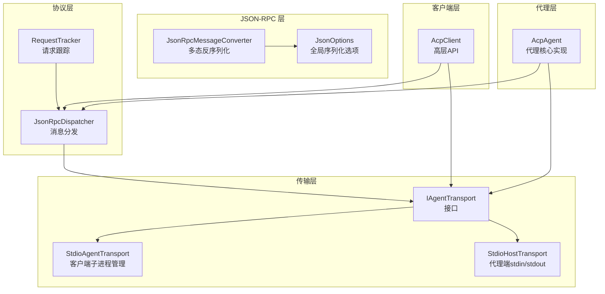
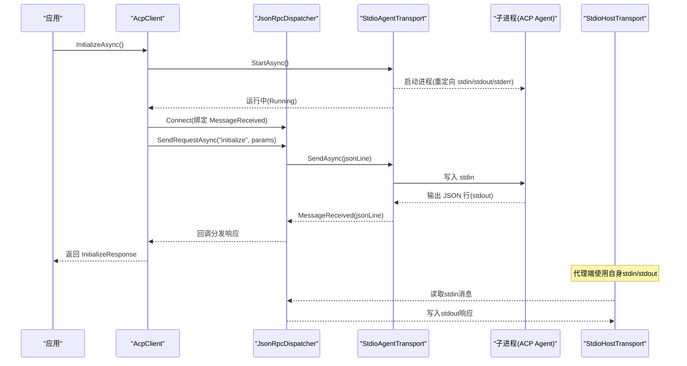
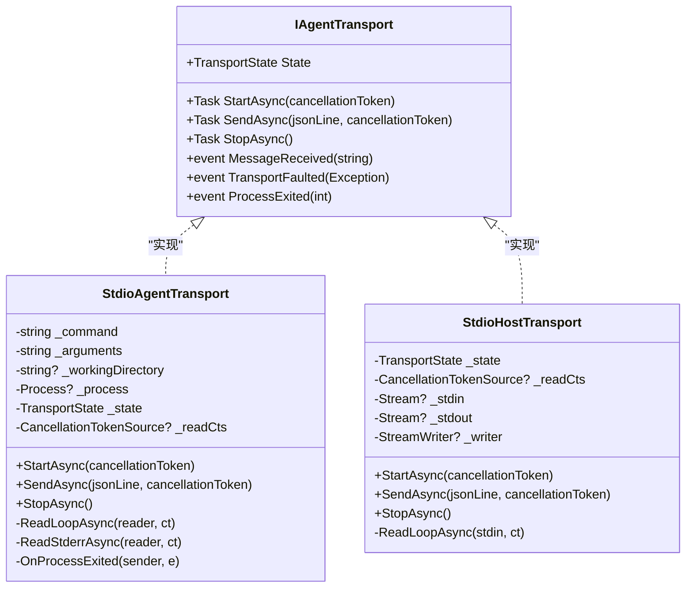
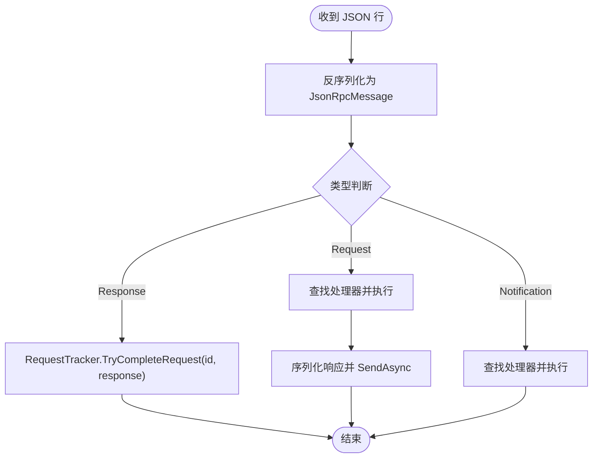
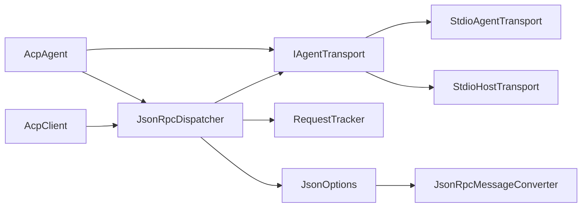

# 标准输入输出实现

<cite>
**本文引用的文件**   
- [StdioAgentTransport.cs](file://Transport/StdioAgentTransport.cs)
- [StdioHostTransport.cs](file://Transport/StdioHostTransport.cs)
- [IAgentTransport.cs](file://Transport/IAgentTransport.cs)
- [JsonRpcDispatcher.cs](file://Protocol/JsonRpcDispatcher.cs)
- [RequestTracker.cs](file://Protocol/RequestTracker.cs)
- [JsonRpcMessageConverter.cs](file://JsonRpc/JsonRpcMessageConverter.cs)
- [JsonOptions.cs](file://Infrastructure/JsonOptions.cs)
- [AcpClient.cs](file://Client/AcpClient.cs)
- [AcpAgent.cs](file://Agent/AcpAgent.cs)
- [README.md](file://README.md)
- [Agentic.ACPLibrary.csproj](file://Agentic.ACPLibrary.csproj)
</cite>

## 更新摘要
**所做更改**   
- 新增 StdioHostTransport 组件的详细文档说明
- 更新架构总览以反映双端传输设计
- 扩展详细组件分析部分，包含代理端传输实现
- 更新使用示例和最佳实践，涵盖客户端和代理端场景
- 增强故障排查指南，包含两种传输类型的诊断方法

## 目录
1. [简介](#简介)
2. [项目结构](#项目结构)
3. [核心组件](#核心组件)
4. [架构总览](#架构总览)
5. [详细组件分析](#详细组件分析)
6. [依赖关系分析](#依赖关系分析)
7. [性能考量](#性能考量)
8. [故障排查指南](#故障排查指南)
9. [结论](#结论)
10. [附录：使用示例与最佳实践](#附录使用示例与最佳实践)

## 简介
本文件围绕 ACP 库中标准输入/输出（stdio）传输实现的深入文档化，解释基于标准输入/输出的进程间通信（IPC）原理。该库提供了两种互补的传输实现：**StdioAgentTransport** 用于客户端侧的子进程管理，**StdioHostTransport** 用于代理端的 stdin/stdout 通信。内容涵盖子进程启动、参数与环境配置；消息读写机制（异步读取 stdout、写入 stdin、JSON 行格式处理与缓冲区管理）；进程生命周期管理（启动、监控、优雅关闭与强制终止）；错误处理策略（连接超时、进程崩溃、IO 异常检测与恢复）；性能优化（异步 IO、内存管理与资源清理）；以及调试技巧（日志记录、错误诊断与常见问题排查）。文末提供完整的使用示例，展示如何通过这两种传输实现与 ACP 代理进行双向通信。

## 项目结构
该库采用分层组织：Transport 层负责进程与 I/O 抽象，提供客户端和代理端两种传输实现；Protocol 层负责 JSON-RPC 分发与请求跟踪；JsonRpc 层定义消息类型与序列化转换器；Infrastructure 层提供统一的 JSON 序列化选项；Client 层封装高层 API 与业务交互；Agent 层提供代理端的核心实现。

图表来源
- [IAgentTransport.cs:1-39](file://Transport/IAgentTransport.cs#L1-L39)
- [StdioAgentTransport.cs:1-150](file://Transport/StdioAgentTransport.cs#L1-L150)
- [StdioHostTransport.cs:1-91](file://Transport/StdioHostTransport.cs#L1-L91)
- [JsonRpcDispatcher.cs:1-124](file://Protocol/JsonRpcDispatcher.cs#L1-L124)
- [RequestTracker.cs:1-52](file://Protocol/RequestTracker.cs#L1-L52)
- [JsonRpcMessageConverter.cs:1-73](file://JsonRpc/JsonRpcMessageConverter.cs#L1-L73)
- [JsonOptions.cs:1-28](file://Infrastructure/JsonOptions.cs#L1-L28)
- [AcpClient.cs:1-361](file://Client/AcpClient.cs#L1-L361)
- [AcpAgent.cs:1-309](file://Agent/AcpAgent.cs#L1-L309)

章节来源
- [README.md:1-193](file://README.md#L1-L193)
- [Agentic.ACPLibrary.csproj:1-36](file://Agentic.ACPLibrary.csproj#L1-L36)

## 核心组件
- **IAgentTransport**：定义传输抽象，包括 StartAsync、SendAsync、StopAsync、事件（MessageReceived、TransportFaulted、ProcessExited）和状态机 TransportState。
- **StdioAgentTransport**：基于 System.Diagnostics.Process 的客户端传输实现，负责子进程启动、stdout/stderr 异步读取、stdin 写入、进程退出监听与优雅关闭。
- **StdioHostTransport**：基于 Console 流的代理端传输实现，直接使用进程的 stdin/stdout 进行通信，无需启动额外进程。
- **JsonRpcDispatcher**：将 JSON-RPC 请求/通知通过 IAgentTransport 发送，并分发接收到的消息到对应处理器。
- **RequestTracker**：维护待完成请求的 TaskCompletionSource，支持超时取消与结果回填。
- **JsonRpcMessageConverter**：根据字段存在性区分 JsonRpcRequest/Notification/Response，避免递归并复用序列化选项。
- **JsonOptions**：集中配置 System.Text.Json 行为（大小写不敏感、忽略 null、紧凑输出、允许元数据乱序、注册转换器）。
- **AcpClient**：高层客户端，封装初始化握手、会话创建、提示发送、事件订阅与处理器注册。
- **AcpAgent**：代理端核心实现，镜像 AcpClient 的反向通信方向，监听 Client 请求并分发给用户提供的 IAcpAgentHandler。

章节来源
- [IAgentTransport.cs:1-39](file://Transport/IAgentTransport.cs#L1-L39)
- [StdioAgentTransport.cs:1-150](file://Transport/StdioAgentTransport.cs#L1-L150)
- [StdioHostTransport.cs:1-91](file://Transport/StdioHostTransport.cs#L1-L91)
- [JsonRpcDispatcher.cs:1-124](file://Protocol/JsonRpcDispatcher.cs#L1-L124)
- [RequestTracker.cs:1-52](file://Protocol/RequestTracker.cs#L1-L52)
- [JsonRpcMessageConverter.cs:1-73](file://JsonRpc/JsonRpcMessageConverter.cs#L1-L73)
- [JsonOptions.cs:1-28](file://Infrastructure/JsonOptions.cs#L1-L28)
- [AcpClient.cs:1-361](file://Client/AcpClient.cs#L1-L361)
- [AcpAgent.cs:1-309](file://Agent/AcpAgent.cs#L1-L309)

## 架构总览
下图展示了从 AcpClient 发起调用到传输层与子进程通信的整体流程，以及代理端如何使用 StdioHostTransport 进行通信。

图表来源
- [AcpClient.cs:48-182](file://Client/AcpClient.cs#L48-L182)
- [AcpAgent.cs:44-179](file://Agent/AcpAgent.cs#L44-L179)
- [JsonRpcDispatcher.cs:27-47](file://Protocol/JsonRpcDispatcher.cs#L27-L47)
- [StdioAgentTransport.cs:30-68](file://Transport/StdioAgentTransport.cs#L30-L68)
- [StdioHostTransport.cs:23-37](file://Transport/StdioHostTransport.cs#L23-L37)

## 详细组件分析

### StdioAgentTransport：客户端侧子进程管理实现
- **子进程启动与配置**
  - 使用 ProcessStartInfo 指定可执行文件、参数、工作目录，启用 stdin/stdout/stderr 重定向，禁用 ShellExecute，设置 UTF-8 编码。
  - 启用进程事件以监听退出。
- **异步消息读写**
  - 启动两个后台任务：ReadLoopAsync 持续读取 StandardOutput 行，遇到空行跳过，非空行触发 MessageReceived；ReadStderrAsync 读取 StandardError 用于诊断。
  - SendAsync 校验运行状态后写入一行 JSON 并 Flush，确保对端按行解析。
- **进程生命周期管理**
  - StartAsync：状态从 Created -> Starting -> Running。
  - StopAsync：优雅关闭流程，先取消读循环，尝试关闭 stdin 并等待退出；若超时则强制 Kill entireProcessTree=true。
  - OnProcessExited：更新状态为 Stopped，并通过 ProcessExited 事件上报退出码。
- **错误处理**
  - ReadLoopAsync 捕获 OperationCanceledException 视为正常关闭；其他异常通过 TransportFaulted 事件上报。
  - ReadStderrAsync 忽略异常，仅用于诊断。
- **状态机**
  - TransportState：Created、Starting、Running、Stopping、Stopped、Faulted。

图表来源
- [IAgentTransport.cs:1-39](file://Transport/IAgentTransport.cs#L1-L39)
- [StdioAgentTransport.cs:1-150](file://Transport/StdioAgentTransport.cs#L1-L150)
- [StdioHostTransport.cs:1-91](file://Transport/StdioHostTransport.cs#L1-L91)

章节来源
- [StdioAgentTransport.cs:30-93](file://Transport/StdioAgentTransport.cs#L30-L93)
- [StdioAgentTransport.cs:95-146](file://Transport/StdioAgentTransport.cs#L95-L146)

### StdioHostTransport：代理端stdin/stdout通信实现
- **直接流访问**
  - 使用 Console.OpenStandardInput() 和 Console.OpenStandardOutput() 直接访问当前进程的 stdin/stdout。
  - 创建 BOM-less UTF-8 StreamWriter，确保第一个 JSON-RPC 行不被 BOM 破坏。
- **异步消息处理**
  - 启动后台任务 ReadLoopAsync 持续读取 stdin 行，遇到空行跳过，非空行触发 MessageReceived。
  - SendAsync 校验运行状态后写入一行 JSON 并 Flush。
- **生命周期管理**
  - StartAsync：状态从 Created -> Starting -> Running，启动读取循环。
  - StopAsync：优雅关闭流程，取消读取循环，状态变为 Stopped。
- **错误处理**
  - ReadLoopAsync 捕获 OperationCanceledException 视为正常关闭；其他异常通过 TransportFaulted 事件上报。
  - EOF 时触发 ProcessExited 事件，退出码为 0。
- **状态机**
  - TransportState：Created、Starting、Running、Stopping、Stopped、Faulted。

**更新** 新增的 StdioHostTransport 为代理端提供了轻量级的 stdio 通信实现，无需启动额外进程。

章节来源
- [StdioHostTransport.cs:23-37](file://Transport/StdioHostTransport.cs#L23-L37)
- [StdioHostTransport.cs:39-58](file://Transport/StdioHostTransport.cs#L39-L58)
- [StdioHostTransport.cs:60-89](file://Transport/StdioHostTransport.cs#L60-L89)

### AcpAgent：代理端核心实现
- **传输集成**
  - 接受 IAgentTransport 作为构造函数参数，支持 StdioHostTransport 或其他实现。
  - RunAsync 启动传输，连接分发器，注册 JSON-RPC 处理器。
- **处理器注册**
  - 注册 initialize、session/new、session/prompt 请求处理器。
  - 注册 session/cancel 通知处理器。
- **会话管理**
  - 维护活动会话的 CancellationTokenSource 字典。
  - 支持会话取消和资源清理。
- **上下文提供**
  - 提供 IAcpAgentContext 实现，允许代理在 HandlePromptAsync 期间向客户端发送请求。

章节来源
- [AcpAgent.cs:44-179](file://Agent/AcpAgent.cs#L44-L179)
- [AcpAgent.cs:214-307](file://Agent/AcpAgent.cs#L214-L307)

### JsonRpcDispatcher：JSON-RPC 消息分发与请求跟踪
- **连接与解耦**
  - Connect 绑定 IAgentTransport.MessageReceived，统一入口处理所有入站消息。
- **发送请求与通知**
  - SendRequestAsync：生成唯一 id，创建 Pending TCS，序列化请求并通过 Transport.SendAsync 发送，等待响应或异常。
  - SendNotificationAsync：无返回值的通知发送。
- **入站消息处理**
  - OnMessageReceivedAsync：使用 JsonOptions.Default 反序列化为 JsonRpcMessage，依据类型分派：
    - Response：通过 RequestTracker.TryCompleteRequest 完成等待的请求。
    - Request：查找已注册的处理器并返回响应。
    - Notification：查找已注册的处理器并执行。
- **断开与清理**
  - DisconnectAsync：解除事件订阅，取消所有待处理请求。

图表来源
- [JsonRpcDispatcher.cs:86-122](file://Protocol/JsonRpcDispatcher.cs#L86-L122)
- [JsonRpcDispatcher.cs:27-64](file://Protocol/JsonRpcDispatcher.cs#L27-L64)

章节来源
- [JsonRpcDispatcher.cs:1-124](file://Protocol/JsonRpcDispatcher.cs#L1-L124)
- [RequestTracker.cs:1-52](file://Protocol/RequestTracker.cs#L1-L52)

### JsonRpcMessageConverter：多态反序列化与序列化
- **反序列化策略**
  - 通过检查 method/id/result/error 字段存在性区分 Request/Notification/Response。
  - 使用原始文本再反序列化为具体类型，避免中间对象开销。
- **序列化策略**
  - 根据实际类型选择对应的序列化路径，避免递归调用自身转换器。
- **内部选项缓存**
  - 缓存去除自身转换器的 JsonSerializerOptions，避免无限递归。

章节来源
- [JsonRpcMessageConverter.cs:1-73](file://JsonRpc/JsonRpcMessageConverter.cs#L1-L73)
- [JsonOptions.cs:1-28](file://Infrastructure/JsonOptions.cs#L1-L28)

### AcpClient：高层 API 与事件流
- **初始化握手**
  - StartAsync 启动传输，Connect 绑定分发器，注册 session/update 与权限/文件系统/终端处理器，发送 initialize 请求并解析响应。
- **会话与提示**
  - CreateSessionAsync/LoadSessionAsync/SendPromptAsync/CanceSessionAsync 等。
- **生命周期**
  - ShutdownAsync 断开分发器并停止传输；DisposeAsync 保证资源释放。

章节来源
- [AcpClient.cs:48-233](file://Client/AcpClient.cs#L48-L233)

## 依赖关系分析
- **StdioAgentTransport** 依赖 System.Diagnostics.Process 与 .NET 异步 IO。
- **StdioHostTransport** 依赖 System.Console 和 System.IO.Stream。
- **JsonRpcDispatcher** 依赖 IAgentTransport 与 System.Text.Json。
- **RequestTracker** 依赖并发字典与 TaskCompletionSource。
- **JsonRpcMessageConverter** 与 JsonOptions 共同决定 JSON 序列化行为。
- **AcpClient** 组合上述组件，对外暴露简洁 API。
- **AcpAgent** 同样组合上述组件，提供代理端功能。

图表来源
- [AcpClient.cs:1-361](file://Client/AcpClient.cs#L1-L361)
- [AcpAgent.cs:1-309](file://Agent/AcpAgent.cs#L1-L309)
- [JsonRpcDispatcher.cs:1-124](file://Protocol/JsonRpcDispatcher.cs#L1-L124)
- [RequestTracker.cs:1-52](file://Protocol/RequestTracker.cs#L1-L52)
- [JsonOptions.cs:1-28](file://Infrastructure/JsonOptions.cs#L1-L28)
- [JsonRpcMessageConverter.cs:1-73](file://JsonRpc/JsonRpcMessageConverter.cs#L1-L73)
- [StdioAgentTransport.cs:1-150](file://Transport/StdioAgentTransport.cs#L1-L150)
- [StdioHostTransport.cs:1-91](file://Transport/StdioHostTransport.cs#L1-L91)

章节来源
- [Agentic.ACPLibrary.csproj:1-36](file://Agentic.ACPLibrary.csproj#L1-L36)

## 性能考量
- **异步 IO**
  - 使用 async/await 与 Task.Run 并行读取 stdout 与 stderr，避免阻塞主线程。
  - StdioHostTransport 直接在当前进程中使用 Console 流，减少进程间通信开销。
- **内存管理**
  - 使用 AsMemory 写入 stdin 减少拷贝；Flush 确保对端及时消费。
  - 行级缓冲由 StreamReader 内部管理，避免大对象分配。
- **资源清理**
  - StdioAgentTransport 在超时后强制 Kill 整个进程树，防止僵尸进程；事件订阅在 DisconnectAsync 中解除。
  - StdioHostTransport 通过取消令牌优雅关闭读取循环。
- **序列化优化**
  - JsonOptions 默认紧凑输出、忽略 null、属性名大小写不敏感，减少网络负载与解析失败概率。
- **可扩展点**
  - 可在 ReadLoopAsync 中加入批处理或令牌桶限流，降低突发流量压力。

## 故障排查指南
- **常见症状与定位**
  - **无法启动子进程**：检查命令路径、参数与工作目录是否正确；确认 UseShellExecute=false 且 CreateNoWindow=true。
  - **无消息到达**：确认 RedirectStandardOutput=true 且子进程确实输出 JSON 行；检查 ReadLoopAsync 是否被取消。
  - **进程意外退出**：监听 ProcessExited 事件获取退出码；查看 stderr 诊断信息。
  - **请求无响应**：检查 RequestTracker 是否被取消；确认响应 ID 匹配。
  - **代理端通信问题**：确认 stdout 仅用于 JSON-RPC，所有日志输出到 stderr。
- **错误处理策略**
  - **TransportFaulted**：捕获 IO 异常并上报上层；可根据异常类型重试或重建传输。
  - **优雅关闭**：StopAsync 优先尝试关闭 stdin 并等待退出；超时后强制终止。
  - **EOF 处理**：StdioHostTransport 在 stdin 关闭时触发 ProcessExited 事件。
- **调试技巧**
  - 启用 ILogger 记录关键步骤（初始化、会话创建、提示发送、进程退出）。
  - 临时将 stderr 输出重定向到文件或控制台以便诊断。
  - 在 ReadLoopAsync 中增加行计数与时间戳日志，观察吞吐与延迟。
  - 验证 JSON 行格式，确保每行都是完整的 JSON-RPC 消息。

章节来源
- [StdioAgentTransport.cs:70-93](file://Transport/StdioAgentTransport.cs#L70-L93)
- [StdioAgentTransport.cs:95-135](file://Transport/StdioAgentTransport.cs#L95-L135)
- [StdioHostTransport.cs:60-89](file://Transport/StdioHostTransport.cs#L60-L89)
- [AcpClient.cs:56-61](file://Client/AcpClient.cs#L56-L61)
- [AcpAgent.cs:52-57](file://Agent/AcpAgent.cs#L52-L57)

## 结论
ACP 库通过 StdioAgentTransport 和 StdioHostTransport 实现了完整的 stdio 通信解决方案：前者用于客户端侧的子进程管理，后者用于代理端的 stdin/stdout 通信。两者都遵循相同的 IAgentTransport 接口，提供一致的编程模型。结合 JsonRpcDispatcher 与 RequestTracker，形成完整的请求-响应通道；JsonOptions 与 JsonRpcMessageConverter 保障序列化的一致性与性能。整体设计简洁、可扩展，适合构建高性能的 ACP 客户端和代理应用。

## 附录：使用示例与最佳实践
- **快速开始（客户端）**
  - 创建 StdioAgentTransport，传入可执行文件路径与参数，可选工作目录。
  - 创建 JsonRpcDispatcher 与 AcpClient，调用 InitializeAsync 完成握手。
  - 创建会话并发送提示，接收 SessionUpdated 事件流式更新。
- **快速开始（代理端）**
  - 实现 AcpAgentHandlerBase 继承类，至少实现 HandlePromptAsync 方法。
  - 使用 ServiceCollection().AddAcpAgent<MyAgentHandler>() 注册服务。
  - 获取 IAcpAgent 服务并调用 RunAsync() 启动代理。
- **处理器注册**
  - 在 InitializeAsync 之前设置 PermissionHandler、FileSystemHandler、TerminalHandler。
  - 可通过 RegisterRequestHandler/RegisterNotificationHandler 扩展自定义方法。
- **最佳实践**
  - 始终使用 CancellationToken 传递取消信号，避免悬挂任务。
  - 在 StopAsync 后重新初始化前，确保旧实例完全释放。
  - 对 TransportFaulted 事件进行幂等处理，必要时重建传输。
  - 合理设置工作目录与编码，避免路径与字符集问题。
  - **重要**：代理端的 stdout 保留给 JSON-RPC 通道，所有日志和诊断信息必须输出到 stderr。
  - 使用 BOM-less UTF-8 编码，避免 BOM 破坏第一个 JSON-RPC 行。

章节来源
- [README.md:15-83](file://README.md#L15-L83)
- [AcpClient.cs:48-182](file://Client/AcpClient.cs#L48-L182)
- [AcpAgent.cs:44-179](file://Agent/AcpAgent.cs#L44-L179)
- [StdioHostTransport.cs:23-37](file://Transport/StdioHostTransport.cs#L23-L37)