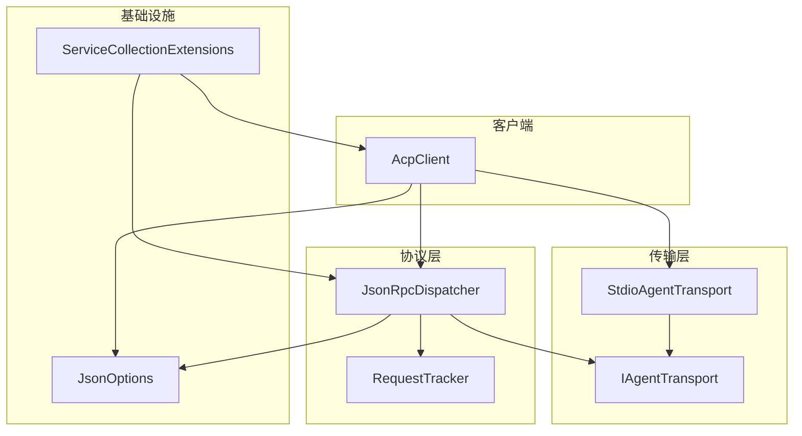
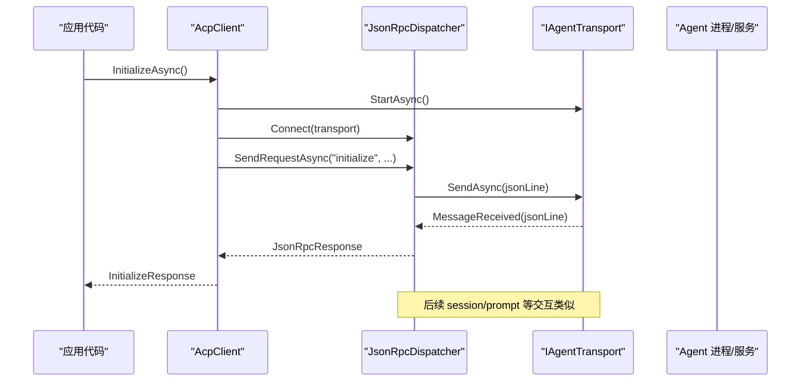
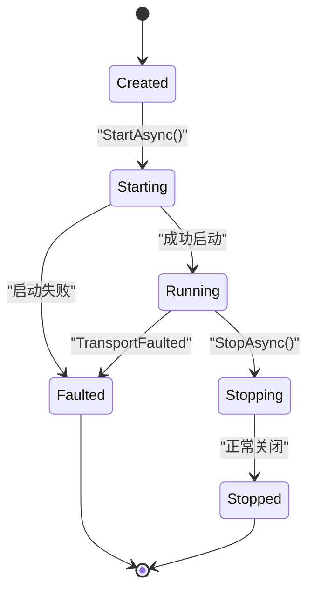
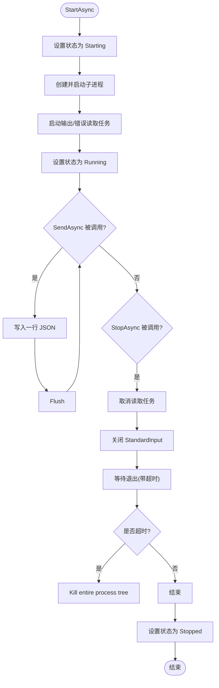
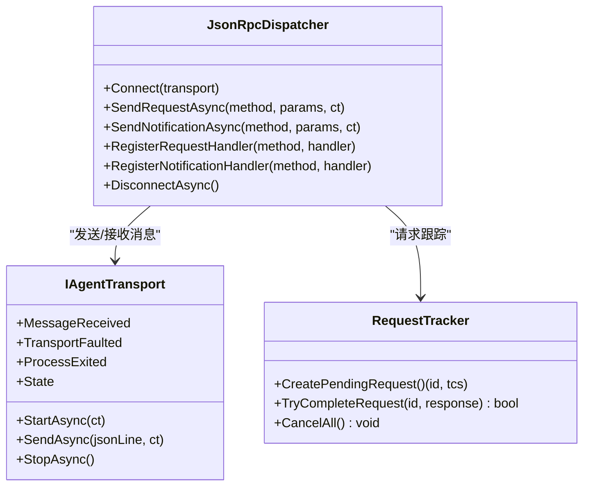
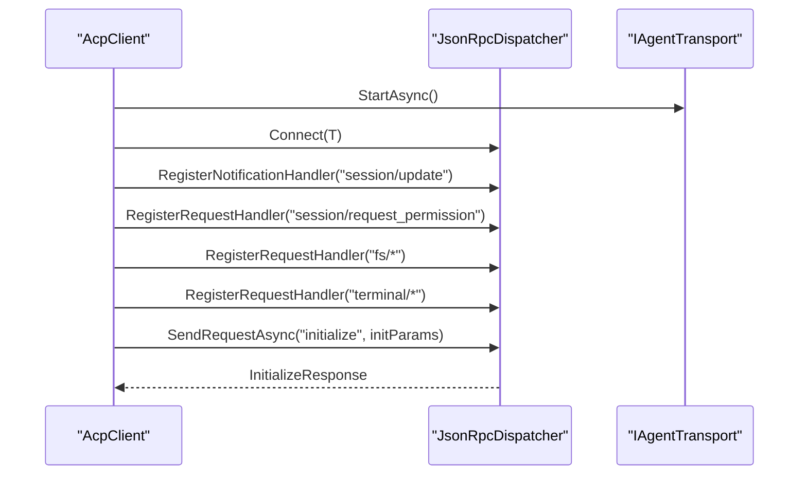
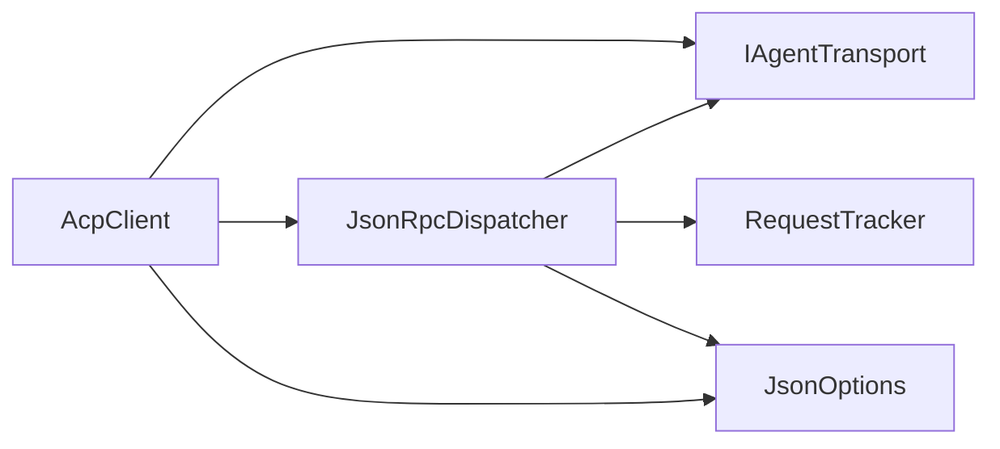

# 自定义传输实现

<cite>
**本文引用的文件**   
- [IAgentTransport.cs](file://Transport/IAgentTransport.cs)
- [StdioAgentTransport.cs](file://Transport/StdioAgentTransport.cs)
- [IJsonRpcDispatcher.cs](file://Protocol/IJsonRpcDispatcher.cs)
- [JsonRpcDispatcher.cs](file://Protocol/JsonRpcDispatcher.cs)
- [RequestTracker.cs](file://Protocol/RequestTracker.cs)
- [AcpClient.cs](file://Client/AcpClient.cs)
- [ServiceCollectionExtensions.cs](file://Infrastructure/ServiceCollectionExtensions.cs)
- [JsonOptions.cs](file://Infrastructure/JsonOptions.cs)
- [JsonRpcMessage.cs](file://JsonRpc/JsonRpcMessage.cs)
- [Capabilities.cs](file://Models/Capabilities.cs)
- [README.md](file://README.md)
</cite>

## 目录
1. [简介](#简介)
2. [项目结构](#项目结构)
3. [核心组件](#核心组件)
4. [架构总览](#架构总览)
5. [详细组件分析](#详细组件分析)
6. [依赖关系分析](#依赖关系分析)
7. [性能与资源管理](#性能与资源管理)
8. [故障排查指南](#故障排查指南)
9. [结论](#结论)
10. [附录：自定义传输实现示例（HTTP、WebSocket、文件管道）](#附录自定义传输实现示例httpwebsocket文件管道)

## 简介
本指南面向需要在 Agentic ACP 库中实现自定义传输层的开发者。目标是通过实现 IAgentTransport 接口，支持 HTTP、WebSocket、gRPC 等通信协议，并遵循异步操作模式、事件驱动架构、状态管理与错误处理的最佳实践。文档涵盖从基础框架到生产就绪的完整开发流程，包括线程安全、资源管理、性能优化、内存泄漏防护、常见陷阱与解决方案，以及测试策略与调试技巧。

## 项目结构
该库采用分层设计：
- Transport 层：定义传输抽象 IAgentTransport 并提供基于 stdio 的实现 StdioAgentTransport。
- Protocol 层：JSON-RPC 分发器 JsonRpcDispatcher 与请求跟踪 RequestTracker。
- Client 层：AcpClient 编排初始化、会话、提示与事件订阅。
- Infrastructure 层：DI 扩展与 JSON 序列化选项。
- Models/JsonRpc：协议模型与消息类型。

图表来源
- [AcpClient.cs:1-361](file://Client/AcpClient.cs#L1-L361)
- [JsonRpcDispatcher.cs:1-124](file://Protocol/JsonRpcDispatcher.cs#L1-L124)
- [RequestTracker.cs:1-52](file://Protocol/RequestTracker.cs#L1-L52)
- [IAgentTransport.cs:1-39](file://Transport/IAgentTransport.cs#L1-L39)
- [StdioAgentTransport.cs:1-147](file://Transport/StdioAgentTransport.cs#L1-L147)
- [ServiceCollectionExtensions.cs:1-23](file://Infrastructure/ServiceCollectionExtensions.cs#L1-L23)
- [JsonOptions.cs:1-28](file://Infrastructure/JsonOptions.cs#L1-L28)

章节来源
- [README.md:1-99](file://README.md#L1-L99)

## 核心组件
- IAgentTransport：传输抽象，定义启动、发送、停止、事件与状态。
- StdioAgentTransport：基于子进程标准输入输出的传输实现，演示了异步读取循环、取消令牌、进程生命周期与错误事件。
- JsonRpcDispatcher：将 JSON-RPC 请求/通知/响应通过传输层收发，维护请求-响应匹配与处理器注册。
- RequestTracker：并发安全的请求跟踪，使用 TaskCompletionSource 完成等待。
- AcpClient：高层 API，封装初始化握手、会话管理、事件订阅与处理器路由。

章节来源
- [IAgentTransport.cs:1-39](file://Transport/IAgentTransport.cs#L1-L39)
- [StdioAgentTransport.cs:1-147](file://Transport/StdioAgentTransport.cs#L1-L147)
- [JsonRpcDispatcher.cs:1-124](file://Protocol/JsonRpcDispatcher.cs#L1-L124)
- [RequestTracker.cs:1-52](file://Protocol/RequestTracker.cs#L1-L52)
- [AcpClient.cs:1-361](file://Client/AcpClient.cs#L1-L361)

## 架构总览
ACP 客户端通过 AcpClient 发起调用，由 JsonRpcDispatcher 负责 JSON-RPC 编解码与路由，底层通过 IAgentTransport 进行网络或进程 I/O。StdioAgentTransport 展示了如何以事件驱动和异步方式读写数据流，并通过事件暴露异常与进程退出信号。

图表来源
- [AcpClient.cs:47-182](file://Client/AcpClient.cs#L47-L182)
- [JsonRpcDispatcher.cs:27-47](file://Protocol/JsonRpcDispatcher.cs#L27-L47)
- [IAgentTransport.cs:8-28](file://Transport/IAgentTransport.cs#L8-L28)

## 详细组件分析

### IAgentTransport 接口与状态机
- 关键方法
  - StartAsync：启动传输（例如启动子进程或建立连接）。
  - SendAsync：发送单行 JSON-RPC 消息。
  - StopAsync：优雅关闭并释放资源。
- 事件
  - MessageReceived：收到原始 JSON 行时触发。
  - TransportFaulted：传输出现异常时触发。
  - ProcessExited：底层进程退出时触发（适用于进程类传输）。
- 状态
  - Created → Starting → Running → Stopping → Stopped/Faulted

图表来源
- [IAgentTransport.cs:6-38](file://Transport/IAgentTransport.cs#L6-L38)

章节来源
- [IAgentTransport.cs:1-39](file://Transport/IAgentTransport.cs#L1-L39)

### StdioAgentTransport 实现要点
- 异步读取循环：分别对 StandardOutput 与 StandardError 启动独立读取任务，避免阻塞。
- 取消令牌：使用 CancellationTokenSource 组合外部取消令牌，确保 StopAsync 能中断读取循环。
- 事件驱动：在 ReadLoopAsync 中遇到新行时触发 MessageReceived；异常时触发 TransportFaulted。
- 进程生命周期：监听 Exited 事件，更新状态并触发 ProcessExited。
- 优雅关闭：先关闭 StandardInput，再等待退出；超时后强制终止整个进程树。

图表来源
- [StdioAgentTransport.cs:30-93](file://Transport/StdioAgentTransport.cs#L30-L93)
- [StdioAgentTransport.cs:95-145](file://Transport/StdioAgentTransport.cs#L95-L145)

章节来源
- [StdioAgentTransport.cs:1-147](file://Transport/StdioAgentTransport.cs#L1-L147)

### JsonRpcDispatcher 与 RequestTracker
- 连接与路由：Connect 绑定 MessageReceived 事件；根据消息类型分派到请求处理器、通知处理器或完成待处理请求。
- 请求-响应匹配：CreatePendingRequest 生成唯一 ID 与 TCS；TryCompleteRequest 按 ID 完成对应等待。
- 取消与清理：DisconnectAsync 取消所有挂起请求，防止悬挂任务。

图表来源
- [JsonRpcDispatcher.cs:1-124](file://Protocol/JsonRpcDispatcher.cs#L1-L124)
- [RequestTracker.cs:1-52](file://Protocol/RequestTracker.cs#L1-L52)
- [IAgentTransport.cs:1-39](file://Transport/IAgentTransport.cs#L1-L39)

章节来源
- [JsonRpcDispatcher.cs:1-124](file://Protocol/JsonRpcDispatcher.cs#L1-L124)
- [RequestTracker.cs:1-52](file://Protocol/RequestTracker.cs#L1-L52)

### AcpClient 编排与事件订阅
- 初始化流程：启动传输、连接分发器、注册事件与处理器、执行 initialize 握手。
- 会话与提示：创建/加载会话、发送提示、取消会话。
- 事件与处理器：订阅 session/update 通知，注册权限、文件系统、终端等请求处理器。

图表来源
- [AcpClient.cs:47-182](file://Client/AcpClient.cs#L47-L182)
- [JsonRpcDispatcher.cs:27-47](file://Protocol/JsonRpcDispatcher.cs#L27-L47)

章节来源
- [AcpClient.cs:1-361](file://Client/AcpClient.cs#L1-L361)

## 依赖关系分析
- AcpClient 依赖 IAgentTransport 与 IJsonRpcDispatcher。
- JsonRpcDispatcher 依赖 IAgentTransport 与 IRequestTracker。
- RequestTracker 使用并发字典与原子计数器保证线程安全。
- JsonOptions 提供统一的 JSON 序列化配置，包含消息转换器与枚举转换。

图表来源
- [AcpClient.cs:1-361](file://Client/AcpClient.cs#L1-L361)
- [JsonRpcDispatcher.cs:1-124](file://Protocol/JsonRpcDispatcher.cs#L1-L124)
- [RequestTracker.cs:1-52](file://Protocol/RequestTracker.cs#L1-L52)
- [JsonOptions.cs:1-28](file://Infrastructure/JsonOptions.cs#L1-L28)

章节来源
- [ServiceCollectionExtensions.cs:1-23](file://Infrastructure/ServiceCollectionExtensions.cs#L1-L23)

## 性能与资源管理
- 异步与取消
  - 所有 I/O 操作应使用 async/await 与 CancellationToken，避免阻塞线程池。
  - 在长时间运行的读取循环中定期检查 IsCancellationRequested，及时退出。
- 线程安全
  - 使用 ConcurrentDictionary 存储处理器与待完成请求，避免锁竞争。
  - 事件订阅与取消需在对象生命周期内正确解绑，防止内存泄漏。
- 资源管理
  - 对于进程/网络连接等资源，确保在 StopAsync/Dispose 中释放；必要时使用 using 或 try/finally。
  - 对 StandardInput/StandardOutput/StandardError 的访问需顺序化，避免竞态。
- 性能优化
  - 减少不必要的字符串分配，优先使用 Memory/Stream 操作。
  - 合理设置缓冲区大小与编码（UTF-8），避免重复编解码。
  - 批量发送时合并小消息，降低系统调用开销。
- 内存泄漏防护
  - 避免在事件回调中捕获大对象引用；及时移除事件订阅。
  - 使用 WeakReference 或作用域限定长生命周期对象。

[本节为通用指导，不直接分析具体文件]

## 故障排查指南
- 常见问题
  - 未连接就发送：检查是否在 Connect 之后调用 SendAsync。
  - 死锁：避免在事件回调中同步等待同一线程上的任务；使用 ConfigureAwait(false) 或异步派发。
  - 异常传播：确保 TransportFaulted 事件被消费，并在上层记录日志与恢复。
  - 取消令牌：确保所有异步操作都接受并检查取消令牌。
  - 超时处理：在 WaitForExitAsync 等操作上设置合理的超时时间，避免无限等待。
- 调试技巧
  - 启用 ILogger 记录关键路径与异常堆栈。
  - 在 MessageReceived 前后打印消息摘要，定位解析问题。
  - 使用进程外日志（stderr）辅助诊断子进程行为。

章节来源
- [StdioAgentTransport.cs:95-145](file://Transport/StdioAgentTransport.cs#L95-L145)
- [JsonRpcDispatcher.cs:86-122](file://Protocol/JsonRpcDispatcher.cs#L86-L122)
- [RequestTracker.cs:32-39](file://Protocol/RequestTracker.cs#L32-L39)

## 结论
通过实现 IAgentTransport 接口，你可以将任意通信协议集成到 ACP 客户端中。关键在于遵循异步与事件驱动模式、严格的状态机管理、健壮的异常与取消处理，以及完善的资源释放策略。参考 StdioAgentTransport 的实现模式，可快速构建 HTTP、WebSocket、gRPC 等传输实现，并通过 JsonRpcDispatcher 与 AcpClient 无缝接入现有生态。

[本节为总结性内容，不直接分析具体文件]

## 附录：自定义传输实现示例（HTTP、WebSocket、文件管道）

### 通用实现要点清单
- 生命周期
  - StartAsync：建立连接或启动服务；设置状态为 Running。
  - SendAsync：序列化 JSON 行并发送；处理背压与重试。
  - StopAsync：优雅关闭连接，取消读取任务，释放资源；设置状态为 Stopped。
- 事件
  - MessageReceived：逐行或逐帧解析后触发。
  - TransportFaulted：捕获网络/协议异常并上报。
  - ProcessExited：仅进程类传输需要；其他传输可用 ConnectionClosed 替代语义。
- 状态机
  - 严格遵循 Created → Starting → Running → Stopping → Stopped/Faulted。
- 线程安全
  - 使用并发集合与原子变量；避免在事件回调中进行阻塞操作。
- 取消与超时
  - 所有 I/O 接受 CancellationToken；在网络层设置超时与重试策略。
- 错误处理
  - 区分可恢复与不可恢复错误；记录上下文信息以便诊断。
- 资源管理
  - 显式释放连接、缓冲、句柄；确保 StopAsync 幂等。

### HTTP REST API 传输
- 适用场景：短请求/响应模式，适合批处理或非实时交互。
- 关键点
  - 使用 HttpClient 或自定义 HTTP 客户端，设置超时与重试。
  - 将 JSON 行作为请求体或查询参数发送；服务端返回响应后完成 TCS。
  - 若需推送，可使用 Server-Sent Events 或轮询机制，将上行消息转换为事件。
- 注意事项
  - 连接复用与池化；避免频繁创建/销毁连接。
  - 处理 4xx/5xx 错误码，映射为 TransportFaulted。
  - 避免在事件回调中同步等待 HTTP 响应。

### WebSocket 实时通信
- 适用场景：低延迟双向通信，适合流式更新与即时反馈。
- 关键点
  - 使用 System.Net.WebSockets 或第三方库；维护连接状态。
  - 接收帧后按行或按消息边界解析 JSON，触发 MessageReceived。
  - 心跳与重连：检测断线并自动重连，保持会话连续性。
- 注意事项
  - 控制并发与背压，避免消息堆积导致内存增长。
  - 处理二进制帧与文本帧的混合场景。
  - 在 StopAsync 中关闭连接并清理后台任务。

### 文件管道通信（命名管道/Unix Socket）
- 适用场景：本地高性能进程间通信，避免进程启动开销。
- 关键点
  - 使用 NamedPipeServerStream/NamedPipeClientStream 或 Unix Domain Socket。
  - 以流式方式读写 JSON 行；注意换行符与编码一致性。
  - 优雅关闭：先写关闭标志，再等待对方退出。
- 注意事项
  - 权限与路径管理；确保跨用户/容器环境可用。
  - 处理管道断开与重新连接逻辑。
  - 监控磁盘 I/O 与缓冲区溢出风险。

### 完整开发流程（从基础到生产就绪）
- 第 1 步：定义传输类实现 IAgentTransport，包含构造函数参数（如 URL、证书、认证信息等）。
- 第 2 步：实现 StartAsync，建立连接并启动读取循环；设置状态为 Running。
- 第 3 步：实现 SendAsync，序列化并发送 JSON 行；处理网络异常与重试。
- 第 4 步：实现 StopAsync，取消读取任务、关闭连接、释放资源；设置状态为 Stopped。
- 第 5 步：注册事件处理器，确保 MessageReceived、TransportFaulted、ProcessExited 正确触发。
- 第 6 步：单元测试覆盖正常路径、异常路径、取消与超时场景。
- 第 7 步：集成测试验证端到端通信，包括握手、会话、提示与事件流。
- 第 8 步：性能基准测试，评估吞吐、延迟与内存占用；优化瓶颈点。
- 第 9 步：生产部署前加入健康检查、指标采集与告警。

### 测试策略与调试技巧
- 单元测试
  - 模拟 IAgentTransport 的 MessageReceived 与 TransportFaulted 事件。
  - 验证请求-响应匹配与超时取消行为。
- 集成测试
  - 使用内存传输或 Mock 服务模拟真实网络行为。
  - 覆盖异常场景：连接失败、解析错误、协议版本不匹配。
- 调试技巧
  - 启用详细日志，记录消息头与负载摘要。
  - 使用网络抓包工具（如 Wireshark）分析 WebSocket/HTTP 流量。
  - 在进程类传输中查看 stderr 输出，定位子进程问题。

章节来源
- [IAgentTransport.cs:1-39](file://Transport/IAgentTransport.cs#L1-L39)
- [StdioAgentTransport.cs:1-147](file://Transport/StdioAgentTransport.cs#L1-L147)
- [JsonRpcDispatcher.cs:1-124](file://Protocol/JsonRpcDispatcher.cs#L1-L124)
- [RequestTracker.cs:1-52](file://Protocol/RequestTracker.cs#L1-L52)
- [AcpClient.cs:1-361](file://Client/AcpClient.cs#L1-L361)
- [JsonOptions.cs:1-28](file://Infrastructure/JsonOptions.cs#L1-L28)
- [Capabilities.cs:1-65](file://Models/Capabilities.cs#L1-L65)
- [README.md:1-99](file://README.md#L1-L99)