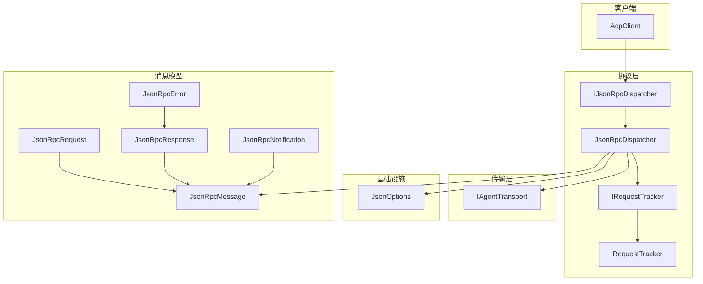
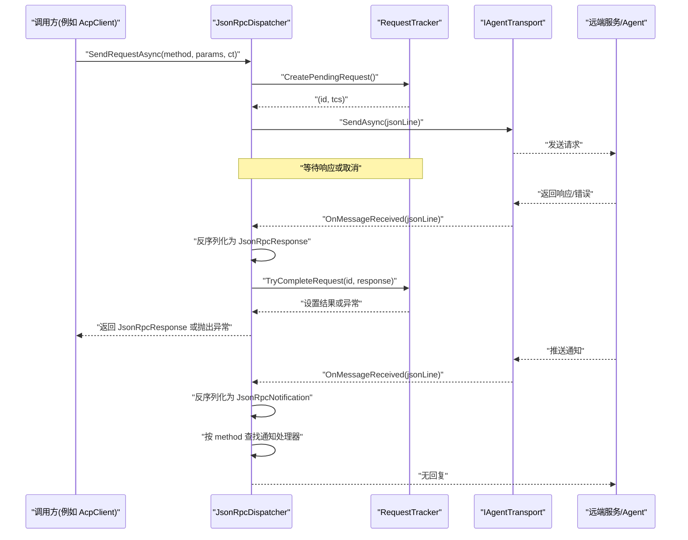
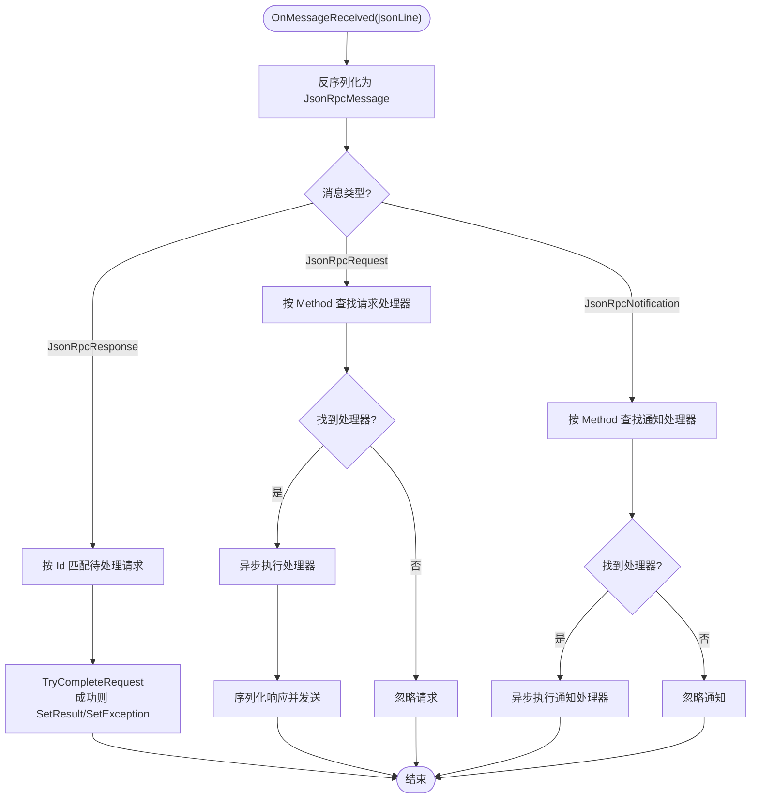
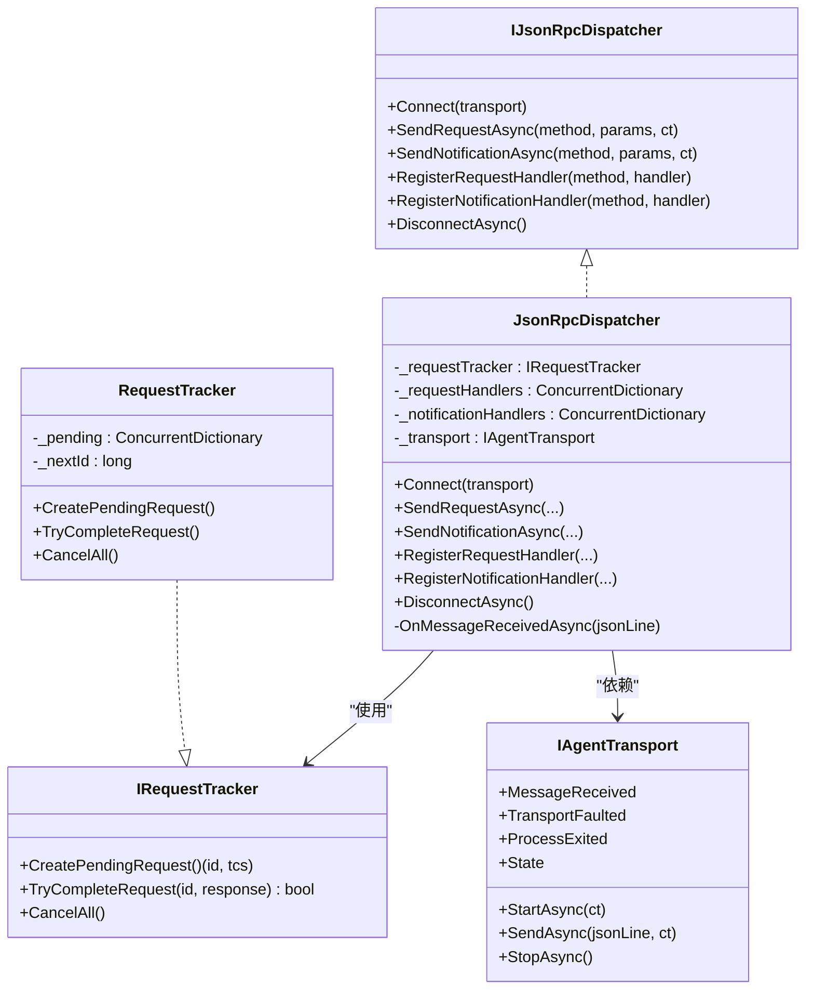

# JSON-RPC 分发器

<cite>
**本文引用的文件**   
- [IJsonRpcDispatcher.cs](file://Protocol/IJsonRpcDispatcher.cs)
- [JsonRpcDispatcher.cs](file://Protocol/JsonRpcDispatcher.cs)
- [IRequestTracker.cs](file://Protocol/IRequestTracker.cs)
- [RequestTracker.cs](file://Protocol/RequestTracker.cs)
- [JsonRpcMessage.cs](file://JsonRpc/JsonRpcMessage.cs)
- [JsonRpcRequest.cs](file://JsonRpc/JsonRpcRequest.cs)
- [JsonRpcResponse.cs](file://JsonRpc/JsonRpcResponse.cs)
- [JsonRpcNotification.cs](file://JsonRpc/JsonRpcNotification.cs)
- [JsonRpcError.cs](file://JsonRpc/JsonRpcError.cs)
- [IAgentTransport.cs](file://Transport/IAgentTransport.cs)
- [JsonOptions.cs](file://Infrastructure/JsonOptions.cs)
- [AcpClient.cs](file://Client/AcpClient.cs)
- [README.md](file://README.md)
</cite>

## 目录
1. [简介](#简介)
2. [项目结构](#项目结构)
3. [核心组件](#核心组件)
4. [架构总览](#架构总览)
5. [详细组件分析](#详细组件分析)
6. [依赖关系分析](#依赖关系分析)
7. [性能考量](#性能考量)
8. [故障排查指南](#故障排查指南)
9. [结论](#结论)
10. [附录：使用示例与最佳实践](#附录使用示例与最佳实践)

## 简介
本文件面向需要理解和使用 JSON-RPC 分发器的开发者，系统性阐述 IJsonRpcDispatcher 接口的设计理念与核心方法，以及 JsonRpcDispatcher 的实现机制。内容涵盖请求路由、响应匹配、通知处理、错误传播、自定义处理器注册、异步处理模式、连接管理、资源清理与异常处理等主题，并提供基于仓库代码的可视化图示与可追溯来源。

## 项目结构
JSON-RPC 分发器位于 Protocol 层，配合 Transport 层进行消息收发，使用 Infrastructure 层的 JSON 序列化配置，并通过 JsonRpc 命名空间定义消息模型。客户端 AcpClient 展示了如何注册处理器并调用分发器完成握手、会话创建与消息发送。

图表来源
- [IJsonRpcDispatcher.cs:1-14](file://Protocol/IJsonRpcDispatcher.cs#L1-L14)
- [JsonRpcDispatcher.cs:1-124](file://Protocol/JsonRpcDispatcher.cs#L1-L124)
- [IRequestTracker.cs:1-11](file://Protocol/IRequestTracker.cs#L1-L11)
- [RequestTracker.cs:1-52](file://Protocol/RequestTracker.cs#L1-L52)
- [IAgentTransport.cs:1-39](file://Transport/IAgentTransport.cs#L1-L39)
- [JsonOptions.cs:1-28](file://Infrastructure/JsonOptions.cs#L1-L28)
- [JsonRpcMessage.cs:1-14](file://JsonRpc/JsonRpcMessage.cs#L1-L14)
- [JsonRpcRequest.cs:1-19](file://JsonRpc/JsonRpcRequest.cs#L1-L19)
- [JsonRpcResponse.cs:1-20](file://JsonRpc/JsonRpcResponse.cs#L1-L20)
- [JsonRpcNotification.cs:1-16](file://JsonRpc/JsonRpcNotification.cs#L1-L16)
- [JsonRpcError.cs:1-19](file://JsonRpc/JsonRpcError.cs#L1-L19)
- [AcpClient.cs:1-200](file://Client/AcpClient.cs#L1-L200)

章节来源
- [IJsonRpcDispatcher.cs:1-14](file://Protocol/IJsonRpcDispatcher.cs#L1-L14)
- [JsonRpcDispatcher.cs:1-124](file://Protocol/JsonRpcDispatcher.cs#L1-L124)
- [IAgentTransport.cs:1-39](file://Transport/IAgentTransport.cs#L1-L39)
- [JsonOptions.cs:1-28](file://Infrastructure/JsonOptions.cs#L1-L28)
- [JsonRpcMessage.cs:1-14](file://JsonRpc/JsonRpcMessage.cs#L1-L14)
- [JsonRpcRequest.cs:1-19](file://JsonRpc/JsonRpcRequest.cs#L1-L19)
- [JsonRpcResponse.cs:1-20](file://JsonRpc/JsonRpcResponse.cs#L1-L20)
- [JsonRpcNotification.cs:1-16](file://JsonRpc/JsonRpcNotification.cs#L1-L16)
- [JsonRpcError.cs:1-19](file://JsonRpc/JsonRpcError.cs#L1-L19)
- [AcpClient.cs:1-200](file://Client/AcpClient.cs#L1-L200)

## 核心组件
- IJsonRpcDispatcher：定义分发器的对外契约，包括连接、发送请求/通知、注册处理器、断开连接。
- JsonRpcDispatcher：实现分发逻辑，负责消息路由、响应匹配、通知派发、错误传播与生命周期管理。
- IRequestTracker / RequestTracker：维护待响应的请求 ID 到 TaskCompletionSource 的映射，支持完成、取消与并发安全。
- 传输抽象 IAgentTransport：封装底层通信（如 stdio），提供发送、事件回调与状态。
- JSON 模型：JsonRpcMessage、JsonRpcRequest、JsonRpcResponse、JsonRpcNotification、JsonRpcError 描述 JSON-RPC 2.0 消息结构。
- JsonOptions：统一序列化选项，包含大小写不敏感、忽略空值、允许元数据属性乱序等。

章节来源
- [IJsonRpcDispatcher.cs:1-14](file://Protocol/IJsonRpcDispatcher.cs#L1-L14)
- [JsonRpcDispatcher.cs:1-124](file://Protocol/JsonRpcDispatcher.cs#L1-L124)
- [IRequestTracker.cs:1-11](file://Protocol/IRequestTracker.cs#L1-L11)
- [RequestTracker.cs:1-52](file://Protocol/RequestTracker.cs#L1-L52)
- [IAgentTransport.cs:1-39](file://Transport/IAgentTransport.cs#L1-L39)
- [JsonRpcMessage.cs:1-14](file://JsonRpc/JsonRpcMessage.cs#L1-L14)
- [JsonRpcRequest.cs:1-19](file://JsonRpc/JsonRpcRequest.cs#L1-L19)
- [JsonRpcResponse.cs:1-20](file://JsonRpc/JsonRpcResponse.cs#L1-L20)
- [JsonRpcNotification.cs:1-16](file://JsonRpc/JsonRpcNotification.cs#L1-L16)
- [JsonRpcError.cs:1-19](file://JsonRpc/JsonRpcError.cs#L1-L19)
- [JsonOptions.cs:1-28](file://Infrastructure/JsonOptions.cs#L1-L28)

## 架构总览
下图展示从客户端发起请求到接收响应/通知的完整流程，以及分发器内部的路由与匹配机制。

图表来源
- [JsonRpcDispatcher.cs:27-64](file://Protocol/JsonRpcDispatcher.cs#L27-L64)
- [JsonRpcDispatcher.cs:86-122](file://Protocol/JsonRpcDispatcher.cs#L86-L122)
- [RequestTracker.cs:11-30](file://Protocol/RequestTracker.cs#L11-L30)
- [IAgentTransport.cs:11-18](file://Transport/IAgentTransport.cs#L11-L18)

## 详细组件分析

### IJsonRpcDispatcher 接口设计
- Connect(transport)：绑定传输通道，订阅消息到达事件，建立双向通信能力。
- SendRequestAsync(method, params, ct)：构造请求、分配唯一 id、发送并等待响应；未连接时抛出异常。
- SendNotificationAsync(method, params, ct)：构造通知并发送，无需等待响应。
- RegisterRequestHandler(method, handler)：注册请求处理器，用于服务端侧处理来自对端的请求。
- RegisterNotificationHandler(method, handler)：注册通知处理器，用于消费来自对端的通知。
- DisconnectAsync()：解绑事件、取消所有待处理请求，释放资源。

章节来源
- [IJsonRpcDispatcher.cs:5-13](file://Protocol/IJsonRpcDispatcher.cs#L5-L13)

### JsonRpcDispatcher 实现机制
- 请求路由算法
  - 入站请求：根据 JsonRpcRequest.Method 在 _requestHandlers 字典中精确匹配处理器，若存在则异步执行并返回 JsonRpcResponse。
  - 入站通知：根据 JsonRpcNotification.Method 在 _notificationHandlers 字典中精确匹配处理器，若存在则异步执行，不返回响应。
- 响应匹配策略
  - 出站请求通过 RequestTracker.CreatePendingRequest 生成唯一 id 与 TaskCompletionSource，并在收到 JsonRpcResponse 后通过 TryCompleteRequest 按 id 匹配完成。
  - 若响应中包含 Error，则通过 JsonRpcException 抛出，携带 code 与 message。
- 通知处理流程
  - OnMessageReceived 反序列化消息后，区分类型并路由至对应处理器；通知处理器为单向处理，不产生响应。
- 错误传播机制
  - 未连接时发送会抛 InvalidOperationException。
  - 反序列化失败或处理器异常被捕获并忽略（当前实现），避免中断主循环。
  - 服务端错误通过 JsonRpcError 转换为 JsonRpcException 向调用方传播。
- 资源清理
  - DisconnectAsync 解除 MessageReceived 订阅，并调用 CancelAll 取消所有挂起请求。

图表来源
- [JsonRpcDispatcher.cs:86-122](file://Protocol/JsonRpcDispatcher.cs#L86-L122)
- [RequestTracker.cs:19-30](file://Protocol/RequestTracker.cs#L19-L30)

章节来源
- [JsonRpcDispatcher.cs:21-84](file://Protocol/JsonRpcDispatcher.cs#L21-L84)
- [JsonRpcDispatcher.cs:86-122](file://Protocol/JsonRpcDispatcher.cs#L86-L122)
- [RequestTracker.cs:11-39](file://Protocol/RequestTracker.cs#L11-L39)

### RequestTracker 与并发安全
- CreatePendingRequest：原子递增 id，创建 TaskCompletionSource 并缓存，保证并发安全。
- TryCompleteRequest：移除并设置结果或异常，确保每个请求仅完成一次。
- CancelAll：遍历并取消所有挂起请求，用于连接断开时的资源清理。

章节来源
- [RequestTracker.cs:11-39](file://Protocol/RequestTracker.cs#L11-L39)

### 传输层与事件模型
- IAgentTransport 暴露 StartAsync、SendAsync、MessageReceived、TransportFaulted、ProcessExited、StopAsync 与 State。
- JsonRpcDispatcher.Connect 订阅 MessageReceived，将底层字节流转换为 JSON 行并交由分发器处理。

章节来源
- [IAgentTransport.cs:1-39](file://Transport/IAgentTransport.cs#L1-L39)
- [JsonRpcDispatcher.cs:21-25](file://Protocol/JsonRpcDispatcher.cs#L21-L25)

### JSON 序列化与消息模型
- JsonOptions.Default 配置了大小写不敏感、忽略空值、紧凑输出与允许元数据属性乱序，并注册了 JsonRpcMessageConverter。
- 消息模型遵循 JSON-RPC 2.0：
  - JsonRpcMessage：基础字段 jsonrpc="2.0"。
  - JsonRpcRequest：包含 id、method、可选 params。
  - JsonRpcResponse：包含 id、result 或 error。
  - JsonRpcNotification：包含 method、可选 params。
  - JsonRpcError：包含 code、message、可选 data。

章节来源
- [JsonOptions.cs:7-27](file://Infrastructure/JsonOptions.cs#L7-L27)
- [JsonRpcMessage.cs:1-14](file://JsonRpc/JsonRpcMessage.cs#L1-L14)
- [JsonRpcRequest.cs:1-19](file://JsonRpc/JsonRpcRequest.cs#L1-L19)
- [JsonRpcResponse.cs:1-20](file://JsonRpc/JsonRpcResponse.cs#L1-L20)
- [JsonRpcNotification.cs:1-16](file://JsonRpc/JsonRpcNotification.cs#L1-L16)
- [JsonRpcError.cs:1-19](file://JsonRpc/JsonRpcError.cs#L1-L19)

## 依赖关系分析
- JsonRpcDispatcher 依赖：
  - IRequestTracker（默认实现 RequestTracker）用于请求跟踪与响应匹配。
  - IAgentTransport 用于消息发送与事件订阅。
  - JsonOptions 用于统一序列化行为。
  - JsonRpc* 消息模型用于编解码。
- AcpClient 作为典型使用者，演示了如何注册内置处理器（权限、文件系统、终端）与自定义处理器，并通过分发器完成初始化握手与后续调用。

图表来源
- [IJsonRpcDispatcher.cs:5-13](file://Protocol/IJsonRpcDispatcher.cs#L5-L13)
- [JsonRpcDispatcher.cs:9-84](file://Protocol/JsonRpcDispatcher.cs#L9-L84)
- [IRequestTracker.cs:5-10](file://Protocol/IRequestTracker.cs#L5-L10)
- [RequestTracker.cs:6-39](file://Protocol/RequestTracker.cs#L6-L39)
- [IAgentTransport.cs:6-28](file://Transport/IAgentTransport.cs#L6-L28)

章节来源
- [JsonRpcDispatcher.cs:9-84](file://Protocol/JsonRpcDispatcher.cs#L9-L84)
- [RequestTracker.cs:6-39](file://Protocol/RequestTracker.cs#L6-L39)
- [IAgentTransport.cs:6-28](file://Transport/IAgentTransport.cs#L6-L28)

## 性能考量
- 并发安全：使用 ConcurrentDictionary 与 Interlocked 保证高并发下的线程安全。
- 异步优先：所有处理器与 I/O 操作均为异步，避免阻塞线程池。
- 序列化优化：JsonOptions 关闭缩进、忽略空值，减少网络负载与解析开销。
- 内存管理：TaskCompletionSource 在请求完成后立即移除，避免泄漏。
- 错误隔离：反序列化与处理器异常被捕获，防止单点故障影响整体分发。

[本节为通用指导，不直接分析具体文件]

## 故障排查指南
- 未连接即发送：
  - 现象：抛出“未连接到传输”的异常。
  - 原因：未在 Connect 之前调用 SendRequest/SendNotification。
  - 处理：确保先调用 Connect，再发送消息。
- 请求超时或未响应：
  - 现象：等待响应长时间无结果。
  - 原因：对端未返回响应或网络问题。
  - 处理：传入 CancellationToken 并在上层超时取消；检查传输层状态与日志。
- 处理器未触发：
  - 现象：注册的方法名未命中。
  - 原因：方法名不一致或注册时机不对。
  - 处理：确认方法名完全匹配，且在 Connect 之后注册。
- 通知丢失：
  - 现象：未收到预期通知。
  - 原因：未注册对应处理器或反序列化失败。
  - 处理：检查处理器注册与 JsonOptions 配置。
- 资源未释放：
  - 现象：进程退出后仍有挂起任务。
  - 处理：调用 DisconnectAsync 以取消所有待处理请求并解绑事件。

章节来源
- [JsonRpcDispatcher.cs:27-31](file://Protocol/JsonRpcDispatcher.cs#L27-L31)
- [JsonRpcDispatcher.cs:76-84](file://Protocol/JsonRpcDispatcher.cs#L76-L84)
- [JsonRpcDispatcher.cs:118-121](file://Protocol/JsonRpcDispatcher.cs#L118-L121)

## 结论
IJsonRpcDispatcher 提供了简洁而强大的 JSON-RPC 分发抽象，JsonRpcDispatcher 实现了高效、并发安全的请求路由、响应匹配与通知处理。结合 RequestTracker 与 IAgentTransport，形成了完整的端到端通信链路。通过合理的处理器注册、异步处理模式与完善的资源清理策略，可在复杂场景下稳定运行。

[本节为总结性内容，不直接分析具体文件]

## 附录：使用示例与最佳实践

### 基本用法（连接、发送请求与通知）
- 步骤概览：
  - 创建传输实例并启动。
  - 创建 JsonRpcDispatcher 并 Connect 绑定传输。
  - 使用 SendRequestAsync 发送请求并获取响应。
  - 使用 SendNotificationAsync 发送通知。
  - 结束时调用 DisconnectAsync 清理资源。
- 参考路径：
  - [快速开始示例](file://README.md:6-33)
  - [AcpClient 初始化流程](file://Client/AcpClient.cs:47-182)

章节来源
- [README.md:6-33](file://README.md#L6-L33)
- [AcpClient.cs:47-182](file://Client/AcpClient.cs#L47-L182)

### 注册自定义请求与通知处理器
- 请求处理器：
  - 使用 RegisterRequestHandler 注册方法名与处理器委托，处理器需返回 JsonRpcResponse。
  - 参考路径：[自定义请求处理器示例](file://README.md:55-70)
- 通知处理器：
  - 使用 RegisterNotificationHandler 注册方法名与处理器委托，处理器为异步且无返回值。
  - 参考路径：[自定义通知处理器示例](file://README.md:55-70)
- 实际注册示例（内置处理器）：
  - 权限、文件系统、终端处理器注册与调用。
  - 参考路径：[AcpClient 处理器注册](file://Client/AcpClient.cs:64-147)

章节来源
- [README.md:55-70](file://README.md#L55-L70)
- [AcpClient.cs:64-147](file://Client/AcpClient.cs#L64-L147)

### 异步处理模式最佳实践
- 使用 async/await 编写处理器，避免阻塞。
- 在处理器内使用 CancellationToken 支持取消。
- 对于长耗时操作，考虑后台任务与进度通知。
- 保持处理器幂等性与错误边界，避免影响其他请求。

[本节为通用指导，不直接分析具体文件]

### 连接管理与资源清理
- 连接生命周期：
  - StartAsync -> Connect -> 业务调用 -> DisconnectAsync -> StopAsync。
- 资源清理要点：
  - 调用 DisconnectAsync 取消所有待处理请求并解绑事件。
  - 在 ProcessExited 事件中做最终清理。
- 参考路径：
  - [AcpClient 初始化与事件订阅](file://Client/AcpClient.cs:47-72)
  - [JsonRpcDispatcher 断开逻辑](file://Protocol/JsonRpcDispatcher.cs:76-84)

章节来源
- [AcpClient.cs:47-72](file://Client/AcpClient.cs#L47-L72)
- [JsonRpcDispatcher.cs:76-84](file://Protocol/JsonRpcDispatcher.cs#L76-L84)

### 异常处理与错误传播
- 客户端异常：
  - 未连接时抛出 InvalidOperationException。
  - 服务端错误通过 JsonRpcException 抛出，包含 code 与 message。
- 服务器端异常：
  - 反序列化失败或处理器异常被捕获并忽略，避免中断分发循环。
- 参考路径：
  - [未连接异常](file://Protocol/JsonRpcDispatcher.cs:27-31)
  - [错误传播](file://Protocol/RequestTracker.cs:23-26)
  - [异常捕获](file://Protocol/JsonRpcDispatcher.cs:118-121)

章节来源
- [JsonRpcDispatcher.cs:27-31](file://Protocol/JsonRpcDispatcher.cs#L27-L31)
- [RequestTracker.cs:23-26](file://Protocol/RequestTracker.cs#L23-L26)
- [JsonRpcDispatcher.cs:118-121](file://Protocol/JsonRpcDispatcher.cs#L118-L121)