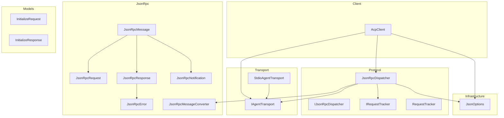
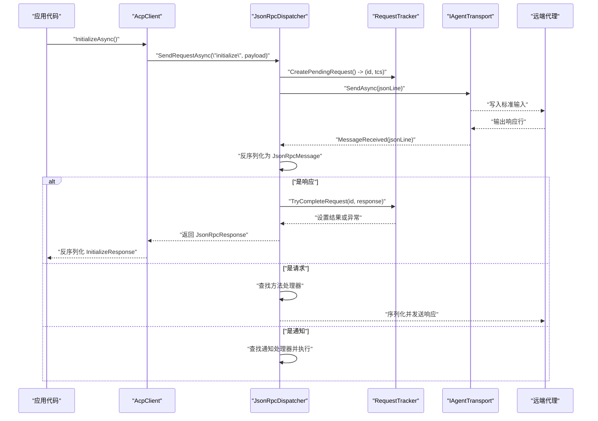
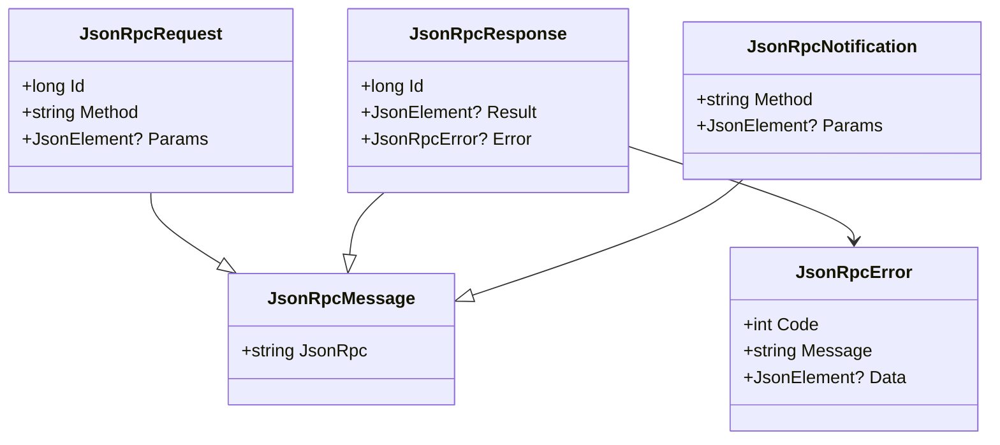
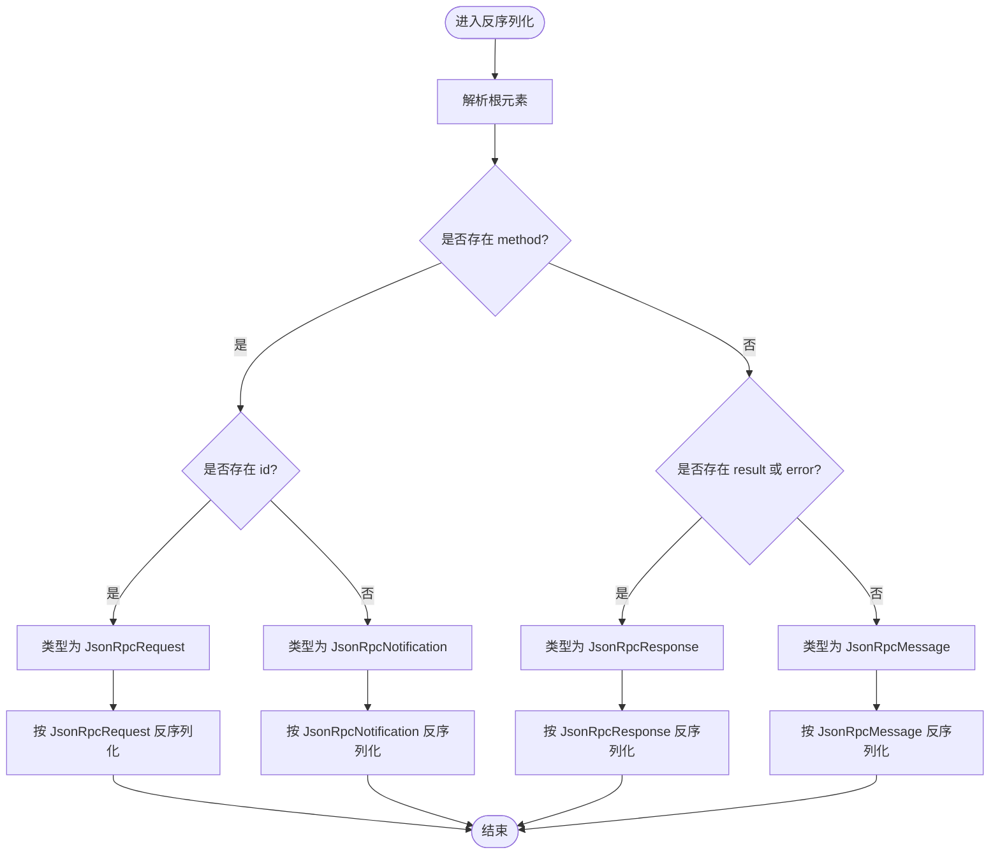
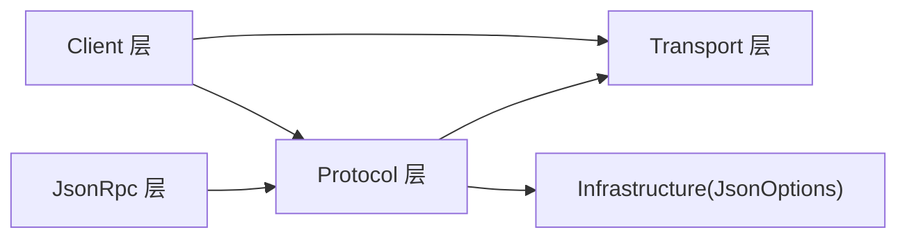

# 协议实现细节

<cite>
**本文引用的文件**   
- [JsonRpcMessage.cs](file://JsonRpc/JsonRpcMessage.cs)
- [JsonRpcRequest.cs](file://JsonRpc/JsonRpcRequest.cs)
- [JsonRpcResponse.cs](file://JsonRpc/JsonRpcResponse.cs)
- [JsonRpcNotification.cs](file://JsonRpc/JsonRpcNotification.cs)
- [JsonRpcError.cs](file://JsonRpc/JsonRpcError.cs)
- [JsonRpcMessageConverter.cs](file://JsonRpc/JsonRpcMessageConverter.cs)
- [JsonOptions.cs](file://Infrastructure/JsonOptions.cs)
- [JsonRpcDispatcher.cs](file://Protocol/JsonRpcDispatcher.cs)
- [IJsonRpcDispatcher.cs](file://Protocol/IJsonRpcDispatcher.cs)
- [RequestTracker.cs](file://Protocol/RequestTracker.cs)
- [IRequestTracker.cs](file://Protocol/IRequestTracker.cs)
- [IAgentTransport.cs](file://Transport/IAgentTransport.cs)
- [StdioAgentTransport.cs](file://Transport/StdioAgentTransport.cs)
- [AcpClient.cs](file://Client/AcpClient.cs)
- [InitializeRequest.cs](file://Models/InitializeRequest.cs)
- [InitializeResponse.cs](file://Models/InitializeResponse.cs)
- [README.md](file://README.md)
</cite>

## 目录
1. [简介](#简介)
2. [项目结构](#项目结构)
3. [核心组件](#核心组件)
4. [架构总览](#架构总览)
5. [详细组件分析](#详细组件分析)
6. [依赖关系分析](#依赖关系分析)
7. [性能考量](#性能考量)
8. [故障排查指南](#故障排查指南)
9. [结论](#结论)
10. [附录](#附录)

## 简介
本文件面向 JSON-RPC 2.0 协议的 .NET 实现，系统性说明消息类型层次与字段定义、序列化/反序列化策略、分发与传输机制、扩展点与兼容性检查，并提供构造与解析示例、错误处理与调试技巧。该实现基于 System.Text.Json，通过自定义转换器区分请求、响应与通知，结合 IAgentTransport 抽象完成跨进程 stdio 通信，并由 JsonRpcDispatcher 负责路由与请求-响应匹配。

## 项目结构
- JsonRpc：JSON-RPC 2.0 消息模型与转换器
- Protocol：消息分发、请求跟踪与接口抽象
- Transport：传输层抽象与 stdio 实现
- Infrastructure：全局 JsonSerializerOptions 配置
- Client：高层客户端封装（初始化握手、会话管理、事件）
- Models：协议领域模型（如 initialize 请求/响应等）

图表来源
- [JsonRpcMessage.cs:1-14](file://JsonRpc/JsonRpcMessage.cs#L1-L14)
- [JsonRpcRequest.cs:1-19](file://JsonRpc/JsonRpcRequest.cs#L1-L19)
- [JsonRpcResponse.cs:1-20](file://JsonRpc/JsonRpcResponse.cs#L1-L20)
- [JsonRpcNotification.cs:1-16](file://JsonRpc/JsonRpcNotification.cs#L1-L16)
- [JsonRpcError.cs:1-19](file://JsonRpc/JsonRpcError.cs#L1-L19)
- [JsonRpcMessageConverter.cs:1-73](file://JsonRpc/JsonRpcMessageConverter.cs#L1-L73)
- [JsonRpcDispatcher.cs:1-124](file://Protocol/JsonRpcDispatcher.cs#L1-L124)
- [IJsonRpcDispatcher.cs:1-14](file://Protocol/IJsonRpcDispatcher.cs#L1-L14)
- [RequestTracker.cs:1-52](file://Protocol/RequestTracker.cs#L1-L52)
- [IRequestTracker.cs:1-11](file://Protocol/IRequestTracker.cs#L1-L11)
- [IAgentTransport.cs:1-39](file://Transport/IAgentTransport.cs#L1-L39)
- [StdioAgentTransport.cs:1-147](file://Transport/StdioAgentTransport.cs#L1-L147)
- [JsonOptions.cs:1-28](file://Infrastructure/JsonOptions.cs#L1-L28)
- [AcpClient.cs:1-200](file://Client/AcpClient.cs#L1-L200)
- [InitializeRequest.cs:1-16](file://Models/InitializeRequest.cs#L1-L16)
- [InitializeResponse.cs:1-28](file://Models/InitializeResponse.cs#L1-L28)

章节来源
- [README.md:1-99](file://README.md#L1-L99)

## 核心组件
- 消息基类与派生类型
  - JsonRpcMessage：包含 jsonrpc 版本字段，默认值为 "2.0"
  - JsonRpcRequest：包含 id、method、可选 params
  - JsonRpcResponse：包含 id、result 或 error（二者互斥）
  - JsonRpcNotification：包含 method、可选 params，无 id
  - JsonRpcError：包含 code、message、可选 data
- 转换器
  - JsonRpcMessageConverter：根据 presence 的字段将原始 JSON 识别为 Request/Notification/Response/Message
- 分发器与跟踪器
  - JsonRpcDispatcher：连接传输层、注册处理器、发送请求/通知、接收并路由消息
  - RequestTracker：维护待处理请求的 id 到 TaskCompletionSource 映射，完成或取消
- 传输层
  - IAgentTransport：统一发送/接收行式 JSON 的抽象
  - StdioAgentTransport：基于子进程标准输入输出的实现
- 序列化选项
  - JsonOptions.Default：启用属性名大小写不敏感、忽略 null、关闭缩进、允许元数据属性乱序，并注册 JsonRpcMessageConverter 与枚举字符串转换器

章节来源
- [JsonRpcMessage.cs:1-14](file://JsonRpc/JsonRpcMessage.cs#L1-L14)
- [JsonRpcRequest.cs:1-19](file://JsonRpc/JsonRpcRequest.cs#L1-L19)
- [JsonRpcResponse.cs:1-20](file://JsonRpc/JsonRpcResponse.cs#L1-L20)
- [JsonRpcNotification.cs:1-16](file://JsonRpc/JsonRpcNotification.cs#L1-L16)
- [JsonRpcError.cs:1-19](file://JsonRpc/JsonRpcError.cs#L1-L19)
- [JsonRpcMessageConverter.cs:1-73](file://JsonRpc/JsonRpcMessageConverter.cs#L1-L73)
- [JsonRpcDispatcher.cs:1-124](file://Protocol/JsonRpcDispatcher.cs#L1-L124)
- [RequestTracker.cs:1-52](file://Protocol/RequestTracker.cs#L1-L52)
- [IAgentTransport.cs:1-39](file://Transport/IAgentTransport.cs#L1-L39)
- [StdioAgentTransport.cs:1-147](file://Transport/StdioAgentTransport.cs#L1-L147)
- [JsonOptions.cs:1-28](file://Infrastructure/JsonOptions.cs#L1-L28)

## 架构总览
下图展示了从应用层到传输层的完整调用链：客户端发起请求，分发器生成 JSON-RPC 请求并通过传输层发送；对端返回响应后，分发器交由请求跟踪器完成对应的等待任务；通知则直接路由到已注册的处理器。

图表来源
- [AcpClient.cs:48-182](file://Client/AcpClient.cs#L48-L182)
- [JsonRpcDispatcher.cs:27-124](file://Protocol/JsonRpcDispatcher.cs#L27-L124)
- [RequestTracker.cs:11-30](file://Protocol/RequestTracker.cs#L11-L30)
- [IAgentTransport.cs:11-24](file://Transport/IAgentTransport.cs#L11-L24)

## 详细组件分析

### 消息类型层次与字段定义
- 继承关系
  - JsonRpcMessage 为基类，包含 jsonrpc 字段
  - JsonRpcRequest、JsonRpcResponse、JsonRpcNotification 均继承自 JsonRpcMessage
  - JsonRpcResponse 可包含 JsonRpcError
- 关键字段
  - JsonRpcRequest：id（long）、method（string）、params（可选，JsonElement?）
  - JsonRpcResponse：id（long）、result（可选，JsonElement?）、error（可选，JsonRpcError）
  - JsonRpcNotification：method（string）、params（可选，JsonElement?）
  - JsonRpcError：code（int）、message（string）、data（可选，JsonElement?）

图表来源
- [JsonRpcMessage.cs:1-14](file://JsonRpc/JsonRpcMessage.cs#L1-L14)
- [JsonRpcRequest.cs:1-19](file://JsonRpc/JsonRpcRequest.cs#L1-L19)
- [JsonRpcResponse.cs:1-20](file://JsonRpc/JsonRpcResponse.cs#L1-L20)
- [JsonRpcNotification.cs:1-16](file://JsonRpc/JsonRpcNotification.cs#L1-L16)
- [JsonRpcError.cs:1-19](file://JsonRpc/JsonRpcError.cs#L1-L19)

章节来源
- [JsonRpcMessage.cs:1-14](file://JsonRpc/JsonRpcMessage.cs#L1-L14)
- [JsonRpcRequest.cs:1-19](file://JsonRpc/JsonRpcRequest.cs#L1-L19)
- [JsonRpcResponse.cs:1-20](file://JsonRpc/JsonRpcResponse.cs#L1-L20)
- [JsonRpcNotification.cs:1-16](file://JsonRpc/JsonRpcNotification.cs#L1-L16)
- [JsonRpcError.cs:1-19](file://JsonRpc/JsonRpcError.cs#L1-L19)

### 消息格式验证与参数序列化/结果反序列化
- 格式验证
  - 通过 JsonRpcMessageConverter 在反序列化时依据字段 presence 判定消息类型
  - 若存在 method 且存在 id，则为请求；存在 method 但无 id，则为通知；存在 result 或 error，则为响应
- 参数序列化
  - 使用 System.Text.Json 将对象序列化为 JsonElement，再放入 JsonRpcRequest/Notification 的 Params
  - 全局选项开启属性名大小写不敏感、忽略 null、关闭缩进，提升兼容性与体积
- 结果反序列化
  - 收到响应后，从 Result 中提取原始文本并按目标模型反序列化（例如 InitializeResponse）

图表来源
- [JsonRpcMessageConverter.cs:11-32](file://JsonRpc/JsonRpcMessageConverter.cs#L11-L32)

章节来源
- [JsonRpcMessageConverter.cs:11-32](file://JsonRpc/JsonRpcMessageConverter.cs#L11-L32)
- [JsonOptions.cs:15-26](file://Infrastructure/JsonOptions.cs#L15-L26)
- [JsonRpcDispatcher.cs:86-122](file://Protocol/JsonRpcDispatcher.cs#L86-L122)

### JsonRpcMessageConverter 的作用与自定义转换器
- 作用
  - 在反序列化阶段根据字段 presence 自动选择具体类型，避免显式判别逻辑
  - 在序列化阶段按实际类型写出，保持 JSON-RPC 规范字段约束
  - 内部创建不带自身转换器的 JsonSerializerOptions，防止递归
- 自定义扩展
  - 如需支持新的消息类型，可在 Read 中增加字段组合判断并返回对应类型
  - Write 中补充对应类型的分支序列化
  - 注意保持 innerOptions 移除自身以避免无限递归

章节来源
- [JsonRpcMessageConverter.cs:1-73](file://JsonRpc/JsonRpcMessageConverter.cs#L1-L73)

### 协议扩展点与特殊数据格式
- 扩展点
  - 通过 JsonRpcDispatcher.RegisterRequestHandler/RegisterNotificationHandler 注册自定义方法处理器
  - 使用 JsonOptions 添加自定义 Converter 以支持新数据类型
- 特殊数据格式
  - 使用 JsonElement 承载任意 JSON 片段，便于透传与延迟解析
  - 通过 AllowOutOfOrderMetadataProperties 支持非首位置的元数据属性（如多态判别字段）

章节来源
- [JsonRpcDispatcher.cs:66-74](file://Protocol/JsonRpcDispatcher.cs#L66-L74)
- [JsonOptions.cs:15-26](file://Infrastructure/JsonOptions.cs#L15-L26)

### 兼容性检查与版本协商
- 初始化握手
  - 客户端发送 InitializeRequest（含 protocolVersion、clientCapabilities、clientInfo）
  - 服务端返回 InitializeResponse（含 protocolVersion、agentCapabilities、agentInfo、authMethods）
- 版本协商
  - 客户端记录 AgentInfo.ProtocolVersion，并与本地期望版本比较，不一致时发出警告
  - 当前实现默认客户端期望版本为 1

章节来源
- [InitializeRequest.cs:1-16](file://Models/InitializeRequest.cs#L1-L16)
- [InitializeResponse.cs:1-28](file://Models/InitializeResponse.cs#L1-L28)
- [AcpClient.cs:149-182](file://Client/AcpClient.cs#L149-L182)

### 完整的消息构造与解析示例（路径指引）
- 构造请求并发送
  - 参考：[JsonRpcDispatcher.SendRequestAsync:27-47](file://Protocol/JsonRpcDispatcher.cs#L27-L47)
- 构造通知并发送
  - 参考：[JsonRpcDispatcher.SendNotificationAsync:49-64](file://Protocol/JsonRpcDispatcher.cs#L49-L64)
- 解析响应并获取结果
  - 参考：[AcpClient.InitializeAsync 中的结果反序列化:168-172](file://Client/AcpClient.cs#L168-L172)
- 注册自定义处理器
  - 参考：[AcpClient 中注册 session/update、fs/*、terminal/* 处理器:64-147](file://Client/AcpClient.cs#L64-L147)

章节来源
- [JsonRpcDispatcher.cs:27-64](file://Protocol/JsonRpcDispatcher.cs#L27-L64)
- [AcpClient.cs:64-172](file://Client/AcpClient.cs#L64-L172)

### 常见协议错误处理与调试技巧
- 错误类型
  - 网络/传输错误：由 IAgentTransport.TransportFaulted 事件上报
  - 进程退出：由 IAgentTransport.ProcessExited 事件上报
  - JSON 解析失败：在 OnMessageReceivedAsync 中被捕获并忽略（可扩展日志）
  - 业务错误：通过 JsonRpcError 返回，RequestTracker 会将其转换为异常抛出
- 调试建议
  - 启用 ILogger 输出关键步骤（初始化、会话创建、事件回调）
  - 在自定义处理器中打印 Params 原始文本进行诊断
  - 关注 TransportState 变化，确保 SendAsync 仅在 Running 状态调用

章节来源
- [RequestTracker.cs:19-30](file://Protocol/RequestTracker.cs#L19-L30)
- [JsonRpcDispatcher.cs:86-122](file://Protocol/JsonRpcDispatcher.cs#L86-L122)
- [IAgentTransport.cs:14-24](file://Transport/IAgentTransport.cs#L14-L24)
- [StdioAgentTransport.cs:95-118](file://Transport/StdioAgentTransport.cs#L95-L118)

## 依赖关系分析
- 低耦合高内聚
  - JsonRpc 层仅依赖 System.Text.Json 与基础类型
  - Protocol 层依赖 JsonRpc 与 Transport 抽象
  - Client 层聚合 Transport、Dispatcher、Logger，屏蔽底层细节
- 外部依赖
  - System.Text.Json：序列化与转换器
  - Microsoft.Extensions.Logging：日志（可选）

图表来源
- [JsonRpcMessage.cs:1-14](file://JsonRpc/JsonRpcMessage.cs#L1-L14)
- [JsonRpcDispatcher.cs:1-124](file://Protocol/JsonRpcDispatcher.cs#L1-L124)
- [IAgentTransport.cs:1-39](file://Transport/IAgentTransport.cs#L1-L39)
- [JsonOptions.cs:1-28](file://Infrastructure/JsonOptions.cs#L1-L28)
- [AcpClient.cs:1-200](file://Client/AcpClient.cs#L1-L200)

章节来源
- [JsonRpcDispatcher.cs:1-124](file://Protocol/JsonRpcDispatcher.cs#L1-L124)
- [AcpClient.cs:1-200](file://Client/AcpClient.cs#L1-L200)

## 性能考量
- 序列化优化
  - 使用 JsonElement 作为中间载体，减少重复解析
  - 关闭缩进、忽略 null，降低 JSON 体积
- 并发与异步
  - RequestTracker 使用 ConcurrentDictionary 与 TCS，保证高并发下请求-响应对齐
  - 读取循环与 stderr 读取并行，避免阻塞
- 内存与 GC
  - 避免在热路径频繁分配大对象；尽量复用 JsonSerializerOptions（已通过静态 Default 提供）

[本节为通用指导，无需特定文件引用]

## 故障排查指南
- 常见问题定位
  - 未连接传输：调用 SendRequestAsync/SendNotificationAsync 前需 Connect
  - 方法未注册：请求到达但未找到处理器，不会返回响应
  - 版本不匹配：InitializeResponse 的 protocolVersion 与客户端不一致，会记录警告
- 排查步骤
  - 确认 TransportState 为 Running
  - 检查是否注册了对应方法的处理器
  - 查看日志输出与事件回调（SessionUpdated、AgentProcessExited）
  - 必要时在 OnMessageReceivedAsync 中增强日志（当前被 try/catch 吞掉异常）

章节来源
- [JsonRpcDispatcher.cs:21-25](file://Protocol/JsonRpcDispatcher.cs#L21-L25)
- [JsonRpcDispatcher.cs:86-122](file://Protocol/JsonRpcDispatcher.cs#L86-L122)
- [AcpClient.cs:175-179](file://Client/AcpClient.cs#L175-L179)

## 结论
该实现严格遵循 JSON-RPC 2.0 的消息结构与语义，借助 System.Text.Json 与自定义转换器完成类型推断与序列化。通过 IAgentTransport 抽象与 JsonRpcDispatcher 的分发机制，实现了可扩展、易测试的协议栈。配合 RequestTracker 的请求-响应匹配与 AcpClient 的高层封装，开发者可以便捷地构建符合 ACP 规范的客户端。

[本节为总结性内容，无需特定文件引用]

## 附录
- 快速开始与扩展点参考
  - 参见 README 中的“Quick Start”与“Extensibility”部分，了解如何启动传输、初始化、创建会话与注册自定义处理器

章节来源
- [README.md:1-99](file://README.md#L1-L99)