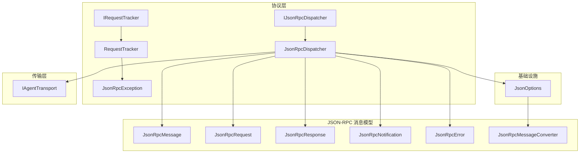
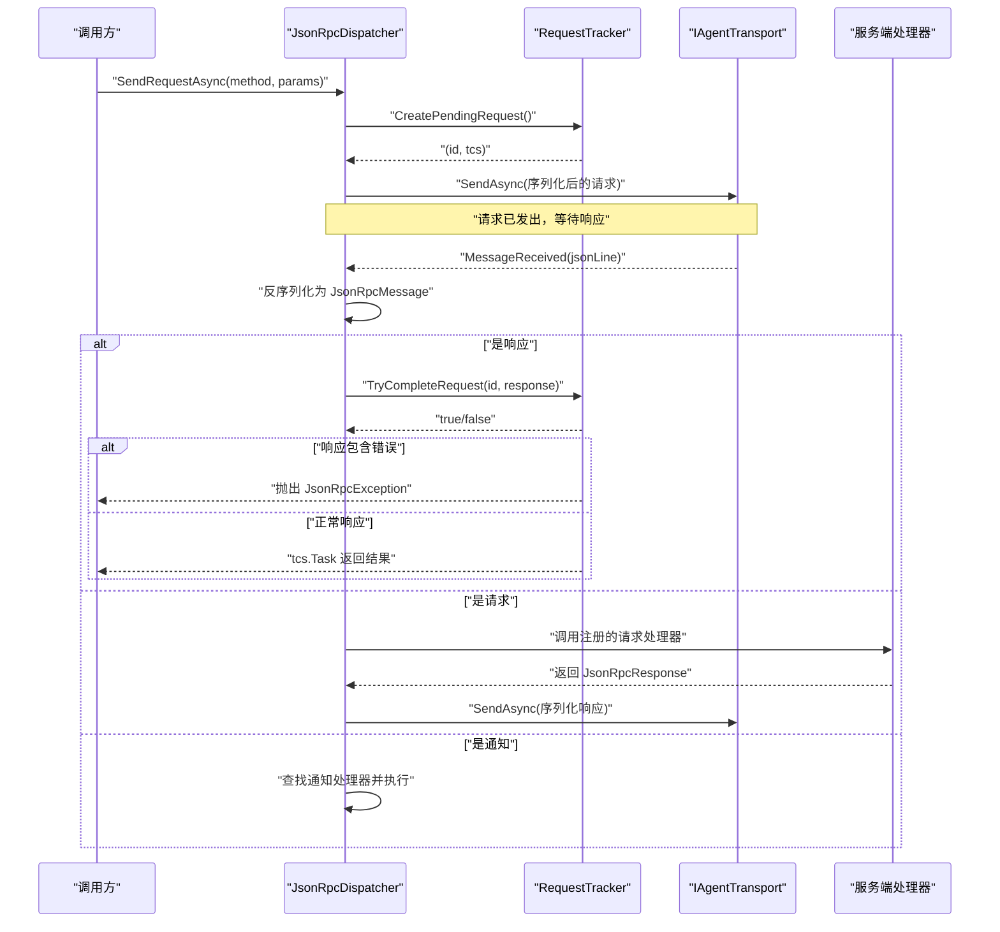
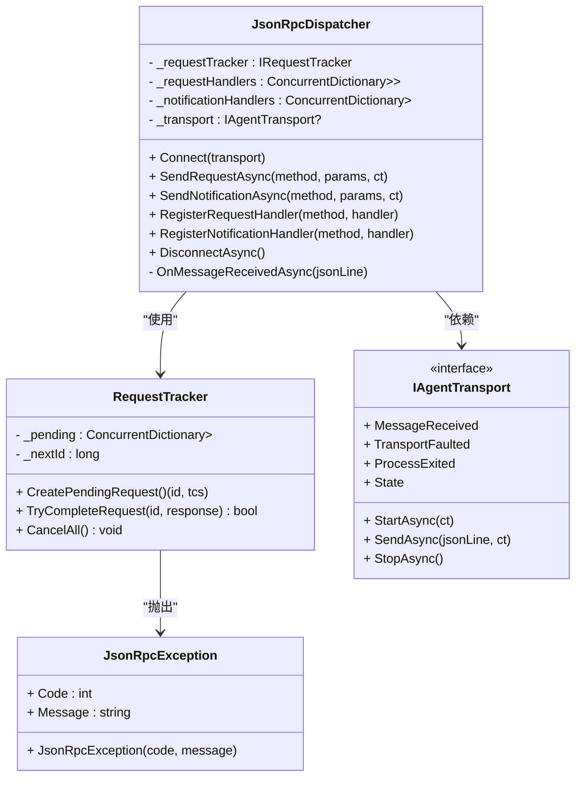
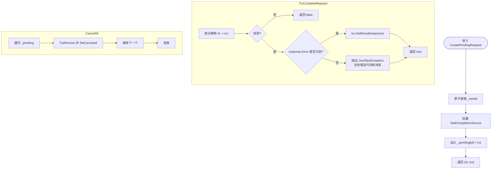
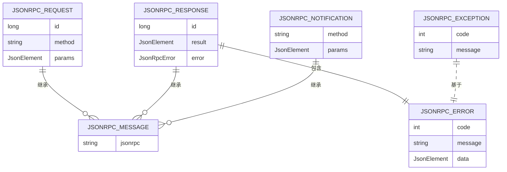
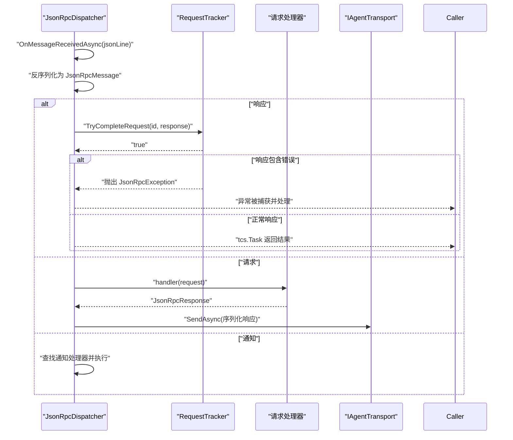
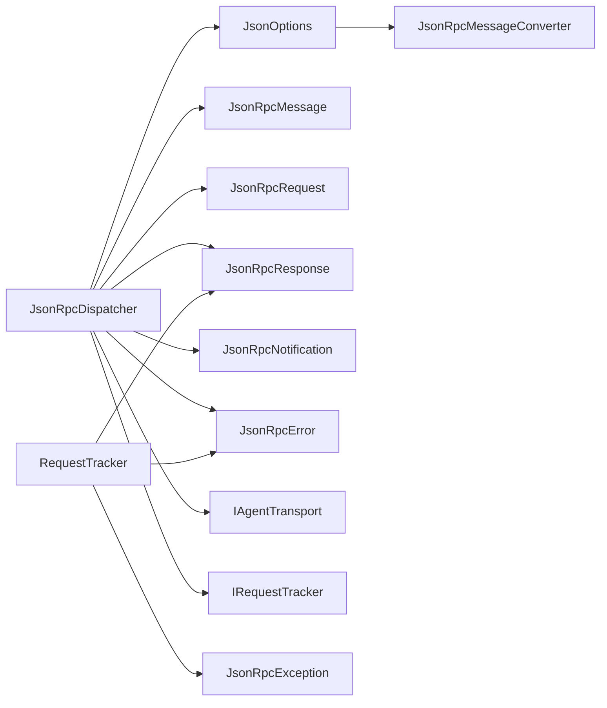

# 协议层

<cite>
**本文引用的文件**   
- [IJsonRpcDispatcher.cs](file://Protocol/IJsonRpcDispatcher.cs)
- [JsonRpcDispatcher.cs](file://Protocol/JsonRpcDispatcher.cs)
- [IRequestTracker.cs](file://Protocol/IRequestTracker.cs)
- [RequestTracker.cs](file://Protocol/RequestTracker.cs)
- [JsonRpcMessage.cs](file://JsonRpc/JsonRpcMessage.cs)
- [JsonRpcRequest.cs](file://JsonRpc/JsonRpcRequest.cs)
- [JsonRpcResponse.cs](file://JsonRpc/JsonRpcResponse.cs)
- [JsonRpcNotification.cs](file://JsonRpc/JsonRpcNotification.cs)
- [JsonRpcError.cs](file://JsonRpc/JsonRpcError.cs)
- [JsonOptions.cs](file://Infrastructure/JsonOptions.cs)
- [JsonRpcMessageConverter.cs](file://JsonRpc/JsonRpcMessageConverter.cs)
- [IAgentTransport.cs](file://Transport/IAgentTransport.cs)
- [README.md](file://README.md)
</cite>

## 更新摘要
**所做更改**
- 增强了 JsonRpcDispatcher.cs 中的错误处理策略文档
- 更新了 RequestTracker.cs 中的异常类文档，特别是 JsonRpcException 的详细说明
- 完善了 JSON-RPC 错误传播机制的文档描述
- 增强了异常处理和故障恢复的相关章节

## 目录
1. [简介](#简介)
2. [项目结构](#项目结构)
3. [核心组件](#核心组件)
4. [架构总览](#架构总览)
5. [详细组件分析](#详细组件分析)
6. [依赖关系分析](#依赖关系分析)
7. [性能考量](#性能考量)
8. [故障排查指南](#故障排查指南)
9. [结论](#结论)
10. [附录：扩展与高级配置](#附录扩展与高级配置)

## 简介
本章节聚焦协议层的 JSON-RPC 2.0 实现，围绕 IJsonRpcDispatcher 接口设计与 JsonRpcDispatcher 的具体实现展开，涵盖请求路由、响应匹配、通知处理与错误传播。同时记录 IRequestTracker 接口与 RequestTracker 实现，说明请求跟踪、超时管理与资源清理机制。文档还解释 JSON-RPC 2.0 消息格式、方法调用、参数绑定与结果返回，并提供自定义方法注册与扩展点的使用指导。

**更新** 增强了错误处理策略和异常类文档，特别关注 JsonRpcException 的使用场景和处理方式。

## 项目结构
协议层位于 Protocol 命名空间，JSON-RPC 消息模型位于 JsonRpc 命名空间，传输抽象位于 Transport 命名空间，序列化选项位于 Infrastructure 命名空间。整体采用"传输抽象 + 分发器 + 请求跟踪"的分层设计，便于替换底层传输（如 stdio、mock）并扩展协议能力。

**图表来源**
- [IJsonRpcDispatcher.cs:1-14](file://Protocol/IJsonRpcDispatcher.cs#L1-L14)
- [JsonRpcDispatcher.cs:1-124](file://Protocol/JsonRpcDispatcher.cs#L1-L124)
- [IRequestTracker.cs:1-11](file://Protocol/IRequestTracker.cs#L1-L11)
- [RequestTracker.cs:1-52](file://Protocol/RequestTracker.cs#L1-L52)
- [JsonRpcMessage.cs:1-14](file://JsonRpc/JsonRpcMessage.cs#L1-L14)
- [JsonRpcRequest.cs:1-19](file://JsonRpc/JsonRpcRequest.cs#L1-L19)
- [JsonRpcResponse.cs:1-20](file://JsonRpc/JsonRpcResponse.cs#L1-L20)
- [JsonRpcNotification.cs:1-16](file://JsonRpc/JsonRpcNotification.cs#L1-L16)
- [JsonRpcError.cs:1-19](file://JsonRpc/JsonRpcError.cs#L1-L19)
- [JsonOptions.cs:1-28](file://Infrastructure/JsonOptions.cs#L1-L28)
- [JsonRpcMessageConverter.cs:1-73](file://JsonRpc/JsonRpcMessageConverter.cs#L1-L73)
- [IAgentTransport.cs:1-39](file://Transport/IAgentTransport.cs#L1-L39)

## 核心组件
- IJsonRpcDispatcher：定义连接、发送请求、发送通知、注册处理器、断开等能力。
- JsonRpcDispatcher：实现 JSON-RPC 分发逻辑，负责消息收发、路由、响应匹配与错误传播。
- IRequestTracker：管理待完成请求的映射与生命周期。
- RequestTracker：并发安全的请求跟踪器，提供唯一 id 生成、完成与取消。
- JsonRpcException：JSON-RPC 错误异常类，封装错误代码和消息信息。

**更新** 新增 JsonRpcException 异常类的详细说明，包括其用途和使用场景。

**章节来源**
- [IJsonRpcDispatcher.cs:1-14](file://Protocol/IJsonRpcDispatcher.cs#L1-L14)
- [JsonRpcDispatcher.cs:1-124](file://Protocol/JsonRpcDispatcher.cs#L1-L124)
- [IRequestTracker.cs:1-11](file://Protocol/IRequestTracker.cs#L1-L11)
- [RequestTracker.cs:1-52](file://Protocol/RequestTracker.cs#L1-L52)

## 架构总览
JsonRpcDispatcher 通过 IAgentTransport 进行网络通信，使用 JsonOptions 统一序列化配置，借助 RequestTracker 维护请求-响应的关联。收到消息后，根据类型分派到请求处理器、通知处理器或完成对应等待的请求。

**图表来源**
- [JsonRpcDispatcher.cs:27-47](file://Protocol/JsonRpcDispatcher.cs#L27-L47)
- [JsonRpcDispatcher.cs:86-122](file://Protocol/JsonRpcDispatcher.cs#L86-L122)
- [RequestTracker.cs:11-30](file://Protocol/RequestTracker.cs#L11-L30)
- [IAgentTransport.cs:11-18](file://Transport/IAgentTransport.cs#L11-L18)

## 详细组件分析

### IJsonRpcDispatcher 接口设计
- Connect：绑定传输通道并订阅消息事件。
- SendRequestAsync：构造请求、分配唯一 id、序列化并发送，返回 Task<JsonRpcResponse>。
- SendNotificationAsync：构造通知并发送，无返回值。
- RegisterRequestHandler / RegisterNotificationHandler：按方法名注册处理器。
- DisconnectAsync：解绑事件并清理待处理请求。

**章节来源**
- [IJsonRpcDispatcher.cs:1-14](file://Protocol/IJsonRpcDispatcher.cs#L1-L14)

### JsonRpcDispatcher 实现要点
- 连接与事件订阅：在 Connect 中保存 transport 引用并订阅 MessageReceived。
- 请求发送：创建待完成请求，构造 JsonRpcRequest，使用 JsonOptions.Default 序列化并通过 transport 发送；等待 tcs.Task 获取结果。
- 通知发送：构造 JsonRpcNotification 并直接发送。
- 处理器注册：使用 ConcurrentDictionary 存储方法名到委托的映射。
- 消息接收处理：反序列化为 JsonRpcMessage 基类，依据具体类型分支处理：
  - 响应：通过 TryCompleteRequest 完成对应的 TaskCompletionSource。
  - 请求：查找请求处理器并异步执行，将结果序列化回发。
  - 通知：查找通知处理器并异步执行。
- 断开清理：移除事件订阅并调用 CancelAll 取消所有待完成请求。
- **错误处理增强**：在 OnMessageReceivedAsync 方法中添加 try-catch 块，捕获反序列化失败或处理器异常，确保系统稳定性。

**更新** 增强了错误处理策略的文档说明，特别强调了异常捕获和容错机制。

**图表来源**
- [JsonRpcDispatcher.cs:9-84](file://Protocol/JsonRpcDispatcher.cs#L9-L84)
- [RequestTracker.cs:6-40](file://Protocol/RequestTracker.cs#L6-L40)
- [RequestTracker.cs:42-51](file://Protocol/RequestTracker.cs#L42-L51)
- [IAgentTransport.cs:6-28](file://Transport/IAgentTransport.cs#L6-L28)

**章节来源**
- [JsonRpcDispatcher.cs:1-124](file://Protocol/JsonRpcDispatcher.cs#L1-L124)

### IRequestTracker 与 RequestTracker
- 并发安全：使用 ConcurrentDictionary 和 Interlocked 保证线程安全。
- 唯一 id：自增生成，避免冲突。
- 完成逻辑：TryCompleteRequest 从字典移除并设置 TCS 的结果或异常（当响应包含 Error 时抛出 JsonRpcException）。
- 取消清理：CancelAll 遍历并取消所有未完成的请求，用于断开时的资源清理。

**更新** 增强了 JsonRpcException 异常类的文档说明，包括其属性设计和构造函数用法。

**图表来源**
- [RequestTracker.cs:11-39](file://Protocol/RequestTracker.cs#L11-L39)
- [RequestTracker.cs:42-51](file://Protocol/RequestTracker.cs#L42-L51)

**章节来源**
- [IRequestTracker.cs:1-11](file://Protocol/IRequestTracker.cs#L1-L11)
- [RequestTracker.cs:1-52](file://Protocol/RequestTracker.cs#L1-L52)

### JSON-RPC 2.0 协议实现
- 消息基类：JsonRpcMessage 固定 jsonrpc="2.0"。
- 请求：JsonRpcRequest 包含 id、method、可选 params。
- 响应：JsonRpcResponse 包含 id、可选 result 或 error。
- 通知：JsonRpcNotification 包含 method、可选 params，无 id。
- 错误：JsonRpcError 包含 code、message、可选 data。
- 序列化：JsonOptions.Default 启用大小写不敏感、忽略 null、紧凑输出，并注册 JsonRpcMessageConverter 以支持多态反序列化。

**更新** 增强了 JSON-RPC 错误处理的文档说明，包括 JsonRpcError 对象的结构和 JsonRpcException 异常的使用。

**图表来源**
- [JsonRpcMessage.cs:1-14](file://JsonRpc/JsonRpcMessage.cs#L1-L14)
- [JsonRpcRequest.cs:1-19](file://JsonRpc/JsonRpcRequest.cs#L1-L19)
- [JsonRpcResponse.cs:1-20](file://JsonRpc/JsonRpcResponse.cs#L1-L20)
- [JsonRpcNotification.cs:1-16](file://JsonRpc/JsonRpcNotification.cs#L1-L16)
- [JsonRpcError.cs:1-19](file://JsonRpc/JsonRpcError.cs#L1-L19)
- [RequestTracker.cs:42-51](file://Protocol/RequestTracker.cs#L42-L51)
- [JsonOptions.cs:1-28](file://Infrastructure/JsonOptions.cs#L1-L28)

**章节来源**
- [JsonRpcMessage.cs:1-14](file://JsonRpc/JsonRpcMessage.cs#L1-L14)
- [JsonRpcRequest.cs:1-19](file://JsonRpc/JsonRpcRequest.cs#L1-L19)
- [JsonRpcResponse.cs:1-20](file://JsonRpc/JsonRpcResponse.cs#L1-L20)
- [JsonRpcNotification.cs:1-16](file://JsonRpc/JsonRpcNotification.cs#L1-L16)
- [JsonRpcError.cs:1-19](file://JsonRpc/JsonRpcError.cs#L1-L19)
- [JsonOptions.cs:1-28](file://Infrastructure/JsonOptions.cs#L1-L28)

### 请求路由、响应匹配、通知处理与错误传播
- 请求路由：基于方法名在 ConcurrentDictionary 中查找处理器，若不存在则忽略该请求。
- 响应匹配：通过 RequestTracker 中的 id 精确匹配，完成后移除映射。
- 通知处理：仅按方法名查找处理器并执行，无需等待结果。
- 错误传播：当响应包含 error 字段时，RequestTracker 抛出 JsonRpcException，调用方可捕获处理。

**更新** 增强了错误传播机制的文档说明，详细描述了 JsonRpcException 的抛出时机和处理方式。

**图表来源**
- [JsonRpcDispatcher.cs:86-122](file://Protocol/JsonRpcDispatcher.cs#L86-L122)
- [RequestTracker.cs:19-30](file://Protocol/RequestTracker.cs#L19-L30)
- [RequestTracker.cs:42-51](file://Protocol/RequestTracker.cs#L42-L51)

**章节来源**
- [JsonRpcDispatcher.cs:86-122](file://Protocol/JsonRpcDispatcher.cs#L86-L122)
- [RequestTracker.cs:19-30](file://Protocol/RequestTracker.cs#L19-L30)

## 依赖关系分析
- JsonRpcDispatcher 依赖：
  - IAgentTransport：用于发送与接收消息。
  - JsonOptions：统一序列化配置。
  - JsonRpc* 模型：用于构造与解析消息。
  - IRequestTracker：用于请求-响应关联。
- RequestTracker 依赖：
  - System.Collections.Concurrent：并发容器。
  - JsonRpc 模型：用于封装响应与错误。
  - JsonRpcException：用于表示 JSON-RPC 错误。

**更新** 增加了 JsonRpcException 依赖关系的说明。

**图表来源**
- [JsonRpcDispatcher.cs:1-20](file://Protocol/JsonRpcDispatcher.cs#L1-L20)
- [RequestTracker.cs:1-10](file://Protocol/RequestTracker.cs#L1-L10)
- [RequestTracker.cs:42-51](file://Protocol/RequestTracker.cs#L42-L51)
- [JsonOptions.cs:1-28](file://Infrastructure/JsonOptions.cs#L1-L28)
- [JsonRpcMessageConverter.cs:1-73](file://JsonRpc/JsonRpcMessageConverter.cs#L1-L73)
- [IAgentTransport.cs:1-39](file://Transport/IAgentTransport.cs#L1-L39)

**章节来源**
- [JsonRpcDispatcher.cs:1-20](file://Protocol/JsonRpcDispatcher.cs#L1-L20)
- [RequestTracker.cs:1-10](file://Protocol/RequestTracker.cs#L1-L10)
- [JsonOptions.cs:1-28](file://Infrastructure/JsonOptions.cs#L1-L28)
- [JsonRpcMessageConverter.cs:1-73](file://JsonRpc/JsonRpcMessageConverter.cs#L1-L73)
- [IAgentTransport.cs:1-39](file://Transport/IAgentTransport.cs#L1-L39)

## 性能考量
- 并发安全：使用 ConcurrentDictionary 与 Interlocked，避免锁竞争。
- 异步优先：全部使用 async/await，减少阻塞。
- 序列化优化：JsonOptions.Default 关闭缩进、忽略 null，提升吞吐。
- 内存管理：请求完成后立即从字典移除，降低内存占用。
- 可扩展性：处理器注册为函数式委托，易于替换与缓存。
- **异常处理优化**：使用 try-catch 块捕获异常，避免单个请求失败影响整体系统。

**更新** 增加了异常处理优化的性能考量说明。

## 故障排查指南
- 未连接即发送：SendRequestAsync/SendNotificationAsync 在未 Connect 时会抛出 InvalidOperationException。
- 反序列化失败：OnMessageReceivedAsync 内部捕获异常并忽略，需检查消息格式与 JsonOptions 配置。
- 请求未匹配：若未注册对应方法的处理器，请求将被忽略。
- 响应错误：当服务端返回 error 字段时，调用方会收到 JsonRpcException，需捕获并处理。
- 资源泄漏：确保在应用退出或连接断开时调用 DisconnectAsync，触发 CancelAll 清理未完成请求。
- **异常处理增强**：系统现在能够优雅地处理反序列化失败和处理器异常，不会导致整个分发器崩溃。

**更新** 增强了异常处理相关的故障排查说明。

**章节来源**
- [JsonRpcDispatcher.cs:27-31](file://Protocol/JsonRpcDispatcher.cs#L27-L31)
- [JsonRpcDispatcher.cs:50-53](file://Protocol/JsonRpcDispatcher.cs#L50-L53)
- [JsonRpcDispatcher.cs:118-121](file://Protocol/JsonRpcDispatcher.cs#L118-L121)
- [RequestTracker.cs:19-30](file://Protocol/RequestTracker.cs#L19-L30)
- [RequestTracker.cs:42-51](file://Protocol/RequestTracker.cs#L42-L51)
- [JsonRpcDispatcher.cs:76-84](file://Protocol/JsonRpcDispatcher.cs#L76-L84)

## 结论
协议层通过清晰的接口与实现分离，提供了稳定高效的 JSON-RPC 2.0 分发机制。JsonRpcDispatcher 负责消息路由与响应匹配，RequestTracker 保障请求生命周期管理，配合统一的序列化配置与传输抽象，形成可扩展、可测试且易维护的协议栈。**更新后的版本增强了错误处理能力和异常管理机制，提高了系统的健壮性和可维护性。**

## 附录：扩展与高级配置
- 自定义方法注册：
  - 请求处理器：RegisterRequestHandler("your/method", async request => { ... return new JsonRpcResponse { Id = request.Id, Result = ... }; })
  - 通知处理器：RegisterNotificationHandler("your/notify", async notification => { ... })
- 高级配置：
  - 修改 JsonOptions.Default 以调整序列化行为（如属性名大小写、忽略 null、是否缩进等）。
  - 替换 IRequestTracker 实现以实现自定义超时策略或持久化。
  - 替换 IAgentTransport 以支持不同传输方式（stdio、TCP、WebSocket 等）。
- **异常处理最佳实践**：
  - 在调用 SendRequestAsync 时使用 try-catch 捕获 JsonRpcException。
  - 检查 JsonRpcException.Code 属性以确定错误类型。
  - 实现适当的重试和降级逻辑来处理不同的错误代码。

**更新** 增加了异常处理最佳实践的指导建议。

**章节来源**
- [README.md:55-70](file://README.md#L55-L70)
- [JsonOptions.cs:13-26](file://Infrastructure/JsonOptions.cs#L13-L26)
- [IJsonRpcDispatcher.cs:10-11](file://Protocol/IJsonRpcDispatcher.cs#L10-L11)
- [IRequestTracker.cs:1-11](file://Protocol/IRequestTracker.cs#L1-L11)
- [IAgentTransport.cs:1-39](file://Transport/IAgentTransport.cs#L1-L39)
- [RequestTracker.cs:42-51](file://Protocol/RequestTracker.cs#L42-L51)