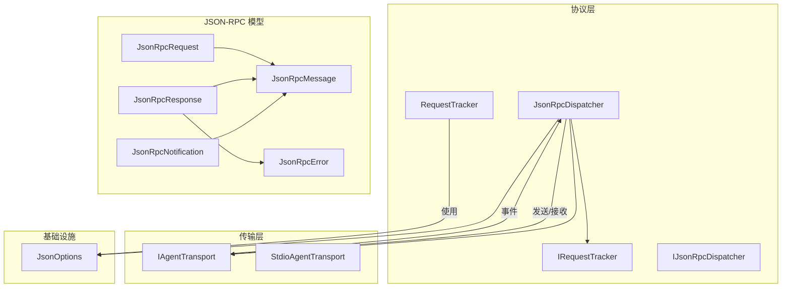
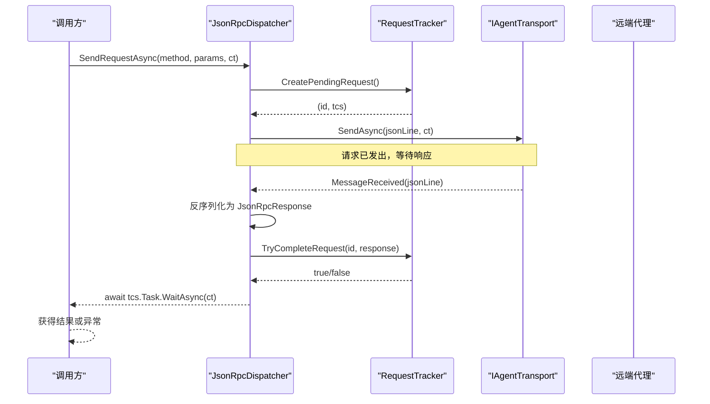
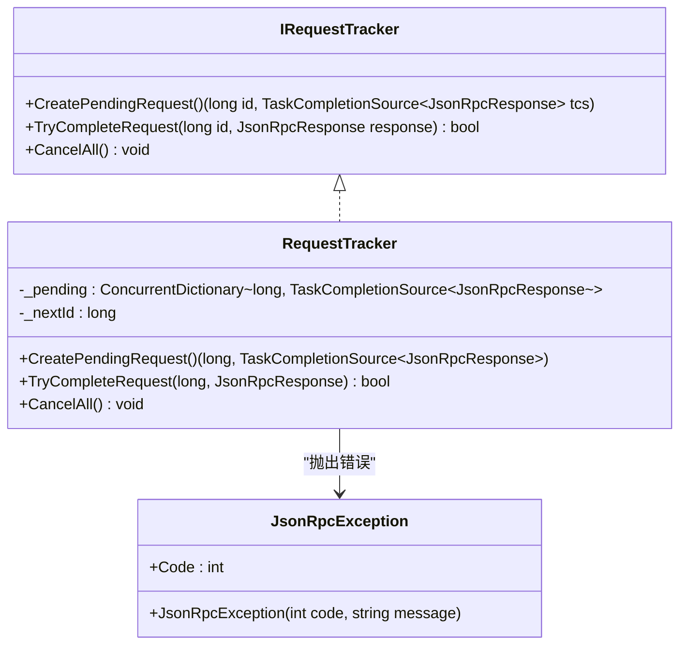
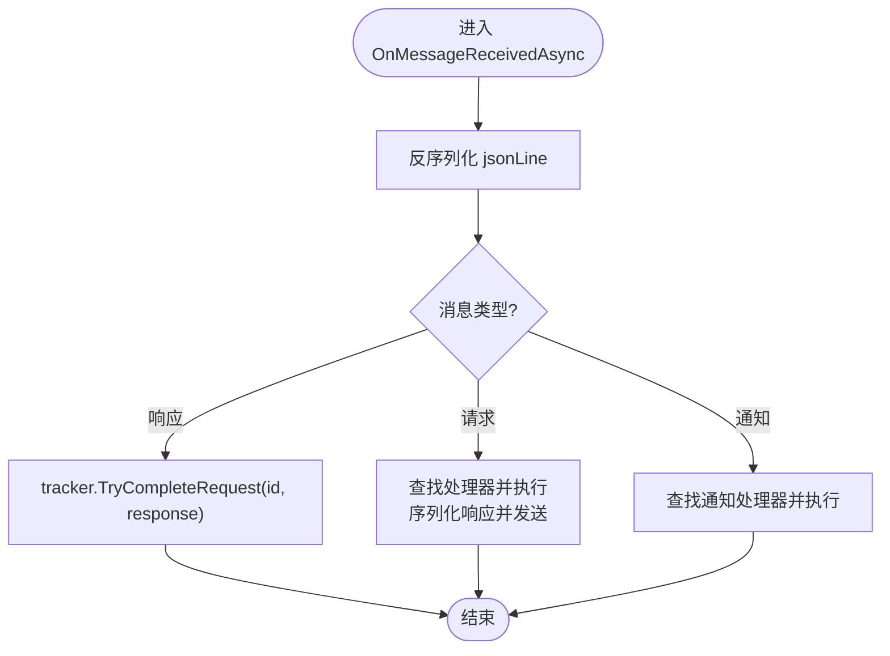
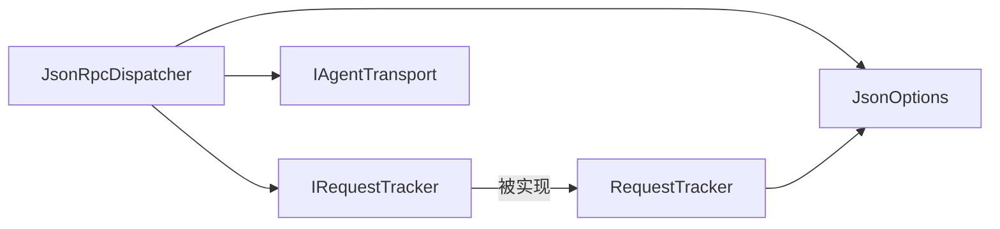

# 请求跟踪器

<cite>
**本文引用的文件**   
- [IRequestTracker.cs](file://Protocol/IRequestTracker.cs)
- [RequestTracker.cs](file://Protocol/RequestTracker.cs)
- [JsonRpcDispatcher.cs](file://Protocol/JsonRpcDispatcher.cs)
- [IJsonRpcDispatcher.cs](file://Protocol/IJsonRpcDispatcher.cs)
- [JsonRpcMessage.cs](file://JsonRpc/JsonRpcMessage.cs)
- [JsonRpcRequest.cs](file://JsonRpc/JsonRpcRequest.cs)
- [JsonRpcResponse.cs](file://JsonRpc/JsonRpcResponse.cs)
- [JsonRpcNotification.cs](file://JsonRpc/JsonRpcNotification.cs)
- [JsonRpcError.cs](file://JsonRpc/JsonRpcError.cs)
- [IAgentTransport.cs](file://Transport/IAgentTransport.cs)
- [StdioAgentTransport.cs](file://Transport/StdioAgentTransport.cs)
- [JsonOptions.cs](file://Infrastructure/JsonOptions.cs)
- [README.md](file://README.md)
</cite>

## 目录
1. [简介](#简介)
2. [项目结构](#项目结构)
3. [核心组件](#核心组件)
4. [架构总览](#架构总览)
5. [详细组件分析](#详细组件分析)
6. [依赖关系分析](#依赖关系分析)
7. [性能考量](#性能考量)
8. [故障排查指南](#故障排查指南)
9. [结论](#结论)
10. [附录：自定义实现示例与最佳实践](#附录自定义实现示例与最佳实践)

## 简介
本文件聚焦于请求跟踪器的设计与实现，围绕 IRequestTracker 接口与 RequestTracker 类展开，系统阐述请求 ID 生成策略、请求状态管理、响应匹配算法、超时处理机制（含配置、重试策略与资源清理）、并发请求的线程安全保证与内存管理，并提供监控指标建议、常见问题排查方法以及完整的自定义实现示例路径。

## 项目结构
本项目采用分层组织方式：
- Protocol 层：定义 JSON-RPC 分发与请求跟踪契约及默认实现
- JsonRpc 层：JSON-RPC 消息模型与序列化选项
- Transport 层：传输抽象与基于 stdio 的实现
- Infrastructure 层：通用基础设施（如 JSON 序列化选项）
- Client 与 Models 层：客户端与业务模型（与请求跟踪无直接耦合）

图表来源
- [JsonRpcDispatcher.cs:1-124](file://Protocol/JsonRpcDispatcher.cs#L1-L124)
- [RequestTracker.cs:1-52](file://Protocol/RequestTracker.cs#L1-L52)
- [IRequestTracker.cs:1-11](file://Protocol/IRequestTracker.cs#L1-L11)
- [IJsonRpcDispatcher.cs:1-14](file://Protocol/IJsonRpcDispatcher.cs#L1-L14)
- [JsonRpcMessage.cs:1-14](file://JsonRpc/JsonRpcMessage.cs#L1-L14)
- [JsonRpcRequest.cs:1-19](file://JsonRpc/JsonRpcRequest.cs#L1-L19)
- [JsonRpcResponse.cs:1-20](file://JsonRpc/JsonRpcResponse.cs#L1-L20)
- [JsonRpcNotification.cs:1-16](file://JsonRpc/JsonRpcNotification.cs#L1-L16)
- [JsonRpcError.cs:1-19](file://JsonRpc/JsonRpcError.cs#L1-L19)
- [IAgentTransport.cs:1-39](file://Transport/IAgentTransport.cs#L1-L39)
- [StdioAgentTransport.cs:1-147](file://Transport/StdioAgentTransport.cs#L1-L147)
- [JsonOptions.cs:1-28](file://Infrastructure/JsonOptions.cs#L1-L28)

章节来源
- [README.md:1-99](file://README.md#L1-L99)

## 核心组件
- IRequestTracker：定义创建待完成请求、尝试完成请求、取消全部请求的能力。
- RequestTracker：基于 ConcurrentDictionary 与原子递增 ID 的线程安全请求跟踪实现，配合 TaskCompletionSource 进行异步结果回传。
- JsonRpcDispatcher：负责将请求通过传输层发送，并在收到响应时调用请求跟踪器完成对应请求；同时处理服务端请求与通知的分发。

章节来源
- [IRequestTracker.cs:1-11](file://Protocol/IRequestTracker.cs#L1-L11)
- [RequestTracker.cs:1-52](file://Protocol/RequestTracker.cs#L1-L52)
- [JsonRpcDispatcher.cs:1-124](file://Protocol/JsonRpcDispatcher.cs#L1-L124)

## 架构总览
请求从上层发起，经 JsonRpcDispatcher 封装为 JSON-RPC 请求并通过传输层发送；传输层以事件形式返回原始 JSON 行，Dispatcher 反序列化为具体消息类型后，根据消息种类路由到请求跟踪器或处理器。请求跟踪器维护“ID -> TaskCompletionSource”映射，在响应到达时按 ID 精确匹配并唤醒等待方。

图表来源
- [JsonRpcDispatcher.cs:27-47](file://Protocol/JsonRpcDispatcher.cs#L27-L47)
- [JsonRpcDispatcher.cs:86-122](file://Protocol/JsonRpcDispatcher.cs#L86-L122)
- [RequestTracker.cs:11-30](file://Protocol/RequestTracker.cs#L11-L30)
- [IAgentTransport.cs:14-15](file://Transport/IAgentTransport.cs#L14-L15)

## 详细组件分析

### IRequestTracker 接口设计
- CreatePendingRequest：生成唯一请求 ID 并注册一个 TaskCompletionSource，供后续响应匹配完成后唤醒等待任务。
- TryCompleteRequest：按 ID 移除并设置 TCS 的结果或异常，返回是否成功匹配。
- CancelAll：用于连接断开或关闭时的统一清理，取消所有挂起请求。

该接口将“请求生命周期管理”与“具体存储/调度实现”解耦，便于替换为分布式或持久化跟踪方案。

章节来源
- [IRequestTracker.cs:1-11](file://Protocol/IRequestTracker.cs#L1-L11)

### RequestTracker 实现机制
- 并发字典 _pending：键为 long 类型请求 ID，值为 TaskCompletionSource<JsonRpcResponse>，提供 O(1) 查找与线程安全的增删改。
- 原子递增 _nextId：使用 Interlocked.Increment 确保 ID 全局单调递增且无冲突。
- CreatePendingRequest：分配 ID、创建 TCS（RunContinuationsAsynchronously 避免同步回调阻塞），写入字典并返回元组。
- TryCompleteRequest：TryRemove 成功后，若响应包含 Error 则抛出 JsonRpcException，否则 SetResult；未命中返回 false。
- CancelAll：遍历并移除所有条目，调用 SetCanceled 以释放等待方。

复杂度与特性
- 时间复杂度：CreatePendingRequest 与 TryCompleteRequest 均为 O(1)。
- 空间复杂度：与并发请求数线性相关，需关注内存占用。
- 线程安全：ConcurrentDictionary + Interlocked 保证多线程环境下的正确性。

图表来源
- [IRequestTracker.cs:5-10](file://Protocol/IRequestTracker.cs#L5-L10)
- [RequestTracker.cs:6-40](file://Protocol/RequestTracker.cs#L6-L40)
- [RequestTracker.cs:43-51](file://Protocol/RequestTracker.cs#L43-L51)

章节来源
- [RequestTracker.cs:1-52](file://Protocol/RequestTracker.cs#L1-L52)

### JsonRpcDispatcher 中的请求跟踪集成
- 构造时注入 IRequestTracker（默认使用 RequestTracker）。
- Connect：绑定传输层的 MessageReceived 事件。
- SendRequestAsync：
  - 校验已连接
  - 调用 tracker.CreatePendingRequest 获取 id 与 tcs
  - 构建 JsonRpcRequest 并序列化
  - 通过 transport.SendAsync 发送
  - 等待 tcs.Task.WaitAsync(ct) 获取结果或异常
- OnMessageReceivedAsync：
  - 反序列化消息
  - 若是响应：调用 tracker.TryCompleteRequest 完成匹配
  - 若是请求：分发给已注册的处理器并回写响应
  - 若是通知：分发给通知处理器
- DisconnectAsync：解除事件订阅并调用 tracker.CancelAll 清理挂起请求。

图表来源
- [JsonRpcDispatcher.cs:86-122](file://Protocol/JsonRpcDispatcher.cs#L86-L122)

章节来源
- [JsonRpcDispatcher.cs:1-124](file://Protocol/JsonRpcDispatcher.cs#L1-L124)

### 请求 ID 生成策略
- 使用 Interlocked.Increment 对 _nextId 原子递增，确保跨线程的唯一性与单调性。
- 长整型 ID 降低碰撞概率，适合高并发场景。
- 当前实现未做 ID 复用或回收策略，属于“只增不返”的模式。

章节来源
- [RequestTracker.cs:11-17](file://Protocol/RequestTracker.cs#L11-L17)

### 请求状态管理与响应匹配算法
- 状态：每个请求在字典中保存一个 TaskCompletionSource，表示“等待响应”。
- 匹配：响应携带 id，TryCompleteRequest 通过 TryRemove 原子移除并设置结果/异常，确保一次匹配即销毁状态。
- 失败路径：TryRemove 失败返回 false，意味着重复响应或丢失请求。

章节来源
- [RequestTracker.cs:19-30](file://Protocol/RequestTracker.cs#L19-L30)

### 超时处理机制（配置、重试策略、资源清理）
- 当前实现未内置超时控制。SendRequestAsync 使用传入的 CancellationToken 等待 TCS.Task.WaitAsync(ct)，可通过外部 Cancellation 实现“逻辑超时”（由调用方控制）。
- 建议扩展：
  - 增加超时配置参数（如 DefaultTimeout、PerMethodTimeouts）
  - 在 CreatePendingRequest 时启动定时器，超时后调用 TryCompleteRequest 或 SetCanceled
  - 支持可配置的重试策略（幂等方法、指数退避、最大重试次数）
- 资源清理：
  - DisconnectAsync 调用 tracker.CancelAll 取消所有挂起请求
  - StdioAgentTransport.StopAsync 会关闭进程并等待退出，必要时强制终止

章节来源
- [JsonRpcDispatcher.cs:27-47](file://Protocol/JsonRpcDispatcher.cs#L27-L47)
- [JsonRpcDispatcher.cs:76-84](file://Protocol/JsonRpcDispatcher.cs#L76-L84)
- [StdioAgentTransport.cs:70-93](file://Transport/StdioAgentTransport.cs#L70-L93)

### 并发请求的处理方式（线程安全与内存管理）
- 线程安全：
  - ConcurrentDictionary 保证并发读写安全
  - Interlocked 保证 ID 生成无竞争
  - TaskCreationOptions.RunContinuationsAsynchronously 避免同步回调导致死锁
- 内存管理：
  - 请求完成后立即从字典移除，避免长期驻留
  - CancelAll 会批量清理，防止连接断开后的内存泄漏
  - 注意高并发下字典扩容开销与 GC 压力，必要时限制并发请求上限

章节来源
- [RequestTracker.cs:1-40](file://Protocol/RequestTracker.cs#L1-L40)
- [JsonRpcDispatcher.cs:1-20](file://Protocol/JsonRpcDispatcher.cs#L1-L20)

### 监控指标建议
- 活跃请求数：_pending.Count（可暴露为计数器）
- 请求成功率/失败率：TryCompleteRequest 成功与失败计数
- 平均/分位延迟：记录 CreatePendingRequest 到 TryCompleteRequest 的时间差
- 超时/取消次数：外部 Cancellation 触发统计
- 错误码分布：统计 JsonRpcError.Code 分布
- 吞吐：单位时间内请求/响应数量

[本节为概念性内容，无需代码引用]

## 依赖关系分析
- JsonRpcDispatcher 依赖 IRequestTracker 与 IAgentTransport，二者均通过接口解耦。
- RequestTracker 依赖 System.Collections.Concurrent 与 System.Threading.Tasks。
- 序列化依赖 JsonOptions.Default 提供的 JsonSerializerOptions。

图表来源
- [JsonRpcDispatcher.cs:1-20](file://Protocol/JsonRpcDispatcher.cs#L1-L20)
- [JsonOptions.cs:1-28](file://Infrastructure/JsonOptions.cs#L1-L28)

章节来源
- [JsonRpcDispatcher.cs:1-20](file://Protocol/JsonRpcDispatcher.cs#L1-L20)
- [JsonOptions.cs:1-28](file://Infrastructure/JsonOptions.cs#L1-L28)

## 性能考量
- 字典操作 O(1)，但高并发下扩容可能带来短暂停顿，建议预估并发规模并合理初始化容量。
- 序列化/反序列化是主要 CPU 热点，JsonOptions 已启用忽略 null 与无序属性等优化。
- 使用 RunContinuationsAsynchronously 减少同步上下文切换成本。
- 避免长时间持有大对象引用，确保响应处理后及时释放。

[本节为通用性能建议，无需代码引用]

## 故障排查指南
- 请求丢失
  - 现象：TryCompleteRequest 返回 false
  - 排查：检查传输层是否丢包、是否重复发送、是否存在多个 Dispatcher 实例共享同一传输
  - 定位：OnMessageReceivedAsync 的反序列化与分支判断
- 响应错配
  - 现象：TCS 被错误的 id 完成
  - 排查：确认请求 ID 唯一性、是否存在并发修改 _pending 的竞争条件
  - 定位：CreatePendingRequest 与 TryCompleteRequest 的原子操作
- 内存泄漏
  - 现象：_pending 持续增长
  - 排查：是否缺少 CancelAll 调用、是否出现未完成的 TCS 未被清理
  - 定位：DisconnectAsync 与 StopAsync 的生命周期管理
- 超时与取消
  - 现象：调用方长时间等待
  - 排查：CancellationToken 是否正确传递、是否设置了合理的 WaitAsync 超时
  - 定位：SendRequestAsync 中的 WaitAsync 与外部 Cancellation

章节来源
- [JsonRpcDispatcher.cs:86-122](file://Protocol/JsonRpcDispatcher.cs#L86-L122)
- [RequestTracker.cs:19-39](file://Protocol/RequestTracker.cs#L19-L39)
- [StdioAgentTransport.cs:70-93](file://Transport/StdioAgentTransport.cs#L70-L93)

## 结论
IRequestTracker 与 RequestTracker 提供了简洁而高效的请求跟踪能力，结合 JsonRpcDispatcher 实现了线程安全、可扩展的 JSON-RPC 请求-响应匹配机制。当前实现未内置超时与重试，但通过 CancellationToken 与外部扩展点可轻松补齐。在高并发场景下，应关注内存占用与序列化性能，并完善监控指标以便运维观测。

[本节为总结性内容，无需代码引用]

## 附录：自定义实现示例与最佳实践

### 自定义请求跟踪器示例（思路与步骤）
- 目标：实现分布式或带超时的请求跟踪器
- 步骤：
  - 实现 IRequestTracker 接口
  - 使用外部存储（如 Redis）保存 pending 请求与过期时间
  - 在 CreatePendingRequest 中写入存储并设置 TTL
  - 在 TryCompleteRequest 中删除并设置结果
  - 在 CancelAll 中批量清理
  - 可选：增加重试队列与幂等键
- 参考位置：
  - 接口定义：[IRequestTracker.cs:5-10](file://Protocol/IRequestTracker.cs#L5-L10)
  - 默认实现：[RequestTracker.cs:6-40](file://Protocol/RequestTracker.cs#L6-L40)

章节来源
- [IRequestTracker.cs:1-11](file://Protocol/IRequestTracker.cs#L1-L11)
- [RequestTracker.cs:1-52](file://Protocol/RequestTracker.cs#L1-L52)

### 添加超时与重试的最佳实践
- 在 JsonRpcDispatcher.SendRequestAsync 中引入超时：
  - 使用 CancellationTokenSource 包装外部 ct，设置超时后取消
  - 或在 RequestTracker 内部为每个 TCS 附加定时器
- 重试策略：
  - 仅对幂等方法启用重试
  - 指数退避 + 抖动
  - 记录重试次数与失败原因
- 参考位置：
  - 发送与等待：[JsonRpcDispatcher.cs:27-47](file://Protocol/JsonRpcDispatcher.cs#L27-L47)
  - 取消与清理：[JsonRpcDispatcher.cs:76-84](file://Protocol/JsonRpcDispatcher.cs#L76-L84)

章节来源
- [JsonRpcDispatcher.cs:27-47](file://Protocol/JsonRpcDispatcher.cs#L27-L47)
- [JsonRpcDispatcher.cs:76-84](file://Protocol/JsonRpcDispatcher.cs#L76-L84)

### 监控与诊断
- 暴露指标：
  - 活跃请求数、成功率、平均延迟、错误码分布
- 日志建议：
  - 记录请求开始/结束、错误码、重试次数、取消原因
- 参考位置：
  - 消息处理入口：[JsonRpcDispatcher.cs:86-122](file://Protocol/JsonRpcDispatcher.cs#L86-L122)

章节来源
- [JsonRpcDispatcher.cs:86-122](file://Protocol/JsonRpcDispatcher.cs#L86-L122)

### 快速上手参考
- 使用示例与 API 概览见 README，展示如何创建传输、分发器与客户端，并进行初始化与发送请求。
- 参考位置：
  - [README.md:1-99](file://README.md#L1-L99)

章节来源
- [README.md:1-99](file://README.md#L1-L99)