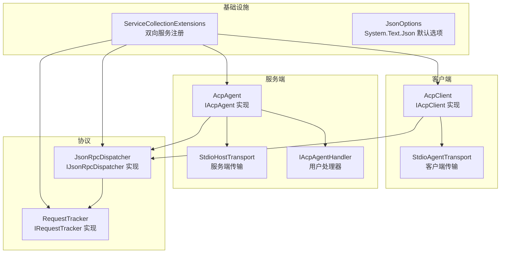
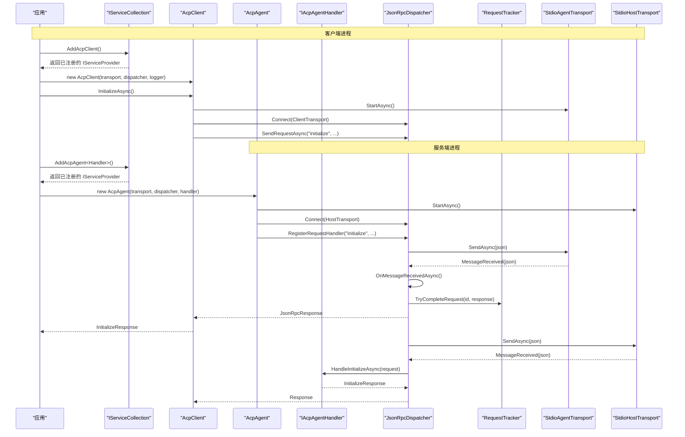
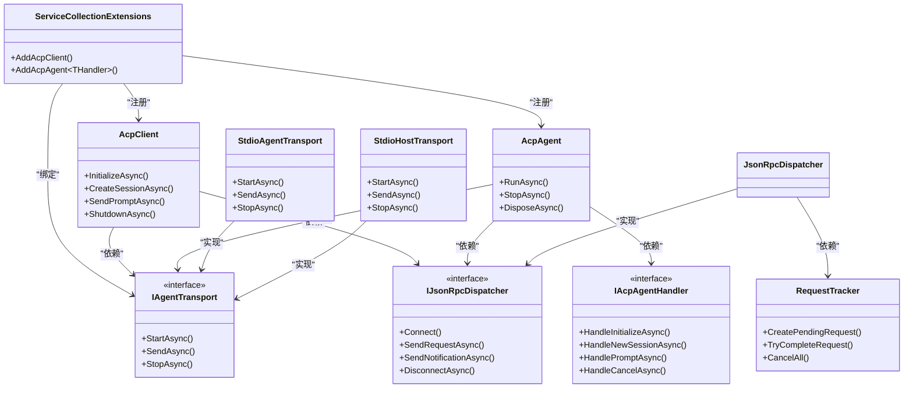

# 基础设施配置

<cite>
**本文引用的文件**   
- [Infrastructure/ServiceCollectionExtensions.cs](file://Infrastructure/ServiceCollectionExtensions.cs)
- [Infrastructure/JsonOptions.cs](file://Infrastructure/JsonOptions.cs)
- [Agent/AcpAgent.cs](file://Agent/AcpAgent.cs)
- [Agent/IAcpAgent.cs](file://Agent/IAcpAgent.cs)
- [Agent/IAcpAgentHandler.cs](file://Agent/IAcpAgentHandler.cs)
- [Agent/IAcpAgentContext.cs](file://Agent/IAcpAgentContext.cs)
- [Agent/AcpAgentHandlerBase.cs](file://Agent/AcpAgentHandlerBase.cs)
- [Transport/StdioHostTransport.cs](file://Transport/StdioHostTransport.cs)
- [Client/AcpClient.cs](file://Client/AcpClient.cs)
- [Protocol/JsonRpcDispatcher.cs](file://Protocol/JsonRpcDispatcher.cs)
- [Protocol/RequestTracker.cs](file://Protocol/RequestTracker.cs)
- [Transport/StdioAgentTransport.cs](file://Transport/StdioAgentTransport.cs)
- [Agentic.ACPLibrary.csproj](file://Agentic.ACPLibrary.csproj)
- [README.md](file://README.md)
</cite>

## 更新摘要
**所做更改**   
- 新增 AddAcpAgent<T>() 扩展方法的详细说明和单进程客户端/代理模式约束
- 完善了 ACP Agent 架构和服务注册机制的文档
- 增强了依赖注入容器配置的双向支持（客户端和代理）
- 更新了完整的配置示例，包含客户端和代理两种使用场景
- 改进了性能调优和内存管理建议，涵盖双向通信场景

## 目录
1. [简介](#简介)
2. [项目结构](#项目结构)
3. [核心组件](#核心组件)
4. [架构总览](#架构总览)
5. [详细组件分析](#详细组件分析)
6. [依赖关系分析](#依赖关系分析)
7. [性能与内存优化](#性能与内存优化)
8. [故障排查指南](#故障排查指南)
9. [结论](#结论)
10. [附录：配置示例与最佳实践](#附录配置示例与最佳实践)

## 简介
本文件聚焦于该库的基础设施配置，重点说明以下内容：
- **双向依赖注入容器配置**：客户端和服务端的服务注册机制与服务生命周期管理（单例、瞬态）
- **ServiceCollectionExtensions 提供的扩展方法**：AddAcpClient() 和新增的 AddAcpAgent<T>() 方法的使用模式
- **System.Text.Json 的序列化选项**：JsonOptions 的配置与行为
- **单进程客户端/代理模式约束**：确保进程只注册客户端或代理，不能同时注册两者
- 与其他 Microsoft.Extensions.* 库的集成方式（DI、日志）
- 性能调优、内存管理与线程安全注意事项
- 在不同应用场景下的完整配置示例

## 项目结构
该库采用分层组织，支持双向通信架构：
- Infrastructure：基础设施层，提供 DI 扩展与 JSON 序列化默认选项
- Client：客户端实现与契约
- Agent：服务端实现与契约
- Protocol：JSON-RPC 分发与请求跟踪
- Transport：传输抽象与 stdio 实现（客户端和服务端各有一套）
- Models/Enums：协议模型与枚举
- JsonRpc：JSON-RPC 消息类型与转换器



**图表来源**
- [Infrastructure/ServiceCollectionExtensions.cs:15-38](file://Infrastructure/ServiceCollectionExtensions.cs#L15-L38)
- [Infrastructure/JsonOptions.cs:7-27](file://Infrastructure/JsonOptions.cs#L7-L27)
- [Client/AcpClient.cs:12-45](file://Client/AcpClient.cs#L12-L45)
- [Agent/AcpAgent.cs:17-42](file://Agent/AcpAgent.cs#L17-L42)
- [Protocol/JsonRpcDispatcher.cs:9-26](file://Protocol/JsonRpcDispatcher.cs#L9-L26)
- [Protocol/RequestTracker.cs:6-19](file://Protocol/RequestTracker.cs#L6-L19)
- [Transport/StdioAgentTransport.cs:8-28](file://Transport/StdioAgentTransport.cs#L8-L28)
- [Transport/StdioHostTransport.cs:9-37](file://Transport/StdioHostTransport.cs#L9-L37)

**章节来源**
- [Agentic.ACPLibrary.csproj:1-34](file://Agentic.ACPLibrary.csproj#L1-L34)
- [README.md:1-99](file://README.md#L1-L99)

## 核心组件
- **ServiceCollectionExtensions.AddAcpClient**：将 ACP 客户端相关服务注册到 DI 容器，定义各服务的生命周期
- **ServiceCollectionExtensions.AddAcpAgent<T>**：**新增** 将 ACP 代理相关服务注册到 DI 容器，强制单进程客户端/代理模式约束
- **JsonOptions.Default**：提供全局共享的 System.Text.Json 序列化选项，包含属性名大小写不敏感、忽略 null、紧凑输出、允许元数据字段乱序等设置，并注册 JSON-RPC 消息转换器与字符串枚举转换器
- **AcpClient**：ACP 客户端主实现，负责初始化握手、会话管理、事件订阅、处理器注册与 JSON 序列化/反序列化
- **AcpAgent**：**新增** ACP 代理主实现，监听客户端请求并通过用户提供的 IAcpAgentHandler 进行分发处理
- **JsonRpcDispatcher**：JSON-RPC 消息分发器，负责发送请求/通知、处理响应、路由请求与通知到对应处理器
- **RequestTracker**：并发安全的请求跟踪器，维护待完成请求的 TaskCompletionSource
- **StdioAgentTransport**：基于子进程标准输入输出的客户端传输实现
- **StdioHostTransport**：**新增** 基于进程标准输入输出的服务端传输实现

**章节来源**
- [Infrastructure/ServiceCollectionExtensions.cs:15-38](file://Infrastructure/ServiceCollectionExtensions.cs#L15-L38)
- [Infrastructure/JsonOptions.cs:7-27](file://Infrastructure/JsonOptions.cs#L7-L27)
- [Client/AcpClient.cs:12-45](file://Client/AcpClient.cs#L12-L45)
- [Agent/AcpAgent.cs:17-42](file://Agent/AcpAgent.cs#L17-L42)
- [Protocol/JsonRpcDispatcher.cs:9-26](file://Protocol/JsonRpcDispatcher.cs#L9-L26)
- [Protocol/RequestTracker.cs:6-19](file://Protocol/RequestTracker.cs#L6-L19)
- [Transport/StdioAgentTransport.cs:8-28](file://Transport/StdioAgentTransport.cs#L8-L28)
- [Transport/StdioHostTransport.cs:9-37](file://Transport/StdioHostTransport.cs#L9-L37)

## 架构总览
下图展示了从应用启动到 ACP 通信的关键流程，包括客户端和服务端的完整交互：



**图表来源**
- [Infrastructure/ServiceCollectionExtensions.cs:15-38](file://Infrastructure/ServiceCollectionExtensions.cs#L15-L38)
- [Client/AcpClient.cs:48-182](file://Client/AcpClient.cs#L48-L182)
- [Agent/AcpAgent.cs:44-179](file://Agent/AcpAgent.cs#L44-L179)
- [Protocol/JsonRpcDispatcher.cs:27-47](file://Protocol/JsonRpcDispatcher.cs#L27-L47)
- [Protocol/JsonRpcDispatcher.cs:86-122](file://Protocol/JsonRpcDispatcher.cs#L86-L122)
- [Protocol/RequestTracker.cs:19-30](file://Protocol/RequestTracker.cs#L19-L30)
- [Transport/StdioAgentTransport.cs:30-59](file://Transport/StdioAgentTransport.cs#L30-L59)
- [Transport/StdioHostTransport.cs:23-37](file://Transport/StdioHostTransport.cs#L23-L37)

## 详细组件分析

### 依赖注入与服务注册（ServiceCollectionExtensions）

**更新** 新增了 AddAcpAgent<T>() 扩展方法和单进程模式约束

ServiceCollectionExtensions 提供了两个主要的扩展方法，分别用于客户端和服务端的服务注册：

#### AddAcpClient() - 客户端服务注册
- **服务注册策略**：
  - `IJsonRpcDispatcher` → `JsonRpcDispatcher`（瞬态）
  - `IRequestTracker` → `RequestTracker`（瞬态）
  - `AcpClient`（单例）
  - `IAcpClient` 映射到 `AcpClient`（单例）

#### AddAcpAgent<T>() - 服务端服务注册
- **服务注册策略**：
  - `IAgentTransport` → `StdioHostTransport`（瞬态）
  - `IJsonRpcDispatcher` → `JsonRpcDispatcher`（瞬态）
  - `IRequestTracker` → `RequestTracker`（瞬态）
  - `IAcpAgentHandler` → `THandler`（单例，泛型约束）
  - `AcpAgent`（单例）
  - `IAcpAgent` 映射到 `AcpAgent`（单例）

- **单进程模式约束**：注释明确指出一个进程应该只注册 ACP 客户端或 ACP 代理，不能同时注册两者
- **生命周期管理**：
  - **单例模式**：AcpClient/AcpAgent、IAcpClient/IAcpAgent、IAcpAgentHandler 在整个应用生命周期内保持唯一实例
  - **瞬态模式**：JsonRpcDispatcher、RequestTracker、IAgentTransport 每次解析时创建新实例

- **使用方式**：在应用启动时调用相应的方法完成所有服务的自动注册

**章节来源**
- [Infrastructure/ServiceCollectionExtensions.cs:15-38](file://Infrastructure/ServiceCollectionExtensions.cs#L15-L38)

### ACP Agent 服务端实现

**新增** AcpAgent 是 ACP 服务端的核心实现，负责监听客户端请求并通过用户提供的处理器进行处理：

- **构造函数依赖注入**：接受 `IAgentTransport`、`IJsonRpcDispatcher`、`IAcpAgentHandler` 和可选的 `ILogger<AcpAgent>` 参数
- **运行流程**：
  - 启动传输层（StartAsync）
  - 连接分发器（Connect）
  - 订阅进程退出事件以检测客户端断开
  - 注册 initialize、session/new、session/prompt 请求处理器
  - 注册 session/cancel 通知处理器
  - 通过 IAcpAgentHandler 处理具体的业务逻辑
- **会话管理**：使用 ConcurrentDictionary 管理活跃会话的取消令牌
- **上下文支持**：提供 IAcpAgentContext 接口，允许代理在处理过程中向客户端发送更新、请求权限、访问文件系统和管理终端
- **资源管理**：实现 DisposeAsync 接口，确保资源的正确释放
- **JSON 序列化**：广泛使用 JsonOptions.Default 进行高效的序列化/反序列化操作

**章节来源**
- [Agent/AcpAgent.cs:17-42](file://Agent/AcpAgent.cs#L17-L42)
- [Agent/AcpAgent.cs:44-179](file://Agent/AcpAgent.cs#L44-L179)
- [Agent/AcpAgent.cs:182-208](file://Agent/AcpAgent.cs#L182-L208)
- [Agent/AcpAgent.cs:214-307](file://Agent/AcpAgent.cs#L214-L307)

### 传输层对比

**更新** 客户端和服务端使用不同的传输实现

#### StdioAgentTransport（客户端传输）
- **设计目标**：作为子进程的标准输入输出传输
- **生命周期管理**：
  - `StartAsync`：启动外部进程，重定向 IO，启动读取循环
  - `SendAsync`：向子进程标准输入写入 JSON 行
  - `StopAsync`：优雅停止，超时后强制终止进程树

#### StdioHostTransport（服务端传输）
- **设计目标**：作为主机进程的标准输入输出传输
- **生命周期管理**：
  - `StartAsync`：直接使用 Console.OpenStandardInput/Output，启动异步读取循环
  - `SendAsync`：向标准输出写入 JSON 行
  - `StopAsync`：取消读取循环，标记为停止状态

**章节来源**
- [Transport/StdioAgentTransport.cs:8-28](file://Transport/StdioAgentTransport.cs#L8-L28)
- [Transport/StdioAgentTransport.cs:30-59](file://Transport/StdioAgentTransport.cs#L30-L59)
- [Transport/StdioHostTransport.cs:9-37](file://Transport/StdioHostTransport.cs#L9-L37)
- [Transport/StdioHostTransport.cs:39-58](file://Transport/StdioHostTransport.cs#L39-L58)

### JSON 序列化选项（JsonOptions）

**更新** 完善了 JSON 配置行为的详细说明

JsonOptions 类提供了线程安全的懒加载 JsonSerializerOptions 实例，具有以下关键特性：

- **默认配置选项**：
  - `PropertyNameCaseInsensitive = true`：属性名大小写不敏感，提高兼容性
  - `DefaultIgnoreCondition = JsonIgnoreCondition.WhenWritingNull`：写入时自动忽略 null 值，减少 JSON 体积
  - `WriteIndented = false`：紧凑输出格式，减少网络传输负载
  - `AllowOutOfOrderMetadataProperties = true`：允许元数据字段（如多态判别符）不在 JSON 对象的第一个位置

- **自定义转换器**：
  - `JsonRpcMessageConverter`：根据字段存在性智能区分请求、通知、响应类型
  - `JsonStringEnumConverter`：将枚举序列化为字符串形式，提高可读性和兼容性

- **线程安全保证**：静态字段 `_default` 通过延迟初始化（`??=`）确保多线程环境下的安全访问

**章节来源**
- [Infrastructure/JsonOptions.cs:7-27](file://Infrastructure/JsonOptions.cs#L7-L27)
- [JsonRpc/JsonRpcMessageConverter.cs:9-32](file://JsonRpc/JsonRpcMessageConverter.cs#L9-L32)

### AcpClient 客户端实现

AcpClient 是 ACP 客户端的核心实现，负责整个通信流程的管理：

- **构造函数依赖注入**：接受 `IAgentTransport`、`IJsonRpcDispatcher` 和可选的 `ILogger<AcpClient>` 参数
- **初始化流程**：
  - 启动传输层（StartAsync）
  - 连接分发器（Connect）
  - 订阅进程退出事件
  - 注册 session/update 通知处理器
  - 注册权限、文件系统、终端处理器
  - 发送 initialize 请求并反序列化为 InitializeResponse
- **会话管理**：支持 CreateSessionAsync、LoadSessionAsync 等方法
- **提示发送**：SendPromptAsync 方法支持流式更新通过 SessionUpdated 事件
- **资源管理**：实现 DisposeAsync 接口，确保资源的正确释放
- **JSON 序列化**：广泛使用 JsonOptions.Default 进行高效的序列化/反序列化操作

**章节来源**
- [Client/AcpClient.cs:12-45](file://Client/AcpClient.cs#L12-L45)
- [Client/AcpClient.cs:48-182](file://Client/AcpClient.cs#L48-L182)
- [Client/AcpClient.cs:184-216](file://Client/AcpClient.cs#L184-L216)
- [Client/AcpClient.cs:226-240](file://Client/AcpClient.cs#L226-L240)

### JSON-RPC 分发器（JsonRpcDispatcher）

JsonRpcDispatcher 负责 JSON-RPC 消息的分发和处理：

- **核心职责**：
  - 连接传输层并订阅消息接收事件
  - 发送请求与通知（序列化后通过传输发送）
  - 接收消息并根据类型分发到相应处理器
  - 管理请求-响应的匹配与完成

- **并发安全设计**：
  - 使用 `ConcurrentDictionary` 存储请求与通知处理器
  - 通过 `IRequestTracker` 管理待完成请求的 TaskCompletionSource
  - 支持异步处理器执行

- **错误处理机制**：
  - 未连接时抛出 InvalidOperationException
  - 反序列化失败或处理器异常被捕获并记录日志

**章节来源**
- [Protocol/JsonRpcDispatcher.cs:9-26](file://Protocol/JsonRpcDispatcher.cs#L9-L26)
- [Protocol/JsonRpcDispatcher.cs:27-47](file://Protocol/JsonRpcDispatcher.cs#L27-L47)
- [Protocol/JsonRpcDispatcher.cs:86-122](file://Protocol/JsonRpcDispatcher.cs#L86-L122)

### 请求跟踪器（RequestTracker）

RequestTracker 提供并发安全的请求跟踪功能：

- **数据结构**：使用 `ConcurrentDictionary<long, TaskCompletionSource<JsonRpcResponse>>` 维护待完成请求
- **核心方法**：
  - `CreatePendingRequest`：生成唯一 ID 并创建 TaskCompletionSource
  - `TryCompleteRequest`：根据响应 ID 完成对应请求，若存在错误则设置异常
  - `CancelAll`：取消所有待完成请求（用于断开连接时的清理）

**章节来源**
- [Protocol/RequestTracker.cs:6-19](file://Protocol/RequestTracker.cs#L6-L19)
- [Protocol/RequestTracker.cs:19-30](file://Protocol/RequestTracker.cs#L19-L30)
- [Protocol/RequestTracker.cs:32-39](file://Protocol/RequestTracker.cs#L32-L39)

## 依赖关系分析



**图表来源**
- [Infrastructure/ServiceCollectionExtensions.cs:15-38](file://Infrastructure/ServiceCollectionExtensions.cs#L15-L38)
- [Client/AcpClient.cs:12-45](file://Client/AcpClient.cs#L12-L45)
- [Agent/AcpAgent.cs:17-42](file://Agent/AcpAgent.cs#L17-L42)
- [Protocol/IJsonRpcDispatcher.cs:5-13](file://Protocol/IJsonRpcDispatcher.cs#L5-L13)
- [Protocol/JsonRpcDispatcher.cs:9-26](file://Protocol/JsonRpcDispatcher.cs#L9-L26)
- [Protocol/RequestTracker.cs:6-19](file://Protocol/RequestTracker.cs#L6-L19)
- [Transport/IAgentTransport.cs:6-28](file://Transport/IAgentTransport.cs#L6-L28)
- [Transport/StdioAgentTransport.cs:8-28](file://Transport/StdioAgentTransport.cs#L8-L28)
- [Transport/StdioHostTransport.cs:9-37](file://Transport/StdioHostTransport.cs#L9-L37)

**章节来源**
- [Agentic.ACPLibrary.csproj:22-26](file://Agentic.ACPLibrary.csproj#L22-L26)

## 性能与内存优化

- **序列化性能优化**：
  - 使用 `JsonOptions.Default` 避免重复创建 JsonSerializerOptions 实例
  - 启用 `AllowOutOfOrderMetadataProperties` 提升反序列化灵活性
  - 使用 `JsonStringEnumConverter` 避免枚举整型转换开销

- **内存管理策略**：
  - AcpClient 和 AcpAgent 都实现 IAsyncDisposable，确保资源正确释放
  - StdioAgentTransport 和 StdioHostTransport 在 StopAsync 中正确关闭流
  - RequestTracker.CancelAll 清理待完成请求，防止内存泄漏
  - AcpAgent 使用 ConcurrentDictionary 管理活跃会话，及时清理取消令牌

- **线程安全保障**：
  - JsonOptions.Default 使用静态懒加载，线程安全
  - JsonRpcDispatcher 使用 ConcurrentDictionary 存储处理器
  - RequestTracker 使用 Interlocked 操作和并发集合
  - AcpAgent 使用 ConcurrentDictionary 管理会话状态

- **网络与 IO 优化**：
  - 客户端和服务端传输都使用异步 IO 读取标准输入和输出
  - 合理设置编码为 UTF8，避免字符集问题
  - StdioHostTransport 使用 BOM-less UTF-8 编码，确保与严格客户端的兼容性

- **性能调优建议**：
  - 在高并发场景下考虑缓存频繁使用的对象
  - 监控进程退出和资源释放情况
  - 调整日志级别以减少 I/O 开销
  - 合理使用单例和瞬态服务，避免不必要的对象创建

**章节来源**
- [Infrastructure/JsonOptions.cs:9-27](file://Infrastructure/JsonOptions.cs#L9-L27)
- [Protocol/JsonRpcDispatcher.cs:12-14](file://Protocol/JsonRpcDispatcher.cs#L12-L14)
- [Protocol/RequestTracker.cs:8-16](file://Protocol/RequestTracker.cs#L8-L16)
- [Transport/StdioAgentTransport.cs:95-118](file://Transport/StdioAgentTransport.cs#L95-L118)
- [Transport/StdioHostTransport.cs:60-89](file://Transport/StdioHostTransport.cs#L60-L89)
- [Agent/AcpAgent.cs:23](file://Agent/AcpAgent.cs#L23)

## 故障排查指南

- **常见问题诊断**：
  - 传输未连接：JsonRpcDispatcher.SendRequestAsync 抛出 InvalidOperationException
  - 进程未启动：StdioAgentTransport.SendAsync 检查状态并抛出异常
  - 反序列化失败：OnMessageReceivedAsync 捕获异常并忽略
  - 处理器未注册：请求无法找到对应处理器
  - **单进程模式冲突**：同一进程同时注册客户端和代理会导致资源竞争

- **调试建议**：
  - 启用详细日志记录（Microsoft.Extensions.Logging）
  - 检查进程是否正确启动和退出
  - 验证 JSON 格式是否符合 JSON-RPC 规范
  - 确认处理器注册顺序和命名空间
  - 监控活跃会话数量和资源使用情况

- **错误处理机制**：
  - JsonRpcException 封装 JSON-RPC 错误码和消息
  - TransportFaulted 事件报告传输层错误
  - AgentProcessExited 事件处理进程退出
  - AcpAgent 中的异常会被捕获并记录日志，不影响其他请求处理

**章节来源**
- [Protocol/JsonRpcDispatcher.cs:27-31](file://Protocol/JsonRpcDispatcher.cs#L27-L31)
- [Transport/StdioAgentTransport.cs:61-68](file://Transport/StdioAgentTransport.cs#L61-L68)
- [Transport/StdioHostTransport.cs:84-88](file://Transport/StdioHostTransport.cs#L84-L88)
- [Protocol/JsonRpcDispatcher.cs:118-122](file://Protocol/JsonRpcDispatcher.cs#L118-L122)
- [Protocol/RequestTracker.cs:43-51](file://Protocol/RequestTracker.cs#L43-L51)
- [Agent/AcpAgent.cs:75-83](file://Agent/AcpAgent.cs#L75-L83)

## 结论
该库提供了完整的 ACP 双向通信基础设施，包括依赖注入配置、JSON 序列化选项、JSON-RPC 通信和传输层实现。通过 ServiceCollectionExtensions 简化了服务注册，支持客户端和服务端两种模式。JsonOptions 提供了优化的序列化配置，各组件之间松耦合且线程安全。新增的 AddAcpAgent<T>() 方法完善了单进程客户端/代理模式的约束，确保了架构的一致性和可靠性。在实际应用中，建议根据具体需求调整日志级别、处理器实现和性能参数。

## 附录：配置示例与最佳实践

### 基础配置示例

#### 客户端配置示例
```csharp
// 1. 创建服务集合并注册 ACP 客户端
var services = new ServiceCollection();
services.AddAcpClient();

// 2. 构建服务提供者
var serviceProvider = services.BuildServiceProvider();

// 3. 获取 AcpClient 实例
var client = serviceProvider.GetRequiredService<IAcpClient>();

// 4. 配置处理器
client.PermissionHandler = myPermissionHandler;
client.FileSystemHandler = myFileSystemHandler;
client.TerminalHandler = myTerminalHandler;

// 5. 初始化客户端
await client.InitializeAsync();

// 6. 创建会话并发送提示
var sessionId = await client.CreateSessionAsync(".");
var response = await client.SendPromptAsync(sessionId, prompt);
```

#### 服务端配置示例
```csharp
// 1. 创建服务集合并注册 ACP 代理
var services = new ServiceCollection();
services.AddAcpAgent<MyCustomAgentHandler>();

// 2. 构建服务提供者
var serviceProvider = services.BuildServiceProvider();

// 3. 获取 AcpAgent 实例
var agent = serviceProvider.GetRequiredService<IAcpAgent>();

// 4. 启动代理
await agent.RunAsync();

// 5. 保持进程运行直到客户端断开
while (agent.IsRunning)
{
    await Task.Delay(100);
}
```

### 高级配置选项

- **自定义日志记录器**：
  - 通过 ILoggerFactory 创建特定类型的日志记录器
  - 调整日志级别以平衡性能与可观测性

- **自定义传输实现**：
  - 实现 IAgentTransport 接口以支持其他通信方式
  - 处理连接重试和错误恢复逻辑

- **扩展 JSON 序列化**：
  - 在 JsonOptions.Default 中添加自定义转换器
  - 配置命名策略和忽略规则

- **处理器基类继承**：
  - 继承 AcpAgentHandlerBase 获得默认实现
  - 只需重写 HandlePromptAsync 方法即可

### 性能调优建议

- 使用单例模式重用 AcpClient/AcpAgent 实例
- 批量处理消息以减少序列化开销
- 合理设置超时和取消令牌
- 监控内存使用和 GC 压力
- 避免在处理器中进行阻塞操作

### 线程安全注意事项

- 避免在多个线程中同时修改处理器集合
- 使用 CancellationToken 正确处理取消操作
- 注意异步操作的异常传播
- 在 AcpAgent 中正确使用并发集合管理会话状态

### 单进程模式约束

**重要**：一个进程只能注册客户端或代理，不能同时注册两者：

```csharp
// ❌ 错误做法 - 会导致资源竞争
var services = new ServiceCollection();
services.AddAcpClient();
services.AddAcpAgent<MyHandler>(); // 这会覆盖之前的注册

// ✅ 正确做法 - 客户端进程
var clientServices = new ServiceCollection();
clientServices.AddAcpClient();

// ✅ 正确做法 - 服务端进程
var agentServices = new ServiceCollection();
agentServices.AddAcpAgent<MyHandler>();
```

**章节来源**
- [Infrastructure/ServiceCollectionExtensions.cs:15-38](file://Infrastructure/ServiceCollectionExtensions.cs#L15-L38)
- [samples/MockAgent/Program.cs:10-16](file://samples/MockAgent/Program.cs#L10-L16)
- [Client/AcpClient.cs:48-182](file://Client/AcpClient.cs#L48-L182)
- [Agent/AcpAgent.cs:44-179](file://Agent/AcpAgent.cs#L44-L179)
- [Infrastructure/JsonOptions.cs:15-25](file://Infrastructure/JsonOptions.cs#L15-L25)