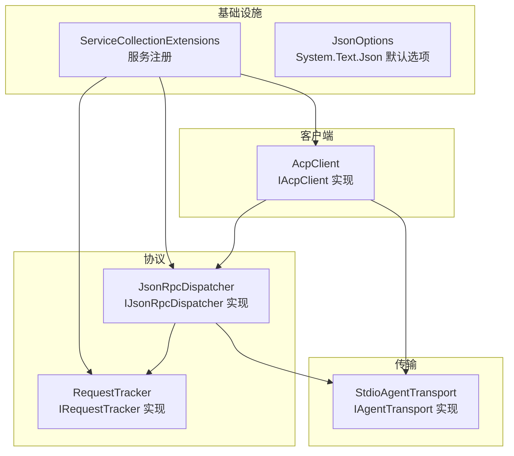
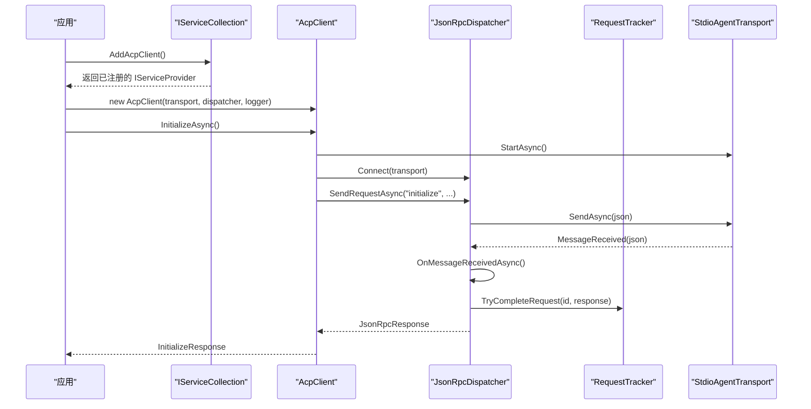
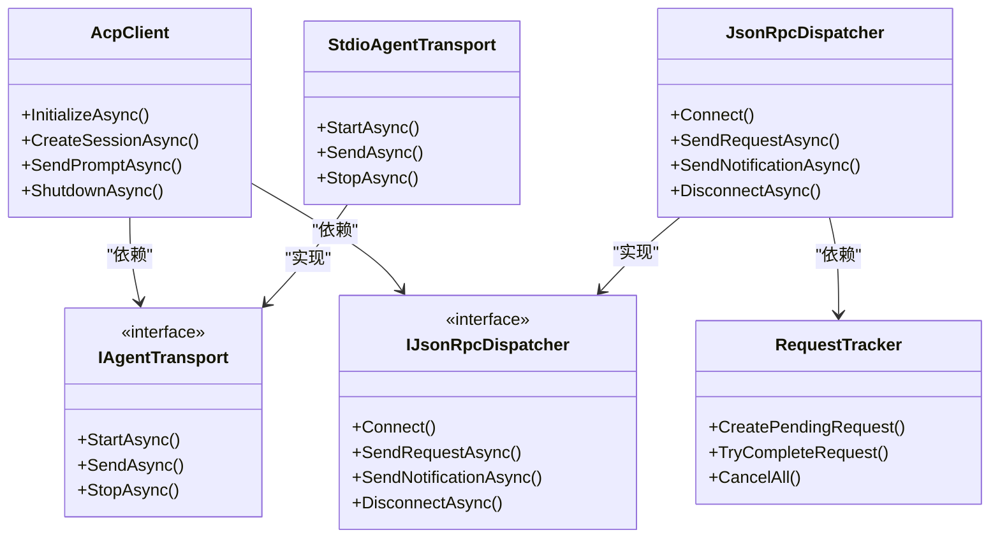

# 基础设施配置

<cite>
**本文引用的文件**   
- [Infrastructure/ServiceCollectionExtensions.cs](file://Infrastructure/ServiceCollectionExtensions.cs)
- [Infrastructure/JsonOptions.cs](file://Infrastructure/JsonOptions.cs)
- [Client/AcpClient.cs](file://Client/AcpClient.cs)
- [Protocol/JsonRpcDispatcher.cs](file://Protocol/JsonRpcDispatcher.cs)
- [Protocol/RequestTracker.cs](file://Protocol/RequestTracker.cs)
- [Transport/StdioAgentTransport.cs](file://Transport/StdioAgentTransport.cs)
- [Agentic.ACPLibrary.csproj](file://Agentic.ACPLibrary.csproj)
- [README.md](file://README.md)
</cite>

## 目录
1. [简介](#简介)
2. [项目结构](#项目结构)
3. [核心组件](#核心组件)
4. [架构总览](#架构总览)
5. [详细组件分析](#详细组件分析)
6. [依赖关系分析](#依赖关系分析)
7. [性能与内存优化](#性能与内存优化)
8. [故障排查指南](#故障排查指南)
9. [结论](#结论)
10. [附录：配置示例与最佳实践](#附录配置示例与最佳实践)

## 简介
本文件聚焦于该库的基础设施配置，重点说明以下内容：
- 依赖注入容器的注册机制与服务生命周期管理（单例、瞬态）
- ServiceCollectionExtensions 提供的扩展方法与使用模式
- System.Text.Json 的序列化选项 JsonOptions 的配置与行为
- 与其他 Microsoft.Extensions.* 库的集成方式（DI、日志）
- 性能调优、内存管理与线程安全注意事项
- 在不同应用场景下的完整配置示例

## 项目结构
该库采用分层组织：
- Infrastructure：基础设施层，提供 DI 扩展与 JSON 序列化默认选项
- Client：客户端实现与契约
- Protocol：JSON-RPC 分发与请求跟踪
- Transport：传输抽象与 stdio 实现
- Models/Enums：协议模型与枚举
- JsonRpc：JSON-RPC 消息类型与转换器



图表来源
- [Infrastructure/ServiceCollectionExtensions.cs:9-22](file://Infrastructure/ServiceCollectionExtensions.cs#L9-L22)
- [Infrastructure/JsonOptions.cs:7-27](file://Infrastructure/JsonOptions.cs#L7-L27)
- [Client/AcpClient.cs:12-45](file://Client/AcpClient.cs#L12-L45)
- [Protocol/JsonRpcDispatcher.cs:9-26](file://Protocol/JsonRpcDispatcher.cs#L9-L26)
- [Protocol/RequestTracker.cs:6-19](file://Protocol/RequestTracker.cs#L6-L19)
- [Transport/StdioAgentTransport.cs:8-28](file://Transport/StdioAgentTransport.cs#L8-L28)

章节来源
- [Agentic.ACPLibrary.csproj:1-34](file://Agentic.ACPLibrary.csproj#L1-L34)
- [README.md:1-99](file://README.md#L1-L99)

## 核心组件
- ServiceCollectionExtensions.AddAcpClient：将 ACP 客户端相关服务注册到 DI 容器，定义各服务的生命周期
- JsonOptions.Default：提供全局共享的 System.Text.Json 序列化选项，包含属性名大小写不敏感、忽略 null、紧凑输出、允许元数据字段乱序等设置，并注册 JSON-RPC 消息转换器与字符串枚举转换器
- AcpClient：ACP 客户端主实现，负责初始化握手、会话管理、事件订阅、处理器注册与 JSON 序列化/反序列化
- JsonRpcDispatcher：JSON-RPC 消息分发器，负责发送请求/通知、处理响应、路由请求与通知到对应处理器
- RequestTracker：并发安全的请求跟踪器，维护待完成请求的 TaskCompletionSource
- StdioAgentTransport：基于子进程标准输入输出的传输实现，负责启动/停止进程、读写消息流

章节来源
- [Infrastructure/ServiceCollectionExtensions.cs:9-22](file://Infrastructure/ServiceCollectionExtensions.cs#L9-L22)
- [Infrastructure/JsonOptions.cs:7-27](file://Infrastructure/JsonOptions.cs#L7-L27)
- [Client/AcpClient.cs:12-45](file://Client/AcpClient.cs#L12-L45)
- [Protocol/JsonRpcDispatcher.cs:9-26](file://Protocol/JsonRpcDispatcher.cs#L9-L26)
- [Protocol/RequestTracker.cs:6-19](file://Protocol/RequestTracker.cs#L6-L19)
- [Transport/StdioAgentTransport.cs:8-28](file://Transport/StdioAgentTransport.cs#L8-L28)

## 架构总览
下图展示了从应用启动到 ACP 通信的关键流程：DI 容器注册服务，AcpClient 通过 JsonRpcDispatcher 与 StdioAgentTransport 进行 JSON-RPC 通信。



图表来源
- [Infrastructure/ServiceCollectionExtensions.cs:14-21](file://Infrastructure/ServiceCollectionExtensions.cs#L14-L21)
- [Client/AcpClient.cs:48-182](file://Client/AcpClient.cs#L48-L182)
- [Protocol/JsonRpcDispatcher.cs:27-47](file://Protocol/JsonRpcDispatcher.cs#L27-L47)
- [Protocol/JsonRpcDispatcher.cs:86-122](file://Protocol/JsonRpcDispatcher.cs#L86-L122)
- [Protocol/RequestTracker.cs:19-30](file://Protocol/RequestTracker.cs#L19-L30)
- [Transport/StdioAgentTransport.cs:30-59](file://Transport/StdioAgentTransport.cs#L30-L59)

## 详细组件分析

### 依赖注入与服务注册（ServiceCollectionExtensions）
- AddAcpClient 扩展方法将以下服务注册到 DI 容器：
  - IJsonRpcDispatcher -> JsonRpcDispatcher（瞬态）
  - IRequestTracker -> RequestTracker（瞬态）
  - AcpClient（单例）
  - IAcpClient 映射到 AcpClient（单例）
- 生命周期策略：
  - 单例：AcpClient 和 IAcpClient，确保整个应用生命周期内唯一实例
  - 瞬态：每次解析时创建新实例，适用于无状态或轻量对象（如分发器、请求跟踪器）
- 使用方式：在应用启动时调用 services.AddAcpClient() 完成注册

章节来源
- [Infrastructure/ServiceCollectionExtensions.cs:14-21](file://Infrastructure/ServiceCollectionExtensions.cs#L14-L21)

### JSON 序列化选项（JsonOptions）
- Default 属性提供线程安全的懒加载 JsonSerializerOptions
- 关键设置：
  - PropertyNameCaseInsensitive = true：属性名大小写不敏感
  - DefaultIgnoreCondition = WhenWritingNull：写入时忽略 null 值
  - WriteIndented = false：紧凑输出，减少网络负载
  - AllowOutOfOrderMetadataProperties = true：允许元数据字段（如多态判别）不在首位置
- 自定义转换器：
  - JsonRpcMessageConverter：根据字段存在性区分请求、通知、响应
  - JsonStringEnumConverter：枚举以字符串形式序列化
- 线程安全：静态字段 _default 通过延迟初始化保证线程安全访问

章节来源
- [Infrastructure/JsonOptions.cs:7-27](file://Infrastructure/JsonOptions.cs#L7-L27)
- [JsonRpc/JsonRpcMessageConverter.cs:9-32](file://JsonRpc/JsonRpcMessageConverter.cs#L9-L32)

### AcpClient 客户端实现
- 构造函数依赖注入：IAgentTransport、IJsonRpcDispatcher、ILogger<AcpClient>
- 初始化流程：
  - 启动传输（StartAsync）
  - 连接分发器（Connect）
  - 订阅进程退出事件
  - 注册 session/update 通知处理器
  - 注册权限、文件系统、终端处理器
  - 发送 initialize 请求并反序列化为 InitializeResponse
- 会话管理：CreateSessionAsync、LoadSessionAsync
- 提示发送：SendPromptAsync，支持流式更新通过 SessionUpdated 事件
- 取消与关闭：CancelSessionAsync、ShutdownAsync、DisposeAsync
- JSON 序列化：广泛使用 JsonOptions.Default 进行序列化/反序列化

章节来源
- [Client/AcpClient.cs:12-45](file://Client/AcpClient.cs#L12-L45)
- [Client/AcpClient.cs:48-182](file://Client/AcpClient.cs#L48-L182)
- [Client/AcpClient.cs:184-216](file://Client/AcpClient.cs#L184-L216)
- [Client/AcpClient.cs:226-240](file://Client/AcpClient.cs#L226-L240)

### JSON-RPC 分发器（JsonRpcDispatcher）
- 职责：
  - 连接传输层并订阅消息接收事件
  - 发送请求与通知（序列化后通过传输发送）
  - 接收消息并根据类型分发到相应处理器
  - 管理请求-响应的匹配与完成
- 并发安全：
  - 使用 ConcurrentDictionary 存储请求与通知处理器
  - 使用 IRequestTracker 管理待完成请求的 TaskCompletionSource
- 错误处理：
  - 未连接时抛出 InvalidOperationException
  - 反序列化失败或处理器异常被捕获并忽略（当前实现）

章节来源
- [Protocol/JsonRpcDispatcher.cs:9-26](file://Protocol/JsonRpcDispatcher.cs#L9-L26)
- [Protocol/JsonRpcDispatcher.cs:27-47](file://Protocol/JsonRpcDispatcher.cs#L27-L47)
- [Protocol/JsonRpcDispatcher.cs:86-122](file://Protocol/JsonRpcDispatcher.cs#L86-L122)

### 请求跟踪器（RequestTracker）
- 使用 ConcurrentDictionary<long, TaskCompletionSource<JsonRpcResponse>> 维护待完成请求
- CreatePendingRequest：生成唯一 ID 并创建 TCS
- TryCompleteRequest：根据响应 ID 完成对应请求，若存在错误则设置异常
- CancelAll：取消所有待完成请求（用于断开连接时的清理）

章节来源
- [Protocol/RequestTracker.cs:6-19](file://Protocol/RequestTracker.cs#L6-L19)
- [Protocol/RequestTracker.cs:19-30](file://Protocol/RequestTracker.cs#L19-L30)
- [Protocol/RequestTracker.cs:32-39](file://Protocol/RequestTracker.cs#L32-L39)

### 传输层（StdioAgentTransport）
- 基于子进程的标准输入输出实现 JSON-RPC 通信
- 生命周期：
  - StartAsync：启动进程，重定向 IO，启动读取循环
  - SendAsync：向标准输入写入 JSON 行
  - StopAsync：优雅停止，超时后强制终止进程树
- 事件：
  - MessageReceived：收到消息时触发
  - TransportFaulted：传输错误时触发
  - ProcessExited：进程退出时触发
- 错误处理：
  - 非运行状态发送消息抛出 InvalidOperationException
  - 读取循环捕获 OperationCanceledException 表示正常关闭

章节来源
- [Transport/StdioAgentTransport.cs:8-28](file://Transport/StdioAgentTransport.cs#L8-L28)
- [Transport/StdioAgentTransport.cs:30-59](file://Transport/StdioAgentTransport.cs#L30-L59)
- [Transport/StdioAgentTransport.cs:61-68](file://Transport/StdioAgentTransport.cs#L61-L68)
- [Transport/StdioAgentTransport.cs:70-93](file://Transport/StdioAgentTransport.cs#L70-L93)
- [Transport/StdioAgentTransport.cs:95-118](file://Transport/StdioAgentTransport.cs#L95-L118)

## 依赖关系分析
- AcpClient 依赖 IAgentTransport 和 IJsonRpcDispatcher
- JsonRpcDispatcher 依赖 IRequestTracker 和 IAgentTransport
- RequestTracker 是内部实现，无外部依赖
- StdioAgentTransport 依赖 .NET 进程 API 和 IO 流
- 所有组件通过 System.Text.Json 进行序列化/反序列化，使用 JsonOptions.Default



图表来源
- [Client/AcpClient.cs:12-45](file://Client/AcpClient.cs#L12-L45)
- [Protocol/IJsonRpcDispatcher.cs:5-13](file://Protocol/IJsonRpcDispatcher.cs#L5-L13)
- [Protocol/JsonRpcDispatcher.cs:9-26](file://Protocol/JsonRpcDispatcher.cs#L9-L26)
- [Protocol/RequestTracker.cs:6-19](file://Protocol/RequestTracker.cs#L6-L19)
- [Transport/IAgentTransport.cs:6-28](file://Transport/IAgentTransport.cs#L6-L28)
- [Transport/StdioAgentTransport.cs:8-28](file://Transport/StdioAgentTransport.cs#L8-L28)

章节来源
- [Agentic.ACPLibrary.csproj:22-26](file://Agentic.ACPLibrary.csproj#L22-L26)

## 性能与内存优化
- 序列化性能：
  - 使用 JsonOptions.Default 避免重复创建 JsonSerializerOptions
  - 启用 AllowOutOfOrderMetadataProperties 提升反序列化灵活性
  - 使用 JsonStringEnumConverter 避免枚举整型转换开销
- 内存管理：
  - AcpClient 实现 IAsyncDisposable，确保资源释放
  - StdioAgentTransport 在 StopAsync 中正确关闭进程和流
  - RequestTracker.CancelAll 清理待完成请求，防止内存泄漏
- 线程安全：
  - JsonOptions.Default 使用静态懒加载，线程安全
  - JsonRpcDispatcher 使用 ConcurrentDictionary 存储处理器
  - RequestTracker 使用 Interlocked 操作和并发集合
- 网络与 IO：
  - StdioAgentTransport 使用异步 IO 读取标准输出和错误流
  - 合理设置编码为 UTF8，避免字符集问题
- 建议：
  - 在高并发场景下考虑缓存频繁使用的对象
  - 监控进程退出和资源释放情况
  - 调整日志级别以减少 I/O 开销

章节来源
- [Infrastructure/JsonOptions.cs:9-27](file://Infrastructure/JsonOptions.cs#L9-L27)
- [Protocol/JsonRpcDispatcher.cs:12-14](file://Protocol/JsonRpcDispatcher.cs#L12-L14)
- [Protocol/RequestTracker.cs:8-16](file://Protocol/RequestTracker.cs#L8-L16)
- [Transport/StdioAgentTransport.cs:95-118](file://Transport/StdioAgentTransport.cs#L95-L118)

## 故障排查指南
- 常见问题：
  - 传输未连接：JsonRpcDispatcher.SendRequestAsync 抛出 InvalidOperationException
  - 进程未启动：StdioAgentTransport.SendAsync 检查状态并抛出异常
  - 反序列化失败：OnMessageReceivedAsync 捕获异常并忽略
  - 处理器未注册：请求无法找到对应处理器
- 调试建议：
  - 启用详细日志记录（Microsoft.Extensions.Logging）
  - 检查进程是否正确启动和退出
  - 验证 JSON 格式是否符合 JSON-RPC 规范
  - 确认处理器注册顺序和命名空间
- 错误处理：
  - JsonRpcException 封装 JSON-RPC 错误码和消息
  - TransportFaulted 事件报告传输层错误
  - AgentProcessExited 事件处理进程退出

章节来源
- [Protocol/JsonRpcDispatcher.cs:27-31](file://Protocol/JsonRpcDispatcher.cs#L27-L31)
- [Transport/StdioAgentTransport.cs:61-68](file://Transport/StdioAgentTransport.cs#L61-L68)
- [Protocol/JsonRpcDispatcher.cs:118-122](file://Protocol/JsonRpcDispatcher.cs#L118-L122)
- [Protocol/RequestTracker.cs:43-51](file://Protocol/RequestTracker.cs#L43-L51)

## 结论
该库提供了完整的 ACP 客户端基础设施，包括依赖注入配置、JSON 序列化选项、JSON-RPC 通信和传输层实现。通过 ServiceCollectionExtensions 简化了服务注册，JsonOptions 提供了优化的序列化配置，各组件之间松耦合且线程安全。在实际应用中，建议根据具体需求调整日志级别、处理器实现和性能参数。

## 附录：配置示例与最佳实践

### 基础配置示例
```csharp
// 1. 创建服务集合并注册 ACP 客户端
var services = new ServiceCollection();
services.AddAcpClient();

// 2. 构建服务提供者
var serviceProvider = services.BuildServiceProvider();

// 3. 获取 AcpClient 实例
var client = serviceProvider.GetRequiredService<IAcpClient>();

// 4. 配置处理器
client.PermissionHandler = myPermissionHandler;
client.FileSystemHandler = myFileSystemHandler;
client.TerminalHandler = myTerminalHandler;

// 5. 初始化客户端
await client.InitializeAsync();

// 6. 创建会话并发送提示
var sessionId = await client.CreateSessionAsync(".");
var response = await client.SendPromptAsync(sessionId, prompt);
```

### 高级配置选项
- 自定义日志记录器：
  - 通过 ILoggerFactory 创建特定类型的日志记录器
  - 调整日志级别以平衡性能与可观测性
- 自定义传输实现：
  - 实现 IAgentTransport 接口以支持其他通信方式
  - 处理连接重试和错误恢复逻辑
- 扩展 JSON 序列化：
  - 在 JsonOptions.Default 中添加自定义转换器
  - 配置命名策略和忽略规则

### 性能调优建议
- 使用单例模式重用 AcpClient 实例
- 批量处理消息以减少序列化开销
- 合理设置超时和取消令牌
- 监控内存使用和 GC 压力

### 线程安全注意事项
- 避免在多个线程中同时修改处理器集合
- 使用 CancellationToken 正确处理取消操作
- 注意异步操作的异常传播

章节来源
- [Infrastructure/ServiceCollectionExtensions.cs:14-21](file://Infrastructure/ServiceCollectionExtensions.cs#L14-L21)
- [Client/AcpClient.cs:48-182](file://Client/AcpClient.cs#L48-L182)
- [Infrastructure/JsonOptions.cs:15-25](file://Infrastructure/JsonOptions.cs#L15-L25)