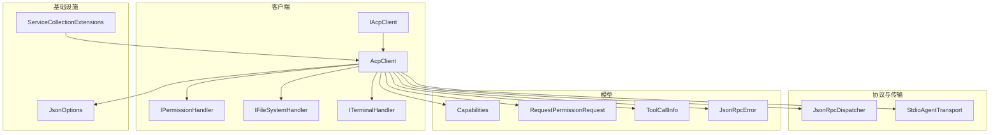
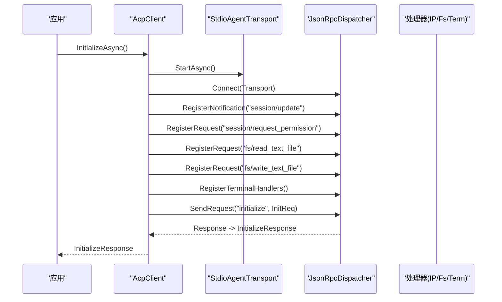
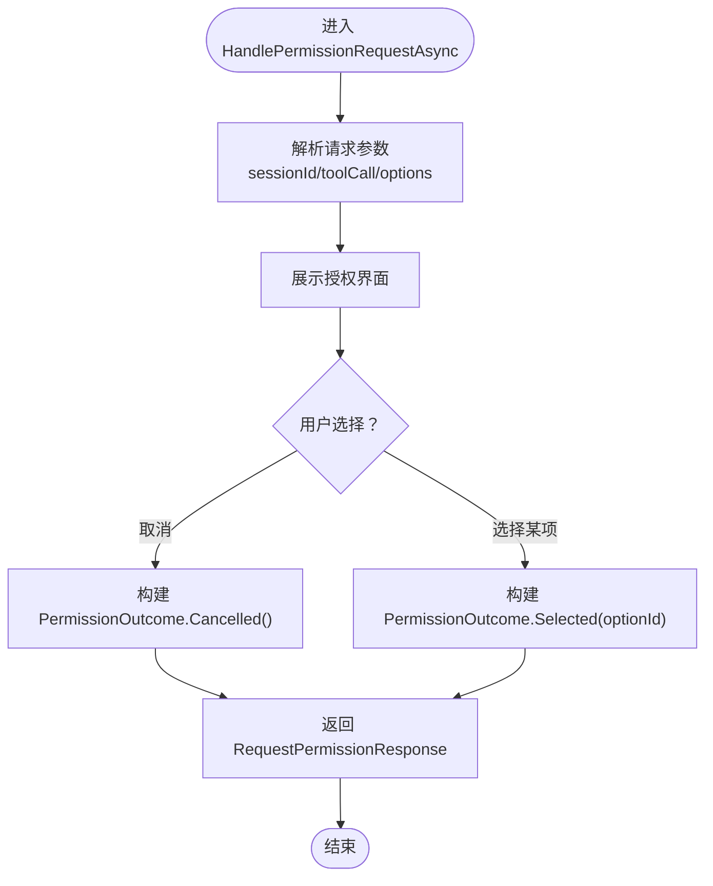
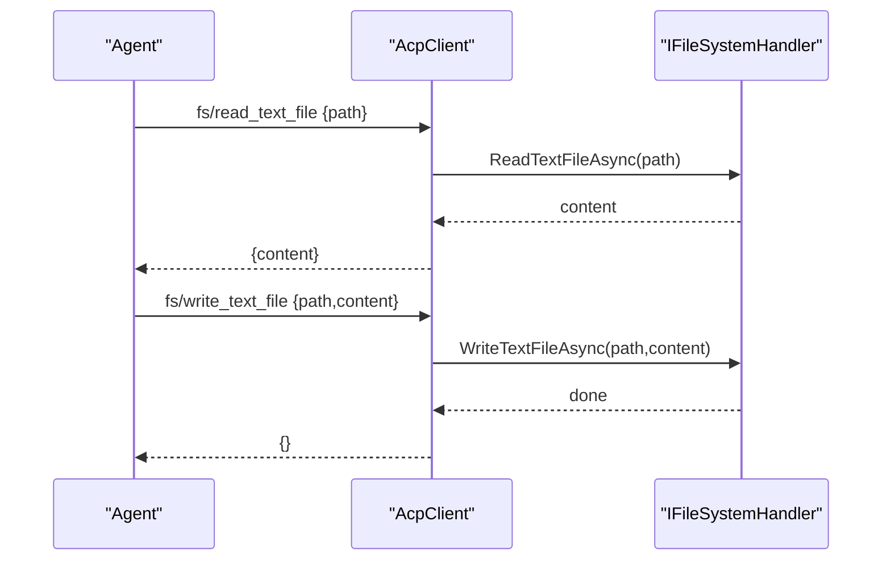
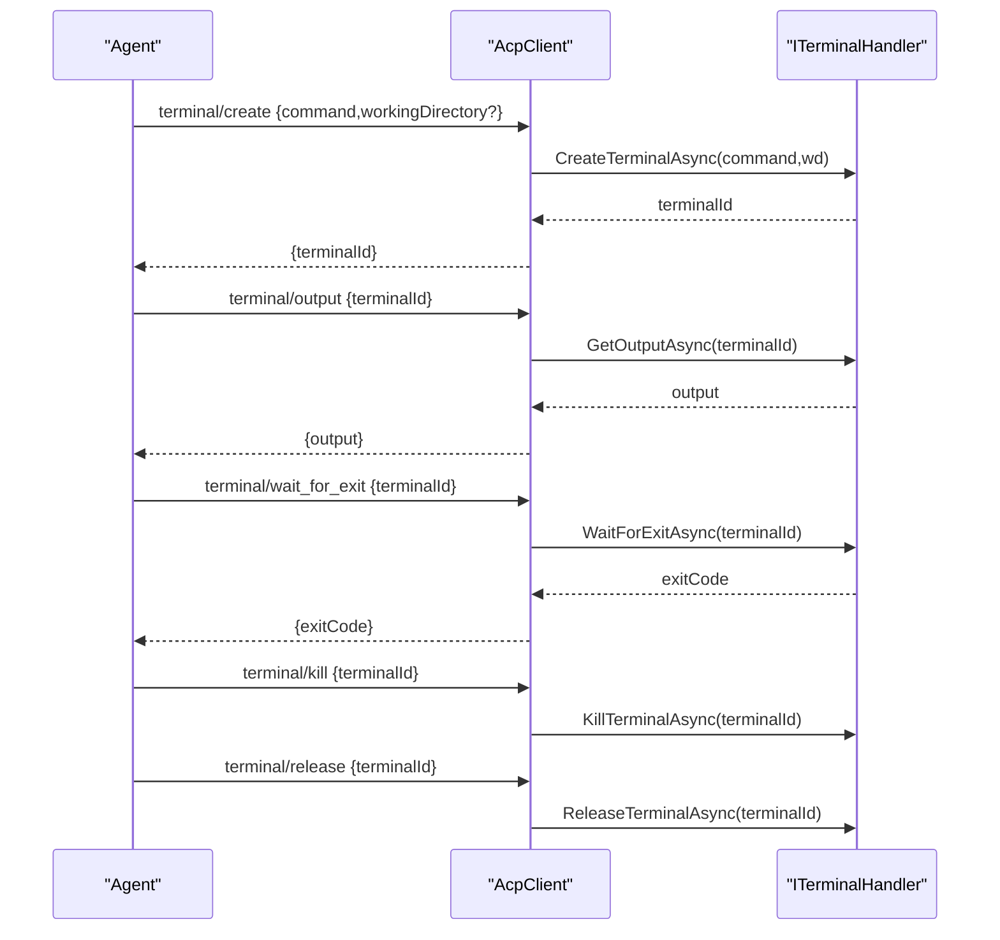
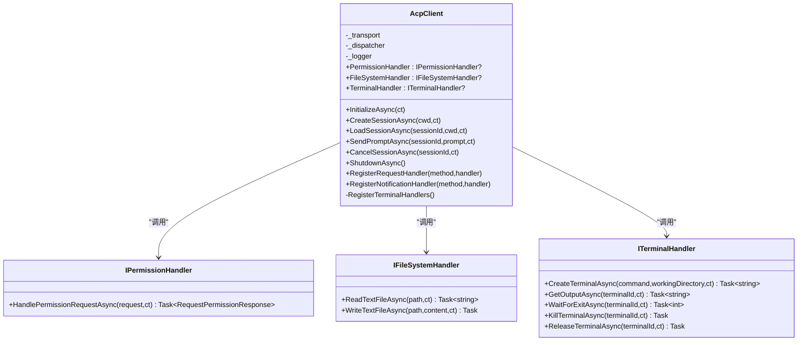
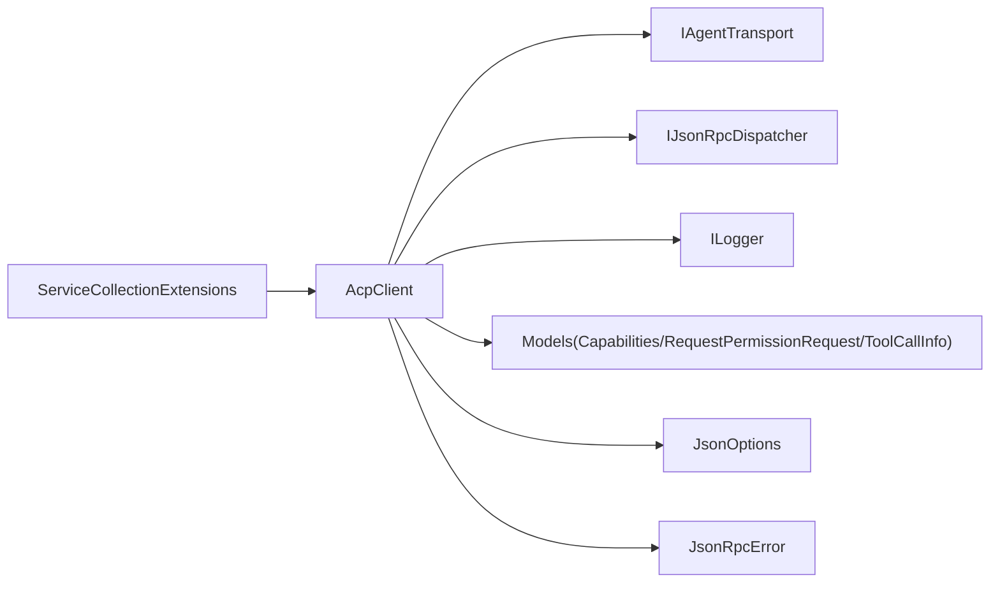

# 处理器扩展

<cite>
**本文引用的文件**   
- [AcpClient.cs](file://Client/AcpClient.cs)
- [IAcpClient.cs](file://Client/IAcpClient.cs)
- [IPermissionHandler.cs](file://Client/IPermissionHandler.cs)
- [IFileSystemHandler.cs](file://Client/IFileSystemHandler.cs)
- [ITerminalHandler.cs](file://Client/ITerminalHandler.cs)
- [RequestPermissionRequest.cs](file://Models/RequestPermissionRequest.cs)
- [ToolCall.cs](file://Models/ToolCall.cs)
- [Capabilities.cs](file://Models/Capabilities.cs)
- [JsonOptions.cs](file://Infrastructure/JsonOptions.cs)
- [ServiceCollectionExtensions.cs](file://Infrastructure/ServiceCollectionExtensions.cs)
- [JsonRpcError.cs](file://JsonRpc/JsonRpcError.cs)
- [README.md](file://README.md)
</cite>

## 目录
1. [简介](#简介)
2. [项目结构](#项目结构)
3. [核心组件](#核心组件)
4. [架构总览](#架构总览)
5. [详细组件分析](#详细组件分析)
6. [依赖关系分析](#依赖关系分析)
7. [性能考虑](#性能考虑)
8. [故障排查指南](#故障排查指南)
9. [结论](#结论)
10. [附录：自定义处理器开发指南与最佳实践](#附录自定义处理器开发指南与最佳实践)

## 简介
本库提供 .NET 的 Agent Client Protocol（ACP）客户端实现，通过标准输入输出通道与 ACP 兼容的 Agent 进程通信，使用 JSON-RPC 进行请求/响应和通知。为了支持 UI 层对权限、文件系统与终端操作的实现，系统定义了三个可扩展处理器接口：IPermissionHandler、IFileSystemHandler、ITerminalHandler。这些接口由宿主应用（通常是 UI 层）实现，并在初始化时注入到 AcpClient 中，由客户端在收到 Agent 的请求时分发处理。

## 项目结构
- Client：客户端核心与处理器接口定义
- Infrastructure：JSON 序列化选项与 DI 注册扩展
- JsonRpc：JSON-RPC 消息模型与转换器
- Models：协议数据模型（能力、会话、工具调用、权限等）
- Protocol：JSON-RPC 分发器与请求跟踪
- Transport：传输抽象与 stdio 实现

图表来源
- [AcpClient.cs:1-361](file://Client/AcpClient.cs#L1-L361)
- [IAcpClient.cs:1-59](file://Client/IAcpClient.cs#L1-L59)
- [IPermissionHandler.cs:1-17](file://Client/IPermissionHandler.cs#L1-L17)
- [IFileSystemHandler.cs:1-14](file://Client/IFileSystemHandler.cs#L1-L14)
- [ITerminalHandler.cs:1-23](file://Client/ITerminalHandler.cs#L1-L23)
- [JsonOptions.cs:1-28](file://Infrastructure/JsonOptions.cs#L1-L28)
- [ServiceCollectionExtensions.cs:1-23](file://Infrastructure/ServiceCollectionExtensions.cs#L1-L23)
- [Capabilities.cs:1-65](file://Models/Capabilities.cs#L1-L65)
- [RequestPermissionRequest.cs:1-47](file://Models/RequestPermissionRequest.cs#L1-L47)
- [ToolCall.cs:1-22](file://Models/ToolCall.cs#L1-L22)
- [JsonRpcError.cs:1-19](file://JsonRpc/JsonRpcError.cs#L1-L19)

章节来源
- [README.md:1-99](file://README.md#L1-L99)

## 核心组件
- IAcpClient：客户端契约，暴露会话生命周期、事件、以及处理器注入点
- AcpClient：默认实现，负责启动传输、建立连接、注册内置处理器、转发请求到具体处理器
- IPermissionHandler：处理 session/request_permission，阻塞等待用户选择并返回结果
- IFileSystemHandler：处理 fs/read_text_file 与 fs/write_text_file
- ITerminalHandler：处理 terminal/create、terminal/output、terminal/wait_for_exit、terminal/kill、terminal/release

章节来源
- [IAcpClient.cs:1-59](file://Client/IAcpClient.cs#L1-L59)
- [AcpClient.cs:1-361](file://Client/AcpClient.cs#L1-L361)
- [IPermissionHandler.cs:1-17](file://Client/IPermissionHandler.cs#L1-L17)
- [IFileSystemHandler.cs:1-14](file://Client/IFileSystemHandler.cs#L1-L14)
- [ITerminalHandler.cs:1-23](file://Client/ITerminalHandler.cs#L1-L23)

## 架构总览
AcpClient 在 InitializeAsync 中完成以下关键步骤：
- 启动传输并与 JSON-RPC 分发器连接
- 订阅进程退出事件与 session/update 通知
- 注册内置请求处理器：session/request_permission、fs/*、terminal/*
- 发送 initialize 握手并解析 Agent 信息
- 检查协议版本兼容性

图表来源
- [AcpClient.cs:47-182](file://Client/AcpClient.cs#L47-L182)

章节来源
- [AcpClient.cs:47-182](file://Client/AcpClient.cs#L47-L182)

## 详细组件分析

### IPermissionHandler 权限处理器
- 职责：接收来自 Agent 的权限请求，阻塞直到用户做出选择，返回包含 Outcome 的响应
- 方法签名要点：HandlePermissionRequestAsync(RequestPermissionRequest, CancellationToken) -> Task<RequestPermissionResponse>
- 典型流程：
  - 解析 RequestPermissionRequest（包含 sessionId、toolCall、options）
  - 展示 UI 让用户选择某个 optionId 或取消
  - 构造 PermissionOutcome（cancelled 或 selected(optionId)）
  - 返回 RequestPermissionResponse

图表来源
- [IPermissionHandler.cs:1-17](file://Client/IPermissionHandler.cs#L1-L17)
- [RequestPermissionRequest.cs:1-47](file://Models/RequestPermissionRequest.cs#L1-L47)
- [ToolCall.cs:1-22](file://Models/ToolCall.cs#L1-L22)

章节来源
- [IPermissionHandler.cs:1-17](file://Client/IPermissionHandler.cs#L1-L17)
- [RequestPermissionRequest.cs:1-47](file://Models/RequestPermissionRequest.cs#L1-L47)
- [ToolCall.cs:1-22](file://Models/ToolCall.cs#L1-L22)

### IFileSystemHandler 文件系统处理器
- 职责：处理文本文件的读取与写入
- 方法签名要点：
  - ReadTextFileAsync(path, ct) -> Task<string>
  - WriteTextFileAsync(path, content, ct) -> Task
- 错误处理建议：路径不存在、无权限、编码问题等应抛出异常，由上层统一捕获并转换为 JSON-RPC 错误

图表来源
- [IFileSystemHandler.cs:1-14](file://Client/IFileSystemHandler.cs#L1-L14)
- [AcpClient.cs:101-144](file://Client/AcpClient.cs#L101-L144)

章节来源
- [IFileSystemHandler.cs:1-14](file://Client/IFileSystemHandler.cs#L1-L14)
- [AcpClient.cs:101-144](file://Client/AcpClient.cs#L101-L144)

### ITerminalHandler 终端处理器
- 职责：管理终端进程的生命周期与输出流
- 方法签名要点：
  - CreateTerminalAsync(command, workingDirectory?, ct) -> Task<string>（返回 terminalId）
  - GetOutputAsync(terminalId, ct) -> Task<string>
  - WaitForExitAsync(terminalId, ct) -> Task<int>（返回退出码）
  - KillTerminalAsync(terminalId, ct) -> Task
  - ReleaseTerminalAsync(terminalId, ct) -> Task
- 典型流程：创建子进程、维护 stdout/stderr 输出缓冲、轮询或异步读取、等待退出、清理资源

图表来源
- [ITerminalHandler.cs:1-23](file://Client/ITerminalHandler.cs#L1-L23)
- [AcpClient.cs:250-359](file://Client/AcpClient.cs#L250-L359)

章节来源
- [ITerminalHandler.cs:1-23](file://Client/ITerminalHandler.cs#L1-L23)
- [AcpClient.cs:250-359](file://Client/AcpClient.cs#L250-L359)

### AcpClient 内置处理器注册与分发
- 权限请求：当未设置 PermissionHandler 时，直接返回 Cancelled 结果；否则调用处理器并序列化结果
- 文件系统：当未设置 FileSystemHandler 时，返回“文件系统不可用”的错误；否则调用处理器并返回内容
- 终端：当未设置 TerminalHandler 时，返回“终端处理器不可用”的错误；否则调用处理器并返回相应结果
- 错误对象：使用 JsonRpcError，包含 code、message、可选 data

图表来源
- [AcpClient.cs:1-361](file://Client/AcpClient.cs#L1-L361)
- [IPermissionHandler.cs:1-17](file://Client/IPermissionHandler.cs#L1-L17)
- [IFileSystemHandler.cs:1-14](file://Client/IFileSystemHandler.cs#L1-L14)
- [ITerminalHandler.cs:1-23](file://Client/ITerminalHandler.cs#L1-L23)

章节来源
- [AcpClient.cs:74-144](file://Client/AcpClient.cs#L74-L144)
- [AcpClient.cs:250-359](file://Client/AcpClient.cs#L250-L359)
- [JsonRpcError.cs:1-19](file://JsonRpc/JsonRpcError.cs#L1-L19)

## 依赖关系分析
- AcpClient 依赖：
  - IAgentTransport：用于启动/停止与 Agent 进程的通信
  - IJsonRpcDispatcher：用于注册/分发 JSON-RPC 方法与通知
  - ILogger：用于记录初始化、会话、错误等信息
- 模型依赖：
  - Capabilities：声明客户端能力（fs、terminal）
  - RequestPermissionRequest / PermissionOutcome：权限请求与结果
  - ToolCallInfo：工具调用上下文
  - JsonRpcError：错误对象
- 基础设施：
  - JsonOptions：全局 JSON 序列化配置（大小写不敏感、忽略 null、枚举字符串化、消息转换器）
  - ServiceCollectionExtensions：将 AcpClient、JsonRpcDispatcher、RequestTracker 注册到 DI

图表来源
- [AcpClient.cs:1-361](file://Client/AcpClient.cs#L1-L361)
- [JsonOptions.cs:1-28](file://Infrastructure/JsonOptions.cs#L1-L28)
- [ServiceCollectionExtensions.cs:1-23](file://Infrastructure/ServiceCollectionExtensions.cs#L1-L23)
- [Capabilities.cs:1-65](file://Models/Capabilities.cs#L1-L65)
- [RequestPermissionRequest.cs:1-47](file://Models/RequestPermissionRequest.cs#L1-L47)
- [ToolCall.cs:1-22](file://Models/ToolCall.cs#L1-L22)
- [JsonRpcError.cs:1-19](file://JsonRpc/JsonRpcError.cs#L1-L19)

章节来源
- [ServiceCollectionExtensions.cs:1-23](file://Infrastructure/ServiceCollectionExtensions.cs#L1-L23)
- [JsonOptions.cs:1-28](file://Infrastructure/JsonOptions.cs#L1-L28)

## 性能考虑
- 异步与取消：所有处理器方法均支持 CancellationToken，避免长时间阻塞导致线程饥饿
- 日志级别：初始化、会话创建、错误等使用不同日志级别，便于定位问题
- JSON 序列化：使用统一的 JsonOptions，减少重复配置开销
- 资源释放：终端处理器需确保 ReleaseTerminalAsync 被调用，避免进程泄漏
- 并发安全：处理器内部应避免共享可变状态，必要时加锁或使用线程安全数据结构

[本节为通用指导，不直接分析具体文件]

## 故障排查指南
- 权限请求未处理：若未设置 PermissionHandler，AcpClient 会返回 Cancelled 结果。检查是否在 InitializeAsync 前赋值了 PermissionHandler
- 文件系统不可用：若未设置 FileSystemHandler，AcpClient 返回“文件系统不可用”的错误。检查是否赋值了 FileSystemHandler
- 终端处理器不可用：若未设置 TerminalHandler，AcpClient 返回“终端处理器不可用”的错误。检查是否赋值了 TerminalHandler
- 协议版本不匹配：Initialize 后检查 AgentInfo.ProtocolVersion，若不等于 1 会记录警告
- 进程退出：订阅 AgentProcessExited 事件以获取退出码并做清理

章节来源
- [AcpClient.cs:74-144](file://Client/AcpClient.cs#L74-L144)
- [AcpClient.cs:250-359](file://Client/AcpClient.cs#L250-L359)
- [AcpClient.cs:175-182](file://Client/AcpClient.cs#L175-L182)

## 结论
该处理器扩展系统通过三个清晰的接口解耦了 UI 层与 ACP 客户端的核心逻辑，使权限、文件系统和终端操作可插拔且易于测试。AcpClient 负责协议细节与分发，处理器专注于领域行为。结合 DI 与 JSON 配置，整体架构简洁、可扩展、易维护。

[本节为总结性内容，不直接分析具体文件]

## 附录：自定义处理器开发指南与最佳实践

### 处理器注册机制
- 内置处理器：AcpClient 在 InitializeAsync 中自动注册 session/request_permission、fs/*、terminal/* 处理器
- 自定义处理器：通过 RegisterRequestHandler 与 RegisterNotificationHandler 注册自定义方法

章节来源
- [AcpClient.cs:243-248](file://Client/AcpClient.cs#L243-L248)
- [README.md:53-70](file://README.md#L53-L70)

### 错误处理与日志记录
- 错误对象：使用 JsonRpcError，包含 code、message、data
- 日志：AcpClient 使用 ILogger 记录初始化、会话、错误、进程退出等
- 建议：处理器内部捕获异常并转换为合适的 JSON-RPC 错误

章节来源
- [JsonRpcError.cs:1-19](file://JsonRpc/JsonRpcError.cs#L1-L19)
- [AcpClient.cs:50-61](file://Client/AcpClient.cs#L50-L61)

### 安全考虑
- 权限最小化：仅在必要时请求权限，明确说明用途
- 路径白名单：文件系统处理器限制允许的路径范围，防止越权访问
- 命令过滤：终端处理器校验 command 与 workingDirectory，避免执行恶意命令
- 超时与取消：所有异步操作支持取消令牌，防止长时间挂起

[本节为通用指导，不直接分析具体文件]

### 性能优化
- 批量操作：文件系统读写尽量合并，减少 I/O 次数
- 输出缓冲：终端输出采用增量读取与缓冲，避免频繁分配
- 缓存：对只读文件内容做短期缓存，注意失效策略
- 线程池：避免在 UI 线程执行耗时操作，使用后台线程或异步 IO

[本节为通用指导，不直接分析具体文件]

### 常见问题解决方案
- 未设置处理器导致功能不可用：确保在 InitializeAsync 前赋值对应处理器
- 权限请求无响应：确认 HandlePermissionRequestAsync 正确返回 Outcome
- 终端进程泄漏：确保调用 ReleaseTerminalAsync 或在异常路径中释放
- JSON 字段不匹配：检查 JsonOptions 配置与模型属性命名

章节来源
- [AcpClient.cs:74-144](file://Client/AcpClient.cs#L74-L144)
- [AcpClient.cs:250-359](file://Client/AcpClient.cs#L250-L359)
- [JsonOptions.cs:1-28](file://Infrastructure/JsonOptions.cs#L1-L28)