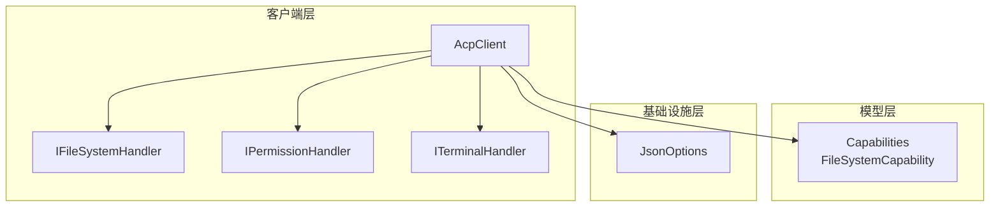
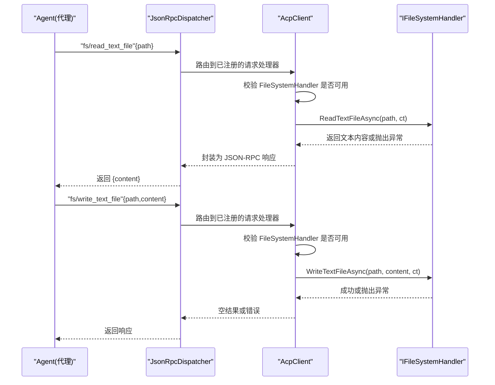
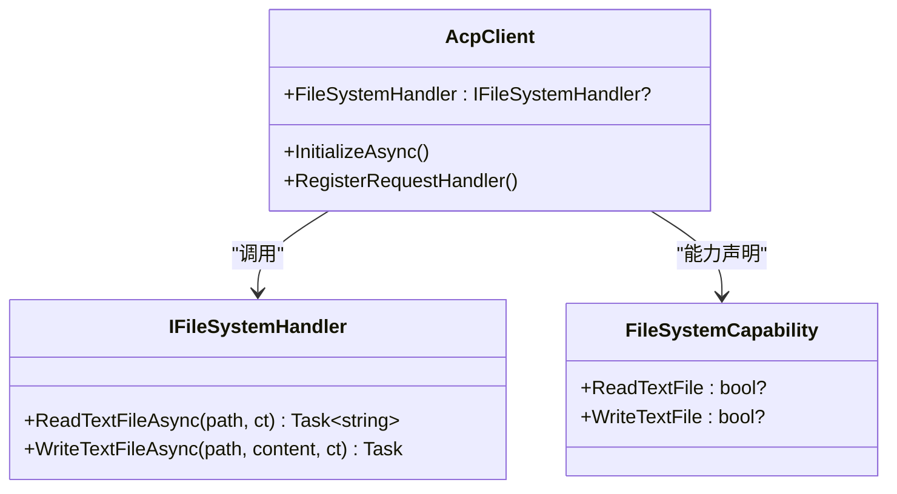
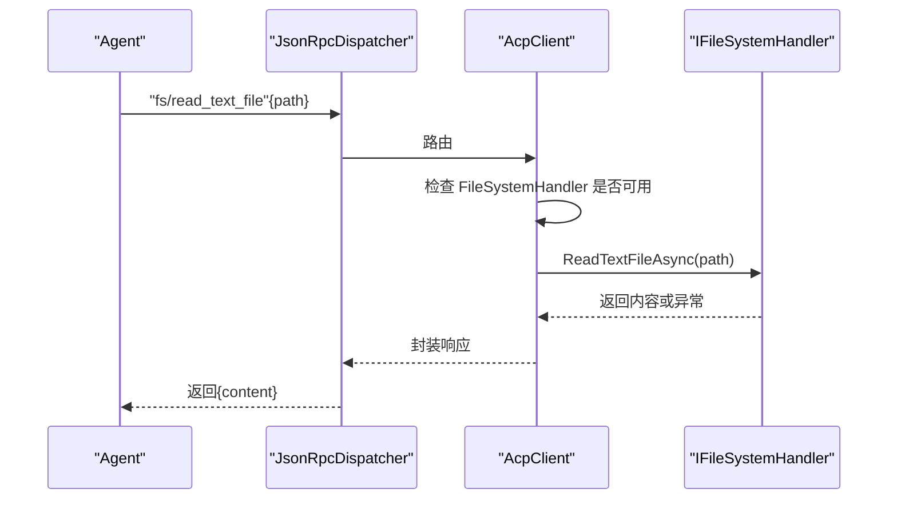
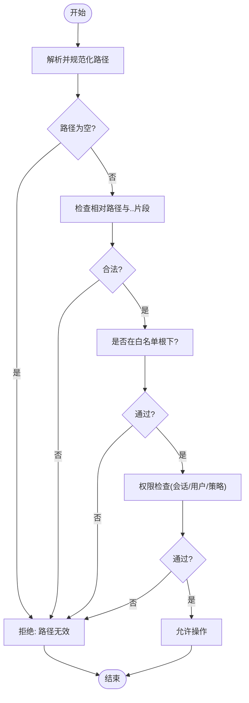
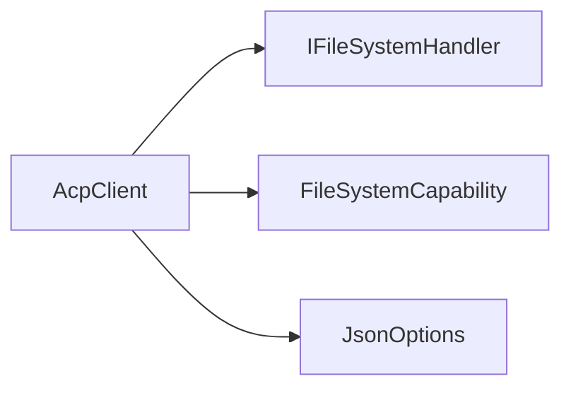

# 文件系统处理器

<cite>
**本文引用的文件**   
- [Client/IFileSystemHandler.cs](file://Client/IFileSystemHandler.cs)
- [Client/AcpClient.cs](file://Client/AcpClient.cs)
- [Models/Capabilities.cs](file://Models/Capabilities.cs)
- [Infrastructure/JsonOptions.cs](file://Infrastructure/JsonOptions.cs)
- [README.md](file://README.md)
</cite>

## 目录
1. [简介](#简介)
2. [项目结构](#项目结构)
3. [核心组件](#核心组件)
4. [架构总览](#架构总览)
5. [详细组件分析](#详细组件分析)
6. [依赖关系分析](#依赖关系分析)
7. [性能考量](#性能考量)
8. [故障排查指南](#故障排查指南)
9. [结论](#结论)
10. [附录](#附录)

## 简介
本文件围绕 IFileSystemHandler 接口及其在 ACP 客户端中的集成，系统化阐述文件系统处理器的设计理念、安全机制与实现要求。文档覆盖读取、写入等操作的契约、路径验证、权限检查、异常处理、生命周期管理、资源清理、错误恢复、并发控制、大文件处理策略，以及自定义存储后端与云存储集成的指导。读者可据此构建安全、健壮且可扩展的文件系统处理器。

## 项目结构
该库采用分层与按职责划分的设计：
- Client 层：定义并暴露处理器接口（IFileSystemHandler、IPermissionHandler、ITerminalHandler），并由 AcpClient 统一注册与调度。
- Models 层：协议能力声明与数据模型（如 FileSystemCapability）。
- Infrastructure 层：JSON 序列化选项与扩展。
- Transport/Protocol/JsonRpc：传输与 JSON-RPC 分发基础设施。

图表来源
- [Client/AcpClient.cs:102-144](file://Client/AcpClient.cs#L102-L144)
- [Models/Capabilities.cs:16-25](file://Models/Capabilities.cs#L16-L25)
- [Infrastructure/JsonOptions.cs:1-28](file://Infrastructure/JsonOptions.cs#L1-L28)

章节来源
- [README.md:35-51](file://README.md#L35-L51)
- [Client/AcpClient.cs:102-144](file://Client/AcpClient.cs#L102-L144)
- [Models/Capabilities.cs:16-25](file://Models/Capabilities.cs#L16-L25)

## 核心组件
- IFileSystemHandler：定义代理发起的 fs/read_text_file 与 fs/write_text_file 的抽象契约，仅包含两个异步方法，强调最小化接口与高内聚。
- AcpClient：负责 JSON-RPC 请求分发，将 “fs/*” 方法路由到 IFileSystemHandler；同时声明客户端能力（ReadTextFile、WriteTextFile）并在握手时上报。
- FileSystemCapability：描述客户端对文件系统能力的支持位，用于协商。

章节来源
- [Client/IFileSystemHandler.cs:1-14](file://Client/IFileSystemHandler.cs#L1-L14)
- [Client/AcpClient.cs:102-144](file://Client/AcpClient.cs#L102-L144)
- [Models/Capabilities.cs:16-25](file://Models/Capabilities.cs#L16-L25)

## 架构总览
下图展示了从代理发起文件操作到处理器实现的端到端流程，包括参数解析、能力检查、处理器调用与结果返回。

图表来源
- [Client/AcpClient.cs:102-144](file://Client/AcpClient.cs#L102-L144)

章节来源
- [Client/AcpClient.cs:102-144](file://Client/AcpClient.cs#L102-L144)

## 详细组件分析

### IFileSystemHandler 接口设计
- 目标：以最小接口承载“读取文本文件”和“写入文本文件”两大能力，避免过度设计，便于替换与测试。
- 参数与返回值：
  - path：字符串路径，由调用方提供，需在实现侧进行严格校验。
  - content：写入时的文本内容。
  - 返回值：读取返回字符串；写入无返回值（Task）。
- 取消令牌：支持 CancellationToken，确保长时间 IO 的可取消性。
- 异常约定：实现应遵循 .NET 标准异常语义（如路径非法、权限不足、磁盘不可用等），由上层统一捕获并转换为 JSON-RPC 错误。

章节来源
- [Client/IFileSystemHandler.cs:1-14](file://Client/IFileSystemHandler.cs#L1-L14)

### AcpClient 中的文件系统路由与能力协商
- 能力声明：在初始化阶段通过 FileSystemCapability 声明 ReadTextFile 与 WriteTextFile 能力。
- 请求路由：
  - fs/read_text_file：解析 path，调用 ReadTextFileAsync，返回 {content}。
  - fs/write_text_file：解析 path 与 content，调用 WriteTextFileAsync，返回空对象。
- 可用性检查：若未设置 FileSystemHandler，则返回“文件系统不可用”的错误码。
- 序列化：使用统一的 JsonOptions 配置，保证大小写不敏感、忽略 null 字段等一致性行为。

章节来源
- [Client/AcpClient.cs:152-166](file://Client/AcpClient.cs#L152-L166)
- [Client/AcpClient.cs:102-144](file://Client/AcpClient.cs#L102-L144)
- [Infrastructure/JsonOptions.cs:1-28](file://Infrastructure/JsonOptions.cs#L1-L28)

### 安全机制与实现要求
- 路径验证：
  - 拒绝空路径、相对路径、包含 .. 的路径片段。
  - 规范化路径后，限制其落在允许的根目录下（白名单目录）。
  - 过滤危险字符与特殊设备名（如 Windows 的 CON、NUL 等）。
- 权限检查：
  - 基于会话上下文与用户角色进行授权决策。
  - 结合 IPermissionHandler 的交互流程，必要时弹出确认对话框。
- 输入校验：
  - 限制 content 长度与编码（UTF-8），防止超大负载与注入攻击。
  - 对 path 进行类型与格式校验，失败即快速失败。
- 异常处理：
  - 区分可恢复错误（如临时 IO 错误）与不可恢复错误（如权限不足）。
  - 记录结构化日志，避免泄露敏感信息。
  - 将底层异常映射为 JSON-RPC 错误响应。

章节来源
- [Client/AcpClient.cs:102-144](file://Client/AcpClient.cs#L102-L144)
- [Infrastructure/JsonOptions.cs:1-28](file://Infrastructure/JsonOptions.cs#L1-L28)

### 完整实现示例（步骤式说明）
以下为安全实现 IFileSystemHandler 的步骤指引（不包含具体代码）：
- 路径白名单与规范化
  - 维护允许访问的根目录集合。
  - 规范化 path 并校验其位于任一白名单根下。
  - 拒绝包含 .. 或绝对路径越界的情况。
- 权限与上下文
  - 根据当前会话 ID 与用户身份决定读写权限。
  - 如需用户确认，委托给 IPermissionHandler 进行交互。
- 读取流程
  - 校验 path，打开只读流，读取至内存或流式缓冲。
  - 限制最大读取大小，超时与取消令牌传播。
  - 返回文本内容或抛出标准化异常。
- 写入流程
  - 校验 path，确保父目录存在且可写。
  - 限制写入大小与速率，避免阻塞与 OOM。
  - 原子写入策略：先写临时文件，再原子重命名。
  - 成功后释放所有句柄，确保无资源泄漏。
- 错误恢复
  - 重试策略：针对瞬时错误（网络盘抖动、锁冲突）进行有限次重试。
  - 回滚策略：写入失败时删除临时文件，保持文件系统一致性。
- 并发控制
  - 同一文件的并发写入加锁，避免竞态。
  - 读多写少场景下可使用读锁共享。
- 大文件处理
  - 读取：分块读取，避免一次性加载到内存。
  - 写入：流式写入，限制单次写入大小，定期刷新。
  - 进度与取消：向上传播取消令牌，支持中断。
- 审计与监控
  - 记录操作元数据（时间、路径、用户、结果）。
  - 指标上报（QPS、延迟、错误率）。

[本节为概念性指导，不直接分析具体文件，故无“章节来源”]

### 类图（接口与依赖）

图表来源
- [Client/IFileSystemHandler.cs:1-14](file://Client/IFileSystemHandler.cs#L1-L14)
- [Client/AcpClient.cs:102-144](file://Client/AcpClient.cs#L102-L144)
- [Models/Capabilities.cs:16-25](file://Models/Capabilities.cs#L16-L25)

### 序列图（fs/read_text_file 调用链）

图表来源
- [Client/AcpClient.cs:102-121](file://Client/AcpClient.cs#L102-L121)

### 流程图（路径验证与安全校验）

[本节为概念性流程图，不直接映射具体源码，故无“图表来源”]

## 依赖关系分析
- AcpClient 依赖 IFileSystemHandler 完成文件操作；依赖 JsonOptions 进行一致的序列化；依赖 FileSystemCapability 声明能力。
- 耦合点集中在请求路由与能力协商处，接口解耦良好，易于替换实现。

图表来源
- [Client/AcpClient.cs:102-144](file://Client/AcpClient.cs#L102-L144)
- [Models/Capabilities.cs:16-25](file://Models/Capabilities.cs#L16-L25)
- [Infrastructure/JsonOptions.cs:1-28](file://Infrastructure/JsonOptions.cs#L1-L28)

章节来源
- [Client/AcpClient.cs:102-144](file://Client/AcpClient.cs#L102-L144)
- [Models/Capabilities.cs:16-25](file://Models/Capabilities.cs#L16-L25)
- [Infrastructure/JsonOptions.cs:1-28](file://Infrastructure/JsonOptions.cs#L1-L28)

## 性能考量
- 流式 IO：读取/写入使用流式 API，避免一次性加载大文件导致内存峰值。
- 缓冲策略：合理设置缓冲区大小，平衡吞吐与内存占用。
- 并发控制：对同一文件写入加互斥锁；读操作可并发但需考虑一致性。
- 取消与超时：传播 CancellationToken，设置合理的超时阈值，避免挂起。
- 缓存策略：对热点小文件可引入只读缓存（注意失效与一致性）。
- 批量化：批量写入合并为事务或原子操作，减少系统调用次数。
- 监控与限流：统计 QPS、延迟、错误率，必要时限流保护后端。

[本节为通用性能建议，不直接分析具体文件，故无“章节来源”]

## 故障排查指南
- 常见问题定位
  - 文件系统不可用：检查 AcpClient 是否设置了 FileSystemHandler。
  - 路径非法：检查路径规范化与白名单逻辑。
  - 权限不足：检查会话上下文与权限策略。
  - 写入不一致：检查原子写入与回滚逻辑。
- 日志与诊断
  - 记录关键节点（解析、校验、IO、异常）的结构化日志。
  - 避免输出敏感信息（如绝对路径、用户名）。
- 错误恢复
  - 瞬时错误重试（指数退避）。
  - 写入失败清理临时文件。
  - 资源释放：确保文件句柄关闭、流 Dispose。

章节来源
- [Client/AcpClient.cs:102-144](file://Client/AcpClient.cs#L102-L144)

## 结论
IFileSystemHandler 以极简接口承载文件读写能力，配合 AcpClient 的请求路由与能力协商，形成清晰、可扩展的文件系统处理通道。实现时应重点保障路径与权限的安全校验、异常与资源管理的健壮性，并通过流式 IO、并发控制与监控优化性能。通过自定义实现，可无缝对接本地文件系统、网络存储或云存储服务。

[本节为总结性内容，不直接分析具体文件，故无“章节来源”]

## 附录
- 自定义存储后端集成要点
  - 抽象底层 IO：将路径映射为存储键或对象标识。
  - 一致性模型：明确最终一致或强一致需求，选择合适策略。
  - 鉴权与配额：在实现中集成账号级权限与配额限制。
  - 迁移与兼容：保留旧路径映射表，平滑迁移。
- 云存储集成建议
  - 使用 SDK 提供的流式 API 与分页能力。
  - 利用预签名 URL 与分片上传提升大文件体验。
  - 缓存热点对象，设置合理的 TTL 与失效策略。
  - 监控与告警：关注请求失败率、延迟与带宽。

[本节为概念性指导，不直接分析具体文件，故无“章节来源”]