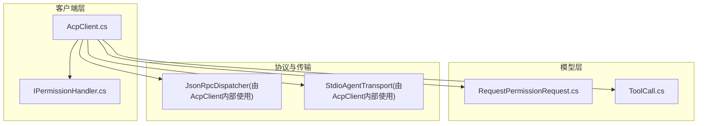
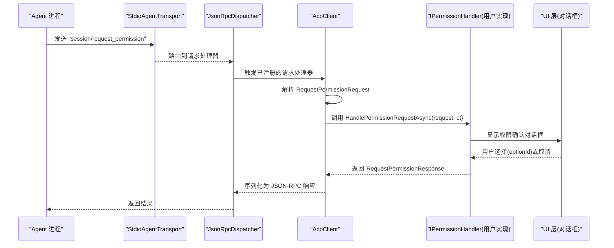
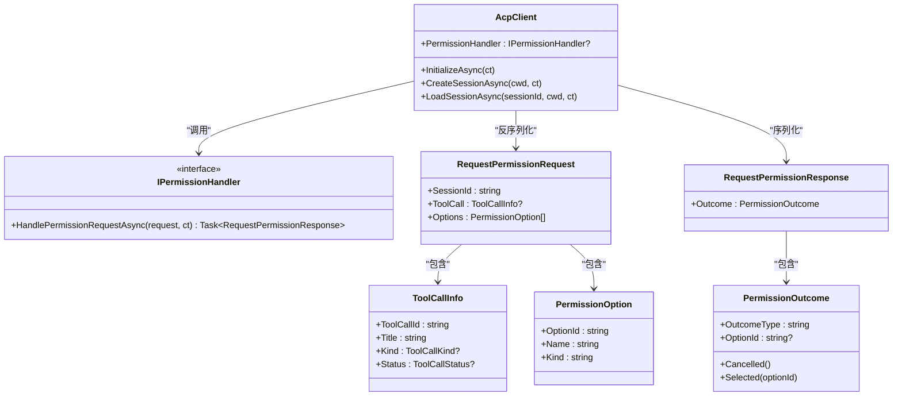

# 权限处理器

<cite>
**本文引用的文件**
- [IPermissionHandler.cs](file://Client/IPermissionHandler.cs)
- [RequestPermissionRequest.cs](file://Models/RequestPermissionRequest.cs)
- [ToolCall.cs](file://Models/ToolCall.cs)
- [AcpClient.cs](file://Client/AcpClient.cs)
- [README.md](file://README.md)
</cite>

## 目录
1. [简介](#简介)
2. [项目结构](#项目结构)
3. [核心组件](#核心组件)
4. [架构总览](#架构总览)
5. [详细组件分析](#详细组件分析)
6. [依赖关系分析](#依赖关系分析)
7. [性能考虑](#性能考虑)
8. [故障排查指南](#故障排查指南)
9. [结论](#结论)
10. [附录](#附录)

## 简介
本文件围绕权限处理器（IPermissionHandler）进行系统化说明，涵盖接口设计目的、使用场景、HandlePermissionRequestAsync 方法的工作原理与参数含义，以及 RequestPermissionRequest 的数据结构与属性。文档还提供实现用户友好权限确认对话框的完整模式、错误处理策略、取消令牌的使用与异步最佳实践，并总结常见权限场景的实现模式与安全注意事项。

## 项目结构
该库采用分层组织：客户端层定义处理器接口与默认客户端实现；模型层定义协议数据对象；传输与协议层负责 JSON-RPC 分发与通信。权限相关的关键文件位于 Client 与 Models 目录中。

图表来源
- [AcpClient.cs](file://Client/AcpClient.cs)
- [IPermissionHandler.cs](file://Client/IPermissionHandler.cs)
- [RequestPermissionRequest.cs](file://Models/RequestPermissionRequest.cs)
- [ToolCall.cs](file://Models/ToolCall.cs)

章节来源
- [README.md](file://README.md)

## 核心组件
- IPermissionHandler：定义权限请求处理契约，供 UI 层实现以展示权限确认对话框并返回授权结果。
- RequestPermissionRequest / PermissionOption / RequestPermissionResponse / PermissionOutcome：描述权限请求、可选选项与响应结果的数据模型。
- ToolCallInfo：描述工具调用上下文，便于在权限提示中展示操作类型与状态。
- AcpClient：注册 session/request_permission 请求处理器，将来自 Agent 的请求转发给实现的 IPermissionHandler，并将结果序列化回 JSON-RPC 响应。

章节来源
- [IPermissionHandler.cs](file://Client/IPermissionHandler.cs)
- [RequestPermissionRequest.cs](file://Models/RequestPermissionRequest.cs)
- [ToolCall.cs](file://Models/ToolCall.cs)
- [AcpClient.cs](file://Client/AcpClient.cs)

## 架构总览
下图展示了从 Agent 发起权限请求到 UI 层完成用户交互并返回结果的端到端流程。

图表来源
- [AcpClient.cs](file://Client/AcpClient.cs)
- [IPermissionHandler.cs](file://Client/IPermissionHandler.cs)
- [RequestPermissionRequest.cs](file://Models/RequestPermissionRequest.cs)

## 详细组件分析

### IPermissionHandler 接口设计与使用场景
- 设计目的：为 UI 层提供统一的权限请求处理入口，使 Agent 在执行可能影响系统或用户数据的操作前，能够向用户征求明确授权。
- 使用场景：
  - 文件读写、删除、移动等敏感操作
  - 执行命令、搜索、网络抓取等外部资源访问
  - 需要用户确认的“思考”或“其他”类操作
- 关键方法：HandlePermissionRequestAsync
  - 输入：RequestPermissionRequest 与 CancellationToken
  - 输出：RequestPermissionResponse（包含 PermissionOutcome）
  - 行为：应阻塞等待用户做出选择，然后返回授权结果

章节来源
- [IPermissionHandler.cs](file://Client/IPermissionHandler.cs)

### HandlePermissionRequestAsync 工作原理与参数含义
- 工作原理：
  - AcpClient 在 InitializeAsync 中注册 "session/request_permission" 请求处理器。
  - 收到请求后，反序列化为 RequestPermissionRequest。
  - 调用 IPermissionHandler.HandlePermissionRequestAsync 获取用户决策。
  - 将返回的 RequestPermissionResponse 序列化为 JSON-RPC 响应返回给 Agent。
- 参数含义：
  - request：包含会话标识、工具调用信息与可选项列表。
  - ct：取消令牌，用于支持长时间运行的 UI 交互被取消。
- 返回值：
  - RequestPermissionResponse.Outcome：表示最终授权结果，包括 outcomeType 与可选 optionId。

章节来源
- [AcpClient.cs](file://Client/AcpClient.cs)
- [RequestPermissionRequest.cs](file://Models/RequestPermissionRequest.cs)

### RequestPermissionRequest 数据结构与属性
- SessionId：当前会话标识，便于在 UI 中展示上下文。
- ToolCall：工具调用信息，包含 toolCallId、title、kind、status，帮助解释即将执行的操作。
- Options：权限选项集合，每个选项包含 optionId、name、kind，用于构建用户可选择的按钮或开关。

章节来源
- [RequestPermissionRequest.cs](file://Models/RequestPermissionRequest.cs)
- [ToolCall.cs](file://Models/ToolCall.cs)

### 权限响应模型 PermissionOutcome
- OutcomeType：结果类型，如 "selected" 或 "cancelled"。
- OptionId：当选择某项时携带对应 optionId。
- 便捷构造：
  - Cancelled()：表示用户取消或未授权。
  - Selected(optionId)：表示用户选择了指定选项。

章节来源
- [RequestPermissionRequest.cs](file://Models/RequestPermissionRequest.cs)

### 工具调用枚举 ToolCallKind 与 ToolCallStatus
- ToolCallKind：read、edit、delete、move、search、execute、think、fetch、other，用于区分操作类型。
- ToolCallStatus：pending、in_progress、completed、failed，反映工具调用状态。

章节来源
- [ToolCall.cs](file://Models/ToolCall.cs)
- [Enums/ToolCallKind.cs](file://Models/Enums/ToolCallKind.cs)
- [Enums/ToolCallStatus.cs](file://Models/Enums/ToolCallStatus.cs)

### 实现示例：创建用户友好的权限确认对话框
以下为实现模式的步骤说明（不直接展示代码内容）：
- 接收 RequestPermissionRequest：
  - 提取 SessionId、ToolCall.Title、ToolCall.Kind 与 Options。
  - 根据 Kind 生成人类可读的描述文本（例如“读取文件”、“执行命令”）。
- 展示对话框：
  - 标题：基于 ToolCall.Title 或 Kind 生成。
  - 正文：展示操作详情、目标路径/命令摘要、风险说明。
  - 选项：遍历 Options，为每个 OptionId 生成按钮或单选项。
- 获取用户选择：
  - 若用户选择某个 optionId，则返回 PermissionOutcome.Selected(optionId)。
  - 若用户点击取消或关闭对话框，返回 PermissionOutcome.Cancelled()。
- 异常与超时：
  - 捕获 UI 异常并转换为合适的错误响应或重试提示。
  - 监听取消令牌 ct，若被取消则返回取消结果。
- 日志与审计：
  - 记录用户决策、选项与上下文，便于后续审计与调试。

章节来源
- [IPermissionHandler.cs](file://Client/IPermissionHandler.cs)
- [RequestPermissionRequest.cs](file://Models/RequestPermissionRequest.cs)
- [ToolCall.cs](file://Models/ToolCall.cs)

### 错误处理策略与取消令牌使用
- 错误处理：
  - 未设置 PermissionHandler：AcpClient 默认返回取消结果。
  - UI 层应捕获异常并返回明确的取消或失败结果，避免阻塞请求管道。
  - 对无效 optionId 进行校验，防止非法响应。
- 取消令牌：
  - 在长时间显示的对话框中监听 ct，确保用户或上层能取消请求。
  - 在异步等待用户输入时及时响应取消信号。
- 异步最佳实践：
  - 使用 async/await 避免死锁。
  - 不要阻塞线程，保持 UI 响应性。
  - 合理设置超时与重试策略。

章节来源
- [AcpClient.cs](file://Client/AcpClient.cs)
- [IPermissionHandler.cs](file://Client/IPermissionHandler.cs)

### 常见权限场景的实现模式
- 文件读取：
  - Kind=Read，展示文件路径与只读说明，允许用户批准或拒绝。
- 文件编辑/写入：
  - Kind=Edit，展示变更范围与潜在风险，建议二次确认。
- 文件删除/移动：
  - Kind=Delete/Move，强调不可逆性与影响范围。
- 执行命令：
  - Kind=Execute，展示命令摘要与环境信息，必要时要求管理员确认。
- 搜索/抓取：
  - Kind=Search/Fetch，说明数据来源与隐私影响。
- 思考/其他：
  - Kind=Think/Other，提供额外上下文帮助用户理解意图。

章节来源
- [ToolCall.cs](file://Models/ToolCall.cs)
- [Enums/ToolCallKind.cs](file://Models/Enums/ToolCallKind.cs)

### 安全考虑
- 最小权限原则：仅请求必要的权限，减少攻击面。
- 输入校验：严格校验 optionId、路径、命令等输入，防止注入与越权。
- 审计与日志：记录权限决策与上下文，便于事后追溯。
- 用户知情：清晰展示操作影响与风险，避免误导。
- 撤销机制：提供便捷的撤销或限制策略，降低误操作后果。

## 依赖关系分析
下图展示 AcpClient、IPermissionHandler、模型之间的依赖关系。

图表来源
- [AcpClient.cs](file://Client/AcpClient.cs)
- [IPermissionHandler.cs](file://Client/IPermissionHandler.cs)
- [RequestPermissionRequest.cs](file://Models/RequestPermissionRequest.cs)
- [ToolCall.cs](file://Models/ToolCall.cs)

章节来源
- [AcpClient.cs](file://Client/AcpClient.cs)
- [IPermissionHandler.cs](file://Client/IPermissionHandler.cs)
- [RequestPermissionRequest.cs](file://Models/RequestPermissionRequest.cs)
- [ToolCall.cs](file://Models/ToolCall.cs)

## 性能考虑
- 避免阻塞主线程：UI 层应在后台线程处理复杂逻辑，保持界面响应。
- 快速反馈：在对话框中提供加载指示与进度反馈。
- 缓存与复用：对重复出现的权限模板进行缓存，减少渲染开销。
- 合理超时：为长耗时操作设置超时，避免请求堆积。

## 故障排查指南
- 未设置 PermissionHandler：
  - 现象：所有权限请求均返回取消结果。
  - 解决：在 InitializeAsync 之前为 client.PermissionHandler 赋值实现。
- 选项无效：
  - 现象：返回的 optionId 不在 Options 列表中。
  - 解决：校验用户选择，仅允许合法 optionId。
- 取消令牌未生效：
  - 现象：对话框无法被取消。
  - 解决：在等待用户输入时检查 ct.IsCancellationRequested。
- 序列化错误：
  - 现象：JSON 序列化失败导致响应异常。
  - 解决：确保模型字段与 JsonPropertyName 一致，避免空引用。

章节来源
- [AcpClient.cs](file://Client/AcpClient.cs)
- [RequestPermissionRequest.cs](file://Models/RequestPermissionRequest.cs)

## 结论
IPermissionHandler 为 Agent 与 UI 层之间提供了清晰的权限协商边界。通过 RequestPermissionRequest 与 PermissionOutcome 的结构化数据，结合 AcpClient 的 JSON-RPC 分发机制，可实现安全、可控且用户友好的权限确认流程。遵循本文的错误处理、取消令牌与异步最佳实践，可在保证用户体验的同时提升系统安全性与稳定性。

## 附录
- 快速开始参考：参见 README 中的初始化与处理器分配示例。
- 扩展点：可通过 RegisterRequestHandler 与 RegisterNotificationHandler 自定义方法与通知处理。

章节来源
- [README.md](file://README.md)