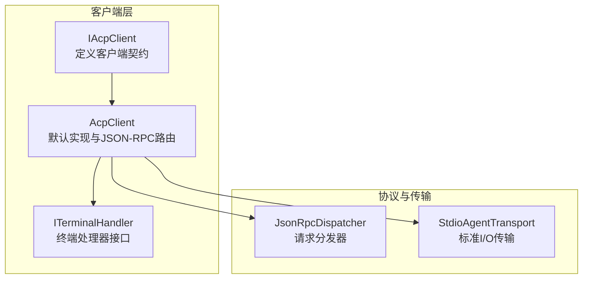
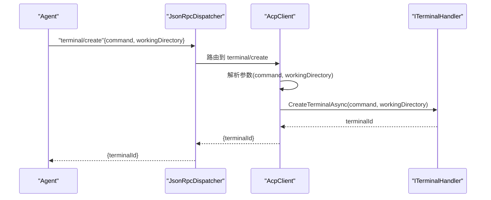
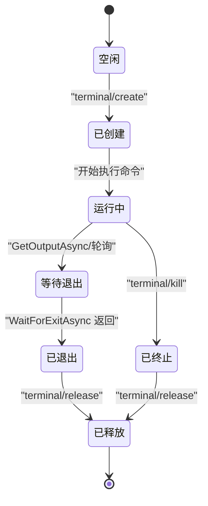
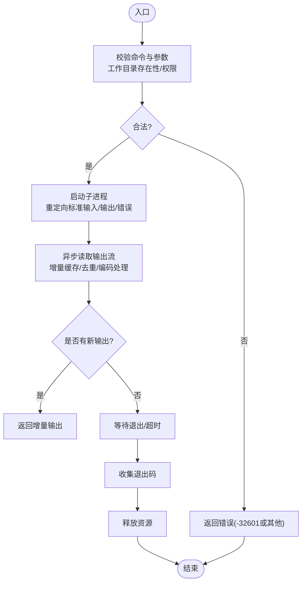
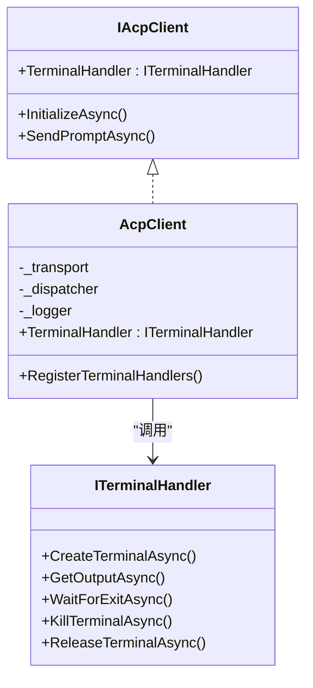

# 终端处理器

<cite>
**本文引用的文件**   
- [ITerminalHandler.cs](file://Client/ITerminalHandler.cs)
- [AcpClient.cs](file://Client/AcpClient.cs)
- [IAcpClient.cs](file://Client/IAcpClient.cs)
- [README.md](file://README.md)
</cite>

## 目录
1. [简介](#简介)
2. [项目结构](#项目结构)
3. [核心组件](#核心组件)
4. [架构总览](#架构总览)
5. [详细组件分析](#详细组件分析)
6. [依赖关系分析](#依赖关系分析)
7. [性能考虑](#性能考虑)
8. [故障排查指南](#故障排查指南)
9. [结论](#结论)
10. [附录](#附录)

## 简介
本文件围绕 ITerminalHandler 接口与 ACP 协议中的 terminal/* 方法，提供终端处理器的完整设计与实现指南。内容涵盖：
- 设计目标与安全机制（命令白名单、沙箱隔离、资源限制）
- 命令执行、输出捕获、输入处理与进程管理要求
- 终端会话生命周期、实时输出流与交互式命令支持
- 安全加固、审计日志与异常恢复策略
- 跨平台兼容性与自定义终端后端开发指南

## 项目结构
本项目为 .NET 的 ACP 客户端库，采用分层与接口抽象组织代码。终端相关能力通过 ITerminalHandler 暴露给上层应用，并由 AcpClient 在 JSON-RPC 层进行路由与转发。

图表来源
- [IAcpClient.cs:1-59](file://Client/IAcpClient.cs#L1-L59)
- [AcpClient.cs:1-361](file://Client/AcpClient.cs#L1-L361)

章节来源
- [README.md:1-99](file://README.md#L1-L99)
- [IAcpClient.cs:1-59](file://Client/IAcpClient.cs#L1-L59)
- [AcpClient.cs:1-361](file://Client/AcpClient.cs#L1-L361)

## 核心组件
- ITerminalHandler：定义终端创建、输出读取、等待退出、终止与释放等能力，供上层 UI/业务层实现。
- AcpClient：负责注册 terminal/* 的 JSON-RPC 处理器，将请求参数解析后委派给 ITerminalHandler，并返回结果。
- IAcpClient：对外暴露 TerminalHandler 属性，允许注入具体实现。

关键要点
- 所有 terminal/* 调用均通过 AcpClient.RegisterTerminalHandlers 统一注册。
- 若未设置 TerminalHandler，将返回“不可用”错误码 -32601。
- 参数解析对可选字段（如 workingDirectory）做了容错处理。

章节来源
- [ITerminalHandler.cs:1-23](file://Client/ITerminalHandler.cs#L1-L23)
- [AcpClient.cs:250-359](file://Client/AcpClient.cs#L250-L359)
- [IAcpClient.cs:22-24](file://Client/IAcpClient.cs#L22-L24)

## 架构总览
下图展示了从 Agent 发起 terminal/create 到 AcpClient 路由至 ITerminalHandler 的完整流程。

图表来源
- [AcpClient.cs:252-274](file://Client/AcpClient.cs#L252-L274)

章节来源
- [AcpClient.cs:250-359](file://Client/AcpClient.cs#L250-L359)

## 详细组件分析

### ITerminalHandler 接口设计
职责边界
- 创建终端：CreateTerminalAsync(command, workingDirectory)
- 获取输出：GetOutputAsync(terminalId)
- 等待退出：WaitForExitAsync(terminalId)
- 终止进程：KillTerminalAsync(terminalId)
- 释放资源：ReleaseTerminalAsync(terminalId)

设计目标
- 面向异步与取消令牌，避免阻塞调用方线程。
- 明确返回值语义：terminalId、output、exitCode。
- 与 ACP 协议一一对应，便于扩展与维护。

实现建议
- 使用进程管理器封装子进程生命周期。
- 输出采用增量读取与缓冲合并，避免大文本一次性加载。
- 对 workingDirectory 做存在性校验与权限检查。

章节来源
- [ITerminalHandler.cs:1-23](file://Client/ITerminalHandler.cs#L1-L23)

### AcpClient 中的终端路由
- RegisterTerminalHandlers 统一注册 terminal/create、terminal/output、terminal/wait_for_exit、terminal/kill、terminal/release。
- 每个处理器先检查 TerminalHandler 是否可用，否则返回 -32601。
- 参数解析对可选字段进行安全访问，防止空引用。

章节来源
- [AcpClient.cs:250-359](file://Client/AcpClient.cs#L250-L359)

### 终端会话生命周期与状态机

说明
- 创建后进入运行态；输出可通过 GetOutputAsync 拉取或基于事件推送。
- 退出或终止后需显式 release 以释放句柄与资源。

章节来源
- [AcpClient.cs:252-359](file://Client/AcpClient.cs#L252-L359)

### 命令执行与输出捕获流程

说明
- 输出捕获建议使用非阻塞读取与缓冲区合并，避免死锁与内存暴涨。
- 可结合 CancellationToken 支持中断与超时。

章节来源
- [AcpClient.cs:276-316](file://Client/AcpClient.cs#L276-L316)

### 交互式命令支持与输入处理
- 需要为子进程提供标准输入通道，并在 GetOutputAsync 之外提供 WriteInputAsync（由实现者自行扩展）。
- 对于交互式命令（如 shell），应保持会话级连接，避免每次重新创建。
- 注意编码一致性（UTF-8）与换行符规范化。

章节来源
- [ITerminalHandler.cs:1-23](file://Client/ITerminalHandler.cs#L1-L23)

### 安全机制与加固措施
- 命令白名单：仅允许受控命令集合（如 git、ls、cat、npm 等），拒绝任意拼接字符串。
- 参数白名单：对参数进行严格校验（长度、字符集、路径规范）。
- 沙箱隔离：
  - 最小权限原则：以受限用户运行子进程。
  - 文件系统只读挂载与路径白名单。
  - 网络访问控制（出站白名单或禁用）。
  - 环境变量清理，禁止敏感信息泄露。
- 资源限制：CPU/内存/句柄/进程数上限，超时强制终止。
- 审计日志：记录命令、参数、工作目录、耗时、退出码、资源使用。
- 异常恢复：超时重试、幂等性保护、崩溃后自动清理。

章节来源
- [AcpClient.cs:252-359](file://Client/AcpClient.cs#L252-L359)

### 跨平台兼容性
- Windows：优先使用 cmd.exe 或 PowerShell（根据命令类型选择），注意路径分隔符与权限模型差异。
- Unix-like：使用 /bin/sh 或 /bin/bash，注意信号处理与权限提升。
- 编码：统一 UTF-8，必要时做 BOM 处理。
- 路径与工作目录：确保相对路径在当前会话上下文中有效。

章节来源
- [AcpClient.cs:252-359](file://Client/AcpClient.cs#L252-L359)

### 自定义终端后端开发指南
实现步骤
- 实现 ITerminalHandler 接口，提供五个方法的异步实现。
- 内部维护 terminalId 到进程/会话的映射表。
- 保证并发安全与资源释放，避免泄漏。
- 在 AcpClient.TerminalHandler 注入实现。

最佳实践
- 使用进程池或会话复用减少开销。
- 输出流采用背压与限流，避免内存抖动。
- 提供健康检查与监控指标（QPS、延迟、失败率）。

章节来源
- [ITerminalHandler.cs:1-23](file://Client/ITerminalHandler.cs#L1-L23)
- [AcpClient.cs:250-359](file://Client/AcpClient.cs#L250-L359)

## 依赖关系分析
- AcpClient 依赖 JsonRpcDispatcher 进行请求分发，依赖 IAgentTransport 进行通信。
- ITerminalHandler 作为外部注入点，解耦了终端实现与协议层。
- 无循环依赖，职责清晰。

图表来源
- [IAcpClient.cs:1-59](file://Client/IAcpClient.cs#L1-L59)
- [AcpClient.cs:1-361](file://Client/AcpClient.cs#L1-L361)
- [ITerminalHandler.cs:1-23](file://Client/ITerminalHandler.cs#L1-L23)

章节来源
- [IAcpClient.cs:1-59](file://Client/IAcpClient.cs#L1-L59)
- [AcpClient.cs:1-361](file://Client/AcpClient.cs#L1-L361)

## 性能考虑
- 输出读取：采用非阻塞 I/O 与增量缓冲，避免全量拷贝。
- 并发控制：限制同时运行的终端数量，防止资源耗尽。
- 序列化开销：尽量复用 JSON 选项与对象，减少 GC 压力。
- 超时与取消：合理设置超时时间，及时释放被卡住的进程。
- 监控与采样：采集关键指标用于容量规划与问题定位。

## 故障排查指南
常见问题
- “终端处理器不可用”：未设置 TerminalHandler 或未正确注入。
- “参数解析失败”：缺少必要字段或类型不匹配。
- “输出为空”：子进程未刷新输出或编码不一致。
- “进程未退出”：缺少 Kill/Release 或死锁。

排查步骤
- 检查 AcpClient 是否已设置 TerminalHandler。
- 查看 JSON-RPC 请求参数是否正确。
- 确认工作目录存在且具备读写权限。
- 启用调试日志，观察子进程状态与输出流。

章节来源
- [AcpClient.cs:252-359](file://Client/AcpClient.cs#L252-L359)

## 结论
ITerminalHandler 为 ACP 终端能力提供了清晰的抽象，AcpClient 将其与 JSON-RPC 协议无缝对接。通过严格的白名单、沙箱隔离、资源限制与审计日志，可实现安全的终端命令执行。按本文指南实现自定义后端，即可在不同平台上提供稳定、高性能、可观测的终端处理能力。

## 附录
- 快速上手：参考 README 中的 Handler 配置示例，在 InitializeAsync 前注入 TerminalHandler。
- 扩展点：如需新增 terminal/* 方法，可在 AcpClient.RegisterTerminalHandlers 中追加处理器。

章节来源
- [README.md:35-51](file://README.md#L35-L51)
- [AcpClient.cs:250-359](file://Client/AcpClient.cs#L250-L359)