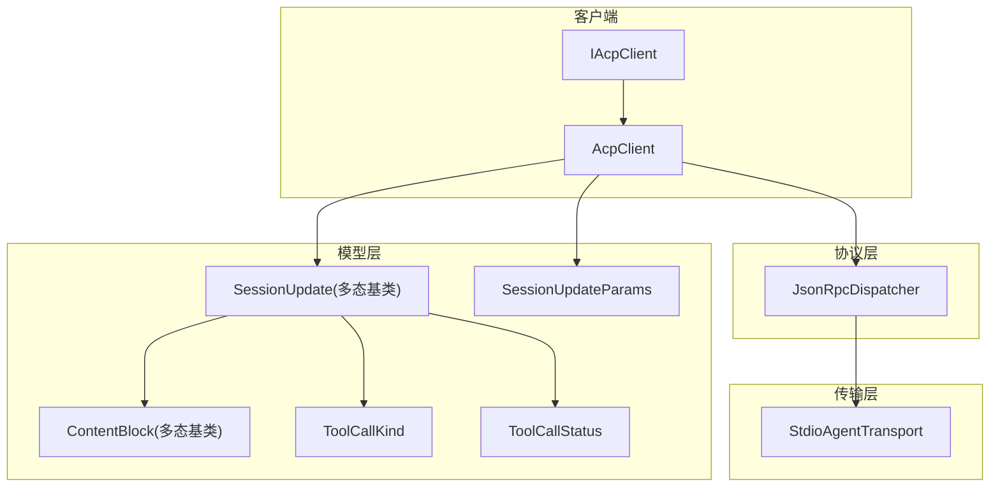
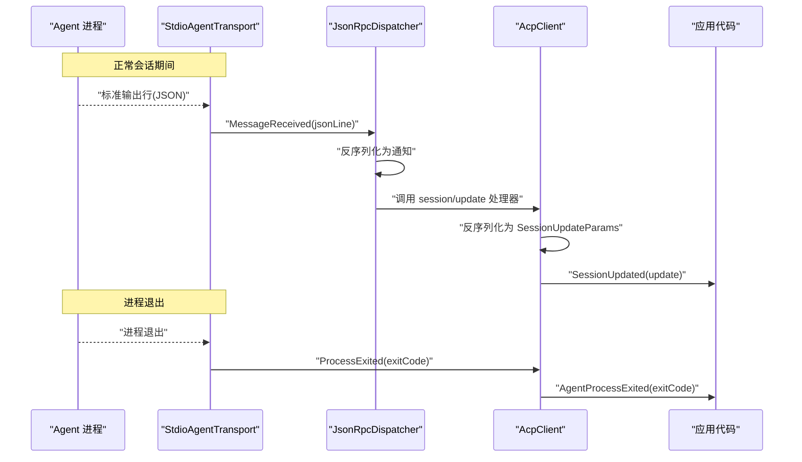
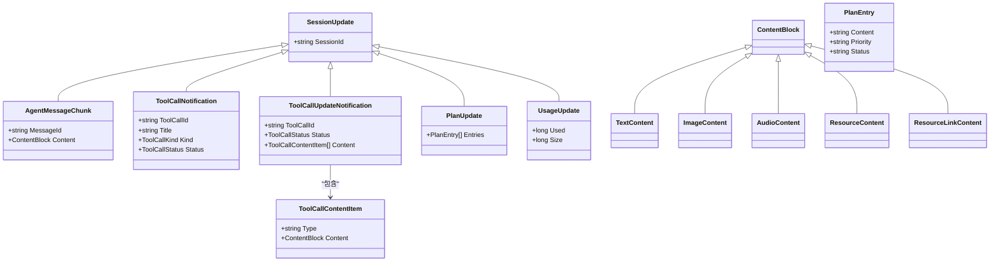
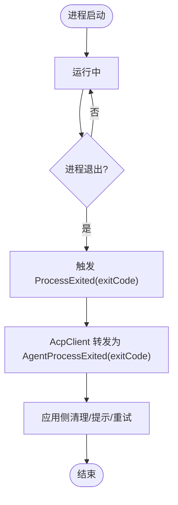
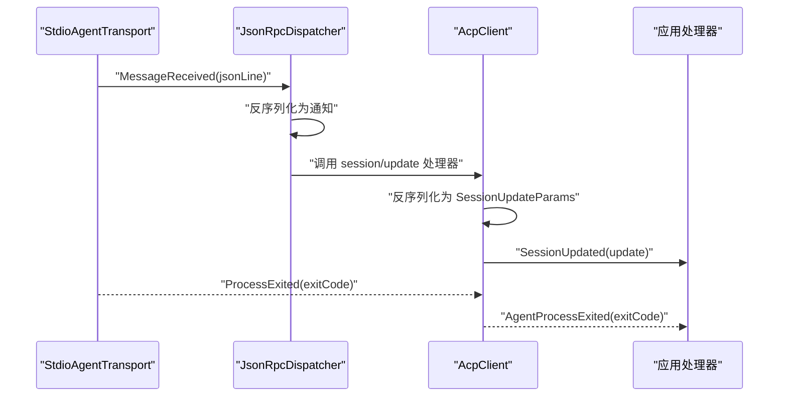
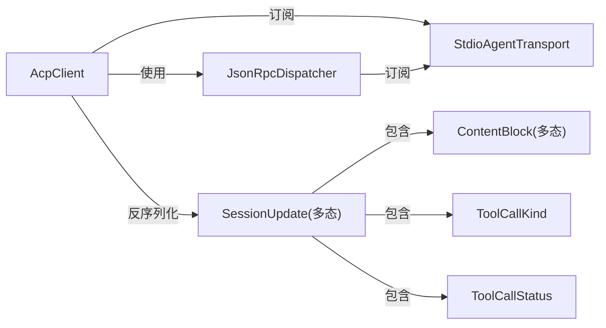

# 事件处理机制

<cite>
**本文引用的文件**   
- [README.md](file://README.md)
- [AcpClient.cs](file://Client/AcpClient.cs)
- [IAcpClient.cs](file://Client/IAcpClient.cs)
- [JsonRpcDispatcher.cs](file://Protocol/JsonRpcDispatcher.cs)
- [StdioAgentTransport.cs](file://Transport/StdioAgentTransport.cs)
- [SessionUpdate.cs](file://Models/SessionUpdate.cs)
- [SessionUpdateWrapper.cs](file://Models/SessionUpdateWrapper.cs)
- [ContentBlock.cs](file://Models/ContentBlock.cs)
- [ToolCallKind.cs](file://Models/Enums/ToolCallKind.cs)
- [ToolCallStatus.cs](file://Models/Enums/ToolCallStatus.cs)
- [JsonOptions.cs](file://Infrastructure/JsonOptions.cs)
</cite>

## 目录
1. [简介](#简介)
2. [项目结构](#项目结构)
3. [核心组件](#核心组件)
4. [架构总览](#架构总览)
5. [详细组件分析](#详细组件分析)
6. [依赖关系分析](#依赖关系分析)
7. [性能考虑](#性能考虑)
8. [故障排查指南](#故障排查指南)
9. [结论](#结论)
10. [附录](#附录)

## 简介
本文件围绕客户端事件处理机制，重点解释 SessionUpdated 与 AgentProcessExited 两个事件的触发时机、数据结构与处理模式。文档同时给出订阅与异步处理的实践建议，涵盖异常处理、取消令牌、内存泄漏防护与错误恢复策略，并阐明事件与 JSON-RPC 消息传递的关系以及与传输层、调度层的交互模式。

## 项目结构
该库采用分层组织：
- Client：客户端契约与实现（事件暴露点）
- Protocol：JSON-RPC 分发器（消息路由）
- Transport：基于 stdio 的进程通信（进程生命周期与 I/O）
- Models：协议数据模型（含 SessionUpdate 多态类型）
- Infrastructure：序列化选项与扩展

图表来源
- [AcpClient.cs:12-35](file://Client/AcpClient.cs#L12-L35)
- [JsonRpcDispatcher.cs:9-25](file://Protocol/JsonRpcDispatcher.cs#L9-L25)
- [StdioAgentTransport.cs:8-22](file://Transport/StdioAgentTransport.cs#L8-L22)
- [SessionUpdate.cs:18-17](file://Models/SessionUpdate.cs#L18-L17)
- [SessionUpdateWrapper.cs:9-16](file://Models/SessionUpdateWrapper.cs#L9-L16)
- [ContentBlock.cs:15-17](file://Models/ContentBlock.cs#L15-L17)
- [ToolCallKind.cs:6-26](file://Models/Enums/ToolCallKind.cs#L6-L26)
- [ToolCallStatus.cs:6-16](file://Models/Enums/ToolCallStatus.cs#L6-L16)

章节来源
- [README.md:1-99](file://README.md#L1-L99)

## 核心组件
- AcpClient：对外暴露 SessionUpdated 与 AgentProcessExited 事件；在 InitializeAsync 中注册 session/update 通知处理器，并将传输层进程退出事件转发为 AgentProcessExited。
- JsonRpcDispatcher：负责 JSON-RPC 请求/响应/通知的分发；将 session/update 通知反序列化为 SessionUpdateParams，再提取 Update 字段调用 SessionUpdated。
- StdioAgentTransport：管理子进程生命周期，当进程退出时通过 ProcessExited 事件上报退出码。
- SessionUpdate 及其派生类型：表示流式更新的多态数据结构（如文本片段、工具调用、计划、用量等）。

章节来源
- [AcpClient.cs:31-35](file://Client/AcpClient.cs#L31-L35)
- [AcpClient.cs:56-72](file://Client/AcpClient.cs#L56-L72)
- [JsonRpcDispatcher.cs:86-122](file://Protocol/JsonRpcDispatcher.cs#L86-L122)
- [StdioAgentTransport.cs:137-145](file://Transport/StdioAgentTransport.cs#L137-L145)
- [SessionUpdate.cs:18-118](file://Models/SessionUpdate.cs#L18-L118)

## 架构总览
下图展示了从传输层到客户端事件的完整链路：进程退出由传输层上报，session/update 通知经分发器解析后触发客户端事件。

图表来源
- [StdioAgentTransport.cs:95-118](file://Transport/StdioAgentTransport.cs#L95-L118)
- [StdioAgentTransport.cs:137-145](file://Transport/StdioAgentTransport.cs#L137-L145)
- [JsonRpcDispatcher.cs:86-122](file://Protocol/JsonRpcDispatcher.cs#L86-L122)
- [AcpClient.cs:56-72](file://Client/AcpClient.cs#L56-L72)

## 详细组件分析

### SessionUpdated 事件
- 触发时机
  - 当 Agent 通过 JSON-RPC 发送 session/update 通知时，JsonRpcDispatcher 将其路由到 AcpClient 注册的处理器。
  - AcpClient 将 Params 反序列化为 SessionUpdateParams，若存在 Update 字段则调用 SessionUpdated。
- 数据结构
  - SessionUpdateParams：包含 sessionId 与 update（SessionUpdate 多态对象）。
  - SessionUpdate：多态基类，支持多种具体类型（如 AgentMessageChunk、ToolCallNotification、PlanUpdate、UsageUpdate 等）。
  - ContentBlock：用于内容块的多态类型（text/image/audio/resource/resource_link）。
  - ToolCallKind/ToolCallStatus：工具调用的种类与状态枚举。
- 处理模式
  - 典型做法是订阅 SessionUpdated，根据 update 的具体类型进行分支处理（例如渲染文本、展示工具调用进度、统计用量等）。
  - 由于是流式推送，建议对每个事件做轻量处理，避免阻塞后续事件。

图表来源
- [SessionUpdate.cs:18-118](file://Models/SessionUpdate.cs#L18-L118)
- [ContentBlock.cs:15-78](file://Models/ContentBlock.cs#L15-L78)
- [ToolCallKind.cs:6-26](file://Models/Enums/ToolCallKind.cs#L6-L26)
- [ToolCallStatus.cs:6-16](file://Models/Enums/ToolCallStatus.cs#L6-L16)

章节来源
- [AcpClient.cs:64-72](file://Client/AcpClient.cs#L64-L72)
- [SessionUpdateWrapper.cs:9-16](file://Models/SessionUpdateWrapper.cs#L9-L16)
- [SessionUpdate.cs:18-118](file://Models/SessionUpdate.cs#L18-L118)
- [ContentBlock.cs:15-78](file://Models/ContentBlock.cs#L15-L78)

### AgentProcessExited 事件
- 触发时机
  - 当底层 StdioAgentTransport 检测到子进程退出时，触发 ProcessExited 事件；AcpClient 在 InitializeAsync 中订阅该事件并将其转发为 AgentProcessExited。
- 数据结构
  - 事件参数为 int 类型的退出码。
- 处理模式
  - 通常用于清理资源、提示用户、重试或优雅关闭。

图表来源
- [StdioAgentTransport.cs:137-145](file://Transport/StdioAgentTransport.cs#L137-L145)
- [AcpClient.cs:56-61](file://Client/AcpClient.cs#L56-L61)

章节来源
- [StdioAgentTransport.cs:137-145](file://Transport/StdioAgentTransport.cs#L137-L145)
- [AcpClient.cs:56-61](file://Client/AcpClient.cs#L56-L61)

### 事件与消息传递的关系
- session/update 通知经由 JsonRpcDispatcher 的 OnMessageReceivedAsync 解析为 JsonRpcNotification，然后调用已注册的 session/update 处理器。
- AcpClient 在该处理器中将 Params 反序列化为 SessionUpdateParams，并调用 SessionUpdated。
- 进程退出经由 StdioAgentTransport.ProcessExited 上报给 AcpClient，再由 AcpClient 触发 AgentProcessExited。

图表来源
- [JsonRpcDispatcher.cs:86-122](file://Protocol/JsonRpcDispatcher.cs#L86-L122)
- [AcpClient.cs:64-72](file://Client/AcpClient.cs#L64-L72)
- [StdioAgentTransport.cs:95-118](file://Transport/StdioAgentTransport.cs#L95-L118)
- [StdioAgentTransport.cs:137-145](file://Transport/StdioAgentTransport.cs#L137-L145)

章节来源
- [JsonRpcDispatcher.cs:86-122](file://Protocol/JsonRpcDispatcher.cs#L86-L122)
- [AcpClient.cs:64-72](file://Client/AcpClient.cs#L64-L72)

## 依赖关系分析
- AcpClient 依赖：
  - IAgentTransport（StdioAgentTransport）：提供进程 I/O 与进程退出事件。
  - IJsonRpcDispatcher（JsonRpcDispatcher）：负责 JSON-RPC 消息路由。
  - ILogger：日志记录。
- JsonRpcDispatcher 依赖：
  - IRequestTracker：跟踪待完成的请求。
  - IAgentTransport：发送/接收消息。
- 模型依赖：
  - SessionUpdate 及其派生类型使用 System.Text.Json 的多态特性（TypeDiscriminatorPropertyName=sessionUpdate）。
  - ContentBlock 及其派生类型使用 type 作为判别字段。
  - 枚举使用字符串映射。

图表来源
- [AcpClient.cs:12-35](file://Client/AcpClient.cs#L12-L35)
- [JsonRpcDispatcher.cs:9-25](file://Protocol/JsonRpcDispatcher.cs#L9-L25)
- [SessionUpdate.cs:18-118](file://Models/SessionUpdate.cs#L18-L118)
- [ContentBlock.cs:15-78](file://Models/ContentBlock.cs#L15-L78)
- [ToolCallKind.cs:6-26](file://Models/Enums/ToolCallKind.cs#L6-L26)
- [ToolCallStatus.cs:6-16](file://Models/Enums/ToolCallStatus.cs#L6-L16)

章节来源
- [AcpClient.cs:12-35](file://Client/AcpClient.cs#L12-L35)
- [JsonRpcDispatcher.cs:9-25](file://Protocol/JsonRpcDispatcher.cs#L9-L25)

## 性能考虑
- 事件处理器应尽可能轻量，避免阻塞后续事件到达。对于耗时操作，建议使用 Task.Run 或队列异步处理。
- 反序列化开销：SessionUpdate 与 ContentBlock 的多态反序列化会带来一定成本，建议在 UI 线程外处理，必要时批量合并后再渲染。
- 取消令牌：SendPromptAsync、CancelSessionAsync 等方法支持 CancellationToken，应在长时间运行的处理器中检查取消状态，及时退出。
- 资源释放：确保在 ShutdownAsync/DisposeAsync 中正确断开分发器与传输层，避免悬挂任务与句柄泄漏。
- 日志与诊断：合理控制日志级别，避免高频事件下产生过多 IO 压力。

[本节为通用指导，不直接分析具体文件]

## 故障排查指南
- 事件未触发
  - 确认 InitializeAsync 已调用，且已注册 session/update 处理器。
  - 检查 JsonRpcDispatcher 是否已 Connect 到传输层。
  - 查看传输层是否处于 Running 状态。
- 进程提前退出
  - 关注 AgentProcessExited 的退出码，结合 Agent 端日志定位原因。
  - 检查 StdioAgentTransport 的 StopAsync 是否正确调用，避免意外终止。
- 反序列化失败
  - 确认 JsonOptions 配置启用多态与忽略未知判别器，避免新类型导致崩溃。
  - 在处理器中对 null 或空字段做防御性判断。
- 内存增长
  - 避免在事件处理器中累积大量历史数据；必要时限制缓冲区大小或使用环形缓冲。
  - 确保不再需要的事件订阅被移除（例如 UI 页面销毁时取消订阅）。

章节来源
- [AcpClient.cs:48-182](file://Client/AcpClient.cs#L48-L182)
- [JsonRpcDispatcher.cs:86-122](file://Protocol/JsonRpcDispatcher.cs#L86-L122)
- [StdioAgentTransport.cs:70-93](file://Transport/StdioAgentTransport.cs#L70-L93)
- [JsonOptions.cs:13-26](file://Infrastructure/JsonOptions.cs#L13-L26)

## 结论
SessionUpdated 与 AgentProcessExited 构成了客户端与 Agent 之间“流式更新”和“进程生命周期”的关键事件通道。通过 JsonRpcDispatcher 与 StdioAgentTransport 的协作，AcpClient 将底层消息与进程事件抽象为简洁的 .NET 事件，便于上层应用以异步、可取消、可扩展的方式处理。遵循轻量处理、合理取消、健壮反序列化与资源释放的最佳实践，可获得稳定高效的体验。

[本节为总结，不直接分析具体文件]

## 附录

### 订阅与处理示例（路径指引）
- 订阅 SessionUpdated
  - 参考：[AcpClient.cs:31-35](file://Client/AcpClient.cs#L31-L35)
- 订阅 AgentProcessExited
  - 参考：[AcpClient.cs:31-35](file://Client/AcpClient.cs#L31-L35)
- 初始化与握手（内部注册 session/update 处理器）
  - 参考：[AcpClient.cs:48-182](file://Client/AcpClient.cs#L48-L182)
- 发送提示与取消
  - 参考：[AcpClient.cs:208-224](file://Client/AcpClient.cs#L208-L224)
- 传输层进程退出事件
  - 参考：[StdioAgentTransport.cs:137-145](file://Transport/StdioAgentTransport.cs#L137-L145)
- JSON-RPC 通知分发
  - 参考：[JsonRpcDispatcher.cs:86-122](file://Protocol/JsonRpcDispatcher.cs#L86-L122)
- 多态模型定义
  - 参考：[SessionUpdate.cs:18-118](file://Models/SessionUpdate.cs#L18-L118)、[ContentBlock.cs:15-78](file://Models/ContentBlock.cs#L15-L78)

### 最佳实践清单
- 在 InitializeAsync 之后立即订阅事件，避免错过早期事件。
- 使用 CancellationToken 在长耗时处理器中支持取消。
- 对 SessionUpdate 的类型分支处理要完备，新增类型时保持向后兼容。
- 在 UI 线程外执行重计算，仅将结果同步回 UI。
- 在应用退出时调用 ShutdownAsync/DisposeAsync，确保资源释放。
- 对频繁事件做节流/批处理，降低 UI 刷新压力。
- 记录关键事件与异常，便于问题定位。

[本节为通用指导，不直接分析具体文件]