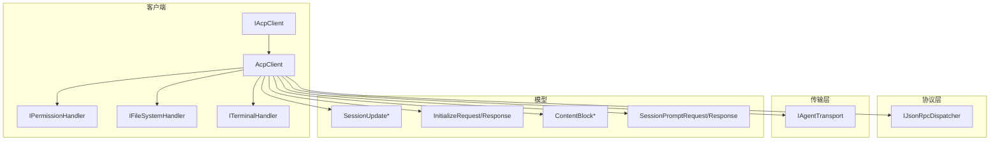
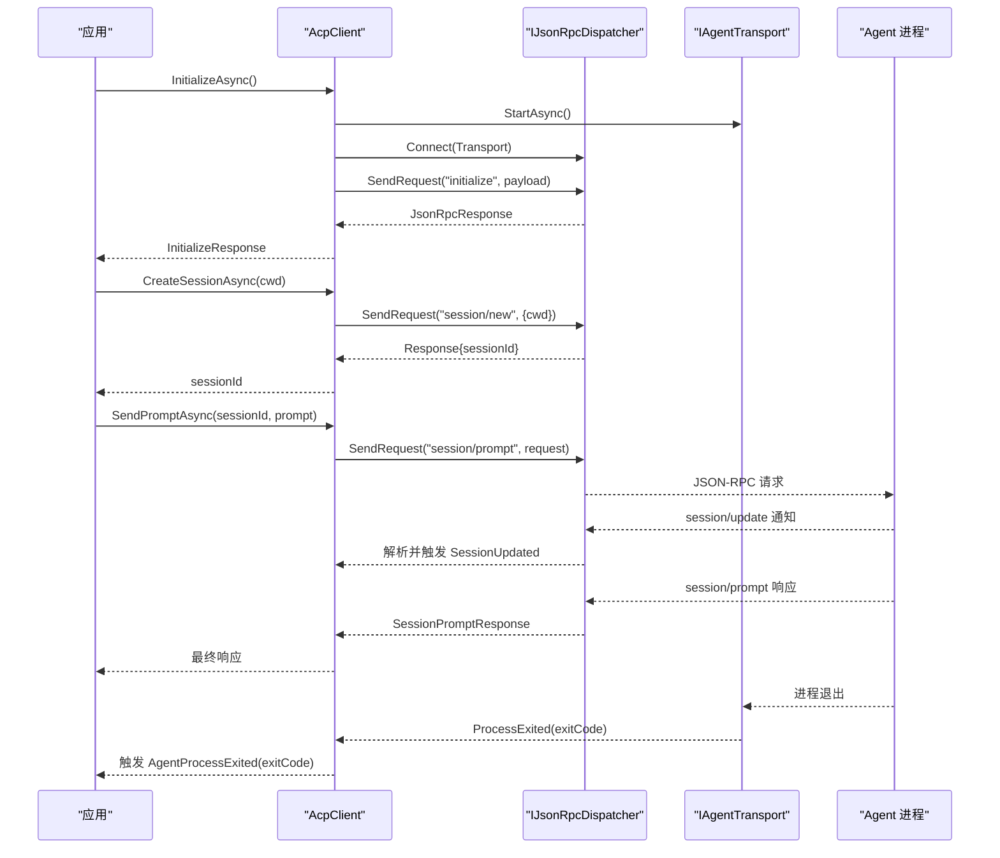
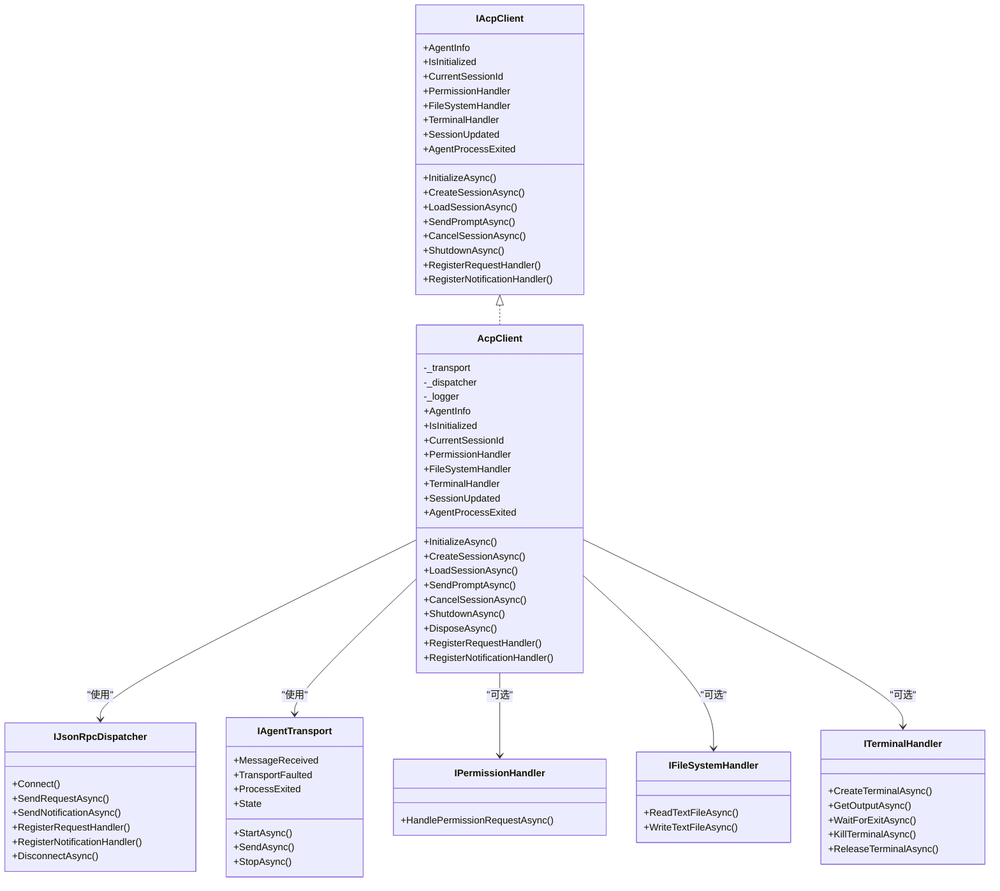
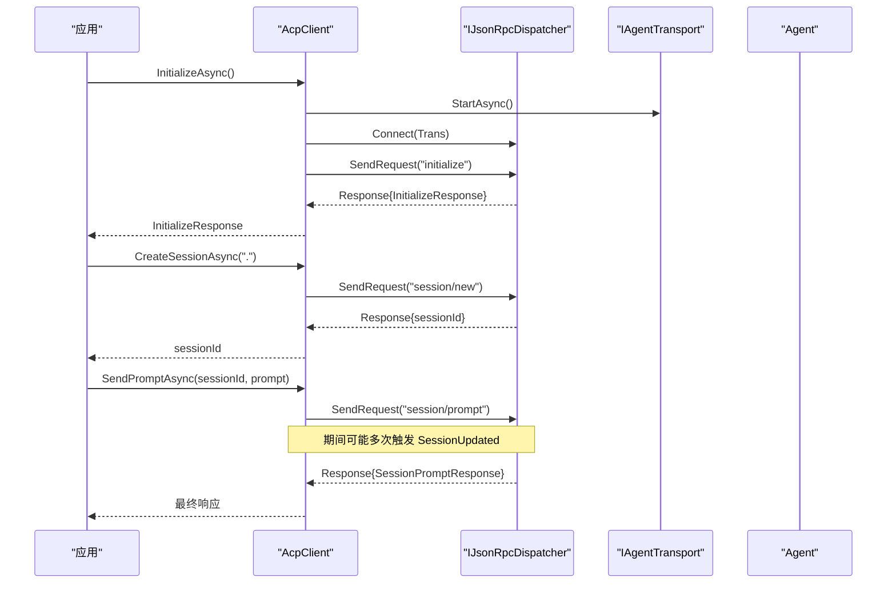
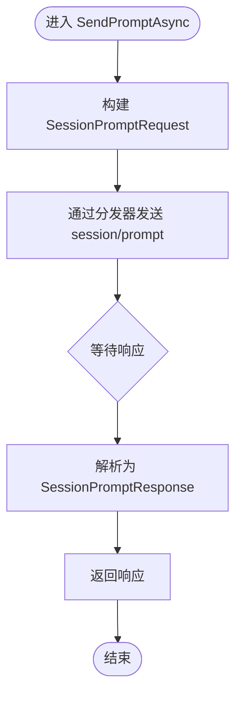
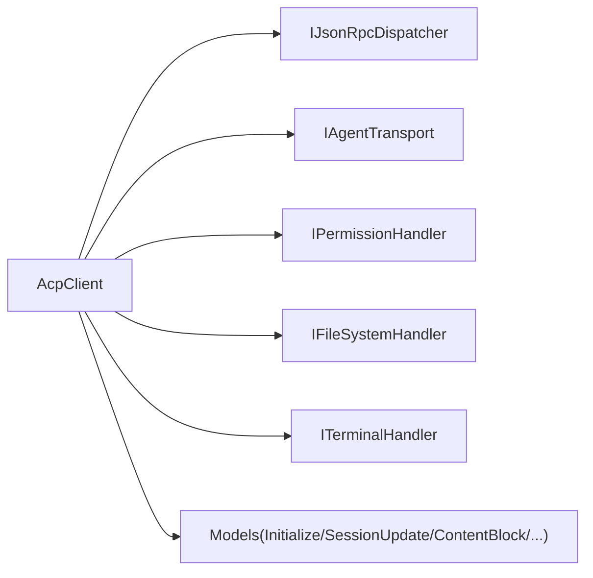

# 客户端API

<cite>
**本文引用的文件**   
- [IAcpClient.cs](file://Client/IAcpClient.cs)
- [AcpClient.cs](file://Client/AcpClient.cs)
- [IFileSystemHandler.cs](file://Client/IFileSystemHandler.cs)
- [IPermissionHandler.cs](file://Client/IPermissionHandler.cs)
- [ITerminalHandler.cs](file://Client/ITerminalHandler.cs)
- [SessionUpdate.cs](file://Models/SessionUpdate.cs)
- [InitializeRequest.cs](file://Models/InitializeRequest.cs)
- [InitializeResponse.cs](file://Models/InitializeResponse.cs)
- [SessionPromptRequest.cs](file://Models/SessionPromptRequest.cs)
- [ContentBlock.cs](file://Models/ContentBlock.cs)
- [IJsonRpcDispatcher.cs](file://Protocol/IJsonRpcDispatcher.cs)
- [IAgentTransport.cs](file://Transport/IAgentTransport.cs)
- [README.md](file://README.md)
- [Agentic.ACPLibrary.csproj](file://Agentic.ACPLibrary.csproj)
</cite>

## 更新摘要
**所做更改**
- 更新了所有处理器接口的详细XML文档注释
- 增强了方法、属性和事件的描述性说明
- 改进了接口契约的文档完整性
- 优化了事件处理机制的说明

## 目录
1. [简介](#简介)
2. [项目结构](#项目结构)
3. [核心组件](#核心组件)
4. [架构总览](#架构总览)
5. [详细组件分析](#详细组件分析)
6. [依赖关系分析](#依赖关系分析)
7. [性能与内存优化](#性能与内存优化)
8. [故障排查指南](#故障排查指南)
9. [结论](#结论)
10. [附录：使用示例与最佳实践](#附录使用示例与最佳实践)

## 简介
本文件为 ACP（Agent Client Protocol）客户端库的 API 文档，聚焦于 IAcpClient 接口及其默认实现 AcpClient。内容涵盖初始化、会话管理、提示发送与取消、事件处理机制（SessionUpdated、AgentProcessExited）、扩展点（自定义 JSON-RPC 请求/通知处理器），以及与其他组件（传输层、JSON-RPC 分发器、模型类型）的集成方式。同时提供性能优化建议、错误处理策略和资源管理最佳实践。

**更新** 本版本已增强所有处理器接口的XML文档注释，提供更详细的API说明和使用指导。

## 项目结构
该库采用分层组织：
- Client：客户端契约与实现，以及面向 Agent 的三类处理器（权限、文件系统、终端）。
- Models：协议数据模型（初始化、会话更新、内容块等）。
- Protocol：JSON-RPC 分发抽象与实现。
- Transport：进程/管道传输抽象与 stdio 实现。
- Infrastructure：序列化选项与服务注册扩展。

**图表来源**
- [IAcpClient.cs:1-59](file://Client/IAcpClient.cs#L1-L59)
- [AcpClient.cs:12-45](file://Client/AcpClient.cs#L12-L45)
- [IJsonRpcDispatcher.cs:1-14](file://Protocol/IJsonRpcDispatcher.cs#L1-L14)
- [IAgentTransport.cs:1-39](file://Transport/IAgentTransport.cs#L1-L39)
- [SessionUpdate.cs:1-119](file://Models/SessionUpdate.cs#L1-L119)
- [InitializeRequest.cs:1-16](file://Models/InitializeRequest.cs#L1-L16)
- [InitializeResponse.cs:1-28](file://Models/InitializeResponse.cs#L1-L28)
- [SessionPromptRequest.cs:1-20](file://Models/SessionPromptRequest.cs#L1-L20)
- [ContentBlock.cs:1-79](file://Models/ContentBlock.cs#L1-L79)

**章节来源**
- [README.md:1-99](file://README.md#L1-L99)
- [Agentic.ACPLibrary.csproj:1-34](file://Agentic.ACPLibrary.csproj#L1-L34)

## 核心组件
- IAcpClient：定义客户端契约，包括属性（AgentInfo、IsInitialized、CurrentSessionId、各类 Handler）、事件（SessionUpdated、AgentProcessExited）和核心方法（InitializeAsync、CreateSessionAsync、LoadSessionAsync、SendPromptAsync、CancelSessionAsync、ShutdownAsync、RegisterRequestHandler、RegisterNotificationHandler）。
- AcpClient：IAcpClient 的默认实现，负责启动传输、建立 JSON-RPC 分发、注册内置处理器（权限、文件系统、终端）、执行握手、会话管理与提示发送、取消与关闭。
- 处理器接口：
  - IPermissionHandler：处理 session/request_permission 请求，由UI层实现显示用户选择对话框。
  - IFileSystemHandler：处理 fs/read_text_file 与 fs/write_text_file，用于读取和写入文本文件。
  - ITerminalHandler：处理 terminal/* 系列请求，支持终端创建、输出获取、退出等待、终止与资源释放。
- 协议与传输：
  - IJsonRpcDispatcher：封装 JSON-RPC 请求/通知发送、连接/断开、处理器注册。
  - IAgentTransport：抽象底层通信（如 stdio），暴露消息收发与进程退出事件。

**更新** 所有处理器接口现已包含完整的XML文档注释，详细说明每个方法的用途、参数和行为。

**章节来源**
- [IAcpClient.cs:1-59](file://Client/IAcpClient.cs#L1-L59)
- [AcpClient.cs:12-45](file://Client/AcpClient.cs#L12-L45)
- [IPermissionHandler.cs:1-17](file://Client/IPermissionHandler.cs#L1-L17)
- [IFileSystemHandler.cs:1-14](file://Client/IFileSystemHandler.cs#L1-L14)
- [ITerminalHandler.cs:1-23](file://Client/ITerminalHandler.cs#L1-L23)
- [IJsonRpcDispatcher.cs:1-14](file://Protocol/IJsonRpcDispatcher.cs#L1-L14)
- [IAgentTransport.cs:1-39](file://Transport/IAgentTransport.cs#L1-L39)

## 架构总览
下图展示了从调用方到 Agent 的端到端流程：应用通过 IAcpClient 发起操作，AcpClient 借助 IJsonRpcDispatcher 将 JSON-RPC 消息经 IAgentTransport 发送到 Agent 进程；Agent 返回响应或推送 session/update 通知，由 AcpClient 转发至 SessionUpdated 事件。

**图表来源**
- [AcpClient.cs:47-182](file://Client/AcpClient.cs#L47-L182)
- [AcpClient.cs:184-224](file://Client/AcpClient.cs#L184-L224)
- [IJsonRpcDispatcher.cs:1-14](file://Protocol/IJsonRpcDispatcher.cs#L1-L14)
- [IAgentTransport.cs:1-39](file://Transport/IAgentTransport.cs#L1-L39)

## 详细组件分析

### IAcpClient 接口详解
- 属性
  - AgentInfo：初始化后返回的 Agent 信息（可为空）。
  - IsInitialized：是否已完成初始化握手。
  - CurrentSessionId：当前会话 ID。
  - PermissionHandler / FileSystemHandler / TerminalHandler：可选处理器，用于响应 Agent 的请求。
- 事件
  - SessionUpdated：收到 session/update 通知时触发，参数为 SessionUpdate（支持多种派生类型）。
  - AgentProcessExited：Agent 进程退出时触发，参数为退出码。
- 方法
  - InitializeAsync(ct)：启动传输并完成握手，返回 InitializeResponse。
  - CreateSessionAsync(cwd, ct)：创建新会话，返回 sessionId。
  - LoadSessionAsync(sessionId, cwd, ct)：加载已有会话。
  - SendPromptAsync(sessionId, prompt, ct)：发送提示并等待响应；流式更新通过 SessionUpdated 事件到达。
  - CancelSessionAsync(sessionId, ct)：取消进行中的提示。
  - ShutdownAsync()：关闭客户端（断开传输）。
  - RegisterRequestHandler(method, handler)：注册自定义请求处理器。
  - RegisterNotificationHandler(method, handler)：注册自定义通知处理器。

**更新** 接口中的所有属性和方法现在都有完整的XML文档注释，提供了清晰的API契约说明。

**章节来源**
- [IAcpClient.cs:1-59](file://Client/IAcpClient.cs#L1-L59)

### AcpClient 实现要点
- 初始化流程
  - 启动传输并连接分发器。
  - 订阅 ProcessExited 事件以转发为 AgentProcessExited。
  - 注册 session/update 通知处理器，反序列化为 SessionUpdateParams 并触发 SessionUpdated。
  - 注册权限、文件系统、终端处理器，未配置时返回相应错误或缺省结果。
  - 发送 initialize 请求，解析 InitializeResponse，记录 Agent 名称与版本兼容性。
- 会话管理
  - CreateSessionAsync：发送 session/new，设置 CurrentSessionId。
  - LoadSessionAsync：发送 session/load，设置 CurrentSessionId。
- 提示与取消
  - SendPromptAsync：发送 session/prompt，返回 SessionPromptResponse。
  - CancelSessionAsync：发送 session/cancel 通知。
- 资源清理
  - ShutdownAsync：断开分发器并停止传输。
  - DisposeAsync：委托 ShutdownAsync 并抑制终结器。
- 扩展点
  - RegisterRequestHandler/RegisterNotificationHandler：透传至分发器，支持自定义方法。

**更新** 所有公共方法现在都包含详细的XML文档注释，说明了方法用途、参数和返回值。

**章节来源**
- [AcpClient.cs:47-182](file://Client/AcpClient.cs#L47-L182)
- [AcpClient.cs:184-224](file://Client/AcpClient.cs#L184-L224)
- [AcpClient.cs:226-248](file://Client/AcpClient.cs#L226-L248)
- [AcpClient.cs:250-359](file://Client/AcpClient.cs#L250-L359)

### 事件处理机制（SessionUpdated 与 AgentProcessExited）
- SessionUpdated
  - 触发时机：收到 session/update 通知。
  - 数据类型：SessionUpdate 及其派生类型（如 AgentMessageChunk、ToolCallNotification 等）。
  - 使用建议：在 UI 线程或合适的调度上下文中消费，避免阻塞；对大量增量更新做节流或合并渲染。
- AgentProcessExited
  - 触发时机：底层传输检测到 Agent 进程退出。
  - 使用建议：捕获退出码，决定重试、清理资源或上报监控指标。

**更新** 事件现在都有完整的XML文档注释，清楚说明了触发条件和参数含义。

**章节来源**
- [AcpClient.cs:55-72](file://Client/AcpClient.cs#L55-L72)
- [SessionUpdate.cs:1-119](file://Models/SessionUpdate.cs#L1-L119)

### 处理器接口与扩展点
- IPermissionHandler：处理权限请求，需阻塞直到用户做出选择，返回 RequestPermissionResponse。由UI层实现，显示用户选择对话框。
- IFileSystemHandler：读取/写入文本文件，供 Agent 访问文件系统。提供异步方法支持取消令牌。
- ITerminalHandler：创建终端、获取输出、等待退出、终止与释放资源。支持工作目录设置和完整的终端生命周期管理。
- 自定义处理器：通过 RegisterRequestHandler/RegisterNotificationHandler 注册任意方法。

**更新** 所有处理器接口现已包含完整的XML文档注释，详细说明了每个方法的用途、参数和行为。

**章节来源**
- [IPermissionHandler.cs:1-17](file://Client/IPermissionHandler.cs#L1-L17)
- [IFileSystemHandler.cs:1-14](file://Client/IFileSystemHandler.cs#L1-L14)
- [ITerminalHandler.cs:1-23](file://Client/ITerminalHandler.cs#L1-L23)
- [AcpClient.cs:74-147](file://Client/AcpClient.cs#L74-L147)
- [AcpClient.cs:243-248](file://Client/AcpClient.cs#L243-L248)

### 关键数据模型
- InitializeRequest/InitializeResponse：握手请求与响应，包含协议版本、能力、客户端/Agent 信息与认证方法。
- SessionPromptRequest/SessionPromptResponse：提示请求与响应，包含会话 ID、提示内容与停止原因。
- ContentBlock：多态内容块（文本、图片、音频、资源、资源链接）。
- SessionUpdate：多态会话更新（消息片段、思考片段、工具调用通知、计划更新、用量更新等）。

**章节来源**
- [InitializeRequest.cs:1-16](file://Models/InitializeRequest.cs#L1-L16)
- [InitializeResponse.cs:1-28](file://Models/InitializeResponse.cs#L1-L28)
- [SessionPromptRequest.cs:1-20](file://Models/SessionPromptRequest.cs#L1-L20)
- [ContentBlock.cs:1-79](file://Models/ContentBlock.cs#L1-L79)
- [SessionUpdate.cs:1-119](file://Models/SessionUpdate.cs#L1-L119)

### 类图（代码级关系）

**图表来源**
- [IAcpClient.cs:1-59](file://Client/IAcpClient.cs#L1-L59)
- [AcpClient.cs:12-45](file://Client/AcpClient.cs#L12-L45)
- [IJsonRpcDispatcher.cs:1-14](file://Protocol/IJsonRpcDispatcher.cs#L1-L14)
- [IAgentTransport.cs:1-39](file://Transport/IAgentTransport.cs#L1-L39)
- [IPermissionHandler.cs:1-17](file://Client/IPermissionHandler.cs#L1-L17)
- [IFileSystemHandler.cs:1-14](file://Client/IFileSystemHandler.cs#L1-L14)
- [ITerminalHandler.cs:1-23](file://Client/ITerminalHandler.cs#L1-L23)

### 序列图：初始化与首次提示

**图表来源**
- [AcpClient.cs:47-182](file://Client/AcpClient.cs#L47-L182)
- [AcpClient.cs:184-224](file://Client/AcpClient.cs#L184-L224)

### 流程图：SendPromptAsync 内部逻辑

**图表来源**
- [AcpClient.cs:207-216](file://Client/AcpClient.cs#L207-L216)

## 依赖关系分析
- AcpClient 依赖 IJsonRpcDispatcher 与 IAgentTransport，二者解耦了协议与传输细节。
- 处理器接口为可选注入，便于 UI 层实现权限确认、文件读写与终端控制。
- 模型类型通过 System.Text.Json 的多态特性进行反序列化，保证向前兼容未知类型。

**图表来源**
- [AcpClient.cs:12-45](file://Client/AcpClient.cs#L12-L45)
- [IJsonRpcDispatcher.cs:1-14](file://Protocol/IJsonRpcDispatcher.cs#L1-L14)
- [IAgentTransport.cs:1-39](file://Transport/IAgentTransport.cs#L1-L39)
- [SessionUpdate.cs:1-119](file://Models/SessionUpdate.cs#L1-L119)
- [ContentBlock.cs:1-79](file://Models/ContentBlock.cs#L1-L79)

## 性能与内存优化
- 事件消费
  - SessionUpdated 可能在高频推送场景下产生大量对象，建议在 UI 层做批处理或节流，避免频繁重绘。
  - 异步处理器中避免长时间阻塞，必要时使用 CancellationToken 取消。
- 序列化开销
  - 使用库内统一 JsonOptions.Default，减少重复配置开销。
  - 对大段内容（如 Base64 图片/音频）谨慎传递，尽量使用资源链接或分片。
- 资源管理
  - 始终调用 ShutdownAsync 或在 using 语句中使用 AcpClient，确保释放传输与分发器资源。
  - 注意 CurrentSessionId 的生命周期，避免跨会话复用导致状态错乱。
- 并发与线程
  - 事件回调可能来自不同线程，UI 更新需切换到主线程。
  - 长耗时任务应使用 Task.Run 或异步 IO，避免阻塞网络/IO 路径。
- 日志与诊断
  - 启用 ILogger 输出关键路径（初始化、会话创建、错误）以便定位问题。

## 故障排查指南
- 初始化失败
  - 检查传输是否正确启动（StartAsync），分发器是否已连接（Connect）。
  - 查看 Agent 返回的 InitializeResponse 与协议版本是否匹配。
- 权限/文件/终端不可用
  - 若未设置对应 Handler，请求会返回"不可用"错误。请确保在 InitializeAsync 前设置处理器。
- 事件未触发
  - 确认已订阅 SessionUpdated 与 AgentProcessExited。
  - 检查分发器是否正确注册 session/update 通知处理器。
- 进程异常退出
  - 监听 AgentProcessExited，根据退出码决定重试或告警。
  - 关注 Transport.TransportFaulted 事件以捕获底层错误。

**章节来源**
- [AcpClient.cs:55-72](file://Client/AcpClient.cs#L55-L72)
- [AcpClient.cs:74-147](file://Client/AcpClient.cs#L74-L147)
- [IAgentTransport.cs:1-39](file://Transport/IAgentTransport.cs#L1-L39)

## 结论
IAcpClient 提供了简洁而强大的 ACP 客户端能力，覆盖初始化、会话、提示、取消、事件与扩展点。通过可插拔的处理器与清晰的职责分离，开发者可以灵活对接 UI 与系统资源。遵循本文的最佳实践与性能建议，可在高吞吐与低延迟场景中稳定运行。

**更新** 随着处理器接口的XML文档完善，开发者现在可以获得更好的IDE支持和API理解。

## 附录：使用示例与最佳实践

### 基本用法（快速开始）
- 创建传输（stdio）、分发器与客户端。
- 调用 InitializeAsync 完成握手。
- 创建会话并发送提示。
- 订阅 SessionUpdated 与 AgentProcessExited。
- 使用完毕后调用 ShutdownAsync 或 using 自动释放。

**章节来源**
- [README.md:1-99](file://README.md#L1-L99)

### 同步与异步调用模式
- 推荐全部使用异步模式（async/await），避免阻塞 UI 线程。
- 对于需要等待的事件（如权限确认），在处理器内部阻塞直到用户决策，但不要在主流程中同步等待。

**章节来源**
- [IPermissionHandler.cs:1-17](file://Client/IPermissionHandler.cs#L1-L17)

### 错误处理策略
- 捕获 InitializeAsync、CreateSessionAsync、SendPromptAsync 的异常，区分网络/协议/业务错误。
- 对 AgentProcessExited 进行恢复策略（重试、降级、告警）。
- 对未配置的处理器返回明确错误，便于上层提示用户。

**章节来源**
- [AcpClient.cs:74-147](file://Client/AcpClient.cs#L74-L147)

### 资源管理注意事项
- 使用 using 或显式调用 ShutdownAsync。
- 避免持有过长的会话引用，及时切换或释放。
- 合理设置 CancellationToken，支持超时与取消。

**章节来源**
- [AcpClient.cs:226-240](file://Client/AcpClient.cs#L226-L240)

### 与其他组件的集成与扩展点
- 通过 IPermissionHandler/IFileSystemHandler/ITerminalHandler 接入 UI 与系统能力。
- 通过 RegisterRequestHandler/RegisterNotificationHandler 扩展自定义方法。
- 通过 IJsonRpcDispatcher 与 IAgentTransport 替换或增强协议与传输实现。

**章节来源**
- [AcpClient.cs:243-248](file://Client/AcpClient.cs#L243-L248)
- [IJsonRpcDispatcher.cs:1-14](file://Protocol/IJsonRpcDispatcher.cs#L1-L14)
- [IAgentTransport.cs:1-39](file://Transport/IAgentTransport.cs#L1-L39)

### 处理器实现最佳实践

#### IPermissionHandler 实现
- 在UI线程中显示权限请求对话框
- 阻塞直到用户做出选择
- 返回适当的 RequestPermissionResponse

#### IFileSystemHandler 实现
- 支持异步文件操作
- 正确处理文件路径验证
- 支持取消令牌以响应取消请求

#### ITerminalHandler 实现
- 管理终端生命周期
- 支持工作目录设置
- 正确处理终端输出和退出状态

**更新** 所有处理器接口现在都有完整的XML文档，提供了清晰的实现指导。

**章节来源**
- [IPermissionHandler.cs:1-17](file://Client/IPermissionHandler.cs#L1-L17)
- [IFileSystemHandler.cs:1-14](file://Client/IFileSystemHandler.cs#L1-L14)
- [ITerminalHandler.cs:1-23](file://Client/ITerminalHandler.cs#L1-L23)