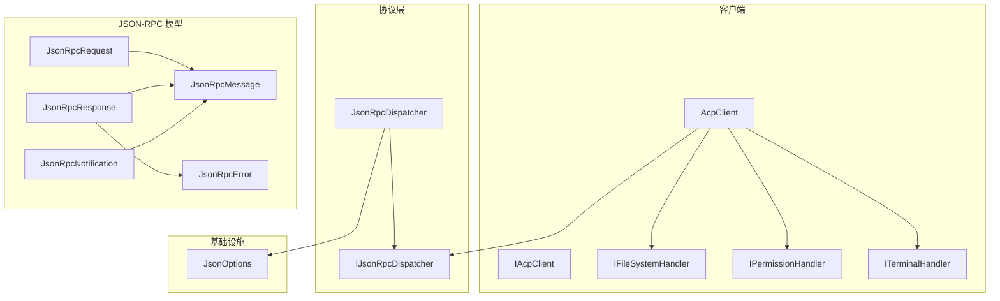
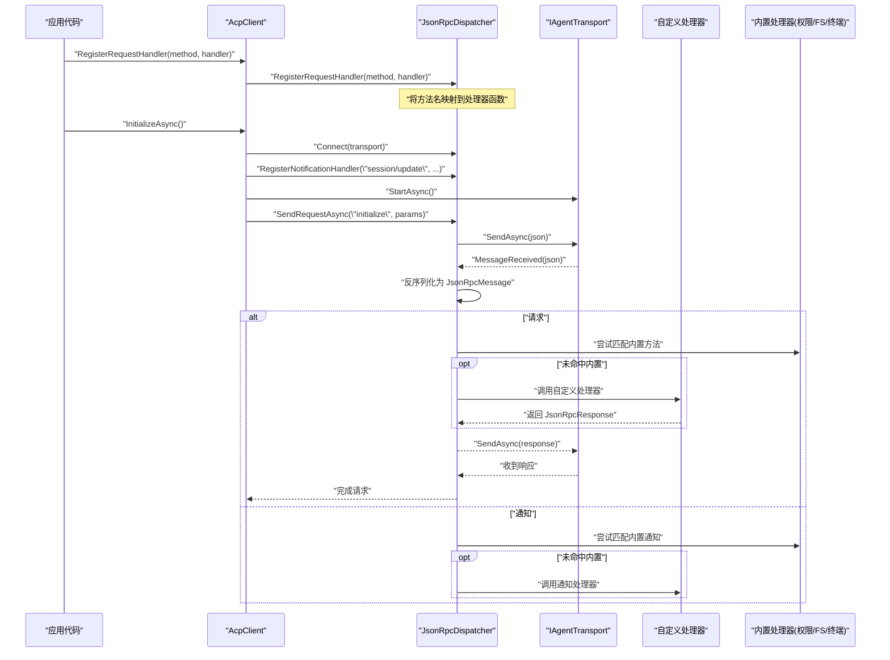
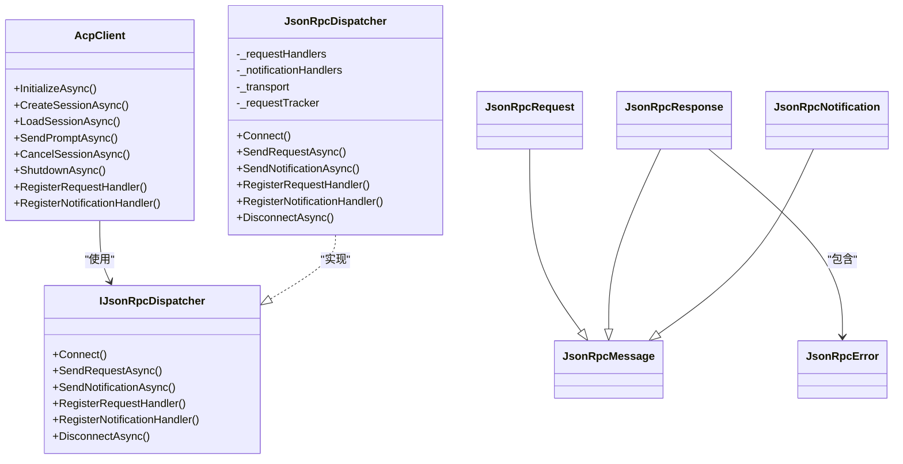
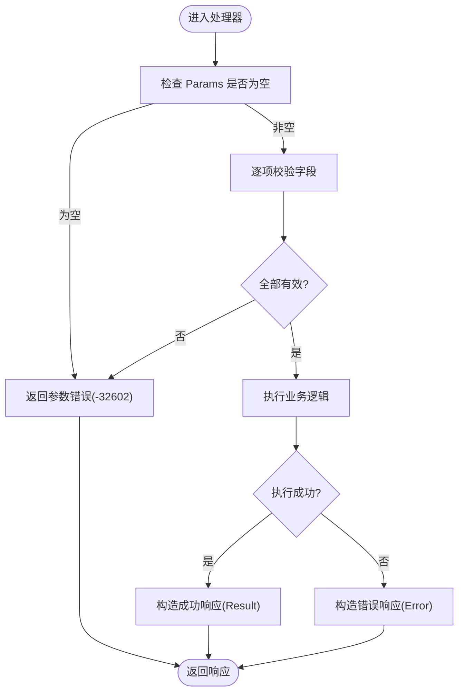

# 扩展点注册

<cite>
**本文引用的文件**   
- [AcpClient.cs](file://Client/AcpClient.cs)
- [IAcpClient.cs](file://Client/IAcpClient.cs)
- [IFileSystemHandler.cs](file://Client/IFileSystemHandler.cs)
- [IPermissionHandler.cs](file://Client/IPermissionHandler.cs)
- [ITerminalHandler.cs](file://Client/ITerminalHandler.cs)
- [JsonRpcDispatcher.cs](file://Protocol/JsonRpcDispatcher.cs)
- [IJsonRpcDispatcher.cs](file://Protocol/IJsonRpcDispatcher.cs)
- [JsonRpcRequest.cs](file://JsonRpc/JsonRpcRequest.cs)
- [JsonRpcResponse.cs](file://JsonRpc/JsonRpcResponse.cs)
- [JsonRpcNotification.cs](file://JsonRpc/JsonRpcNotification.cs)
- [JsonRpcError.cs](file://JsonRpc/JsonRpcError.cs)
- [JsonRpcMessage.cs](file://JsonRpc/JsonRpcMessage.cs)
- [JsonOptions.cs](file://Infrastructure/JsonOptions.cs)
</cite>

## 目录
1. [简介](#简介)
2. [项目结构](#项目结构)
3. [核心组件](#核心组件)
4. [架构总览](#架构总览)
5. [详细组件分析](#详细组件分析)
6. [依赖关系分析](#依赖关系分析)
7. [性能考虑](#性能考虑)
8. [故障排查指南](#故障排查指南)
9. [结论](#结论)
10. [附录：扩展点使用示例与最佳实践](#附录扩展点使用示例与最佳实践)

## 简介
本文件聚焦客户端扩展点机制，详细说明如何通过 RegisterRequestHandler 和 RegisterNotificationHandler 注册自定义 JSON-RPC 方法与通知处理器，涵盖参数验证、业务逻辑处理、响应格式化与错误处理策略。同时解释 JsonRpcRequest、JsonRpcResponse、JsonRpcNotification 等对象的结构与用法，并阐述扩展点与内置功能（权限、文件系统、终端）的集成方式与优先级处理。

## 项目结构
- Client 层提供 AcpClient 作为对外客户端，封装初始化、会话管理、以及扩展点注册能力。
- Protocol 层实现 IJsonRpcDispatcher 接口与 JsonRpcDispatcher 具体实现，负责消息分发、请求跟踪与处理器路由。
- JsonRpc 层定义 JSON-RPC 2.0 的消息类型与错误模型。
- Infrastructure 层提供统一的 JsonSerializerOptions，确保序列化行为一致。

图表来源
- [AcpClient.cs:1-361](file://Client/AcpClient.cs#L1-L361)
- [IAcpClient.cs:1-59](file://Client/IAcpClient.cs#L1-L59)
- [IFileSystemHandler.cs:1-14](file://Client/IFileSystemHandler.cs#L1-L14)
- [IPermissionHandler.cs:1-17](file://Client/IPermissionHandler.cs#L1-L17)
- [ITerminalHandler.cs:1-23](file://Client/ITerminalHandler.cs#L1-L23)
- [IJsonRpcDispatcher.cs:1-14](file://Protocol/IJsonRpcDispatcher.cs#L1-L14)
- [JsonRpcDispatcher.cs:1-124](file://Protocol/JsonRpcDispatcher.cs#L1-L124)
- [JsonRpcMessage.cs:1-14](file://JsonRpc/JsonRpcMessage.cs#L1-L14)
- [JsonRpcRequest.cs:1-19](file://JsonRpc/JsonRpcRequest.cs#L1-L19)
- [JsonRpcResponse.cs:1-20](file://JsonRpc/JsonRpcResponse.cs#L1-L20)
- [JsonRpcNotification.cs:1-16](file://JsonRpc/JsonRpcNotification.cs#L1-L16)
- [JsonRpcError.cs:1-19](file://JsonRpc/JsonRpcError.cs#L1-L19)
- [JsonOptions.cs:1-28](file://Infrastructure/JsonOptions.cs#L1-L28)

章节来源
- [AcpClient.cs:1-361](file://Client/AcpClient.cs#L1-L361)
- [JsonRpcDispatcher.cs:1-124](file://Protocol/JsonRpcDispatcher.cs#L1-L124)
- [JsonOptions.cs:1-28](file://Infrastructure/JsonOptions.cs#L1-L28)

## 核心组件
- IJsonRpcDispatcher：定义连接、发送请求/通知、注册处理器、断开等能力。
- JsonRpcDispatcher：维护请求与通知处理器字典，接收消息后按 method 分发给对应处理器；对请求进行异步等待与完成。
- AcpClient：对外暴露 RegisterRequestHandler/RegisterNotificationHandler，并在 InitializeAsync 中注册内置处理器（权限、文件系统、终端），同时订阅 session/update 通知事件。
- JsonRpcRequest/JsonRpcResponse/JsonRpcNotification/JsonRpcError：JSON-RPC 2.0 消息与错误模型，统一通过 System.Text.Json 序列化。

章节来源
- [IJsonRpcDispatcher.cs:1-14](file://Protocol/IJsonRpcDispatcher.cs#L1-L14)
- [JsonRpcDispatcher.cs:1-124](file://Protocol/JsonRpcDispatcher.cs#L1-L124)
- [AcpClient.cs:1-361](file://Client/AcpClient.cs#L1-L361)
- [JsonRpcRequest.cs:1-19](file://JsonRpc/JsonRpcRequest.cs#L1-L19)
- [JsonRpcResponse.cs:1-20](file://JsonRpc/JsonRpcResponse.cs#L1-L20)
- [JsonRpcNotification.cs:1-16](file://JsonRpc/JsonRpcNotification.cs#L1-L16)
- [JsonRpcError.cs:1-19](file://JsonRpc/JsonRpcError.cs#L1-L19)

## 架构总览
下图展示从外部调用到内部分发的完整流程，包括扩展点注册与内置处理器并存时的处理顺序。

图表来源
- [AcpClient.cs:48-182](file://Client/AcpClient.cs#L48-L182)
- [JsonRpcDispatcher.cs:21-84](file://Protocol/JsonRpcDispatcher.cs#L21-L84)
- [JsonRpcDispatcher.cs:86-124](file://Protocol/JsonRpcDispatcher.cs#L86-L124)

## 详细组件分析

### JsonRpcRequest / JsonRpcResponse / JsonRpcNotification / JsonRpcError
- JsonRpcRequest：包含 id、method、可选 params（JsonElement）。用于请求方发起带参数的方法调用。
- JsonRpcResponse：包含 id、可选 result（JsonElement）、可选 error（JsonRpcError）。用于响应请求。
- JsonRpcNotification：包含 method、可选 params（JsonElement）。无 id，表示单向通知。
- JsonRpcError：包含 code、message、可选 data（JsonElement）。用于错误响应。

这些类型均基于 JsonRpcMessage 基类，统一 jsonrpc 字段为 "2.0"。序列化由 JsonOptions.Default 配置，支持属性名大小写不敏感、忽略 null、允许元数据属性乱序，并注册了 JsonRpcMessageConverter 以区分消息类型。

章节来源
- [JsonRpcRequest.cs:1-19](file://JsonRpc/JsonRpcRequest.cs#L1-L19)
- [JsonRpcResponse.cs:1-20](file://JsonRpc/JsonRpcResponse.cs#L1-L20)
- [JsonRpcNotification.cs:1-16](file://JsonRpc/JsonRpcNotification.cs#L1-L16)
- [JsonRpcError.cs:1-19](file://JsonRpc/JsonRpcError.cs#L1-L19)
- [JsonRpcMessage.cs:1-14](file://JsonRpc/JsonRpcMessage.cs#L1-L14)
- [JsonOptions.cs:1-28](file://Infrastructure/JsonOptions.cs#L1-L28)

### IJsonRpcDispatcher 与 JsonRpcDispatcher
- IJsonRpcDispatcher：定义 Connect、SendRequestAsync、SendNotificationAsync、RegisterRequestHandler、RegisterNotificationHandler、DisconnectAsync。
- JsonRpcDispatcher：
  - 使用 ConcurrentDictionary 存储请求与通知处理器，按 method 精确匹配。
  - SendRequestAsync：创建待处理请求，序列化并发送，等待响应完成。
  - SendNotificationAsync：序列化并发送通知。
  - OnMessageReceivedAsync：反序列化消息，根据类型分发到相应处理器或完成请求。
  - 异常处理：当前对反序列化失败或处理器异常采用忽略策略（catch 空异常），建议上层补充日志与监控。

章节来源
- [IJsonRpcDispatcher.cs:1-14](file://Protocol/IJsonRpcDispatcher.cs#L1-L14)
- [JsonRpcDispatcher.cs:1-124](file://Protocol/JsonRpcDispatcher.cs#L1-L124)

### AcpClient 扩展点集成
- AcpClient 暴露 RegisterRequestHandler/RegisterNotificationHandler，直接转发给底层 dispatcher。
- 在 InitializeAsync 中注册内置处理器：
  - session/request_permission：权限请求，若未设置 PermissionHandler，返回取消结果。
  - fs/read_text_file、fs/write_text_file：文件系统读写，若未设置 FileSystemHandler，返回 -32601 错误。
  - terminal/*：终端相关方法，若未设置 TerminalHandler，返回 -32601 错误。
  - session/update：订阅通知，触发 SessionUpdated 事件。
- 内置处理器优先于自定义处理器？实际路由逻辑为“先查内置，再查自定义”还是“仅查已注册的处理器”取决于调用顺序与覆盖策略。当前实现中，AcpClient 在 InitializeAsync 内注册内置处理器，而用户可在任意时机调用 RegisterRequestHandler/RegisterNotificationHandler 注册自定义处理器。由于 ConcurrentDictionary 是键值覆盖语义，后注册的处理器会覆盖同方法名的前一个处理器。因此，注册顺序决定最终生效的处理器。

章节来源
- [AcpClient.cs:64-147](file://Client/AcpClient.cs#L64-L147)
- [AcpClient.cs:250-359](file://Client/AcpClient.cs#L250-L359)
- [IAcpClient.cs:53-58](file://Client/IAcpClient.cs#L53-L58)

### 扩展点使用方法
- 注册请求处理器：
  - 通过 AcpClient.RegisterRequestHandler 或 IJsonRpcDispatcher.RegisterRequestHandler 注册。
  - 处理器签名：Func<JsonRpcRequest, Task<JsonRpcResponse>>。
  - 典型步骤：解析 Params（JsonElement）、参数校验、执行业务逻辑、构造 JsonRpcResponse（Result 或 Error）。
- 注册通知处理器：
  - 通过 AcpClient.RegisterNotificationHandler 或 IJsonRpcDispatcher.RegisterNotificationHandler 注册。
  - 处理器签名：Func<JsonRpcNotification, Task>。
  - 典型步骤：解析 Params（JsonElement）、参数校验、执行业务逻辑（无需返回）。

章节来源
- [IAcpClient.cs:53-58](file://Client/IAcpClient.cs#L53-L58)
- [IJsonRpcDispatcher.cs:10-11](file://Protocol/IJsonRpcDispatcher.cs#L10-L11)
- [JsonRpcDispatcher.cs:66-74](file://Protocol/JsonRpcDispatcher.cs#L66-L74)

### 参数验证与错误处理策略
- 参数验证：
  - 使用 JsonElement 访问 Params，推荐先检查是否为 null，再按需读取属性（如 GetString、TryGetProperty）。
  - 对必填字段进行存在性与类型校验，缺失时返回标准错误码（例如 -32602 参数错误）。
- 错误处理：
  - 当缺少必要处理器（如 PermissionHandler/FileSystemHandler/TerminalHandler）时，返回 -32601 方法不存在或资源不可用。
  - 业务异常应转换为 JsonRpcError，包含合理的 code 与 message，必要时附带 data。
  - 对于通知处理器，避免抛出未捕获异常；如需记录，应在处理器内部 try/catch 并写入日志。

章节来源
- [AcpClient.cs:75-147](file://Client/AcpClient.cs#L75-L147)
- [AcpClient.cs:253-359](file://Client/AcpClient.cs#L253-L359)
- [JsonRpcError.cs:1-19](file://JsonRpc/JsonRpcError.cs#L1-L19)

### 响应格式化
- 成功响应：构造 JsonRpcResponse，设置 Id 与 Result（使用 JsonSerializer.SerializeToElement 将业务对象序列化为 JsonElement）。
- 失败响应：构造 JsonRpcResponse，设置 Id 与 Error（Code、Message、Data）。
- 注意：Result 与 Error 互斥，遵循 JSON-RPC 2.0 规范。

章节来源
- [JsonRpcResponse.cs:1-20](file://JsonRpc/JsonRpcResponse.cs#L1-L20)
- [AcpClient.cs:75-147](file://Client/AcpClient.cs#L75-L147)

### 扩展点与内置功能的集成与优先级
- 集成方式：
  - AcpClient 在 InitializeAsync 中注册内置处理器；用户可通过 RegisterRequestHandler/RegisterNotificationHandler 注册自定义处理器。
  - 两者共享同一分发器，按 method 精确匹配。
- 优先级处理：
  - 由于处理器存储在 ConcurrentDictionary 中，后注册的处理器会覆盖先前同方法名的处理器。
  - 建议在 InitializeAsync 之前注册自定义处理器，以确保覆盖内置处理器；或在 InitializeAsync 之后注册以覆盖默认行为。
  - 若需保留内置处理器并增强行为，可在自定义处理器中调用原处理器（需要保存原引用或通过组合模式）。

章节来源
- [AcpClient.cs:64-147](file://Client/AcpClient.cs#L64-L147)
- [JsonRpcDispatcher.cs:66-74](file://Protocol/JsonRpcDispatcher.cs#L66-L74)

## 依赖关系分析
- AcpClient 依赖 IAgentTransport、IJsonRpcDispatcher、ILogger。
- JsonRpcDispatcher 依赖 IRequestTracker、IAgentTransport、JsonOptions。
- JsonRpc 模型依赖 System.Text.Json 与 JsonRpcMessageConverter。
- 处理器接口（IPermissionHandler、IFileSystemHandler、ITerminalHandler）由 UI 层实现，AcpClient 在运行时注入。

图表来源
- [AcpClient.cs:1-361](file://Client/AcpClient.cs#L1-L361)
- [IJsonRpcDispatcher.cs:1-14](file://Protocol/IJsonRpcDispatcher.cs#L1-L14)
- [JsonRpcDispatcher.cs:1-124](file://Protocol/JsonRpcDispatcher.cs#L1-L124)
- [JsonRpcRequest.cs:1-19](file://JsonRpc/JsonRpcRequest.cs#L1-L19)
- [JsonRpcResponse.cs:1-20](file://JsonRpc/JsonRpcResponse.cs#L1-L20)
- [JsonRpcNotification.cs:1-16](file://JsonRpc/JsonRpcNotification.cs#L1-L16)
- [JsonRpcError.cs:1-19](file://JsonRpc/JsonRpcError.cs#L1-L19)
- [JsonRpcMessage.cs:1-14](file://JsonRpc/JsonRpcMessage.cs#L1-L14)

章节来源
- [AcpClient.cs:1-361](file://Client/AcpClient.cs#L1-L361)
- [JsonRpcDispatcher.cs:1-124](file://Protocol/JsonRpcDispatcher.cs#L1-L124)

## 性能考虑
- 处理器查找为 O(1) 哈希表查找，性能良好。
- 序列化使用 System.Text.Json，默认选项关闭缩进，减少网络负载。
- 请求跟踪使用任务完成源（TCS），避免阻塞线程。
- 建议：
  - 避免在处理器中进行重 IO 操作阻塞主循环；使用异步 I/O。
  - 对频繁调用的处理器进行缓存或批处理优化。
  - 合理设置 CancellationToken，及时取消长时间运行的任务。

[本节为通用指导，不直接分析具体文件]

## 故障排查指南
- 常见问题：
  - 未连接传输：SendRequestAsync/SendNotificationAsync 在未 Connect 时抛出 InvalidOperationException。
  - 处理器未注册：方法名无法匹配任何处理器，消息被忽略。
  - 参数解析失败：Params 为空或缺少属性，导致业务逻辑异常。
  - 处理器异常：当前实现忽略异常，建议在上层添加日志与监控。
- 排查步骤：
  - 确认已调用 Connect 并正确注册处理器。
  - 检查方法名是否完全匹配（大小写敏感）。
  - 打印 Params 原始文本进行调试。
  - 在处理器内部 try/catch 并记录错误信息。

章节来源
- [JsonRpcDispatcher.cs:27-31](file://Protocol/JsonRpcDispatcher.cs#L27-L31)
- [JsonRpcDispatcher.cs:86-124](file://Protocol/JsonRpcDispatcher.cs#L86-L124)

## 结论
扩展点机制通过 RegisterRequestHandler 与 RegisterNotificationHandler 提供了灵活的自定义处理能力。结合 JsonRpcRequest/JsonRpcResponse/JsonRpcNotification 模型，可实现完整的 JSON-RPC 2.0 交互。内置处理器与自定义处理器共享同一分发器，注册顺序决定优先级。建议严格进行参数验证与错误处理，确保系统稳定性与可观测性。

[本节为总结，不直接分析具体文件]

## 附录：扩展点使用示例与最佳实践

### 自定义请求处理器示例（路径参考）
- 注册位置：AcpClient.RegisterRequestHandler 或 IJsonRpcDispatcher.RegisterRequestHandler。
- 处理器职责：
  - 解析 Params（JsonElement）。
  - 参数校验（非空、类型、范围）。
  - 执行业务逻辑（异步）。
  - 构造 JsonRpcResponse（Result 或 Error）。
- 参考路径：
  - [AcpClient.cs:75-147](file://Client/AcpClient.cs#L75-L147)
  - [AcpClient.cs:253-359](file://Client/AcpClient.cs#L253-L359)

### 自定义通知处理器示例（路径参考）
- 注册位置：AcpClient.RegisterNotificationHandler 或 IJsonRpcDispatcher.RegisterNotificationHandler。
- 处理器职责：
  - 解析 Params（JsonElement）。
  - 参数校验。
  - 执行业务逻辑（无需返回）。
- 参考路径：
  - [AcpClient.cs:64-73](file://Client/AcpClient.cs#L64-L73)

### 参数验证流程图（路径参考）

图表来源
- [AcpClient.cs:75-147](file://Client/AcpClient.cs#L75-L147)
- [JsonRpcError.cs:1-19](file://JsonRpc/JsonRpcError.cs#L1-L19)

### 错误处理策略（路径参考）
- 标准错误码：
  - -32601：方法不存在或资源不可用（当处理器未实现或未注入）。
  - -32602：参数错误（参数缺失或类型不符）。
  - -32603：服务器内部错误（业务异常）。
- 错误对象构造：
  - JsonRpcError.Code、Message、Data（可选）。
- 参考路径：
  - [AcpClient.cs:102-147](file://Client/AcpClient.cs#L102-L147)
  - [JsonRpcError.cs:1-19](file://JsonRpc/JsonRpcError.cs#L1-L19)

### 扩展点与内置功能集成（路径参考）
- 内置处理器：
  - session/request_permission：权限请求。
  - fs/read_text_file、fs/write_text_file：文件系统读写。
  - terminal/*：终端操作。
  - session/update：会话更新通知。
- 自定义处理器覆盖：
  - 在 InitializeAsync 之前注册自定义处理器以覆盖内置行为。
  - 或在 InitializeAsync 之后注册以覆盖默认实现。
- 参考路径：
  - [AcpClient.cs:64-147](file://Client/AcpClient.cs#L64-L147)
  - [AcpClient.cs:250-359](file://Client/AcpClient.cs#L250-L359)

章节来源
- [AcpClient.cs:64-147](file://Client/AcpClient.cs#L64-L147)
- [AcpClient.cs:250-359](file://Client/AcpClient.cs#L250-L359)
- [JsonRpcError.cs:1-19](file://JsonRpc/JsonRpcError.cs#L1-L19)