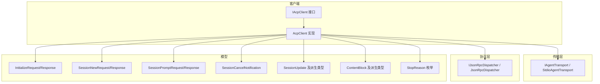
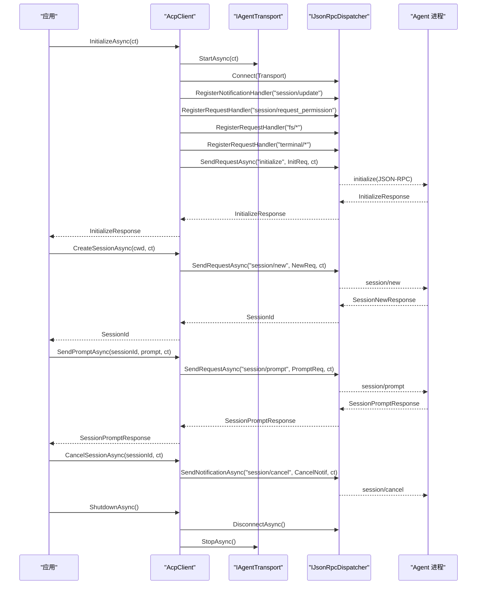
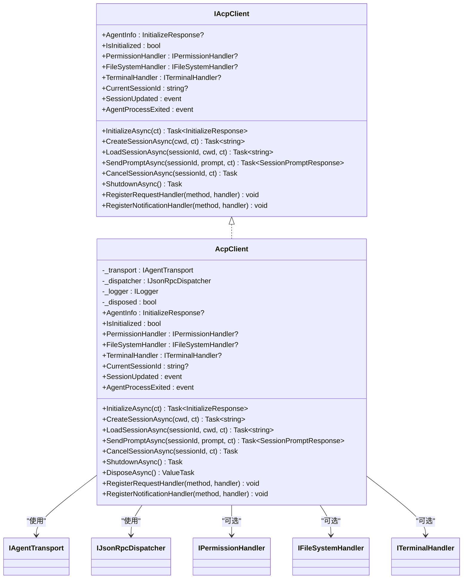
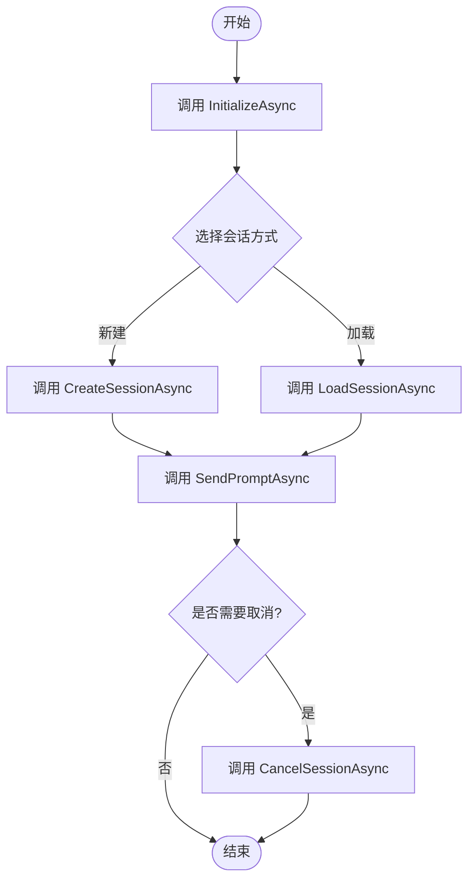

# 核心方法参考

<cite>
**本文引用的文件**
- [AcpClient.cs](file://Client/AcpClient.cs)
- [IAcpClient.cs](file://Client/IAcpClient.cs)
- [SessionPromptRequest.cs](file://Models/SessionPromptRequest.cs)
- [SessionNewRequest.cs](file://Models/SessionNewRequest.cs)
- [InitializeRequest.cs](file://Models/InitializeRequest.cs)
- [InitializeResponse.cs](file://Models/InitializeResponse.cs)
- [SessionCancelNotification.cs](file://Models/SessionCancelNotification.cs)
- [SessionUpdate.cs](file://Models/SessionUpdate.cs)
- [ContentBlock.cs](file://Models/ContentBlock.cs)
- [StopReason.cs](file://Models/Enums/StopReason.cs)
- [IPermissionHandler.cs](file://Client/IPermissionHandler.cs)
- [IFileSystemHandler.cs](file://Client/IFileSystemHandler.cs)
- [ITerminalHandler.cs](file://Client/ITerminalHandler.cs)
- [RequestPermissionRequest.cs](file://Models/RequestPermissionRequest.cs)
- [ToolCall.cs](file://Models/ToolCall.cs)
- [README.md](file://README.md)
</cite>

## 目录
1. [简介](#简介)
2. [项目结构](#项目结构)
3. [核心组件](#核心组件)
4. [架构总览](#架构总览)
5. [详细组件分析](#详细组件分析)
6. [依赖关系分析](#依赖关系分析)
7. [性能考量](#性能考量)
8. [故障排查指南](#故障排查指南)
9. [结论](#结论)
10. [附录](#附录)

## 简介
本文件为 AcpClient 的核心 API 参考，聚焦以下方法的完整签名、参数说明、返回值类型、异常与错误处理策略、使用场景与调用时机、最佳实践（含 CancellationToken 使用、超时处理、资源清理），以及方法间的依赖关系和执行顺序要求。内容基于代码库中的实现与模型定义进行整理，确保与实际行为一致。

## 项目结构
- Client：客户端接口与实现，包含 AcpClient 与 IAcpClient，以及各类 Handler 接口（权限、文件系统、终端）。
- Models：协议数据模型，包括初始化、会话、提示请求/响应、更新通知、工具调用等。
- Transport：传输抽象与 stdio 实现。
- Protocol：JSON-RPC 分发器与请求跟踪。
- Infrastructure：序列化选项与服务扩展。

图表来源
- [AcpClient.cs:12-45](file://Client/AcpClient.cs#L12-L45)
- [IAcpClient.cs:9-58](file://Client/IAcpClient.cs#L9-L58)
- [SessionPromptRequest.cs:6-19](file://Models/SessionPromptRequest.cs#L6-L19)
- [SessionNewRequest.cs:5-19](file://Models/SessionNewRequest.cs#L5-L19)
- [InitializeRequest.cs:5-15](file://Models/InitializeRequest.cs#L5-L15)
- [InitializeResponse.cs:5-18](file://Models/InitializeResponse.cs#L5-L18)
- [SessionCancelNotification.cs:5-9](file://Models/SessionCancelNotification.cs#L5-L9)
- [SessionUpdate.cs:18-22](file://Models/SessionUpdate.cs#L18-L22)
- [ContentBlock.cs:15-17](file://Models/ContentBlock.cs#L15-L17)
- [StopReason.cs:6-18](file://Models/Enums/StopReason.cs#L6-L18)

章节来源
- [README.md:1-33](file://README.md#L1-L33)

## 核心组件
- IAcpClient：定义客户端契约，包括生命周期方法、事件、处理器属性与扩展点。
- AcpClient：默认实现，封装传输启动、JSON-RPC 握手、会话管理、提示发送、取消与关闭，并注册内置的权限、文件系统、终端处理器。
- Handlers：IPermissionHandler、IFileSystemHandler、ITerminalHandler，由 UI 层实现以响应 Agent 的请求。

章节来源
- [IAcpClient.cs:9-58](file://Client/IAcpClient.cs#L9-L58)
- [AcpClient.cs:12-45](file://Client/AcpClient.cs#L12-L45)
- [IPermissionHandler.cs:9-16](file://Client/IPermissionHandler.cs#L9-L16)
- [IFileSystemHandler.cs:6-13](file://Client/IFileSystemHandler.cs#L6-L13)
- [ITerminalHandler.cs:6-22](file://Client/ITerminalHandler.cs#L6-L22)

## 架构总览
AcpClient 通过 IAgentTransport 启动与停止进程通信，借助 IJsonRpcDispatcher 完成 JSON-RPC 请求/通知的分发与处理。InitializeAsync 负责建立连接并完成握手；CreateSessionAsync/LoadSessionAsync 管理会话；SendPromptAsync 发送提示并等待响应；CancelSessionAsync 发送取消通知；ShutdownAsync 断开连接并释放资源。

图表来源
- [AcpClient.cs:48-182](file://Client/AcpClient.cs#L48-L182)
- [AcpClient.cs:185-224](file://Client/AcpClient.cs#L185-L224)
- [AcpClient.cs:226-233](file://Client/AcpClient.cs#L226-L233)
- [SessionPromptRequest.cs:6-19](file://Models/SessionPromptRequest.cs#L6-L19)
- [SessionNewRequest.cs:5-19](file://Models/SessionNewRequest.cs#L5-L19)
- [InitializeRequest.cs:5-15](file://Models/InitializeRequest.cs#L5-L15)
- [InitializeResponse.cs:5-18](file://Models/InitializeResponse.cs#L5-L18)
- [SessionCancelNotification.cs:5-9](file://Models/SessionCancelNotification.cs#L5-L9)

## 详细组件分析

### InitializeAsync
- 功能：启动传输、连接分发器、注册通知与请求处理器、执行 initialize 握手、保存 AgentInfo、检查协议版本。
- 签名：Task<InitializeResponse> InitializeAsync(CancellationToken ct = default)
- 参数：
  - ct：取消令牌，用于取消传输启动与握手请求。
- 返回值：InitializeResponse，包含协议版本、Agent 能力、Agent 信息与认证方法列表。
- 异常与错误：
  - 传输启动失败或握手失败会抛出异常（由底层传输与分发器抛出）。
  - 若未设置 PermissionHandler/FileSystemHandler/TerminalHandler，对应请求将返回“不可用”的错误响应（不会抛异常到调用方）。
- 使用场景与时机：
  - 在创建 AcpClient 后、任何会话操作之前必须调用。
  - 适合在应用启动时一次性调用，并在整个生命周期内复用该实例。
- 最佳实践：
  - 传入合理的超时取消令牌，避免长时间阻塞。
  - 订阅 SessionUpdated 与 AgentProcessExited 事件以处理流式更新与进程退出。
  - 在调用前设置 PermissionHandler、FileSystemHandler、TerminalHandler，以获得完整的交互能力。
- 依赖关系：
  - 依赖 IAgentTransport.StartAsync、IJsonRpcDispatcher.Connect、Register* 方法与 SendRequestAsync。

章节来源
- [AcpClient.cs:48-182](file://Client/AcpClient.cs#L48-L182)
- [InitializeRequest.cs:5-15](file://Models/InitializeRequest.cs#L5-L15)
- [InitializeResponse.cs:5-18](file://Models/InitializeResponse.cs#L5-L18)
- [IPermissionHandler.cs:9-16](file://Client/IPermissionHandler.cs#L9-L16)
- [IFileSystemHandler.cs:6-13](file://Client/IFileSystemHandler.cs#L6-L13)
- [ITerminalHandler.cs:6-22](file://Client/ITerminalHandler.cs#L6-L22)

### CreateSessionAsync
- 功能：创建新会话，设置 CurrentSessionId。
- 签名：Task<string> CreateSessionAsync(string cwd, CancellationToken ct = default)
- 参数：
  - cwd：工作目录字符串。
  - ct：取消令牌。
- 返回值：新会话的 sessionId。
- 异常与错误：
  - 如果 session/new 请求失败（网络/协议错误）会抛出异常。
- 使用场景与时机：
  - 在 InitializeAsync 成功后调用，用于开始新的对话上下文。
- 最佳实践：
  - 合理设置 cwd，确保 Agent 能访问所需资源。
  - 结合取消令牌控制超时。
- 依赖关系：
  - 依赖 IJsonRpcDispatcher.SendRequestAsync 发送 session/new。

章节来源
- [AcpClient.cs:185-195](file://Client/AcpClient.cs#L185-L195)
- [SessionNewRequest.cs:5-19](file://Models/SessionNewRequest.cs#L5-L19)

### LoadSessionAsync
- 功能：加载已有会话，设置 CurrentSessionId。
- 签名：Task<string> LoadSessionAsync(string sessionId, string cwd, CancellationToken ct = default)
- 参数：
  - sessionId：要加载的会话标识。
  - cwd：工作目录字符串。
  - ct：取消令牌。
- 返回值：当前会话的 sessionId（即传入的 sessionId）。
- 异常与错误：
  - 如果 session/load 请求失败会抛出异常。
- 使用场景与时机：
  - 当需要恢复之前的会话上下文时使用。
- 最佳实践：
  - 确保 sessionId 有效且未被销毁。
  - 与 CreateSessionAsync 二选一，不要混用同一会话 ID。
- 依赖关系：
  - 依赖 IJsonRpcDispatcher.SendRequestAsync 发送 session/load。

章节来源
- [AcpClient.cs:198-205](file://Client/AcpClient.cs#L198-L205)

### SendPromptAsync
- 功能：向指定会话发送提示并等待响应；流式更新通过 SessionUpdated 事件推送。
- 签名：Task<SessionPromptResponse> SendPromptAsync(string sessionId, List<ContentBlock> prompt, CancellationToken ct = default)
- 参数：
  - sessionId：目标会话标识。
  - prompt：内容块列表，支持文本、图像、音频、资源等类型。
  - ct：取消令牌。
- 返回值：SessionPromptResponse，包含 stopReason（结束原因）。
- 异常与错误：
  - 如果 session/prompt 请求失败会抛出异常。
- 使用场景与时机：
  - 在已创建或加载的会话中发起一次对话轮次。
- 最佳实践：
  - 构建合适的 ContentBlock 列表，避免过大负载。
  - 订阅 SessionUpdated 以实时接收流式消息、工具调用与用量更新。
  - 使用取消令牌控制长耗时请求。
- 依赖关系：
  - 依赖 IJsonRpcDispatcher.SendRequestAsync 发送 session/prompt。
  - 依赖 SessionUpdate 及其派生类型进行流式通知处理。

章节来源
- [AcpClient.cs:208-216](file://Client/AcpClient.cs#L208-L216)
- [SessionPromptRequest.cs:6-19](file://Models/SessionPromptRequest.cs#L6-L19)
- [SessionUpdate.cs:18-22](file://Models/SessionUpdate.cs#L18-L22)
- [ContentBlock.cs:15-17](file://Models/ContentBlock.cs#L15-L17)
- [StopReason.cs:6-18](file://Models/Enums/StopReason.cs#L6-L18)

### CancelSessionAsync
- 功能：取消正在进行的会话操作（如提示处理）。
- 签名：Task CancelSessionAsync(string sessionId, CancellationToken ct = default)
- 参数：
  - sessionId：目标会话标识。
  - ct：取消令牌。
- 返回值：无（异步通知）。
- 异常与错误：
  - 如果 session/cancel 通知发送失败会抛出异常。
- 使用场景与时机：
  - 用户主动取消或需要中断长时间运行的任务时调用。
- 最佳实践：
  - 在取消令牌触发时优先调用此方法，再释放上层资源。
- 依赖关系：
  - 依赖 IJsonRpcDispatcher.SendNotificationAsync 发送 session/cancel。

章节来源
- [AcpClient.cs:219-224](file://Client/AcpClient.cs#L219-L224)
- [SessionCancelNotification.cs:5-9](file://Models/SessionCancelNotification.cs#L5-L9)

### ShutdownAsync
- 功能：安全关闭客户端，断开分发器并停止传输。
- 签名：Task ShutdownAsync()
- 参数：无。
- 返回值：无。
- 异常与错误：
  - 内部已做重复调用保护（_disposed 标志）。
- 使用场景与时机：
  - 应用退出或不再需要 ACP 连接时调用。
- 最佳实践：
  - 在 DisposeAsync 中调用，确保资源释放。
  - 先取消所有活跃请求，再调用 ShutdownAsync。
- 依赖关系：
  - 依赖 IJsonRpcDispatcher.DisconnectAsync 与 IAgentTransport.StopAsync。

章节来源
- [AcpClient.cs:226-233](file://Client/AcpClient.cs#L226-L233)

## 依赖关系分析
- AcpClient 对 IAgentTransport 与 IJsonRpcDispatcher 的耦合度较高，但通过接口解耦，便于替换实现。
- 模型类之间通过 JSON 序列化进行通信，SessionUpdate 与 ContentBlock 使用多态判别字段，保证向后兼容。
- 事件驱动：SessionUpdated 与 AgentProcessExited 提供异步回调机制，降低同步耦合。

图表来源
- [IAcpClient.cs:9-58](file://Client/IAcpClient.cs#L9-L58)
- [AcpClient.cs:12-45](file://Client/AcpClient.cs#L12-L45)
- [IPermissionHandler.cs:9-16](file://Client/IPermissionHandler.cs#L9-L16)
- [IFileSystemHandler.cs:6-13](file://Client/IFileSystemHandler.cs#L6-L13)
- [ITerminalHandler.cs:6-22](file://Client/ITerminalHandler.cs#L6-L22)

章节来源
- [AcpClient.cs:12-45](file://Client/AcpClient.cs#L12-L45)
- [IAcpClient.cs:9-58](file://Client/IAcpClient.cs#L9-L58)

## 性能考量
- 流式更新：SessionUpdated 事件用于增量推送，避免频繁轮询，提升吞吐与延迟表现。
- 取消令牌：所有异步方法均支持 ct，建议在 UI 层或上层服务中统一管理与传播，避免无效等待。
- 资源释放：及时调用 ShutdownAsync 或 DisposeAsync，防止进程句柄与网络连接泄漏。
- 序列化开销：ContentBlock 与 SessionUpdate 的多态解析可能带来一定开销，建议批量处理与缓存常用对象。

[本节为通用指导，不直接分析具体文件]

## 故障排查指南
- 初始化失败：
  - 检查传输是否成功启动（StdioAgentTransport 路径与参数是否正确）。
  - 确认 InitializeAsync 的握手响应是否包含期望的协议版本与能力。
- 权限/文件/终端请求无响应：
  - 确认已设置对应的 PermissionHandler/FileSystemHandler/TerminalHandler。
  - 检查处理器实现是否返回正确的 JSON-RPC 响应。
- 会话操作异常：
  - 验证 sessionId 是否有效且未被销毁。
  - 查看 SessionUpdated 事件是否收到预期更新。
- 进程退出：
  - 订阅 AgentProcessExited 事件，记录退出码并做优雅降级。

章节来源
- [AcpClient.cs:48-182](file://Client/AcpClient.cs#L48-L182)
- [AcpClient.cs:226-233](file://Client/AcpClient.cs#L226-L233)
- [IPermissionHandler.cs:9-16](file://Client/IPermissionHandler.cs#L9-L16)
- [IFileSystemHandler.cs:6-13](file://Client/IFileSystemHandler.cs#L6-L13)
- [ITerminalHandler.cs:6-22](file://Client/ITerminalHandler.cs#L6-L22)

## 结论
AcpClient 提供了清晰的 ACP 客户端 API，覆盖初始化、会话管理、提示发送、取消与关闭等关键流程。通过事件驱动的流式更新与可扩展的处理器接口，能够灵活适配不同 UI 与业务需求。遵循本文的最佳实践与错误处理策略，可显著提升稳定性与用户体验。

[本节为总结性内容，不直接分析具体文件]

## 附录

### 方法间依赖与执行顺序
- 必须先调用 InitializeAsync，再进行任何会话操作。
- CreateSessionAsync 与 LoadSessionAsync 二选一，用于获取或恢复会话。
- SendPromptAsync 依赖于有效的 sessionId。
- CancelSessionAsync 可在 SendPromptAsync 进行中调用以中断。
- ShutdownAsync 应在应用退出时调用，确保资源释放。

图表来源
- [AcpClient.cs:48-224](file://Client/AcpClient.cs#L48-L224)

### 典型使用示例（步骤指引）
- 创建传输与分发器，构造 AcpClient。
- 设置 PermissionHandler/FileSystemHandler/TerminalHandler。
- 调用 InitializeAsync 完成握手。
- 调用 CreateSessionAsync 或 LoadSessionAsync 管理会话。
- 构建 ContentBlock 列表，调用 SendPromptAsync 发送提示。
- 订阅 SessionUpdated 处理流式更新。
- 需要时调用 CancelSessionAsync 取消操作。
- 应用退出时调用 ShutdownAsync 或 DisposeAsync。

章节来源
- [README.md:15-33](file://README.md#L15-L33)
- [AcpClient.cs:48-233](file://Client/AcpClient.cs#L48-L233)
- [ContentBlock.cs:15-17](file://Models/ContentBlock.cs#L15-L17)