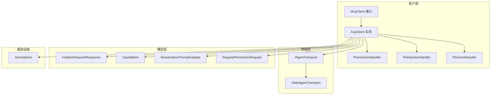
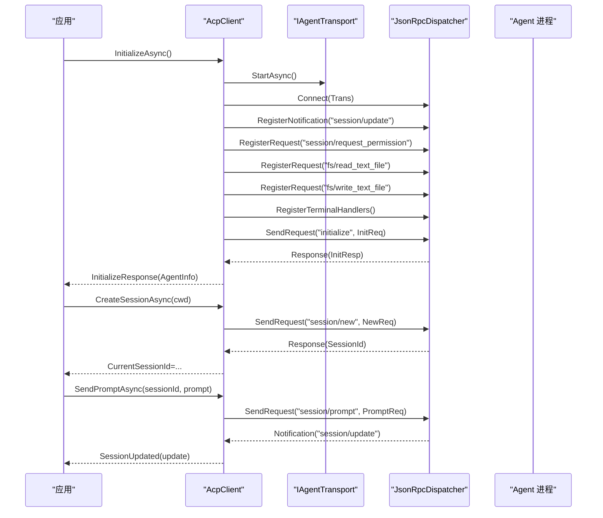
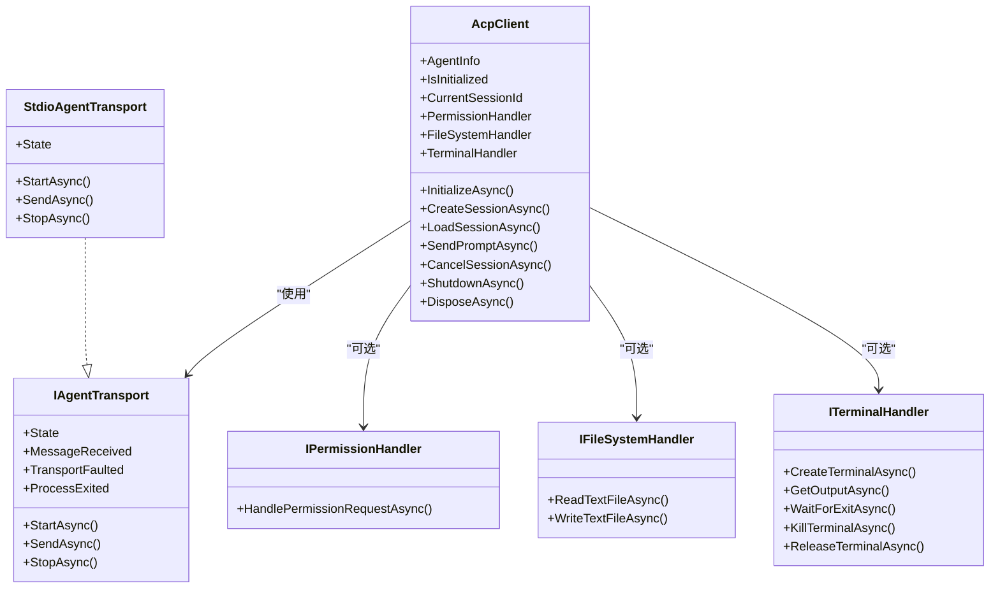

# 配置和属性

<cite>
**本文引用的文件**   
- [AcpClient.cs](file://Client/AcpClient.cs)
- [IAcpClient.cs](file://Client/IAcpClient.cs)
- [IPermissionHandler.cs](file://Client/IPermissionHandler.cs)
- [IFileSystemHandler.cs](file://Client/IFileSystemHandler.cs)
- [ITerminalHandler.cs](file://Client/ITerminalHandler.cs)
- [InitializeRequest.cs](file://Models/InitializeRequest.cs)
- [InitializeResponse.cs](file://Models/InitializeResponse.cs)
- [Capabilities.cs](file://Models/Capabilities.cs)
- [SessionNewRequest.cs](file://Models/SessionNewRequest.cs)
- [SessionPromptRequest.cs](file://Models/SessionPromptRequest.cs)
- [SessionUpdate.cs](file://Models/SessionUpdate.cs)
- [RequestPermissionRequest.cs](file://Models/RequestPermissionRequest.cs)
- [IAgentTransport.cs](file://Transport/IAgentTransport.cs)
- [StdioAgentTransport.cs](file://Transport/StdioAgentTransport.cs)
- [JsonOptions.cs](file://Infrastructure/JsonOptions.cs)
</cite>

## 目录
1. [简介](#简介)
2. [项目结构](#项目结构)
3. [核心组件](#核心组件)
4. [架构总览](#架构总览)
5. [详细组件分析](#详细组件分析)
6. [依赖关系分析](#依赖关系分析)
7. [性能与可靠性建议](#性能与可靠性建议)
8. [故障排查指南](#故障排查指南)
9. [结论](#结论)
10. [附录：配置示例与最佳实践](#附录配置示例与最佳实践)

## 简介
本文件聚焦 AcpClient 的配置与属性，系统性说明只读属性（如 AgentInfo、IsInitialized、CurrentSessionId）的含义与使用方式；详述处理器属性（PermissionHandler、FileSystemHandler、TerminalHandler）的设置方法与选项；解释客户端状态管理、生命周期管理与资源清理机制；并提供不同环境下的配置示例与最佳实践，包括连接与超时、重试策略等。

## 项目结构
- Client 层定义客户端接口与实现，以及三类处理器接口（权限、文件系统、终端）。
- Models 层定义协议模型（初始化请求/响应、会话、能力集、更新通知等）。
- Transport 层抽象传输通道，提供基于子进程 stdio 的实现。
- Infrastructure 层提供 JSON 序列化选项与转换器。

图表来源
- [IAcpClient.cs:1-59](file://Client/IAcpClient.cs#L1-L59)
- [AcpClient.cs:1-361](file://Client/AcpClient.cs#L1-L361)
- [IAgentTransport.cs:1-39](file://Transport/IAgentTransport.cs#L1-L39)
- [StdioAgentTransport.cs:1-147](file://Transport/StdioAgentTransport.cs#L1-L147)
- [InitializeRequest.cs:1-16](file://Models/InitializeRequest.cs#L1-L16)
- [InitializeResponse.cs:1-28](file://Models/InitializeResponse.cs#L1-L28)
- [Capabilities.cs:1-65](file://Models/Capabilities.cs#L1-L65)
- [SessionNewRequest.cs:1-45](file://Models/SessionNewRequest.cs#L1-L45)
- [SessionPromptRequest.cs:1-20](file://Models/SessionPromptRequest.cs#L1-L20)
- [SessionUpdate.cs:1-119](file://Models/SessionUpdate.cs#L1-L119)
- [RequestPermissionRequest.cs:1-47](file://Models/RequestPermissionRequest.cs#L1-L47)
- [JsonOptions.cs:1-28](file://Infrastructure/JsonOptions.cs#L1-L28)

章节来源
- [IAcpClient.cs:1-59](file://Client/IAcpClient.cs#L1-L59)
- [AcpClient.cs:1-361](file://Client/AcpClient.cs#L1-L361)

## 核心组件
- AcpClient：ACP 协议客户端实现，负责启动传输、完成握手、注册处理器、创建/加载会话、发送提示、取消会话、关闭与释放资源。
- 处理器接口：
  - IPermissionHandler：处理 Agent 发起的权限请求，需阻塞直到用户做出选择并返回结果。
  - IFileSystemHandler：处理 fs/* 文件系统读写请求。
  - ITerminalHandler：处理 terminal/* 终端相关请求（创建、输出、等待退出、终止、释放）。
- 传输接口 IAgentTransport：抽象消息收发、事件（消息到达、错误、进程退出）、生命周期（启动/停止）与状态。
- 模型：InitializeRequest/Response、Capabilities、Session* 请求/响应、SessionUpdate 多态更新、权限请求与响应等。

章节来源
- [AcpClient.cs:12-45](file://Client/AcpClient.cs#L12-L45)
- [IAcpClient.cs:9-58](file://Client/IAcpClient.cs#L9-L58)
- [IPermissionHandler.cs:1-17](file://Client/IPermissionHandler.cs#L1-L17)
- [IFileSystemHandler.cs:1-14](file://Client/IFileSystemHandler.cs#L1-L14)
- [ITerminalHandler.cs:1-23](file://Client/ITerminalHandler.cs#L1-L23)
- [IAgentTransport.cs:1-39](file://Transport/IAgentTransport.cs#L1-L39)

## 架构总览
AcpClient 通过 IAgentTransport 与 Agent 进程通信，内部使用 JsonRpcDispatcher 进行 JSON-RPC 分发。初始化阶段建立连接、注册内置处理器（权限、文件系统、终端），发送 initialize 请求并缓存 AgentInfo。会话阶段创建/加载会话，发送 prompt 并通过 SessionUpdated 事件推送流式更新。

图表来源
- [AcpClient.cs:48-182](file://Client/AcpClient.cs#L48-L182)
- [AcpClient.cs:184-224](file://Client/AcpClient.cs#L184-L224)
- [IAgentTransport.cs:1-39](file://Transport/IAgentTransport.cs#L1-L39)

## 详细组件分析

### AcpClient 只读属性与状态
- AgentInfo：初始化完成后由 Agent 返回的 InitializeResponse，包含协议版本、能力集、Agent 信息与认证方法等。用于判断 Agent 能力与兼容性。
- IsInitialized：根据 AgentInfo 是否为空判定是否已完成握手。
- CurrentSessionId：当前活跃会话 ID，在创建或加载会话后设置。
- 事件：
  - SessionUpdated：收到 session/update 通知时触发，携带多态 SessionUpdate 对象。
  - AgentProcessExited：底层进程退出时触发，参数为退出码。

章节来源
- [AcpClient.cs:19-38](file://Client/AcpClient.cs#L19-L38)
- [AcpClient.cs:64-72](file://Client/AcpClient.cs#L64-L72)
- [AcpClient.cs:56-61](file://Client/AcpClient.cs#L56-L61)
- [InitializeResponse.cs:1-28](file://Models/InitializeResponse.cs#L1-L28)
- [SessionUpdate.cs:1-119](file://Models/SessionUpdate.cs#L1-L119)

### 处理器属性与配置
- PermissionHandler：处理 session/request_permission。若未设置，将直接返回“已取消”的结果。
- FileSystemHandler：处理 fs/read_text_file 与 fs/write_text_file。若未设置，返回“文件系统不可用”的错误。
- TerminalHandler：处理 terminal/create、terminal/output、terminal/wait_for_exit、terminal/kill、terminal/release。若未设置，返回“终端处理器不可用”。

章节来源
- [AcpClient.cs:74-99](file://Client/AcpClient.cs#L74-L99)
- [AcpClient.cs:101-144](file://Client/AcpClient.cs#L101-L144)
- [AcpClient.cs:250-359](file://Client/AcpClient.cs#L250-L359)
- [IPermissionHandler.cs:1-17](file://Client/IPermissionHandler.cs#L1-L17)
- [IFileSystemHandler.cs:1-14](file://Client/IFileSystemHandler.cs#L1-L14)
- [ITerminalHandler.cs:1-23](file://Client/ITerminalHandler.cs#L1-L23)

### 生命周期与资源清理
- 启动流程：StartAsync -> Connect -> 注册通知与请求处理器 -> 发送 initialize -> 缓存 AgentInfo。
- 会话流程：CreateSessionAsync/LoadSessionAsync -> 设置 CurrentSessionId。
- 交互流程：SendPromptAsync -> 通过 SessionUpdated 推送增量更新。
- 取消流程：CancelSessionAsync -> 发送 session/cancel 通知。
- 关闭流程：ShutdownAsync -> Disconnect -> StopAsync -> 释放资源；DisposeAsync 调用 ShutdownAsync 并抑制终结器。

章节来源
- [AcpClient.cs:48-182](file://Client/AcpClient.cs#L48-L182)
- [AcpClient.cs:184-224](file://Client/AcpClient.cs#L184-L224)
- [AcpClient.cs:226-240](file://Client/AcpClient.cs#L226-L240)

### 传输层与状态机
- IAgentTransport 暴露 StartAsync/StopAsync、MessageReceived/TransportFaulted/ProcessExited 事件与 State 属性。
- StdioAgentTransport 基于子进程 stdio 实现，维护进程句柄、读取循环、错误与退出事件，支持优雅关闭与强制终止。

章节来源
- [IAgentTransport.cs:1-39](file://Transport/IAgentTransport.cs#L1-L39)
- [StdioAgentTransport.cs:1-147](file://Transport/StdioAgentTransport.cs#L1-L147)

### 模型与能力声明
- InitializeRequest：声明协议版本、客户端能力（文件系统、终端）、客户端信息。
- InitializeResponse：返回协议版本、Agent 能力、Agent 信息、认证方法列表。
- Capabilities：ClientCapabilities（Fs、Terminal）与 AgentCapabilities（LoadSession、PromptCapabilities）。
- SessionNewRequest：cwd 与 mcpServers（按规范必须存在数组，缺省为空数组）。
- SessionPromptRequest：sessionId 与 prompt 内容块列表。
- SessionUpdate：多态更新类型（消息片段、思考片段、工具调用、计划、用量等）。

章节来源
- [InitializeRequest.cs:1-16](file://Models/InitializeRequest.cs#L1-L16)
- [InitializeResponse.cs:1-28](file://Models/InitializeResponse.cs#L1-L28)
- [Capabilities.cs:1-65](file://Models/Capabilities.cs#L1-L65)
- [SessionNewRequest.cs:1-45](file://Models/SessionNewRequest.cs#L1-L45)
- [SessionPromptRequest.cs:1-20](file://Models/SessionPromptRequest.cs#L1-L20)
- [SessionUpdate.cs:1-119](file://Models/SessionUpdate.cs#L1-L119)

### 权限请求与响应
- RequestPermissionRequest：包含 sessionId、toolCall、options（optionId/name/kind）。
- RequestPermissionResponse：Outcome（cancelled/selected）。
- PermissionOutcome：静态工厂方法 Cancelled()/Selected(optionId)。

章节来源
- [RequestPermissionRequest.cs:1-47](file://Models/RequestPermissionRequest.cs#L1-L47)

## 依赖关系分析
- AcpClient 依赖 IAgentTransport 与 IJsonRpcDispatcher（后者由外部注入，内部用于注册处理器与发送请求/通知）。
- StdioAgentTransport 依赖 .NET 进程 API 与 IO 流。
- 所有 JSON 序列化统一使用 JsonOptions.Default，包含大小写不敏感、忽略 null、枚举字符串转换与自定义转换器。

图表来源
- [AcpClient.cs:12-45](file://Client/AcpClient.cs#L12-L45)
- [IAgentTransport.cs:1-39](file://Transport/IAgentTransport.cs#L1-L39)
- [StdioAgentTransport.cs:1-147](file://Transport/StdioAgentTransport.cs#L1-L147)
- [IPermissionHandler.cs:1-17](file://Client/IPermissionHandler.cs#L1-L17)
- [IFileSystemHandler.cs:1-14](file://Client/IFileSystemHandler.cs#L1-L14)
- [ITerminalHandler.cs:1-23](file://Client/ITerminalHandler.cs#L1-L23)

章节来源
- [AcpClient.cs:1-361](file://Client/AcpClient.cs#L1-L361)
- [IAgentTransport.cs:1-39](file://Transport/IAgentTransport.cs#L1-L39)
- [StdioAgentTransport.cs:1-147](file://Transport/StdioAgentTransport.cs#L1-L147)

## 性能与可靠性建议
- 连接与超时
  - 传输层 StopAsync 对进程退出设置了约 5 秒的等待超时，超时后强制终止整个进程树，避免僵尸进程。
  - 建议在调用 InitializeAsync/CreateSessionAsync/SendPromptAsync 时传入 CancellationToken，并在上层实现合理的超时控制。
- 重试策略
  - 代码未内置自动重试。可在上层根据异常类型（如网络/进程异常）与业务语义实现指数退避重试。
- 资源管理
  - 确保在应用退出或会话结束时调用 ShutdownAsync/DisposeAsync，避免资源泄漏。
  - 对于长会话，合理复用 AcpClient 实例，减少重复握手开销。
- 序列化与解析
  - JsonOptions 已启用大小写不敏感与忽略 null，有助于兼容不同 Agent 实现。
  - SessionUpdate 的多态反序列化允许未知类型回退到基类，增强向前兼容性。

章节来源
- [StdioAgentTransport.cs:70-93](file://Transport/StdioAgentTransport.cs#L70-L93)
- [JsonOptions.cs:1-28](file://Infrastructure/JsonOptions.cs#L1-L28)
- [SessionUpdate.cs:1-119](file://Models/SessionUpdate.cs#L1-L119)

## 故障排查指南
- 未设置处理器导致请求失败
  - 现象：权限/文件/终端请求返回“不可用”或“已取消”。
  - 排查：确认 PermissionHandler/FileSystemHandler/TerminalHandler 已正确赋值。
- 进程意外退出
  - 现象：AgentProcessExited 事件触发。
  - 排查：检查 StdioAgentTransport 的 command/arguments/workingDirectory 是否正确；关注 stderr 输出（当前仅读取未处理）。
- 会话状态不一致
  - 现象：CurrentSessionId 未更新或为空。
  - 排查：确认 CreateSessionAsync/LoadSessionAsync 成功返回；检查 SendPromptAsync 使用的 sessionId 是否与 CurrentSessionId 一致。
- 协议版本不匹配
  - 现象：初始化后记录警告日志。
  - 排查：核对 InitializeRequest.ProtocolVersion 与 Agent 支持的版本。

章节来源
- [AcpClient.cs:74-99](file://Client/AcpClient.cs#L74-L99)
- [AcpClient.cs:101-144](file://Client/AcpClient.cs#L101-L144)
- [AcpClient.cs:250-359](file://Client/AcpClient.cs#L250-L359)
- [AcpClient.cs:56-61](file://Client/AcpClient.cs#L56-L61)
- [AcpClient.cs:176-179](file://Client/AcpClient.cs#L176-L179)
- [StdioAgentTransport.cs:120-135](file://Transport/StdioAgentTransport.cs#L120-L135)

## 结论
AcpClient 提供了清晰的只读属性与可扩展的处理器体系，结合传输抽象与完善的生命周期管理，便于在不同环境中快速集成与稳定运行。通过合理配置处理器、设置超时与取消令牌、实现上层重试与监控，可获得高可用与高性能的 ACP 客户端体验。

## 附录：配置示例与最佳实践
- 基本初始化与处理器设置
  - 步骤：创建 AcpClient -> 设置 PermissionHandler/FileSystemHandler/TerminalHandler -> InitializeAsync -> 检查 IsInitialized 与 AgentInfo。
  - 参考路径：[AcpClient.cs:48-182](file://Client/AcpClient.cs#L48-L182)
- 会话创建与提示发送
  - 步骤：CreateSessionAsync(cwd) -> 获取 CurrentSessionId -> SendPromptAsync(sessionId, prompt) -> 订阅 SessionUpdated。
  - 参考路径：[AcpClient.cs:184-224](file://Client/AcpClient.cs#L184-L224)
- 进程型传输配置（StdioAgentTransport）
  - 参数：command（可执行文件）、arguments（命令行参数）、workingDirectory（工作目录）。
  - 参考路径：[StdioAgentTransport.cs:23-28](file://Transport/StdioAgentTransport.cs#L23-L28)
- 能力声明（ClientCapabilities）
  - 文件系统：ReadTextFile/WriteTextFile。
  - 终端：Terminal（布尔开关）。
  - 参考路径：[Capabilities.cs:5-14](file://Models/Capabilities.cs#L5-L14)
- 初始化请求（InitializeRequest）
  - 字段：protocolVersion、clientCapabilities、clientInfo。
  - 参考路径：[InitializeRequest.cs:5-15](file://Models/InitializeRequest.cs#L5-L15)
- 会话新请求（SessionNewRequest）
  - 字段：cwd、mcpServers（必须为数组，缺省为空数组）。
  - 参考路径：[SessionNewRequest.cs:5-13](file://Models/SessionNewRequest.cs#L5-L13)
- 提示请求（SessionPromptRequest）
  - 字段：sessionId、prompt（ContentBlock 列表）。
  - 参考路径：[SessionPromptRequest.cs:6-13](file://Models/SessionPromptRequest.cs#L6-L13)
- 权限请求（RequestPermissionRequest）
  - 字段：sessionId、toolCall、options（optionId/name/kind）。
  - 参考路径：[RequestPermissionRequest.cs:5-15](file://Models/RequestPermissionRequest.cs#L5-L15)
- 连接池与超时
  - 连接池：当前实现为单例传输，未内置连接池。如需并发，可在上层管理多个 AcpClient 实例并按需分配。
  - 超时：通过 CancellationToken 在上层控制；传输层 StopAsync 内置约 5 秒进程退出等待。
  - 参考路径：[StdioAgentTransport.cs:70-93](file://Transport/StdioAgentTransport.cs#L70-L93)
- 重试策略
  - 代码未内置重试。建议在上层根据异常类型与业务语义实现指数退避与最大重试次数限制。
- 最佳实践
  - 始终设置处理器以避免“不可用”错误。
  - 使用 CancellationToken 控制长时间操作。
  - 在应用退出时调用 DisposeAsync/ShutdownAsync。
  - 订阅 AgentProcessExited 以处理进程异常退出。
  - 利用 SessionUpdated 实现流式 UI 更新。

章节来源
- [AcpClient.cs:48-240](file://Client/AcpClient.cs#L48-L240)
- [StdioAgentTransport.cs:23-28](file://Transport/StdioAgentTransport.cs#L23-L28)
- [StdioAgentTransport.cs:70-93](file://Transport/StdioAgentTransport.cs#L70-L93)
- [Capabilities.cs:5-14](file://Models/Capabilities.cs#L5-L14)
- [InitializeRequest.cs:5-15](file://Models/InitializeRequest.cs#L5-L15)
- [SessionNewRequest.cs:5-13](file://Models/SessionNewRequest.cs#L5-L13)
- [SessionPromptRequest.cs:6-13](file://Models/SessionPromptRequest.cs#L6-L13)
- [RequestPermissionRequest.cs:5-15](file://Models/RequestPermissionRequest.cs#L5-L15)