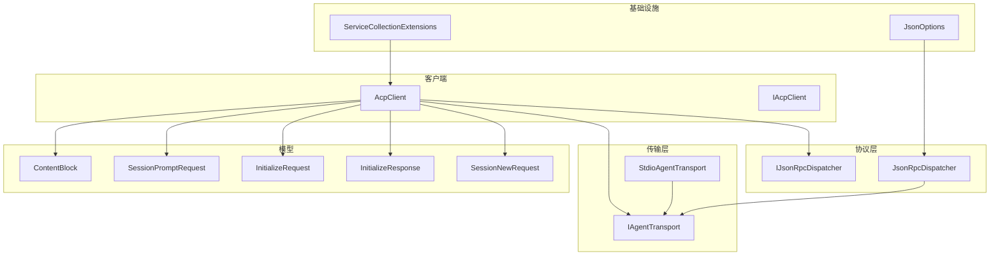
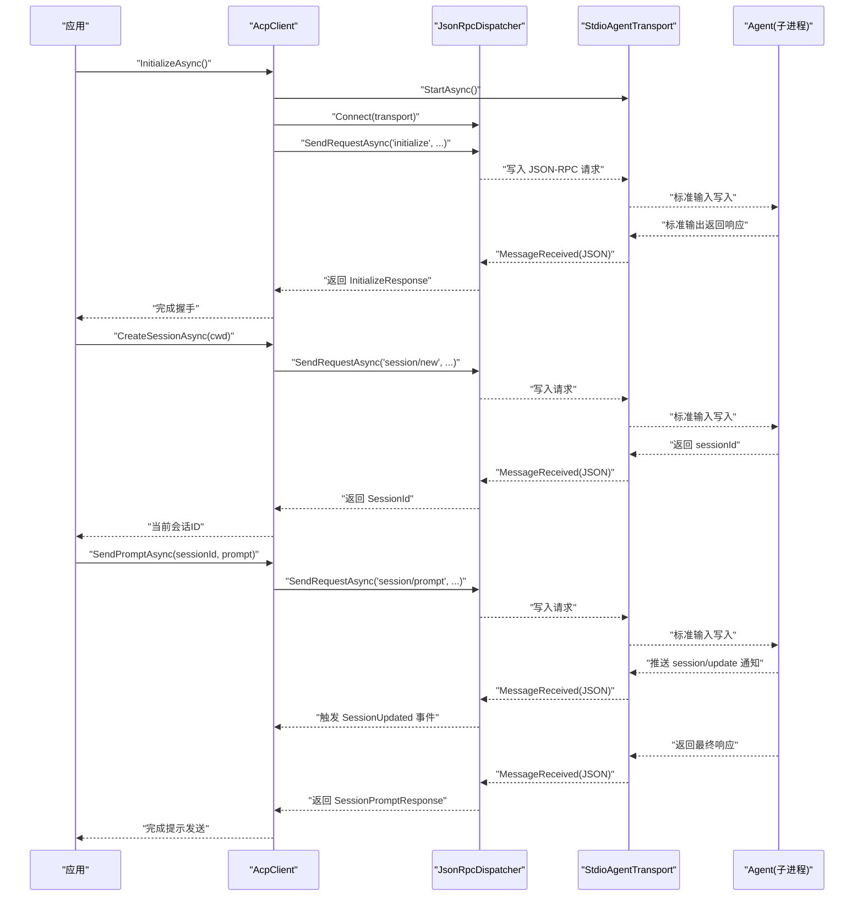
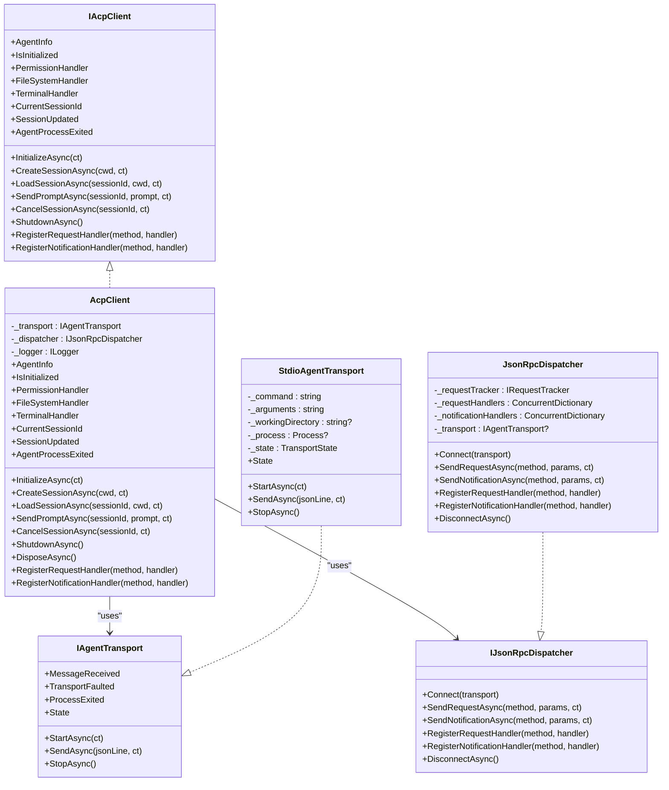
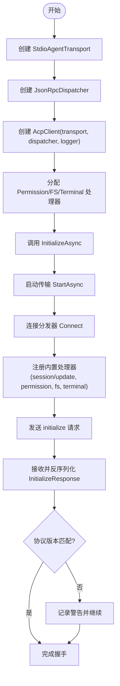
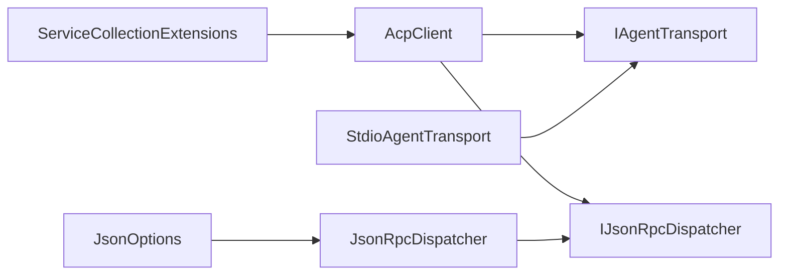

# 快速开始

<cite>
**本文引用的文件**   
- [README.md](file://README.md)
- [Agentic.ACPLibrary.csproj](file://Agentic.ACPLibrary.csproj)
- [AcpClient.cs](file://Client/AcpClient.cs)
- [IAcpClient.cs](file://Client/IAcpClient.cs)
- [StdioAgentTransport.cs](file://Transport/StdioAgentTransport.cs)
- [IAgentTransport.cs](file://Transport/IAgentTransport.cs)
- [JsonRpcDispatcher.cs](file://Protocol/JsonRpcDispatcher.cs)
- [ServiceCollectionExtensions.cs](file://Infrastructure/ServiceCollectionExtensions.cs)
- [JsonOptions.cs](file://Infrastructure/JsonOptions.cs)
- [SessionPromptRequest.cs](file://Models/SessionPromptRequest.cs)
- [InitializeRequest.cs](file://Models/InitializeRequest.cs)
- [InitializeResponse.cs](file://Models/InitializeResponse.cs)
- [SessionNewRequest.cs](file://Models/SessionNewRequest.cs)
- [ContentBlock.cs](file://Models/ContentBlock.cs)
</cite>

## 目录
1. [简介](#简介)
2. [项目结构](#项目结构)
3. [核心组件](#核心组件)
4. [架构总览](#架构总览)
5. [详细组件分析](#详细组件分析)
6. [依赖关系分析](#依赖关系分析)
7. [性能注意事项](#性能注意事项)
8. [故障排查指南](#故障排查指南)
9. [结论](#结论)
10. [附录](#附录)

## 简介
本快速开始指南面向首次使用 Agentic.ACPLibrary 的开发者，帮助你：
- 通过 NuGet 安装库并配置依赖注入
- 创建传输层、初始化客户端、建立连接、创建会话与发送提示
- 理解关键步骤：创建 StdioAgentTransport、实例化 JsonRpcDispatcher、配置 AcpClient、调用 InitializeAsync 握手、CreateSessionAsync 创建会话、SendPromptAsync 发送提示
- 处理常见错误与异常，确保示例代码可直接运行

该库基于 JSON-RPC 2.0，通过子进程标准输入输出（stdio）与符合 ACP 协议的 Agent 通信。

## 项目结构
- Client：客户端契约与实现（IAcpClient、AcpClient）
- Transport：传输抽象与 stdio 实现（IAgentTransport、StdioAgentTransport）
- Protocol：JSON-RPC 分发器与请求跟踪（IJsonRpcDispatcher、JsonRpcDispatcher、RequestTracker）
- Models：协议模型（InitializeRequest/Response、SessionNewRequest/Response、SessionPromptRequest/Response、ContentBlock 等）
- Infrastructure：DI 扩展与 JSON 序列化选项（ServiceCollectionExtensions、JsonOptions）
- JsonRpc：JSON-RPC 消息类型与转换器

图表来源
- [AcpClient.cs:12-45](file://Client/AcpClient.cs#L12-L45)
- [IAgentTransport.cs:6-28](file://Transport/IAgentTransport.cs#L6-L28)
- [StdioAgentTransport.cs:8-28](file://Transport/StdioAgentTransport.cs#L8-L28)
- [JsonRpcDispatcher.cs:9-25](file://Protocol/JsonRpcDispatcher.cs#L9-L25)
- [ServiceCollectionExtensions.cs:14-21](file://Infrastructure/ServiceCollectionExtensions.cs#L14-L21)
- [JsonOptions.cs:7-26](file://Infrastructure/JsonOptions.cs#L7-L26)
- [SessionPromptRequest.cs:6-13](file://Models/SessionPromptRequest.cs#L6-L13)
- [InitializeRequest.cs:5-15](file://Models/InitializeRequest.cs#L5-L15)
- [InitializeResponse.cs:5-18](file://Models/InitializeResponse.cs#L5-L18)
- [SessionNewRequest.cs:5-13](file://Models/SessionNewRequest.cs#L5-L13)
- [ContentBlock.cs:15-17](file://Models/ContentBlock.cs#L15-L17)

章节来源
- [README.md:1-99](file://README.md#L1-L99)
- [Agentic.ACPLibrary.csproj:1-34](file://Agentic.ACPLibrary.csproj#L1-L34)

## 核心组件
- AcpClient：ACP 客户端主入口，负责启动传输、注册处理器、握手、会话管理、发送提示与事件通知
- StdioAgentTransport：基于子进程 stdio 的传输实现，负责启动/停止 Agent 进程、读写行式 JSON 消息
- JsonRpcDispatcher：JSON-RPC 分发器，封装请求/响应、通知与自定义处理器注册
- 模型：InitializeRequest/Response、SessionNewRequest/Response、SessionPromptRequest/Response、ContentBlock 及其派生类型
- DI 扩展：ServiceCollectionExtensions 提供 AddAcpClient 注册服务
- JSON 选项：JsonOptions 统一序列化设置与转换器

章节来源
- [AcpClient.cs:12-45](file://Client/AcpClient.cs#L12-L45)
- [StdioAgentTransport.cs:8-28](file://Transport/StdioAgentTransport.cs#L8-L28)
- [JsonRpcDispatcher.cs:9-25](file://Protocol/JsonRpcDispatcher.cs#L9-L25)
- [ServiceCollectionExtensions.cs:14-21](file://Infrastructure/ServiceCollectionExtensions.cs#L14-L21)
- [JsonOptions.cs:7-26](file://Infrastructure/JsonOptions.cs#L7-L26)
- [SessionPromptRequest.cs:6-13](file://Models/SessionPromptRequest.cs#L6-L13)
- [InitializeRequest.cs:5-15](file://Models/InitializeRequest.cs#L5-L15)
- [InitializeResponse.cs:5-18](file://Models/InitializeResponse.cs#L5-L18)
- [SessionNewRequest.cs:5-13](file://Models/SessionNewRequest.cs#L5-L13)
- [ContentBlock.cs:15-17](file://Models/ContentBlock.cs#L15-L17)

## 架构总览
下图展示了从应用到 Agent 的端到端流程：应用通过 AcpClient 发起操作，经由 JsonRpcDispatcher 将 JSON-RPC 消息写入 StdioAgentTransport，后者以子进程方式与 Agent 通信；Agent 返回响应或推送 session/update 通知，由 AcpClient 触发事件。

图表来源
- [AcpClient.cs:48-182](file://Client/AcpClient.cs#L48-L182)
- [AcpClient.cs:185-216](file://Client/AcpClient.cs#L185-L216)
- [JsonRpcDispatcher.cs:27-47](file://Protocol/JsonRpcDispatcher.cs#L27-L47)
- [StdioAgentTransport.cs:30-58](file://Transport/StdioAgentTransport.cs#L30-L58)

## 详细组件分析

### 安装与依赖注入
- 包名与版本：参见项目文件中的 PackageId 与 VersionPrefix
- 目标框架：net10.0
- 依赖项：Microsoft.Extensions.DependencyInjection.Abstractions、System.Text.Json、Microsoft.Extensions.Logging.Abstractions

安装步骤（NuGet）
- 在项目中添加对 ShihaoShen.Agentic.ACPLibrary 的引用
- 若使用 .NET CLI：dotnet add package ShihaoShen.Agentic.ACPLibrary
- 或在 Visual Studio 中通过“管理 NuGet 程序包”搜索并安装

依赖注入设置
- 使用 ServiceCollectionExtensions.AddAcpClient 注册 AcpClient 及相关服务
- 典型用法：services.AddAcpClient()
- 之后可从 DI 容器解析 IServiceProvider 获取 AcpClient 实例

章节来源
- [Agentic.ACPLibrary.csproj:1-34](file://Agentic.ACPLibrary.csproj#L1-L34)
- [ServiceCollectionExtensions.cs:14-21](file://Infrastructure/ServiceCollectionExtensions.cs#L14-L21)

### 基础配置与处理器
- 权限处理器：IPermissionHandler（用于 session/request_permission）
- 文件系统处理器：IFileSystemHandler（用于 fs/read_text_file、fs/write_text_file）
- 终端处理器：ITerminalHandler（用于 terminal/*）
- 在 InitializeAsync 之前为 AcpClient 的 PermissionHandler、FileSystemHandler、TerminalHandler 赋值

章节来源
- [README.md:35-51](file://README.md#L35-L51)
- [AcpClient.cs:22-29](file://Client/AcpClient.cs#L22-L29)

### 创建传输层与初始化客户端
- 创建 StdioAgentTransport：传入可执行命令、参数与工作目录
- 创建 JsonRpcDispatcher：默认实现即可
- 创建 AcpClient：传入 transport、dispatcher 与可选 logger
- 调用 InitializeAsync：启动传输、连接分发器、注册内置处理器、发送 initialize 请求并完成握手

章节来源
- [StdioAgentTransport.cs:23-28](file://Transport/StdioAgentTransport.cs#L23-L28)
- [JsonRpcDispatcher.cs:16-19](file://Protocol/JsonRpcDispatcher.cs#L16-L19)
- [AcpClient.cs:40-45](file://Client/AcpClient.cs#L40-L45)
- [AcpClient.cs:48-182](file://Client/AcpClient.cs#L48-L182)

### 建立连接与握手
- InitializeAsync 内部会：
  - 启动传输（StartAsync）
  - 连接分发器（Connect）
  - 订阅进程退出事件（ProcessExited）
  - 注册 session/update 通知处理器
  - 注册权限、文件系统与终端处理器
  - 发送 initialize 请求并反序列化为 InitializeResponse
  - 检查协议版本并记录日志

章节来源
- [AcpClient.cs:48-182](file://Client/AcpClient.cs#L48-L182)
- [InitializeRequest.cs:5-15](file://Models/InitializeRequest.cs#L5-L15)
- [InitializeResponse.cs:5-18](file://Models/InitializeResponse.cs#L5-L18)

### 创建会话与发送提示
- CreateSessionAsync：发送 session/new 请求，返回 sessionId 并保存为 CurrentSessionId
- SendPromptAsync：发送 session/prompt 请求，携带 List<ContentBlock> 作为提示内容；流式更新通过 SessionUpdated 事件推送

章节来源
- [AcpClient.cs:185-216](file://Client/AcpClient.cs#L185-L216)
- [SessionNewRequest.cs:5-13](file://Models/SessionNewRequest.cs#L5-L13)
- [SessionPromptRequest.cs:6-13](file://Models/SessionPromptRequest.cs#L6-L13)
- [ContentBlock.cs:15-17](file://Models/ContentBlock.cs#L15-L17)

### 事件与扩展
- SessionUpdated：每次收到 session/update 通知时触发，可用于流式文本、工具调用等
- AgentProcessExited：当 Agent 进程退出时触发，参数为退出码
- 自定义处理器：可通过 RegisterRequestHandler 与 RegisterNotificationHandler 注册自定义方法

章节来源
- [AcpClient.cs:31-35](file://Client/AcpClient.cs#L31-L35)
- [AcpClient.cs:243-248](file://Client/AcpClient.cs#L243-L248)

### 类图（代码级）

图表来源
- [IAcpClient.cs:9-58](file://Client/IAcpClient.cs#L9-L58)
- [AcpClient.cs:12-45](file://Client/AcpClient.cs#L12-L45)
- [IAgentTransport.cs:6-28](file://Transport/IAgentTransport.cs#L6-L28)
- [StdioAgentTransport.cs:8-28](file://Transport/StdioAgentTransport.cs#L8-L28)
- [JsonRpcDispatcher.cs:9-25](file://Protocol/JsonRpcDispatcher.cs#L9-L25)

### 流程图（初始化握手）

图表来源
- [AcpClient.cs:48-182](file://Client/AcpClient.cs#L48-L182)

## 依赖关系分析
- AcpClient 依赖 IAgentTransport 与 IJsonRpcDispatcher
- StdioAgentTransport 实现 IAgentTransport，负责子进程生命周期与 IO
- JsonRpcDispatcher 实现 IJsonRpcDispatcher，负责 JSON-RPC 消息路由与请求跟踪
- ServiceCollectionExtensions 将 AcpClient 与相关服务注册到 DI 容器
- JsonOptions 提供统一的 System.Text.Json 配置与转换器

图表来源
- [AcpClient.cs:12-45](file://Client/AcpClient.cs#L12-L45)
- [StdioAgentTransport.cs:8-28](file://Transport/StdioAgentTransport.cs#L8-L28)
- [JsonRpcDispatcher.cs:9-25](file://Protocol/JsonRpcDispatcher.cs#L9-L25)
- [ServiceCollectionExtensions.cs:14-21](file://Infrastructure/ServiceCollectionExtensions.cs#L14-L21)
- [JsonOptions.cs:7-26](file://Infrastructure/JsonOptions.cs#L7-L26)

章节来源
- [AcpClient.cs:12-45](file://Client/AcpClient.cs#L12-L45)
- [StdioAgentTransport.cs:8-28](file://Transport/StdioAgentTransport.cs#L8-L28)
- [JsonRpcDispatcher.cs:9-25](file://Protocol/JsonRpcDispatcher.cs#L9-L25)
- [ServiceCollectionExtensions.cs:14-21](file://Infrastructure/ServiceCollectionExtensions.cs#L14-L21)
- [JsonOptions.cs:7-26](file://Infrastructure/JsonOptions.cs#L7-L26)

## 性能注意事项
- 传输层采用行式读取与异步任务，避免阻塞线程；建议合理设置取消令牌以避免长时间等待
- JSON 序列化使用 System.Text.Json 并启用忽略空值与大小写不敏感，减少无效字段与提升兼容性
- 事件驱动的消息处理（SessionUpdated）适合流式场景，避免频繁轮询
- 在大规模并发下，注意 AcpClient 的生命周期与资源释放（ShutdownAsync/DisposeAsync）

[本节为通用指导，无需特定文件来源]

## 故障排查指南
常见问题与建议
- 未分配处理器导致权限/文件/终端请求失败
  - 现象：权限请求返回 Cancelled，文件系统或终端请求返回“不可用”
  - 解决：在 InitializeAsync 前为 PermissionHandler、FileSystemHandler、TerminalHandler 赋值
- 传输未启动或已停止
  - 现象：调用 SendAsync 抛出“传输未运行”异常
  - 解决：确保先调用 InitializeAsync（内部会 StartAsync），并在 ShutdownAsync 后不再发送消息
- 协议版本不匹配
  - 现象：InitializeAsync 返回警告日志
  - 解决：确认 Agent 与客户端协议版本一致（当前客户端为 v1）
- 进程意外退出
  - 现象：AgentProcessExited 事件触发
  - 解决：监听事件并记录退出码，必要时重启传输或重新初始化

章节来源
- [AcpClient.cs:74-99](file://Client/AcpClient.cs#L74-L99)
- [AcpClient.cs:102-144](file://Client/AcpClient.cs#L102-L144)
- [AcpClient.cs:250-358](file://Client/AcpClient.cs#L250-L358)
- [AcpClient.cs:176-179](file://Client/AcpClient.cs#L176-L179)
- [StdioAgentTransport.cs:61-68](file://Transport/StdioAgentTransport.cs#L61-L68)
- [StdioAgentTransport.cs:137-145](file://Transport/StdioAgentTransport.cs#L137-L145)

## 结论
通过本快速开始，你已掌握：
- 如何安装与配置 Agentic.ACPLibrary
- 如何使用依赖注入简化服务注册
- 如何创建传输层、初始化客户端、握手、创建会话与发送提示
- 如何处理事件与扩展点
- 如何排查常见问题与异常

建议在生产环境中：
- 始终为处理器提供健壮的实现
- 合理使用取消令牌与超时
- 监听进程退出事件并做好恢复策略

[本节为总结性内容，无需特定文件来源]

## 附录
- API 概览与模型说明请参考 README 中的“API Overview”与“Models”部分
- 如需扩展自定义方法，参考“Extensibility”章节中的注册处理器示例

章节来源
- [README.md:72-99](file://README.md#L72-L99)